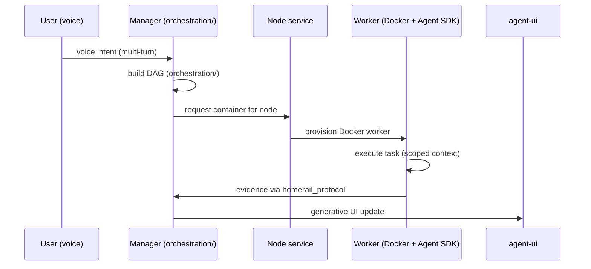
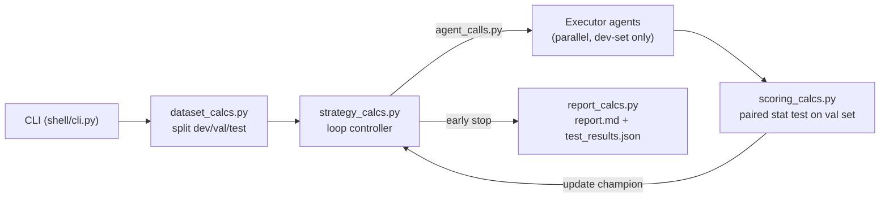
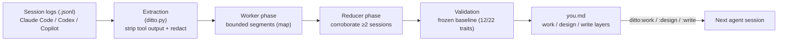
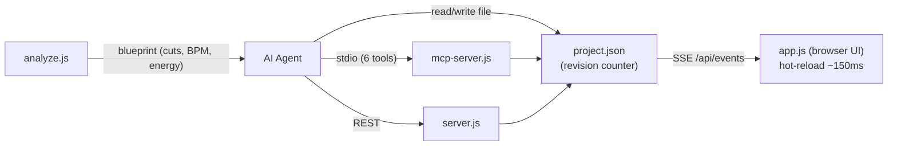

# Weekly Agentic AI Scan — 2026-07-12

**Phạm vi:** repos mới publish hoặc active-push trong 7 ngày qua (2026-07-05 → 2026-07-12), stars > 100–200, có kiến trúc/insight đọc được từ code chứ không chỉ marketing.

## Executive summary

- 4 repo đáng đào sâu tuần này, chia làm 2 nhóm rõ rệt: **orchestration runtime cho multi-agent** (HomeRail — DAG execution trên Docker) và **framework methodology** (RigorLoop — dev/val/test split thống kê cho agentic loops; Ditto — pipeline map-reduce khai thác log để build agent profile). FableCut là case thú vị về "state-as-interface" (JSON file làm giao diện điều khiển agent).
- Pattern lặp lại đáng chú ý: cả RigorLoop lẫn Ditto đều tách rõ **"pure core / side-effecting shell"** (`core/` chỉ tính toán, `shell/` gọi model và I/O) — một kỷ luật kiến trúc tốt hiếm thấy ở repo agentic thường thấy.
- **Loại khỏi danh sách:** `Nanako0129/pilotfish` (360 sao, cao nhất trong pool tuần này) — sau khi đọc code thì đây chỉ là tập file Markdown/JSON config cho Claude Code (không có `/src`, không compile code nào), đúng dạng "prompt-engineering framework trá hình" mà filter yêu cầu loại. Đáng chú ý hơn: README của nó mô tả một agent role tên `security-executor` với mục đích nêu rõ là "bypass frontier classifier refusals" — tự nhận là dùng để né bộ lọc an toàn của model. Ghi nhận lại đây như một tín hiệu cần theo dõi, không đưa vào phân tích kiến trúc.

## Mục lục

1. [HomeRail — DAG agent orchestration runtime](#homerail)
2. [RigorLoop — statistically-sound agentic loop framework](#rigorloop)
3. [Ditto — log-mining agent profile builder](#ditto)
4. [FableCut — AI-drivable video editor qua JSON timeline + MCP](#fablecut)

---

## 1. HomeRail — DAG agent orchestration runtime {#homerail}

**Repo:** [`xiaotianfotos/homerail`](https://github.com/xiaotianfotos/homerail)

### §1 — Quick context

Runtime orchestration DAG cho nhiều agent, điều khiển bằng giọng nói, chạy trên home server/NAS. Tech stack: TypeScript (75.6%) + Vue (22.9%) cho `agent-ui`, Docker cho cô lập worker, tương thích Claude Agent SDK. Repo health: 453 sao, 108 fork, nhưng **chỉ 1 contributor** (tác giả), 5 PR mở, 2 issue mở, không thấy test suite rõ ràng trong phần cấu trúc lấy được (có `.github/` workflow). Repo mới tạo 2026-07-07, push liên tục tới 2026-07-12 — đang phát triển rất nhanh.

### §2 — Architecture deep-dive

**A. Component inventory**
- `Manager` (`homerail_manager/src/orchestration/`) — service điều phối DAG, chứa logic build/run graph.
- `Worker coordinator` (`homerail_manager/src/worker/`) — theo dõi worker trong Manager.
- `Node service` (`homerail_manager/src/node/`, gói `homerail_node/`) — cấp phát Docker container cho Worker.
- `Worker runtime` (`homerail_worker/`, có `Dockerfile`) — harness thực thi tương thích Claude Agent SDK, chạy cô lập trong container.
- `Protocol` (`homerail_protocol/`) — hợp đồng message dùng chung, có `fixtures/`, `src/`, `tests/`.
- `Event bus` (`homerail_manager/src/events/`) — không xác định chi tiết cơ chế publish/subscribe từ nội dung fetch được, chỉ xác nhận có tồn tại thư mục.
- `Persistence` (`homerail_manager/src/persistence/`) — lưu trạng thái run để hỗ trợ replay (README xác nhận tính năng "replay capability").
- `CLI` (`homerail_cli/`, lệnh `hr`) — `start/config/doctor/run/smoke/dag supervise/scorecard/eval-run/replay`.
- `agent-ui` — giao diện Vue nhận generative UI thay vì raw log.
- `Skills` (`skills/`) — không xác định nội dung chi tiết từ code fetch được.

**B. Control flow — DAG runtime (state machine/graph), không phải ReAct loop đơn.** Happy path:
1. User ra lệnh bằng giọng nói → Manager (voice surface với ASR/VAD) parse thành intent đa lượt.
2. `orchestration/` build DAG các node task, mỗi node gán model riêng (premium cho planning/review, rẻ hơn cho execution).
3. Manager gọi Node service để provision Docker container cho từng Worker cần chạy.
4. Worker chạy trong container cô lập, dùng Claude Agent SDK, chỉ nhận context cần thiết của node đó (không phải toàn bộ lịch sử).
5. Worker trả evidence về Manager qua `homerail_protocol` contract; Manager cập nhật trạng thái DAG, ghi persistence để hỗ trợ replay.
6. Manager render kết quả thành generative UI (không phải raw log) gửi tới `agent-ui`.

**C. State & data flow.** Message format: typed contract qua `homerail_protocol` (không xác định schema cụ thể — không có nội dung file fetch được). State storage: `~/.homerail` local (config `HOMERAIL_HOME`), có persistence layer riêng cho DAG run — không xác định rõ là SQLite/file JSON từ code đọc được. Context window: mỗi DAG node nhận scoped context riêng theo thiết kế ("The expensive model should not do everything"), không phải toàn bộ hội thoại — đây là chiến lược context-partitioning theo node thay vì sliding window/summarize truyền thống.

**D. Tool/capability integration.** Không xác định rõ cơ chế register tool cụ thể (function-calling native vs custom) từ nội dung fetch được — README chỉ nói tương thích "Claude Agent SDK or compatible endpoints", nghĩa là tool-calling thừa hưởng từ SDK đó chứ không tự implement riêng.

**E. Memory.** Không xác định rõ kiến trúc memory dài hạn từ evidence — chỉ có "assets (orchestration templates and profiles)", có thể là template reuse chứ không phải vector/long-term memory thật.

**F. Model orchestration.** Xác nhận rõ: mỗi agent trong DAG có thể gán model riêng qua template — "premium models for planning/review, efficient models for execution". Không xác định fallback/parallelism chi tiết.

**G. Observability & eval.** CLI có sẵn `scorecard` và `eval-run` — cho thấy có built-in eval hook, cùng `replay` để tái tạo run cũ. Không xác định có OpenTelemetry/Langfuse hay tracing chuẩn nào.

**H. Extension points.** Worker chạy Docker container riêng → về nguyên tắc cho phép cắm bất kỳ runtime nào tương thích Claude Agent SDK; CLI + `dag supervise` cho phép cấu hình workflow mới, nhưng cơ chế plugin cụ thể không xác định từ code fetch được.

### §3 — Architecture diagram

### §4 — Verdict

**Novel:** context-partitioning theo từng DAG node (mỗi worker chỉ thấy phần việc của nó, không phải toàn bộ session) kết hợp per-node model routing — đúng bài toán "cost vs context bloat" mà nhiều multi-agent framework né tránh. CLI có `eval-run`/`scorecard`/`replay` sẵn built-in là dấu hiệu production-thinking hiếm gặp ở repo 1 tuần tuổi.
**Red flag:** chỉ 1 contributor, 453 sao trong 5 ngày là tốc độ tăng trưởng bất thường cho 1 dev solo — cần xem review/traction có organic không trước khi tin tưởng production. Không thấy test suite rõ trong phần fetch được.
**Cần đào sâu:** schema thực tế của `homerail_protocol`, cơ chế event bus trong `events/`, và liệu "replay" có thực sự deterministic hay chỉ replay log.

---

## 2. RigorLoop — statistically-sound agentic loop framework {#rigorloop}

**Repo:** [`ronikobrosly/RigorLoop`](https://github.com/ronikobrosly/RigorLoop)

### §1 — Quick context

Framework Python đóng gói agentic loop cho bài toán data-transformation (extraction, classification, reformatting), với kỷ luật dev/validation/test split để tránh overfitting vào ví dụ. Stack: Python ≥3.12 (99.5%), gọi `claude -p` (Claude CLI) làm agent, không phụ thuộc framework agent nào khác. Repo health: 122 sao, 0 fork, license MIT, có `tests/`, `CONTRIBUTING.md`, `CODING_STYLE.md`, `.github/` CI — dấu hiệu engineering nghiêm túc dù còn nhỏ.

### §2 — Architecture deep-dive

**A. Component inventory**
- `CLI entry point` (`src/rigorloop/shell/cli.py`) — lệnh `rigorloop init/check/run`.
- `Agent invocation layer` (`src/rigorloop/shell/agent_calls.py`) — side-effecting, gọi `claude -p` headless tool-less cho cả strategy agent lẫn executor agents.
- `I/O actions` (`src/rigorloop/shell/io_actions.py`) — đọc/ghi file, không xác định chi tiết thêm.
- `Strategy logic` (`src/rigorloop/core/strategy_calcs.py`) — logic điều hướng loop (pure, không side-effect — nằm trong `core/`).
- `Dataset splitting` (`src/rigorloop/core/dataset_calcs.py`) — chia dev/validation/test, có "split fingerprinting" chống reshuffle khi resume run.
- `Scoring/validation harness` (`src/rigorloop/core/scoring_calcs.py`) — statistical testing (paired test, confidence interval) để phân biệt cải thiện thật với nhiễu.
- `Prompt construction` (`src/rigorloop/core/prompt_calcs.py`) — build prompt cho building agents (mặc định 30 dev example/loop, resampled).
- `Report generation` (`src/rigorloop/core/report_calcs.py`) — xuất `report.md` + `test_results.json`.
- `Config handling` (`src/rigorloop/core/config_calcs.py`) — đọc `rigorloop.toml`.

**B. Control flow — Planner-executor lặp có gate thống kê (không phải ReAct, không phải graph/state-machine).** Happy path:
1. `rigorloop init` scaffold `task.md`, `examples.jsonl`, `rigorloop.toml`.
2. `rigorloop run` → `dataset_calcs.py` chia dev/validation/test (~60/20/20), fingerprint để tránh reshuffle khi resume.
3. Strategy agent (qua `agent_calls.py`, model mặc định Sonnet 5) chỉ đạo nhiều executor agent chạy song song, mỗi executor chỉ thấy dev set để build candidate solution (script/skill/guidance).
4. Tại mỗi checkpoint, một cohort candidate precommitted (top dev candidate + 1 "diverse alternative") được đánh giá trên validation set qua `scoring_calcs.py` — dùng paired statistical test, không so raw score.
5. Loop controller (`strategy_calcs.py`) cập nhật "validation champion", áp dụng early-stopping theo patience threshold hoặc khi confidence-interval dưới của validation score vượt target.
6. Kết thúc: test set được chấm đúng **một lần duy nhất**, `report_calcs.py` xuất report kèm confidence interval.

**C. State & data flow.** Message format giữa agent và harness: JSON/text qua CLI call tới Claude, không phải typed schema nội bộ phức tạp. State lưu trên filesystem (`runs/<run_id>/final/`), không dùng DB/vector store. Context window: mỗi lần gọi executor chỉ nhúng dev example resampled theo batch (mặc định 30), không phải toàn bộ dataset — đây là chiến lược "batched sampling" hơn là summarize/RAG.

**D. Tool/capability integration.** Không có tool-calling model-side — agent chạy ở chế độ **headless, tool-less** (`claude -p` không bật tool use); toàn bộ "hành động" là sinh code/text, harness Python thực thi kết quả (script) hoặc gọi lại model để evaluate (skill/guidance). Validation/sandbox: script và `custom_python` check chạy subprocess có timeout + output cap — README tự nhận đây là "guardrails, không phải security boundary".

**E. Memory.** Không có long-term memory — mỗi loop độc lập, chỉ dev-set resampling đóng vai trò "context" cho executor. Không xác định caching cross-run ngoài split fingerprinting.

**F. Model orchestration.** Toàn bộ agent (strategy + executor) dùng cùng 1 model (mặc định Claude Sonnet 5, cấu hình được) — không phân tầng model theo vai trò như HomeRail. Concurrency: nhiều executor chạy song song trong 1 loop (`executors_per_loop` trong config).

**G. Observability & eval.** Đây là điểm mạnh nhất repo: eval là first-class, không phải phụ. `rigorloop check` ước lượng token budget trước khi chạy (không tốn phí); output có `report.md` (confidence interval, per-check breakdown) + `test_results.json` machine-readable. Không thấy tracing kiểu OpenTelemetry/Langfuse — eval framework tự viết.

**H. Extension points.** Check type mở rộng được: exact match, normalized match, JSON equality, regex, numeric tolerance, **custom Python**, **LLM judge** — khai báo qua `rigorloop.toml`. Solution kind chọn được: script/skill/guidance, đánh đổi cost vs khả năng biểu đạt.

### §3 — Architecture diagram

### §4 — Verdict

**Novel:** đây là repo hiếm hoi coi **eval methodology** là kiến trúc trung tâm chứ không phải afterthought — dev/validation/test split với statistical significance test (paired, confidence interval) áp dụng cho *agentic* loop là insight thật, không phải slogan. Tách `core/` (pure, testable) khỏi `shell/` (side-effect, gọi model/CLI) là kỷ luật engineering đáng học, hiếm thấy ở repo agent thường "một file làm hết".
**Red flag:** phụ thuộc cứng vào Claude CLI (`claude -p`) — không portable sang model khác trực tiếp; README tự thừa nhận sandbox chỉ là guardrail, không phải security boundary khi chạy code sinh ra trên máy user.
**Cần đào sâu:** nội dung `scoring_calcs.py` cụ thể dùng test thống kê nào (t-test? bootstrap?), và liệu "diverse alternative" trong cohort được chọn theo tiêu chí gì.

---

## 3. Ditto — log-mining agent profile builder {#ditto}

**Repo:** [`ohad6k/ditto`](https://github.com/ohad6k/ditto)

### §1 — Quick context

Công cụ khai thác log Claude Code/Codex/Copilot CLI để tự sinh hồ sơ `you.md` mô tả phong cách làm việc thật, nạp lại cho agent ở phiên sau. Stack: Python, **zero dependency (stdlib-only)**, phân phối qua `npx skills add`. Repo health: 108 sao, 11 fork, MIT, có `tests/` + GitHub Actions CI, 4 release (mới nhất v0.2.0, 2026-07-11) — nhỏ nhưng có kỷ luật release/test rõ ràng.

### §2 — Architecture deep-dive

**A. Component inventory** (toàn bộ pipeline nằm trong 1 file `ditto.py`, single-file/stdlib-only — không có module tách riêng, nên các stage dưới đây là logical component bên trong cùng 1 file, không phải file riêng biệt):
- `Extraction stage` (`ditto.py`) — parse `.jsonl` log, strip tool output, redact trước khi cache.
- `Worker phase` (`ditto.py`, prompt định nghĩa ở `MINING_PROMPT.md`) — phân tích độc lập từng segment log bounded (map).
- `Reducer phase` (`ditto.py`, cùng `MINING_PROMPT.md`) — gộp pattern, yêu cầu corroboration ≥2 session (reduce).
- `Validation stage` (`ditto.py`, baseline trong `tests/`) — so khớp frozen baseline, yêu cầu tối thiểu 12/22 trait recover đúng.
- `Skills bootstrap` (`skills/`, gồm `ditto:mine`, `ditto:work`, `ditto:design`, `ditto:write`) — cơ chế nạp profile theo layer, contextual theo loại task.
- `Codex plugin` (`.codex-plugin/`) — tích hợp native cho Codex.

**B. Control flow — Pipeline dạng map-reduce theo batch, không phải ReAct/agent loop tương tác.** Happy path:
1. Extraction: parse file `.jsonl` log phiên làm việc, giữ lại **chỉ message user tự viết**, loại bỏ tool output và loại luôn tài liệu curated (CLAUDE.md/AGENTS.md) vì coi là "unreliable evidence".
2. Redaction chạy trước khi cache — best-effort privacy trước khi bất kỳ text nào rời máy.
3. Worker phase: các đoạn log được chia thành segment bounded, mỗi segment phân tích độc lập (map).
4. Reducer phase: gộp pattern từ các worker, chỉ giữ pattern **corroborated bởi ≥2 session riêng biệt** (reduce có ngưỡng đồng thuận).
5. Validation: so khớp với frozen baseline test, xác nhận tối thiểu 12/22 trait bắt buộc phục hồi đúng trước khi coi profile đáng tin.
6. Output: `you.md` chia 3 layer (work/design/writing); agent nạp đúng layer theo loại task qua skill tương ứng (`ditto:work` v.v.).

**C. State & data flow.** Input là raw `.jsonl` session log (dict có cấu trúc theo từng CLI nguồn). Cache: segment không đổi được skip khi re-run (incremental — chỉ phần log mới bị re-process). Không có DB/vector store — toàn bộ output là file Markdown tĩnh (`you.md`), không phải retrieval runtime.

**D. Tool/capability integration.** Không có tool-calling trong nghĩa agent gọi tool ngoài — bản thân Ditto *là* một tiền xử lý chạy trước khi agent khác bắt đầu; nó không điều khiển tool nào, chỉ sinh context nạp sẵn. Cài đặt qua `npx skills add` hoặc `codex plugin add` — cơ chế "skill" của Claude Code/Codex, không phải MCP.

**E. Memory architecture — đây chính là trọng tâm repo.** Short-term vs long-term: rõ ràng phân biệt "memory" (điều user tự viết ra, ví dụ CLAUDE.md) khỏi "mined pattern" (điều hành vi thực tế chứng minh qua ≥2 session) — coi loại sau đáng tin hơn loại đầu. Compaction: segment hoá + cache theo hash để tránh re-mine toàn bộ lịch sử mỗi lần. Retrieval: không phải vector/embedding — là rule-based corroboration (đếm số session độc lập xác nhận 1 pattern), thiết kế **fail-closed**: pattern không đủ bằng chứng thì bị loại bỏ thay vì suy diễn thêm.

**F. Model orchestration.** Worker và reducer phase gọi model (không xác định model cụ thể mặc định từ nội dung fetch được) theo 2 "quality tier": full-history mining (recall cao hơn, tốn hơn) vs quick-preview (sampling giới hạn, rẻ hơn) — README có nói minh bạch chi phí token trước khi chạy và chờ approval.

**G. Observability & eval.** Có validation stage tự động với frozen baseline (đo được bao nhiêu trait recover đúng — 12/22) — đây là một dạng regression test cho chính pipeline mining, khá hiếm ở tool loại này. `ditto.py --card` xuất profile dạng "shareable card" có kèm evidence, tăng khả năng audit thủ công.

**H. Extension points.** Hỗ trợ nhiều nguồn log (Claude Code, Codex, Copilot CLI) và nhiều điểm tích hợp agent (Codex native plugin đã "proven locally", Claude Code qua skill bootstrap, Cursor/Gemini qua adapter riêng, Claude native plugin **chưa có** — README tự liệt kê rõ cái gì chưa làm được thay vì im lặng).

### §3 — Architecture diagram

### §4 — Verdict

**Novel:** phân biệt tường minh "explicit memory" (điều user viết ra, dễ curated/thiên vị) khỏi "mined implicit pattern" (điều hành vi chứng minh, cần ≥2 session corroborate) là một góc nhìn về agent memory ít thấy — hầu hết framework memory (RAG, vector store) chỉ quan tâm *lưu gì*, Ditto quan tâm *tin gì*. Việc có frozen-baseline validation cho chính pipeline mining (không phải chỉ validate output cuối) là kỷ luật eval hiếm ở một tool 108 sao.
**Red flag:** "Proven results" trong README dựa trên đúng 1 case study (1 bài Reddit đạt 168 upvote/88K view) — cỡ mẫu quá nhỏ để kết luận tool "genuinely improve output quality"; đây là overclaim cần đọc với hoài nghi. Model cụ thể dùng cho worker/reducer phase không công khai rõ trong README.
**Cần đào sâu:** thuật toán corroboration cụ thể (threshold 2 session là cố định hay cấu hình được?), và cơ chế redaction "best-effort" mạnh tới đâu trước khi text rời máy tới model provider.

---

## 4. FableCut — AI-drivable video editor qua JSON timeline + MCP {#fablecut}

**Repo:** [`ronak-create/FableCut`](https://github.com/ronak-create/FableCut)

### §1 — Quick context

Video editor chạy trong browser, zero npm dependency, cho phép cả người lẫn AI agent chỉnh sửa qua cùng một file `project.json`. Stack: JavaScript thuần (88.1%) + CSS/HTML, Node 18+, ffmpeg optional cho export, MediaPipe cho background removal. Repo health: 341 sao, 23 fork, MIT, release mới nhất v1.3.0 (2026-07-09), 5 issue mở, không thấy test suite trong file listing lấy được (không có thư mục `tests/`).

### §2 — Architecture deep-dive

**A. Component inventory**
- `HTTP/REST server` (`server.js`) — REST API (`GET/PUT /api/project`, `POST /api/upload`, `GET /api/library`), Server-Sent Events tại `/api/events`, và pipeline export dùng ffmpeg.
- `Editor engine` (`app.js`) — UI timeline, compositor (Canvas), keyframe animation, text/caption engine, xử lý chroma key, rasterize SVG.
- `MCP server` (`mcp-server.js`) — expose 6 tool qua stdio protocol cho Claude Code/Desktop: `fablecut_status`, `fablecut_docs`, `fablecut_get_project`, `fablecut_set_project`, `fablecut_patch_project`, `fablecut_import_media`, `fablecut_analyze_reference`.
- `Reference analyzer` (`analyze.js`) — trích shot boundary, tempo/BPM nhạc, loudness curve, energy per shot từ video mẫu.
- `Project state` (`project.json`) — **chính là interface**: mô tả toàn bộ media, clip, track, effect, keyframe, transition; có revision counter để chống ghi đè.
- `Agent manual` (`CLAUDE.md`) — tài liệu schema + recipe dành riêng cho agent đọc, đi kèm code (đúng tiêu chí "technical writeup trong repo").

**B. Control flow — State-as-interface (không phải ReAct/planner-executor cổ điển) — agent thao tác trực tiếp lên 1 shared state document qua 3 control surface song song.** Happy path (agent-driven edit):
1. Agent kết nối MCP server (`mcp-server.js`) qua stdio, hoặc gọi REST, hoặc đọc/ghi file trực tiếp — 3 cách tương đương.
2. Agent gọi `fablecut_get_project` (hoặc `GET /api/project`) để đọc toàn bộ `project.json` hiện tại.
3. Agent tính toán chỉnh sửa (ví dụ: "cắt theo beat marker, thêm color grade, thêm caption") và gọi `fablecut_patch_project`/`fablecut_set_project` (hoặc `PUT /api/project`), kèm bump `revision`.
4. `server.js` kiểm tra revision — nếu conflict, trả HTTP 409 thay vì ghi đè âm thầm.
5. `server.js` broadcast thay đổi qua SSE (`/api/events`); UI (`app.js`) hot-reload trong ~150ms.
6. Với remix từ video mẫu: agent gọi `fablecut_analyze_reference` → `analyze.js` trả blueprint (shot cuts, BPM, energy curve) → agent dùng blueprint đó để dựng lại cấu trúc edit trên footage mới.

**C. State & data flow.** Message format: JSON thuần theo schema `project.json` — không có typed schema layer riêng (không TypeScript, dự án JS thuần). State storage: file JSON trên đĩa (không DB), đồng bộ qua SSE tới mọi client đang mở. Không có context-window management vì đây không phải LLM-context problem — toàn bộ "ngữ cảnh" của agent chính là nội dung `project.json` hiện tại, đọc/ghi trực tiếp thay vì tích lũy hội thoại.

**D. Tool/capability integration.** Cơ chế MCP native (`mcp-server.js`, stdio) là control surface chính cho Claude; REST là surface tổng quát cho mọi client khác; file-based là surface thấp nhất (đọc/ghi file trực tiếp, UI tự hot-reload theo revision). Validation: revision counter chống conflict (409 khi ghi trùng), nhưng không thấy schema validation (JSON Schema/Zod) nào được đề cập cho chính `project.json` — rủi ro agent ghi payload sai schema mà không bị chặn ở tầng server.

**E. Memory.** Không áp dụng — không có bộ nhớ hội thoại/agent riêng, "trạng thái" chính là project file, không có short/long-term memory tách biệt.

**F. Model orchestration.** Không xác định từ code — FableCut không tự gọi LLM nào; nó chỉ là target tool cho agent bên ngoài (Claude Code/Desktop) gọi vào. Không có multi-model routing nội bộ.

**G. Observability & eval.** Không thấy tracing/eval hook nào trong phần fetch được; log chủ yếu là console qua SSE. Không có thư mục `tests/` xác nhận được.

**H. Extension points.** Người dùng/agent có thể mở rộng qua: thêm `svg` clip kind (CSS `@keyframes` animate, first-class clip type), thêm asset vào `library/` (font, SVG overlay, sound effect tự thêm), hoặc viết thêm REST client tuỳ ý vì toàn bộ state là JSON công khai schema trong `CLAUDE.md`.

### §3 — Architecture diagram

### §4 — Verdict

**Novel:** "the project file is the interface" — dùng chính file state (`project.json` + revision counter) làm giao thức đồng bộ giữa người, agent, và UI, thay vì bắt agent học API riêng — là một cách giải bài toán "agent điều khiển ứng dụng có UI" gọn hơn nhiều so với việc agent phải điều khiển UI qua browser automation (so với ví dụ `browser-mcp` cùng tuần). 3 control surface (MCP/REST/file) cùng trỏ vào 1 state document là thiết kế rõ ràng, dễ audit.
**Red flag:** không thấy schema validation nào chặn agent ghi `project.json` sai định dạng ở tầng server — cơ chế an toàn duy nhất là revision counter (chống race condition), không chống malformed write. Không có test suite xác nhận được.
**Cần đào sâu:** `CLAUDE.md` (agent manual) có định nghĩa JSON Schema chính thức cho `project.json` không, và conflict-resolution (409) có cơ chế merge/retry gợi ý cho agent hay chỉ trả lỗi thô.
