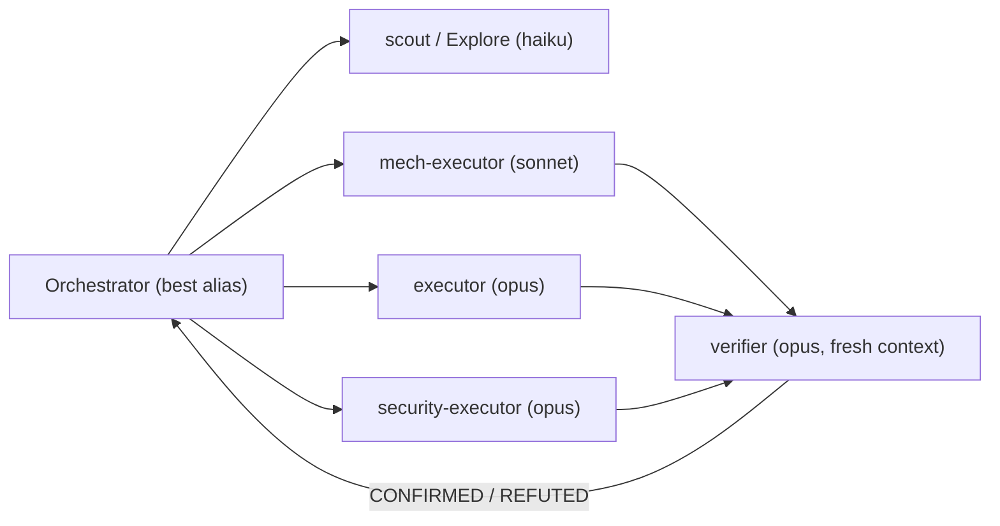
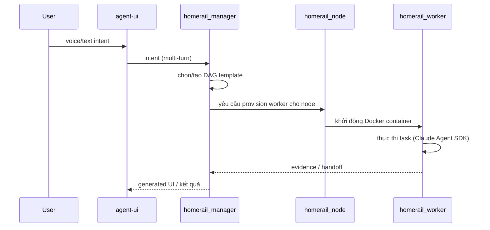
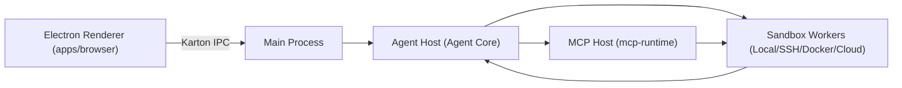
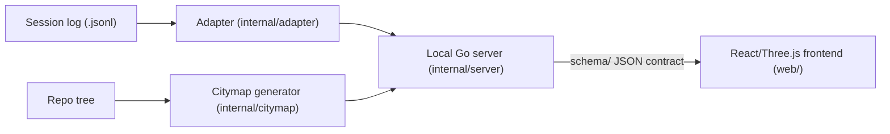

# Weekly Agentic AI Scan — 2026-07-13

**Nguồn dữ liệu:** GitHub search API (`search/repositories`, `created:>2026-07-06 stars:>200`, q=`agent OR multi-agent OR agentic`), verify chéo từng repo qua trang GitHub + README raw. Loại bỏ awesome-list, skill-pack thuần prompt engineering, và các repo không đọc được README/architecture doc.

**Executive summary:**
- Xu hướng nổi bật trong tuần: 3/4 repo được chọn xoay quanh **process isolation & policy enforcement** cho coding agent (Clodex IDE, Pilotfish) và **DAG orchestration có thể replay** (HomeRail) — cho thấy trọng tâm dịch chuyển từ "agent làm được gì" sang "agent chạy an toàn và kiểm chứng được ra sao".
- Pattern lặp lại: **fresh-context adversarial verification** (Pilotfish's `verifier` role, HomeRail's trace/replay, Mindwalk's session replay) — xác minh độc lập sau khi executor hoàn thành đang trở thành convention thay vì self-critique.
- Một điểm cần lưu ý: Pilotfish gần như không có runtime code riêng (toàn bộ là markdown config đọc bởi Claude Code) — có giá trị về mặt pattern nhưng nên phân biệt rõ với các repo có engine thực thi độc lập như HomeRail và Clodex IDE.

**Mục lục:**
1. [Pilotfish](#1-pilotfish)
2. [HomeRail](#2-homerail)
3. [Clodex IDE](#3-clodex-ide)
4. [Mindwalk](#4-mindwalk)

---

## 1. Pilotfish

**Repo:** [Nanako0129/pilotfish](https://github.com/Nanako0129/pilotfish)

### §1 — Quick Context
Lớp cấu hình multi-model routing cho Claude Code: model đắt tiền lập kế hoạch, model rẻ thực thi, verifier độc lập gác chất lượng. Tech stack: không có ngôn ngữ lập trình chính (repo là markdown templates + shell install script), chạy trên Claude Code CLI, dùng model alias Fable 5/Opus/Sonnet/Haiku. Repo health: 392 sao, 29 forks, hoạt động gần nhất 2026-07-12 (v1.1.4), không thấy CI/test suite (repo không chứa code có thể test).

### §2 — Architecture Deep-Dive

**A. Component inventory**
- `Orchestrator` (main Claude Code session, alias `"best"` trong `~/.claude/settings.json`) — điều phối, chọn effort level, phân công việc.
- `scout` / `Explore` (`templates/agents/*.md`, model `haiku`) — tra cứu read-only.
- `mech-executor` (`templates/agents/*.md`, model `sonnet`) — việc cơ học đã được đặc tả đầy đủ.
- `executor` (`templates/agents/*.md`, model `opus`) — việc cần phán đoán (feature, bugfix).
- `security-executor` (`templates/agents/*.md`, model `opus`, cố tình không dùng Fable 5) — việc nhạy cảm bảo mật.
- `verifier` (`templates/agents/*.md`, model `opus`) — xác minh đối kháng với fresh context.
- Policy block (`templates/claude-md.orchestration.md`, được merge vào `~/.claude/CLAUDE.md`) — quy tắc điều phối bằng tên role, không bao giờ dùng model ID trực tiếp.
- Install runbook (`install/AGENT-INSTALL.md`) — quy trình cài đặt idempotent qua một prompt duy nhất.

**B. Control flow — Planner-executor + verification gate**
1. Orchestrator (alias `"best"`, effort `high`) nhận task, quyết định độ phức tạp.
2. Giao việc trinh sát cho `scout`/`Explore` (haiku).
3. Giao việc cơ học đã đặc tả cho `mech-executor` (sonnet), hoặc việc cần phán đoán cho `executor`/`security-executor` (opus).
4. Executor trả kết quả.
5. `verifier` đọc kết quả với context hoàn toàn mới, cố gắng REFUTE thay vì tự phê bình, trả về CONFIRMED/REFUTED.
6. Nếu thất bại 2 lần, orchestrator escalate lên model tier cao hơn.

**C. State & data flow**
Không có message format runtime riêng — toàn bộ "state" là các file markdown/JSON được Claude Code đọc lại mỗi phiên (`settings.json`, `agents/*.md`, `CLAUDE.md`). Không có lưu trữ state động, không có context-window management strategy được tài liệu hóa — **không xác định từ code**.

**D. Tool/capability integration**
Không có tool registry riêng; Pilotfish kế thừa hoàn toàn cơ chế function-calling gốc của Claude Code. Không có sandbox/validation riêng ngoài phần review thủ công khi cài đặt.

**E. Memory** — không có evidence, bỏ qua.

**F. Model orchestration**
Đây là tính năng lõi: bảng role→model tường minh (haiku/sonnet/opus), alias `"best"` tự resolve sang Fable 5 hoặc fallback Opus, fallback chain `["opus","sonnet"]` khai báo trong `settings.json`. Effort tiering: role rẻ chạy `low` effort, main session chạy `high` effort.

**G. Observability & eval** — không thấy logging/tracing framework nào trong README — **không xác định từ code**.

**H. Extension points**
Người dùng chỉnh sửa `templates/agents/*.md` để thêm/sửa role, và policy block được merge lại một cách idempotent vào `CLAUDE.md` của họ.

### §3 — Architecture Diagram

### §4 — Verdict
**Novel:** tách biệt policy khỏi model ID bằng alias theo role — khi model frontier mới ra mắt, chỉ cần sửa một chỗ (`agents/*.md`) thay vì rà toàn bộ prompt. Verifier chạy fresh-context để refute (không self-critique) là pattern đáng học.
**Red flag:** repo không có runtime code — toàn bộ "kiến trúc" là markdown mà Claude Code diễn giải theo policy, không có cơ chế enforce trong code; độ tin cậy phụ thuộc hoàn toàn vào việc model tuân thủ chỉ dẫn.
**Open question:** chưa rõ Pilotfish đo lường hiệu quả escalation (2-strike rule) như thế nào — không có eval/benchmark nào được công bố kèm repo.

---

## 2. HomeRail

**Repo:** [xiaotianfotos/homerail](https://github.com/xiaotianfotos/homerail)

### §1 — Quick Context
Runtime điều phối multi-agent local, ưu tiên voice, chạy DAG workflow có thể trace và replay lại. Tech stack: TypeScript (76.7%), Docker cho worker isolation, tương thích Claude Agent SDK. Repo health: 491 sao, 111 forks, cấu trúc nhiều package (monorepo-style), có docs/ chi tiết; không xác nhận được CI/test từ trang repo.

### §2 — Architecture Deep-Dive

**A. Component inventory**
- `homerail_protocol` — shared message & validation contracts, nguồn sự thật duy nhất cho giao tiếp runtime.
- `homerail_manager` — coordinator trung tâm kiêm voice orchestrator, sở hữu voice surface contract và render generated-UI, thu thập intent qua nhiều lượt hội thoại.
- `homerail_node` — service cấp Docker worker container, mỗi node DAG chạy trong container riêng, workspace tại `${HOMERAIL_HOME}/workspace/<run_id>`.
- `homerail_worker` — runtime harness thực thi task (tương thích Claude Agent SDK), nhận handoff, chạy trong context window cô lập, trả evidence.
- `homerail_cli` (`hr`) — CLI: `start`, `config`, `doctor`, `run`, `smoke`, `dag supervise`, `scorecard`, `eval-run`, `replay`.
- `agent-ui` — UI trình duyệt render voice surface và generated widgets, tách biệt khỏi Manager service.
- `skills` — cơ chế discovery: Manager quét mọi thư mục `SKILL.md` dưới `${HOMERAIL_HOME}/skills` mỗi lượt, auto-install skill built-in còn thiếu.

**B. Control flow — Hierarchical DAG orchestration (Manager → Node → Worker)**
1. Người dùng nói/gõ intent qua `agent-ui`; Manager thu thập và làm rõ ý định qua nhiều lượt.
2. Manager chọn hoặc tạo DAG template (planning step), có thể lấy từ pattern library (`quorum`, `bounded ratchets`, `standing goal verification`, `planner/worker fan-out`).
3. Manager điều phối handoff giữa các agent theo edge tường minh trong DAG.
4. `homerail_node` cấp container Docker cho từng node; mỗi node chạy độc lập với context window riêng.
5. `homerail_worker` thực thi task, trả evidence ngược lại theo chuỗi handoff.
6. Mọi handoff được trace; run có thể replay và inspect lại (`hr replay`), sinh scorecard qua `hr eval-run`.

**C. State & data flow**
Message contract định nghĩa tập trung trong `homerail_protocol` (typed contract, không phải raw string). State lưu tại `${HOMERAIL_HOME}` (mặc định `~/.homerail`): state của Manager, workspace từng run, log, cache image worker. Credentials nằm trong "Manager encrypted settings store", không bao giờ trong file repo. Manager URL resolve theo thứ tự: flag `--base-url` → env `HOMERAIL_MANAGER_URL` → `${HOMERAIL_HOME}/config.json` → mặc định `http://localhost:19191`.

**D. Tool/capability integration**
Tool được biểu diễn qua DAG template với mapping `provider`/`model` theo từng agent. Skill discovery tự động qua thư mục `SKILL.md`. Manager có thể "select và instantiate catalog pattern... start workflow qua Manager tools" mà không cần shell command — cơ chế gọi tool cụ thể (function-calling native hay JSON parsing) **không xác định từ code**.

**E. Memory** — không có mô tả rõ short-term/long-term hay retrieval; chỉ có state persistence theo `run_id` ở mức workspace — **không xác định từ code** cho phần compaction/retrieval.

**F. Model orchestration**
DAG template cho phép mapping provider/model khác nhau theo từng agent (heterogeneous model per node), nhưng không có tuyên bố tường minh kiểu "planner dùng frontier, executor dùng model nhỏ hơn" — **không xác định từ code**.

**G. Observability & eval**
Mạnh nhất trong 4 repo: mọi handoff được trace, run replayable/inspectable, lệnh `hr scorecard` và `hr eval-run` sinh đánh giá chuyên biệt.

**H. Extension points**
Pattern library tái sử dụng (`quorum`, `bounded ratchets`, `standing goal verification`, `planner/worker fan-out`); thả `SKILL.md` mới vào thư mục skills; định nghĩa DAG template mới.

### §3 — Architecture Diagram

### §4 — Verdict
**Novel:** observability là first-class citizen — trace mọi handoff + replay + scorecard, không phải tính năng phụ thêm; pattern library (`quorum`, `bounded ratchets`) cho control-flow tái sử dụng là ý tưởng cụ thể, không generic.
**Red flag:** voice-first với default language tiếng Trung, credential lưu trong "encrypted settings store" nhưng cơ chế mã hoá không được mô tả trong README — cần audit thêm trước khi dùng production. Cơ chế gọi tool cụ thể (function-calling vs JSON) chưa rõ.
**Open question:** message schema thực tế của `homerail_protocol` (cần đọc source code, không chỉ README) và cách Manager xử lý conflict khi nhiều DAG chạy song song trên cùng workspace.

---

## 3. Clodex IDE

**Repo:** [mereyabdenbekuly-ctrl/clodex-ide](https://github.com/mereyabdenbekuly-ctrl/clodex-ide)

### §1 — Quick Context
Electron IDE "zero-trust" cho autonomous software development, cách ly process nghiêm ngặt và policy gác quyền thực thi. Tech stack: TypeScript (98.5%), Electron, Node.js 22.23.1, pnpm 10.30.3, Model Context Protocol (MCP). Repo health: 641 sao, 137 forks, có docs/ rất lớn (30+ file thiết kế/threat-model), trạng thái "Technical Preview".

### §2 — Architecture Deep-Dive

**A. Component inventory**
- `Renderer` (`apps/browser/`) — Electron renderer, giao tiếp qua Karton typed IPC.
- `Main Process` — điều phối giữa Renderer, Agent Host, MCP Host, sandbox workers.
- `Agent Host` process — chạy agent lifecycle độc lập; bên trong có `Agent Core` (task lifecycle, evidence memory/context ledger, Model Fabric routing, Guardian/Zero-Trust policy).
- `MCP Host` process (`packages/mcp-runtime/`) — quản lý tích hợp Model Context Protocol.
- `Sandbox workers` — cô lập thực thi: Local, SSH, Docker, hoặc cloud.
- `packages/agent-core/` — logic lifecycle, memory, routing, policy.
- `packages/agent-shell/` — shell & execution contracts.
- `packages/karton/` — typed state + RPC transport (IPC layer).
- `agent/runtime-node/` — Node.js agent runtime cô lập.

**B. Control flow — Hierarchical, policy-gated process isolation**
1. Renderer gửi yêu cầu người dùng qua Karton IPC tới Main Process.
2. Main Process route sang Agent Host, nơi Agent Core quản lý task lifecycle.
3. Agent Core dùng Model Fabric để chọn model/provider (routing provider-neutral).
4. Guardian/Zero-Trust policy kiểm tra ủy quyền — thiết kế "fail closed": kết quả xác thực mơ hồ/không hợp lệ = không thực thi; capability grant tách biệt khỏi việc "sở hữu" tool.
5. Thực thi được dispatch tới sandbox worker (Local/SSH/Docker/cloud) qua MCP Host cho tool/MCP call.
6. Kết quả trả về dưới dạng artifact/checkpoint vào evidence memory/context ledger; thao tác tác động lớn bị chặn lại chờ human review (pending edits, permission prompts, protected merge flow).

**C. State & data flow**
Karton = typed state + RPC transport → message giữa các process là typed schema, không phải raw string. Context ledger lưu evidence nhưng backend lưu trữ cụ thể (DB/file) **không xác định từ code**.

**D. Tool/capability integration**
Tích hợp tool qua MCP (Model Context Protocol) native, thông qua MCP Host process + `packages/mcp-runtime/`. Validation/sandbox rõ ràng: capability grant tách biệt khỏi tool possession, kiểm tra qua Guardian policy, thực thi cô lập trong sandbox worker.

**E. Memory**
Evidence memory / context ledger nằm trong Agent Core, nhưng phân biệt short-term/long-term và chiến lược compaction/retrieval **không xác định từ code**.

**F. Model orchestration**
"Model Fabric" là lớp routing provider-neutral, nhưng không thấy per-role model tiering tường minh như Pilotfish — **không xác định từ code**.

**G. Observability & eval**
Có khái niệm "release evidence" (`.release-evidence/`), checkpoint, pending-edit approval, nhưng không có tên cụ thể của logging/tracing framework (OpenTelemetry, Langfuse...) — **không xác định từ code**.

**H. Extension points**
Thêm MCP server/tool qua MCP Host; policy cấu hình qua Guardian policy file; 7 module Agent OS đều tắt mặc định, cần bật gate rõ ràng để mở rộng tính năng (browser automation, Chronicle visual memory...).

### §3 — Architecture Diagram

### §4 — Verdict
**Novel:** tách capability grant khỏi tool possession — model có thể "biết" một tool tồn tại nhưng không có quyền dùng nếu Guardian chưa cấp; thiết kế "fail closed" tường minh cho auth ambiguous. Đây là mức độ chi tiết về threat-model hiếm thấy trong repo agentic IDE mã nguồn mở (30+ file docs/ về threat-model riêng cho từng module).
**Red flag:** dự án còn ở "Technical Preview", nhiều module (cloud tasks, remote control, desktop automation) có threat-model doc nhưng feature-gated tắt mặc định — nghĩa là phần lớn kiến trúc mô tả trong docs/ chưa chạy production. Repo mới tạo (2026-07-12) với 641 sao trong vài ngày — cần theo dõi thêm để xác nhận đây không phải star-inflation.
**Open question:** cơ chế lưu trữ evidence memory/context ledger cụ thể (SQLite? file JSON?) và cách Model Fabric thực sự chọn provider khi có nhiều lựa chọn — cần đọc `packages/agent-core/` source thay vì chỉ docs.

---

## 4. Mindwalk

**Repo:** [cosmtrek/mindwalk](https://github.com/cosmtrek/mindwalk)

### §1 — Quick Context
Công cụ visualize lại session của coding agent (Claude Code, Codex) trên bản đồ 3D của codebase để replay và audit. Tech stack: Go (backend, 47.6%), React/Three.js (frontend), single binary, fully local. Repo health: 342 sao, 11 forks, release v0.1.0 (2026-07-11), MIT license.

### §2 — Architecture Deep-Dive

**A. Component inventory**
- CLI entry (`cmd/mindwalk`) — lệnh `serve`, `open`, `build`, `trace`.
- `Adapter` layer (`internal/adapter`) — một adapter riêng cho từng định dạng agent (Claude Code, Codex), chuẩn hóa session log JSONL thành chuỗi file-touch event.
- `Citymap` generator (`internal/citymap`) — sinh layout repo xác định (deterministic), cùng một cây thư mục luôn ra cùng một map.
- Local server (`internal/server`) — nối trace + citymap, phục vụ frontend.
- Schema contracts (`schema/`) — JSON contract giữa backend và frontend.
- Frontend (`web/`) — React/Three.js, render 3D và điều khiển playback.

**B. Control flow — Event-driven ETL + replay (đây là tool quan sát agent, không phải bản thân một agent)**
1. `mindwalk build <repo>` — Citymap generator dựng layout xác định từ cây thư mục repo.
2. `mindwalk trace <session>` / `mindwalk open <session.jsonl>` — Adapter parse session log thô (Claude Code/Codex JSONL) thành chuỗi file-touch event chuẩn hóa.
3. `mindwalk serve` khởi động Go server nối trace + citymap artifact qua JSON contract trong `schema/`.
4. Server phục vụ frontend React/Three.js, frontend fetch dữ liệu JSON có cấu trúc.
5. Frontend render thành phố 3D (radial tree hoặc treemap), độ sáng glow phản ánh độ sâu file/tần suất truy cập, có playback control để replay lại session theo thời gian.

**C. State & data flow**
Không có DB — hoàn toàn file-based: trace file + citymap file, JSON contract định nghĩa trong `schema/`. "Fully local, no session data leaves your machine" — một Go binary duy nhất đọc log Claude Code và Codex.

**D. Tool/capability integration** — không áp dụng, Mindwalk không tự gọi tool/LLM, nó chỉ đọc log đã có sẵn.

**E. Memory** — không áp dụng, bỏ qua.

**F. Model orchestration** — không áp dụng, Mindwalk không gọi LLM runtime — **không xác định từ code** liệu có dùng LLM ở bước nào không (README không đề cập).

**G. Observability & eval**
Bản thân Mindwalk CHÍNH LÀ công cụ observability cho agent khác: chuẩn hóa trace, replay session, visualize file-touch pattern theo thời gian — đây là core value proposition.

**H. Extension points**
Thêm adapter mới trong `internal/adapter` theo hướng dẫn `AGENTS.md`, miễn là output ra đúng format file-touch event stream chuẩn.

### §3 — Architecture Diagram

### §4 — Verdict
**Novel:** dùng deterministic city layout (cùng cây thư mục → cùng bản đồ) làm "toạ độ" cố định để so sánh nhiều session/replay khác nhau trên cùng một không gian trực quan — giải quyết đúng vấn đề "khó so sánh session agent qua thời gian" mà hầu hết trace viewer khác bỏ qua.
**Red flag:** phạm vi hẹp — chỉ hỗ trợ 2 định dạng agent (Claude Code, Codex) tại thời điểm này; đây là tool phân tích sau-sự-kiện (post-hoc), không phải thời gian thực, nên không giúp debug agent đang chạy.
**Open question:** thuật toán glow-intensity (độ sâu file × tần suất truy cập) có trọng số cụ thể ra sao, và citymap có scale tốt với repo rất lớn (hàng chục nghìn file) hay không — cần đọc `internal/citymap` source để trả lời.

---

## Self-check
- [x] Mỗi repo có link verify được (đã fetch trực tiếp trang GitHub + README raw, HTTP 200)
- [x] Không repo nào là awesome-list hoặc tutorial dump (loại: guizang-material-illustration, kill-ai-slop, EasyLastSkill vì là skill-pack/wrapper mỏng, không phải architecture)
- [x] §2.A: mỗi component có file path evidence
- [x] §2.B: control flow pattern được gọi tên rõ ràng (planner-executor+verification / hierarchical DAG / hierarchical process-isolated / event-driven ETL)
- [x] §3: Mermaid syntax hợp lệ (flowchart LR / sequenceDiagram)
- [x] §3: mọi node trong diagram đều xuất hiện trong §2.A tương ứng
- [x] §4: điểm novel cụ thể, gắn với chi tiết implementation thực tế, không phải "uses LLM" chung chung
- [x] File path đúng convention `research/weekly/2026-07-13-agentic-scan.md`

**Lưu ý về nguồn dữ liệu:** một lần gọi WebFetch ban đầu với query mở rộng (`pushed:>7d stars:>2000`, gồm các repo lớn như LangChain/Dify/Claude Code) trả về số sao rõ ràng bị hallucinate (>200k sao cho repo vài tháng tuổi, vượt xa mọi repo thực tế trên GitHub) — dữ liệu này đã bị loại bỏ hoàn toàn, không dùng trong báo cáo. Toàn bộ số liệu trong báo cáo trên đến từ query nhỏ hơn (`created:>7d stars:>200`) đã được verify chéo qua hai lần fetch độc lập cho từng repo.
