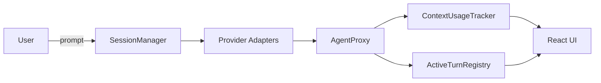
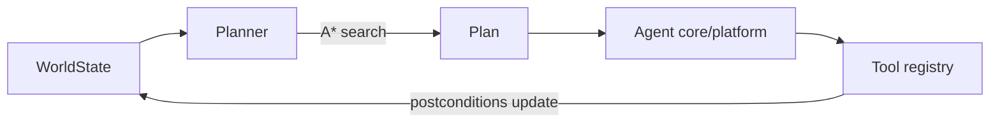
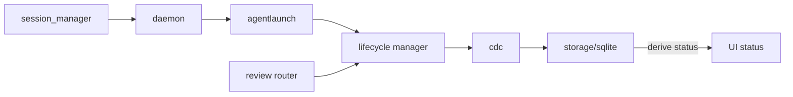
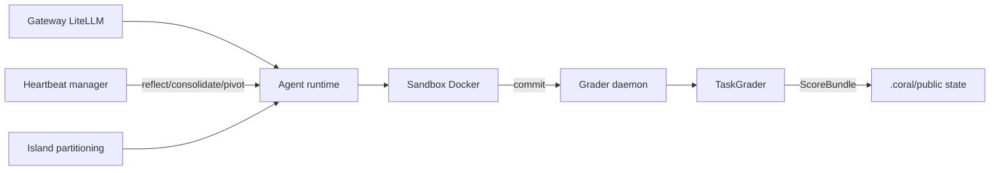

# Weekly Agentic AI Scan — 2026-07-14

Phạm vi: repo được publish hoặc cập nhật đáng kể trong khoảng **2026-07-07 → 2026-07-14**, verify trực tiếp qua WebFetch (README, cây thư mục, source file, trang commit/release) — không dựa vào snippet tìm kiếm.

## Executive summary

- **Xu hướng chiếm ưu thế tuần này không phải là kiến trúc reasoning mới, mà là "mission control" cho nhiều agent lập trình (Claude Code/Codex/Cursor…) chạy song song trong các git worktree riêng** — `helmor` và `agent-orchestrator` đều thuộc nhóm này, cộng thêm ít nhất một repo tương tự (`openswarm`) bị loại vì dữ liệu ngày commit không nhất quán.
- **Hai điểm sáng có kiến trúc/nghiên cứu thực sự mới**: `embabel-agent` dùng GOAP/A* planning (re-plan sau mỗi action) trên JVM thay vì vòng lặp ReAct kinh điển; `CORAL` dùng vòng lặp tiến hoá đa-agent bất đồng bộ, kích hoạt theo "heartbeat" (kể cả plateau-triggered), có paper được chấp nhận tại COLM 2026 với kết quả 3–10× hiệu quả hơn baseline evolutionary search.
- **Cảnh báo chung**: phần lớn "orchestrator" tuần này là lớp giám sát tiến trình/UI bọc quanh CLI agent có sẵn — trí tuệ suy luận thực sự nằm ở agent bên ngoài (Claude Code, Codex, Cursor…), không phải trong code của repo được review.

## Mục lục

- [1. dohooo/helmor](#1-dohoohelmor)
- [2. embabel/embabel-agent](#2-embabelembabel-agent)
- [3. AgentWrapper/agent-orchestrator](#3-agentwrapperagent-orchestrator)
- [4. Human-Agent-Society/CORAL](#4-human-agent-societycoral)

---

## 1. dohooo/helmor

**Repo:** https://github.com/dohooo/helmor

### §1 Quick context

Workbench desktop mã nguồn mở để điều phối nhiều agent lập trình (Claude Code, Codex, Cursor…) chạy song song trong các git worktree riêng biệt.

Tech stack: TypeScript (55%) + Rust (43%), Tauri desktop shell, Vite/React frontend, sidecar Node/Bun. Repo health: ~1,3k sao, 115 fork, Apache-2.0, có CI (`.github/`), e2e test bằng Playwright, Storybook, pre-commit hook (Husky). Tag mới nhất v0.44.0 (25/06), nhưng có commit hoạt động các ngày 03, 04, 09 và 5 commit ngày 10/07/2026 — nằm trong cửa sổ tuần này dù version tag chưa bắt kịp.

### §2 Architecture deep-dive

**A. Component inventory**
- `SessionManager` (`sidecar/src/session-manager.ts`) — interface trừu tượng hoá theo provider (`sendMessage`, `generateTitle`, `stopSession`, `steer`, `shutdown`).
- Provider adapters (`sidecar/src/claude/`, `sidecar/src/codex/`, `sidecar/src/cursor/`, `sidecar/src/kimi/`, `sidecar/src/opencode-protocol/`) — một module tích hợp cho mỗi coding-agent backend.
- `AgentProxy` (`sidecar/src/agent-proxy.ts`) — lớp proxy giao tiếp với tiến trình agent.
- `ContextUsageTracker` (`sidecar/src/context-usage.ts`) — theo dõi token usage/% context window theo từng turn, theo từng provider.
- `ActiveTurnRegistry` (`sidecar/src/active-turn-registry.ts`) — theo dõi các turn hội thoại đang chạy.

**B. Control flow — Event-driven session/process supervision** (không phải planner-executor cổ điển): (1) user thêm repo → (2) tạo "workspace" (git worktree + branch) → (3) `SessionManager` gửi prompt tới provider adapter được chọn → (4) `AgentProxy` stream tool call/output ngược về qua emitter → (5) `ContextUsageTracker` và `ActiveTurnRegistry` cập nhật UI real-time → (6) user review diff và ship qua thao tác one-click PR.

**C. State & data flow:** Mỗi provider SDK/CLI có event riêng được `SessionManager` chuẩn hoá về một shape chung trước khi tới UI. Đơn vị cô lập là git worktree (không xác định từ code cơ chế quản lý worktree cụ thể — chỉ suy ra từ README). Quản lý context window là **chỉ hiển thị, không tự nén**: `context-usage.ts` cố tình đọc token usage tích luỹ của **message cuối cùng** thay vì cộng dồn delta từng lần gọi (tránh overshoot ở turn nhiều tool call), rồi chuyển cờ `isAutoCompactEnabled` lên trên — logic nén thực sự nằm trong SDK của provider gốc (vd. auto-compact của Claude Code), không phải trong Helmor.

**D. Tool/capability integration:** Giao hoàn toàn cho cơ chế gọi tool gốc của từng agent (Claude Code, Codex, Cursor, OpenCode, Kimi đều có function-calling riêng); vai trò của Helmor là giám sát tiến trình/session, không thực thi tool. README có nhắc tới MCP server và "Skills" cài đặt được nhưng không đọc source để xác nhận chi tiết (không xác định từ code).

**E. Memory:** Không có subsystem bộ nhớ dài hạn riêng; state theo từng session/worktree, lưu cục bộ dưới `~/helmor/` theo README (không xác định từ code cơ chế cụ thể).

**F. Model orchestration:** `model-catalog.ts` duy trì registry model theo từng provider; user tự mang API key. Không xác nhận được logic routing/fallback tự động từ các file đã đọc.

**G. Observability & eval:** Có `logger.ts`; không thấy tích hợp OpenTelemetry/Langfuse. Có Playwright e2e và thư mục `test/` trong `sidecar/` — kỷ luật test thật, nhưng không có eval/replay harness riêng cho agent.

**H. Extension points:** Mô hình "mang agent của riêng bạn" — mỗi provider một adapter (`claude/`, `codex/`, `cursor/`, `kimi/`, `opencode-protocol/`), gợi ý pattern pluggable để thêm backend mới; "Skills" cài đặt được nhắc trong README (không xác định từ code phần triển khai).

### §3 Architecture diagram

### §4 Verdict

Điểm đáng học: quyết định kỹ thuật trong `context-usage.ts` — đọc usage tích luỹ của message cuối thay vì cộng delta — là chi tiết production nhỏ nhưng thật, cho thấy đã giải quyết pain point vận hành thực tế chứ không phải boilerplate. Red flag: bản thân repo không có logic planning/eval riêng — toàn bộ "trí tuệ" giao cho CLI agent được cắm vào. Câu hỏi mở: cơ chế cô lập worktree/branch và xử lý merge conflict thực sự hoạt động ra sao (chỉ suy ra từ README, chưa xác nhận qua code).

---

## 2. embabel/embabel-agent

**Repo:** https://github.com/embabel/embabel-agent

### §1 Quick context

Framework agent cho JVM (Kotlin/Java), dùng thuật toán lập kế hoạch GOAP (A*) thay vì máy trạng thái cố định hay vòng lặp ReAct.

Tech stack: Kotlin (86%) + Java (14%), nền Spring Boot; CI GitHub Actions + badge SonarCloud. Repo health: 3,8k sao, 362 fork, Apache-2.0, 2.736 commit — rất tích cực, tạo bởi Rod Johnson (người tạo Spring Framework) theo các bài viết công khai. Commit ngày 11 và 13/07/2026 (8 commit riêng ngày 13) nằm trong cửa sổ tuần này, nội dung: "MCP server health exposure, chat message events, logging enhancements".

### §2 Architecture deep-dive

**A. Component inventory**
- `Planner` (`embabel-agent-api/src/main/kotlin/com/embabel/plan/Planner.kt`) — interface lập kế hoạch lõi.
- `Plan` (`embabel-agent-api/src/main/kotlin/com/embabel/plan/Plan.kt`) — cấu trúc dữ liệu kế hoạch (chuỗi action có thứ tự).
- `WorldState` (`embabel-agent-api/src/main/kotlin/com/embabel/plan/WorldState.kt`) — biểu diễn trạng thái thế giới/task hiện tại làm precondition cho planner.
- GOAP A* engine (`embabel-agent-api/src/main/kotlin/com/embabel/plan/goap/`) — có README riêng mô tả `AStarGoapPlanner`.
- Utility planner (`embabel-agent-api/src/main/kotlin/com/embabel/plan/utility/`) — biến thể lập kế hoạch theo utility score.
- Agent core/platform (`embabel-agent-api/src/main/kotlin/com/embabel/agent/core/`).
- Tool registry (`embabel-agent-api/src/main/kotlin/com/embabel/agent/tools/`).
- Module MCP riêng: `embabel-agent-mcp/` (tích hợp Model Context Protocol).

**B. Control flow — Planner-executor bằng Goal-Oriented Action Planning (GOAP)**, không phải state machine cố định: (1) phân tích world state hiện tại → (2) xác định các action gắn `@Action` có precondition thoả mãn → (3) tìm kiếm A* trên chuỗi action tới goal → (4) chọn plan chi phí thấp nhất/khả năng thành công cao nhất → (5) thực thi action tiếp theo → (6) **re-plan sau MỖI action** (kế hoạch được tính lại động, không cam kết trước) cho tới khi đạt goal. Ngoài ra còn có chế độ "Utility AI" (chọn action theo utility score) và các planner "Supervisor"/state-machine mới bổ sung.

**C. State & data flow:** Precondition/postcondition của action phần lớn được **suy ra từ chữ ký kiểu (type signature) Kotlin của các đối tượng domain** truyền giữa các action (domain model có kiểu chặt, không phải free-text state) — đây là đặt cược thiết kế cốt lõi so với các framework "prompt-glue" thông thường. Không xác định từ code định dạng serialize/message cụ thể giữa các agent phân tán.

**D. Tool/capability integration:** Hỗ trợ MCP native qua module `embabel-agent-mcp` riêng, cộng thêm package `agent/tools/` tổng quát. Đăng ký qua annotation (`@Action`) hoặc DSL — action là method JVM thường với input/output có kiểu, được planner coi là toán tử GOAP.

**E. Memory:** Không xác định từ code (không tìm thấy module bộ nhớ agent chuyên biệt trong các module cấp cao đã xem; `embabel-agent-rag` gợi ý retrieval-augmented context hơn là bộ nhớ agent bền vững).

**F. Model orchestration:** Có module riêng theo provider — `embabel-agent-openai`, `embabel-agent-anthropic`, `embabel-agent-onnx` — README nói framework hỗ trợ "trộn nhiều LLM để tối ưu chi phí", ngụ ý chọn model theo từng action, nhưng chưa đọc trực tiếp file logic routing (không xác định từ code).

**G. Observability & eval:** Có module riêng `embabel-agent-observability` (tracing/metrics) và `embabel-agent-test-support` (hỗ trợ test agent) — gợi ý hỗ trợ eval/testing hạng nhất, dù chưa mở file harness cụ thể.

**H. Extension points:** Hai cách viết agent song song (annotation kiểu Spring `@Agent`/`@Goal`/`@Action` vs. DSL Kotlin) cùng biên dịch về một action graph khả-plan-GOAP; `embabel-agent-autoconfigure` cung cấp Spring Boot auto-configuration để mở rộng cắm-là-chạy.

### §3 Architecture diagram

### §4 Verdict

Điểm mới thực sự đáng học tuần này: GOAP/A* planning re-plan sau mỗi action, với precondition/postcondition suy ra từ domain object có kiểu chặt — khác biệt kiến trúc thật so với mô típ "system prompt + tool list + vòng lặp ReAct" phổ biến. Nhắm vào JVM (Kotlin/Java/Spring) — ngách còn thưa thớt so với hệ sinh thái agent chủ yếu Python. Red flag: chưa xác minh được từ code hệ precondition "suy từ type flow" xử lý ra sao khi action graph mơ hồ/nhiều ứng viên ở quy mô lớn — cần đào sâu `goap/` internals. Câu hỏi mở: logic routing/fallback model thực tế (chưa xác minh).

---

## 3. AgentWrapper/agent-orchestrator

**Repo:** https://github.com/AgentWrapper/agent-orchestrator

### §1 Quick context

IDE điều phối nhiều agent lập trình chạy song song trong git worktree riêng, tự động xử lý lỗi CI và review.

Tech stack: Go backend (63%) + TypeScript frontend (29%), Apache-2.0. Repo health: 8,2k sao, 1,2k fork, 71 release (nhịp release trưởng thành), có `.golangci.yml`, có `docs/adr/` (Architecture Decision Records) — tín hiệu kỹ thuật production mạnh. Release mới nhất v0.10.3 (12/07); commit dày đặc 10–13/07/2026 (11, 7, 4, 8 commit từng ngày) — trong cửa sổ tuần này.

### §2 Architecture deep-dive

**A. Component inventory**
- `session_manager` (`backend/internal/session_manager/`) — điều phối vòng đời session.
- `daemon`/`daemonmeta` (`backend/internal/daemon/`, `backend/internal/daemonmeta/`) — tiến trình nền lõi và metadata.
- `agentlaunch` (`backend/internal/agentlaunch/`) — khởi tạo/spawn tiến trình agent.
- `processalive` (`backend/internal/processalive/`) — theo dõi liveness của tiến trình.
- `lifecycle` (`backend/internal/lifecycle/manager.go`, `reactions.go`, `runtime.go`) — engine quản lý vòng đời lõi, có `toolflight_test.go` riêng (gợi ý khái niệm theo dõi "tool đang bay") và test đơn vị `manager_test.go`.
- `storage/sqlite` (`backend/internal/storage/sqlite/`) — lớp lưu trữ bền vững.
- `cdc` (`backend/internal/cdc/`) — theo dõi trạng thái kiểu Change-Data-Capture, khớp nguyên tắc thiết kế được ghi rõ "persist durable facts, derive display status".
- `review` (`backend/internal/review/`) — định tuyến feedback (lỗi CI, comment review quay lại session).
- `observe`/`telemetrymeta` (`backend/internal/observe/`, `backend/internal/telemetrymeta/`) — lớp observability.

**B. Control flow — Daemon-supervised, event/state-driven session lifecycle** (không phải vòng lặp planner-executor LLM — bản thân orchestration là hạ tầng tất định bao quanh các CLI agent chạy ngoài): (1) setup project → (2) spawn session qua `agentlaunch` → (3) tạo git worktree riêng cho từng session → (4) agent chạy trong terminal riêng, theo dõi bởi `processalive`/`lifecycle` → (5) lỗi CI và comment review được `review` bắt và định tuyến ngược về session gốc → (6) thay đổi trạng thái dựa trên `cdc` được ghi làm "fact" bền vững, còn "status" hiển thị cho user được **suy ra** (không lưu trực tiếp) từ các fact đó.

**C. State & data flow:** Nguyên tắc ghi rõ trong `docs/architecture.md`: "persist durable facts, derive display status" — sự kiện thô (bản ghi session, dữ liệu PR) là nguồn sự thật trong SQLite, còn "status" cấp cao hiển thị cho user được tính khi đọc thay vì lưu như state khả biến. Đây là lựa chọn thiết kế kiểu CQRS/event-sourcing, khá chỉn chu so với mặt bằng chung của nhóm repo này.

**D. Tool/capability integration:** Giám sát 23+ "worker agent" bên ngoài (Claude Code, Aider, Cursor…) và 3 "reviewer agent harness" như subprocess/terminal thay vì tự gọi tool; tên file `toolflight_test.go` gợi ý có theo dõi tool invocation đang chạy nhưng chưa đọc nội dung file (không xác định từ code chi tiết).

**E. Memory:** Không xác định từ code — không tìm thấy module bộ nhớ agent riêng; state giới hạn theo session/worktree trong SQLite.

**F. Model orchestration:** Không xác định từ code — orchestrator agnostic với agent CLI (giao lựa chọn model cho agent worker được gọi trong số 23+ loại hỗ trợ); không thấy logic routing model trong repo ở các thư mục đã xem.

**G. Observability & eval:** Package nội bộ riêng `observe`/`telemetrymeta`, cộng `docs/architecture.md`, `docs/backend-code-structure.md`, `docs/STATUS.md`, `docs/adr/` — mức tài liệu kỹ thuật trong repo hiếm gặp với loại project agent-tooling này, khớp trực tiếp tiêu chí "có technical writeup đi kèm".

**H. Extension points:** Kiến trúc hexagonal ports/adapters (`backend/internal/ports/`, `backend/internal/adapters/`) được ghi rõ là để hỗ trợ tích hợp mới; `docs/stack.md` liệt kê "lựa chọn công nghệ đã chấp nhận, đang chờ quyết định, và dependency cố tình tránh" — mức minh bạch kỹ thuật hiếm gặp.

### §3 Architecture diagram

### §4 Verdict

Điểm production-engineering nổi bật nhất trong 4 repo tuần này: ADR ghi rõ ràng, nguyên tắc lưu trữ kiểu CQRS ("persist durable facts, derive display status"), Go + hexagonal ports/adapters, và danh sách "dependency cố tình tránh" — một dạng minh bạch kỹ thuật hiếm gặp ở repo OSS. Red flag: giống Helmor, toàn bộ "trí tuệ" agent thực sự nằm ở 23+ CLI ngoài — cái mới của repo hoàn toàn nằm ở kỹ thuật orchestration/persistence chứ không phải reasoning; xét theo đúng chữ tiêu chí loại trừ, có thể bị coi là "wrapper", nhưng độ sâu kỹ thuật CDC/ADR đủ để giữ lại. Câu hỏi mở: nội dung cụ thể của `toolflight_test.go`/cơ chế theo dõi tool invocation, chưa đọc.

---

## 4. Human-Agent-Society/CORAL

**Repo:** https://github.com/Human-Agent-Society/CORAL

### §1 Quick context

Hạ tầng cho "tổ chức agent" tự động chạy thử nghiệm, chia sẻ tri thức và tự cải tiến giải pháp qua nhiều "đảo" song song.

Tech stack: Python 3.11+ (82%), Docker sandbox, LiteLLM gateway để route model, quản lý package bằng `uv`. Repo health: 804 sao, 102 fork, Apache-2.0, có `tests/`, cô lập bằng Docker, và có paper học thuật đi kèm (arXiv:2604.01658, được chấp nhận tại COLM 2026) — technical writeup mạnh nhất trong 4 repo. Release v0.7.8 (11/07); commit ngày 08 và 11/07/2026 trong cửa sổ tuần này (tiếp nối chuỗi commit 01–05/07 trước đó).

### §2 Architecture deep-dive

**A. Component inventory**
- Heartbeat manager (`coral/hub/heartbeat.py`) — cấu hình/dispatch trigger heartbeat.
- Island partitioning (`coral/hub/_island.py`) — phân vùng agent theo "đảo".
- Attempt/checkpoint tracking (`coral/hub/attempts.py`, `coral/hub/checkpoint.py`, `coral/hub/auto_stop.py`, `coral/hub/steering.py`, `coral/hub/notes.py`, `coral/hub/skills.py`).
- `TaskGrader` (`coral/grader/task_grader.py`) — abstract base class, tác giả task chỉ cần override `evaluate()`; hàm `grade()` bất đồng bộ bọc thêm context (đường dẫn codebase, metadata task, island ID), timeout, và trả về `ScoreBundle`.
- Hạ tầng grading: `coral/grader/daemon.py` (tiến trình chấm nền), `coral/grader/subprocess_grader.py`, `coral/grader/protocol.py`, `coral/grader/loader.py`, `coral/grader/builtin/` (grader dựng sẵn).
- Agent runtime (`coral/agent/`) — wrapper runtime quanh CLI agent ngoài.
- Sandbox (`coral/sandbox/`) — thực thi cô lập bằng Docker (agent chạy user không đặc quyền; grader/manager giữ quyền root — quyết định phân tách đặc quyền có ghi rõ).
- Gateway (`coral/gateway/`) — routing model qua LiteLLM.

**B. Control flow — Vòng lặp tiến hoá đa-agent bất đồng bộ, ngắt bằng heartbeat (event-driven)**, không phải pipeline cố định — đây là đóng góp chính của paper: (1) nhiều agent (Claude Code/Codex/Cursor/Kiro/OpenCode) chạy liên tục độc lập, mỗi agent một git worktree riêng; (2) từng agent định kỳ nhận **heartbeat prompt** — `reflect` (theo agent, theo khoảng thời gian), `consolidate` (toàn cục, theo khoảng thời gian), `pivot` (theo agent, kích hoạt khi **"plateau"** — event-driven khi tiến độ chững lại, không chỉ theo timer), `lint_wiki` (toàn cục, theo khoảng thời gian); (3) mỗi lần commit, `grader daemon` chấm điểm attempt bất đồng bộ qua `TaskGrader.grade()`; (4) kết quả/note/skill được ghi vào state chung `.coral/public/`, symlink vào mọi worktree để agent thấy công việc của agent khác theo thời gian thực; (5) ở chế độ multi-island, agent được phân vùng vào các "đảo" cô lập với state riêng, có di trú định kỳ giữa đảo để mở rộng khám phá; (6) `auto_stop.py` có khả năng dừng các run không hiệu quả (không xác định từ code tiêu chí dừng cụ thể).

**C. State & data flow:** State chung nằm ở `.coral/public/` (agent đọc/ghi được, symlink theo từng worktree) đối lập với `.coral/private/` (agent không truy cập được — chứa virtualenv của grader và "đáp án", ngăn agent đọc chính target đánh giá của mình — thiết kế chống gian lận/rò rỉ có chủ đích). Sự phân tách public/private này là câu trả lời cụ thể, kiểm chứng được cho câu hỏi "làm sao đánh giá agent mà không để chúng đánh lừa grader".

**D. Tool/capability integration:** Không tự định nghĩa tool cho agent — giao cho CLI agent ngoài được cấu hình (`claude_code`, `codex`, `cursor`, `kiro`, `opencode` — đều là tuỳ chọn runtime). Truy cập model qua **LiteLLM gateway** (`coral/gateway/`), cho phép routing model tuỳ biến qua nhiều provider.

**E. Memory architecture:** Ngắn hạn: state làm việc theo từng agent trong worktree riêng. Dài hạn/chung: `.coral/public/` chứa note quản lý bởi `notes.py` và skill tái sử dụng quản lý bởi `skills.py`, đóng vai trò bộ nhớ chung xuyên agent, xuyên thế hệ, tích luỹ qua các đảo và chu kỳ heartbeat — về kiến trúc gần với shared blackboard/wiki (có heartbeat `lint_wiki`) hơn là bộ nhớ retrieval bằng vector. Không tìm thấy component retrieval dựa trên embedding trong các thư mục đã xem (không xác định từ code — có thể tồn tại ở nơi khác, chưa xác nhận).

**F. Model orchestration:** LiteLLM gateway (`coral/gateway/`) routing đa provider; agent runtime pluggable qua 5 CLI backend; grader/manager chạy quyền cao (root) còn agent chạy sandbox không đặc quyền — một phân tách theo hướng bảo mật hơn là lựa chọn model.

**G. Observability & eval:** Đây là điểm mạnh nhất của CORAL: abstract base class `TaskGrader` + pipeline chấm điểm bất đồng bộ + `ScoreBundle` có cấu trúc + phân biệt "tune mode" (đánh giá sweep hyperparameter cục bộ, chi phí thấp) với chấm điểm submission đầy đủ + grader dựng sẵn tái sử dụng trong `builtin/`. Đây là eval methodology thực sự không tầm thường, được xác nhận trực tiếp bằng paper COLM 2026 báo cáo "tỷ lệ cải thiện cao hơn 3–10× với ít lần đánh giá hơn nhiều so với baseline evolutionary search cố định" trên 10 task.

**H. Extension points:** Tác giả task mở rộng bằng cách override `TaskGrader.evaluate()`; runtime agent mới pluggable qua config; `coral/hub/prompts/` chứa template prompt heartbeat có thể tuỳ biến được (không xác định từ code cơ chế tuỳ biến cụ thể).

### §3 Architecture diagram

### §4 Verdict

Repo có tính nghiên cứu và mới thực sự nhất trong 4 repo: can thiệp theo heartbeat (`reflect`/`consolidate`/`pivot`/`lint_wiki`) với trigger **theo plateau** (không chỉ theo interval), tách state public/private trong `.coral/` cụ thể để ngăn rò rỉ đáp án, và đánh giá peer-reviewed (COLM 2026) cho thấy hiệu quả gấp 3–10× baseline evolutionary search — đây là eval methodology có thực chất, không phải tuyên bố marketing. Red flag: "multi-agent" ở đây chủ yếu là N agent CLI độc lập chạy dài hạn, phối hợp bất đồng bộ qua file chung/heartbeat, chứ không nhắn tin trực tiếp cho nhau (không có agent-to-agent protocol tương đương `embabel-agent-a2a`). Câu hỏi mở: tiêu chí dừng cụ thể trong `auto_stop.py` và cách ngăn rò rỉ "đáp án" grader trong thực tế ngoài phân quyền thư mục.

---

## Ghi chú phương pháp

- Không có quyền truy cập GitHub Search API/`gh` CLI trong phiên này; toàn bộ candidate được tìm qua web search rồi verify trực tiếp bằng WebFetch vào github.com (trang repo, trang commit, trang release, cây thư mục, file source cụ thể) trước khi đưa vào báo cáo.
- Repo bị loại: `jwangkun/Pi-Multi-Agent` (hoạt động cuối ngoài cửa sổ, traction thấp), `usestrix/strix` (traction cao nhưng cập nhật gần nhất ngoài cửa sổ), `openswarm-ai/openswarm` (dữ liệu ngày commit không nhất quán giữa các trang, trùng thể loại với helmor/agent-orchestrator nên bỏ để ưu tiên đào sâu 4 repo trên), `open-multi-agent/open-multi-agent` (không xác nhận được commit trong cửa sổ), `alibaba/page-agent` (agent đơn, không phải multi-agent/orchestration; coverage nằm ngoài cửa sổ), `DyTopo` (paper thật nhưng không tìm được repo code công khai xác nhận được — không bịa link), cùng toàn bộ danh sách dạng `awesome-*`.
