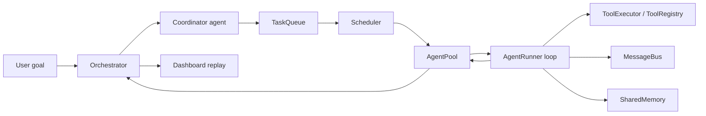
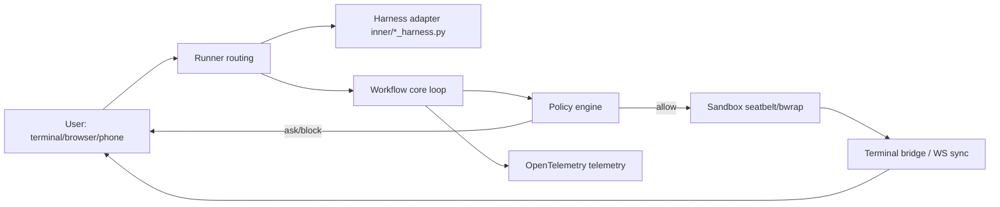
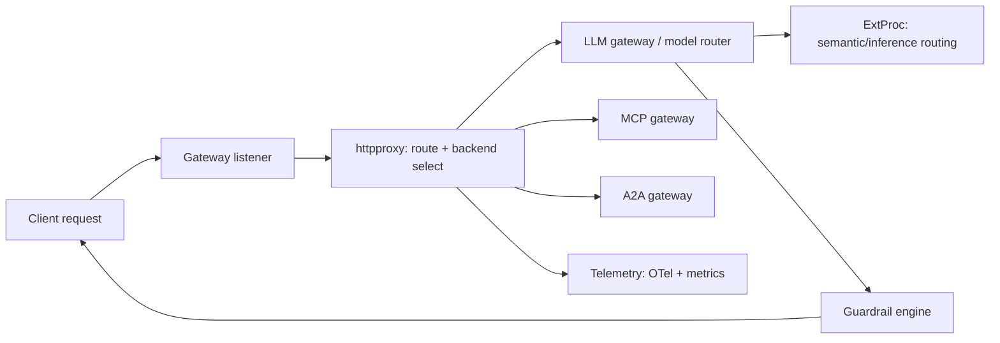
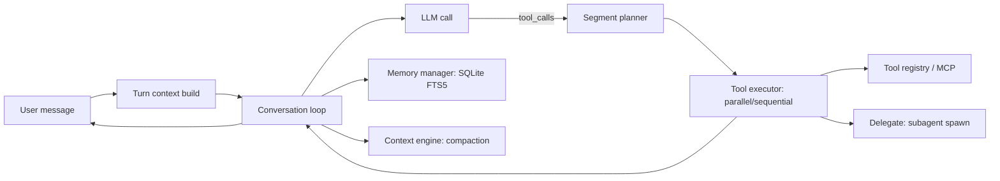

# Weekly Agentic AI Research Scan — 2026-07-15

**Phạm vi:** Repos GitHub liên quan đến agentic AI được publish hoặc updated đáng kể trong 7 ngày qua (2026-07-08 → 2026-07-15), stars > 200 (created) hoặc > 500 (pushed), loại trừ awesome-list/tutorial/fork thuần.

## Executive Summary

- Tuần này có 2 pattern kiến trúc đáng chú ý xuất hiện song song: **planner-executor với DAG runtime** (`open-multi-agent`) và **meta-harness orchestration** (`omnigent`) — cả hai đều giải quyết vấn đề "điều phối nhiều agent/harness" nhưng ở layer khác nhau (trong-process vs across-harness).
- `agentgateway` cho thấy pattern hạ tầng đang chín: gateway hợp nhất LLM + MCP + A2A traffic vào một proxy Rust duy nhất, với "semantic routing" thực chất là tích hợp Envoy ExtProc chứ không phải ML tự viết — một điểm cần làm rõ vì nhiều bài viết PR gọi đây là "novel routing".
- `hermes-agent` (215k sao, Nous Research) tiếp tục là case study tốt nhất về **skill self-curation** (không phải weight update thật) và **programmatic tool calling** qua RPC — nhưng repo là hậu duệ rebrand của "OpenClaw" chứ không phải build from scratch, điều README không nêu rõ.
- Nhiều repo memory-architecture hot (agentmemory 25.2k sao, MemPalace 57.3k sao, PixelRAG 6.7k sao) đã bị loại khỏi deep-dive tuần này vì hoạt động gần nhất cách đây >2 tuần — không đạt filter "significantly updated trong 7 ngày".

## Mục lục

1. [open-multi-agent/open-multi-agent](#1-open-multi-agentopen-multi-agent)
2. [omnigent-ai/omnigent](#2-omnigent-aiomnigent)
3. [agentgateway/agentgateway](#3-agentgatewayagentgateway)
4. [NousResearch/hermes-agent](#4-nousresearchhermes-agent)
5. [Watchlist — repo đáng chú ý nhưng không đạt filter tuần này](#5-watchlist)

---

## 1. open-multi-agent/open-multi-agent

**Link:** https://github.com/open-multi-agent/open-multi-agent

### §1 — Quick Context

TypeScript framework: coordinator lập DAG task runtime thay vì graph cấu hình tay. Stack: TypeScript, package `@open-multi-agent/core` v1.10.0, MIT, adapter cho 13+ LLM provider (Anthropic, OpenAI, Gemini, Bedrock, Azure, Grok, DeepSeek...) + Agent Client Protocol (ACP) để lái CLI ngoài (Claude Code). Repo health: ~6.6k sao, ~20.700 LOC trong `packages/core/src`, 80 file test, gần như không có TODO tồn đọng, commit gần nhất 2026-07-15 (release v1.10.0 ngày 11/07).

### §2 — Architecture Deep-Dive

**A. Component inventory**
- `Orchestrator` (`packages/core/src/orchestrator/orchestrator.ts`, class `OpenMultiAgent`) — API gốc: `runAgent`, `runTeam`, `runTasks`, `runConsensus`, `runFromPlan`.
- `Coordinator` — không phải class riêng, là một `Agent` tạm được build bởi `buildCoordinatorBaseConfig`/`buildCoordinatorPrompt` (orchestrator.ts:2726-2854), output được `parseTaskSpecs` (orchestrator.ts:680) parse.
- `Scheduler` (`packages/core/src/orchestrator/scheduler.ts`) — 4 chiến lược gán task (round-robin, least-busy, capability-match, dependency-first).
- `TaskQueue` (`packages/core/src/task/queue.ts`).
- `AgentPool` (`packages/core/src/agent/pool.ts`) — pool thực thi có `Semaphore` giới hạn concurrency.
- `AgentRunner` (`packages/core/src/agent/runner.ts`) — vòng lặp tool-use LLM thật sự.
- `ACP backend` (`packages/core/src/agent/acp-backend.ts`) — backend thay thế để lái CLI ngoài qua Agent Client Protocol.
- `Team` + `MessageBus` (`packages/core/src/team/team.ts`, `team/messaging.ts`) — pub/sub point-to-point và broadcast.
- `ToolRegistry`/`ToolExecutor` (`packages/core/src/tool/framework.ts`, `tool/executor.ts`) — Zod schema, dispatch song song.
- `Memory`: `InMemoryStore`, `FileStore`, `SharedMemory`, `Checkpoint` (`packages/core/src/memory/*.ts`).
- `Dashboard` (`packages/core/src/dashboard/render-team-run-dashboard.ts`) — HTML replay tĩnh sau khi chạy xong.

**B. Control flow — Planner-executor với dependency-DAG scheduling** (không phải ReAct ở tầng team; ReAct chỉ tồn tại *bên trong* mỗi agent). Happy path (`runTeam`, orchestrator.ts:1968-2322):
1. Kiểm tra short-circuit cho goal đơn giản (`isSimpleGoal`) — bỏ qua coordinator, route thẳng agent phù hợp nhất.
2. Coordinator agent phân rã goal thành mảng task JSON (`buildDecompositionPrompt` → `parseTaskSpecs`).
3. Task nạp vào `TaskQueue`; `Scheduler.autoAssign` gán agent cho các task chưa gán.
4. `executeQueue` chạy theo round: dispatch song song mọi task `pending` qua `AgentPool`, chờ batch, mở khóa task phụ thuộc, lặp lại tới khi hết task.
5. Mỗi task chạy một vòng agentic loop riêng (`AgentRunner.stream`) — gọi LLM → trích tool_use → thực thi tool song song → gắn tool_result → lặp tới `end_turn`.
6. Coordinator tổng hợp câu trả lời cuối từ output các task đã hoàn thành (`runCoordinatorSynthesis`).

**C. State & data flow:** message dạng typed discriminated union (`LLMMessage`/`ContentBlock`), không phải object thuần. State mặc định in-memory (`InMemoryStore`), có thể swap qua interface `MemoryStore` (`FileStore` JSON-on-disk có sẵn; Redis/SQLite chỉ là ví dụ ngoài, không ship kèm). Context window quản lý bằng sliding-window truncation, LLM summarization, hoặc compressor tùy chỉnh (`ContextStrategy`, applied trong `AgentRunner.applyContextStrategy`).

**D. Tool integration:** tool định nghĩa bằng Zod (`defineTool`) → convert sang JSON Schema cho **native function-calling** (Anthropic/OpenAI). Có fallback text-parser cho local model. Cơ chế **default-deny**: agent không có tool nào trừ khi cấp qua `toolPreset`/`allowedTools`, enforce runtime tại `grantedToolNames`. File tool sandbox theo workspace root (`tool/built-in/path-safety.ts`). MCP bridge qua `tool/mcp.ts`.

**E. Memory architecture:** `SharedMemory` là K/V namespace toàn team (`<agent>/<key>`) trên bất kỳ `MemoryStore` nào, có TTL theo turn-count, snapshot/restore JSON. **Không có vector/semantic retrieval built-in** — chỉ substring `search()` phẳng. `Checkpoint` lưu snapshot toàn bộ run để crash-resume.

**F. Model orchestration:** `ModelRoutingPolicy` (orchestrator.ts:729-765) cho phép route model khác nhau theo phase/agent/task-role/priority (model rẻ cho leaf task, model mạnh cho coordinator), first-match-wins. Retry có backoff jitter và phát hiện lỗi terminal. Song song qua `AgentPool` semaphore + `Promise.all` theo round DAG.

**G. Observability & eval:** hệ event tùy biến (không OpenTelemetry): `onProgress` cho lifecycle thô, `onTrace` cho span có cấu trúc (llm_call, tool_call, task, agent...) với runId/spanId/parentId. Dashboard HTML tĩnh replay DAG sau khi chạy. `runConsensus` là primitive eval proposer→judge có quorum. `planOnly`/`createPlanArtifact`/`runFromPlan` cho phép preview và replay xác định không cần gọi lại coordinator.

**H. Extension points:** custom tool qua `defineTool`, custom `MemoryStore` (duck-typed, check runtime), custom `ContextStrategy.custom.compress`, custom LLM adapter qua `AgentConfig.adapter`, external agent qua ACP backend, MCP server qua `connectMCPTools`.

### §3 — Architecture Diagram

### §4 — Verdict

Điểm novel: mô hình **default-deny tool grant** + **model-routing-by-phase policy** + luồng **plan-preview/freeze/replay** (`planOnly` → `createPlanArtifact` → `runFromPlan`) cho khả năng audit mà nhiều framework planner-executor khác không có. Red flag: `parseTaskSpecs` dùng regex trích JSON-fence thay vì structured/schema-constrained call — output coordinator lỗi format sẽ âm thầm fallback về 1 task/agent, một failure mode dễ xảy ra khi model "drift". "Memory" branding hơi quá lời vì thực chất chỉ là flat K/V, không có semantic retrieval. Cần đào sâu thêm: benchmark thực tế cho throughput của DAG scheduler khi có >20 task phụ thuộc chéo nhau.

---

## 2. omnigent-ai/omnigent

**Link:** https://github.com/omnigent-ai/omnigent

### §1 — Quick Context

Meta-harness mã nguồn mở điều phối Claude Code, Codex, Cursor, OpenCode, Hermes, Pi và agent tự viết dưới một lớp chung. Stack: Python 3.12+ (82%) + TypeScript (15%, web/desktop UI), FastAPI, OpenTelemetry, sandbox `seatbelt` (macOS) / `bwrap` (Linux). Repo health: ~7.3k sao, status **alpha** (badge chính thức trong README), commit rất tích cực (nhiều commit trong ngày 14-15/07/2026), CI đầy đủ (e2e, lint, security-scan, flake-stress workflows trong `.github/workflows/`).

### §2 — Architecture Deep-Dive

**A. Component inventory**
- Harness adapters (`omnigent/inner/hermes_native_harness.py`, `inner/claude_sdk_harness.py`, `inner/cursor_executor.py`, `inner/goose_native_executor.py`, `inner/databricks_executor.py`, `inner/acp_executor.py`) — mỗi harness (Claude/Codex/Cursor/Hermes/Pi...) có một module thin wrap thành interface chung.
- Agent execution workflow / core loop (`omnigent/runtime/workflow.py`, docstring: "Load agent → build prompt → call LLM → execute tools → repeat. All durably checkpointed for crash recovery").
- Runner routing (`omnigent/runner/routing.py`) — dispatch conversation tới runner qua WebSocket tunnel registry (`RunnerSession`, `TunnelRegistry`).
- Runner-local tool dispatch (`omnigent/runner/tool_dispatch.py`) — phân loại tool OS-env/REST/file/terminal/MCP để dispatch local.
- MCP manager (`omnigent/runner/mcp_manager.py`, `runner/proxy_mcp_manager.py`).
- Policy engine (`omnigent/policies/base.py`, `policies/registry.py`, `policies/function.py`) — evaluator trừu tượng, engine filter-gate-dispatch-compose nằm ở `runtime/policies/engine.py`.
- Sandbox (`omnigent/sandbox/seatbelt.py`, `sandbox/bwrap.py`) — OS-level sandbox thật, không chỉ container mềm.
- Terminal bridge / multi-device sync (`omnigent/terminals/control_bridge.py`, `terminals/ws_bridge.py`, `terminals/registry.py`).
- Agent spec parser (`omnigent/spec/omnigent.py`, `spec/parser.py`, `spec/validator.py`) — parse file YAML agent.
- Telemetry (`omnigent/runtime/telemetry.py`) — dùng OpenTelemetry SDK trực tiếp.

**B. Control flow — Hierarchical meta-harness (điều phối harness, không phải điều phối task nội bộ như planner-executor).** Happy path:
1. User gửi message qua terminal/browser/phone → `runner/routing.py` resolve harness cần dùng từ `AgentSpec` (`runner_dispatch_harness`).
2. Nếu route tới harness ngoài (Claude/Codex/Cursor...), request đi qua module `inner/*_harness.py` tương ứng, mỗi module expose `create_app()` xây FastAPI app quanh một `Executor` cụ thể.
3. Với executor nội bộ (không route runner), `runtime/workflow.py` chạy vòng lặp: load agent spec → build prompt → gọi LLM → nhận tool call.
4. Trước khi tool thực thi, **policy engine** (`policies/`) chạy filter-gate-dispatch-compose: cho phép / chặn / hỏi lại người dùng (spend cap, tool cap, "ask before shell").
5. Tool được cho phép chạy trong `sandbox/seatbelt.py` (macOS) hoặc `sandbox/bwrap.py` (Linux) — cách ly OS thật, không chỉ Docker.
6. Kết quả stream ngược qua `terminals/ws_bridge.py` để đồng bộ real-time trên mọi thiết bị (terminal/web/phone/desktop), telemetry ghi span qua `runtime/telemetry.py`.

**C. State & data flow:** message giữa runner và harness process qua HTTP/WebSocket tunnel (`httpx.AsyncClient` trong `routing.py`). Session state có `ConversationStore`, checkpoint để crash-recovery (docstring `workflow.py`). Context compaction có module riêng (`runtime/compaction.py`).

**D. Tool integration:** tool khai báo bằng YAML agent spec (function local Python, MCP server, hoặc sub-agent) — schema tự sinh từ signature Python. MCP hỗ trợ cả làm client (`runner/mcp_manager.py`) lẫn proxy (`runner/proxy_mcp_manager.py`). Validation/sandbox thật ở tầng OS (seatbelt/bwrap), không chỉ policy mềm.

**E. Memory:** không xác định từ code — không tìm thấy module memory dài hạn/retrieval riêng; state chủ yếu là conversation checkpoint, không phải kiến trúc memory theo nghĩa retrieval.

**F. Model orchestration:** không route model theo role cố định — model được chọn theo harness đã cấu hình trong YAML agent spec (mỗi executor như `claude_sdk_harness.py` đọc model từ env var riêng, ví dụ `HARNESS_CLAUDE_SDK_MODEL`). Hỗ trợ gateway trung lập vendor qua biến `HARNESS_CLAUDE_SDK_GATEWAY`.

**G. Observability & eval:** dùng **OpenTelemetry SDK trực tiếp** (`runtime/telemetry.py`) — tự derive Trace ID từ response ID (`resp_<32-hex>` tái dùng làm W3C trace ID), tự propagate traceparent sang subprocess harness con. Có `tests/harness_bench` — bộ test bench so khớp capability matrix của từng harness với hành vi quan sát được (gần giống eval hook cho tính tương thích, không phải eval chất lượng model).

**H. Extension points:** agent mới = 1 file YAML (prompt, tools, executor.harness). Policy custom qua `type: function` + `handler` trỏ tới Python callable. Sub-agent khai báo trực tiếp trong YAML (`type: agent`). Thêm harness mới = thêm module trong `omnigent/inner/` implement `create_app()`.

### §3 — Architecture Diagram

### §4 — Verdict

Điểm novel thực sự: cách ly **OS-level sandbox thật** (`seatbelt`/`bwrap`, không phải chỉ container) bắt buộc trên Linux, và mô hình policy 3 tầng (server-wide / per-agent / per-session) với session strictest-first — đây là engineering "production-grade" thật chứ không phải marketing, thể hiện qua CI có `security-scan`, `security-gate`, `flake-stress` workflows riêng. Red flag: dự án tự gắn nhãn **alpha** (badge trong README), và có 2 tài liệu thiết kế nội bộ (`designs/RUNNER_TOOL_DISPATCH.md`, `designs/OBSERVABILITY.md`) được reference trong code nhưng không đọc được từ ngoài repo dạng rendered — nghĩa là một phần kiến trúc chỉ thực sự rõ khi đọc source, README không đủ. Câu hỏi mở: chưa rõ cơ chế conflict-resolution khi nhiều agent (harness khác nhau) cùng sửa một file trong một session collaborative.

---

## 3. agentgateway/agentgateway

**Link:** https://github.com/agentgateway/agentgateway

### §1 — Quick Context

Proxy Rust/Go hợp nhất LLM + MCP + A2A traffic dưới một gateway, dự án Linux Foundation. Stack: Rust (tokio/hyper/axum stack), Go (Kubernetes controller), React UI. Repo health: ~3.9k sao, 641 fork, 212 open issue, có CHARTER.md/CONTRIBUTION.md/community-meeting calendar — governance mở chính thức, hoạt động rất tích cực (6 commit ngày 13/07/2026).

### §2 — Architecture Deep-Dive

**A. Component inventory**
- Entry point (`crates/agentgateway-app/src/main.rs` → `agentgateway_app::run()`).
- Gateway listener (`crates/agentgateway/src/proxy/gateway.rs`) — chấp nhận TCP/TLS, dựng HTTP server qua hyper.
- HTTP request pipeline (`crates/agentgateway/src/proxy/httpproxy.rs`) — route matching + backend selection.
- LLM gateway/model router (`crates/agentgateway/src/llm/mod.rs`, `llm/model_router.rs`).
- LLM guardrail engine (`crates/agentgateway/src/llm/policy/{guardrail,moderation,bedrock_guardrails,google_model_armor,azure_content_safety,webhook,streaming_guardrails,pii}.rs`).
- MCP gateway (`crates/agentgateway/src/mcp/mod.rs`, router `mcp/router.rs`, transport `mcp/upstream/{stdio,sse,streamablehttp}.rs`).
- MCP RBAC (`crates/agentgateway/src/mcp/rbac.rs`).
- A2A gateway (`crates/agentgateway/src/a2a/mod.rs`).
- ExtProc client cho semantic/inference routing (`crates/agentgateway/src/http/ext_proc.rs`).
- CEL policy engine (`crates/agentgateway/src/cel/`, `crates/cel-fork/`, `crates/celx/`).
- Telemetry (`crates/agentgateway/src/telemetry/{metrics,log,trc}.rs`).
- Kubernetes controller Go (`controller/pkg/controller/`, CRDs `controller/api/v1alpha1/agentgateway/*.go`).
- React UI dashboard (`ui/src/pages/{Playground,Models,Policies,Guardrails,TrafficRoutes,Costs,Logs}.tsx`).

**B. Control flow — Event-driven proxy pipeline (không phải agentic loop — đây là hạ tầng, không phải agent).** Happy path của một request:
1. `proxy/gateway.rs` nhận kết nối TCP/TLS trên `Listener`/`Bind`, dựng server HTTP/1/2 qua hyper.
2. `httpproxy.rs::select_route_chain` khớp request với route, `select_backend` chọn backend theo weighted random.
3. Tùy loại backend, dispatch tới LLM path (`llm/model_router` + `AIBackend::select_provider`), MCP path (`mcp::router::App::serve`), hoặc A2A path (`a2a::apply_to_request/apply_to_response`).
4. Policy áp dụng dọc đường: CEL authz/transform (`http/authorization.rs`), tùy chọn gọi ExtProc gRPC ngoài (`http/ext_proc.rs`) cho guardrail/semantic routing/inference routing.
5. Response stream/buffer trả về, guardrail hậu kiểm cho traffic LLM (`llm/policy/streaming_guardrails.rs`).
6. Telemetry ghi metrics/log/trace xuyên suốt (`telemetry::metrics`, `telemetry::trc`).

**C. State & data flow:** LLM request/response chuẩn hóa qua `agent_llm::{LLMRequest, LLMResponse}` (OpenAI-compatible schema) với adapter riêng từng provider. MCP dùng JSON-RPC 2.0 (`rmcp::model::JsonRpcError`). State lưu **in-process** (`store/mod.rs`, `RwLock`/`ArcSwap`), không phụ thuộc Redis bắt buộc. Config có thể static (YAML file) hoặc sync động qua xDS-style protocol từ Kubernetes controller Go.

**D. Tool integration:** hỗ trợ đủ transport MCP — stdio, SSE, Streamable HTTP, cộng OpenAPI-to-MCP bridge (`mcp/upstream/openapi/mod.rs`). Tool call được authorize qua `mcp/rbac.rs`, lọc thêm qua `mcp/guardrails/client.rs`. Không có sandbox process cho MCP server ngoài việc spawn subprocess trực tiếp — không tìm thấy thư viện sandbox (gVisor/seccomp) trong Cargo.toml.

**E. Memory:** không áp dụng — đây là proxy không trạng thái; chỉ có session state cho MCP (`mcp/session.rs`) và health state cho load balancer.

**F. Model orchestration:** hỗ trợ OpenAI, Gemini, Vertex, Anthropic, Bedrock, Azure, Copilot, Custom. Chiến lược chọn provider dùng **power-of-two-choices (P2C)** — chọn ngẫu nhiên 2 candidate rồi lấy điểm cao hơn (`llm/mod.rs::AIBackend::select_provider`), không phải round-robin đơn giản như nhiều tài liệu PR mô tả.

**G. Observability & eval:** OpenTelemetry OTLP export thật (`telemetry/trc.rs`, dùng crate `opentelemetry_otlp`), metrics Prometheus-client, structured log store riêng, UI dashboard React đầy đủ (Playground, Costs, TrafficRoutes, McpPlayground).

**H. Extension points:** custom LLM provider qua `AIProvider::Custom`, custom guardrail qua `webhook.rs` (arbitrary HTTP webhook), custom routing/policy qua CEL expression (cơ chế extension chính, config-driven không cần compile), ExtProc gRPC interface cho phép service ngoài (kể cả vLLM Semantic Router) can thiệp request mà không sửa code gateway. K8s CRD riêng cho extension khai báo trong cluster.

### §3 — Architecture Diagram

### §4 — Verdict

Điểm mạnh thật: hợp nhất 3 giao thức AI (LLM/MCP/A2A) dưới một CRD/policy model chung bằng CEL — đây là breadth hiếm thấy ở gateway khác. Red flag quan trọng: "semantic routing" — điểm bán hàng chính trong nhiều bài PR tuần này — **không phải** thuật toán tự viết, mà là điểm tích hợp ExtProc gRPC (chuẩn Envoy) để **project vLLM Semantic Router** ngoài làm việc phân loại; agentgateway chỉ implement state machine buffer/stream ExtProc. Smell code đáng chú ý: `Cargo.toml` pin nhiều dependency (`schemars`, `http-serde`, `wiremock`, và cả `rmcp` — chính SDK MCP) vào fork GitHub cá nhân của một maintainer (`howardjohn`) qua `[patch.crates-io]`, tức đang phụ thuộc patch chưa merge/publish cho cả SDK giao thức lõi. Cần đào sâu: mức độ production-readiness thực tế của các patch fork này trước khi dùng trong hệ thống enterprise.

---

## 4. NousResearch/hermes-agent

**Link:** https://github.com/NousResearch/hermes-agent

### §1 — Quick Context

Agent CLI/multi-platform tự cải thiện của Nous Research — persistent memory, tự tạo skill, sandbox code execution, gateway đa nền tảng. Stack: Python (82.5%), TypeScript (14.8%), OpenAI SDK làm default path. Repo health: **215.000 sao**, 40.018 fork, 23.560 issue mở, tạo repo 2025-07-22, push gần nhất 2026-07-15, 2.101 file test, MIT license.

### §2 — Architecture Deep-Dive

**A. Component inventory**
- Core agent loop (`run_agent.py`, class `AIAgent`), conversation loop (`agent/conversation_loop.py::run_conversation`).
- Turn setup (`agent/turn_context.py::build_turn_context`).
- Tool-batch segment planner (`agent/tool_dispatch_helpers.py::_plan_tool_batch_segments`) + dispatcher (`agent/tool_executor.py::execute_tool_calls_segmented`).
- Tool registry (`tools/registry.py`, convention `registry.register()`, AST-scan khi khởi động).
- MCP client (`tools/mcp_tool.py`) + Hermes-as-MCP-server ngược (`agent/transports/hermes_tools_mcp_server.py`).
- Skill system (`tools/skills_tool.py`, `tools/skill_manager_tool.py`) và curator tự bảo trì skill (`agent/curator.py`).
- Memory orchestrator (`agent/memory_manager.py::MemoryManager`), cross-session search (`tools/session_search_tool.py`).
- Subagent spawner (`tools/delegate_tool.py::delegate_task`).
- Sandbox thực thi code (`tools/environments/{local,docker,ssh,modal,daytona}.py`, `tools/code_execution_tool.py`).
- Security scanner tiền thực thi (`tools/tirith_security.py`).
- Gateway đa nền tảng (`gateway/run.py::GatewayRunner`, `gateway/platforms/base.py` + adapter Signal/WhatsApp/Telegram/Discord/Slack).
- Context compression (`agent/conversation_compression.py`, `agent/context_engine.py`).

**B. Control flow — ReAct-style bounded loop (không phải planner phân cấp).** Happy path:
1. `run_conversation()` gọi `build_turn_context()` chuẩn bị system prompt, prefetch memory, reset budget.
2. Vòng lặp `while api_call_count < max_iterations and budget.remaining() > 0` — một lời gọi LLM mỗi vòng.
3. Khi có tool call, `AIAgent._execute_tool_calls()` gọi `_plan_tool_batch_segments()` chia batch thành segment "song song" vs "tuần tự" (dựa trên path overlap và tool tương tác), dispatch qua `execute_tool_calls_segmented`.
4. Kết quả tool nối vào `messages`, lặp tới khi model trả lời cuối hoặc chạm budget/iteration cap.
5. `delegate_task` có thể spawn `AIAgent` con trong `ThreadPoolExecutor`, mỗi con có conversation/task_id/toolset riêng biệt — cha chỉ nhận tóm tắt, không thấy reasoning con.

**C. State & data flow:** message dạng list dict kiểu OpenAI, chuẩn hóa qua `agent/message_content.py`. Session lưu **SQLite**, tìm kiếm qua **FTS5 index** (`tools/session_search_tool.py`). Context quản lý bằng nén có ngưỡng kích hoạt (`agent/conversation_compression.py::compress_context`), qua `ContextEngine` trừu tượng có thể cắm thay thế — không phải sliding window cố định.

**D. Tool integration:** function-calling native qua `registry.register()`, AST-scan lúc khởi động (không chỉ reflection runtime). MCP client hỗ trợ stdio/HTTP, sampling, elicitation, OAuth. Cơ chế đặc biệt: Hermes tự expose tool của mình như MCP server ngoài (`hermes_tools_mcp_server.py`), dùng `_signature_from_schema()` convert JSON Schema tool thành Python `inspect.Signature` để FastMCP sinh schema đúng. Code execution qua **Programmatic Tool Calling** — RPC qua Unix domain socket (local) hoặc file-based RPC (Docker/SSH/Modal/Daytona) — chỉ stdout script quay lại context model. Security: `tirith_security.py` gọi binary riêng (verify SHA-256 + cosign) quét lệnh trước khi chạy (homograph URL, pipe-to-interpreter...).

**E. Memory architecture:** short-term = `messages` trong context, nén qua `context_engine`. Long-term = SQLite + FTS5 keyword search — **không gọi LLM** cho raw retrieval, chỉ discovery mode mới trả window có thể tóm tắt. Procedural memory = skill, do `curator.py` tự động pin/archive/consolidate (kích hoạt khi inactivity, không bao giờ tự xóa). Vector/hybrid retrieval **chỉ tồn tại ở plugin tùy chọn** (`plugins/memory/holographic/store.py` — Holographic Reduced Representation vector binding), không phải path mặc định.

**F. Model orchestration:** adapter riêng cho từng provider (`agent/anthropic_adapter.py`, `bedrock_adapter.py`, `gemini_native_adapter.py`, `codex_responses_adapter.py`...), OpenAI SDK làm default path. Có `agent/moa_loop.py`/`moa_trace.py` gợi ý mixture-of-agents call path. Subagent cách ly nghiêm ngặt: không được delegate đệ quy, không ghi memory, không nhắn tin cross-platform. Fallback chain qua `hermes_cli/fallback_config.py`.

**G. Observability & eval:** log có cấu trúc tách riêng (`agent.log`/`errors.log`/`gateway.log`), `RedactingFormatter` tự xóa secret. Trajectory capture (`agent/trajectory.py`, `batch_runner.py`, `mini_swe_runner.py` — runner kiểu SWE-bench) hướng tới sinh dữ liệu training cho model riêng của Nous, không phải framework eval-replay tổng quát. Không có OpenTelemetry.

**H. Extension points:** skill mới = file `SKILL.md` (chuẩn agentskills.io) trong `~/.hermes/skills/<name>/`, hoặc tạo runtime qua tool `skill_manage`. Tool mới = module trong `tools/` gọi `registry.register()`. Platform gateway mới = subclass `gateway/platforms/base.py`. Memory provider/context engine mới = thư mục `plugins/memory/<name>/` hoặc `plugins/context_engine/<name>/`.

### §3 — Architecture Diagram

### §4 — Verdict

Điểm novel thật: **curator-driven skill lifecycle** (`agent/curator.py`) với trạng thái pin/archive/consolidate có provenance tracking, và **programmatic tool calling qua RPC** giúp model viết script gọi nhiều tool mà không tốn context cho từng lời gọi — cả hai được engineer kỹ hơn hẳn boilerplate "agent framework" thông thường. Nhãn "self-improving" đúng ở tầng skill nhưng phóng đại ở tầng model — không có cập nhật trọng số thật, chỉ là curation skill-file + export trajectory để fine-tune offline ở nơi khác. Red flag: repo rõ ràng là rebrand/tiếp nối một dự án "OpenClaw" trước đó (có lệnh `hermes claw migrate`, GitHub topics gồm `openclaw`/`clawdbot`/`moltbot`) mà README không nêu rõ nguồn gốc này. "Segment planner" trong commit gần đây thực chất là song song hóa batch tool-call, không phải task decomposition planner như tên gợi ý — cần cẩn thận khi so sánh với các framework planner-executor thật.

---

## 5. Watchlist

Các repo dưới đây có mức độ chú ý cao trong hệ sinh thái agentic AI nhưng **không đạt filter "hoạt động đáng kể trong 7 ngày qua"** tại thời điểm quét (2026-07-15), nên không được deep-dive tuần này — đáng theo dõi cho tuần sau nếu có release mới:

| Repo | Sao | Hoạt động gần nhất | Lý do loại |
|---|---|---|---|
| [rohitg00/agentmemory](https://github.com/rohitg00/agentmemory) | 25.2k | commit 28/06/2026 | Cách >7 ngày; kiến trúc 4-tier memory consolidation + triple-stream retrieval đáng đọc khi có update mới |
| [mempalace/mempalace](https://github.com/mempalace/mempalace) | 57.3k | release v3.5.0, 23/06/2026 | Cách >7 ngày; pattern "store verbatim, không AI-curate" đối lập thú vị với agentmemory |
| [StarTrail-org/PixelRAG](https://github.com/StarTrail-org/PixelRAG) | 6.7k | commit 30/06/2026 | Cách >7 ngày; pixel-native RAG (Playwright + Qwen3-VL-Embedding + FAISS) có paper Berkeley SkyLab đi kèm |
| [google/agents-cli](https://github.com/google/agents-cli) | 5.1k | release v1.1.0, 10/07/2026 | Đạt filter thời gian nhưng là CLI scaffold/skill cho Gemini Enterprise + ADK hơn là runtime agent — giá trị kiến trúc thấp hơn 4 repo chính |
| [agentralabs/agentic-memory](https://github.com/agentralabs/agentic-memory) | 22 | release v0.2.5, 23/02/2026 | Dưới ngưỡng sao lẫn hoạt động; kiến trúc cognitive graph (Rust core, 5 index chuyên biệt) vẫn đáng chú ý nếu community lớn hơn |
| [luoyuctl/agenttrace](https://github.com/luoyuctl/agenttrace) | 103 | release v0.5.4, 24/05/2026 | Dưới ngưỡng sao (200); TUI observability local-first cho agent CLI, đáng theo dõi mảng cost/latency tracing |

---

*Nguồn dữ liệu: GitHub web (star/commit/release qua WebFetch), git clone trực tiếp + đọc source cho 4 repo deep-dive chính. Ngày quét: 2026-07-15.*
