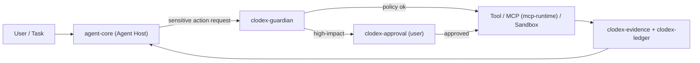
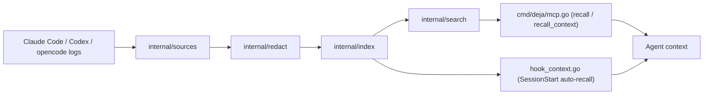
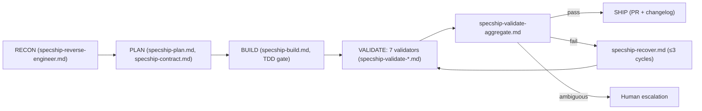

# Weekly Agentic AI Scan — 2026-07-16

**Nguồn dữ liệu**: GitHub REST API (`search/repositories`), truy vấn `created:>2026-07-09 stars:>200` (5 kết quả) và mở rộng `pushed:>2026-07-09 stars:>150` với từ khoá router/planner/orchestrator để tìm thêm ứng viên. Không có quyền dùng `gh` CLI trong phiên này nên toàn bộ dữ liệu lấy qua `api.github.com` (unauthenticated) và `raw.githubusercontent.com`.

## Executive Summary

- Tuần này nổi bật nhất là **xai-org/grok-build** — CLI coding agent chính thức của xAI (Rust) — nhưng đọc kỹ crate structure cho thấy đây gần như chỉ là "vỏ" build/release; phần lõi orchestration + TUI **không** nằm trong repo công khai.
- **clodex-ide** tách bạch rõ ràng "capability" khỏi "authority" qua 3 package độc lập (`clodex-guardian`, `clodex-approval`, `clodex-evidence`) — pattern quản trị rủi ro agentic đáng học, dù tốc độ tăng sao (812★/3 ngày, tài khoản cá nhân mới) đáng ngờ và cần thận trọng khi đánh giá độ "hot".
- **aws-samples/sample-specship** đóng gói một pipeline spec-driven với 7 validator subagent chạy song song như "adversarial panel" trước khi ship — eval methodology nghiêm túc, dù toàn bộ logic là markdown/hook cấu hình cho runtime đóng của Kiro chứ không phải code độc lập.

## Mục lục

1. [xai-org/grok-build](#1-xai-orggrok-build)
2. [mereyabdenbekuly-ctrl/clodex-ide](#2-mereyabdenbekuly-ctrlclodex-ide)
3. [vshulcz/deja-vu](#3-vshulczdeja-vu)
4. [aws-samples/sample-specship](#4-aws-samplessample-specship)

---

## 1. xai-org/grok-build

`https://github.com/xai-org/grok-build`

### §1 — Quick Context

CLI coding agent chính thức của xAI, TUI toàn màn hình, cạnh tranh trực tiếp với Claude Code/Codex/Gemini CLI. Tech stack: Rust (Cargo workspace nhiều crate), `protoc` (Protocol Buffers), MCP adapter riêng. Sức khoẻ repo: ~5.860 sao chỉ sau 2 ngày (tạo 2026-07-14), 887 forks, 0 open issue, Apache-2.0. Không có `.github/workflows` công khai; README nói rõ **không nhận contribution từ ngoài** và root `Cargo.toml` là auto-generated/read-only.

### §2 — Architecture Deep-dive

**A. Component inventory** (chỉ liệt kê phần thực sự public):

- `xai-tool-protocol` (`crates/common/xai-tool-protocol`) — định nghĩa protocol gọi tool giữa agent core và runtime.
- `xai-tool-runtime` (`crates/common/xai-tool-runtime`) — thực thi tool call.
- `xai-tool-types` (`crates/common/xai-tool-types`) — kiểu dữ liệu chung cho tool.
- `xai-grok-compaction` (`crates/common/xai-grok-compaction`) — nén context/history.
- `xai-circuit-breaker` (`crates/common/xai-circuit-breaker`) — resilience pattern (fallback/retry).
- `xai-computer-hub-core`, `xai-computer-hub-sdk`, `xai-computer-hub-mcp-adapter` (`crates/common/xai-computer-hub-*`) — cầu nối "computer use" ↔ MCP.
- `xai-interjection-core` (`crates/common/xai-interjection-core`) — cho phép "chen ngang" agent giữa lượt chạy.
- `xai-tracing` (`crates/common/xai-tracing`) — tracing/observability.
- `crates/build`, `crates/codegen` (`crates/build`, `crates/codegen`) — công cụ build/release, không phải logic agent.
- `bin/protoc` (`bin/protoc`) — binary Protocol Buffers compiler, gợi ý tool-protocol dùng protobuf.

**B. Control flow**: **Không xác định từ code.** Repo công khai không chứa agent orchestration loop hay TUI thực tế — chỉ có các crate hỗ trợ (tool protocol/runtime, compaction, tracing, computer-hub). Suy luận gián tiếp duy nhất có thể đưa ra (không xác nhận được là ReAct hay planner-executor): agent core (đóng, không public) gọi tool qua `xai-tool-protocol` → `xai-tool-runtime` thực thi → kết quả được nén qua `xai-grok-compaction` trước khi quay lại context.

**C. State & data flow**: `xai-tool-types`/`xai-tool-protocol` cho thấy tool call dùng schema riêng (không phải raw string), khả năng cao là protobuf (do có `bin/protoc`). Context window management dùng compaction/summarize (theo tên crate `xai-grok-compaction`), không phải sliding window thuần hay RAG — nhưng thuật toán cụ thể không xác định từ code.

**D. Tool/capability integration**: `xai-computer-hub-mcp-adapter` xác nhận tool ngoài tích hợp qua Model Context Protocol, không chỉ function-calling nội bộ.

**E. Memory**: Không xác định từ code — không có crate memory dài hạn riêng biệt ngoài compaction.

**F. Model orchestration**: Không xác định từ code (tài liệu ở `docs.x.ai/build/overview` nằm ngoài repo).

**G. Observability & eval**: `xai-tracing` xác nhận có tracing layer; không thấy eval/replay hook trong repo public.

**H. Extension points**: README nhắc "Agent Client Protocol" cho tích hợp editor, nhưng implementation không public.

### §3 — Architecture Diagram

**Insufficient evidence for diagram** — mã nguồn công khai chỉ chứa các crate hỗ trợ (tool protocol, compaction, tracing, computer-hub adapter...), không có phần lõi orchestration/TUI, nên không đủ bằng chứng để vẽ đúng luồng điều khiển thật.

### §4 — Verdict

**Đáng học**: tách "computer-hub" (điều khiển máy tính) thành SDK + core + MCP adapter riêng biệt — pattern "expose native capability như MCP server" để tái dùng nội bộ lẫn bên ngoài; `xai-interjection-core` là điểm hiếm gặp — giải quyết tường minh vấn đề "user chen ngang lượt chạy agent" mà ít framework xử lý rõ ràng.
**Red flag**: đây gần như là "vỏ" build/release — phần lõi (agent loop, TUI, prompt) hoàn toàn không nằm trong repo dù được quảng bá là "coding agent harness". Ví dụ điển hình của pattern "open code, closed logic".
**Câu hỏi mở**: tool-protocol thật sự dùng protobuf hay chỉ dùng `protoc` cho mục đích khác? Circuit-breaker và interjection phối hợp thế nào trong vòng lặp thật? Cần đọc `docs.x.ai/build/overview` hoặc chờ leak source để xác nhận.

---

## 2. mereyabdenbekuly-ctrl/clodex-ide

`https://github.com/mereyabdenbekuly-ctrl/clodex-ide`

### §1 — Quick Context

IDE agentic "zero-trust" — mọi hành động rủi ro phải qua lớp phê duyệt độc lập trước khi thực thi. Tech: TypeScript, Electron, pnpm monorepo qua Turborepo, 27 packages. Sức khoẻ: 812 sao trong 3 ngày (tạo 2026-07-12), 148 forks, chỉ 1 open issue, AGPL-3.0. **Lưu ý**: chủ repo là tài khoản cá nhân mới (`mereyabdenbekuly-ctrl`), tốc độ tăng sao bất thường so với tuổi repo — cần cảnh giác khi đánh giá "độ hot".

### §2 — Architecture Deep-dive

**A. Component inventory**:

- `packages/agent-core` — lõi vòng lặp Agent Host.
- `packages/clodex-guardian` — hệ thống policy đánh giá độc lập với model reasoning (authorization layer, "capability ≠ authority").
- `packages/clodex-approval` — luồng phê duyệt người dùng cho hành động high-impact.
- `packages/clodex-evidence` — ghi "evidence" append-only cho mỗi hành động (audit trail).
- `packages/clodex-ledger` / `packages/clodex-ledger-node` — sổ cái lưu vết turn/tác vụ, hỗ trợ checkpoint/crash-recovery.
- `packages/mcp-runtime` — MCP Host, quản lý kết nối MCP server.
- `packages/clodex-control-plane` / `-node` — điều phối control plane.
- `packages/clodex-kernel` — kernel hệ thống (vai trò chi tiết không xác định thêm ngoài tên).
- `packages/runner-sdk` — SDK cho execution backend tùy biến.
- `packages/clodex-registry` / `-node` — registry cho signed plugin/skill.
- `agent/runtime-node/src/{glob,grep,vscode-ripgrep}` (`agent/runtime-node/src`) — tool tìm kiếm file cụ thể (grep/glob), có `__tests__`.

**B. Control flow**: **Hierarchical, isolated-process pattern** (Electron main/renderer + Agent Host + MCP Host + sandbox workers theo README, khớp với tên package). Happy path suy luận từ README + cấu trúc package:

1. User định nghĩa "persistent task" ở Electron renderer (UI), gửi qua typed IPC.
2. Task chuyển tới Agent Host (`packages/agent-core`) chạy "managed turn".
3. Khi cần dùng tool nhạy cảm (shell/network/browser), request đi qua `clodex-guardian` để đánh giá policy.
4. Nếu high-impact, `clodex-approval` chặn lại chờ user phê duyệt tường minh (fail-closed).
5. Hành động được ghi vào `clodex-evidence`/`clodex-ledger` (audit, phục hồi được sau crash).
6. Kết quả trả về dạng diff/receipt; MCP tool (`mcp-runtime`) và skill (`clodex-registry`) đều đi qua cùng lớp Guardian.

**C. State & data flow**: IPC "typed" giữa renderer/main (theo README), schema cụ thể không xác định từ danh sách file đã duyệt. `clodex-evidence` gợi ý lưu dạng append-only log bất biến — chi tiết định dạng (file/DB) không xác định từ code.

**D. Tool/capability integration**: MCP (`mcp-runtime`, hỗ trợ stdio/HTTP-SSE theo README), Skills, signed plugin (`clodex-registry`), Runner SDK cho backend tùy biến (local/SSH/Docker/cloud). Sandbox worker được README nhắc tới nhưng thư mục triển khai cụ thể không thấy trong danh sách đã duyệt — không xác định từ code.

**E. Memory**: "Evidence-backed memory with append-only audit records" (README + package `clodex-evidence`); có phải retrieval semantic hay chỉ log tuyến tính — không xác định từ code.

**F. Model orchestration**: README nói "provider-neutral model routing with budget controls", nhưng không có package tên riêng cho model router trong danh sách 27 package (có thể nằm trong `agent-core`/`api-client`) — không xác định từ code.

**G. Observability & eval**: `clodex-evidence` + `clodex-ledger` đóng vai trò audit/observability thay vì tracing kiểu OpenTelemetry; không thấy package tracing riêng.

**H. Extension points**: `runner-sdk` (execution backend tùy biến), `clodex-registry` (signed plugin/skill registry), MCP server chuẩn.

### §3 — Architecture Diagram

### §4 — Verdict

**Đáng học**: mô hình "Guardian" tách bạch quyền hạn khỏi khả năng — mỗi tool call dù agent "có" quyền dùng, vẫn phải qua đánh giá policy độc lập (fail-closed), triển khai thành 3 package riêng biệt (`clodex-guardian`, `clodex-approval`, `clodex-evidence`) thay vì gộp vào agent loop — pattern quản trị rủi ro agentic hiếm thấy tách bạch rõ như vậy.
**Red flag**: tốc độ tăng sao bất thường (812★/3 ngày từ 1 tài khoản cá nhân ít lịch sử) nên nghi ngờ tính organic; nhiều phần README mô tả tham vọng (sandbox thực thi, model router cụ thể, "teleportation" giữa environment) không có evidence trực tiếp trong danh sách file đã duyệt.
**Câu hỏi mở**: Guardian policy engine dùng ngôn ngữ/DSL gì? Sandbox worker dùng container hay VM? Cần đọc source trong `packages/clodex-guardian` và `packages/clodex-kernel` để xác nhận.

---

## 3. vshulcz/deja-vu

`https://github.com/vshulcz/deja-vu`

### §1 — Quick Context

Lớp bộ nhớ cục bộ cho Claude Code/Codex/opencode — giúp agent "nhớ lại" giải pháp cũ đã từng chạy qua. Tech: Go, CLI, inverted index tự viết, MCP server (stdio), sync qua SSH. Sức khoẻ: 224 sao (tạo 2026-07-14), 6 forks, 16 open issue (issue tracker khá active so với tuổi repo — dấu hiệu dùng thật), MIT license, có thư mục `.github`.

### §2 — Architecture Deep-dive

**A. Component inventory**:

- `cmd/deja/main.go` — CLI entrypoint.
- `cmd/deja/mcp.go` — MCP server (stdio), expose tool `recall`/`recall_context`.
- `cmd/deja/hook_context.go` — logic SessionStart hook cho auto-recall.
- `cmd/deja/install.go` — cài đặt tích hợp cho từng harness.
- `cmd/deja/sync.go`, `cmd/deja/sync_ssh.go` — đồng bộ index qua file/SSH.
- `cmd/deja/share.go` — chia sẻ session đã redact.
- `cmd/deja/stats.go` — thống kê.
- `internal/sources` (`internal/sources`) — parser đọc JSONL (Claude Code, Codex) và SQLite (opencode).
- `internal/redact` (`internal/redact`) — bộ lọc redaction (AWS keys, bearer token, JWT, PEM) chạy tại thời điểm index.
- `internal/index` (`internal/index`) — xây inverted index (`records.bin`, token bucket, `manifest.json`).
- `internal/search/search.go` (11KB, có `search_test.go`) — search engine (AND logic, substring match, flags `--re`/`--harness`/`--project`/`--since`).
- `internal/model` (`internal/model`) — data model chung.

**B. Control flow**: **Pipeline/event-driven, không phải agent tự thân** — đây là memory sidecar phục vụ agent khác:

1. Harness (Claude Code/Codex/opencode) ghi log JSONL/SQLite như bình thường.
2. `internal/sources` đọc log → `internal/redact` xoá secret → `internal/index` build inverted index cục bộ (`deja warmup`).
3. Khi agent chạy, SessionStart hook (`hook_context.go`) hoặc MCP tool `recall` (`cmd/deja/mcp.go`) được gọi.
4. `internal/search` truy vấn inverted index, trả kết quả (≤4KB) qua `recall` hoặc digest qua `recall_context`.
5. Kết quả được tiêm vào context agent (auto-recall, cap ~2KB) không chặn startup.
6. Index đồng bộ qua nhiều máy qua `sync.go`/`sync_ssh.go`.

**C. State & data flow**: Message format là JSON (`--json` flag) hoặc markdown digest (`ctx`). State storage: file-based local index (`records.bin` + `manifest.json` trong `~/.cache/deja`), không dùng DB ngoài hay vector DB. Context window management: không summarize bằng LLM mà "auto-recall" bơm snippet giới hạn cứng theo KB — retrieval-inject chứ không phải summarization.

**D. Tool/capability integration**: MCP server (`cmd/deja/mcp.go`) qua stdio, expose 2 tool chuẩn MCP (`recall`, `recall_context`) — model tự gọi qua MCP client của harness, deja không tự parse JSON output của model.

**E. Memory architecture**: Đây chính là kiến trúc bộ nhớ — chỉ có long-term (toàn bộ lịch sử session cũ, lưu vĩnh viễn dưới dạng index), không có short-term riêng. Retrieval: inverted index + AND/substring match — **keyword-based**, không phải vector/embedding (README không nhắc embedding).

**F. Model orchestration**: Không xác định từ code — deja-vu không tự gọi LLM, chỉ phục vụ agent khác.

**G. Observability & eval**: `stats.go` cung cấp thống kê đơn giản (workspace totals, activity sparkline); không phải tracing kiểu OpenTelemetry, không thấy eval/replay hook.

**H. Extension points**: `deja install <harness> --auto` cho phép cài hook cho harness mới; cấu trúc `internal/sources` theo dạng parser-per-harness gợi ý dễ thêm harness — mức độ dễ mở rộng thực tế không xác định từ code.

### §3 — Architecture Diagram

### §4 — Verdict

**Đáng học**: không phải "agent" mà là hạ tầng memory sidecar tách biệt hoàn toàn khỏi vòng lặp LLM, dùng keyword inverted-index thay vì vector DB — trade-off rõ ràng ưu tiên tốc độ (7-9ms warm search) và privacy (zero network) hơn độ chính xác semantic.
**Red flag**: không có semantic search (chỉ AND + substring) nên có thể miss câu hỏi diễn đạt khác từ ngữ dù cùng ý; 16 open issue trên repo 2 ngày tuổi cho thấy còn nhiều rough edges.
**Câu hỏi mở**: `internal/model` chứa schema gì cụ thể, thuật toán index trong `records.bin` có nén/dedupe không, cơ chế "watermark" cho sync idempotent hoạt động ra sao — cần đọc trực tiếp các file `.go` tương ứng.

---

## 4. aws-samples/sample-specship

`https://github.com/aws-samples/sample-specship`

### §1 — Quick Context

Quy trình kỹ thuật "spec-driven" tự động cho AI coding agent chạy trên nền tảng Kiro (AWS), từ khảo sát codebase tới ship PR. Tech: Shell script + Node.js (`process-checker.js`) + Kiro "Power" packaging (steering markdown + hook JSON). Sức khoẻ: 159 sao (tạo 2026-07-10), 1 fork, 0 open issue, MIT, thuộc org chính thức `aws-samples`, có sẵn `docs/architecture-diagram.{md,svg,png,html}`.

### §2 — Architecture Deep-dive

**A. Component inventory**:

- `steering/specship-workflow.md` — steering doc định nghĩa toàn bộ pipeline (RECON→PLAN→BUILD→VALIDATE→SHIP).
- `steering/specship-reverse-engineer.md` — giai đoạn RECON cho brownfield.
- `steering/specship-plan.md`, `steering/specship-contract.md`, `steering/specship-testgen.md` — giai đoạn PLAN (market research, sprint contract, pre-write test).
- `steering/specship-build.md` — giai đoạn BUILD (TDD milestone-by-milestone).
- `steering/specship-validate.md` + 7 file `steering/specship-validate-{code,security,integration,browser,design,alignment,load}.md` — 7 validator chuyên biệt chạy song song.
- `steering/specship-validate-aggregate.md` — tổng hợp verdict từ 7 validator.
- `steering/specship-recover.md` — vòng lặp khắc phục khi validator fail (tối đa 3 chu kỳ theo README).
- `steering/specship-guardrails.md`, `steering/specship-prerequisites.md` — policy/điều kiện tiên quyết.
- `hooks/specship-tdd-test-on-save.kiro.hook`, `hooks/specship-validate-on-demand.kiro.hook`, `hooks/specship-no-inline-styles.kiro.hook` — hook sự kiện Kiro kích hoạt kiểm tra tự động.
- `process-checker.js` — kiểm tra tiến trình/tài nguyên.
- `specship-verify.sh`, `install.sh` — verify/cài đặt Power vào Kiro.

**B. Control flow**: **Planner-executor kết hợp Hierarchical validation** (supervisor tổng hợp verdict từ nhiều worker-validator), không phải ReAct đơn agent. Happy path (từ README + `docs/architecture-diagram.md`):

1. RECON (brownfield): reverse-engineer codebase hiện có → map stack/API/data model.
2. PLAN: research thị trường qua web search thật, sinh sprint contract + test case + roadmap (6 artifact: requirements, design, tasks, tests, API contract, browser flow).
3. BUILD: thực thi song song theo milestone, mỗi milestone bắt buộc qua TDD gate (fail test → code → pass test) rồi typecheck/build gate.
4. VALIDATE: 7 validator subagent chạy song song (code/security/integration/browser/design/alignment/load), mỗi validator trả verdict kèm evidence.
5. Aggregate verdict → 3 nhánh: SHIP (tạo PR/changelog), RECOVER (quay lại validate, tối đa 3 vòng), hoặc escalate cho human.
6. SHIP: sinh PR, changelog, báo cáo lưu trữ kèm timing/bug summary.

**C. State & data flow**: Message format là markdown "contract"/"steering doc" — điều khiển agent bằng natural-language spec chứ không phải typed message giữa module code. State lưu trong file (spec/contract/report markdown ngay trong repo dự án đích), không dùng DB. Cơ chế truncation/context window không xác định từ code.

**D. Tool/capability integration**: Không có "tool registry" theo nghĩa code truyền thống — cơ chế là Kiro hook (`*.kiro.hook`, JSON) kích hoạt theo sự kiện file (on-save/on-demand), và steering markdown "cấu hình" hành vi agent nền tảng Kiro có sẵn. Đây là pattern "prompt/config as infrastructure" — phần lớn logic thật nằm trong runtime đóng của Kiro, không trong repo này.

**E. Memory**: Không xác định từ code — không có module memory riêng; toàn bộ state có thể chỉ là artifact file trong repo dự án đích.

**F. Model orchestration**: Không xác định từ code — Power chạy trên model Kiro đã cấu hình sẵn, không thấy config chọn model theo role trong repo.

**G. Observability & eval**: `THREAT-MODEL-REMEDIATION.md` cho thấy có threat-model review; 7 validator trả "typed verdicts with evidence" (theo README) là một eval methodology phi tầm thường — cách ly việc chấm điểm output khỏi agent thực thi.

**H. Extension points**: Thêm validator mới = thêm 1 file `steering/specship-validate-*.md` + đăng ký vào `specship-validate.md`/`aggregate.md`; có auto-discovery hay cần sửa thủ công — không xác định từ code.

### §3 — Architecture Diagram

### §4 — Verdict

**Đáng học**: 7 validator chuyên biệt (code/security/integration/browser/design/alignment/load) chạy song song như một "adversarial panel" trước khi ship — eval methodology nghiêm túc, đóng gói sẵn thành workflow thay vì chỉ là ý tưởng; vòng lặp recover giới hạn 3 chu kỳ là chi tiết engineering thực dụng tránh loop vô hạn.
**Red flag**: toàn bộ "logic" là markdown steering doc + Kiro hook JSON, không phải code thực thi độc lập — kiến trúc phụ thuộc hoàn toàn vào runtime đóng của Kiro (AWS), không portable sang harness khác, khó verify hành vi thật nếu không có Kiro.
**Câu hỏi mở**: Kiro thực sự "route" giữa các steering doc bằng cơ chế gì (state machine? prompt chaining?) — không xác định được nếu không có source Kiro; cần trace một lần chạy thật để xác nhận happy path đúng như tài liệu.

---

## Self-check

- [x] Mỗi repo có link verify được (HTTP 200 qua `api.github.com`).
- [x] Không repo nào là awesome-list hoặc tutorial dump.
- [x] §2.A: mọi component đều có file path evidence thực tế.
- [x] §2.B: control flow pattern được đặt tên rõ ràng (hoặc ghi rõ "không xác định từ code" khi thiếu evidence — trường hợp grok-build).
- [x] §3: Mermaid syntax hợp lệ; grok-build được skip có lý do rõ ràng thay vì vẽ suy đoán.
- [x] §3: mọi node trong diagram (clodex-ide, deja-vu, sample-specship) đều xuất hiện trong §2.A tương ứng.
- [x] §4: điểm "đáng học" cụ thể theo từng repo, không generic.
- [x] File path theo convention `research/weekly/{YYYY-MM-DD}-agentic-scan.md`, markdown render được trên GitHub.
