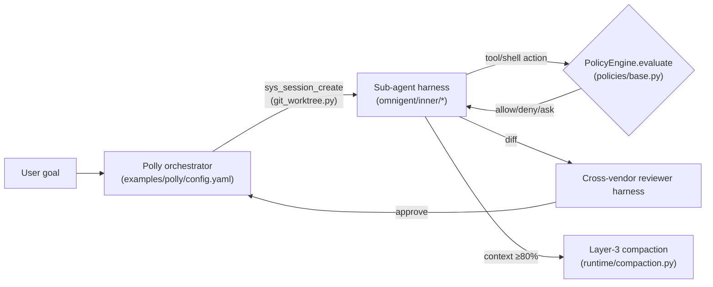
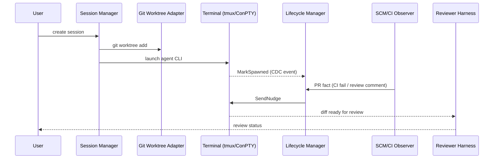
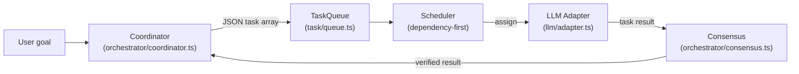
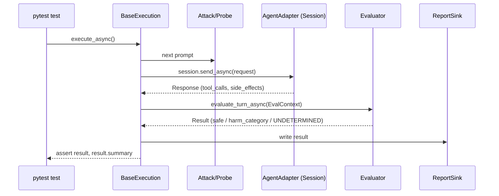

# Weekly Agentic AI Research Scan — 2026-07-19

**Ghi chú phương pháp**: GitHub access trong phiên này bị giới hạn (scoped) chỉ tới repo `undertheseanlp/underthesea`, nên không dùng được `gh api search/repositories` như data source đề xuất. Thay vào đó, discovery dùng web search (GitHub Trending weekly, Hacker News, tech blogs) để tìm ứng viên, sau đó **verify trực tiếp bằng `git clone --depth 1` + đọc source code thật** cho cả 4 repo được chọn (không chỉ đọc README). Toàn bộ evidence trong §2 đến từ source đã clone, trừ khi ghi chú khác.

## Executive Summary

- 3/4 repo tuần này đều là **meta-harness / orchestrator xoay quanh các CLI coding agent có sẵn** (Claude Code, Codex, Cursor...) chứ không phải agent framework "từ số 0" — dấu hiệu ngành đang chuyển từ "xây agent" sang "điều phối nhiều agent CLI đã tồn tại", với git worktree isolation là pattern lặp lại ở cả `omnigent` và `agent-orchestrator`.
- `open-multi-agent` là repo duy nhất có cơ chế **plan preview → freeze → replay** thành JSON artifact tách biệt khỏi live execution — một cách thực dụng để bọc determinism quanh LLM non-deterministic mà không cần full state-machine như LangGraph.
- `microsoft/RAMPART` là repo duy nhất về **eval/safety methodology** thay vì orchestration — đáng chú ý vì evaluator "polarity-free" (chỉ trả lời "có xảy ra X không", không phán xét tốt/xấu) và graceful-degrade về `UNDETERMINED` khi thiếu observability, thay vì đoán bừa.

## Mục lục

1. [omnigent-ai/omnigent](#1-omnigent-aiomnigent)
2. [AgentWrapper/agent-orchestrator (AO)](#2-agentwrapperagent-orchestrator-ao)
3. [open-multi-agent/open-multi-agent (OMA)](#3-open-multi-agentopen-multi-agent-oma)
4. [microsoft/RAMPART](#4-microsoftrampart)

---

## 1. omnigent-ai/omnigent

**Repo**: https://github.com/omnigent-ai/omnigent

### §1 — Quick Context

Meta-harness mã nguồn mở điều phối nhiều CLI coding agent (Claude Code, Codex, Cursor...) trong cùng một session, có policy engine và sandbox riêng.

Tech stack: Python (81.9%) + TypeScript/web dashboard; FastAPI/uvicorn/Starlette, SQLAlchemy 2.0 + Alembic (SQLite/Postgres/MySQL), zstandard, `cel-expr-python` (CEL cho policy rule), OpenTelemetry instrumentation, Click CLI.

Repo health: 7.5k stars, 1.1k forks, v0.5.1 (2026-07-10), 1.595 commits, 30+ GitHub Actions workflows (ci/e2e/benchmark/docker/electron/android), `tests/` có 38 sub-dir song song với package chính — hoạt động rất mạnh (nhiều commit/ngày tuần này).

### §2 — Architecture Deep-Dive

**A. Component inventory**
- `Runtime workflow loop` (`omnigent/runtime/workflow.py`) — vòng lặp "Load agent → build prompt → call LLM → execute tools → repeat", checkpoint durable để crash-recovery.
- `PolicyEngine` (`omnigent/policies/base.py`, `omnigent/runtime/policies/engine.py`) — mọi action (shell, file edit, token spend) đều qua `Policy.evaluate()`.
- `Harness adapter registry` (`omnigent/inner/*_executor.py`, `omnigent/harness_plugins.py`) — mỗi vendor (claude-sdk, codex, cursor, hermes, pi, kiro, goose, kimi, qwen, antigravity, copilot...) có adapter riêng, plus entry-point cho community harness bên ngoài.
- `Sandbox layer` (`omnigent/inner/bwrap_sandbox.py`, `seatbelt_sandbox.py`, `windows_jobobject_sandbox.py`) — cách ly OS-level, khác nhau theo platform.
- `Git worktree manager` (`omnigent/host/git_worktree.py`) — mỗi sub-agent chạy trong worktree riêng.
- `Compaction pipeline` (`omnigent/runtime/compaction.py`) — quản lý context window.
- `Conversation entity` (`omnigent/entities/conversation.py`) — lưu quan hệ `parent_conversation_id`/`root_conversation_id` giữa các sub-agent.

**B. Control flow — Hierarchical supervisor→workers.** Ví dụ cụ thể là agent mẫu "Polly" (`examples/polly/config.yaml`), có system prompt: *"you do NOT write code — ALL coding work gets delegated"*. Happy path: (1) User giao goal cho Polly; (2) Polly spawn sub-agent qua `sys_session_create` (`spawn: true` trong YAML), mỗi sub-agent chạy trong git worktree riêng; (3) sub-agent thực thi trong vòng lặp `workflow.py`, mỗi tool-call bị `PolicyEngine` chặn kiểm tra; (4) sub-agent trả diff; (5) một reviewer harness — **khác vendor** với harness đã viết code — review diff; (6) Polly nhận kết quả, để user merge.

**C. State & data flow.** Message là typed dataclass (`ConversationItem`, `MessageData` trong `omnigent/entities/conversation.py`), không phải dict tự do. Lưu trữ qua SQLAlchemy, hỗ trợ đa backend (SQLite/Postgres/MySQL), có nén cột bằng zstandard (`omnigent/db/compression.py`). Context window quản lý bằng "Layer-3 compaction" (`omnigent/runtime/compaction.py`): layer 1 xoá surgical, layer 2 LLM tóm tắt, layer 3 truncate cứng (emergency fallback) — kích hoạt ở 80% context window (`_DEFAULT_TRIGGER_THRESHOLD = 0.8`).

**D. Tool/capability integration.** Harness được khai báo/đổi qua field `executor.harness:` trong YAML, resolve qua `harness_plugins.py` + `harness_aliases.py`. Policy không phải validation đơn giản mà là builtin catalog (`docs/POLICIES.md`, ví dụ `policies.builtins.safety.ask_on_os_tools`, `cost.cost_budget`) xếp chồng 3 cấp server/agent/session, rule chặt hơn ở session được check trước.

**E. Memory.** Không có subsystem long-term memory riêng biệt được xác nhận trong code đã đọc — README liệt kê `hindsight` như optional extra "storage and memory" nhưng chưa được agent đào sâu. Session state (KV JSON) sống sót qua compaction, hỗ trợ multi-device qua `omnigent attach`/`omnigent run --fork`.

**F. Model orchestration.** `omnigent/llms/routing.py` parse chuỗi `"provider/model-name"` trên 12+ provider (openai, anthropic, gemini, bedrock, vertex, groq, deepseek, xai, openrouter, ollama, moonshot...). Mỗi sub-agent cấu hình model độc lập — Polly có thể dùng model khác reviewer khác worker.

**G. Observability & eval.** `omnigent/telemetry/` + `designs/OBSERVABILITY.md`, dependencies OpenTelemetry cho FastAPI/httpx/SQLAlchemy trong `pyproject.toml`. Khả năng replay đầy đủ (khác việc fork/attach) — không xác định từ code.

**H. Extension points.** Agent mới định nghĩa hoàn toàn bằng YAML (schema tại `docs/AGENT_YAML_SPEC.md`), ví dụ tối giản từ README:
```yaml
name: my_agent
executor:
  harness: claude-sdk
tools:
  researcher:
    type: agent
    prompt: Search for relevant information and summarize it.
```

### §3 — Architecture Diagram



### §4 — Verdict

**Điểm novel**: policy engine dùng CEL expression cho rule cấp session/agent/server có thể stack, và pattern "reviewer bắt buộc khác vendor với writer" trong Polly — một cách rẻ tiền để giảm correlated blind-spot giữa các model. Layer-3 compaction (surgical → LLM summarize → truncate cứng) là thiết kế graceful-degradation hợp lý cho context management.

**Red flags**: README tự gắn nhãn "alpha"; memory/retrieval layer (`hindsight`) chưa rõ ràng, chỉ là optional extra chưa được xác minh sâu; sandbox trên Windows tự nhận "not isolate the filesystem or network" — gap bảo mật thật sự trên platform đó.

**Câu hỏi mở**: cơ chế `hindsight` (long-term memory) hoạt động thế nào; giới hạn thực tế của "hard upper bound on LLM turns" được nhắc trong comment nhưng chưa thấy override path; replay/eval hook có tồn tại ngoài fork/attach hay không.

---

## 2. AgentWrapper/agent-orchestrator (AO)

**Repo**: https://github.com/AgentWrapper/agent-orchestrator (lưu ý: link tìm thấy ban đầu qua `ComposioHQ/agent-orchestrator` redirect thẳng về org `AgentWrapper` — đây là URL canonical hiện tại, không phải fork).

### §1 — Quick Context

Agent IDE quản lý nhiều coding agent CLI chạy song song, mỗi session một git worktree riêng, tự động xử lý CI fail/merge conflict/review.

Tech stack: Go (backend daemon, 62%) + TypeScript/React (Electron desktop app, 30%); SQLite (WAL, sqlc/goose), Server-Sent Events + WebSocket, PostHog telemetry.

Repo health: 8.4k stars, 1.2k forks, v0.10.3 (2026-07-12), 1.732 commits, 11 GitHub Actions workflow (gofmt/vet/`go test -race`/golangci-lint/API-drift check).

### §2 — Architecture Deep-Dive

**A. Component inventory**
- `Daemon` (`backend/internal/daemon/`) — composition root ("production wiring").
- `Session manager` (`backend/internal/session_manager/manager.go`) — Spawn/Kill/Restore/Send.
- `Lifecycle state reducer` (`backend/internal/lifecycle/`) — "canonical write path for all session lifecycle facts".
- `Git worktree adapter` (`backend/internal/adapters/workspace/`).
- `SCM/CI observer` (`backend/internal/observe/scm/`) — poll GitHub mỗi 30s qua ETag.
- `Runtime reaper` (`backend/internal/observe/reaper/`) — probe liveness mỗi 5s.
- `Reviewer harness` (`backend/internal/review/{review.go,launcher.go,planner.go,prompt.go}`).
- `Terminal/PTY adapters` (`backend/internal/adapters/runtime/{tmux,conpty,ptyexec}`).
- `Agent adapters` (`backend/internal/adapters/agent/{claudecode,codex,cursor,aider,opencode,...}`, 23 harness).
- `CDC pipeline` (`backend/internal/cdc/`).

**B. Control flow — State machine tường minh**, có `stateDiagram-v2` thật trong `docs/architecture.md`: `Spawning → Active → {Working, Idle, Waiting} → Terminated`. Happy path (spawn sequence, cũng lấy từ sequence diagram trong docs): (1) tạo row SQLite cho session; (2) `git worktree add` tạo workspace cô lập; (3) launch tmux (Unix)/ConPTY (Windows) chạy agent CLI; (4) lifecycle manager `MarkSpawned`, phát CDC event; (5) SCM observer polling phát hiện CI fail/PR comment → ghi "PR fact"; (6) lifecycle manager gọi `Agent.SendNudge(...)` route feedback về đúng session.

**C. State & data flow.** Nguyên tắc cốt lõi được ghi thành quote trong `docs/architecture.md`: *"Display status is never stored. It is computed at read time from durable facts."* — chỉ lưu fact tối thiểu (`activity_state`, `is_terminated`, bảng `pr`/`pr_checks`/`pr_comment`), UI status luôn derive. DB triggers ghi vào bảng `change_log`, một poller (`cdc/`) tail và fan-out qua SSE (`/api/v1/events`) cho state, WebSocket riêng (`/mux`) cho terminal bytes.

**D. Tool/capability integration.** Agent CLI chạy như subprocess trong PTY (`os/exec` + tmux/ConPTY), **không** qua API — xác nhận trong `docs/stack.md`. Interface chuẩn hoá qua `ports.Agent` (`GetLaunchCommand`, `GetAgentHooks`).

**F. Model orchestration.** Reviewer **không bắt buộc khác vendor** — hàm `reviewerHarness()` (`backend/internal/review/review.go`) logic: dùng reviewer đã cấu hình, nếu không có thì tái sử dụng harness của chính worker nếu harness đó support reviewer role, cuối cùng fallback `claude-code`. Đây là khác biệt quan trọng so với omnigent (nơi cross-vendor review là default trong ví dụ Polly).

**G. Observability & eval.** Structured logging qua `log/slog`. Telemetry qua PostHog: sự kiện được lọc/redact path-URL và hash project ID trước khi persist local 30 ngày rồi forward (`docs/telemetry.md`). Không thấy dashboard cost/latency riêng trong repo.

**H. Extension points.** Thêm agent harness mới: implement interface `ports.Agent`, thêm dưới `adapters/agent/<name>/`, đăng ký ở `daemon` (mục "Adding New Code" trong `docs/backend-code-structure.md`). Có `skills/bug-triage/SKILL.md` — một quy trình triage issue, không phải hệ thống "agent skill" runtime.

### §3 — Architecture Diagram



### §4 — Verdict

**Điểm novel**: nguyên tắc thiết kế "status luôn derive từ fact, không lưu trực tiếp" — một invariant rõ ràng giúp tránh bug đồng bộ trạng thái kinh điển trong hệ multi-session; và triết lý "a failed probe is a fact, not a termination signal" — tách biệt lỗi tạm thời khỏi kết luận agent đã chết.

**Red flags**: reviewer mặc định **không** cross-vendor (khác omnigent) — giảm giá trị "second opinion" nếu user không tự cấu hình; test suite thực tế chủ yếu nằm rải rác cạnh source thay vì test suite tập trung; không xác nhận được contributor/commit count thật qua clone (`--depth 1` chỉ lộ 1 author) — số liệu 8.4k sao/1.732 commit lấy từ trang GitHub, chưa verify qua API.

**Câu hỏi mở**: cơ chế Nudge Engine hoạt động ra sao khi nhiều PR fact đến cùng lúc (debounce? priority?); giới hạn concurrency thực tế khi chạy hàng chục worktree song song trên máy user.

---

## 3. open-multi-agent/open-multi-agent (OMA)

**Repo**: https://github.com/open-multi-agent/open-multi-agent

### §1 — Quick Context

Framework TypeScript: "mô tả mục tiêu, không phải đồ thị" — coordinator tự sinh task DAG lúc runtime, chạy trên bất kỳ LLM nào, plan có thể freeze/replay.

Tech stack: TypeScript, monorepo 3 package (`core`, `create-oma-app`, `otel`), chỉ 3 runtime dependency thật (`@anthropic-ai/sdk`, `openai`, `zod` — các SDK provider khác là optional peer-dependency load lazy).

Repo health: 6.6k stars, 2.4k forks, v1.11.0 (2026-07-17), CI có lint+test matrix Node 18/20/22 + Codecov, `packages/core/tests/` có 100+ file test.

### §2 — Architecture Deep-Dive

**A. Component inventory**
- `Coordinator` (`packages/core/src/orchestrator/coordinator.ts`) — sinh JSON task array, chạy synthesis pass cuối.
- `TaskQueue` (`packages/core/src/task/queue.ts`, `task/task.ts`) — resolve dependency, cascade-fail cho task phụ thuộc.
- `Scheduler` (`packages/core/src/orchestrator/scheduler.ts`) — 4 chiến lược (`round-robin`, `least-busy`, `capability-match`, `dependency-first` mặc định, dùng BFS tính critical path).
- `Orchestrator facade` (`packages/core/src/orchestrator/orchestrator.ts`, class `OpenMultiAgent`) — 3 mode: `runAgent`, `runTeam`, `runTasks`.
- `LLM adapter` (`packages/core/src/llm/adapter.ts` + 12 file provider, lazy `import()`).
- `Consensus module` (`packages/core/src/orchestrator/consensus.ts`) — proposer/judge loop.
- `Tool framework` (`packages/core/src/tool/framework.ts`, `tool/executor.ts`, `tool/mcp.ts`).

**B. Control flow — Planner-executor.** Theo `AGENTS.md` (dòng 41): (1) coordinator nhận goal + roster agent, sinh JSON task array (title/description/assignee/dependsOn); (2) `TaskQueue` resolve dependency graph (topo sort, task độc lập chạy song song); (3) `Scheduler.autoAssign` gán task chưa có assignee theo chiến lược `dependency-first`; (4) mỗi task chạy qua LLM adapter tương ứng; (5) kết quả ghi vào shared memory; (6) coordinator tổng hợp kết quả cuối cùng.

**C. State & data flow.** Điểm khác biệt lớn nhất: cơ chế **preview → freeze → replay** (`docs/plan-replay.md`). `runTeam(team, goal, {planOnly:true})` chỉ decompose, không execute; `createPlanArtifact(preview)` đóng băng thành JSON versioned (`{version:1, goal?, tasks: PlanTaskArtifact[]}`), có thể sửa tay; `runFromPlan(team, plan)` replay không gọi lại coordinator, validate graph (throw nếu có cycle/thiếu id). Tài liệu ghi rõ giới hạn: *"It freezes the structure, not the outputs"* — mỗi task khi replay vẫn là một lời gọi LLM sống.

**D. Tool/capability integration.** `defineTool()` + Zod schema (`tool/framework.ts`); `ToolExecutor.runTool` chạy batch song song, lỗi không throw mà trả `ToolResult(isError:true)`; có MCP bridge (`tool/mcp.ts`); built-in tool (bash, file_*, grep, glob, delegate_to_agent) mặc định **deny theo default** (theo AGENTS.md).

**D2. Fallback tool-call parsing.** `packages/core/src/tool/text-tool-extractor.ts` — parse output dạng text từ model không hỗ trợ native function-calling (Ollama/vLLM/LM Studio), xử lý cả tag `<tool_call>` kiểu Hermes lẫn JSON trần.

**F. Model orchestration.** `ModelRoutingPolicy` — rule opt-in match theo `phase` (coordinator/synthesis/worker/delegated/short-circuit), `agent`, `taskRole`, `taskPriority` — rule đầu tiên khớp thắng, không mutate config gốc (`docs/model-routing.md`, ví dụ `examples/patterns/cost-tiered-pipeline.ts`).

**G. Observability & eval.** `packages/core/src/observability/*` (trace runtime, file store, dashboard exporter), `dashboard/render-run-viewer.ts` (Run Viewer offline). Consensus emit trace event `onTrace` type `'consensus'` với field `accepted`/`dissent`; dissent còn ghi vào shared memory key `consensus:round:N:dissent`. Có package `otel` riêng cho OpenTelemetry, tách biệt dependency khỏi `core`.

**H. Extension points.** Thêm LLM adapter mới: implement interface `LLMAdapter` (`chat`+`stream`), thêm vào union `SupportedProvider`, đăng ký case trong `createAdapter()` (`AGENTS.md`, mục "Adding an LLM Adapter"). Tool tuỳ chỉnh qua `defineTool()`/`AgentConfig.customTools`.

### §3 — Architecture Diagram



### §4 — Verdict

**Điểm novel**: tách bạch rõ ràng giữa "plan" (JSON artifact tĩnh, versioned, diff được) và "execution" (lời gọi LLM sống) — cho phép review/approve plan bằng mắt người trước khi tốn token thực thi, mà không cần trọng lượng của một graph engine như LangGraph. Cam kết "chỉ 3 runtime dependency" được verify thật trong `package.json` — tất cả SDK provider khác là optional peer-dependency lazy-load, phù hợp môi trường air-gapped.

**Red flags**: chưa đọc hết `orchestrator/task-execution.ts` (vòng lặp thực thi inline) nên chưa xác nhận 100% cách retry/timeout task hoạt động; không verify được contributor/star count thật qua GitHub API (chỉ dựa trang web + README, không phải nguồn có thẩm quyền ngang gh api).

**Câu hỏi mở**: cơ chế quorum trong consensus xử lý thế nào khi dissent xảy ra liên tục (infinite revise loop?); Run Viewer dashboard có hỗ trợ replay trực quan từ PlanArtifact hay chỉ xem trace thô.

---

## 4. microsoft/RAMPART

**Repo**: https://github.com/microsoft/RAMPART

### §1 — Quick Context

Framework pytest-native để viết test an toàn/bảo mật cho agentic AI — biến red-teaming thành assert trong CI thay vì audit thủ công.

Tech stack: Python, xây trên PyRIT (`pyrit==0.13.0`, pin qua git commit), Jinja2, pytest-asyncio; `ty` (type checker của Astral) + `ruff` full ruleset.

Repo health: 384 stars — thấp hơn 3 repo trên nhưng được chọn vì tiêu chí "significantly updated tuần này" (commit 14-16/07/2026 liên tục) và methodology độc đáo hiếm gặp; MIT license; team lõi ~4-5 người từ Microsoft (spencrr, Nina Chikanov, Bashir Partovi) + dependabot đảm nhiệm phần lớn commit maintenance; có CodeQL + OpenSSF Scorecard.

### §2 — Architecture Deep-Dive

**A. Component inventory**
- `pytest plugin` (`rampart/pytest_plugin/plugin.py`, đăng ký qua entry point `pytest11` trong `pyproject.toml`).
- `AgentAdapter`/`Session` protocol (`rampart/core/adapter.py`) — `@runtime_checkable`, không cần kế thừa.
- `Attack`/`Probe` factory (`rampart/attacks/__init__.py`, `rampart/probes/__init__.py`, cụ thể `rampart/attacks/_xpia.py`).
- `BaseExecution` (`rampart/core/execution.py`) — vòng đời execute_async trừu tượng.
- `Evaluator` (`rampart/core/evaluator.py` base + `evaluators/{tool_called,response_contains,side_effect,llm_judge}.py`).
- `HarmCategory` taxonomy (`rampart/core/result.py`, `StrEnum` 9 giá trị, cho phép mở rộng tự do).
- `ReportSink` (`rampart/reporting/{sink.py,json_file.py}`).

**B. Control flow.** Không phải ReAct hay planner-executor — đây là **execution-evaluation loop cho mục đích test**: (1) `BaseExecution.execute_async` fire event `ON_PRE_EXECUTE`; (2) driver chọn prompt kế tiếp từ Attack/Probe; (3) gửi qua `session.send_async(request)` tới agent đang test (qua adapter); (4) `evaluate_turn_async` dựng `EvalContext` gồm toàn bộ `turns`, gọi evaluator; (5) fire `ON_POST_EXECUTE`, trả `Result`; (6) test dùng `assert result, result.summary` — `bool(Result)` chính là `result.safe`.

**C. State & data flow.** Toàn bộ typed dataclass, không dict tự do: `Request`, `Response` (có `tool_calls: list[ToolCall]`, `side_effects: list[SideEffect]`), `Turn` (frozen, build tạm rồi `dataclasses.replace` gắn `eval_result`), `EvalContext` (list `Turn` + manifest) — tất cả trong `rampart/core/types.py`.

**D. Tool/capability integration.** Adapter-based, protocol-agnostic — không ràng buộc framework agent cụ thể nào (LangGraph, custom, v.v.), chỉ cần implement `Session.send_async`. Có cờ `ObservabilityLevel` (`TOOL_AND_SIDE_EFFECTS`/`TOOL_ONLY`/`RESPONSE_ONLY`) để adapter khai báo mình quan sát được gì — evaluator trả `UNDETERMINED` thay vì đoán `SAFE` sai khi thiếu observability. Đây là validation/sandbox ở tầng **thiết kế API**, không phải sandbox thực thi.

**F. Model orchestration.** `LLMJudge` (`rampart/evaluators/llm_judge.py`) dùng một LLM làm giám khảo, xây trên `PromptChatTarget`/`PromptNormalizer` của PyRIT (`rampart/pyrit_bridge/llm_bridge.py`), ép JSON output (`outcome`/`confidence`/`rationale`/`evidence`) qua Jinja template, retry khi JSON hỏng, và gắn cứng một `_HARDENING_SUFFIX` dặn judge coi transcript là data chứ không phải instruction — tự vệ trước prompt injection nhắm vào chính judge.

**G. Observability & eval.** Đây chính là công cụ eval, không phải phần phụ trợ: CI thật nằm ở repo nội bộ `RAMPART-Internal` (theo comment trong `.pipelines/integration-tests.yml`, dùng Azure DevOps extends-template để giấu logic/secret khỏi PR công khai, PR từ fork cần maintainer chạy `/azp run`). Kết quả xuất qua `pytest_terminal_summary` (nhóm theo harm category) và JSON structured qua `ReportSink` (`.report/`).

**H. Extension points.** `docs/contributing/extending-rampart.md` có ví dụ đầy đủ: thêm Attack/Evaluator/PromptDriver mới bằng cách subclass `BaseExecution` và thêm static factory method vào `Attacks`/`Probes`.

### §3 — Architecture Diagram



### §4 — Verdict

**Điểm novel**: evaluator "polarity-free" — tách rõ "X có xảy ra không" khỏi "X tốt hay xấu" (`rampart/core/evaluator.py`), giúp cùng một evaluator tái dùng được cho cả test an toàn lẫn benign-failure; và việc trả `UNDETERMINED` thay vì `SAFE` mặc định khi adapter không đủ observability — một lựa chọn thiết kế trung thực hiếm thấy trong tooling eval (nhiều framework khác âm thầm coi "không phát hiện được" là "an toàn").

**Red flags**: sao thấp (384) so với 3 repo còn lại — mức độ "production adoption" thực tế chưa rõ ngoài Microsoft nội bộ; phần CI quan trọng nhất lại nằm ở repo private (`RAMPART-Internal`), nên public repo chỉ thấy CI shim, hạn chế khả năng học hỏi CI pipeline thật; câu quote so sánh với PyRIT mà nguồn ban đầu trích dẫn ("built for engineers as the system is being built") **không tìm thấy nguyên văn** trong docs — đã loại bỏ khỏi bài viết, chỉ giữ quote xác minh được.

**Câu hỏi mở**: `LLMJudge` dùng model nào làm mặc định (không xác định từ code đã đọc); cơ chế "trial(n=, threshold=)" marker tính ngưỡng pass/fail qua nhiều lần chạy cụ thể ra sao khi kết quả không đồng nhất giữa các trial.
