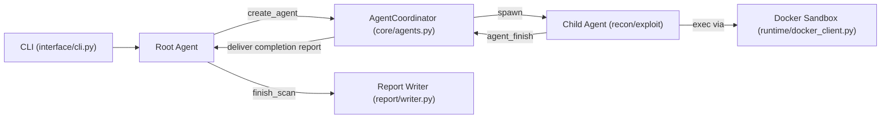
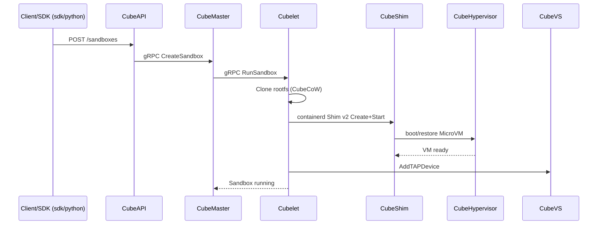
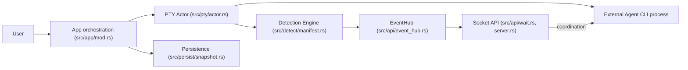
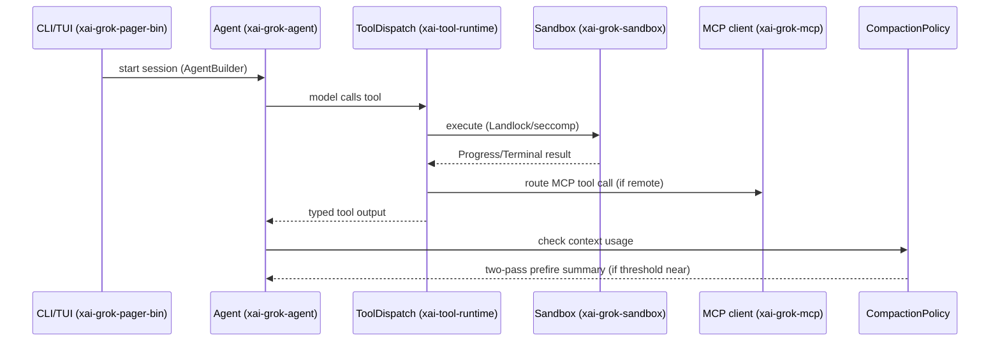

# Agentic AI Architecture Scout — Tuần 13-20/07/2026

> Phương pháp: do không có quyền truy cập `gh` CLI hoặc GitHub Search API có xác thực (proxy môi trường trả về lỗi 403 "sessions are bound to their configured repositories" cho mọi endpoint ngoài `undertheseanlp/underthesea`, kể cả `api.github.com/search/*` và `api.github.com/repos/{owner}/{repo}` cho repo khác), toàn bộ phần khám phá (discovery) dùa trên **WebSearch** (không phải GitHub API) để tìm ứng viên, sau đó **xác minh trực tiếp bằng `git clone`** (giao thức git không bị chặn) vào từng repo để lấy ngày commit thật (`git log -1 --format="%ci"`), cấu trúc thư mục, README, và mã nguồn lõi. Toàn bộ dữ liệu ngày tháng/ngôi sao/kiến trúc dưới đây đến từ nội dung đã fetch/clone thật, không suy diễn.

## Tóm tắt điều hành

- Tìm được 9 repo agentic AI có hoạt động thật trong 7 ngày qua (commit cuối từ 14/07 đến 20/07/2026, xác minh qua `git log`), từ nhiều mảng: multi-agent pentesting, agent sandboxing infra, agent-CLI multiplexer, và một agent runtime production từ xAI.
- Sau khi lọc bỏ awesome-list/tutorial và các wrapper mỏng, chọn 4 repo để đào sâu kiến trúc: **usestrix/strix** (multi-agent pentesting), **TencentCloud/CubeSandbox** (hạ tầng MicroVM cho agent), **ogulcancelik/herdr** (multiplexer điều phối nhiều agent CLI), **xai-org/grok-build** (agent runtime CLI chính thức của xAI, vừa mã nguồn mở 15/07/2026).
- Điểm đáng chú ý nhất tuần này: cách 4 repo tiếp cận "agentic architecture" từ 4 góc hoàn toàn khác nhau — orchestration đa agent trong-process (Strix), hạ tầng cô lập phần cứng bên dưới agent (CubeSandbox), điều phối agent CLI đã chạy sẵn từ bên ngoài qua screen-scraping + socket API (herdr), và kỹ thuật compaction/context-management production-grade bên trong một agent runtime đơn (grok-build).

## Mục lục

- [1. usestrix/strix — Multi-agent AI Pentesting](#1-usestrixstrix)
- [2. TencentCloud/CubeSandbox — Hardware-isolated MicroVM Sandbox cho AI Agent](#2-tencentcloudcubesandbox)
- [3. ogulcancelik/herdr — Terminal Agent Multiplexer](#3-ogulcancelikherdr)
- [4. xai-org/grok-build — Grok Build CLI Agent Runtime](#4-xai-orggrok-build)
- [Phụ lục: Danh sách 9 repo phát hiện được](#phụ-lục-danh-sách-9-repo-phát-hiện-được)

---

## 1. usestrix/strix

### §1 — Quick context

Công cụ pentest mã nguồn mở dùng nhiều AI agent tự động tìm, khai thác và xác thực lỗ hổng bảo mật bằng PoC thực tế, không phải scanner tĩnh. Stack: Python (92.8%), xây trên `agents` SDK dạng "SandboxAgent" (OpenAI Agents SDK hoặc bản tùy biến — không xác định rõ nguồn), sandbox thực thi bằng Docker, tích hợp proxy Caido. Sức khỏe repo: 42.7k sao, 4.4k fork, release mới nhất v1.1.0 (14/07/2026), có `tests/` (~25 file test), có CI (`build-release.yml`), và một benchmark eval công khai riêng (repo `usestrix/benchmarks`).

### §2 — Architecture deep-dive

**A. Component inventory**
- `AgentCoordinator` (`strix/core/agents.py`) — chủ sở hữu duy nhất của trạng thái đồ thị multi-agent: status, quan hệ parent/child, hộp thư (pending message), session SDK, và snapshot phục hồi sau crash.
- Agent factory (`strix/agents/factory.py`) — dựng `SandboxAgent` cho cả root và child, gắn bộ tool, system prompt, capability Filesystem/Shell.
- Execution loop (`strix/core/execution.py`) — chạy `Runner` (SDK) cho từng agent, quản lý giới hạn turn/budget và interrupt khi ở chế độ tương tác.
- Agents-graph tools (`strix/tools/agents_graph/tools.py`) — bộ tool `create_agent`, `send_message_to_agent`, `wait_for_message`, `view_agent_graph`, `stop_agent`, `agent_finish`: đây chính là cơ chế điều phối đa agent, được lộ ra dưới dạng tool cho LLM gọi.
- Sandbox runtime (`strix/runtime/backends.py`, `strix/runtime/docker_client.py`) — backend thực thi bằng Docker cho mỗi agent session.
- Report writer (`strix/report/writer.py`, `strix/report/sarif.py`, `strix/report/dedupe.py`) — sinh báo cáo lỗ hổng có cấu trúc, xuất SARIF, khử trùng lặp.
- Skills (`strix/skills/`) — gói kỹ năng nạp động (reconnaissance, vulnerabilities, protocols, cloud...) qua tool `load_skill`.

**B. Control flow pattern**: **Hierarchical/supervisor-workers** ("Graph of Agents"). Root agent tự quyết định sinh các agent con chuyên biệt (recon/exploit/post-exploitation) qua tool `create_agent`; mỗi agent con chạy vòng lặp `Runner` riêng, bất đồng bộ.
1. CLI (`strix/interface/cli.py`) khởi tạo root agent qua `build_strix_agent(is_root=True)`.
2. Root agent trinh sát, gọi `create_agent` để sinh agent con chuyên biệt → `AgentCoordinator` đăng ký và spawn task async chạy `run_agent_loop`.
3. Mỗi agent con chạy trong sandbox Docker riêng, dùng tool exec/proxy/browser để tìm và khai thác lỗ hổng.
4. Agent con báo cáo tiến độ cho parent/sibling qua `send_message_to_agent`; parent có thể `wait_for_message` (park bằng `asyncio.Event`).
5. Khi hoàn thành, agent con gọi `agent_finish` → coordinator định dạng completion report, chèn vào session của parent, đánh thức parent.
6. Root tổng hợp, gọi `create_vulnerability_report`, rồi `finish_scan` để kết thúc và sinh báo cáo cuối (kể cả SARIF).

**C. State & data flow**: Message giữa các agent là dict có cấu trúc (`from/content/type/priority`), được render thành text và append vào `Session` (SDK) của agent đích dưới dạng `TResponseInputItem`. Trạng thái đồ thị coordinator (status, parent_of, pending_counts...) sống in-memory (khóa bằng `asyncio.Lock`) và được snapshot định kỳ ra file JSON (ghi tạm rồi `replace()` nguyên tử) để phục hồi sau crash — không dùng DB ngoài.

**D. Tool/capability integration**: Tool đăng ký dưới dạng `FunctionTool`/`CustomTool` của SDK — function-calling gốc với JSON schema; lỗi tool được bắt và trả về dạng text cho model thay vì raise exception (`_function_tool_with_error_result`). Thực thi được sandbox hóa trong container Docker qua abstraction Filesystem/Shell của SDK, không chạy trực tiếp trên host.

**E. Memory**: Bỏ qua — không thấy hệ thống bộ nhớ dài hạn/retrieval riêng ngoài lịch sử session của SDK và snapshot phục hồi của coordinator; tool "notes" chỉ là ghi chú tạm.

**F. Model orchestration**: Model chọn qua biến môi trường (`STRIX_LLM`), dùng chung cho root và child theo mặc định; không xác định từ code đã đọc.

**G. Observability & eval**: Có module telemetry (`strix/telemetry/`, gồm PostHog/Scarf) và logging chuẩn cho sự kiện agent. Eval thật: benchmark XBEN (104 challenge bảo mật, 96% thành công ở chế độ black-box, ~19 phút/challenge, ~337 USD cho 100 challenge) — nhưng script/dữ liệu eval nằm ở repo riêng `usestrix/benchmarks`, không xác minh được chi tiết từ repo đã clone.

**H. Extension points**: `strix/skills/custom/` cho skill người dùng tự thêm; `register_agent_tools()` trong factory.py cho phép ứng dụng host thêm tool vào mọi agent quét; provider LLM khai báo qua docs (OpenAI/Anthropic/Google/Bedrock/Vertex...).

### §3 — Architecture diagram

### §4 — Verdict

Điểm đáng học: `AgentCoordinator` là một state machine async single-owner thật sự cho đồ thị multi-agent động (không cố định pipeline), có hộp thư kiểu inbox, park/wake bằng `asyncio.Event`, và snapshot phục hồi sau crash — đây là orchestration production-grade chứ không phải demo. Được hậu thuẫn bởi benchmark ngoài thật (XBEN, có số liệu chi phí/thời gian cụ thể) thay vì chỉ marketing. Red flag: mã benchmark nằm ở repo khác, không kiểm chứng được trực tiếp; phụ thuộc nặng vào SDK `agents.sandbox`/`agents.agent` — không rõ đây là OpenAI Agents SDK công khai hay bản fork riêng của Strix. Câu hỏi mở: cơ chế chọn/route model thực tế trong `config/loader.py` chưa được đọc kỹ.

---

## 2. TencentCloud/CubeSandbox

### §1 — Quick context

Hạ tầng sandbox MicroVM cách ly phần cứng, khởi động cỡ chục-mili-giây, được thiết kế riêng để chạy AI agent (không phải agent framework, mà là lớp hạ tầng bên dưới agent). Stack: Rust (CubeShim, hypervisor, CubeCoW), Go (CubeMaster, Cubelet), Lua/OpenResty (CubeProxy, CubeEgress), eBPF (CubeVS), Redis, KVM/RustVMM, SDK Python/Node/Go tương thích E2B. Sức khỏe: 10.5k sao, 926 fork, tổ chức Tencent Cloud, CI rất đầy đủ (20+ workflow: unit-test-check, fmt-check, migration-check, hypervisor-integration...), commit cuối đúng ngày 20/07/2026.

### §2 — Architecture deep-dive

**A. Component inventory**
- CubeAPI (`CubeAPI/src`) — gateway REST tương thích E2B (Rust/Axum), dịch lệnh SDK sang gRPC.
- CubeMaster (`CubeMaster/pkg`, `CubeMaster/cmd`) — scheduler cấp cluster (Go), stateless, điều phối qua Redis.
- Cubelet (`Cubelet/internal`, `Cubelet/storage`) — agent vòng đời cấp node (Go): create/pause/resume/snapshot/destroy.
- CubeShim (`CubeShim/shim`) — implement containerd Shim v2 (Rust), cầu nối tới hypervisor.
- CubeHypervisor (`hypervisor/src`, `hypervisor/vmm`) — VMM nhẹ trên RustVMM/KVM: vCPU, memory, virtio, snapshot/restore, seccomp.
- CubeCoW (`cubecow/src`) — engine lưu trữ Rust, snapshot/clone O(1) qua `FICLONE`/xfs-reflink.
- CubeVS (`CubeNet/cubevs`) — mặt phẳng mạng eBPF: SNAT/DNAT, connection tracking, policy LPM-trie.
- CubeEgress (`CubeEgress/lua`, `CubeEgress/openresty`) — proxy egress L7 (MITM) để lọc domain và tiêm credential.
- CubeProxy (`CubeProxy/lua`) — reverse proxy định tuyến request (theo host hoặc path).
- cube-lifecycle-manager (`cube-lifecycle-manager/internal`) — theo dõi và tự pause/resume sandbox nhàn rỗi.
- SDK (`sdk/python/cubesandbox/sandbox.py`, `_commands.py`, `_filesystem.py`, `_pty.py`) — client được agent framework khác gọi trực tiếp (xem `examples/openai-agents-example/main.py`).

**B. Control flow pattern**: Đây **không phải** vòng lặp LLM-agent mà là **pipeline điều phối hạ tầng** (API gateway → scheduler → node agent → shim → hypervisor), được tài liệu hóa chính thức bằng sequence diagram trong `docs/architecture/overview.md` (đã đối chiếu khớp với cấu trúc thư mục thật).
1. SDK client (ví dụ một coding agent dùng OpenAI Agents SDK) gọi `Sandbox.create()` → CubeAPI.
2. CubeAPI gọi gRPC `CreateSandbox` → CubeMaster chọn node theo tài nguyên khả dụng.
3. CubeMaster gọi gRPC → Cubelet, Cubelet clone rootfs template qua CubeCoW (O(1), FICLONE).
4. Cubelet → containerd Shim v2 → CubeShim → CubeHypervisor boot/restore MicroVM.
5. Cubelet gắn TAP device qua CubeVS; CubeMaster publish lifecycle event lên Redis.
6. Tool call của agent (exec, filesystem) đến sandbox qua CubeProxy; toàn bộ traffic ra ngoài của sandbox bị CubeEgress chặn để lọc domain.

**C. State & data flow**: Control plane (CubeAPI/CubeMaster) khai báo tường minh là **stateless**; Redis là nguồn sự thật duy nhất cho metadata sandbox, event lifecycle, bảng định tuyến CubeProxy, và distributed lock. Data plane node-local, không chia sẻ state. Giao tiếp: gRPC (control), vsock (host↔MicroVM), eBPF/TAP (network) — không có schema "trạng thái agent" vì đây là lớp hạ tầng, không phải vòng lặp LLM.

**D. Tool/capability integration**: CubeSandbox không tự gọi tool LLM; nó cung cấp SDK tương thích E2B để framework agent khác (OpenAI Agents SDK, theo `examples/openai-agents-example/main.py`) dùng làm backend thực thi code/tool có sandbox. Validation/sandbox chính là sản phẩm: cách ly VM phần cứng (KVM), seccomp trên hypervisor, chính sách mạng eBPF, và proxy egress L7 tiêm/che credential để secret không bao giờ lọt vào sandbox.

**E. Memory**: Bỏ qua — không áp dụng (lớp hạ tầng, không có bộ nhớ agent).

**F. Model orchestration**: Không xác định từ code — CubeSandbox không tự gọi LLM.

**G. Observability & eval**: WebUI (`web/src`) quản lý sandbox/template/node; audit log JSONL theo từng host cho egress (CubeEgress). Có `examples/cube-bench` gợi ý bộ benchmark hiệu năng (cold-start, snapshot, density) — chưa đọc sâu source.

**H. Extension points**: Template dựng từ image OCI qua Buildkit; SDK 3 ngôn ngữ dưới `sdk/`; có ví dụ tích hợp sẵn cho OpenAI Agents SDK, "openclaw", "pi-agent" dưới `examples/` cho thấy đây là backend thực thi được thiết kế để cắm vào framework agent bên thứ ba.

### §3 — Architecture diagram

### §4 — Verdict

Điểm đáng học: đây là kỹ thuật hệ thống thật (Rust/Go/eBPF), không phải prompt wrapper — cô lập phần cứng MicroVM, auto-pause/resume qua lifecycle-manager riêng, snapshot/clone O(1) bằng reflink, mạng eBPF không cần iptables, và tài liệu kiến trúc có sequence diagram + benchmark đi kèm ngay trong repo. Red flag: có vẻ là bản mã nguồn mở hóa của một nền tảng nội bộ Tencent Cloud (workflow `sync-to-cnb.yml` gợi ý mirror nội bộ) nên độ trưởng thành/production-battle-test ngoài Tencent chưa kiểm chứng được từ repo. Phạm vi là hạ tầng, không phải kiến trúc agent/planner tự thân. Câu hỏi mở: mức độ audit bảo mật multi-tenant trong thực tế chưa thấy trong repo.

---

## 3. ogulcancelik/herdr

### §1 — Quick context

Trình đa dồn (multiplexer) terminal viết bằng Rust, hiển thị và điều phối nhiều AI coding agent (Claude Code, Codex, Cursor...) chạy song song trong các pane, kèm socket API để chính các agent tự điều khiển lẫn nhau. Stack: Rust (85.9%), một binary duy nhất (không Electron), TUI dựng bằng ratatui, PTY tự vendor (libghostty-vt), dual-license AGPL-3.0/thương mại. Sức khỏe: 18.5k sao, 1.2k fork, 74 release (mới nhất v0.7.4, 15/07/2026), CI đầy đủ (ci.yml, pr-gate.yml, issue-gate.yml, nix.yml), có test e2e (`detach_reattach.rs`, `multi_client.rs`, `live_handoff.rs`).

### §2 — Architecture deep-dive

**A. Component inventory**
- Detection engine (`src/detect/manifest.rs`, `src/detect/manifests/`) — phân tích screen snapshot + chuỗi OSC để phân loại trạng thái agent (idle/working/blocked) theo manifest khai báo cho từng loại agent.
- PTY actor (`src/pty/actor.rs`, `src/pty/backend.rs`) — quản lý vòng đời tiến trình pseudo-terminal của mỗi pane.
- App orchestration (`src/app/mod.rs`, `src/app/state.rs`, `src/app/actions.rs`) — vòng lặp trung tâm: state thuần (`AppState`), action (mutation), input (dịch phím/chuột), tách bạch tường minh theo nguyên tắc trong `AGENTS.md`.
- EventHub (`src/api/event_hub.rs`) — ring buffer in-memory (tối đa 512) cho các sự kiện có số thứ tự, phục vụ API/subscription.
- Socket/API server (`src/api/server.rs`, `src/api/wait.rs`, `src/api/subscriptions.rs`) — API dạng JSON-RPC qua local socket, cho phép tiến trình ngoài (kể cả chính agent) đọc output pane, chờ output đổi, gửi input — chính là năng lực "agent có thể dùng herdr".
- Worktree integration (`src/app/worktrees.rs`, `src/worktree.rs`) — cô lập git worktree theo từng agent session.
- Persistence (`src/persist/snapshot.rs`, `src/persist/restore.rs`) — trạng thái sống sót qua detach/restart.

**B. Control flow pattern**: **Event-driven** — herdr không tự gọi LLM mà điều phối các tiến trình CLI agent bên ngoài đã chạy sẵn, thông qua một multiplexer pane + API pub/sub dựa trên sự kiện.
1. Người dùng chạy `herdr` → sinh/gắn pane, mỗi pane chạy một tiến trình con là CLI coding agent thật (`src/pty/actor.rs`).
2. Output terminal được parse liên tục; `src/detect/manifest.rs` phân loại trạng thái agent (idle/working/blocked) từ screen + tín hiệu OSC.
3. Thay đổi trạng thái được đẩy vào `EventHub` dưới dạng sự kiện có số thứ tự.
4. Client bên ngoài (chính TUI, client remote/SSH, hoặc một agent khác qua socket API) gọi `events.wait`/`pane.waitForOutput` (`src/api/wait.rs`) để block tới khi khớp điều kiện.
5. Một agent (hoặc người dùng) có thể gửi input vào pane của agent khác, hoặc sinh pane/worktree mới, hoàn toàn qua socket API — cho phép agent-to-agent coordination mà herdr không cần chạy LLM nào.
6. Trạng thái session được snapshot định kỳ (`src/persist/snapshot.rs`) để detach/reattach/restart không mất dữ liệu.

**C. State & data flow**: Schema JSON-RPC có kiểu tường minh (`src/api/schema.rs`, công khai tại `docs/next/api/herdr-api.schema.json`) — request/response + event envelope có type, không phải string tự do. Lưu trữ: in-memory (`AppState`) cộng snapshot định kỳ ra đĩa để phục hồi sau restart — không dùng DB ngoài.

**D. Tool/capability integration**: herdr không gọi tool LLM; ngược lại nó lộ ra chính năng lực CỦA NÓ (spawn pane, đọc output, gửi input, chờ) như một socket API mà agent ngoài có thể gọi như một tool/skill (tài liệu hóa là "agent skill" trong `SKILL.md`). Phát hiện trạng thái dựa trên screen-scraping (không phải giao thức chính thức) — `AGENTS.md` tự thừa nhận đây là "evidence-based", cảnh báo rõ không được match text ngẫu nhiên trên toàn màn hình.

**E. Memory**: Bỏ qua — không có subsystem bộ nhớ agent (herdr không tự chạy agent).

**F. Model orchestration**: Không áp dụng — không thấy lời gọi LLM trực tiếp nào trong code đã đọc; herdr agent-agnostic.

**G. Observability & eval**: Logging có cấu trúc (`src/logging.rs`); nhóm phát triển dùng chính AI agent để tự audit release (`.codex/skills/herdr-pre-release-audit`, `.pi/prompts/pre-release-audit.md`). Không thấy eval harness chính thức đo độ chính xác detection trong code đã đọc.

**H. Extension points**: Plugin (`src/persist/plugin_registry.rs`, marketplace qua `workers/plugin-marketplace`) mở rộng pane/workflow; hỗ trợ agent mới qua manifest TOML khai báo (`website/agent-detection/*.toml`) thay vì sửa code — điểm mở rộng rõ ràng, ít ma sát để thêm CLI agent mới.

### §3 — Architecture diagram

### §4 — Verdict

Điểm đáng học: herdr không wrap hay tái triển khai agent — nó xây một lớp "phát hiện trạng thái agent" tổng quát chỉ từ screen-scraping + tín hiệu OSC (manifest TOML khai báo theo từng công cụ), rồi lộ ra dưới dạng socket API để các agent tự điều phối lẫn nhau mà không cần chung framework — một điểm tích hợp khác hẳn kiểu orchestration trong-process của LangGraph/CrewAI. Red flag: cơ chế phát hiện về bản chất là heuristic/screen-scraping (chính `AGENTS.md` thừa nhận là dễ vỡ — "không được match text ngẫu nhiên toàn màn hình"), rủi ro thật khi UI của CLI agent thay đổi. Câu hỏi mở: độ chính xác detection được đo/regression-test ra sao ngoài quy trình capture thủ công đã mô tả.

---

## 4. xai-org/grok-build

### §1 — Quick context

CLI/TUI coding agent chính thức của xAI (`grok`), agent runtime Rust dùng trong production cho Grok 4.5, vừa mã nguồn mở (Apache-2.0) ngày 15/07/2026. Stack: monorepo Rust (~1 triệu dòng, 100+ crate), MCP client, ACP (Agent Client Protocol) để nhúng vào editor, sandbox mức OS (Landlock/Seatbelt qua crate `nono`). Sức khỏe: 20.3k sao, 3.7k fork, Rust 99.6% — nhưng repo chỉ có **đúng 1 commit** (squash đồng bộ từ monorepo nội bộ, tác giả `grokkybara[bot]`), không nhận contribution ngoài, không có `.github/workflows` public.

### §2 — Architecture deep-dive

**A. Component inventory**
- `Agent` (`crates/codegen/xai-grok-agent/src/agent.rs`) — agent bất biến theo session: definition + system prompt đã render + `ToolBridge` + policy compaction/reminder + hosted tools.
- `AgentBuilder` (`crates/codegen/xai-grok-agent/src/builder.rs`) — dựng `Agent` từ `AgentDefinition`.
- Tool dispatch (`crates/common/xai-tool-runtime/src/dispatch.rs`) — trait `ToolDispatch` object-safe: gọi tool dạng stream với `Args`/`Output` có kiểu, item `Progress`/`Terminal`.
- MCP client (`crates/codegen/xai-grok-mcp/src/servers.rs`, `oauth.rs`, `acp_transport.rs`, `mcp_http_client.rs`) — quản lý MCP server đầy đủ, kể cả OAuth và kiểm tra liveness.
- Sandbox (`crates/codegen/xai-grok-sandbox/src/lib.rs`, `network_policy.rs`, `profiles.rs`) — sandbox mức OS (Landlock/Seatbelt qua crate `nono`) áp dụng lúc khởi động process; chặn mạng theo từng subprocess con qua seccomp.
- Compaction policy (`crates/codegen/xai-grok-agent/src/compaction.rs`) — quản lý context window: ngưỡng auto-compact (%), tùy chọn lượt "memory flush" trước khi nén, và "two-pass prefire compaction" (tóm tắt nền trước khi chạm ngưỡng).
- Subagent resolution (`crates/codegen/xai-grok-subagent-resolution/src/config.rs`, `context.rs`, `resume.rs`) — resolve/cấu hình subagent, hỗ trợ resume session subagent.
- Shell/session runtime (`crates/codegen/xai-grok-shell/src/*`) — entry point leader/stdio/headless, theo dõi session, nạp plugin, chẩn đoán MCP (`mcp_doctor.rs`).

**B. Control flow pattern**: **ReAct-style single-agent tool loop**, có thêm phân luồng supervisor→subagent qua crate `xai-grok-subagent-resolution`, chạy trong một session actor.
1. CLI/TUI (`xai-grok-pager-bin`) khởi tạo session; `AgentBuilder` dựng `Agent` từ `AgentDefinition` + system prompt (`templates/prompt.md`).
2. Session actor stream một lượt tới model; khi model gọi tool, `ToolDispatch::call` định tuyến theo `ToolId`, decode args JSON theo schema có kiểu của tool, thực thi (shell, edit file, MCP tool...) bên trong sandbox.
3. Kết quả tool trả về dạng stream `Progress`/`Terminal`; `call_terminal` gạn bỏ progress, trả kết quả cuối có kiểu cho model.
4. Khi context đầy dần, `CompactionPolicy` kích hoạt ở `auto_compact_threshold_percent` (mặc định 85%); nếu bật `two_pass_enabled`, một pass nền tóm tắt lịch sử sớm trước khi chạm ngưỡng, rồi pass hai gộp bản tóm tắt với đoạn gần nhất khi nén thật.
5. Với phân luồng subagent, `xai-grok-subagent-resolution` resolve definition/context subagent và có thể resume session subagent cũ.
6. Tool bên ngoài qua MCP (`xai-grok-mcp`) được đăng ký qua `ToolBridge`, kể cả MCP server xác thực OAuth từ xa.

**C. State & data flow**: Dùng struct Rust có kiểu xuyên suốt (không phải dict thô) — `TypedToolOutput`, `ToolCallContext`, `AgentDefinition`; tài liệu trong code nói rõ "Raw `Value` chỉ xuất hiện ở ranh giới encode/decode JSON-RPC". Cơ chế lưu trữ session cụ thể không xác định từ code đã đọc (có crate tên `xai-sqlite-journal` gợi ý dùng SQLite cho một phần, nhưng chưa đọc trực tiếp).

**D. Tool/capability integration**: Tool dispatch có kiểu, object-safe, hỗ trợ stream (không phải model tự parse JSON thô); MCP là crate riêng hạng nhất kèm OAuth + kiểm tra liveness; sandbox ở mức OS (Landlock/Seatbelt qua `nono`) áp toàn tiến trình, cộng chặn mạng subprocess con qua seccomp — có test e2e riêng (`tests/deny_paths_e2e.rs`).

**E. Memory**: `memory_flush_enabled` trong `compaction.rs` kích hoạt một lượt "memory flush" yêu cầu model tóm tắt thông tin quan trọng trước khi nén — cơ chế bộ nhớ dài hạn nhẹ, tích hợp sẵn; có crate `xai-grok-memory` riêng nhưng chưa đọc sâu nội dung (không xác định cơ chế retrieval).

**F. Model orchestration**: `compact_model: Option<String>` cho phép dùng model khác (rẻ/nhanh hơn) riêng cho việc tóm tắt khi nén so với model chính của session — phân vai model theo nhiệm vụ được xác nhận rõ trong code. Cơ chế routing/fallback đa model rộng hơn không xác định từ các file đã đọc.

**G. Observability & eval**: Có crate `xai-grok-telemetry` (chưa đọc sâu); bộ test đáng chú ý gồm `trace_replay.rs`, `test_leader_soak.rs`, `test_doom_loop_recovery.rs`, `test_doomloop_capture.rs` — gợi ý test regression bắt nguồn từ sự cố thật trong production (có cơ chế phát hiện + phục hồi "doom loop", khả năng là vòng lặp gọi tool lặp vô hạn).

**H. Extension points**: MCP server (người dùng cấu hình), plugin (`xai-grok-shell/src/plugin.rs`), hooks (crate `xai-grok-hooks`), ACP để nhúng editor — nhưng README nói rõ "không nhận contribution từ bên ngoài", nên mở rộng chỉ ở mức cấu hình/plugin, không phải sửa code lõi.

### §3 — Architecture diagram

### §4 — Verdict

Điểm đáng học: kỹ thuật compaction production thật — "two-pass prefire compaction" tóm tắt ngầm trong nền trước khi chạm ngưỡng, giải quyết vấn đề độ trễ ngay tại thời điểm nén; ranh giới kiến trúc rõ ràng giữa runtime protocol-agnostic (`ToolDispatch` object-safe, có stream) và implementation tool cụ thể. Red flag lớn nhất: repo chỉ có **một commit** duy nhất do bot tạo, không có lịch sử/blame, không CI công khai, không nhận PR ngoài — đây là "read-only mirror" từ monorepo nội bộ, nên các tuyên bố về test coverage/soak test không thể kiểm chứng độc lập ngoài những gì đọc được tĩnh trong cây mã. Câu hỏi mở: cơ chế retrieval thật của `xai-grok-memory` và điều kiện kích hoạt chính xác của two-pass compaction chưa đọc được.

---

## Phụ lục: Danh sách 9 repo phát hiện được

Xác minh bằng `git clone --depth N` + `git log -1 --format="%ci"` (ngày giờ commit cuối là dữ liệu thật lấy từ git, không phải suy đoán):

| Repo | Mô tả ngắn | Commit cuối (xác minh qua git log) |
|---|---|---|
| [usestrix/strix](https://github.com/usestrix/strix) | Multi-agent AI pentesting | 2026-07-19 |
| [stablyai/orca](https://github.com/stablyai/orca) | ADE điều phối fleet coding agent song song (TypeScript, desktop/mobile) | 2026-07-19 |
| [TencentCloud/CubeSandbox](https://github.com/TencentCloud/CubeSandbox) | Hạ tầng MicroVM sandbox cho AI agent | 2026-07-20 |
| [diegosouzapw/OmniRoute](https://github.com/diegosouzapw/OmniRoute) | AI gateway/model routing đa nhà cung cấp | 2026-07-20 |
| [ogulcancelik/herdr](https://github.com/ogulcancelik/herdr) | Terminal agent multiplexer | 2026-07-20 |
| [xai-org/grok-build](https://github.com/xai-org/grok-build) | Agent runtime CLI chính thức của xAI | 2026-07-19 |
| [rowboatlabs/rowboat](https://github.com/rowboatlabs/rowboat) | AI coworker desktop có bộ nhớ dạng knowledge graph | 2026-07-17 |
| [openagents-org/openagents](https://github.com/openagents-org/openagents) | Nền tảng mạng multi-agent open collaboration | 2026-07-14 |
| [KbWen/agentic-os](https://github.com/KbWen/agentic-os) | Governance framework 5 bước (plan/build/review/test/ship) cho coding agent | 2026-07-19 |

`stablyai/orca`, `diegosouzapw/OmniRoute`, `rowboatlabs/rowboat`, `openagents-org/openagents`, `KbWen/agentic-os` được xác minh tồn tại và hoạt động gần đây nhưng không được đào sâu kiến trúc tuần này do giới hạn 4 repo/tuần — ưu tiên 4 repo có bằng chứng kiến trúc rõ nhất (orchestration đa agent, hạ tầng sandbox, coordination protocol, và context-management engineering) trong lần đọc mã nguồn ban đầu.
