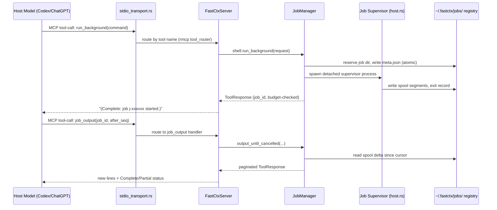
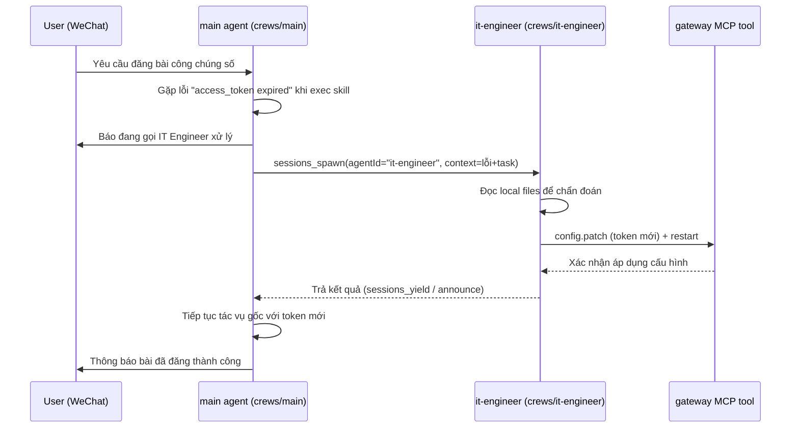
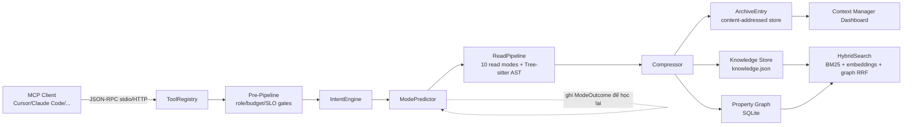

```mermaid
flowchart LR
  Start([START]) --> Snap["Snapshot Builder<br/>(crypto_nodes.py)"]
  Snap --> MS["Market Structure Analyst"]
  MS --> Der["Derivatives Analyst"]
  Der --> Sent["Sentiment Analyst"]
  Sent --> Cat["Catalyst Analyst"]
  Cat --> Reg["Regime Analyst"]
  Reg --> Bull["Bull Researcher"]
  Bull <--> Bear["Bear Researcher"]
  Bull --> RM["Research Manager"]
  Bear --> RM
  RM --> Trader["Trader"]
  Trader --> Agg["Risk Debate<br/>(Aggressive/Conservative/Neutral)"]
  Agg --> PM["Portfolio Manager"]
  PM --> Gate["Deterministic Risk Gate<br/>(risk/engine.py)"]
  Gate -->|approved + --paper| Paper["PaperExecutor → SQLite"]
  Gate --> End([END])
```

# Weekly Agentic AI Scan — 2026-07-21

## Executive Summary

- Tuần này nổi bật là **infra layer** cho agentic coding hơn là "agent framework" mới: `fastctx` (MCP tool runtime) và `lean-ctx` (context intelligence layer) đều là lớp bổ trợ chạy cạnh Claude Code/Codex/Cursor, không tự suy luận.
- Hai repo còn lại minh hoạ hai thái cực của "multi-agent": `circuit-framework` là kiến trúc LangGraph rõ ràng, code-first, deterministic risk gate thật; `xiaobei` là kiến trúc gần như 100% **markdown-as-config** đè lên một runtime ngoài (`openclaw`), gây khó khăn khi audit vì logic thật nằm ngoài repo.
- Red flag chung đáng chú ý: 3/4 repo có dấu hiệu **AI-generated hoặc AI-accelerated codebase** (single-author, số liệu tự mâu thuẫn giữa README/docs/code, hoặc kiến trúc thuần prompt) — cần đọc số liệu marketing (stars, "X% token savings", "N tools") một cách thận trọng.

## Mục lục

1. [Circuit Framework](#1-circuit-framework)
2. [FastCtx](#2-fastctx)
3. [Xiaobei](#3-xiaobei)
4. [LeanCTX](#4-leanctx)

---

## 1. Circuit Framework

**Repo:** [EthanXiang777/circuit-framework](https://github.com/EthanXiang777/circuit-framework)

### §1 — Quick Context

Multi-agent LLM phân tích crypto perpetuals rồi qua risk gate trước khi paper-trade (không giao dịch thật). Stack: Python ≥3.10, LangGraph ≥0.4.8 + LangChain-core, Pydantic, SQLite, Typer/Rich, hỗ trợ 10+ LLM provider. Repo health: 486 stars / 19 forks / Apache-2.0, tạo 2026-07-16, push gần nhất 2026-07-20, **chỉ một tác giả duy nhất** (85 commit). Có CI đầy đủ (pytest matrix Python 3.10-3.13, ruff strict, ~60 file test/~7300 dòng test).

### §2 — Architecture Deep-Dive

**A. Component inventory**
- `Snapshot Builder` (`tradingagents/graph/crypto_nodes.py`) — node gọi Hyperliquid API một lần, tạo `CryptoMarketSnapshot` bất biến dùng chung.
- 5 Analyst tuần tự: `Market Structure` (`agents/analysts/market_analyst.py`), `Derivatives` (`derivatives_analyst.py`), `Sentiment` (`sentiment_analyst.py`), `Catalyst` (`catalyst_analyst.py`), `Regime` (`regime_analyst.py`).
- `Bull Researcher` / `Bear Researcher` (`agents/researchers/bull_researcher.py`, `bear_researcher.py`) — debate hai chiều.
- `Research Manager` (`agents/managers/research_manager.py`) — judge tổng hợp debate → `investment_plan`.
- `Trader` (`agents/trader/trader.py`) — sinh `CryptoTradeProposal` (LONG/SHORT/NO_TRADE) qua structured-output.
- `Aggressive/Conservative/Neutral Analyst` (`agents/risk_mgmt/*.py`) — risk debate 3 bên (LLM, không deterministic).
- `Portfolio Manager` (`agents/managers/portfolio_manager.py`) — judge risk debate.
- `Deterministic Risk Gate` (`graph/crypto_nodes.py` + `risk/engine.py`) — authority cuối, code Python thuần, **không dùng LLM**.
- `PaperExecutor` (`paper/execution.py`) — fill lệnh mô phỏng vào SQLite (`paper/database.py`).

**B. Control flow — state-machine-graph** (LangGraph `StateGraph`, `graph/setup.py`):
1. `START` → Snapshot Builder fetch Hyperliquid một lần, ghi `crypto_snapshot` vào state.
2. 5 analyst chạy tuần tự, mỗi analyst có vòng ReAct nội bộ (gọi tool → "Msg Clear" xoá scratch message).
3. Bull ↔ Bear debate tối đa `2×max_debate_rounds` lượt → Research Manager judge ra `investment_plan`.
4. Trader sinh `CryptoTradeProposal` có cấu trúc.
5. Risk debate 3 bên tối đa `3×max_risk_discuss_rounds` lượt → Portfolio Manager judge.
6. Deterministic Risk Gate chạy `evaluate_risk()` (thuần Python) → approve/reject/clamp → nếu paper-execution bật thì `PaperExecutor` ghi SQLite → `END`.

**C. State & data flow:** `AgentState(MessagesState)` là TypedDict LangGraph dùng chung toàn graph (messages + report string từng analyst + snapshot + trade_proposal + risk_decision). Snapshot còn lưu song song ở module-level store (`crypto/snapshot_store.py`) để tool đọc object Pydantic gốc — đây là cơ chế chính đảm bảo mọi analyst dùng chung một dữ liệu bất biến. Không quản lý context-window bằng summarization — dùng node "Msg Clear" xoá scratch message sau mỗi vòng tool-call. Persist: JSON state log mỗi run, report bundle markdown/JSON, optional LangGraph SqliteSaver checkpoint để resume sau crash.

**D. Tool/capability integration:** Tool là LangChain `@tool`, đăng ký theo từng analyst (`graph/trading_graph.py::_create_tool_nodes`), bind qua `llm.bind_tools()`. Tool crypto không tự fetch mạng — chỉ đọc từ snapshot store đã build sẵn, trả JSON compact (top-10 candle, top-5 order-book level) để tránh nhồi dữ liệu thô vào prompt. Validation ở tầng Pydantic (`crypto/schemas.py`) — vd. `CryptoTradeProposal` reject NaN/inf, bắt buộc stop hợp lệ theo hướng lệnh.

**E. Memory architecture:** `TradingMemoryLog` (`agents/utils/memory.py`) — append-only markdown log tại `~/.tradingagents/memory/trading_memory.md`, mỗi entry gắn tag ticker/rating, sau đó "resolve" bằng return thực tế và ghi reflection. Retrieval: text-match theo ticker (N entry cùng ticker + N entry "cross-ticker lessons"), không có vector store.

**F. Model orchestration:** Hai vai cố định — `quick_think_llm` (mọi analyst/trader/risk debator) và `deep_think_llm` (2 judge: Research Manager, Portfolio Manager). Factory chọn client theo provider. Chạy **tuần tự**, không song song thật giữa các analyst dù gọi là "multi-agent". Có retry cấu hình được, không có fallback model tự động.

**G. Observability & eval:** Logging chuẩn Python `logging`. Ghi full state mỗi run ra JSON + report bundle (run_metadata, snapshot, trade_proposal, risk_decision...) có `snapshot_id` để trace ngược. LangGraph SqliteSaver cho phép resume sau crash. Không có tracing kiểu LangSmith/OpenTelemetry, không eval harness riêng — chỉ pytest offline với fixture Hyperliquid.

**H. Extension points:** Thêm analyst mới qua factory pattern đăng ký vào `graph/setup.py`; thêm strategy qua YAML trong `strategies/` (7 strategy có sẵn, chỉ đổi trọng số/prompt/risk knob dùng chung snapshot/risk engine); thêm LLM provider trong `llm_clients/`.

### §3 — Architecture Diagram

### §4 — Verdict

Điểm hay: risk gate **thực sự deterministic** (code Python thuần, sizing công thức rõ ràng, giữ NO_TRADE thay vì ép model ra quyết định) — thiết kế đúng đắn hiếm gặp ở "AI trading agent" demo. 5 analyst dùng chung snapshot bất biến, tránh race-condition dữ liệu.

Red flags: chỉ một tác giả viết toàn bộ 85 commit trong ~1 tháng, không contributor/PR review nào — 486 stars cần đọc thận trọng. File `docs/CIRCUIT_FRAMEWORK_SPEC.md` chính là prompt agentic-coding gốc, cho thấy phần lớn fork có thể được sinh bởi một agent AI theo một spec duy nhất. Risk debate 3 bên vẫn là LLM tự do — chỉ gate cuối cùng mới cứng, nên tên "deterministic risk engine" dễ gây hiểu nhầm bao trùm cả pipeline.

Câu hỏi mở: paper-execution xử lý concurrent run cùng strategy+snapshot_id thế nào ngoài test? Model default trong config là placeholder — cần theo dõi provider thực tế khi dùng public.

---

## 2. FastCtx

**Repo:** [yc-duan/fastctx](https://github.com/yc-duan/fastctx)

### §1 — Quick Context

Runtime MCP cục bộ viết bằng Rust, biến thao tác đọc file/grep/glob/sửa file/chạy shell thành 9 tool có schema ổn định cho AI coding agent, thay việc agent tự lắp lệnh shell thủ công. Stack: Rust 2024 edition, `rmcp` (MCP protocol), `tokio`, `ratatui` (TUI), `bpe-openai` (tokenizer o200k_base), `pdfium-render`. Repo rất trẻ: 13 commit, release mới nhất v0.1.1 (2026-07-19), gần như chắc chắn một tác giả. 201 stars / 7 forks / dual Apache-2.0-MIT. CI đầy đủ trên 4 target OS: fmt, clippy `-D warnings`, test (có/không PDF), `cargo deny`/`cargo about`, kiểm MSRV — kỷ luật kỹ thuật cao dù project nhỏ.

### §2 — Architecture Deep-Dive

**A. Component inventory**
- `FastCtxServer` (`src/server.rs`) — MCP server chính, gộp 3 tool_router (file/shell/edit), giữ 3 `Semaphore` giới hạn concurrency, tự validate router so với manifest lúc khởi tạo.
- `ToolManifest` (`src/server_manifest.rs`) — mảng const 9 tool, nguồn sự thật duy nhất về tên/nhóm/annotation; sinh SHA-256 hash để phát hiện trôi schema.
- `ReplaceService` (`src/edit/mod.rs`, `src/edit/replace.rs`) — engine batch-replace hai lượt với khoá CAS theo file.
- `FastShell` (`src/shell/mod.rs`, `src/shell_server.rs`) — wrapper chạy bash foreground/background.
- `JobManager` (`src/shell/jobs/mod.rs`) — điều phối vòng đời job nền, đọc/ghi registry dưới `~/.fastctx/jobs/`.
- Job supervisor tách rời (`src/shell/jobs/host.rs`) — tiến trình con "detached" tự sở hữu cây tiến trình bash, sống độc lập với MCP server.
- `read_tool`/`grep_tool`/`glob_tool` (`src/read_tool/mod.rs`, `src/grep_tool.rs`, `src/glob_tool.rs`).
- Control plane (`src/control/mod.rs`, `apply.rs`, `settings.rs`) — đăng ký MCP server vào cấu hình Codex/ChatGPT.

**B. Control flow — event-driven RPC tool layer** (không phải agent loop — không có planner/executor nội bộ; FastCtx phục vụ vòng lặp agent của host):
1. Model host (Codex/ChatGPT) quyết định gọi tool, gửi request MCP qua `src/stdio_transport.rs`.
2. `rmcp` tool_router định tuyến theo tên tool tới handler trong `FastCtxServer`/`shell_server.rs`.
3. Handler xin permit từ semaphore rồi chạy blocking qua `run_blocking` (`server_support.rs`).
4. Với `run_background`: `JobManager` giữ chỗ thư mục job, spawn supervisor tách rời (`host.rs`) sở hữu cây tiến trình, tách vòng đời job khỏi MCP server.
5. Tool trả text đã kiểm soát ngân sách token (`src/budget.rs`, ngưỡng 8500 token mặc định) kèm trạng thái Complete/Partial.
6. Lời gọi tiếp theo (`job_output`, `read` offset...) phục hồi từ cursor/registry trên đĩa — kể cả sau khi server restart.

**C. State & data flow:** Message format `CallToolResult`/`ToolContent::Text|Image` (`src/model.rs`), schema sinh bằng `schemars`/`serde`. State là **file trên đĩa** dưới `~/.fastctx/jobs/<job-id>/` (`meta.json` publish nguyên tử qua hard-link, spool `segment-*.jsonl`) — state machine bền vững độc lập bộ nhớ tiến trình. Quản lý ngữ cảnh: budget token tường minh dùng tokenizer o200k_base (giống host), binary-search cắt trang.

**D. Tool/capability integration** (phần giàu bằng chứng nhất — đây chính là lớp tích hợp tool):
9 tool đăng ký qua macro `#[tool_router]`/`#[tool]` của `rmcp`. `ToolManifest::validate()` chạy lúc khởi tạo để đảm bảo router khớp 100% manifest. Concurrency kiểm soát bằng 3 semaphore (8 file-op, 16 shell-op, 8 replace-op) — admission control mềm, không phải OS sandbox. 5/9 tool shell chỉ publish khi bật `--enable-shell`. An toàn `replace`: hai lượt (đóng băng ứng viên + đếm match, rồi tái xác minh identity/revision ngay trước khi ghi), ghi nguyên tử, khoá theo file. Không có lời gọi LLM nào trong codebase — FastCtx thuần phục vụ tool.

**E–F.** Không có bằng chứng memory/model-orchestration — repo thuần infra, không gọi LLM.

**G. Observability & eval:** Không dependency `tracing`/`log`, lỗi trả về text thuần, README khẳng định rõ "không có telemetry". Cơ chế gần nhất với eval-hook là `ToolManifest::contracts()` sinh hash SHA-256/tool để phát hiện contract drift (dùng trong CLI `status`/`doctor`). Có test suite đáng kể: unit test + integration/contract test riêng (`tests/read_contract.rs`, `server_contract.rs`...), chạy CI trên 4 platform.

**H. Extension points:** Không có cơ chế đăng ký tool tùy chỉnh — 9 tool compile cứng (`TOOL_ENTRIES` là mảng const, không phải registry đọc config). "Mở rộng" chỉ là toggle runtime trong `~/.fastctx/config.toml`.

### §3 — Architecture Diagram

### §4 — Verdict

Điểm mới lạ: job nền sở hữu bởi supervisor process tách rời hoàn toàn khỏi MCP server, sống sót qua restart — hiếm gặp ở MCP tool server đơn giản. `ToolManifest` với SHA-256 contract hash tự kiểm tra lúc khởi tạo là pattern kỷ luật tốt. Budget token tường minh dùng đúng tokenizer host, binary-search cắt trang, là giải pháp khá tinh vi cho vấn đề output bị host cắt giữa chừng.

Red flags: không có extension point thực sự (9 tool cứng, không plugin API); không logging/tracing có cấu trúc; repo cực trẻ (13 commit, gần như một tác giả) dù CI rất chỉn chu; không có `examples/`.

Câu hỏi mở: cơ chế job-bootstrap/job-host trên Windows (`CREATE_BREAKAWAY_FROM_JOB`) có rò rỉ tiến trình khi supervisor crash giữa chừng không? Mức độ chấp nhận cộng đồng ngoài tác giả gốc chưa xác minh được.

---

## 3. Xiaobei

**Repo:** [TeamWiseFlow/xiaobei](https://github.com/TeamWiseFlow/xiaobei)

### §1 — Quick Context

Agent tự động hoá marketing đa nền tảng cho SME, là lớp cấu hình/prompt trên nền agent runtime ngoài tên "openclaw" (pin theo commit, không nằm trong repo này). Stack: Python 37.6%, Shell 24.9%, TypeScript 21%, JavaScript 13.7%; pnpm. Repo health: 8,337 stars / 1,414 forks / 2 open issues, tạo 2024-04-24, push gần nhất 2026-07-21 (đúng ngày release v5.6.0) — hoạt động rất tích cực. License "Other" (modified-MIT). CI chỉ chạy smoke-test triển khai, **không có test suite hành vi agent thật sự** (`tests/` chỉ 1 file shell kiểm tra Dockerfile).

### §2 — Architecture Deep-Dive

**Phát hiện nền tảng:** Repo `xiaobei` **không chứa code agent-loop/inference nào**. "Kiến trúc" thực chất là (a) file Markdown định nghĩa persona/workflow inject vào system prompt, (b) shell/python script cho "skills", (c) patch áp lên engine `openclaw` upstream. Engine chạy agent loop, function-calling... thuộc `openclaw/openclaw`, chưa được audit trong nghiên cứu này.

**A. Component inventory**
- `小贝 main agent` (`crews/main/AGENTS.md`, `SOUL.md`) — agent chính, hợp nhất self-media-operator + business-developer + investor-relations, entry point qua WeChat.
- `IT Engineer` (`crews/it-engineer/AGENTS.md`, `SOUL.md`) — sub-agent vận hành/khắc phục sự cố, chỉ được các crew khác `sessions_spawn` tới.
- `content-producer` (`crews/content-producer/AGENTS.md`) — dây chuyền sản xuất video/hình ảnh, đánh dấu pre-release.
- `sales-cs` (`crews/sales-cs/AGENTS.md`, `ALLOWED_COMMANDS`) — AI CSKH, external-facing, mặc định **tắt**.
- `crews/_template/` — khung trống để tạo crew mới.
- `skills/` (38 skill trong `crews/main/skills/`) — năng lực dạng `SKILL.md` + script.
- `patches/camoufox-cli/`, `patches/browser-camoufox-pivot/` — fork anti-detect Firefox vendor trực tiếp + 35 patch lên module browser upstream.
- `config-templates/openclaw.json` — cấu hình model, danh sách agent, quyền spawn.

**B. Control flow — Hierarchical orchestrator + event-driven agent-spawn-on-error** (không phải state-graph cứng; điều khiển hoàn toàn bằng markdown, dựa trên 3 primitive của openclaw: `sessions_spawn`, `sessions_yield`, `sessions_send/announce`):
1. Main agent (`crews/main`) chạy skill (vd. đăng bài công chúng số) và gặp lỗi kỹ thuật (`access_token expired`).
2. Theo "Technical Issue Dispatch Protocol" (inject bởi `scripts/lib/agent-skills.sh`), main agent báo user rồi `sessions_spawn` tới `it-engineer` (whitelist trong `agents.list[].subagents.allowAgents`).
3. `it-engineer` chỉ load bootstrap tối thiểu (loại MEMORY/HEARTBEAT/BOOTSTRAP), tự chẩn đoán qua file local, sửa qua "MCP tool" (`cron`, `gateway`) — không CLI trực tiếp.
4. Session tương tác: main agent chờ bằng `sessions_yield`. Session heartbeat/cron cô lập: cấm `yield` (sẽ abort run) → fire-and-forget, kết quả về qua `announce` bất đồng bộ — chi tiết kỹ thuật thật, không chỉ marketing.
5. Main agent nhận kết quả, tiếp tục tác vụ gốc.
6. User chỉ thấy kết quả cuối.

Pattern thứ hai, riêng biệt: **planner-executor-evaluator (GAN-style)** cho complex-task (`skills/complex-task/SKILL.md`) — main agent làm planner/PM, mỗi sub-task qua `sessions_spawn` với cặp executor+evaluator riêng, vòng lặp `needs_rework`→`accepted`, kết bằng một overall evaluator độc lập.

**C. State & data flow:** System prompt nạp lại từ 8 file bootstrap cố định (AGENTS/SOUL/TOOLS/IDENTITY/USER/HEARTBEAT/BOOTSTRAP/MEMORY). Sub-agent/cron session chỉ nạp tập tối thiểu (loại MEMORY vì bảo mật). Giới hạn: 2MB/file đọc đĩa, 20.000 ký tự/file inject, 150.000 ký tự tổng. Session reset idle 2880 phút, scope per-channel-peer. Không có message bus ngoài — giao tiếp qua tool call nội bộ openclaw.

**D. Tool/capability integration:** Skill = thư mục có `SKILL.md` + YAML frontmatter, lazy-loading (chỉ name+description+path vào system prompt, đọc toàn văn khi cần). Thực thi qua tool `exec` (shell/python), an toàn dựa vào tầng quyền theo crew-type: internal → `security: full`; external (vd. sales-cs) → mặc định `deny`, mở lỗ qua `ALLOWED_COMMANDS`. Control-plane (cron/config/session) buộc qua MCP tools thay vì CLI thô. Browser automation qua fork `camoufox-cli` (JSON-over-unix-socket) hoặc `chrome-mcp relay`/`remote-cdp`.

**E. Memory architecture:** `MEMORY.md`/crew — chỉ nạp trong session chính 1-1. Retrieval mặc định FTS full-text (`memorySearch.provider: "none"`). Tuỳ chọn nâng cấp: embedding OpenAI-compatible (SiliconFlow BGE-M3/Qwen3-VL-Embedding), job "dreaming" ban đêm qua plugin `memory-core` (mặc định **tắt** vì lo tốn token/noise).

**F. Model orchestration:** Provider Volcengine Ark. Primary `awk/glm-latest` (GLM-5.2); fallback `deepseek-v4-pro` → `deepseek-v4-flash`. Image model riêng `doubao-seed-2.0-lite`. `maxConcurrent=3`, `subagents.maxConcurrent=4`, `maxSpawnDepth=2` (chặn spawn đệ quy sâu), `announceTimeoutMs=1h`. **Không phân model theo vai trò** — cả 3 crew dùng chung 1 chain model.

**G. Observability & eval:** Hooks nội bộ `command-logger`, `session-memory` (bật). Session log tại `~/.openclaw/agents/*/sessions/`. Dashboard localhost được nhắc trong README nhưng code dashboard **không nằm trong repo này**. Không có eval harness CI cho hành vi agent — "evaluator subagent" trong complex-task skill là quality-gate runtime, không phải test tự động.

**H. Extension points:** `crews/_template/` để tạo crew type mới; `DECLARED_SKILLS`/`BUILTIN_SKILLS`/`DENIED_SKILLS` kiểm soát skill theo crew; `scripts/setup-crew.sh` đồng bộ idempotent và tự inject section chuẩn vào `AGENTS.md`.

### §3 — Architecture Diagram

### §4 — Verdict

Điểm mới lạ: toàn bộ "kiến trúc multi-agent" là markdown-as-config chạy trên runtime ngoài — không một dòng code agent-loop nào trong repo, hiếm gặp cho dự án 8.3k sao gắn mác "multi-agent architecture". Claim "self-directed collaboration" **được xác thực thật** bằng cơ chế cụ thể (chuyển từ `yield` sang fire-and-forget + `announce` khi ở session cron cô lập), không chỉ quảng cáo. Mô hình quyền exec theo crew-type (internal=full, external=deny+allowlist) là RBAC đơn giản nhưng thực dụng.

Red flags: phụ thuộc nặng vào 1 upstream ngoài chỉ pin commit, không audit được; hầu hết "kiến trúc" là prompt engineering chứ không phải code; test coverage cực mỏng; CI không test hành vi agent; README lồng ghép dày đặc upsell (VIP Club, mã mời affiliate).

Câu hỏi mở: độ tin cậy autonomy dựa trên GLM-5.2 ngoài 2 kịch bản tài liệu hoá; bảo mật engine `openclaw` (chưa audit); pattern "self-directed collaboration" có giữ vững ngoài lỗi auth/token đã viết sẵn hay không.

---

## 4. LeanCTX

**Repo:** [yvgude/lean-ctx](https://github.com/yvgude/lean-ctx)

### §1 — Quick Context

Lớp trung gian nén và quản lý context cho AI coding agent, chạy dưới dạng binary Rust cục bộ. Stack: Rust (workspace `rust/`, edition 2024, ~507k dòng), SDK TypeScript, client Python/Node/JetBrains, thư mục chứng minh hình thức Lean4. Repo health: 3,319 stars / 308 forks / 39 open issues, tạo 2026-03-23 (~4 tháng tuổi), push gần nhất hôm nay. Có CI thật (13 workflow gồm CodeQL, security-check) và 140 file test tích hợp.

### §2 — Architecture Deep-Dive

**A. Component inventory**
- `ModePredictor` (`rust/src/core/mode_predictor.rs`) — học mode đọc tối ưu theo `FileSignature` từ lịch sử `ModeOutcome`.
- `IntentEngine` (`rust/src/core/intent_engine.rs`) — phân loại truy vấn thành 9 `TaskType`, mỗi loại có `thinking_budget`/`output_format` riêng.
- `Compressor` (`rust/src/core/compressor.rs`) — engine nén entropy/attention/TF-IDF codebook.
- `HybridSearch` (`rust/src/core/hybrid_search.rs`) — BM25 + dense embeddings + graph proximity qua Reciprocal Rank Fusion.
- `Knowledge` store (`rust/src/core/knowledge/*.rs`) — fact có archetype (Pattern/Preference/Architecture/Gotcha...), decay kiểu Ebbinghaus.
- `Property Graph` (`rust/src/core/property_graph/mod.rs`) — code knowledge graph trên SQLite thật (`rusqlite`).
- `ContextPackage`/`.ctxpkg` (`rust/src/core/context_package/*.rs`) — đóng gói Knowledge+Graph+Session, ký SHA-256/ed25519.
- `ContextProofV1` (`rust/src/core/context_proof.rs`) — bằng chứng verification (budget/SLO/pipeline/ledger/evidence).
- `ArchiveEntry` (`rust/src/core/archive.rs`) — content-addressed store cho output tool.
- `ToolRegistry`/trait `McpTool` (`rust/src/server/tool_trait.rs`, `registry.rs`) — 82 lệnh `register()` đếm được trực tiếp trong code.
- Dashboard "Context Manager" (`rust/src/dashboard/routes/*.rs`) — UI trình duyệt thật.

**B. Control flow — "Dispatch → Governance → Context I/O → Post-Pipeline"** (tên chính thức trong `ARCHITECTURE.md`):
1. MCP client gửi tool call qua stdio JSON-RPC/HTTP → `ToolRegistry` định tuyến.
2. Pre-Pipeline: role guard, workflow gate, loop detection, budget/SLO gate, degradation policy.
3. `IntentEngine` phân loại task type; `ModePredictor` dự đoán read mode tối ưu theo lịch sử signature file.
4. `ReadPipeline` áp 1 trong 10 mode; với code, Tree-sitter AST trích signature theo 27 ngôn ngữ (xác nhận qua Cargo feature flags).
5. Output qua Post-Pipeline: Context IR ghi lineage, tính token, lưu content-addressed archive nếu bị cắt/nén (phục hồi qua `ctx_expand`), cập nhật ledger.
6. `ModePredictor` ghi `ModeOutcome` để học lần sau; dashboard cập nhật real-time.

**C. State & data flow:** Knowledge lưu `knowledge.json` (atomic write qua temp file + rename). Property graph mã hoá quan hệ code (imports/calls/exports/type_ref) trong SQLite thật. `.ctxpkg` là bundle JSON manifest versioned + chữ ký SHA-256/ed25519. Context window quản lý qua "Prefix-Cache Ordering" (static-first, dynamic-last) + budget/SLO gate — có evidence trong kiến trúc nhưng chưa đọc sâu toàn bộ implementation.

**D. Tool/capability integration:** Mỗi MCP tool implement trait `McpTool` (`name()`, `tool_def()` trả JSON schema, `handle()`) — tự chứa schema+handler để tránh lệch. Có test `tool_schema_strictness.rs`, `mcp_manifest_up_to_date.rs`, `docs_tool_counts_up_to_date.rs` — nhóm dev nhận thức rủi ro số liệu lệch nhưng vẫn lệch trên thực tế (xem §4).

**E. Memory architecture** (phần giàu nhất): phân tầng **Episodic** (`episodic_memory.rs`, ghi lại chuyện gì xảy ra mỗi session), **Procedural** (`procedural_memory.rs`, phát hiện chuỗi tool-call lặp lại → "Procedure" tái sử dụng), **Semantic/Knowledge** (fact có archetype, temporal validity, salience bonus theo loại). Suy giảm tin cậy theo công thức Ebbinghaus (có test `ebbinghaus_decay_is_deterministic`), "archetype-aware decay" bảo vệ evidence khách quan lâu hơn. `consolidation_engine.rs` gộp fact tương tự. Retrieval hybrid thật sự: BM25 + dense embeddings + graph proximity qua RRF.

**F. Model orchestration:** LeanCTX không tự gọi LLM cho suy luận chính (là lớp context, không phải agent framework). Có proxy tùy chọn chuyển tiếp request đến OpenAI/Anthropic/Gemini sau khi nén — là proxy nén request, không phải model orchestration. Có `llm_enhance.rs`/`llm_feedback.rs` gợi ý tích hợp LLM optional cho tác vụ nâng cao, chưa xác minh sâu.

**G. Observability & eval:** Dashboard có route thật (stats, roi, leaderboard, memory, agents, risk, system, settings, signals, learning, snapshots, tools, graph). `ContextProofV1` là engine verification 4 lớp (budget/role/profile/evidence) với struct thật xác nhận các trường. CI có CodeQL + security-check riêng.

**H. Extension points:** Cơ chế "addon" — manifest `lean-ctx-addon.toml` bọc MCP server ngoài, cài qua uv/pip/cargo/npm/brew/dotnet. `rust/data/addon_registry.json` tồn tại thật, nhưng `grammar_registry.json` (registry ngôn ngữ tree-sitter dạng addon) có mảng `grammars` **rỗng** — registry addon-ngôn ngữ động chưa có entry nào, dù 27 ngôn ngữ core đã compile cứng qua Cargo feature.

### §3 — Architecture Diagram

### §4 — Verdict

Điểm thú vị: kiến trúc memory phân tầng episodic/procedural/semantic với decay kiểu Ebbinghaus và "archetype-aware decay" là thiết kế nghiêm túc, hiếm gặp ở mức chi tiết này trong công cụ context-compression. "Reversible compression" (content-addressed, phục hồi qua `ctx_expand`) cũng có code thật hỗ trợ.

Red flags: **số MCP tools không nhất quán giữa 6 nguồn khác nhau** — Cargo.toml "71", docs "80", README "81", ARCHITECTURE.md "81", mô tả GitHub "76", đếm trực tiếp trong code ra **82** — dù có test CI đáng lẽ phải bắt lỗi này. Số ngôn ngữ tree-sitter cũng lệch (README "27" vs ARCHITECTURE.md "26"). Registry addon-ngôn ngữ động rỗng hoàn toàn — tính năng có vẻ là khung sườn chưa có dữ liệu thật. Quy mô đáng ngờ: repo 4 tháng tuổi nhưng ~507k dòng Rust và hơn 60 file "contract" doc với tên gọi rất doanh nghiệp (billing-plane-v3, org-sso-oidc...) — dấu hiệu điển hình codebase sinh hàng loạt bởi AI agent. Số liệu "60-90% token savings" không thể xác minh độc lập (chỉ tự đo bởi chính hệ thống).

Câu hỏi mở: ai là tác giả/tổ chức đứng sau (không xác minh được contributor)? Bao nhiêu phần trăm codebase khổng lồ này thực sự chạy được so với phần chỉ là khung "hợp đồng"/tài liệu chưa triển khai đầy đủ?

---

*Báo cáo được tạo tự động bởi weekly agentic AI research scout. Nguồn: GitHub search + WebFetch trực tiếp trên từng repo (README, cấu trúc thư mục, source code qua git clone). Số liệu sao/fork chính xác tại thời điểm crawl 2026-07-21.*
