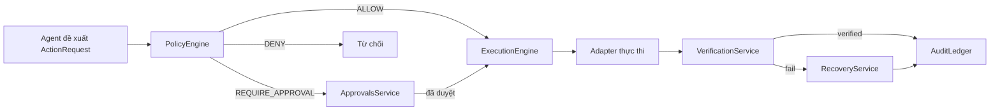
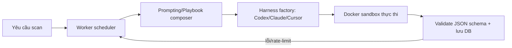
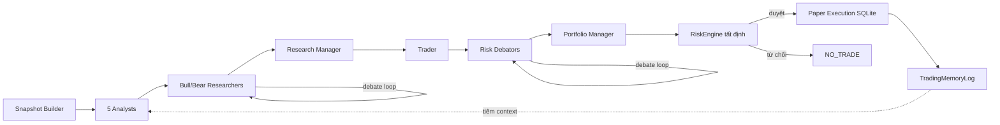
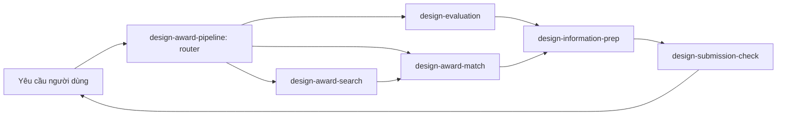

# Bản tin quét kiến trúc Agentic AI hàng tuần — 22/07/2026

**Tóm tắt điều hành:**

- Từ 15 repo agentic-AI mới nổi/mới cập nhật (>200 sao, tạo/push trong 7 ngày qua), sau khi loại các repo chỉ là UI widget thuần túy (`thinking-orbs`, `agent-notch`), wrapper data API (`livetennisapi-mcp`), prompt-dump bị rò rỉ, và tài liệu kiểu tutorial/anthology (`harness-engineering`, `agentsmith`), còn lại 8 repo đạt tiêu chí sàng lọc; 4 repo được chọn deep-dive vì có bằng chứng kiến trúc rõ nhất trong code thật (không chỉ docs).
- Điểm chung đáng chú ý: hai repo (`Agent-Execution-Partnership`, `circuit-framework`) đều đặt một lớp **kiểm soát tất định (deterministic gate) không dùng LLM** ở bước cuối để chặn hành động rủi ro — cho thấy xu hướng "LLM đề xuất, code quyết định" đang thành pattern phổ biến hơn là một kỹ thuật lẻ tẻ.
- `open-kritt` và `design-judge-skills` đại diện cho hai thái cực kiến trúc khác nhau: một bên là orchestrator code thật (Node.js/Python) điều phối song song nhiều agent-harness trong Docker sandbox, bên kia là toàn bộ orchestration sống trong file `SKILL.md` (ngôn ngữ tự nhiên) được một LLM host diễn giải — cả hai đều có test suite thật đi kèm.

**Mục lục**

1. [Agent Execution Partnership (AEP)](#agent-execution-partnership-aep)
2. [open·kritt](#openkritt)
3. [Circuit Framework](#circuit-framework)
4. [Design Judge Skills](#design-judge-skills)

---

## Agent Execution Partnership (AEP)

Repo: https://github.com/eli-labz/Agent-Execution-Partnership

### 1. Quick context

Control plane mã nguồn mở buộc mọi hành động của AI agent phải được cấp phép, quan sát được và xác minh được trước/trong/sau khi chạy. Stack: Python 3.12+, FastAPI/Uvicorn, SQLAlchemy+Alembic, Pydantic, Typer CLI, structlog; khai báo OpenTelemetry nhưng chưa thấy dùng thật. Repo health: 251 sao, 75 fork, tạo 2026-07-20, push gần nhất 2026-07-22, có CI (`ci.yml`, `dependency-review.yml`, `release.yml`) và bộ test lớn (unit/integration/e2e/property/security). Số contributor: không xác định từ code.

### 2. Architecture deep-dive

**A. Component inventory**
- `PolicyEngine` (`src/aep/policy/engine.py`) — kiểm tra tool-allowlist, risk class, risk budget, trả về `PolicyDecision` (ALLOW/DENY/REQUIRE_APPROVAL).
- `ActionStateMachine` (`src/aep/actions/state_machine.py`) — ép buộc 16 trạng thái hợp lệ (PROPOSED→…→VERIFIED/DENIED/CANCELLED/ESCALATED) và các transition được phép.
- `ExecutionEngine` (`src/aep/execution/engine.py`) — chạy một action qua các state AUTHORIZED→PRECONDITION_CHECK→READY→EXECUTING→VERIFYING, chọn adapter, tạo `ExecutionEvidence` (digest SHA-256).
- `Adapters` (`src/aep/adapters/{browser,filesystem,http,process,...}/`) — lớp thực thi theo "channel" cụ thể (Playwright, filesystem, HTTP…).
- `ApprovalsService` (`src/aep/approvals/service.py`) — cổng con người ký duyệt khi PolicyDecision = REQUIRE_APPROVAL.
- `VerificationService` (`src/aep/verification/service.py`) — so sánh hiệu ứng kỳ vọng/cấm với Observation thực tế, ra `VerificationResult`.
- `RecoveryService` (`src/aep/recovery/service.py`) — lập kế hoạch retry/compensation/escalation khi verify fail.
- `AuditLedger` (`src/aep/audit/ledger.py`) — log JSONL nối chuỗi hash SHA-256 bất biến.

**B. Control flow pattern**: **state-machine-graph tùy chỉnh (closed-loop governance state machine)** — không phải multi-agent LLM loop mà là một vòng kiểm soát tất định bọc quanh output của một agent bất kỳ. Happy path: (1) agent bên ngoài đề xuất `ActionRequest` gắn với `TaskContract`; (2) `PolicyEngine` ra quyết định; (3) nếu cần, `ApprovalsService` chờ người duyệt; (4) `ExecutionEngine` dispatch tới `Adapter` phù hợp và ghi `ExecutionEvidence`; (5) `VerificationService` xác nhận kết quả, fail thì chuyển `RecoveryService`; (6) mọi bước được ghi vào `AuditLedger`.

**C. State & data flow**: Message format là các Pydantic model trong `src/aep/contracts/models.py` (`TaskContract`, `ActionRequest`, `Observation`, `PolicyDecision`, `ExecutionEvidence`, `VerificationResult`). State lưu qua SQLAlchemy+Alembic. Chiến lược quản lý context-window: không xác định từ code (đây là governance layer, không quản lý context LLM).

**D. Tool/capability integration**: Adapter được chọn theo "channel" của action (code-level dispatch, không phải MCP/native function-calling). Có sandbox/guardrail test thật: `tests/security/test_filesystem_boundaries.py`, `tests/security/test_prompt_injection_block.py`.

**F. Model orchestration**: có adapter riêng cho FunctionGemma (`src/aep/models/functiongemma/adapter.py`) và GPT (`src/aep/models/gpt/{model,optimizer}.py`) dùng trong vòng lặp autoresearch demo; logic routing/fallback chi tiết: không xác định từ code.

**G. Observability & eval**: structlog JSON ra stdout (`src/aep/telemetry/logging.py`) — không thấy OpenTelemetry được wire dù có trong dependency. Eval hooks: `tests/end_to_end/test_closed_loop_minimal.py`, property-based test với hypothesis.

**H. Extension points**: thêm tool mới = viết Adapter mới; policy cấu hình qua `config/settings.py`; model mới thêm dưới `src/aep/models/`.

### 3. Mermaid diagram

### 4. Verdict

Điểm đáng học: đây không phải một "agent framework" mới mà là lớp governance/control-plane bọc quanh BẤT KỲ agent nào, với audit log nối chuỗi hash mật mã và test redaction dạng property-based — hạ tầng "seatbelt" hơn là agent thông minh. Red flag: khai OpenTelemetry là dependency nhưng file logging thực tế chỉ dùng structlog/stdout, không có tracing thật — cần kiểm tra thêm. Repo còn rất non (version 0.1.0, tạo 2 ngày trước khi quét). Câu hỏi mở: risk budget được cấp/hồi phục thế nào trong thực tế; policy engine có xử lý transaction nhiều bước hay chỉ action đơn lẻ.

---

## open·kritt

Repo: https://github.com/Kritt-ai/open-kritt

### 1. Quick context

Nền tảng điều phối nhiều AI agent chạy song song để tìm lỗ hổng bảo mật thật trong code, xác minh và xếp hạng kết quả. Stack: JavaScript/Node.js (backend/frontend) + Python (engine) + Docker; hỗ trợ Codex, Claude, Cursor làm "harness". Repo health: 263 sao, 52 fork, tạo 2026-07-20, push 2026-07-21, license AGPL-3.0, có CI (`ci.yml`, `release.yml`) và test ở cả backend/engine/frontend. Contributor: không xác định từ code.

### 2. Architecture deep-dive

**A. Component inventory**
- `Worker` (`engine/open_kritt_engine/worker.py`) — bộ lập lịch trung tâm, phân bổ công bằng (`fair_cap = max(1, ceil(worker_count/số scan))`) job scan qua các thread, claim scan từ DB, retry/backoff khi rate-limit, failover account.
- `Harnesses` (`engine/open_kritt_engine/harnesses.py`) — factory `harness_for()` bọc Codex CLI/Claude Code/Cursor thành interface thống nhất, chạy trong Docker network riêng từng job (`open-kritt-scan-*`, giới hạn 512 PID, 1GB tmpfs, drop quyền bằng `setpriv`).
- `Prompting/Playbook composer` (`engine/open_kritt_engine/prompting.py`) — `render_prompt()`, `patched_since_prompt()`, `repeat_append_prompt()`, `harness_prompt()` ghép prompt gốc + lịch sử patch git + agent skills + JSON schema đầu ra.
- `Generation module` (`engine/open_kritt_engine/generation.py`) — worker tạo draft riêng biệt.
- `Model catalog` (`engine/open_kritt_engine/model_catalog.py`, `provider_credentials.py`) — registry model theo provider, refresh nền định kỳ.
- `Backend API` (`backend/src/{app.js,routes/{scans,workflows,generations}.js}`) — quản lý workflow/scan qua REST.

**B. Control flow pattern**: **supervisor-worker phân cấp với fan-out song song** — `Worker` là supervisor lập lịch nhiều job scan độc lập, mỗi job chạy một agent-harness cô lập (không phải một vòng ReAct đơn). Happy path: (1) tạo scan qua backend API; (2) `Worker` claim scan theo fair-share; (3) chuẩn bị workspace cô lập, chọn `Harness` qua `harness_for()`; (4) `Prompting` ghép playbook, `Harness` chạy CLI agent trong Docker sandbox; (5) output được validate theo JSON schema, lưu DB, lỗi/rate-limit thì retry với backoff và failover account; (6) kết quả đưa qua backend/frontend để rank và loại trùng.

**C. State & data flow**: Trạng thái scan lưu trong DB (24 file migration SQL); message giữa orchestrator và harness là JSON theo schema định nghĩa trong prompting.py; quản lý "context" chủ yếu qua kỹ thuật chống trùng lặp: `repeat_append_prompt()` yêu cầu model chỉ trả về phát hiện mới chưa từng báo cáo ở lần chạy trước.

**D. Tool/capability integration**: mỗi harness là một subprocess CLI agent độc lập (code-exec, không phải MCP/native function-calling từ góc nhìn open-kritt) chạy trong Docker sandbox với resource limit và mount read-only.

**F. Model orchestration**: `model_catalog.py`/`provider_credentials.py` quản lý nhiều model/provider; failover sang account khác khi rate-limit; `harness_for()` map harness+provider (openrouter/claude/codex) tới client thực thi.

**G. Observability & eval**: Worker có heartbeat, cleanup, stale-job recovery nền; test ở backend/engine/frontend + CI. Framework tracing cụ thể (OTel/Langfuse): không xác định từ code.

**H. Extension points**: thêm harness mới qua factory `harness_for()`; thêm provider qua model_catalog; playbook mới qua template trong prompting.py.

### 3. Mermaid diagram

### 4. Verdict

Điểm đáng học: coi mỗi CLI coding-agent (Codex/Claude/Cursor) như một "harness" có thể hoán đổi, chạy song song có sandbox trên nhiều repo/dependency để săn lỗ hổng, kèm kỹ thuật prompt-chaining cụ thể để tự tránh báo trùng phát hiện giữa các lần chạy lặp lại — một pattern dedup-bằng-prompt hiếm khi được viết tường minh thế này. Red flag: mô hình bảo mật phụ thuộc hoàn toàn vào ranh giới Docker+setpriv trong khi README nói agent có "full system access" để build/chạy exploit — cần soi kỹ; license AGPL-3.0 có thể cản việc dùng ở doanh nghiệp. Câu hỏi mở: thuật toán rank/dedup finding cụ thể (script chưa đọc được).

---

## Circuit Framework

Repo: https://github.com/EthanXiang777/circuit-framework

### 1. Quick context

Framework multi-agent nghiên cứu và paper-trading crypto, xây trên TradingAgents (LangGraph), có risk engine tất định chặn lệnh cuối cùng. Stack: Python (99.9%), LangGraph, SQLite, Hyperliquid API công khai, hỗ trợ nhiều LLM provider (Anthropic/OpenAI/Google/Azure/Bedrock/OpenAI-compatible). Repo health: 487 sao, 19 fork, tạo 2026-07-16, có CI (`ci.yml`), test offline không cần API key (70+ file). Contributor: không xác định từ code.

### 2. Architecture deep-dive

**A. Component inventory**
- `TradingAgentsGraph` (`tradingagents/graph/trading_graph.py`) — orchestrator LangGraph, entry point `propagate()`.
- `ConditionalLogic` (`tradingagents/graph/conditional_logic.py`) — hàm routing `should_continue_debate`, `should_continue_risk_analysis` quyết định lặp debate hay escalate.
- 5 `Analysts` (`tradingagents/agents/analysts/{market,derivatives,sentiment,catalyst,regime}_analyst.py`) — agent chuyên biệt phân tích trên cùng một snapshot.
- `Bull/Bear Researchers` + `Research Manager` (`tradingagents/agents/researchers/`, `managers/research_manager.py`) — vòng debate và tổng hợp.
- `Risk debators` + `Portfolio Manager` (`tradingagents/agents/risk_mgmt/`, `managers/portfolio_manager.py`).
- `Trader` (`tradingagents/agents/trader/trader.py`) — tạo `CryptoTradeProposal`.
- `RiskEngine` (`tradingagents/risk/engine.py`) — cổng tất định, không LLM, 13 rule số học (RR≥1.5, spread<30bps, leverage≤3x, rủi ro/lệnh ≤1% vốn…).
- `TradingMemoryLog` (`tradingagents/agents/utils/memory.py`) — bộ nhớ markdown append-only.
- `LLM client factory` (`tradingagents/llm_clients/factory.py`) — `create_llm_client()`.

**B. Control flow pattern**: **state-machine-graph kiểu LangGraph** với sub-loop debate nhiều vòng và escalation phân cấp (analyst → debate → manager → trader → risk gate tất định). Happy path: (1) `Snapshot store` chốt một `CryptoMarketSnapshot` bất biến; (2) 5 analyst chạy trên cùng snapshot; (3) Bull/Bear debate lặp tới khi `count ≥ 2×max_debate_rounds` rồi chuyển Research Manager tổng hợp; (4) Trader tạo `CryptoTradeProposal`; (5) risk debator (aggressive/conservative/neutral) tranh luận tới ngưỡng rồi Portfolio Manager chốt, chuyển `RiskEngine` tái kiểm định độc lập bất kể LLM đồng thuận gì; (6) lệnh được duyệt thì paper-execute vào SQLite, Reflector ghi lại vào `TradingMemoryLog`.

**C. State & data flow**: state LangGraph truyền giữa node dạng message append, `ConditionalLogic` soi `tool_calls` trong message cuối để route sang tool-node — pattern tool-calling ReAct lồng trong graph lớn hơn. `Checkpointer` cho phép resume run.

**D. Tool/capability integration**: native function-calling của LLM, được `ConditionalLogic` kiểm tra qua state message để quyết định gọi tool-node hay không — đây là native function-calling chuẩn LangGraph.

**E. Memory architecture**: ngắn hạn = pending entries (lệnh đang mở); dài hạn = resolved entries kèm reflection, truy xuất qua `get_past_context()` ưu tiên tối đa 5 entry cùng ticker + 3 entry chéo ticker, có rotation giới hạn tăng trưởng không bị chặn — không dùng vector store mà dùng log markdown có cấu trúc.

**F. Model orchestration**: `create_llm_client()` hỗ trợ client native (Anthropic/Google/Azure/Bedrock) và fallback OpenAI-compatible (OpenAI/xAI/DeepSeek/Ollama…), lazy-import để tránh load SDK thừa. Việc gán model cụ thể cho từng vai trò: không xác định từ code (khả năng nằm ở `default_config.py`, chưa đọc).

**G. Observability & eval**: CI + 70+ test dùng fixture offline không cần LLM key; `scripts/smoke_structured_output.py`, `scripts/crypto_smoke.py` làm smoke-eval. Tracing framework cụ thể: không xác định từ code.

**H. Extension points**: strategy profile qua YAML (`strategies/{balanced,momentum,mean_reversion,...}.yaml`); provider mới qua registry OpenAI-compatible trong factory; nguồn dữ liệu mới dưới `dataflows/`.

### 3. Mermaid diagram

### 4. Verdict

Điểm đáng học: `RiskEngine` tất định, không LLM, đóng vai trò cổng cuối có thể ghi đè/giảm size hoặc bác bỏ mọi đồng thuận của LLM bằng 13 luật số học tường minh — pattern "LLM đề xuất, code quyết định" hiếm khi được viết rõ ràng đến vậy trong repo trading-agent mã nguồn mở. Bộ nhớ markdown xuyên phiên (không phải vector RAG) cũng là điểm hay: cố ý giới hạn token bằng cách chỉ đưa full detail cho cùng ticker, còn cross-ticker chỉ đưa reflection tóm tắt. Red flag: chỉ paper-trading nên rủi ro slippage/thực thi thật chưa được kiểm chứng; phụ thuộc hoàn toàn API Hyperliquid công khai không xác thực; xây trên framework TradingAgents của bên thứ ba nên ranh giới đóng góp gốc của circuit-framework cần làm rõ thêm. Câu hỏi mở: model nào được gán cho agent nào cụ thể.

---

## Design Judge Skills

Repo: https://github.com/SeanJ1ang/design-judge-skills

### 1. Quick context

Bộ Claude Agent Skills đánh giá/định vị/soạn hồ sơ dự thi giải thiết kế (iF, Red Dot, IDEA…) dựa trên bằng chứng, không phải một agent runtime độc lập. Stack: Python 98.5% (script + test), SKILL.md theo chuẩn Claude Agent SDK, chạy được trên Claude Code/Codex/OpenClaw/OpenCode/Hermes Agent qua `npx skills`. Repo health: 203 sao, 11 fork, license Apache-2.0, có `.github/workflows` (CI), 12 commit trên main. Contributor: không xác định từ code.

### 2. Architecture deep-dive

**A. Component inventory**
- `design-award-pipeline` (`skills/design-award-pipeline/SKILL.md`) — skill router, chọn tuyến đường tối thiểu đủ dùng, giữ "handoff record".
- `design-award-search` (`skills/design-award-search/scripts/{build_search_queries.py,verify_official_urls.py,verify_visual_evidence.py}`) — retrieval, tìm winner cùng hạng mục từ nguồn chính thức.
- `design-evaluation` (`skills/design-evaluation/scripts/score_evaluation.py`, `evaluation_profiles.py`) — evaluator: chấm điểm design/presentation (0–5), cộng dồn trọng số ra tổng 0–100, gắn confidence High/Medium/Low, có evidence cap.
- `design-award-match` (`skills/design-award-match/scripts/{award_profiles.py,score_award_matches.py}`) — matcher lọc giải phù hợp theo điều kiện.
- `design-information-prep` (`skills/design-information-prep/scripts/{prepare_entry_packet.py,validate_entry_output.py}`) — soạn và validate nội dung hồ sơ.
- `design-submission-check` (`skills/design-submission-check/scripts/check_submission_manifest.py`) — kiểm tra tuân thủ trước khi nộp.
- `design-judge-shared` (`skills/design-judge-shared/{category-taxonomy.md,source-registry.md}`) — taxonomy và registry nguồn chính thức dùng chung.

**B. Control flow pattern**: **supervisor-worker phân cấp dạng skill-router** — orchestration không nằm trong một process code mà nằm trong bảng routing bằng ngôn ngữ tự nhiên của `design-award-pipeline` SKILL.md, được LLM host diễn giải để gọi skill con phù hợp. Happy path: (1) người dùng nêu yêu cầu, pipeline khớp ý định vào bảng goal→skill; (2) nếu cần tiền lệ, gọi `design-award-search`; (3) `design-evaluation` chấm điểm theo rubric phân theo maturity; (4) `design-award-match` lọc/khớp giải dùng taxonomy/registry chung; (5) `design-information-prep` soạn field hồ sơ; (6) `design-submission-check` kiểm tra tuân thủ cuối, pipeline chỉ đánh dấu "ready" khi mọi rule chính thức đã xác minh, và dừng lại xin duyệt người dùng nếu có thay đổi hệ trọng (đổi giải mục tiêu, đổi maturity track).

**C. State & data flow**: "handoff record" là state được các skill chia sẻ, tách bạch fact người dùng cung cấp / phát hiện có bằng chứng / suy luận / việc còn thiếu (mô tả trong SKILL.md, chưa thấy schema hình thức hóa). Output của `score_evaluation.py` là bản ghi có cấu trúc theo dimension, kèm rationale và evidence list — de-facto message format giữa evaluation và các bước sau.

**D. Tool/capability integration**: mỗi skill là bộ script Python được runtime của host (Claude Agent SDK / `npx skills`) gọi như tool theo từng thư mục skill — kiểu code-exec tool call, không phải MCP cổ điển. Có test thật kiểm chứng script: `test_score_evaluation.py`, `test_check_submission_manifest.py`, v.v.

**F. Model orchestration**: thiết kế agnostic với host — chạy được trên nhiều LLM host khác nhau; việc gán model cụ thể theo vai trò: không xác định từ code (thuộc về host, không nằm trong repo).

**G. Observability & eval**: `docs/benchmark-coverage.md` — cơ sở đánh giá dựa trên 22.125 quan sát tổng hợp từ tác phẩm đạt giải iF/iF Student/Red Dot/IDEA, dùng làm ngữ cảnh mô tả chứ không dự đoán khả năng thắng giải; `tools/generate_benchmark_coverage.py`, `tools/validate_repository.py` là script validate/report cấp repo.

**H. Extension points**: thêm skill mới = thêm thư mục `skills/<tên>/{SKILL.md,scripts,tests}` được bảng routing của pipeline nhận diện; taxonomy/registry chung mở rộng độc lập trong `design-judge-shared`.

### 3. Mermaid diagram

### 4. Verdict

Điểm đáng học: một ví dụ hiếm về "kiến trúc agent dưới dạng thành phần skill/prompt" thay vì code — routing, phân tách fact/inference, và rubric evidence-confidence tường minh (từ chối gộp fit-score/design-score/evidence-confidence thành một con số duy nhất) đều sống trong SKILL.md + script chấm điểm, chạy được trên bất kỳ host tương thích Claude Agent Skills nào mà không cần runtime riêng. Kho benchmark 22.125 quan sát làm nền cho rubric là một eval methodology có tài liệu thật, khá hiếm cho một repo chỉ-là-skill. Red flag: vì logic điều phối nằm ở văn bản tự nhiên chứ không phải code, độ đúng của routing phụ thuộc hoàn toàn vào việc LLM host tuân theo hướng dẫn — không có ràng buộc code đảm bảo hành vi "chọn tuyến tối thiểu đủ dùng"; dự án còn nhỏ (12 commit). Câu hỏi mở: source-registry của `design-judge-shared` được cập nhật theo cơ chế nào theo thời gian.
