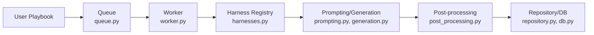
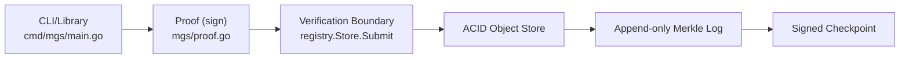
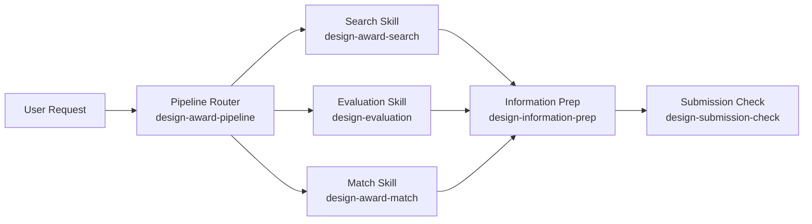

# Weekly Agentic AI Scan — 2026-07-24

**Nguồn dữ liệu:** GitHub Search API (`created:>2026-07-17 stars:>200`, fallback `pushed:>2026-07-17 stars:>500`), truy vấn qua HTTP fetch trực tiếp (không dùng `gh` CLI — session này không có quyền gọi GitHub API ngoài phạm vi repo `undertheseanlp/underthesea`).

## Executive Summary

- Tuần này không có "framework orchestration" tổng quát mới nổi bật; điểm đáng chú ý nhất là các repo giải quyết một *mảnh* cụ thể của bài toán agentic AI: sandbox hoá agent để làm security research (open-kritt), chuẩn hoá danh tính/provenance cho agent-artifact (machine-genome), và đóng gói eval methodology có dữ liệu thật vào Agent Skills (design-judge-skills).
- Cả 3 repo đều là **hierarchical/router hoặc pipeline pattern** — không repo nào dùng ReAct loop cổ điển hay memory/RAG architecture, phản ánh xu hướng "agent như job orchestration" nhiều hơn "agent như reasoning loop" ở các repo mới publish tuần này.
- Nhiều candidate ban đầu (thinking-orbs, agent-notch, các "skill" video-editing) bị loại vì là UI component hoặc single-skill wrapper, không có kiến trúc đáng phân tích — phản ánh chất lượng tín hiệu thấp của tuần này so với kỳ vọng ban đầu (chỉ 3/12 candidate ban đầu qua được relevance filter).

## Table of Contents

1. [Kritt-ai/open-kritt](#1-kritt-aiopen-kritt)
2. [paxlabs-inc/machine-genome](#2-paxlabs-incmachine-genome)
3. [SeanJ1ang/design-judge-skills](#3-seanj1angdesign-judge-skills)

---

## 1. Kritt-ai/open-kritt

**Repo:** https://github.com/Kritt-ai/open-kritt

### §1 — Quick Context

Điều phối nhiều AI agent chạy song song để tìm lỗ hổng bảo mật thật trong code, có de-dup và ranking. Tech stack: engine Python (`engine/`, `pyproject.toml`), backend Node/TypeScript với Prisma (`backend/`), frontend riêng (`frontend/`, `executor-view/`), đóng gói Docker (`Dockerfile`, `Dockerfile.claude-runner`). Hỗ trợ nhiều model backend: Claude, Codex, OpenAI, Anthropic, OpenRouter. Repo health: 362 stars, license AGPL-3.0, có `.github/` (CI chưa đọc nội dung chi tiết), có `docs/` và `docs-site/`, tác giả là nhóm bug-bounty "Blockian" ($1.5M+ earnings theo README).

### §2 — Architecture Deep-Dive

**A. Component inventory** (evidence từ `engine/open_kritt_engine/`):
- `Queue` (`queue.py`) — nhận job/playbook cần chạy.
- `Worker` (`worker.py`) — lấy job từ queue, thực thi agent trong container.
- `Harness Registry` (`harnesses.py`) — abstraction chọn CLI agent backend (Claude Code, Codex...).
- `Model Catalog` (`model_catalog.py`) — danh mục provider/model khả dụng.
- `Prompting/Generation` (`prompting.py`, `generation.py`) — dựng prompt nghiên cứu cụ thể gửi cho agent.
- `Post-processing` (`post_processing.py`) — de-dup và rank finding theo severity.
- `Repository/DB` (`repository.py`, `db.py`) — lưu kết quả; `backend/prisma` là ORM layer phía service (chỉ xác nhận tồn tại, chưa đọc schema cụ thể).
- `Workspace & Credentials` (`workspace.py`, `provider_credentials.py`, `claude_auth.py`, `codex_auth.py`) — dựng workspace container và quản lý auth theo từng provider.

**B. Control flow** — đây là **job-queue orchestration**, không phải ReAct loop:
1. User định nghĩa "research playbook" (chuỗi prompt nhỏ, tập trung vào một loại lỗ hổng).
2. Job được đẩy vào `Queue`.
3. `Worker` nhận job, dựng container disposable (`workspace.py`), chọn harness qua `harnesses.py`.
4. `Prompting`/`generation.py` build câu lệnh cụ thể; theo README, "tool-enabled agents run as root inside disposable job containers, with writable repository copies and direct internet access".
5. Kết quả đi qua `post_processing.py` để de-dup + rank + validate bằng proof-of-concept script.
6. Lưu vào DB/Repository, hiển thị qua backend API + `executor-view`.

**C. State & data flow:** message format cụ thể giữa Queue/Worker — không xác định từ code (chỉ thấy tên module `schema.py`, chưa đọc nội dung). State storage: `db.py` + `backend/prisma` → SQL DB qua Prisma, loại DB cụ thể không xác định từ code. Context-window management: không xác định từ code.

**D. Tool integration:** agent chạy như tiến trình root trong container riêng, có quyền ghi vào bản copy repo và truy cập internet trực tiếp — đây là pattern "code execution sandbox" hơn là function-calling cổ điển; tool thật sự (đọc file, chạy exploit) thuộc về CLI harness (Claude Code/Codex) mà open-kritt chỉ điều phối input/output. Validation: post-script + PoC theo README.

**E. Memory:** không xác định từ code — không thấy module memory/vector store riêng.

**F. Model orchestration:** `model_catalog.py` + `harnesses.py` cho phép chọn nhiều provider; phân vai planner/executor cụ thể không xác định từ code. README xác nhận có parallel execution ở tầng job.

**G. Observability:** `model_output_artifacts.py` + `artifact_cleanup.py` gợi ý có lưu artifact/trace mỗi lần chạy; không thấy tool tracing chuẩn (OpenTelemetry/Langfuse) trong danh sách file engine.

**H. Extension points:** thêm agent backend mới qua `harnesses.py`, thêm model/provider qua `model_catalog.py`.

### §3 — Architecture Diagram

### §4 — Verdict

Điểm đáng học: tách rõ "harness" (CLI agent backend) khỏi "playbook" (logic nghiệp vụ) và khỏi "workspace" (sandbox), cho phép swap Claude/Codex mà không đổi phần điều phối — đây là separation-of-concerns thực dụng hơn nhiều wrapper LangChain mỏng. Red flag: agent chạy as root trong container với internet access trực tiếp là rủi ro bảo mật cần review kỹ trước khi self-host; chưa thấy evidence rate-limit/cost control ở engine layer. Câu hỏi cần đào sâu: `schema.py` định nghĩa message format thật sự ra sao, và `backend/src` xử lý gì giữa API và engine.

---

## 2. paxlabs-inc/machine-genome

**Repo:** https://github.com/paxlabs-inc/machine-genome

### §1 — Quick Context

Protocol mã nguồn mở để định danh và ghi provenance bất biến cho model, agent, harness, dataset. Tech stack: Go (core lib `mgs/`, CLI `cmd/mgs/`), OpenAPI 3.1 (`api/`), JSON Schema (`schema/`), crypto Ed25519 + `did:key` + `eddsa-jcs-2022`. Repo health: 212 stars, 31 forks, license Apache-2.0 (code) + CC BY 4.0 (docs), có `testdata/` và nhiều file `_test.go` song hành mỗi module — tín hiệu test coverage tốt, `.github/` có CI workflow.

### §2 — Architecture Deep-Dive

**A. Component inventory:**
- `CLI/Library` (`cmd/mgs/main.go`) — entrypoint: `keygen`, `init-genesis`, `sign`, `verify`, `gene`.
- `Canonicalization` (`mgs/canonical.go`) — chuẩn hoá JSON theo JCS trước khi hash/sign.
- `Proof` (`mgs/proof.go`) — tạo/kiểm signature `eddsa-jcs-2022` gắn với controller DID.
- `DID Key Resolver` (`mgs/didkey.go`) — resolve `did:key` offline bằng Ed25519, không cần blockchain.
- `Record/Lineage` (`mgs/record.go`, `mgs/lineage.go`) — genesis record + typed parent edges (authorized / operator-observed / unresolved).
- `Amendment/Attestation` (`mgs/amendment.go`, `mgs/attestation.go`) — thêm lịch sử mà không sửa genesis gốc.
- `Registry / Verification Boundary` (`registry/`, hàm `registry.Store.Submit`) — cổng duy nhất chấp nhận record; README nói rõ đây đảm bảo "HTTP service cannot bypass record verification".

**B. Control flow** — **pipeline dạng state machine cho immutable identity**, không phải agent-reasoning loop:
1. CLI/library tạo genesis record chưa ký (`init-genesis`).
2. Ký bằng key controller qua `mgs/proof.go` (`sign`).
3. `verify` → đi qua verification boundary `registry.Store.Submit`: strict JSON + JCS canonical + DID + signature + lineage check.
4. Record hợp lệ ghi vào ACID object store, có index.
5. Ghi tiếp vào append-only Merkle log.
6. Log được đóng theo signed checkpoint định kỳ.

**C. State & data flow:** message format = JSON record đã canonicalize theo JCS (chuẩn W3C), không phải dict tự do. State storage: "ACID object store" theo README — engine cụ thể (SQLite/Postgres) không xác định từ code. Không có context-window/RAG vì đây không phải LLM-facing component.

**D. Tool/capability integration:** không áp dụng — đây là protocol ghi nhận identity, không gọi tool hay model nào.

**E. Memory:** skip — không có kiến trúc memory (đây là provenance ledger, không phải bộ nhớ agent).

**F. Model orchestration:** không áp dụng — repo không host hay gọi model nào, chỉ ghi nhận identity của model/agent/dataset bên ngoài.

**G. Observability & eval:** append-only Merkle log + signed checkpoint chính là cơ chế audit/replay ở mức protocol — mọi thay đổi đều trace được về genesis; nội dung CI cụ thể trong `.github/` không xác định từ code.

**H. Extension points:** `api/` chứa OpenAPI 3.1 spec cho HTTP API để tích hợp registry; `schema/` chứa JSON Schema cho phép định nghĩa thêm loại record.

### §3 — Architecture Diagram

### §4 — Verdict

Điểm đáng học: đây không phải "agent framework" mà là hạ tầng bổ trợ cho agentic AI — cung cấp cách chứng minh "agent/model/dataset này sinh ra từ đâu, ai ký, có bị sửa không" bằng cryptographic lineage graph thay vì blockchain, giải quyết vấn đề provenance đang bị bỏ ngỏ ở phần lớn agent framework hiện tại. Red flag: chưa có evidence về adoption thực tế (ai đang dùng registry này để ký agent thật), và "ACID object store" mơ hồ về engine cụ thể. Câu hỏi cần đào sâu: cơ chế `registry.Store.Submit` xử lý concurrent write thế nào, và mô hình threat model (`docs/`) có tính đến compromised controller key ra sao.

---

## 3. SeanJ1ang/design-judge-skills

**Repo:** https://github.com/SeanJ1ang/design-judge-skills

### §1 — Quick Context

Bộ Agent Skills đánh giá hồ sơ dự giải thiết kế (iF, Red Dot, IDEA) dựa trên evidence và dữ liệu thật, không tự bịa xác suất thắng giải. Tech stack: Python, đóng gói theo chuẩn Agent Skills (cài qua `npx skills`), chạy được trên nhiều agent harness (Codex, Claude Code, OpenClaw, OpenCode, Hermes Agent). Repo health: 305 stars, license Apache-2.0, có `.github/workflows/`, `evals/`, `docs/` — 14 commit, repo còn rất trẻ.

### §2 — Architecture Deep-Dive

**A. Component inventory** (evidence từ `skills/`):
- `Pipeline Router` (`skills/design-award-pipeline/SKILL.md`) — quyết định route, invoke skill chuyên biệt.
- `Search Skill` (`skills/design-award-search/`) — tìm case đoạt giải tương tự làm precedent.
- `Evaluation Skill` (`skills/design-evaluation/`) — chấm điểm dựa evidence, dùng dữ liệu 22.125 record.
- `Match Skill` (`skills/design-award-match/`) — chọn giải/category phù hợp.
- `Information Prep Skill` (`skills/design-information-prep/`) — soạn nội dung hồ sơ theo nguồn có kiểm chứng.
- `Submission Check Skill` (`skills/design-submission-check/`) — audit hồ sơ trước khi nộp theo rule chính thức.
- `Shared package` (`skills/design-judge-shared/`) — support package dùng chung (chỉ xác nhận tồn tại qua tên thư mục, chưa đọc nội dung).

**B. Control flow** — **hierarchical/router pattern (supervisor skill → specialist skills)**, không phải ReAct loop:
1. User đưa yêu cầu (ví dụ: đánh giá thiết kế X có nên nộp giải Y).
2. `design-award-pipeline` chọn route theo rule cố định trong SKILL.md: "evaluation or match → information prep → submission check; add search only when precedents are needed".
3. Nếu cần precedent, gọi `design-award-search` trước.
4. Gọi `design-evaluation` và/hoặc `design-award-match` tuỳ nhu cầu.
5. Gọi `design-information-prep` để soạn text hồ sơ với constraint nguồn.
6. Gọi `design-submission-check` để audit lần cuối trước khi nộp.

**C. State & data flow:** message format giữa các skill không xác định từ code — skill giao tiếp qua chính conversation/tool-call của agent host, repo không định nghĩa schema riêng. Nguồn dữ liệu eval: 22.125 observation record tổng hợp từ iF/Red Dot/IDEA; cơ chế retrieval (vector/keyword) không xác định từ code.

**D. Tool/capability integration:** đóng gói theo chuẩn Agent Skills, cài qua `npx skills`; tool integration hoàn toàn phụ thuộc cơ chế skill-loading của agent host (Codex/Claude Code/...) — repo không tự implement function-calling hay MCP server riêng.

**E. Memory:** skip — mỗi skill được mô tả là stateless, không có kiến trúc memory riêng trong repo.

**F. Model orchestration:** không xác định từ code — skill không chỉ định model cụ thể, phụ thuộc hoàn toàn vào agent host đang chạy nó.

**G. Observability & eval:** `evals/` + tập 22.125 record là **eval methodology phi trivial** — dùng làm "descriptive background" chứ không suy ra xác suất thắng giải; README nói rõ ràng buộc: "chỉ cung cấp mô tả bối cảnh, không thay đổi core scoring, không dùng để ước lượng xác suất thắng giải" — một guardrail chống lạm dụng metric hiếm gặp ở skill bundle thông thường.

**H. Extension points:** thêm skill mới vào `skills/`; sửa route logic trong `SKILL.md` của `design-award-pipeline`.

### §3 — Architecture Diagram

### §4 — Verdict

Điểm đáng học: guardrail tách biệt rõ 3 loại số (fit score / design score / evidence confidence) và cấm suy ra xác suất thắng giải — một ví dụ hiếm về skill bundle tự đặt giới hạn epistemics cho chính LLM dùng nó, thay vì để model tự tin bịa số. Red flag: đây thực chất là "prompt/skill framework" chứ không có engine riêng — giá trị nằm ở nội dung rubric + dữ liệu 22.125 record hơn là ở kiến trúc phần mềm; nếu bỏ dữ liệu này đi thì repo sẽ rơi vào nhóm bị loại theo relevance filter. Câu hỏi cần đào sâu: 22.125 record được thu thập/verify bằng cách nào (crawl tự động hay curate tay), và `design-judge-shared` chứa gì cụ thể.
