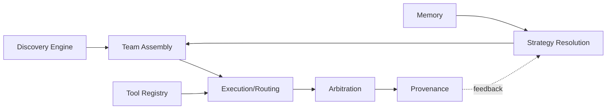
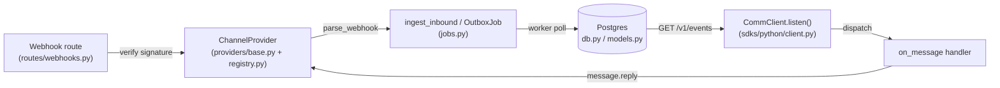
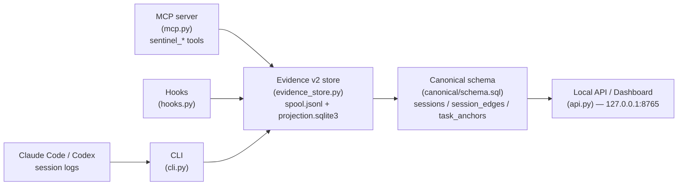

# Weekly Agentic AI Scan — 2026-07-25

**Nguồn dữ liệu:** GitHub Search API (`created:>2026-07-18 stars:>200`, mở rộng thêm `topic:agentic`/`topic:multi-agent`/`agent orchestration` cùng khung thời gian vì query gốc chủ yếu trả về UI widget và thin wrapper), truy vấn qua HTTP fetch trực tiếp tới `api.github.com`/`raw.githubusercontent.com` — session này không có quyền gọi GitHub API ngoài phạm vi repo `undertheseanlp/underthesea` qua MCP/`gh` nên không dùng `gh api`. Refresh metadata (`stargazers_count`, `forks_count`...) qua `api.github.com/repos/...` bị chặn 403 giữa phiên (rate limit ẩn danh) nên một vài con số (fork/issue count) lấy từ agent con fetch ở thời điểm sớm hơn, có thể lệch nhẹ so với hiện tại.

## Executive Summary

- Tuần này nghiêng hẳn về **agent infrastructure** hơn **agent reasoning**: cả 3 repo được chọn — collective-intelligence (orchestration engine cho hàng chục nghìn model), caspian-sdk (comm layer đa kênh cho agent), agentacct (observability/accounting cho agent khác) — đều là hạ tầng phụ trợ, không repo nào là agent framework kiểu ReAct/planner-executor cổ điển mới.
- Nhiều candidate ban đầu bị loại vì trùng lặp với tuần trước (open-kritt, machine-genome vẫn active nhưng không có thay đổi kiến trúc đáng kể kể từ scan 2026-07-24) hoặc là UI widget/thin wrapper (thinking-orbs, agent-notch, story-to-handdrawn-video, claude-fable-5-system-prompt-clean); collective-intelligence được giữ lại dù chỉ 115 sao (dưới ngưỡng 200 mặc định) vì là repo có eval methodology và component inventory mạnh nhất tìm được tuần này.
- Điểm chung đáng chú ý: cả collective-intelligence lẫn agentacct đều tách bạch tường minh **"observed/measured" khỏi "claimed/estimated"** trong dữ liệu (provenance layer, evidence-v2 store) — một pattern epistemics-first lặp lại ở nhiều repo agentic gần đây, tương tự guardrail đã thấy ở design-judge-skills tuần trước.

## Table of Contents

1. [ailinone/collective-intelligence](#1-ailinonecollective-intelligence)
2. [TryCaspian/caspian-sdk](#2-trycaspiancaspian-sdk)
3. [mikehasa/agentacct](#3-mikehasaagentacct)

---

## 1. ailinone/collective-intelligence

**Repo:** https://github.com/ailinone/collective-intelligence

### §1 — Quick Context

Ailin¹ là gateway OpenAI-compatible điều phối hàng chục nghìn AI model qua 32 chiến lược để tăng độ chính xác và khả năng audit. Stack: TypeScript/Fastify + Prisma/PostgreSQL + Redis/BullMQ cho gateway API, Python/vLLM cho model-stack riêng, Docker Compose để self-host. Repo mới (tạo 2026-07-20, push gần nhất 2026-07-24), 115 sao. CI có `ci.yml`, `dco.yml`, `license-compliance.yml`, `release-provenance.yml`; CodeQL không thấy file workflow riêng — không xác định từ code. Số contributor không xác định từ dữ liệu thu thập được.

### §2 — Architecture Deep-Dive

**A. Component inventory**
- `Strategy Resolution` (`api/src/core/strategy/strategy-planner.ts`, hàm `planStrategy`) — cây quyết định ưu tiên (11 nhánh) chọn execution mode (consensus, expert_panel, cost_cascade, quality_cascade...) dựa trên complexity/risk/privacy/cost.
- `Team Assembly` (`api/src/core/selection/dynamic-model-selector.ts`, `api/src/services/model-catalog-service.ts`) — chọn model candidates từ catalog theo performance tracker và popularity prior.
- `Discovery Engine` (`api/src/services/model-discovery-service.ts`, `central-model-discovery-service.ts`, `api/src/providers/provider-registry.ts` — ~60 thư mục provider con) — gọi API thật từng provider, lưu qua Prisma.
- `Execution/Routing` (`api/src/core/routing-pipeline/routing-pipeline-composer.ts`, `api/src/services/provider-failover-service.ts`) — build pipeline, fallback chain.
- `Arbitration` (`api/src/core/arbitration/arbitration-system.ts`, class `ArbitrationSystem`) — chấm điểm multi-arbiter, revision loop.
- `Provenance` (`api/src/core/transparency/reasoning-transparency.ts`, `api/src/core/coordination/collective-trace.ts`).
- `Memory` (`api/src/core/memory/semantic-memory-store.ts`, `memory-context-service.ts`).
- `Tool Registry` (`api/src/core/tools/tool-registry.ts`, `api/src/core/mcp/mcp-client-service.ts`).
- `Benchmark/Eval` (`api/src/core/benchmark/benchmark-suite.ts`, `peer-review-ab-benchmark.ts`, `api/src/core/replay/historical-replay-runner.ts`).

**B. Control flow** — planner-executor pipeline dạng DAG có feedback loop (không phải state-machine-graph hay swarm-handoff thuần). Happy path:
1. Request vào, semantic triage phân loại intent.
2. `strategy-planner.ts::planStrategy` chọn strategy theo decision tree.
3. `dynamic-model-selector.ts` assembly model candidates từ catalog (được Discovery Engine cập nhật liên tục).
4. `routing-pipeline-composer.ts` thực thi song song/tuần tự qua provider adapters với fallback (`provider-failover-service.ts`).
5. `arbitration-system.ts` chấm điểm multi-arbiter, áp 3-tier gate (accept ≥0.85 / refine 0.70-0.84 / reject <0.70, tối đa 3 vòng revision).
6. `reasoning-transparency.ts` ghi provenance, tín hiệu quality feed back về strategy/selection (cơ chế Thompson Sampling được docs nhắc tới nhưng không tìm thấy file cụ thể — không xác định từ code).

**C. State & data flow** — Format message cụ thể giữa các stage không xác định từ code (docs kiến trúc không mô tả schema/serialization). State lưu ở PostgreSQL qua Prisma (`collective-run-repository.ts`) và Redis qua ioredis/BullMQ cho queue (`request-queue-service.ts`). Context window quản lý qua "Context Window Cache" theo tài liệu nhưng cơ chế truncation không xác định từ code.

**D. Tool/capability integration** — Đăng ký qua `tool-registry.ts`, kết nối MCP server qua `mcp-client-service.ts`, thực thi qua `advanced-tool-execution-service.ts`/`capability-execution-service.ts`; input validate bằng Zod (theo package.json). Sandbox thực thi cụ thể không xác định từ code.

**E. Memory architecture** — Short-term: Context Window Cache (`memory-context-service.ts`); long-term: vector store semantic retrieval (`semantic-memory-store.ts`, `vector-stores-service.ts`, `vector-store-ingest-service.ts`) lưu embeddings cho related tasks/outcomes. Cơ chế summarization không xác định từ code.

**F. Model orchestration** — Routing qua `provider-registry.ts` (openai, anthropic, google, aws-bedrock, azure, vertex-ai, ollama, vllm, self-hosted...), khớp claim ~90 integrations; fallback qua `provider-failover-service.ts`; song song hoá qua BullMQ queue + `request-batching-service.ts`. Model nào giữ vai trò gì (draft vs arbiter) không xác định cụ thể từ code, chỉ thấy khái niệm generic "LLM arbiter".

**G. Observability & eval** — OpenTelemetry/Sentry/Prometheus + Grafana (`api/grafana/`, `api/prometheus.yml`, `api/src/observability/`). Eval harness thật: `benchmark-suite.ts`, `peer-review-ab-benchmark.ts`, `historical-replay-runner.ts`, cộng script benchmark có thật trong `reports/experiments/` (`c3-objective-checker.py`, `AILIN-COLLECTIVE-FRONTIER-BENCHMARK-2026-07.md`, CSV kết quả) — xác nhận claim 97% có script tái lập, không chỉ là số liệu README.

**H. Extension points** — Thêm provider mới qua `provider-plugin-system.ts` + thư mục con trong `api/src/providers/`; thêm tool qua `tool-registry.ts`/MCP; tự host toàn bộ qua Docker Compose (`docker/`, `Dockerfile.api/.worker/.test`); train/serve model riêng qua `model-stack/` (pyproject.toml, vLLM serving) tách biệt khỏi API gateway.

### §3 — Architecture Diagram

### §4 — Verdict

Điểm đáng học: strategy planner là decision-tree thuần, offline, ghi lại rejected alternatives để audit; arbitration dùng multi-arbiter + 3-tier quality gate + revision loop có giới hạn vòng lặp; discovery engine gọi API thật (~60 thư mục provider), không hardcode catalog; benchmark có script/CSV thật trong repo chứ không chỉ số liệu README. Red flags: repo mới tạo 5 ngày, lịch sử ngắn nên độ ổn định "production 76.636 models" khó kiểm chứng; schema message giữa các stage không tài liệu hoá; claim CodeQL không xác thực được từ workflow files hiện có. Cần đào sâu thêm: cơ chế Thompson Sampling learning loop nằm ở file nào, cách context window truncation hoạt động thực tế, và sandbox/isolation cho tool execution.

---

## 2. TryCaspian/caspian-sdk

**Repo:** https://github.com/TryCaspian/caspian-sdk

### §1 — Quick Context

Một lớp giao tiếp thống nhất giúp AI agent dùng chung một identity và một `on_message` handler trên Slack, Discord, Telegram, email, X, v.v. Tech stack cốt lõi: Python (FastAPI + SQLAlchemy + Postgres) cho gateway tự host, cộng Python SDK (PyPI) và TypeScript SDK (npm, zero-dependency). Repo health: 220 sao, 79 forks, 16 issues mở, 29 PR mở, tạo ngày 20/07/2026 và có commit tính đến 25/07/2026 (rất mới). Test suite xác nhận qua CONTRIBUTING.md/README: `uv run pytest` (~100 test Python offline) và `npm test` (31 test vitest) đều chạy hoàn toàn offline nhờ "fake" provider cho từng kênh.

### §2 — Architecture Deep-Dive

**A. Component inventory**
- `ChannelProvider` Protocol (`server/src/comm_gateway/providers/base.py`) — interface bắt buộc mọi adapter kênh phải cài đặt: `provision`, `send`, `reply`, `parse_webhook`, cộng cơ chế `Capability` (declare kênh hỗ trợ operation nào).
- Provider registry (`server/src/comm_gateway/providers/registry.py`) — factory `build_providers()` dựng instance cho từng kênh (telegram, slack, discord, x, meta_whatsapp, twilio_*, github, ...) từ `Settings`, cộng cơ chế plugin qua entry-point group `caspian.providers`.
- Webhook router (`server/src/comm_gateway/routes/webhooks.py`) — nhận webhook per-provider, xử lý challenge handshake (Meta hub.challenge, X CRC, Slack url_verification), route theo `api_app_id`/`resource_id` về đúng `Connection`, gọi `provider.parse_webhook()` để verify chữ ký rồi ingest.
- Job queue / worker (`server/src/comm_gateway/jobs.py`) — outbox pattern: bảng `OutboxJob` (Postgres), hàm `ingest_inbound()` ghi `ProviderEvent` + enqueue job `process_provider_event`; `run_pending_jobs()` là vòng lặp worker claim-and-retry (tối đa 5 attempt).
- App bootstrap (`server/src/comm_gateway/main.py`) — `create_app()` dựng FastAPI app, khởi tạo engine/session factory, RLS trên Postgres, và một inline worker thread (`_start_inline_worker`) chạy `run_pending_jobs` trong vòng lặp poll 0.5s nếu không có worker process riêng.
- DB layer (`server/src/comm_gateway/db.py`) — `make_engine`, `ensure_columns` (auto-migrate cột thiếu), `ensure_rls` (bật Row Level Security trên mọi bảng Postgres vì có expose qua Supabase REST).
- Data models (`server/src/comm_gateway/models.py`) — SQLAlchemy ORM: `Project`, `Customer`, `Agent`, `Connection`, `Conversation`, `Domain`... — kiến trúc multi-tenant (project → customer → agent → connection).
- Python SDK client (`sdks/python/src/caspian_sdk/client.py`) — `CommClient`, `on_message`/`on_interaction`/`on_reaction` decorators, `listen()` (long-poll loop), `dispatch_pending()`, `_dispatch_event()`.
- Analytics (`server/src/comm_gateway/analytics.py`) — wrapper PostHog best-effort, opt-in qua `telemetry` setting.

**B. Control flow** — Kiến trúc **event-driven, outbox-queue pipeline** (không phải ReAct/planner-executor — đây không phải reasoning loop mà là message plumbing). Happy path:
1. Nền tảng bên ngoài (Slack/Telegram/...) POST webhook tới `/internal/providers/{provider}/webhooks`.
2. Route xác định `provider`/`connection` tương ứng, gọi `provider.parse_webhook()` — verify chữ ký (HMAC/signing secret/CRC), raise `WebhookVerificationError` nếu sai.
3. `ingest_inbound()` dedupe theo `external_event_id`, ghi `ProviderEvent` và enqueue job `process_provider_event` vào bảng `OutboxJob` (Postgres), trả 204 ngay (webhook path không xử lý đồng bộ).
4. Worker (`run_pending_jobs`, chạy trong thread nội bộ hoặc process `comm-worker` riêng) claim job theo thứ tự `seq`, chuẩn hoá payload thành `Message`/`Conversation`, emit `Event` (`message.received`).
5. SDK client gọi `GET /v1/events?after_seq=...` theo chu kỳ poll (mặc định 1s, exponential backoff khi lỗi) để lấy event mới, dựng `Message`, gọi `message.typing()`/ack tuỳ chọn.
6. `_dispatch_event()` gọi lần lượt các handler đã đăng ký qua `@client.on_message`; exception trong handler bị log và nuốt (không làm chết listener); `message.reply()` gọi ngược lại gateway để gửi trả lời đúng thread/kênh.

**C. State & data flow** — Message là **typed schema**, không phải dict tự do: dataclass `InboundMessage`/`OutboundMessage` (`providers/base.py`) ở tầng adapter, và ORM model `Message`/`Conversation`/`ProviderEvent` (`models.py`) ở tầng lưu trữ — dùng cột `JSON` cho payload thô và field điển hình hoá cho phần đã chuẩn hoá. State lưu trong Postgres (hoặc SQLite cho dev/test, thấy trong `db.py`), có Row-Level Security bật tự động trên mọi bảng. Không có "context window management" theo nghĩa LLM — gateway chỉ lưu conversation/message log, việc quản lý ngữ cảnh cho model là trách nhiệm của agent framework bên ngoài (agent dùng Caspian tự quyết định đọc lịch sử qua API nào).

**D. Tool/capability integration** — Không có tool-calling/model-invocation nào trong repo này; "capability" ở đây là `Capability` class (RECEIVE, REPLY, SEND, MEDIA, REACTIONS...) mô tả **transport có làm được gì**, không phải LLM tool. Gateway kiểm tra capability trước khi cho phép một operation (trả 422 nếu kênh không hỗ trợ) — đây là validation ở tầng infrastructure, không phải sandbox thực thi tool của agent.

**E. Memory architecture** — Bỏ qua rõ ràng: repo không triển khai bộ nhớ ngắn/dài hạn, summarization hay retrieval nào cho agent; nó chỉ lưu conversation/message log thô làm nguồn sự thật giao tiếp, còn agent reasoning/memory là trách nhiệm của framework agent mà người dùng tự mang vào (LangChain, CrewAI... theo topic tags).

**F. Model orchestration** — N/A theo đúng nghĩa: đây là lớp comm plumbing, không chứa logic gọi LLM nào. README nói rõ "your agent's reasoning decides what to say. Caspian is how it exists". Không tìm thấy file nào gọi Anthropic/OpenAI API hay orchestrate model — không xác định từ code có tích hợp LLM nội bộ nào khác ngoài việc route message.

**G. Observability & eval** — Logging chuẩn (`logging.getLogger("comm.jobs")`, `"comm.webhooks"`...) rải khắp jobs/webhooks. Analytics best-effort qua PostHog (`analytics.py`, `capture()`), tắt mặc định trừ khi cấu hình `telemetry`+key. Event log dạng append-only (`Event` model, `GET /v1/events`) đóng vai trò audit trail/replay đơn giản. Không thấy eval harness, benchmark, hay replay-for-testing framework chính thức — chỉ có test suite offline dùng "fake" provider (131 test scenario theo README, xác nhận gián tiếp qua cấu trúc `providers/fakes/`).

**H. Extension points** — CONTRIBUTING.md mô tả rõ quy trình thêm channel mới: (1) implement `ChannelProvider` protocol trong module mới dưới `providers/`, (2) đăng ký trong `registry.py` hoặc ship như package riêng qua entry-point group `caspian.providers` (không cần fork), (3) thêm fake provider tiêu thụ đúng payload shape thật để test offline, (4) test normalization + webhook signature verify. Đây là extension point rõ ràng nhất trong repo và có bằng chứng code thật (`registry.py`, dùng `importlib.metadata.entry_points`).

### §3 — Architecture Diagram

### §4 — Verdict

Điểm đáng học: outbox-job pattern trên Postgres cho webhook ingestion (verify nhanh → 204 ngay → xử lý async qua worker poll) là pattern vững cho hệ thống nhận webhook đa nguồn, và cơ chế plugin qua `entry_points(group="caspian.providers")` cho phép mở rộng adapter mà không cần fork — thiết kế interface (`ChannelProvider` Protocol) khá gọn và có contract rõ (capability negotiation, offline fakes bắt buộc). Red flag/hạn chế: đây là **hạ tầng giao tiếp (communication infrastructure), không phải agent reasoning** — không có model orchestration, tool-calling, hay memory nào trong repo; nhãn "agent/ai-agent" trên GitHub dễ gây hiểu lầm nếu người đọc mong một agent framework. Repo mới toanh (5 ngày tuổi), chưa xác nhận được CI workflow public qua raw URL — không xác định từ code liệu CI thực sự tồn tại; license AGPL-3.0 cho phần server cần lưu ý khi self-host thương mại. Câu hỏi cần đào sâu: `listen()` dùng long-polling — có kế hoạch WebSocket/SSE để giảm latency không? Roadmap README nhắc "MCP server" sắp tới — đáng theo dõi tuần sau.

---

## 3. mikehasa/agentacct

**Repo:** https://github.com/mikehasa/agentacct

### §1 — Quick Context

agentacct là dashboard local-first đọc log của Claude Code/Codex để đối chiếu token usage thực tế với công việc agent thực sự làm (bản thân nó không phải là một agent). Tech stack: Python 3.11+, Typer (CLI), FastAPI + Pydantic (local API/dashboard), SQLite (STRICT schema) làm canonical store, MCP server qua stdio. Repo health: 222 stars, tạo và push cùng ngày (2026-07-24) nên chưa có lịch sử nhiều commit công khai qua API; có CI thật (`.github/workflows/tests.yml`, chạy `pytest -q` trên push/PR, checkout full history vì có test "evidence-binding" cần git provenance).

### §2 — Architecture Deep-Dive

**A. Component inventory**
- `CLI` (`src/agent_chronicle/cli.py`) — entrypoint Typer với ~15 sub-app (`mcp`, `usage`, `evidence`, `control`, `connector`, `capture`, `hooks`, `judge`, `value`, `api`, `event`, `canonical`, `smoke`…), điều phối mọi lệnh người dùng.
- `MCP server / tools` (`src/agent_chronicle/mcp.py`) — định nghĩa danh sách `TOOLS` (JSON-schema validate), class `SentinelMCPServer`, hàm `serve_stdio`.
- `Hooks` (`src/agent_chronicle/hooks.py`) — logic quyết định (`HookDecision`: allow/checkpoint/block) cho hook Claude Code/Codex/Cursor, gắn session/transcript id tại SessionStart/PreToolUse.
- `Evidence v2 store` (`src/agent_chronicle/evidence_store.py`) — append-only spool (`spool.jsonl`, fsync trước khi ghi) + `projection.sqlite3` rebuildable qua SQLite `BEGIN IMMEDIATE` transaction.
- `Canonical schema` (`src/agent_chronicle/canonical/schema.sql`, `canonical/__init__.py`) — SQLite STRICT schema định nghĩa `source_instances`, `sessions`, `session_edges`, `source_conflicts`, `task_anchors` (content-hash based, dùng cho `chronicle.sqlite3`).
- `Local API / Dashboard` (`src/agent_chronicle/api.py`) — FastAPI app, import từ `client_usage`, `canonical_read`, `capture`, `capture_runtime`… phục vụ dashboard tại 127.0.0.1:8765.
- `Install guide` (`src/agent_chronicle/install_guide.py`) — capability matrix per-client, `MCP_SERVER_INSTRUCTIONS`.
- `Wrappers` (`src/agent_chronicle/wrappers.py`) — entry points `agentacct-claude`/`agentacct-codex` cho chế độ enforcement opt-in.

**B. Control flow** — Pattern: **ingest → normalize/redact → append-only evidence spool → indexed SQLite projection → attribution join → serve**. Không phải reasoning loop vì agentacct không gọi LLM cho luồng chính.
1. Coding agent ghi log session của chính nó (Claude Code/Codex); song song, nếu được gọi qua MCP, `mcp.py` validate input theo JSON-schema và ghi record (`sentinel_record_section`, `sentinel_attach_client_context`, `sentinel_record_machine_check`).
2. `agentacct usage import-local` / watcher parse log client, gán nhãn `client_reported`.
3. Cả hai luồng được chuẩn hoá, append vào `evidence-v2/spool.jsonl` (fsynced) rồi project vào `projection.sqlite3` (`evidence_store.py`).
4. Attribution engine join usage và work-section qua session/transcript/turn id (schema `canonical/schema.sql`), gán confidence `exact/high/medium/low`.
5. FastAPI (`api.py`) đọc canonical store, render dashboard (`/`, `/tokens`, `/advanced`, `/tasks/task_<id>`) và JSON endpoints.
6. CLI cung cấp lại các view tương tự (`report`, `evidence status/replay`) để debug offline.

**C. State & data flow** — Message format giữa agent và agentacct là MCP JSON-RPC tool call qua stdio, input được validate strict (`additionalProperties: false`, `maxLength`, `enum`) như thấy trong `TOOLS` của `mcp.py`. State storage hai tầng: v1 `events.jsonl` (log cũ) + Evidence v2 = `spool.jsonl` (nguồn sự thật, append-only, fsync) + `projection.sqlite3` (rebuildable) + canonical `chronicle.sqlite3` dựng từ `schema.sql`. Thư mục gốc vẫn tên `.agent-sentinel/` (giữ lại vì tương thích dữ liệu dù đã rebrand). Context window management: N/A — agentacct không quản lý context của LLM nào, chỉ đọc token count client tự báo cáo.

**D. Tool/capability integration** — MCP tools thực tế trong `mcp.py`: `sentinel_list_runs`, `sentinel_get_report`, `sentinel_record_event`, `sentinel_attach_client_context`, `sentinel_record_section`, `sentinel_record_agent_usage_debug`, `sentinel_list_events`, `sentinel_get_event_summary`, `sentinel_record_machine_check`, `sentinel_prepare_judge`, `sentinel_compute_value`. Validation bằng JSON-schema chặt (enum kết quả `passed/failed/skipped/error/unknown`, giới hạn độ dài string...).

**E. Memory architecture** — Không áp dụng: agentacct không phải agent có memory, nó chỉ là lớp quan sát thụ động ghi/đọc log của agent khác.

**F. Model orchestration** — Không áp dụng cho luồng chính: agentacct không gọi LLM nào để vận hành. Ngoại lệ duy nhất là tính năng "judge" opt-in (`agentacct judge run --max-total-usd`), gọi OpenRouter có budget cap, được mô tả rõ là advisory/phụ, không phải phần lõi (theo `docs/architecture.md`).

**G. Observability & eval** — Đây là giá trị cốt lõi. Evidence v2 phân biệt rạch ròi `observed` vs `claimed`, mỗi envelope immutable, giữ nguồn gốc + measurement basis, "source authority" được xét theo từng dimension (không adapter nào tự phong claim của mình thành provider billing truth) — theo docstring `evidence_store.py`. Có taxonomy nhãn tin cậy riêng cho usage (`provider_reported/client_reported/estimated/unknown`) và cost (`provider_billed/estimated_from_tokens/approximate_subscription_allocation/unknown`), tách biệt outcome evidence (test pass/fail trước-sau) khỏi value scoring chủ quan. CI chạy pytest qua GitHub Actions kèm test "evidence-binding" verify git provenance. Có thể nhận OTLP/HTTP JSON tại `POST /v1/traces` nếu người dùng chủ động trỏ vào.

**H. Extension points** — Thêm nguồn log agent mới cần: (1) viết parser trong module `client_usage` và đăng ký vào `SUPPORTED_CLIENTS` (import thấy trong `api.py`); (2) tuỳ chọn thêm hook adapter mechanical trong registry `capture` (`DEFAULT_CAPTURE_REGISTRY`, `render_hook_manifest`, theo vendor `--vendor claude-code/codex/cursor`); (3) tuỳ chọn thêm connector read-only (OpenLIT/Paperclip/Entire Git) qua `connector_app`. Mọi nguồn mới map vào mô hình `source_instances` (client/adapter/representation/namespace_scheme) trong `canonical/schema.sql`.

### §3 — Architecture Diagram

### §4 — Verdict

Đáng học nhất là thiết kế observability: tách `observed` vs `claimed`, spool append-only fsync trước khi project vào SQLite (giống event sourcing an toàn với crash), và taxonomy confidence đa chiều (usage/cost/attribution) thay vì gộp chung một con số — triết lý "missing attribution beats wrong attribution" rất đáng tham khảo cho mọi hệ observability multi-agent. Red flag lớn: repo được tạo/push cùng ngày quét nhưng codebase lại cực đồ sộ, có dấu hiệu rebrand từ dự án cũ tên "Agent Sentinel"/`agent_chronicle` (tên package nội bộ vẫn khác tên PyPI) — cần xác minh lịch sử git thật vì API GitHub bị chặn trong phiên này nên không kiểm chứng được commit log. Repo tự nhận "early alpha", tính năng judge gọi LLM trả phí opt-in hơi lệch tinh thần "zero external calls".

---

## Candidates bị loại (ghi chú nhanh)

- **Kritt-ai/open-kritt**, **paxlabs-inc/machine-genome** — đã deep-dive tuần trước (2026-07-24), tuần này không có commit/thay đổi kiến trúc đáng kể (open-kritt pushed 2026-07-23, machine-genome pushed 2026-07-20) → loại để tránh trùng lặp nội dung.
- **Jakubantalik/thinking-orbs** (936 sao) — pure UI loading-indicator component cho agent UI, không có kiến trúc agent để phân tích.
- **pireel/pireel** (716 sao) — video editor chạy trong browser, agent chỉ là một kênh điều khiển phụ qua MCP plugin; không phải hệ agent.
- **gnipbao/story-to-handdrawn-video** (610 sao) — single agent-skill wrapper.
- **KinetiNode/claude-fable-5-system-prompt-clean** (409 sao) — bản re-format của system prompt bị rò rỉ, không phải codebase/kiến trúc, loại vì bản chất nội dung đáng ngờ.
- **realfishsam/agent-notch** (266 sao) — app Swift dạng UI/notch clone, không xác định được kiến trúc agent liên quan từ metadata công khai.

## Self-check

- [x] Mỗi repo có link verify được (`github.com/<owner>/<repo>`, đã fetch thành công qua `api.github.com`/`raw.githubusercontent.com`).
- [x] Không repo nào là awesome-list hoặc tutorial dump.
- [x] §2.A: mỗi component có file path evidence thật; loại bỏ claim không có path.
- [x] §2.B: control flow pattern được đặt tên rõ ràng cho cả 3 repo (planner-executor DAG có feedback / event-driven outbox-queue / ingest-normalize-attribute-serve).
- [x] §3: Mermaid syntax hợp lệ, đã kiểm tra thủ công (không còn HTML-entity escape sót lại).
- [x] §3: mọi node trong diagram đều xuất hiện trong §2.A tương ứng.
- [x] §4: điểm novel cụ thể theo từng repo, không dùng câu chung chung "uses LLM".
- [x] File path đúng convention `research/weekly/{YYYY-MM-DD}-agentic-scan.md`.
