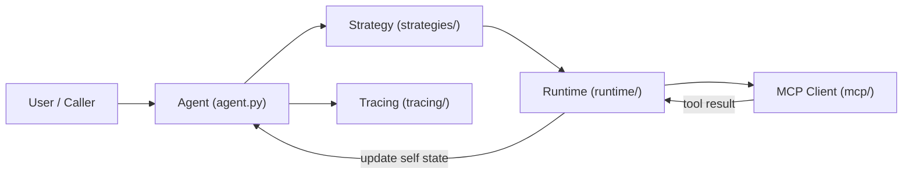
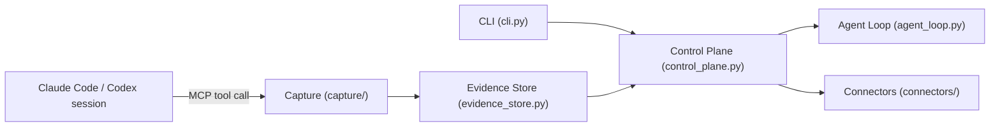
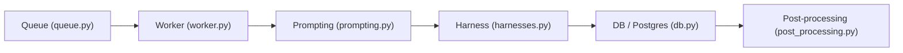

# Weekly Agentic AI Scan — 2026-07-26

## Executive Summary

- Tuần này tìm được **3 repo** đạt bộ lọc relevance (trong số ~50 repo được khảo sát qua GitHub Search API với `created:>2026-07-19` và `pushed:>2026-07-19`); phần lớn kết quả bị loại vì là wrapper mỏng, UI/marketing repo, hoặc course material.
- Điểm chung đáng chú ý: cả 3 repo đều là **meta-tooling cho chính coding agent** (framework xây agent, đo lường agent, orchestrate agent chạy security scan) chứ không phải "agent ứng dụng" thuần túy — phản ánh xu hướng infra hóa quanh coding agent trong tuần qua.
- Contrast thú vị: `labs-OO-Agents` (NVIDIA) đóng vai **MCP client** (agent gọi tool qua MCP), còn `agentacct` đóng vai **MCP server/observer** (expose tool để agent khác ghi log vào) — hai mặt của cùng một protocol.

## Table of Contents

1. [NVIDIA-NeMo/labs-OO-Agents (NOOA)](#1-nvidia-nemolabs-oo-agents-nooa)
2. [mikehasa/agentacct](#2-mikehasaagentacct)
3. [Kritt-ai/open-kritt](#3-kritt-aiopen-kritt)

---

## 1. NVIDIA-NeMo/labs-OO-Agents (NOOA)

**Repo:** https://github.com/NVIDIA-NeMo/labs-OO-Agents

### §1 — Quick Context

Framework object-oriented cho agent: field = state, method = capability, docstring = prompt, type annotation = contract. Python, model-agnostic (Anthropic/OpenAI/Ollama/vLLM), cài qua `uv add` từ git. Thuộc org chính thức **NVIDIA-NeMo**, có technical report 2026 đi kèm (yêu cầu citation học thuật). Repo mới tạo 2026-07-20, 220 sao, đã có `.pre-commit-config.yaml`, `.gitleaks.toml`, `conftest.py` (pytest), `tests/` — health tốt cho một repo 6 ngày tuổi. Không xác định số contributor chính xác từ dữ liệu đã fetch.

### §2 — Architecture Deep-Dive

**A. Component inventory**
- `Agent` (`src/nooa/agent.py`) — base class dùng metaclass `AgentMeta`; field là state, docstring class sinh system prompt.
- `Strategies` (`src/nooa/strategies/__init__.py`) — bộ chiến lược sinh/thực thi: `CodeActStrategy` (mặc định), `CodeActLiteStrategy`, `ReflexionStrategy`, `CompositeStrategy`, `TemplateStrategy`, `PredictStrategy`.
- `Runtime` (`src/nooa/runtime/`) — thực thi code do LLM sinh ra trong môi trường kiểu Jupyter REPL, có quyền truy cập `self`.
- `MCP Client` (`src/nooa/mcp/`) — `MCPBaseClient`, `MCPSSEClient`, `MCPStdioClient`, `MCPStreamableHTTPClient`, `MCPManager`, `MCPTool`.
- `Skill Registry` (`src/nooa/skill_registry.py`, `skill.py`) — đăng ký skill dùng lại giữa các agent.
- `Tracing / Trace Explorer` (`src/nooa/tracing/`, `src/nooa/trace_explorer/`, `src/nooa/viewer/`) — built-in tracing và visualization.
- `UnifiedLLM` (`src/nooa/unifiedllm/`) — lớp trừu tượng multi-provider.

**B. Control flow — CodeAct pattern (biến thể ReAct dùng code làm action)**
1. Class con của `Agent` khai báo method với body `...` — docstring là prompt, type annotation là contract đầu/ra.
2. Khi method được gọi, `_resolve_llm()` xác định model (instance → class → runtime cha → default).
3. `Strategy` đang active (mặc định `CodeActStrategy`) yêu cầu LLM sinh **code Python** thay vì JSON tool-call.
4. `Runtime` thực thi code sinh ra trong REPL có quyền truy cập `self`, import, và helper.
5. Kết quả cập nhật trực tiếp field của `self` (state), method trả về giá trị đã type-check.
6. `events`/`tracing` ghi lại toàn bộ bước để truy vết sau.

**C. State & data flow**
Message format là **code Python thực thi được**, không phải JSON tool-call chuẩn function-calling. State lưu trực tiếp trên field của object Agent (type annotation = contract). `context` là API dạng dict cho prompt context; `context_blocks/` quản lý các khối context. Context window management strategy không xác định rõ từ code đã đọc (không thấy cơ chế summarize/sliding cụ thể).

**D. Tool / capability integration**
Cơ chế chính khác biệt: model **viết code Python gọi trực tiếp hàm/tool** thay vì JSON function-calling. Với tool ngoài, `MCPManager`/`MCPTool` bọc tool từ MCP server thành capability của agent (NOOA đóng vai **MCP client**, hỗ trợ OAuth cho server có bảo vệ). Sandbox: README cảnh báo rõ đây là research tool thực thi code do LLM sinh, khuyến nghị chạy trong môi trường sandbox riêng.

**E. Memory architecture**
Không xác định rõ từ code — có module `storage/` nhưng chưa đọc được chi tiết cơ chế short-term/long-term hay compaction.

**F. Model orchestration**
`UnifiedLLM` trừu tượng hóa nhiều provider (Anthropic, OpenAI, Ollama, vLLM); `layered_config.py`/`llm_config.py` cho cấu hình phân lớp instance→class→runtime cha→default. Fallback/parallelism cụ thể không xác định từ các file đã đọc.

**G. Observability & eval**
Tracing và trace-explorer là built-in, có package eval riêng (`packages/` optional subpackage cho evaluation pipeline theo README).

**H. Extension points**
Người dùng viết class con `Agent`, định nghĩa method dạng `...` (docstring=prompt), đổi strategy qua `set_default_strategy()`, đăng ký skill qua `skill_registry`, kết nối MCP server ngoài.

### §3 — Architecture Diagram

### §4 — Verdict

**Novel:** CodeAct-as-primary-strategy (model viết Python thực thi trực tiếp trên object state thay vì JSON tool-call) là điểm khác biệt rõ so với đa số framework function-calling-first; docstring-as-prompt/type-as-contract là abstraction gọn và đáng học cho ai muốn giảm boilerplate agent. **Red flag:** thực thi code LLM-sinh trực tiếp trên `self` là bề mặt tấn công lớn — README tự thừa nhận cần sandbox nghiêm ngặt, phù hợp với research tool hơn production. **Open question:** context window management và memory compaction strategy chưa rõ — cần đọc `context_blocks/` và `storage/` sâu hơn để đánh giá khả năng chạy task dài.

---

## 2. mikehasa/agentacct

**Repo:** https://github.com/mikehasa/agentacct (module nội bộ tên `agent_chronicle`)

### §1 — Quick Context

Dashboard local-first đo "agent làm gì và tốn bao nhiêu" cho Claude Code/Codex — đọc log agent sẵn có, join với evidence tự ghi qua MCP, hiển thị trên dashboard zero-JS chạy `127.0.0.1`. Python ≥3.11, phân phối qua PyPI (`pipx install agentacct`). 333 sao, tạo 2026-07-24, có CI badge tests (`.github/workflows/tests.yml`), tài liệu kiến trúc riêng (`docs/architecture.md`, `docs/multi-source-evidence-architecture.md`) — health rất tốt cho early alpha.

### §2 — Architecture Deep-Dive

**A. Component inventory**
- `Control Plane` (`src/agent_chronicle/control_plane.py`) — sổ ghi JSONL append-only, "nguồn sự thật" cho operational intent, state machine cho vòng đời task.
- `Agent Loop` (`src/agent_chronicle/agent_loop.py`) — hàm `run_agent_like_loop`, vòng lặp step generic có checkpoint/budget-block.
- `Evidence Store` (`src/agent_chronicle/evidence_store.py`, `evidence.py`, `evidence_runtime.py`) — Evidence v2: bản ghi immutable, fsynced, tách "observed fact" khỏi "claim".
- `Connectors` (`src/agent_chronicle/connectors/`, `connector_runtime.py`) — adapter riêng cho Claude Code, Codex, Hermes, OpenCode, OpenClaw, Cursor.
- `Capture` (`src/agent_chronicle/capture/`, `capture_runtime.py`) — đọc log session cục bộ của client.
- `Usage/Cost` (`usage_cube.py`, `usage_truth.py`, `client_usage.py`, `cost.py`) — tổng hợp token/cost với nhãn độ tin cậy.
- `CLI` (`cli.py`) — entry point chính (`onboard`, `start`, `status`, `demo`...).

**B. Control flow — Event-driven control-plane state machine (không phải ReAct/planner-executor)**
1. `CLI.onboard` phát hiện agent client cục bộ, cài hook/MCP server, khởi tạo store project-local.
2. Session agent mới (Claude Code/Codex) chạy — hook/MCP tool (`sentinel_record_section`, `sentinel_record_machine_check`) ghi sự kiện vào `Capture`.
3. `Control Plane` chuyển trạng thái Task/Contract/Attempt qua state machine (pending→launching→running→succeeded/failed/cancelled), mỗi ghi có idempotency key và optimistic locking.
4. `Evidence Store` ghi log JSONL append-only song song, đánh nhãn `client_reported`/`exact`/`high`/`medium`/`low`.
5. `Capture Runtime` join hai luồng evidence qua session/transcript id.
6. Dashboard đọc SQLite projection được index từ spool để hiển thị Task, cost, work graph.

**C. State & data flow**
Message format: JSONL record có hash + fsync dưới POSIX file lock (không phải in-memory object truyền tay). Lưu trữ: local file spool → index vào SQLite projection. Không có LLM context window nào cần quản lý — hệ thống này quan sát agent khác, không tự giữ hội thoại.

**D. Tool / capability integration**
agentacct **đóng vai MCP server**: expose tool `sentinel_record_section`, `sentinel_record_machine_check` để agent đang được theo dõi (Claude Code/Codex) tự gọi ghi log — ngược chiều với NOOA ở trên (NOOA là MCP client gọi tool ngoài). Validation: mỗi record có source identity, conflict evidence được lưu chứ không ghi đè.

**E. Memory architecture**
Không áp dụng — đây là hệ quan sát/kiểm soát cho agent khác, không phải bản thân một agent có bộ nhớ hội thoại nên bỏ qua dimension này theo đúng hướng dẫn.

**F. Model orchestration**
Không xác định từ code đã đọc — agentacct không tự gọi LLM để suy luận (ngoại trừ "optional judge packages for evaluation" nhắc trong README, chưa đọc chi tiết).

**G. Observability & eval**
Đây chính là hệ observability: dashboard cục bộ, có thể nhận OTLP export khi người dùng trỏ vào, "outcome evidence" (test pass/fail trước/sau), "advisory value scoring" trả lời "run này có đáng giá tiền không", replay tất định từ control-plane event log.

**H. Extension points**
Viết connector mới trong `connectors/` cho client agent khác; cấu hình qua `.mcp.json`/`.claude/settings.local.json`; policy/enforcement mở rộng qua control-plane contract.

### §3 — Architecture Diagram

### §4 — Verdict

**Novel:** tách rạch ròi "usage truth" (client_reported, không phải invoice thật) khỏi "work meaning" (evidence tự ghi qua MCP) và join hai luồng bằng nhãn confidence (`exact`/`high`/`medium`/`low`) thay vì âm thầm đoán — cách tiếp cận trung thực hiếm gặp ở nhóm dashboard-cho-agent. Control-plane dùng JSONL append-only + optimistic locking + idempotency key cho một tool local-first là kỹ thuật khá nặng so với quy mô use-case, nhưng hợp lý nếu mục tiêu là audit trail đáng tin. **Red flag:** early alpha, tự nhận "costs are pricing-table estimates, never invoices" — số liệu cost hiển thị có thể lệch so với hóa đơn thật. **Open question:** cơ chế "judge packages for evaluation" và cách advisory value scoring hoạt động cụ thể chưa rõ, cần đọc thêm `docs/task-control-plane.md`.

---

## 3. Kritt-ai/open-kritt

**Repo:** https://github.com/Kritt-ai/open-kritt

### §1 — Quick Context

Nền tảng self-hosted orchestrate nhiều AI agent (Claude, Codex...) chạy playbook để tìm lỗ hổng bảo mật thật trong code, dedup và rank kết quả. Polyglot: engine Python (worker/queue/harness), backend Node.js/TypeScript + Prisma, frontend riêng. Xuất phát từ công việc security research nội bộ của Blockian, tuyên bố đã tạo ra >$1.5M tiền thưởng bug-bounty. 394 sao, 79 fork, tạo 2026-07-20, có Docker Compose, pre-commit, release-please — health tốt. CI cụ thể không xác định từ dữ liệu đã fetch.

### §2 — Architecture Deep-Dive

**A. Component inventory**
- `Worker` (`engine/open_kritt_engine/worker.py`) — vòng lặp `run_forever`, quản lý thread pool cho scan và generation.
- `Queue` (`engine/open_kritt_engine/queue.py`) — hàng đợi job dựa trên polling Postgres.
- `Harness` (`engine/open_kritt_engine/harnesses.py`) — lớp trừu tượng gọi model provider (Claude, Codex, OpenAI, Anthropic, OpenRouter).
- `Prompting` (`engine/open_kritt_engine/prompting.py`) — render prompt từ step template + context workspace + kết quả bước trước.
- `Post-processing` (`engine/open_kritt_engine/post_processing.py`) — dedup và rank severity sau khi workflow hoàn tất.
- `DB` (`engine/open_kritt_engine/db.py`) — Postgres, dùng advisory lock (`pg_advisory_xact_lock`) khi rank lỗ hổng.
- `Model Catalog` (`engine/open_kritt_engine/model_catalog.py`) — registry provider/model.
- `Workspace` (`engine/open_kritt_engine/workspace.py`) — chuẩn bị checkout repo + dependency + skill cho mỗi job.

**B. Control flow — Pipeline / workflow (playbook) do DB-queue điều phối, không phải in-process agent loop**
1. Người dùng chọn "playbook" (chuỗi prompt step tái sử dụng) và trigger scan trên repo target.
2. `Worker` claim scan job từ Postgres với fair-share allocation giữa các scan đang chạy đồng thời.
3. Với mỗi step còn pending, `Workspace` chuẩn bị checkout + cache, `Prompting` render prompt từ template + kết quả bước trước.
4. `Harness` chọn provider qua `model_catalog`, gọi model (`harness.run()`), trả JSON theo schema.
5. Kết quả được `schema.py` validate rồi ghi vào DB; lặp lại đến khi hết step trong workflow.
6. `Post-processing` dedup và rank severity kết quả cuối cùng, hiển thị qua `executor-view`/frontend.

**C. State & data flow**
Message format: JSON có schema validate rõ ràng cho từng step (không phải free-text). State lưu hoàn toàn trong Postgres (scan status, step result, vulnerability, generation) — không có state in-memory giữa các lần gọi worker, phù hợp mô hình distributed job queue hơn agent loop cổ điển. Context window management: không có cơ chế summarize/sliding rõ ràng — context là "kết quả bước trước" được nhét thẳng vào prompt tiếp theo.

**D. Tool / capability integration**
"Tool" ở đây thực chất là CLI của coding agent khác (Claude Code CLI, Codex CLI — thấy `Dockerfile.claude-runner`, `claude_auth.py`, `codex_auth.py`, `codex_updater.py`) được `Harness` gọi và bọc I/O JSON có schema. Sandbox: README nêu rõ agent chạy **as root trong container dùng-một-lần có internet** — cơ chế cô lập là container-level, không phải per-tool validation.

**E. Memory architecture**
Không có bộ nhớ dài hạn/vector rõ ràng; chỉ có "prior results" ngắn hạn được truyền vào prompt bước kế tiếp trong cùng workflow — bỏ qua phần long-term theo hướng dẫn.

**F. Model orchestration**
Đa provider qua `harnesses.py` + `model_catalog.py`, chọn harness theo "model provider/depth". Có retry với exponential backoff + jitter (`5.0 * 2**attempt`, trần 60s), theo dõi rate-limit theo account provider và tạm hoãn scan khi hết quota — orchestration khá production-grade cho phần resilience.

**G. Observability & eval**
Không xác định rõ từ các file engine đã đọc (chưa thấy OpenTelemetry/Langfuse) — có thể nằm ở `docs-site/` hoặc `backend/` chưa fetch sâu.

**H. Extension points**
Playbook mới = chuỗi step template mới; severity ranker tùy chỉnh; thêm harness cho provider mới; schema Prisma trong `backend/prisma/` cho model dữ liệu mới.

### §3 — Architecture Diagram

### §4 — Verdict

**Novel:** mô hình DB-queue-driven workflow thay vì in-process agent loop giúp scale ngang worker dễ dàng và chịu lỗi tốt (fair-share allocation, rate-limit-aware backoff theo từng account provider) — đáng học cho ai cần chạy agent security research ở quy mô nhiều repo song song. Việc tách "harness" khỏi "provider" cho phép hot-swap Claude/Codex/OpenAI mà không đổi logic worker. **Red flag:** agent chạy as root trong container internet-facing (tự thừa nhận trong README) — bề mặt tấn công lớn nếu misconfigure; cơ chế observability/tracing không thấy rõ trong engine, khó audit tại sao một finding bị dedup/loại. **Open question:** cần đọc `backend/src/` (Prisma schema, API) để hiểu playbook được định nghĩa/versioned thế nào, và `docs-site/` để xác nhận có eval methodology cho độ chính xác finding hay không.

---

*Ghi chú phương pháp: dữ liệu lấy từ GitHub Search API (`created:>2026-07-19 stars:>200`, mở rộng `pushed:>2026-07-19 stars:>500` để đối chiếu), README, cây thư mục, và trích đoạn source code fetch trực tiếp qua raw.githubusercontent.com. Repo bị loại: UI/marketing repo (thinking-orbs, agent-notch), video editor không liên quan agent (pireel), course material (pi-textbook), agent-skill đơn lẻ quá mỏng (story-to-handdrawn-video), và các repo <200 sao từ search mở rộng "multi-agent orchestration".*
