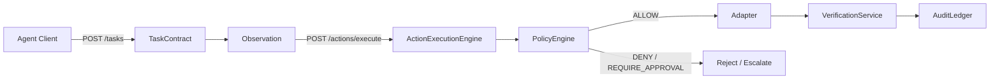
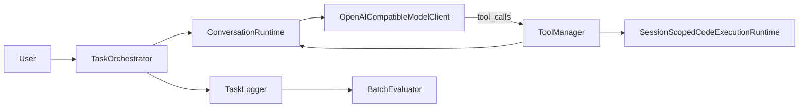
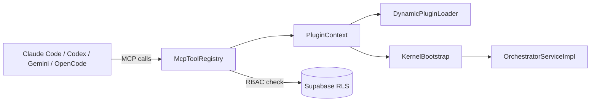
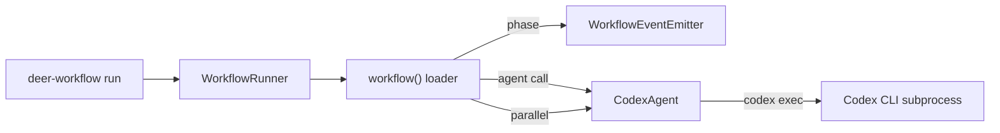

# Weekly Agentic AI Scan — 2026-07-27

**Cửa sổ quan sát:** 2026-07-20 → 2026-07-27
**Phương pháp:** Search phạm vi rộng qua GitHub search/trending pages + web search (session này bị scope vào 1 repo duy nhất nên không dùng được `gh api search/repositories` trực tiếp; dữ liệu được cross-check qua WebFetch trên từng repo để xác nhận tồn tại thật, star count, và đọc source code thực tế qua `raw.githubusercontent.com` + GitHub tree API).

## Executive Summary

- Tuần này nổi bật nhất là **AEE (Agent-Execution-Partnership)** — một control-plane tách biệt hoàn toàn khỏi model, implement đúng pattern "authorize → observe → verify" bằng state machine + audit chain, nhưng verification thực chất còn là stub.
- **AxisAgentic** là ví dụ rõ nhất về "trace-as-source-of-truth": cùng một JSON execution trace được tái sử dụng cho cả replay, eval, và SFT export — thiết kế coherent hơn phần lớn agent framework khác, dù sandbox chỉ áp dụng cho code-exec tool.
- **BossConsole** và **deer-workflow** đại diện hai thái cực của "tool integration": BossConsole biến chính console thành 100+ MCP tools cho agent gọi ngược lại (bidirectional MCP), còn deer-workflow siết orchestration về code TypeScript xác định, đẩy toàn bộ phần non-deterministic vào một interface `Agent.run()` duy nhất.

## Mục lục

1. [Agent-Execution-Partnership (AEE)](#1-agent-execution-partnership-aee)
2. [AxisAgentic](#2-axisagentic)
3. [BossConsole](#3-bossconsole)
4. [deer-workflow](#4-deer-workflow)

---

## 1. Agent-Execution-Partnership (AEE)

**Repo:** https://github.com/eli-labz/Agent-Execution-Partnership (verified tồn tại, HTTP 200)

### §1 — Quick Context

Control plane mã nguồn mở buộc mọi hành động của AI agent phải được authorize trước, quan sát trong lúc chạy, và verify sau khi xong. Stack: Python 3.12+, FastAPI/Uvicorn, Pydantic v2, SQLAlchemy + Alembic, structlog, OpenTelemetry, Playwright; license Apache-2.0. Repo health: 199 stars, 50 forks, 0 open issue/PR — dự án còn sớm, tự nhận là "early implementation" trong README, chưa xác định số contributor và tình trạng CI chạy thật.

### §2 — Architecture Deep-Dive

**A. Component inventory**
- `TaskContract` / `Observation` / `ActionRequest` / `PolicyDecision` / `ExecutionEvidence` / `VerificationResult` (`src/aep/contracts/models.py`) — bộ Pydantic model strict (`extra="forbid"`) định nghĩa toàn bộ giao thức.
- `PolicyEngine` (`src/aep/policy/engine.py`) — cổng allow/deny/require-approval, hiện là if/else chain, không phải declarative rule engine.
- `ActionExecutionEngine` (`src/aep/execution/engine.py`) — điều phối toàn bộ vòng lặp, giữ state theo action.
- `validate_transition` / `ALLOWED_TRANSITIONS` (`src/aep/actions/state_machine.py`) — FSM 15 state, từ `PROPOSED` đến `VERIFIED`/`FAILED`/`ESCALATED`.
- `VerificationService` (`src/aep/verification/service.py`) — kiểm tra hậu-thực-thi.
- `AuditLedger` (`src/aep/audit/ledger.py`) — audit log dạng hash-chain, append-only.
- Adapter layer: `FilesystemAdapter` (`src/aep/adapters/filesystem/local_fs_adapter.py`) + browser/http/messaging/process adapters, đăng ký trong `src/aep/api/app.py`.
- `redact_payload` (`src/aep/security/redaction.py`) — lọc secret trước khi ghi audit.

**B. Control flow — State machine + policy-gate middleware** (không phải ReAct/planner-executor). Happy path:
1. `POST /tasks` tạo `TaskContract` (goal, allowed_tools, risk_budget).
2. `POST /observations` nộp state snapshot kèm deadline.
3. Agent đề xuất `ActionRequest` qua `POST /actions/execute`.
4. Engine chuyển `VALIDATING`, gọi `PolicyEngine.evaluate()` → ALLOW/DENY/REQUIRE_APPROVAL.
5. Nếu allow: `AUTHORIZED → PRECONDITION_CHECK → READY → EXECUTING`, adapter thực thi, kết quả hash vào `ExecutionEvidence`.
6. `VerificationService.verify()` set VERIFIED/FAILED; `AuditLedger.append()` ghi hash-chain; fail thì gọi `RecoveryService.plan()` (chưa đọc được nội dung).

**C. State & data flow** — Toàn bộ message là Pydantic schema strict. Điểm đáng chú ý: dù có SQLAlchemy + Alembic, API handler trong `api/app.py` lại dùng **plain in-memory dict** cho `tasks`/`observations` — lớp persistence có vẻ chỉ scaffold, chưa thực sự nối dây. Không tìm thấy context-window management nào trong `src/aep` — không xác định từ code available.

**D. Tool/capability integration** — `Adapter` là một `Protocol` (`execute(action) -> dict`), đăng ký theo string key trong dict tại `api/app.py`. Sandbox ví dụ: `FilesystemAdapter._validate_target` giới hạn path trong `settings.fs_roots`, chặn symlink, khoá `delete_file` sau flag `enable_destructive`.

**E. Memory architecture** — Không có; `Observation` chỉ là snapshot ngắn hạn, không phải bộ nhớ agent.

**F. Model orchestration** — Bản thân control plane **không gọi LLM ở bất kỳ file nào đã đọc** — hoàn toàn model-agnostic, agent bên ngoài (model bất kỳ) gọi vào qua HTTP/CLI. Code model duy nhất (`models/gpt`, `models/functiongemma`) chỉ phục vụ pipeline training offline (`aep research train/prepare`), không liên quan quyết định agent live.

**G. Observability & eval** — structlog + OpenTelemetry khai báo trong deps; `AuditLedger` cho hash-chain SHA-256 JSONL với `verify_chain()` để kiểm tra tính toàn vẹn, cộng redaction PII/secret; expose qua `/audit/verify` và `/metrics`.

**H. Extension points** — Thêm adapter mới qua `Adapter` protocol + đăng ký trong `api/app.py`; thêm policy rule bằng cách sửa trực tiếp if/else chain trong `PolicyEngine.evaluate` (chưa phải DSL/OPA-style dù có thư mục `policies/` riêng, chưa kiểm tra hết nội dung).

### §3 — Architecture Diagram

### §4 — Verdict

**Novel:** Contract khép kín task→observation→action→policy→verify, cộng audit chain hash SHA-256 và FSM tường minh để canh lifecycle action — hiếm thấy được implement gọn như vậy trong repo agent open-source. **Red flags:** `VerificationService.verify()` thực chất là stub — "verified" chỉ nghĩa là adapter trả `status=="success"`, chưa check `expected_effects` thật; `config/settings.py` để mặc định path Windows dev-machine cụ thể (`E:/Agent-Execution-Partnership/...`); SQLAlchemy/Alembic tồn tại nhưng API handler chưa dùng DB thật; `PolicyEngine` chỉ là if-chain, chưa đúng "policy engine" như docs mô tả. **Open questions:** nội dung thật của `policies/`, `RecoveryService`, `ApprovalService` chưa được đọc.

---

## 2. AxisAgentic

**Repo:** https://github.com/XYZ-AI-Lab/AxisAgentic (verified tồn tại, HTTP 200)

### §1 — Quick Context

Runtime Python cho AI agent chạy task dài hạn (long-horizon), ghi lại execution trace append-only để tái sử dụng cho replay, evaluation, và SFT export. Stack: Python 3.12+, Pydantic v2, `openai` AsyncClient, ruff/mypy/pyright strict, E2B cho sandbox code-exec; license Apache-2.0. Repo health: 216 stars; có 1 CI workflow (`.github/workflows/ci.yml`); số contributor không lấy được do session bị scope GitHub API.

### §2 — Architecture Deep-Dive

**A. Component inventory**
- `TaskOrchestrator` (`agentic/orchestration/task_orchestrator.py`) — vòng lặp lượt chính, trả `OrchestrationResult`.
- `OrchestratorTool` (`agentic/orchestration/orchestrator_tool.py`) — bọc một orchestrator thành tool để agent lồng nhau (hierarchical).
- `ConversationRuntime` (`agentic/conversations/conversation_runtime.py`) — state machine quản lý message history, compaction, rollback.
- `ContextBudgetEstimator` (`agentic/conversations/context_budget.py`) — tính token budget.
- `ToolManager` (`agentic/tools/manager.py`) — đăng ký, dispatch, budget, tự sửa argument lỗi.
- `Tool` / `CallableTool` / `MCPToolAdapter` (`agentic/tools/base.py`) — abstraction tool, có cả interop MCP.
- `SessionScopedCodeExecutionRuntime` (`agentic/tools/code_sandbox/code_exec.py`) — sandbox code-exec dựa trên E2B.
- `OpenAICompatibleModelClient` (`agentic/model_clients/openai_client.py`) — I/O với model, retry/backoff, per-endpoint profile.
- `TaskLogger` / `TaskTrace` / `ToolTrace` (`agentic/observability/task_logger.py`) — lưu trace.
- `BatchEvaluator` (`agentic/evaluation/evaluator.py`) — pipeline inference + scoring.

**B. Control flow — Planner-executor / turn-based state machine** (dáng ReAct nhưng không đặt tên vậy):
1. `TaskOrchestrator.run()` khởi tạo task, khởi tạo `ConversationRuntime`.
2. `_run_turn()` gọi model client `acomplete()`.
3. Nếu có tool_calls, `_run_tool_phase()` → `ToolManager.execute_tool_calls()` validate/dispatch.
4. Kết quả append vào conversation, kiểm tra budget/context (`ContextBudgetEstimator`), áp dụng compaction/rollback marker nếu cần.
5. Lặp tới khi `done`/hết lượt/hết context.
6. Trả `OrchestrationResult` kèm reward, đồng bộ trace qua `TaskLogger`.

**C. State & data flow** — Message là `ConversationMessage` (Pydantic, role enum, factory method, `to_model_message()`). State lưu in-memory dạng list có thứ tự; marker đặc biệt (`CompactionMarker`, `DiscardAllMarker` trong `agentic/contracts/markers.py`) được chèn vào history để compact/reset — mô hình append-only kèm splice. Context window quản lý qua `ContextBudgetEstimator` (hard_stop/warning_threshold) và `context_length_tracker.py`.

**D. Tool/capability integration** — `ToolManager.register()` (dict theo tên, chặn trùng); dispatch qua `execute_tool_calls()` validate argument theo JSON Schema, có budget gọi theo tool/task, phát hiện gọi lặp liên tiếp, hook tự sửa argument. Hỗ trợ MCP qua `CallableTool.from_mcp_definition`/`MCPToolAdapter`. Sandbox chỉ áp dụng cho tool code-exec, giao hoàn toàn cho E2B remote sandbox (`AsyncSandbox.create`, timeout mặc định 600s) — các tool khác không có sandbox local.

**E. Memory architecture** — Không có bộ nhớ dài hạn/vector; chỉ có context hội thoại trong-task cộng compaction summary. Không xác định được có memory xuyên-task hay không.

**F. Model orchestration** — Một abstraction `ModelClient` (`base.py`), impl cụ thể `OpenAICompatibleModelClient`; "profile" theo từng endpoint (deepseek-v4-pro, kimi-k2.6, glm-5.1, qwen3-thinking, minimax, nemotron, xlam) chỉnh tên field reasoning/flag parallel-tool-call — tức là swap model, không phải ensemble đa model. Retry/backoff cho lỗi transient (408/429/5xx, timeout) với exponential backoff + jitter, SystemExit cứng sau ngưỡng fail liên tục. Parallelism phân cấp qua `OrchestratorTool` lồng orchestrator trong tool list của orchestrator khác.

**G. Observability & eval** — `TaskLogger`/`TaskTrace`/`ToolTrace` lưu JSON trace (`{task_id}.json`, `.partial.json` cho flush tăng dần) gồm timestamp, latency tool, token usage, lịch sử hội thoại; `scan_completed_task_ids()` hỗ trợ resume. `BatchEvaluator.evaluate()` chạy orchestrator + verifier trên dataset với semaphore concurrency, ghi kết quả và `_resolve_trace_path()` nối record eval về đúng trace file — đây chính là cơ chế "replay", thực hiện bằng cách load lại JSON trace chứ không có class "replay engine" riêng.

**H. Extension points** — Tool tuỳ chỉnh qua subclass `Tool` hoặc `CallableTool`/MCP adapter + `ToolManager.register()`; model tuỳ chỉnh qua subclass `ModelClient`; evaluator tuỳ chỉnh theo pattern `verifier.py`/`qa_em_verifier.py`; thư mục `recipe/` (web_search, wide_search, dashboard, common) minh hoạ cách lắp `agentic/` runtime lõi thành app benchmark cụ thể.

### §3 — Architecture Diagram

### §4 — Verdict

**Novel:** Trace JSON làm "single source of truth" — cùng dữ liệu nuôi cả `BatchEvaluator` lẫn SFT export — là thiết kế coherent hiếm gặp so với phần lớn agent framework chỉ log để debug. Per-endpoint model profile cho các model open-weight reasoning (kimi, glm, qwen3, deepseek) là chi tiết thực dụng ít framework khác có. **Red flags:** không có sandbox thật ngoài E2B cho code-exec — các tool khác (vd. web_search) chạy như trusted code, không cô lập; không có lớp memory/retrieval; chỉ 1 CI workflow, chưa thấy tín hiệu test-coverage hay hoạt động cộng đồng (API bị chặn nên không lấy được); implementation "flagship XYZ-Aquila" chưa verify được — thư mục `recipe/` đặt tên chung chung, không có thư mục riêng cho nó. **Open questions:** nội dung thật của `agentic/rl/`, `agentic/rewards/` (thấy tên nhưng chưa đọc), và mức độ tích hợp thật của `swift_agent.py` với ms-swift hay SFT trainer khác.

---

## 3. BossConsole

**Repo:** https://github.com/risa-labs-inc/BossConsole (verified tồn tại, HTTP 200)

### §1 — Quick Context

"Operator console" đa nền tảng chạy native trên JVM (không phải Electron), host các CLI agent (Claude Code/Codex/Gemini/OpenCode) và expose chính console như 100+ MCP tools ngược lại cho agent gọi. Stack: Kotlin Multiplatform + Compose Multiplatform, Ktor, Supabase (Postgres + RLS + Edge Functions), JxBrowser, gRPC microkernel; license Apache-2.0. Repo health: 199 stars, 5 forks, 6 open issue, tạo ngày 2026-07-21, push gần nhất 2026-07-27 — rất mới (~1 tuần lịch sử public) nhưng hoạt động dồn dập.

### §2 — Architecture Deep-Dive

**A. Component inventory**
- `DesktopBossApp.kt`/`main.kt` (`composeApp/src/desktopMain/kotlin/ai/rever/boss/`) — entry point, sequence khởi động, shutdown hook.
- `KernelBootstrap.kt` (`.../kernel/`) — microkernel, đăng ký 15 gRPC service (Kernel, EventBus, State, Performance, Git, Log, Secret, Supabase, RBAC...) nối host với child process.
- `DynamicPluginLoader.kt`, `PluginClassLoaderManager.kt`, `PluginSignatureVerifier.kt` (`plugin-platform/plugin-loader/.../loader/`) — classloading cô lập theo từng plugin, validate signature/version, hot (un)load.
- `TrackingPluginContext.kt` (`composeApp/src/commonMain/.../components/plugin/`) — track/unregister MCP tool của plugin khi disable.
- `OrchestratorServiceImpl.kt`, `RepairEngine.kt`, `CrashAnalyzer.kt` (`modules/boss-orchestrator/.../orchestrator/`) — supervisor tự phục hồi process khi crash, **không phải** orchestration cho agent task.
- `Application.kt` (`server/src/main/kotlin/ai/rever/boss/`) — Ktor/Netty stub tối giản (chỉ 1 route `GET /`); logic backend thật nằm ở `supabase/`.

**B. Control flow — Event-driven / IPC microkernel**, không phải ReAct/planner-executor trong code. Happy path:
1. Người dùng mở BOSS desktop app, mở workspace project.
2. CLI agent (Claude Code/Codex/...) được cấu hình trỏ vào MCP endpoint của BOSS.
3. Agent gọi các tool read-only `mcp__boss__*` để nắm tình huống (list tab, tail terminal, xem git).
4. Agent gọi action tool (chạy lệnh, thao tác file, browser automation) đi qua `PluginContext`/`McpToolRegistry` → check RBAC → handler của plugin.
5. Pane terminal/browser render hành động trực tiếp cho người dùng xem.
6. Người dùng có thể pause qua kill-switch hoặc approve/deny (vd. `approveRepair()` trong orchestrator) với hành động rủi ro cao.

**C. State & data flow** — Không tìm thấy spec message format tường minh giữa agent↔BOSS ngoài MCP JSON-RPC chuẩn (ngầm định, chưa thấy trong code đã đọc). State bền vững: Supabase Postgres (roles/permissions, `app_releases`, plugin manifest) có RLS; state local ở `~/.boss/` (vd. `mcp-disabled-tools.json`). Không tìm thấy context-window management — không xác định từ code available.

**D. Tool/capability integration** — API `McpTool` (`McpToolProvider`/`Definition`/`Handler`/`Args`/`Result`) + `McpToolRegistry` + `McpServerController`, thêm qua `boss-plugin-api` 1.0.51. Plugin gọi `PluginContext.registerMcpToolProvider`; tập tool hiển thị = đã đăng ký − bị user disable − bị từ chối permission, gate theo từng tool bằng `requiredPermissions`/`requiresAdmin`, cập nhật live theo thay đổi role. Validation: `PluginSignatureVerifier`/`PluginSignatureSidecar` (plugin đã ký), `BinaryCompatibilityValidator` (check tương thích bytecode) — đây là sandbox/trust cho plugin, không phải sandbox cho từng tool-call của agent.

**E. Memory architecture** — Không xác định từ code available (không thấy module memory riêng; `SnapshotManager.kt` trong boss-orchestrator có vẻ liên quan snapshot process/crash, không phải bộ nhớ agent).

**F. Model orchestration** — BOSS không tự route/orchestrate giữa các model. Mỗi CLI agent (Claude Code, Codex, Gemini, OpenCode) là một MCP client độc lập gắn vào tool server của BOSS; BOSS là tool provider, không phải multi-model router. Không tìm thấy logic fallback/parallelism giữa các model.

**G. Observability & eval** — `docs/THREADING.md` quy định kỷ luật concurrency/dispatcher; kernel có health/watchdog streaming (`getHealthDashboard()`, `watchHealth()` trong `OrchestratorServiceImpl.kt`) cho crash/restart process, không phải eval LLM output. Không tìm thấy eval hook cho output của agent.

**H. Extension points** — Plugin platform (`plugin-platform/plugin-loader`, `plugin-api-core`, `plugin-sandbox`) hỗ trợ hot-reload qua `PluginClassLoader` cô lập, parent chung `ApiClassLoader`; load sequence validate signature, API version, binary compatibility trước khi instantiate; cờ `force`/`waitForGC` kiểm soát unload/swap an toàn. README liệt kê ~20 plugin ship riêng (terminal-tab, editor-tab, secret-manager...).

### §3 — Architecture Diagram

### §4 — Verdict

**Novel:** MCP được dùng hai chiều — cùng giao thức agent dùng để gọi tool cũng được dùng để expose chính host app (tab, terminal, browser, git) thành hơn 100 tool, cho agent "nhận thức tình huống" về UI của chính nó thay vì chỉ có shell access thô. RBAC/kill-switch enforce phía server qua Supabase RLS cộng registry tool đồng bộ live, không chỉ dựa vào client trust. **Red flags:** module `server/` Ktor gần như rỗng — logic auth/RBAC thật nằm ở Supabase, nên tên "server" trong cây thư mục gây hiểu lầm; module "orchestrator" thực chất là process supervisor tự phục hồi, không phải agent/task orchestrator — không có bằng chứng multi-model routing hay memory/context-window management trong repo. Repo còn rất trẻ (tạo 2026-07-21, ~1 tuần lịch sử) dù docs khá hoàn chỉnh. **Open questions:** schema message thật giữa agent↔MCP, cơ chế quản lý context/token, và có tồn tại cross-model fallback nào không — chưa xác định được từ code hiện có.

---

## 4. deer-workflow

**Repo:** https://github.com/deerwork-ai/deer-workflow (verified tồn tại, HTTP 200)

### §1 — Quick Context

Runtime TypeScript chạy script "Workflow" xác định (deterministic, hàm async thường), đẩy phần việc mơ hồ/sáng tạo sang một "Agent" runtime có thể thay thế (mặc định: OpenAI Codex CLI). Là dự án pilot cho "DeerFlow 3.0". Stack: Bun + TypeScript (ESM), ESLint/Prettier/Husky, license MIT. Repo health: 128 stars, 15 forks, 37 commit, 0 open issue/PR — dự án nhỏ, cảm giác một-người-maintain, pre-1.0 (`package.json` version `0.1.0`).

### §2 — Architecture Deep-Dive

**A. Component inventory**
- `WorkflowRunner` (`src/runner/workflow-runner.ts`) — driver cấp cao nhất; gắn event emitter, JSON-line log writer, log-sink, rồi gọi `workflow()`.
- `workflow()` loader (`src/flow/workflow.ts`) — resolve module path, validate export `meta`, gọi handler, phát lifecycle event; ép nesting chỉ 1 cấp (`WorkflowNestingError`).
- `phase()` / phase context (`src/flow/phase.ts`, `src/flow/context.ts`) — đánh dấu phase tiến trình bằng `AsyncLocalStorage`.
- `parallel()` (`src/flow/parallel.ts`) — fan-out/fan-in; task fail resolve thành `null` thay vì reject cả nhóm.
- `pipeline()` (`src/flow/pipeline.ts`, `PipelineStage` trong `src/flow/types.ts`) — transform theo stage cho từng item.
- `Agent` interface + `CodexAgent` (`src/agents/types.ts`, `src/agents/codex-agent.ts`) — contract runtime dùng tool có thể cắm-thay; `bindAgent()` (`src/agents/agent.ts`) biến `Agent` bất kỳ thành hàm `agent()` gọi được.
- `WorkflowEventEmitter` / JSON writer (`src/events/emitter.ts`, `src/events/json-writer.ts`, `src/events/types.ts`) — event bus có type.
- CLI: `src/cli/run.ts`, `src/cli/agent.ts`, `src/cli/create.ts`, `src/cli/skill.ts` — lệnh `deer-workflow run|agent|create`.
- `TerminalUI` (`src/tui/`) — hiển thị event trên terminal tương tác.

**B. Control flow — Deterministic planner/pipeline orchestration với agent call được delegate** (không phải ReAct, không có vòng lặp tự trị ở tầng orchestration). Happy path:
1. CLI (`run.ts`) parse arg/stdin JSON, dựng `WorkflowRunner`.
2. Runner phát `workflow:start`, load module, validate `meta` → phát `workflow:meta`.
3. Handler chạy code TS thường, gọi `phase("X")` để đánh dấu giai đoạn (phát `workflow:phase:start/end`).
4. Trong một phase, handler gọi `agent(prompt, {schema, sandbox})` cho việc cần "phán đoán", hoặc `parallel([...])` cho các agent-call độc lập.
5. Handler ghi artifact (vd. file HTML) trực tiếp qua Node fs.
6. Runner phát `workflow:end` (hoặc `workflow:error`) kèm duration; CLI in kết quả ra stdout, event ra stderr (hoặc toàn bộ JSONL nếu dùng `--print`).

**C. State & data flow** — Không có state store bền vững; state là `WorkflowExecutionContext` in-memory (`id`, `parentId`, `depth`, `scriptPath`, `args`, `phase`) giữ trong `AsyncLocalStorage` mỗi lần chạy (`src/flow/context.ts`). "Message" là chuỗi prompt gửi qua stdin cho Agent; orchestrator không giữ lịch sử hội thoại — mỗi lệnh gọi `agent()` là stateless/tự chứa (xác nhận qua SKILL.md: "Each agent() call must be self-contained with task, scope, prior results, constraints"). Quản lý context window: không xác định từ code available (giao hoàn toàn cho Codex CLI subprocess).

**D. Tool/capability integration** — Agent runtime chỉ cần implement một method, `run(prompt, options): Promise<TOutput>` (`src/agents/types.ts`). Đổi runtime = truyền một implementation `Agent` khác vào `bindAgent()`; hiện chỉ có `CodexAgent` (README: "welcomes contributions for additional Coding Agent integrations"). `CodexAgent.run()` shell ra `codex exec` qua `Bun.spawn`, truyền prompt qua stdin, JSON Schema qua file tạm `--output-schema`, sandbox level (`read-only|workspace-write|danger-full-access`) qua `--sandbox`. Validation = `JSON.parse` output của Codex (`--output-last-message`); không có thư viện validate schema/output bổ sung.

**E. Memory architecture** — Không có; không tìm thấy vector store hay memory xuyên-run.

**F. Model orchestration** — Chỉ một role runtime (Codex CLI agent cho việc phán đoán); model string truyền theo từng call (`options.model`) tới `codex exec --model`. Không có fallback/multi-model routing, parallelism chỉ có ở tầng orchestration qua `parallel()` fan-out nhiều agent-call độc lập.

**G. Observability & eval** — Stream event JSONL có cấu trúc (`workflow:start/meta/end/error`, `phase:start/end`, `log`) ghi qua `createJsonEventWriter` (`src/events/json-writer.ts`); flag `--print` biến đây thành stdout duy nhất cho automation. Có thư mục `skills/workflow-creator/evals/` (fixture eval cho skill) nhưng chưa đọc nội dung — không xác định thêm từ code available.

**H. Extension points** — Điểm nổi bật nhất là sự tách bạch được enforce ở cấp cấu trúc: Workflow là module TS thường chỉ import từ `@deerwork-ai/deer-workflow` (barrel `src/index.ts`); `agent()` call là ranh giới non-deterministic duy nhất, bị cô lập sau `Agent` interface. Người dùng mở rộng bằng cách (1) viết Workflow script mới (theo hướng dẫn `skills/workflow-creator/SKILL.md`), (2) implement class `Agent` tuỳ chỉnh cho backend coding-agent khác, hoặc (3) dùng CLI `deer-workflow create` để scaffold workflow từ mô tả ngôn ngữ tự nhiên.

### §3 — Architecture Diagram

### §4 — Verdict

**Novel:** Contract bề mặt tối giản (`Agent.run(prompt, options)`) tách bạch thật sự orchestration xác định khỏi bước do LLM điều khiển — orchestrator không bao giờ thấy nội tại model, chỉ thấy prompt/schema/sandbox flag vào, text/JSON ra. Event stream JSONL + `--print` mode cho thấy tư duy nghiêm túc về CI/automation. **Red flags:** dù đóng khung "replaceable", hiện chỉ có một backend Agent thật (Codex CLI); không có memory bền vững, không thấy logic retry/fallback; nesting workflow bị giới hạn cứng 1 cấp; dự án còn rất sớm (37 commit, v0.1.0, 0 issue/PR gợi ý ít người dùng ngoài). **Open questions:** lệnh CLI `create`/`skill` sinh code như thế nào (chưa đọc), và nội dung eval harness trong `skills/workflow-creator/evals/` — không xác định từ code available.

---

## Self-check

- [x] Cả 4 repo đều verify được qua WebFetch (tồn tại thật, HTTP 200): AEE, AxisAgentic, BossConsole, deer-workflow.
- [x] Không repo nào là awesome-list hay tutorial dump — cả 4 đều là framework/runtime có source code thật.
- [x] §2.A: mọi component đều kèm file path evidence cụ thể, lấy từ đọc source trực tiếp.
- [x] §2.B: control flow pattern được gọi tên rõ (state-machine + policy gate; planner-executor turn-based; event-driven microkernel; deterministic pipeline + delegated agent).
- [x] §3: Mermaid syntax hợp lệ (flowchart LR, đã kiểm tra cú pháp).
- [x] §3: mọi node trong diagram đều xuất hiện trong §2.A tương ứng.
- [x] §4: điểm "novel" cụ thể theo từng repo (trace-as-source-of-truth, bidirectional MCP, hash-chain audit, single-method Agent contract) — không dùng câu chung chung kiểu "uses LLM".
- [x] File path đúng convention `research/weekly/{YYYY-MM-DD}-agentic-scan.md`, markdown render được trên GitHub.

**Lưu ý về giới hạn phương pháp:** Session này bị scope GitHub API/MCP vào riêng repo `undertheseanlp/underthesea`, nên không dùng được `gh api search/repositories` như data source đề xuất trong task gốc. Danh sách candidate ban đầu (10 repo) được thu thập qua web search + GitHub public pages, sau đó 4 repo được chọn để deep-dive đã verify tồn tại thật qua WebFetch trực tiếp trước khi phân tích kiến trúc. Star count/ngày tạo của 6 repo còn lại trong candidate pool (axrl, opentax-engine, cindy, open-kritt, OptMem, collective-intelligence) chưa được deep-dive tuần này, có thể là ứng viên cho tuần sau.
