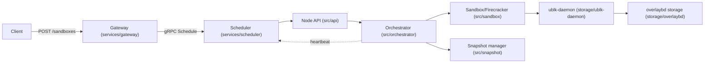
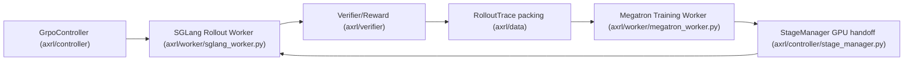
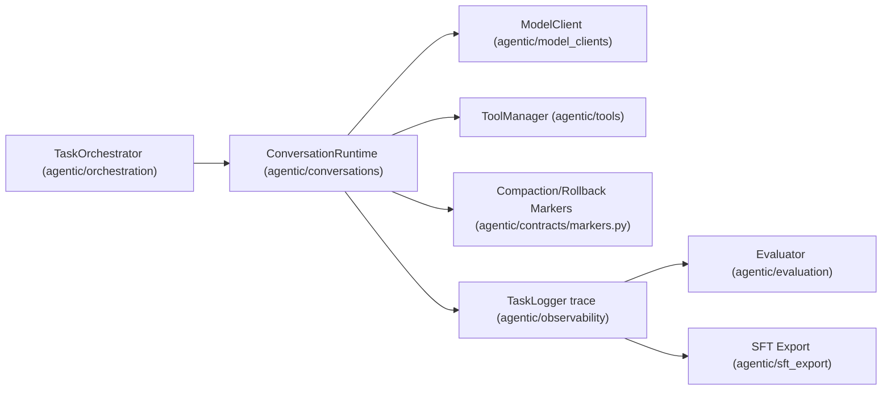
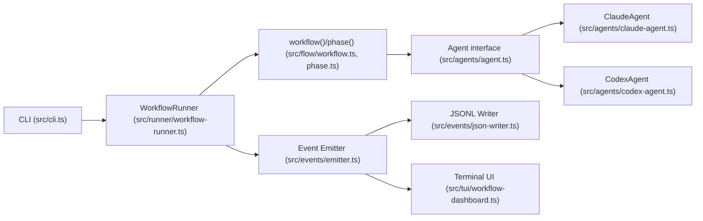

# Weekly Agentic AI Scan — 2026-07-28

**Nguồn dữ liệu:** GitHub Search API (`search/repositories`), filter `agent` trong name/description, `created:>2026-07-21`, `stars:>200`. Trả về 8 repo thoả điều kiện thời gian (đủ ≥4, không cần fallback sang `pushed:>7d stars:>500`). Sau khi loại `open-ai-canvas` (creative-tool, không phải kiến trúc agent) và `OptMem`/`cindy`/`agentacct` (thiếu bằng chứng kiến trúc non-trivial trong lần rà đầu), 4 repo được chọn deep-dive.

## Executive Summary

- Tuần này nổi bật một **cụm 3 repo cùng ngày, cùng org** (`kvcache-ai`, `XYZ-AI-Lab`) phục vụ agentic RL post-training: `AgentENV` là hạ tầng sandbox (Firecracker microVM), `axrl` là training loop (SGLang rollout + Megatron train), `AxisAgentic` là agent runtime thu thập trajectory — nhiều khả năng là 3 mảnh ghép của cùng một stack RL nội bộ (suy luận từ kiến trúc + timing, KHÔNG có cross-reference tường minh trong code).
- Điểm kỹ thuật đáng học nhất tuần này: **marker-based append-only trace với deterministic replay** trong `AxisAgentic` (context compaction/rollback không mutate state, mà ghi marker rồi replay) — giải quyết sạch bài toán "model thực sự nhìn thấy gì" mà phần lớn agent framework khác bỏ qua.
- `deer-workflow` là repo duy nhất không thuộc cụm RL, đáng chú ý vì tên gọi "graph engineering" nhưng thực chất KHÔNG có graph data structure — chỉ là TypeScript async functions + 3 primitive (`phase`/`parallel`/`pipeline`), một điểm cần lưu ý khi đánh giá độ "novel" của branding.

## Mục lục

- [AgentENV (kvcache-ai/AgentENV)](#agentenv-kvcache-aiagentenv)
- [axrl (XYZ-AI-Lab/axrl)](#axrl-xyz-ai-labaxrl)
- [AxisAgentic (XYZ-AI-Lab/AxisAgentic)](#axisagentic-xyz-ai-labaxisagentic)
- [deer-workflow (deerwork-ai/deer-workflow)](#deer-workflow-deerwork-aideer-workflow)

---

## AgentENV (kvcache-ai/AgentENV)

**Repo:** https://github.com/kvcache-ai/AgentENV

### §1 Quick Context

Nền tảng phân tán chạy sandbox agent dưới dạng Firecracker microVM có snapshot, dùng để huấn luyện agentic RL cho Kimi K3 (Moonshot AI) — đây là **hạ tầng sandbox**, không phải framework reasoning của agent. Stack: core bằng Rust (Tokio, Axum, Prost/gRPC, RocksDB, io_uring), control-plane phân tán bằng Go (gRPC), virtualization qua Firecracker + ublk (userspace block device) + overlaybd (layered image format), P2P transport tuỳ chọn qua `iroh`. Repo health: 956 stars, 81 forks, 11 commit trên `main`, MIT license, tạo ngày 2026-07-23 (5 ngày tuổi). CI/tests: có, rất đầy đủ (`ci.yml`, `coverage.yml`, `envd-tests.yml`, `integration-tests.yml`, `mutation-tests.yml`, `ublk-tests.yml`, `benchmark.yml`...). Không lấy được số contributor do `api.github.com` bị chặn ở môi trường research.

### §2 Architecture Deep-Dive

**A. Component inventory** — API layer (`src/api/server.rs`, Axum, endpoint tương thích E2B); Orchestrator — state machine vòng đời sandbox (`src/orchestrator/service.rs`); Sandbox/Firecracker manager (`src/sandbox/firecracker/`, `src/sandbox/ublk/device.rs`); Snapshot manager (`src/snapshot/manager.rs`, `src/snapshot/p2p.rs`); Template builder (`src/template/`); overlaybd storage — layered image format (`storage/overlaybd/src/`); ublk block device server (`storage/ublk/src/`); ublk-daemon — process riêng giữ io_uring/ublk state (`storage/ublk-daemon/src/`); P2P transport trait (`src/p2p/`, impl `IrohBlobsP2pTransport`); Observability (`src/observability/reporter.rs`); Gateway (`services/gateway/`, Go); Scheduler (`services/scheduler/`, Go, gRPC node selection).

**B. Control flow — pattern:** state-machine / resource-orchestration (không áp dụng ReAct/planner-executor vì đây không phải agent-cognition framework). Happy path tạo & dùng sandbox:
1. Client gửi `POST /sandboxes` tới Gateway → Gateway gọi `Schedule()` RPC của Scheduler để chọn node.
2. Orchestrator trên node đích đưa sandbox qua các state: Creating → Running → (Pausing/Paused/Resuming) → Killing.
3. `UblkDeviceManager` dựng rootfs từ overlaybd layer của template, Firecracker microVM boot mount device đó, lấy network slot từ warm-pool.
4. Client tương tác qua reverse proxy `ANY /proxy/*`, route vào `envd` bên trong guest.
5. Khi pause: Firecracker tạo diff memory snapshot, đóng gói thành overlaybd memory layer; ublk device bị xoá, tài nguyên giải phóng.
6. Khi resume: dựng lại ublk device read-only từ các memory layer xếp chồng, **chia sẻ refcounted giữa nhiều sandbox cùng template** qua page cache.

**C. State & data flow:** Gateway↔Scheduler dùng gRPC/protobuf có typed schema (`services/api/proto/scheduler.proto`); API layer là REST/JSON. State orchestrator lưu in-memory + module persistence cho sandbox đã pause; binding node/sandbox của Scheduler **chỉ in-memory** (tự nhận là mất khi restart); snapshot lưu S3-compatible object storage hoặc POSIX filesystem. Không có context-window management vì không tiếp xúc LLM trực tiếp.

**D. Tool/capability integration:** Không có evidence — repo không chứa function-calling/MCP; thay vào đó nó expose **HTTP API tương thích E2B** để agent framework bên ngoài (dùng E2B SDK có sẵn) gọi vào không cần sửa code. Có custom extension API (`src/custom_extension_api/`) ở tầng infra, không phải tool-calling của model.

**E. Memory architecture:** Không có evidence memory hội thoại LLM — "memory" trong repo này là RAM snapshot/restore của VM, khái niệm khác.

**F. Model orchestration:** Không có evidence — không có lời gọi LLM API nào trong `src/`/`crates/`/`services/`. README nói platform phục vụ agentic RL training cho Kimi K3 nhưng stack training đó nằm ngoài repo.

**G. Observability & eval:** Stack quan sát tự viết (không OpenTelemetry/Langfuse) — thu thập node identity, host metrics, heartbeat gRPC định kỳ tới Scheduler. Có benchmark suite (Criterion) qua CI riêng (`benchmark.yml`, `e2b-benchmark.yml`) nhưng là benchmark hiệu năng hạ tầng, không phải eval hành vi agent.

**H. Extension points:** Custom extension API cho sandbox behavior; `VirtualFile` trait cho storage backend pluggable; `P2pTransport` trait (Disabled/IrohBlobs); scheduler discovery (`static`/`kubernetes`) và scheduling strategy (`round_robin`/`random`) pluggable; tương thích SDK E2B sẵn có.

### §3 Architecture Diagram

### §4 Verdict

**Novel:** ublk + overlaybd + LSMT layered-image là kỹ thuật hệ thống thật sự khó — resume VM dưới 50ms và chia sẻ memory-snapshot device refcounted giữa nhiều sandbox cùng template (qua page cache) giải quyết đúng bottleneck "N rollout song song từ cùng environment template" trong agentic RL, không phải boilerplate. **Red flags:** tự cảnh báo không có auth, không nên expose ra mạng công cộng; control-plane phân tán tự nhận là "prototype"; scheduler binding chỉ in-memory, mất khi restart; 956 star sau 5 ngày/11 commit — tăng trưởng nhanh bất thường, nên nghi ngờ traction organic vs backing từ lab lớn (Moonshot AI). **Câu hỏi mở:** stack training/agent nào thực sự gọi vào platform này (không thấy trong repo); câu chuyện failover multi-tenant chưa có tài liệu ngoài "prototype".

---

## axrl (XYZ-AI-Lab/axrl)

**Repo:** https://github.com/XYZ-AI-Lab/axrl

### §1 Quick Context

AxisRL là framework agentic RL post-training kết hợp SGLang (rollout throughput cao) và Megatron-LM (training phân tán quy mô lớn) để huấn luyện agent LLM trên trajectory dài, multi-turn (300+ turn), có dùng tool. Stack: Python ≥3.12, SGLang v0.5.14, Megatron-LM core_v0.18.0 + Megatron-Bridge v0.5.0, Ray ≥2.54.0, E2B (sandbox code execution), FlashAttention/MagiAttention kernels. Repo health: 350 stars, 19 forks, 9 commit, Apache-2.0, tạo 2026-07-23 (5 ngày tuổi). CI: có (`.github/workflows/ci.yml`); tests: có, tree `tests/` rất rộng (17 subdirectory gồm `blackbox_rl`, `mcore`, `moe`, `routing_replay`, `worker`).

### §2 Architecture Deep-Dive

**A. Component inventory** — Agent/policy interface (`axrl/agent/base_agent.py`, `rollout_agent.py`); Environment runner (`axrl/envs/base_env.py`, `math_env.py`); SGLang rollout worker (`axrl/worker/sglang_worker.py`, `rollout_worker.py`); Megatron training worker (`axrl/worker/megatron_worker.py`, `trainer_worker.py`); Trainer theo thuật toán (`axrl/trainer/grpo_trainer.py`, `sft_trainer.py`, `value_trainer.py`, `ppo_utils.py`); Verifier/reward (`axrl/verifier/base_verifier.py`, `math_reward.py`, `dapo_verifier.py`, `leetcode_executor.py`); PipelineController/GrpoController (`axrl/pipeline/controller.py`, `axrl/controller/grpo_controller.py`); StageManager điều phối GPU handoff (`axrl/controller/stage_manager.py`); Ray distributed layer (`axrl/ray/ray_megatron_worker.py`, `resource_group.py`); OpenAI-compatible proxy (`axrl/openai_proxy/server.py`); Sandbox runner E2B/cgroup (`axrl/runner/e2b_runner.py`, `cgroup_runner.py`); Data/trajectory (`axrl/data/conversation.py`, `rollout_trace.py`, `rollout_trace_packing.py`); Metrics (`axrl/metrics/conv_metrics_store.py`, `report_mismatch.py`).

**B. Control flow — pattern:** actor-learner split, đồng bộ theo stage do controller điều phối. Happy path (`run_online_rl_train`):
1. `GrpoController` load config YAML, init trọng số Megatron, sync sang SGLang rollout worker.
2. Vòng lặp `global_step < max_global_updates`: rollout conversation sinh qua `RolloutActor`/`RayTaskQueue`.
3. Kết quả rollout gom theo `conversation_id`, reward chuẩn hoá (mean/std, clip [-5,5]), lọc group std=0 (`normalize_group_rewards`).
4. Rollout trace đóng gói thành tensor batch (`rollout_trace_packing.py`); `megatron_worker.train()` cập nhật trọng số actor (và value nếu PPO) qua `StageManager` điều phối GPU handoff.
5. Trọng số mới sync ngược về rollout worker; checkpoint lưu định kỳ, eval định kỳ chạy song song.

**C. State & data flow:** Đơn vị chia sẻ là `Conversation` (list `Message`, `conversation_id`, `gen_state` gồm token id, sampling config, tools). `RolloutTrace` ghi trajectory phía rollout — mỗi turn là `Sample` (input_ids, attention mask, loss_mask), reward gán per-turn qua `set_turn_reward()`. Checkpoint = trọng số Megatron + metadata, nén zstd, retention "most-recent-k", export định kỳ sang HF format. Không có replay-buffer riêng ngoài mode `replay_rl_train` đọc lại rollout snapshot đã lưu.

**D. Tool/capability integration:** Tool gắn ở tầng `Conversation`/`gen_state` (`tools`, `tool_choice`, `tool_call_parser`), model gọi tool qua cơ chế native của SGLang trong lúc generate. Với agent harness bên ngoài (vd OpenHands), `openai_proxy/server.py` expose HTTP API tương thích OpenAI theo session, route request vào đúng rollout session mà không cần biết SGLang tồn tại phía sau — decoupling "agent framework" khỏi "RL infra" khá sạch. Sandbox: `e2b_runner.py` (E2B cloud, bắt buộc allowlist network non-wildcard) và `cgroup_runner.py` (cgroup local).

**E. Memory architecture:** Không có evidence memory agent tách biệt khỏi cấu trúc trajectory/replay ở mục C.

**F. Model orchestration:** Policy/actor được SGLang serve cho rollout, Megatron-LM/Megatron-Bridge train; value/critic riêng cho PPO (`value_trainer.py`). Reward là rule-based/programmatic (verifier toán/code) chứ không phải reward model học được. `StageManager` cho phép rollout và train **dùng chung GPU theo kiểu time-sharing** (offload/onload) thay vì tách cứng actor/learner GPU — điểm kỹ thuật đáng chú ý.

**G. Observability & eval:** Module `axrl/metrics/` hỗ trợ mode `mismatch_test` so sánh logprob reference vs model hiện tại, và "routing replay" phân tích tính nhất quán routing của MoE. `PipelineController` chạy background thread log resource cluster. Không thấy tích hợp W&B/MLflow.

**H. Extension points:** Thêm env/agent/reward/trainer/sandbox mới bằng cách kế thừa các base class tương ứng (`BaseEnv`, `BaseAgent`, `BaseVerifier`, `BaseTrainer`, `BaseRunner`). `axis_recipe/` chứa template end-to-end (`grpo_gsm8k`, `ppo_gsm8k`, `grpo_dapo17k_moe`, `search_r1`, `blackbox_rl`). Config layer: YAML → CLI → env var, validate bằng Pydantic strict model từ chối field lạ.

### §3 Architecture Diagram

### §4 Verdict

**Novel:** GPU hand-off rollout↔train qua `StageManager` (time-sharing thay vì tách cứng actor/learner) và OpenAI-compatible proxy theo session cho phép agent harness "black-box" tham gia rollout RL mà không cần biết gì về SGLang — decoupling rõ ràng, hiếm thấy ở mức này. Sandbox E2B bắt buộc allowlist non-wildcard là cơ chế an toàn cụ thể, không chung chung. **Red flags:** repo 5 ngày tuổi, 9 commit, không xem được danh sách contributor; `setup.py` chỉ list `e2b` trong install_requires — SGLang/Megatron/Ray/torch chỉ pin trong Dockerfile CUDA, không pip-install sạch ngoài container đó, đặt câu hỏi về reproducibility. **Câu hỏi mở:** cơ chế weight-sync thực sự giữa Megatron và SGLang worker chưa thấy rõ implementation; danh tính tổ chức đứng sau XYZ-AI-Lab chưa xác nhận được.

---

## AxisAgentic (XYZ-AI-Lab/AxisAgentic)

**Repo:** https://github.com/XYZ-AI-Lab/AxisAgentic

### §1 Quick Context

Runtime Python mở rộng được cho agent LLM long-horizon, nơi mọi sự kiện runtime được append vào một trace bất biến, từ đó context hiển thị cho model, dữ liệu eval, và dữ liệu SFT training đều được **reconstruct lại**. Stack: Python 3.12+, OpenAI-compatible chat API + SGLang local-inference client, Pydantic/dataclass contract, pytest, Ruff/mypy/pyright, E2B sandbox tuỳ chọn, dashboard Streamlit. Repo health: 293 stars, 41 forks, 0 issue mở, tạo 2026-07-23, push gần nhất 2026-07-24 (hoạt động tới 2026-07-28). CI: có; tests: có, 25 file trong `tests/`. Cùng org và cùng ngày tạo với `axrl` — nghi vấn 2 repo là 2 mảnh của cùng stack RL, nhưng search code "axrl" trong repo này ra 0 kết quả nên đây là **suy luận từ kiến trúc, không phải cross-reference tường minh**.

### §2 Architecture Deep-Dive

**A. Component inventory** — ConversationRuntime, state machine hội thoại (`agentic/conversations/conversation_runtime.py`); ContextLengthTracker/context budget (`agentic/conversations/context_length_tracker.py`, `context_budget.py`); Markers cho compaction/rollback/discard (`agentic/contracts/markers.py` — `CompactionMarker`, `DiscardAllMarker`); TaskOrchestrator, vòng lặp thực thi (`agentic/orchestration/task_orchestrator.py`), cộng `OrchestratorTool` cho phép nesting orchestrator làm tool của orchestrator khác; ToolManager/registry (`agentic/tools/manager.py`, `agentic/tools/base.py` — hỗ trợ cả `MCPToolAdapter`); ModelClient (`agentic/model_clients/base.py`, `openai_client.py`, `sglang_client.py`); RewardEvaluator (`agentic/rewards/base.py`); BatchEvaluator/Verifier (`agentic/evaluation/evaluator.py`, `verifier.py`); TaskLogger/TaskTrace (`agentic/observability/task_logger.py`); RL facade cho training loop ngoài (`agentic/rl/facade.py`, `rollout_client.py`); SFT export (`agentic/sft_export/swift_agent.py`); recipe tham chiếu (`recipe/web_search/`, `recipe/wide_search/`, `recipe/dashboard/app.py`).

**B. Control flow — pattern:** state machine kiểu ReAct (tool-calling loop) với `ConversationStage` transition tường minh, bọc bởi TaskOrchestrator; `OrchestratorTool` cho phép nesting một tầng (hierarchical tuỳ chọn) nhưng lõi vẫn là vòng lặp tuyến tính mỗi tầng. Happy path:
1. `TaskOrchestrator.run()` chuẩn hoá input, tạo `ConversationRuntime`, gọi `initialize_conversation()`.
2. Vòng lặp: gọi `ModelClient` sinh response → `apply_assistant_message()` chạy dispatch 7 bước ưu tiên (hết token budget → force finalize → tool call → kiểm tra chất lượng nội dung → final answer trực tiếp → prompt final-response → completion bình thường).
3. Nếu có tool call: chuyển state `ASSISTANT_TOOL_CALLS_AWAIT_TOOL`, `ToolManager.execute_tool_calls()` chạy async/batch, kết quả match ngược qua `apply_batch_tool_messages()`.
4. Mọi sự kiện (turn, tool trace, marker) append vào log bất biến `_full_conversation`; `TaskLogger` ghi JSON tăng dần ra đĩa.
5. Guard long-horizon kích hoạt cơ hội chủ nghĩa: refusal/format-error → rollback (ẩn message, giảm turn count); vượt context budget → compaction hoặc force-finalization.
6. Kết thúc khi `done=True`; trả `OrchestrationResult` (output, full conversation, reward, turn count) — có thể replay, evaluate, hoặc export SFT.

**C. State & data flow:** Message là `ConversationMessage` (role/content/tool-call, JSON-serializable). State lưu **append-only in-memory log + JSON trace trên đĩa** (không DB/Redis). Quản lý context window cho long-horizon dùng **marker-based compaction/rollback, không phải sliding-window hay RAG**: `CompactionMarker` ghi lại rằng một đoạn message đã bị thay bằng 1 message tóm tắt; `DiscardAllMarker` ghi reset về prefix. Context hiển thị cho model được **replay/reconstruct** tất định từ log đầy đủ bằng cách diễn giải các marker — cả live lẫn từ trace đã lưu, và cùng cơ chế này cấp dữ liệu cho SFT export.

**D. Tool/capability integration:** Function-calling native kiểu OpenAI (`tools`/`tool_choice`). Tool implement base `Tool` (`arun`, `begin_task`, `end_task`, `to_tool_definition`), đăng ký qua tên trong `ToolManager` (từ chối tên trùng). Argument được validate bằng JSON Schema (`jsonschema.validate()`) trước khi chạy, có hook `ToolArgumentRepairer` sửa argument lỗi do LLM sinh. **Hỗ trợ MCP** qua `MCPToolAdapter`, gom tool theo `server_name`. Không có sandbox chung ở tầng ToolManager — cô lập tuỳ tool (vd tool code sandbox dùng E2B).

**E. Memory architecture:** Đây chính là phần lõi "long-horizon". Không có memory dài hạn dạng vector/retrieval riêng — "memory" được xử lý hoàn toàn qua cơ chế trace + marker-replay ở mục C: context ngắn hạn là visible window sống; khi gần chạm budget, đoạn message bị **compact thành 1 message tóm tắt** (ghi marker, không phá huỷ — message gốc vẫn còn trong log đầy đủ để reconstruct/export sau) hoặc **rollback** (ẩn N message cuối) hoặc **discard về prefix** (reset về task description).

**F. Model orchestration:** Một model hoạt động mỗi lần chạy — `ModelClient` với 2 impl cụ thể: `OpenAICompatibleModelClient` (endpoint remote, model mặc định `gpt-4.1-mini`) và `SGLangModelClient` (inference local in-process từ checkpoint HuggingFace). Có retry với exponential backoff/jitter cho lỗi tạm thời. Không có evidence multi-model fallback hay batching giữa các model khác nhau — RL facade (`rl/facade.py`) là điểm nối rõ ràng nhất cho thấy việc "đổi model" xảy ra ở tầng training bên ngoài (khả năng là repo `axrl`), không phải trong runtime này.

**G. Observability & eval:** `TaskLogger`/`TaskTrace`/`ToolTrace` ghi JSON per-task ra đĩa, flush tăng dần (`.partial.json`), hỗ trợ **resume/replay trace** tường minh (`OrchestrationResult.from_trace()`, kiểm chứng bằng `tests/test_resume.py`). `BatchEvaluator` + `BaseVerifier`/`ExactMatchVerifier` + LLM-judge chấm điểm. Dashboard Streamlit đọc trace/`eval_results.json` trực tiếp hoặc post-hoc. Đây là phần được evidence mạnh nhất của repo — "trajectory-collection" không phải chỉ marketing, có test riêng cho compaction/discard/resume.

**H. Extension points:** Tool mới — kế thừa `Tool`/`CallableTool` hoặc wrap MCP tool. Model backend mới — implement `ModelClient`. Hành vi agent mới — kế thừa `ConversationRuntime`, override hook như `_extract_direct_final_answer()` (minh chứng cụ thể: `WebSearchConversationRuntime` trong `recipe/web_search/agent/runtime.py`). Dataset/recipe mới — kế thừa `BaseDataset`, thêm package `recipe/<name>/`. RL training ngoài — `RLEnvironmentFacade`/`RLPolicyFacade`/`RLRolloutFacade` là seam plug-in tài liệu hoá rõ ràng.

### §3 Architecture Diagram

### §4 Verdict

**Novel:** trace append-only + marker-based replay cho compaction/rollback — không mutate state trực tiếp, mà ghi marker rồi tái tạo context hiển thị tất định, cả live lẫn từ trace đã lưu; cùng cơ chế này nuôi cả evaluation lẫn SFT export state-faithful. Đây là giải pháp sạch hơn hẳn cách phần lớn agent framework khác xử lý "model thực sự thấy gì", và có test bảo chứng chứ không chỉ tuyên bố trong README. **Red flags:** repo chưa đầy 1 tuần tuổi, chỉ có 1 recipe flagship (web search); không có sandbox ở tầng ToolManager ngoài 1 tool code-exec dùng E2B; không có memory dạng RAG/vector dù tên gọi "long-horizon" — memory chỉ là compact/rollback trên cùng hội thoại, không retrieval kiến thức ngoài. **Câu hỏi mở:** compaction summary được sinh bằng model/prompt nào, chất lượng/độ trung thực ra sao; quan hệ với `axrl` là tích hợp production thật hay chỉ trùng vocabulary thiết kế; `OrchestratorTool` nesting hoạt động thế nào ở quy mô multi-agent long-horizon thật sự.

---

## deer-workflow (deerwork-ai/deer-workflow)

**Repo:** https://github.com/deerwork-ai/deer-workflow

### §1 Quick Context

Runtime "Graph Engineering" code-first: TypeScript định nghĩa control flow tất định (phase, error handling) trong khi agent runtime pluggable (Codex CLI mặc định, Claude Code) thực thi phần việc ngữ nghĩa bên trong mỗi node. Stack: TypeScript 5.9, Bun runtime, **zero production dependency** (engine tự viết, không LangGraph/Temporal), MIT license. Repo health: 267 stars, 20 forks, tạo 2026-07-26, push gần nhất 2026-07-27 (1 ngày tuổi tại thời điểm research). CI: có nhưng hạn chế — chỉ 1 workflow (`publish-github-package.yml`), trigger khi release/manual, không chạy trên mỗi PR. Có `tests/` map đầy đủ theo cấu trúc `src/` nhưng không có workflow CI test-on-PR riêng.

### §2 Architecture Deep-Dive

**A. Component inventory** — Agent interface (`src/agents/agent.ts`, `src/agents/types.ts` — contract `run<TOutput>()`); ClaudeAgent adapter (`src/agents/claude-agent.ts`, spawn Claude Code CLI qua `Bun.spawn()`); CodexAgent adapter (`src/agents/codex-agent.ts`); helper `bindAgent()` (`src/agents/agent.ts`) biến `Agent` instance thành callable function; Workflow engine (`src/flow/workflow.ts`); Phase tracker (`src/flow/phase.ts`); Parallel primitive (`src/flow/parallel.ts`, `Promise.all` fan-out); Pipeline primitive (`src/flow/pipeline.ts`, chain theo item); Context propagation dùng `AsyncLocalStorage` (`src/flow/context.ts`); WorkflowRunner (`src/runner/workflow-runner.ts`); Event emitter (`src/events/emitter.ts`, pub/sub đồng bộ có sequence number); JSONL writer (`src/events/json-writer.ts`); Logging sink (`src/logging/index.ts`); Terminal UI (`src/tui/workflow-dashboard.ts`); CLI (`src/cli.ts` — `deer-workflow run|create|skill`).

**B. Control flow — pattern:** **orchestration TypeScript tuần tự/song song với checkpoint "phase" tường minh — KHÔNG phải graph node/edge cổ điển**, dù tên gọi là "graph engineering". Không tìm thấy cấu trúc dữ liệu graph nào (không `Node`/`Edge` type, không adjacency list, không DAG scheduler) — cơ chế thật là hàm async TypeScript thuần kết hợp qua 3 primitive: `phase()` (đánh dấu tiến độ), `parallel()` (fan-out đồng thời), `pipeline()` (chain tuần tự theo item). "Graph" mô tả hình dạng khái niệm của các luồng thực thi có thể mà dev tự viết tay bằng code, không phải một graph runtime engine. Happy path:
1. `WorkflowRunner.run(target, args)` load workflow module, thiết lập `WorkflowExecutionContext` qua `AsyncLocalStorage`.
2. `workflow()` validate metadata (tên kebab-case, mô tả 1 dòng, phase tiêu đề duy nhất), emit event `workflow:start`.
3. Handler chạy phase-by-phase; mỗi `phase("Name")` emit `workflow:phase:start`/`:end` kèm duration, cấp visibility checkpoint cho TUI/JSONL.
4. Trong 1 phase, handler gọi agent runtime — vd `agent<T>(prompt, { schema })` bind qua `bindAgent(runtime)` — shell ra Codex CLI hoặc Claude Code CLI như subprocess, truyền prompt qua stdin, parse JSON output theo schema. Sub-task độc lập được fan-out bằng `parallel()`, task lỗi degrade thành `null` không huỷ task khác.
5. `WorkflowRunner`/`WorkflowEventEmitter` emit stream event tuần tự có sequence number + timestamp suốt quá trình, serialize JSONL hoặc render live qua `tui/`.
6. Kết thúc: handler trả object kết quả, runner emit `workflow:end` (hoặc `:error`); workflow chỉ nesting được 1 tầng.

Điểm "replaceable agent runtime" nằm ở bước 4: class nào implement interface `Agent` (`run<TOutput>()`) đều thay được cho `ClaudeAgent`/`CodexAgent` qua `bindAgent()`.

**C. State & data flow:** Message giữa các "node" (phase/agent call) là lời gọi hàm TypeScript thuần + object JSON có type — không có message-passing protocol; output của 1 phase là bất kỳ thứ gì handler giữ trong closure và truyền tiếp. Không có state store bền vững — execution context chỉ sống trong `AsyncLocalStorage`, không tìm thấy database, file-backed checkpoint hay external state store. `pipeline()` truyền mỗi stage output của stage trước + item gốc + index; `parallel()` trả mảng theo thứ tự gốc, `null` ở vị trí lỗi.

**D. Tool/capability integration:** Không có tool registry hay tool-calling abstraction riêng trong repo (không thư mục `tools/`, không MCP client trong `src/`). Việc gọi model hoàn toàn qua **CLI subprocess delegation**: mọi tool use, function-calling, sandbox thực tế đều do CLI ngoài (Claude Code/Codex) đảm nhiệm, không phải deer-workflow tự cài đặt. Output structured validate bằng JSON schema truyền qua option `schema`. Sandboxing: type `AgentSandbox` (`src/agents/types.ts`) có 3 mức `"read-only"`/`"workspace-write"`/`"danger-full-access"`, map sang flag CLI — enforcement thực tế do CLI ngoài đảm nhiệm.

**E. Memory architecture:** Không có evidence — không module memory ngắn/dài hạn, không summarization/compaction, không retrieval (vector store, embedding, RAG) ở bất kỳ đâu trong `src/`, `docs/`, `examples/`.

**F. Model orchestration:** Không có role cố định kiểu planner/critic/executor; ví dụ `deep-research` dùng lặp lại 1 agent function cho 4 stage (Discovery, Planning, Research×N qua `parallel()`, Synthesis), tất cả sandbox read-only. Không có fallback retry-với-model-khác hay batching theo model; `parallel()` chỉ là fan-out generic. Cơ chế "replaceable agent runtime" = strategy pattern qua interface `Agent`, thiết kế tối giản, evidence rõ ràng, không phải marketing suông.

**G. Observability & eval:** Logging/tracing tự viết (không OpenTelemetry/Langfuse). `WorkflowEventEmitter` emit event bất biến, đánh sequence number + timestamp tới subscriber; `json-writer.ts` serialize JSONL ra stdout; `tui/workflow-dashboard.ts` render live cho người dùng. Không có cơ chế replay được persist để dùng lại sau — emitter làm giàu metadata cho event nhưng không lưu lại để replay. Không có eval-harness hay scoring code.

**H. Extension points:** Điểm mở rộng chính là interface `Agent` (`run<TOutput>(prompt, options)`) — bất kỳ class nào implement đều đăng ký được làm agent runtime mới, gắn vào workflow code qua `bindAgent()`. File `AGENTS.md` mời đóng góp "integration cho coding agent khác ngoài 2 cái mặc định" — xác nhận đây đúng là bề mặt plugin dự kiến. Ngoài ra `phase()`/`parallel()`/`pipeline()` là primitive composable tự do, mở rộng ở đây đơn giản là "viết thêm TypeScript" chứ không phải formal plugin contract.

### §3 Architecture Diagram

### §4 Verdict

**Novel:** tách bạch sạch giữa control flow TypeScript tất định và agent runtime pluggable shell-out như CLI subprocess (`Agent.run()` → `ClaudeAgent`/`CodexAgent` qua `Bun.spawn()`) — coi coding-agent CLI như compute backend cắm được sau 1 interface duy nhất, zero production dependency (tự viết `AsyncLocalStorage` context + event emitter, không LangGraph/Temporal). **Red flags:** branding "graph engineering" gây hiểu nhầm — không có graph/DAG data structure thật, chỉ là hàm async gắn nhãn phase; không có state store bền vững hay khả năng replay dù event emitter có hình dạng event-sourcing; CI chỉ chạy khi release, không chạy mỗi PR; repo 1-2 ngày tuổi, org đơn lẻ, không xác minh được số contributor. **Câu hỏi mở:** `bindAgent`/`Agent` xử lý streaming hay tool use chạy dài bên trong CLI như thế nào; có kế hoạch state store bền vững không khi thiết kế hiện tại hoàn toàn in-memory/ephemeral; README nhắc "DeerFlow 3.0 pilot, ByteDance-originated" — governance/roadmap thực sự ra sao chưa rõ.

---

## Ghi chú hạn chế công cụ

`api.github.com` bị chặn (403) trong môi trường research phiên này đối với truy vấn không xác thực tới các repo ngoài `undertheseanlp/underthesea`; toàn bộ dữ liệu source code (README, tree, file) được lấy qua `github.com/.../tree/...` (HTML render) và `raw.githubusercontent.com` qua WebFetch. Số lượng contributor chính xác của cả 4 repo **không xác định được** trong lần scan này — nêu rõ để tránh nhầm với dữ liệu đã verify.
