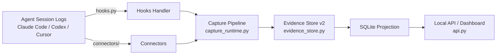
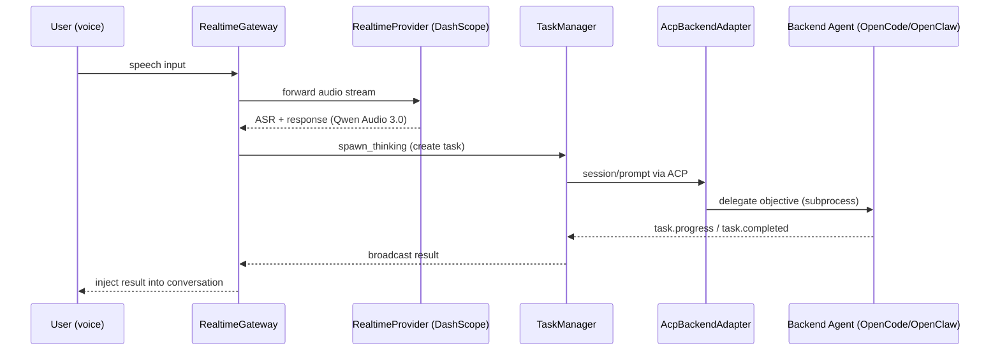

```mermaid
flowchart LR
    CLI["CLI<br/>cli.ts"] --> Runner["WorkflowRunner<br/>workflow-runner.ts"]
    Runner --> WF["workflow&#40;&#41;<br/>workflow.ts"]
    WF --> Phase["phase&#40;&#41;<br/>phase.ts"]
    Phase --> AgentCall["agent&#40;&#41; / bindAgent&#40;&#41;<br/>agent.ts"]
    AgentCall --> Codex["CodexAgent<br/>codex-agent.ts"]
    AgentCall --> Claude["ClaudeAgent<br/>claude-agent.ts"]
    WF --> Emitter["WorkflowEventEmitter<br/>emitter.ts"]
    Emitter --> TUI["TUI / JSON Writer<br/>json-writer.ts"]
```

# Weekly Agentic AI Scan — 2026-07-30

**Nguồn dữ liệu:** GitHub REST search API (`search/repositories`), query `agent OR multi-agent OR agentic created:>2026-07-23 stars:>200`, sort theo stars. 6 kết quả thoả điều kiện tạo mới trong 7 ngày qua với >200 stars — không cần fallback sang `pushed:>7d stars:>500`.

## Executive summary

- Tuần này nổi bật là các hệ thống **kết nối agent với môi trường thật** thay vì thêm một framework orchestration mới: quan sát/ghi sổ chi phí agent (`agentacct`), điều phối "code-as-plan" cho agent runtime (`deer-workflow`), và cầu nối voice-realtime ↔ coding agent qua Agent Client Protocol (`qwen-audio-agent`).
- 3/6 repo pass relevance filter; 3 repo bị loại: `ponytail-improved` (prompt-engineering framework trá hình, tự nhận "không có orchestration engine"), `OptMem` và `deltafin` (không có `/src` hoặc `/docs` chính thức — chỉ là single-script/tools rời rạc).
- Điểm chung đáng chú ý: cả 3 repo còn lại đều tránh tự làm "LLM orchestrator" mà thay vào đó định nghĩa **adapter interface** rõ ràng để cắm agent runtime khác (Codex CLI, Claude Code, OpenCode/OpenClaw/Qoder) — dấu hiệu hệ sinh thái đang chuẩn hoá quanh interoperability hơn là xây thêm framework độc quyền.

## Table of contents

1. [agentacct](#agentacct)
2. [deer-workflow](#deer-workflow)
3. [qwen-audio-agent](#qwen-audio-agent)

---

## agentacct

**Repo:** [mikehasa/agentacct](https://github.com/mikehasa/agentacct)

### §1 — Quick context

Dashboard local-first theo dõi hoạt động, chi phí và token usage của coding agent, không cần đăng nhập. Tech stack core: Python ≥3.11, FastAPI + uvicorn (dashboard/API cục bộ tại `127.0.0.1:8765`), Typer + Rich (CLI), Pydantic (schema), httpx, PyYAML, psutil — theo `pyproject.toml`. Repo health: 532 stars, MIT license, CI workflow hiện diện (`.github/workflows/`), có `/tests`; số contributor và ngày commit cuối không xác định từ nội dung đã fetch được.

### §2 — Architecture deep-dive

**A. Component inventory**
- Hooks handler (`src/agentacct/hooks.py`) — convert payload hook của Claude Code/Codex/Cursor thành evidence, không tự bịa usage/cost.
- Connectors (`src/agentacct/connectors/`) — adapter đọc session store riêng của từng client (Claude Code JSONL, Codex SQLite/JSONL, Hermes state.db, OpenCode SQLite, OpenClaw JSONL, Cursor VSCode storage).
- MCP server (`src/agentacct/mcp.py`) — expose tool để agent tự ghi checkpoint/note.
- Capture pipeline (`src/agentacct/capture/`, `capture_runtime.py`).
- Evidence store v2 (`src/agentacct/evidence.py`, `evidence_store.py`, `evidence_runtime.py`) — envelope chuẩn hoá, append-only.
- Usage/cost engine (`src/agentacct/usage_cube.py`, `cost.py`, `pricing_catalog.py`).
- Control plane (`src/agentacct/control_plane.py`, `supervisor.py`, `runner.py`) — theo dõi task/attempt.
- Policy enforcement (`src/agentacct/policy.py`, `source_policy.py`) — chặn adapter tự cấp quyền ngoài phạm vi khai báo.
- Local API/dashboard (`src/agentacct/api.py`, `control_web.py`).

**B. Control flow — Event-sourcing / pipeline pattern**, không phải ReAct hay planner-executor vì agentacct không tự gọi LLM:
1. Hoạt động agent phát ra tín hiệu thô từ nhiều nguồn (session log, host hook, MCP work event, OTLP, Git/CI).
2. Mỗi nguồn được adapter tương ứng chuẩn hoá thành `EvidenceEnvelope v2` (đã redact/allowlist theo threat model riêng).
3. Envelope được append vào "raw spool" bất biến (`evidence-v2/`) — sửa lỗi bằng cách ghi đè bản mới, không xoá bản cũ.
4. Một SQLite projection index hoá spool để query nhanh mà không cần replay toàn bộ.
5. Projection nuôi work graph, evidence matrix, discrepancy report, phân tích cost/outcome.
6. Local API (`api.py`) đọc projection/report để phục vụ dashboard.

**C. State & data flow**: format dữ liệu là JSONL (ledger v1 `events.jsonl`) và object `EvidenceEnvelope v2`. Storage: local file + append-only raw spool + SQLite projection phái sinh, cộng thêm lane `evidence-v2/refreshable-usage.jsonl` được gate riêng. Không có context-window management vì agentacct không tự gọi model.

**D. Tool/capability integration**: 4 tier tích hợp — (1) MCP tool để agent tự ghi; (2) import log cục bộ qua `connectors/`; (3) mechanical hook capture (`hooks.py`) cho Claude Code/Codex/Cursor; (4) provider/API proxy để enforce budget. Cài đặt cho Claude Code cần đăng ký `.mcp.json` và chạy `agentacct hooks claude-code install`, lệnh này merge một `SessionStart` hook vào `.claude/settings.local.json` của người dùng — đây là cơ chế tích hợp hợp lệ của chính công cụ (không phải chỉ thị nhắm vào agent nghiên cứu), nhưng đáng lưu ý vì là loại tool tự động sửa file cấu hình agent khác.

**E. Memory architecture**: không áp dụng — "Task"/evidence store là sổ sách kế toán, không phải bộ nhớ hội thoại.

**F. Model orchestration**: N/A — README liệt kê rõ "Explicit Non-Goals" gồm việc không gọi API trả phí; agentacct chỉ quan sát log của agent khác.

**G. Observability & eval**: chính bản thân pipeline evidence (mục B/C) là cơ chế observability. Có confidence labeling (`exact/high/medium/low`, `confidence.py`) làm cơ chế epistemic cốt lõi, và outcome verification tách biệt với đánh giá chủ quan (`outcome.py`, `task_outcome.py`, `docs/task-control-plane.md`). Có smoke-test doc (`docs/live-agent-smoke.md`, `agent_smoke.py`).

**H. Extension points**: `integrations/hermes/agentacct-workflow/SKILL.md` minh hoạ pattern plugin cho agent bên thứ ba (Hermes) ghi work qua MCP theo quy trình 7 bước. Client integration mới đi theo connector pattern trong `connectors/`, bị gate bởi `source_policy.py` để adapter không tự cấp quyền vượt phạm vi khai báo.

### §3 — Architecture diagram

### §4 — Verdict

Điểm đáng học nhất không phải là AI mà là **kỹ thuật evidence pipeline**: append-only spool + envelope chuẩn hoá + confidence labeling để tránh agent "tự khai" outcome — một pattern audit-log đáng tham khảo cho bất kỳ hệ multi-agent nào cần accountability. Red flag: tài liệu tự nhận số liệu cost là *estimate* dựa trên pricing catalog tĩnh, dễ lệch khi provider đổi giá; cũng chưa rõ cơ chế xử lý conflict khi nhiều connector cùng ghi một session. Open question: cơ chế policy gating (`source_policy.py`) có compile-time hay chỉ runtime check — cần đọc trực tiếp file này để xác nhận.

---

## deer-workflow

**Repo:** [deerwork-ai/deer-workflow](https://github.com/deerwork-ai/deer-workflow)

### §1 — Quick context

Runtime "Graph Engineering": giữ control flow trong TypeScript có thể review được, giao việc semantic cho agent runtime có thể thay thế (mặc định Codex CLI, có sẵn adapter Claude Code). Tech stack core: TypeScript chạy trên Bun, ESLint/Prettier/Husky, publish npm `@deerwork-ai/deer-workflow`. Repo health: 349 stars, 27 forks, 44 commit trên main, có `.github/workflows/` (CI) và `/tests`; số contributor không xác định từ nội dung đã fetch.

### §2 — Architecture deep-dive

**A. Component inventory**
- Workflow entrypoint (`src/flow/workflow.ts`) — load module workflow, quản lý nesting depth, emit `workflow:start/end/error`.
- Phase tracker (`src/flow/phase.ts`) — `phase()`, `getCurrentPhase()`, `endCurrentPhase()`.
- Parallel/pipeline primitives (`src/flow/parallel.ts`, `src/flow/pipeline.ts`).
- Execution context (`src/flow/context.ts`, `src/flow/types.ts`) — async-local context, không phải global DI.
- Agent adapter interface (`src/agents/agent.ts` — `bindAgent()`; `src/agents/types.ts` — interface `Agent`).
- Agent runtime cụ thể: `src/agents/codex-agent.ts` (subprocess Codex CLI), `src/agents/claude-agent.ts` (Claude Code adapter).
- Runner (`src/runner/workflow-runner.ts` — `WorkflowRunner.run()`).
- Event system (`src/events/emitter.ts` — `WorkflowEventEmitter`; `src/events/json-writer.ts`).
- TUI (`src/tui/`), CLI (`src/cli.ts`).
- Skill scaffold workflow bằng ngôn ngữ tự nhiên (`skills/workflow-creator/SKILL.md`).

**B. Control flow — Graph/phase-based, imperative-code pattern** (không phải ReAct loop, không phải planner-executor tự động — người viết workflow chủ động code control flow):
1. CLI gọi `WorkflowRunner.run(target, args)`.
2. Runner thiết lập event-emitter + log-sink trong async context, gọi `workflow()`.
3. `workflow()` load module target, validate `meta` tuỳ chọn, emit `workflow:start`.
4. Handler thực thi, gọi `phase()` để đánh dấu giai đoạn, gọi `agent()`/`parallel()` để giao việc semantic, emit `workflow:phase:start/end`.
5. Mỗi lời gọi `agent()` resolve qua `bindAgent()` → `Agent.run()` cụ thể (Codex hoặc Claude).
6. `workflow()` emit `workflow:end` (hoặc `workflow:error`) kèm duration; Runner trả kết quả cuối.

**C. State & data flow**: state là `WorkflowExecutionContext` có kiểu (`id`, `parentId`, `depth`, `scriptPath`, `args`, `phase`) giữ trong async-local context. Dữ liệu giữa các node truyền qua giá trị TypeScript/JSON thông thường; output agent được validate bằng JSON Schema truyền trong `AgentOptions` (thấy ở flag `--output-schema` của `codex-agent.ts` và ví dụ `researchFindingSchema` trong `examples/deep-research/workflow.ts`). Event được stream qua `WorkflowEventEmitter.emit()`, đóng dấu `sequence` đơn điệu và `timestamp` ISO trên object đã freeze.

**D. Tool/capability integration**: interface `Agent` vendor-neutral (`src/agents/types.ts`): `run<TOutput=string>(prompt, options?): Promise<TOutput>`. `codex-agent.ts` gọi Codex qua **subprocess** bằng `Bun.spawn`, build command dạng `[codex, ...args, "exec", "--output-last-message", outputPath, "--sandbox", ..., "--output-schema", ...]`, pipe prompt qua stdin, hỗ trợ huỷ bằng `AbortSignal`, ném `CodexCliNotFoundError` nếu không tìm thấy binary qua `Bun.which()`. Không dùng function-calling native hay MCP ở layer này — giao tiếp là CLI subprocess + JSON Schema output.

**E. Memory architecture**: không có evidence — không tìm thấy module memory/vector-store trong `src/`.

**F. Model orchestration**: người viết workflow chọn tường minh agent runtime nào chạy node nào qua `bindAgent()`, không có auto-router hay fallback tự động trong code đã fetch. Parallelism tường minh qua `parallel()`: chạy tất cả task ngay lập tức, giữ thứ tự output, task lỗi trả về `null` mà không huỷ các task khác.

**G. Observability & eval**: JSON Lines event stream là cơ chế cốt lõi (`WorkflowEventEmitter` + `json-writer.ts`) — khi stderr bị redirect thì emit JSON Line event, ngược lại TUI (`src/tui/`) hiển thị tiến trình trực tiếp. `skills/workflow-creator/evals/` gợi ý có eval harness cho skill scaffold, nhưng không tìm thấy replay-engine riêng.

**H. Extension points**: workflow mới là module TypeScript export handler mặc định + `meta` tuỳ chọn (name, description, phases, exampleArgs), được validate trong `workflow.ts`. Lệnh `deer-workflow create "<mô tả>" > workflow.ts` dùng `skills/workflow-creator/SKILL.md` để scaffold bằng ngôn ngữ tự nhiên. Ví dụ thực tế: `examples/deep-research/workflow.ts` với các phase Discover→Plan→Research→Synthesis→Present, dùng `phase()`, `agent()` kèm schema, và `parallel()` cho nhiều hướng nghiên cứu song song.

### §3 — Architecture diagram

### §4 — Verdict

Điểm novel: triết lý "code is the plan" — thay vì để LLM tự plan bằng prompt, control flow (phase, parallel, retry, error handling) nằm hẳn trong TypeScript review được, còn LLM chỉ là "hàm" thay thế được qua interface `Agent` thống nhất. Đây là hướng đối lập rõ rệt với trào lưu graph-orchestration kiểu LangGraph nơi graph structure cũng do LLM/config điều khiển. Red flag: chưa thấy cơ chế retry/circuit-breaker khi subprocess Codex/Claude crash giữa chừng, và memory/state cross-run gần như không tồn tại (mỗi workflow run độc lập). Open question: `claude-agent.ts` chưa được đọc trực tiếp — cần xác nhận nó gọi Claude Code qua subprocess CLI hay qua Agent SDK để so sánh độ ổn định với adapter Codex.

---

## qwen-audio-agent

**Repo:** [QwenAudio/qwen-audio-agent](https://github.com/QwenAudio/qwen-audio-agent)

### §1 — Quick context

Realtime voice runtime giữ agent "vừa nói chuyện vừa làm việc": hội thoại full-duplex không bị chặn khi backend coding agent (OpenCode/OpenClaw/Qoder...) chạy task nền. Tech stack core: Node.js ≥22.22.2 (ESM), Express 4.22.2, `ws` 8.21.1, `@modelcontextprotocol/sdk` 1.29.0, `@agent-client-protocol` SDK 1.3.0, npm workspaces (server/web/tui/desktop/cli), model Qwen Audio 3.0 Realtime qua DashScope. Repo health: 227 stars, 17 forks, Apache-2.0, commit gần nhất cùng ngày fetch (2026-07-30), một contributor chính (`x-lixu`) quan sát được; không thấy CI workflow badge trong nội dung đã fetch.

### §2 — Architecture deep-dive

**A. Component inventory**
- Realtime voice gateway (`server/src/voice/realtime-gateway.mjs`, export `attachRealtimeGateway`) — WebSocket, giao tiếp trực tiếp với model.
- Realtime provider (`server/src/voice/realtime-provider.mjs`) — abstraction kết nối model, export `createRealtimeFrontend`.
- Reconnect/backoff (`server/src/voice/reconnect-backoff.mjs`, class `ReconnectBackoff`).
- Task engine (`server/src/task/task-manager.mjs` — class `TaskManager`; `task-scheduler.mjs`, `task-store.mjs`).
- ACP backend adapter (`server/src/agent/acp-backend-adapter.mjs`, class `AcpBackendAdapter`) — implement thao tác `session/new`, `session/resume`, `session/prompt`, `session/cancel`.
- ACP process client (`server/src/agent/acp-process-client.mjs`) — transport subprocess tới backend agent.
- Coordinator (`server/src/agent/coordinator.mjs`); OpenClaw adapter riêng (`openclaw-adapter.mjs`).
- Shared protocol (`shared/realtime-events.mjs` — `GatewayClientEvent`/`GatewayServerEvent`/`GatewayTaskEvent`; `shared/backend-catalog.mjs`).
- Frontend: CLI (`cli/bin/qwenaudio.mjs`), TUI (`tui/`), Web UI (workspace `web`), desktop widget macOS (workspace `desktop`).

**B. Control flow — Event-driven kèm state machine cho task nền**:
1. Người dùng nói, ASR hoàn tất trong `realtime-gateway.mjs`.
2. Nếu trả lời được ngay, Realtime model (Qwen Audio 3.0 qua `realtime-provider.mjs`) phản hồi trực tiếp — không cần backend.
3. Nếu cần xử lý sâu, tool `spawn_thinking` tạo task trong `TaskManager`, xếp hàng FIFO — hội thoại thoại không bị block.
4. `AcpBackendAdapter` mở/resume session bền vững (`qwen-audio-agent:<owner>:backend`), gửi objective qua ACP `session/prompt` tới backend agent.
5. Backend chạy (state `running` → có thể `delegated` → `finalizing`), phát event `task.progress`/`task.delegated` mà `TaskManager` broadcast lại.
6. Khi xong, kết quả tự động "quay lại" ngữ cảnh hội thoại đang sống; state chuyển `completed`/`failed`/`cancelled`.

**C. State & data flow**: giao tiếp frontend↔gateway↔backend dùng protocol enum-based định nghĩa trong `shared/realtime-events.mjs` (không dùng schema library như zod/protobuf, nhưng có tập hằng số + validation Set rõ ràng). Session/context lưu local-first tại `~/.config/qwaudio/` dưới dạng file JSON (`USER.md`, `frontend-memory.json`, `tasks.json`), không có database chung. Task state persist qua `TaskStore` (`task-store.mjs`).

**D. Tool/capability integration**: ACP (Agent Client Protocol) là interface thật trong repo, không chỉ nhắc tên — `AcpBackendAdapter` implement các thao tác session-lifecycle và giao tiếp qua `AcpProcessClient` (subprocess). Backend không native (Claude Code, Codex) dùng adapter riêng; agent stdio bất kỳ tương thích ACP có thể cắm zero-code qua biến môi trường `ACP_COMMAND`.

**E. Memory architecture**: có 2 tầng — file cục bộ (`USER.md` sở thích/vị trí/dự án, `frontend-memory.json` fact do người dùng yêu cầu nhớ, `tasks.json` kết quả/thông báo), không commit vào VCS; và tool `user_memory` ở tầng Realtime với op `recall/remember/replace/forget` (theo `docs/architecture.md`). File implement chính xác cho đọc/ghi memory không xác định từ code đã fetch.

**F. Model orchestration**: chỉ một model — Qwen Audio 3.0 Realtime qua DashScope, gọi qua `createRealtimeFrontend`. Độ tin cậy dựa vào watchdog timeout (`RESPONSE_START_WATCHDOG_MS=12000`) và `ReconnectBackoff` exponential backoff để reconnect cùng provider — không có fallback sang model khác.

**G. Observability & eval**: không tìm thấy framework logging/tracing có cấu trúc (không OpenTelemetry/Langfuse). `TaskManager` emit lifecycle event có kiểu tới listener nội bộ (`subscribe()`); gateway log message khôi phục bằng tiếng Trung cho người dùng khi watchdog timeout. Không có eval harness riêng được tìm thấy.

**H. Extension points**: backend agent mới tích hợp qua ACP — hoặc thêm native adapter trong `server/src/agent/backends/` (thư mục tồn tại nhưng chưa liệt kê chi tiết) và đăng ký ở `shared/backend-catalog.mjs`, hoặc tích hợp zero-code cho bất kỳ agent stdio tương thích ACP nào qua biến môi trường `ACP_COMMAND`.

### §3 — Architecture diagram

### §4 — Verdict

Điểm novel cụ thể: tách rõ "conversational foreground" (Realtime model trả lời tức thì) khỏi "work background" (backend agent qua ACP), cho phép người dùng tiếp tục nói chuyện trong khi task nền chạy — pattern hữu ích cho bất kỳ voice-first agent nào cần latency thấp nhưng vẫn giao được việc nặng. Việc dùng ACP thật (không phải tự chế protocol) để cắm nhiều backend (OpenCode/OpenClaw/Qoder) qua cùng một interface cũng đáng học. Red flag: không có fallback model khi DashScope down (chỉ reconnect cùng provider), không có structured tracing, và cơ chế memory (`user_memory` tool) chưa rõ implementation — cần đọc `server/src/core/` sâu hơn. Open question: cơ chế xung đột khi nhiều task nền cùng ghi vào `frontend-memory.json`.
