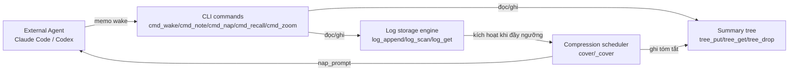
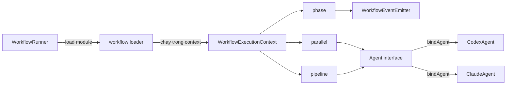
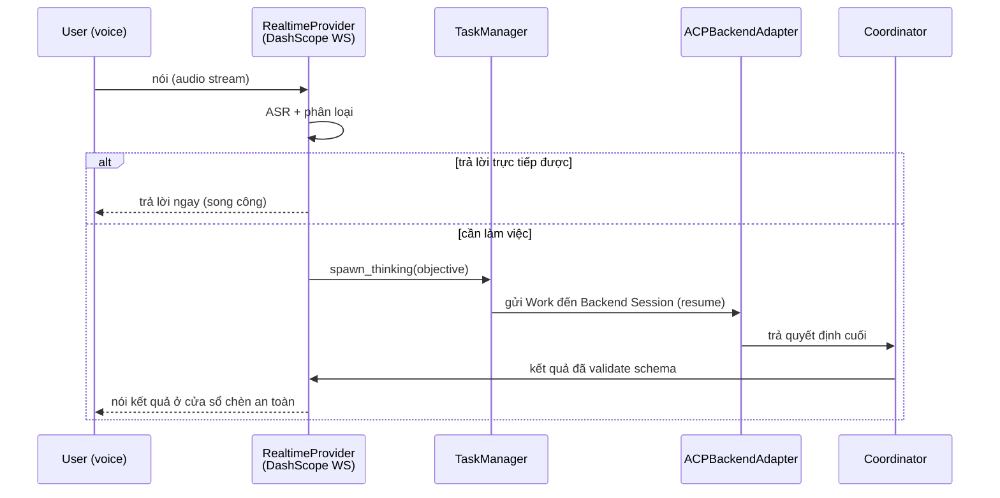

# Weekly Agentic AI Architecture Scan — 2026-07-31

**Phạm vi:** repos publish/update đáng kể trong 24/07 – 31/07/2026 (7 ngày), `agent`/`multi-agent`/`agentic`, `stars > 200`.

## Executive Summary

- Pool ứng viên tuần này rất mỏng: query `created:>7d stars:>200` chỉ trả về **5 repo**, mở rộng thêm các từ khóa liên quan (`ai agent`, `llm agent`, `orchestrator`, `swarm`) không tìm thêm repo nào ngoài 3 repo dưới ngưỡng stars. Sau relevance filter, còn lại **3 repo đạt chuẩn deep-dive**: `OptMem`, `deer-workflow`, `qwen-audio-agent`.
- Điểm chung: cả 3 đều né framework nặng (LangChain/LangGraph/CrewAI) — `OptMem` là Python thuần chuẩn thư viện (zero-dependency), `deer-workflow` chọn "async/await của TypeScript chính là graph" thay vì DAG engine riêng, `qwen-audio-agent` dùng chuẩn mở ACP + MCP thay vì SDK độc quyền.
- 2 repo bị loại minh họa đúng ranh giới lọc của tuần: `deltafin` (Kimi K3 local inference server) là serving engine thuần túy, không có orchestration; `ponytail-improved` là prompt-rule wrapper đóng gói lại 10 lần cho nhiều platform, và có red flag — thư mục "skill" chứa file `.exe`/`.dll` lạ, không giải thích được trong README.

## Mục lục

1. [OptMem](#1-optmem)
2. [deer-workflow](#2-deer-workflow)
3. [qwen-audio-agent](#3-qwen-audio-agent)
4. [Repo bị loại](#repo-bị-loại)

**Ghi chú phương pháp:** GitHub access của session này bị scope về đúng 1 repo (`undertheseanlp/underthesea`) nên không dùng được `gh api`/GitHub MCP để search toàn GitHub. Thay vào đó, dữ liệu search lấy qua GitHub public REST search API (`api.github.com/search/repositories`, không auth) và README/source code lấy qua `raw.githubusercontent.com` — cùng nguồn dữ liệu, khác đường vào.

---

## 1. OptMem

`https://github.com/VictorTaelin/OptMem`

### §1 — Quick Context

Bộ nhớ dài hạn cho AI coding agent, không cần LLM call, chỉ 1 CLI script + 1 prompt 426 token. Tech stack: Python 3 thuần stdlib (không dependency nào), storage là flat file (`LOG.txt`, `TREE/<size>`) trên đĩa, không gọi model nào — "model" chính là agent bên ngoài (Claude Code, Codex...) gọi `memo` qua shell. Repo health: 938 sao, 54 fork, tạo 25/07/2026, push gần nhất 31/07/2026 (rất active), 0 open issue. Có bộ test thật (`test.py`, 614 dòng, invariant-check tự viết) nhưng **không có CI workflow** và **không có LICENSE file**.

### §2 — Architecture Deep-Dive

**A. Component inventory** (toàn bộ nằm trong 1 file `memo`, 859 dòng):
- `log_append()` / `log_scan()` / `log_get()` (`memo:140-350`) — storage engine dạng append-only log, record cố định 320 byte.
- `cover()` / `_cover()` (`memo:82-131`) — scheduler quyết định vùng nhớ nào cần nén, dùng binary search 60 vòng lặp trên tỉ lệ nén `alpha`.
- `tree_put()` / `tree_get()` / `tree_drop()` (`memo:279-389`) — cây tổng hợp (summary tree) lưu record cố định 288 byte theo khối lũy thừa 2.
- `cmd_wake` / `cmd_note` / `cmd_nap` / `cmd_recall` / `cmd_zoom` / `cmd_forget` (`memo:545-823`) — 8 lệnh CLI, đóng vai trò "API" duy nhất mà agent bên ngoài gọi vào.
- `locked()` (`memo:302-332`) — advisory file lock (fcntl/msvcrt) chống race khi nhiều session cùng ghi.

Không có planner, executor, evaluator, router hay tool registry — các vai trò đó thuộc về agent gọi `memo`, không nằm trong repo này.

**B. Control flow — không khớp pattern kinh điển nào (không phải ReAct/planner-executor/supervisor-worker).** `memo` là **CLI stateless được agent ngoài gọi đồng bộ**, tự nó không có vòng lặp agentic. Happy path: (1) agent bắt đầu session, chạy `memo wake` để đọc digest bị giới hạn dung lượng; (2) agent làm việc, gọi `memo note "..."` mỗi khi có gì đáng nhớ; (3) nếu `note` kích hoạt ngưỡng nén, tool trả về `nap_prompt()` yêu cầu agent tự tóm tắt; (4) agent phản hồi bằng `memo nap <lo>-<hi> "
"`; (5) agent có thể `memo recall <regex>` (grep toàn log) hoặc `memo zoom <lo>-<hi>` (drill-down cây tổng hợp) theo nhu cầu; (6) session kết thúc, không có bước đóng tường minh.

**C. State & data flow:** "Message" giữa agent và tool chỉ là text qua stdout/argv, không có schema chuẩn hóa. Storage: 2 flat file mỗi memory store (`LOG.txt` ghi thô, `TREE/<size>` chứa tóm tắt). Context-window management là trọng tâm thiết kế: `WAKE_LINES` (mặc định 96 dòng, ~8k token) giới hạn output của `wake`; entry gần đây giữ nguyên văn, entry cũ bị nén dần qua merge-tree; output còn được `paginate()` (`memo:569-581`) để né giới hạn cắt bớt output đặc thù của từng harness (Claude Code cắt giữa ở 30k ký tự, "pi" cắt đầu ở 50KB/2000 dòng, Codex cắt ở 10k token — cả 3 con số này được hard-code theo tên harness).

**D. Tool/capability integration:** Không áp dụng — `memo` chính là tool được tích hợp vào agent chủ qua shell/CLI (chỉ ở mức quy ước trong prompt, không có schema function-calling hay MCP nào trong code).

**E. Memory architecture (trọng tâm của repo):** Short-term = log thô gần hiện tại (nguyên văn, tối đa 280 byte/dòng). Long-term/compaction = cây merge nhị phân trên các khối lũy thừa 2, `_cover()` tự tìm tiling thô nhất vẫn đạt tỉ lệ nén `alpha` mong muốn. Việc tóm tắt được **giao hẳn cho LLM đang gọi tool** — `memo` không bao giờ tự gọi model, chỉ sinh prompt `nap_prompt()` rồi nhận lại text tóm tắt qua `memo nap`. Retrieval có 3 cơ chế: quét gần đây có phân trang (`wake`), full-text regex streaming (`recall`, không load hết vào RAM), và điều hướng cây có cấu trúc (`zoom`). `forget` cho phép bỏ 1 tóm tắt sai mà không đụng vào log gốc.

**F–H:** Không gọi model nào trong code nên không có model orchestration/fallback. Observability chỉ có bộ test độc lập (614 dòng, chưa nối CI). Extension point: biến môi trường `MEMORY_DIR`, file `config` override các ngưỡng (`WAKE_LINES`, `ENTRY_CHARS`...), lệnh `import` để nạp lịch sử cũ.

### §3 — Architecture Diagram

### §4 — Verdict

**Novel:** cơ chế `cover()`/`_cover()` biến "nén bao nhiêu" thành 1 tham số binary-search thay vì heuristic thủ công, và code ghi rõ đã test với 3 kiểu cắt output khác nhau của 3 harness thật. Giao việc tóm tắt cho chính LLM đang gọi (không tự embed 1 model) giữ tool zero-dependency, vendor-agnostic — hợp lý với pitch "outlives every model change". Fixed-width record đổi disk lấy random-seek O(1) là trade-off được document rõ.

**Red flag:** không có LICENSE, không có CI dù có test suite thật; repo mới 6 ngày, 1 tác giả — độ tin cậy dài hạn chưa kiểm chứng dù stars cao. Không phải agent framework — ai kỳ vọng planner/executor sẽ không thấy gì ở đây.

**Câu hỏi mở:** chất lượng nén được test bằng compressor giả (join+truncate), chưa rõ hiệu quả với LLM tóm tắt thật; dùng `MEMORY_DIR` share qua nhiều máy có bị lock contention không thì chưa kiểm chứng.

---

## 2. deer-workflow

`https://github.com/deerwork-ai/deer-workflow`

### §1 — Quick Context

Thư viện TypeScript viết agent orchestration bằng async/await thuần, chỉ giao phần "semantic" cho 1 coding-agent runtime cắm được (mặc định Codex CLI, có sẵn Claude Code). Tech stack: TypeScript 100%, Bun runtime/test-runner, **zero runtime dependency** (không LangChain/Express nào) — gọi model qua `Bun.spawn` shell ra CLI agent, không qua SDK. Repo health: 359 sao, 27 fork, MIT license, commit gần như hàng ngày, gần nhất 27/07/2026. Có `tests/` thật (soi theo cấu trúc `src/`) và script `check` (test + typecheck + lint) nối Husky pre-commit, nhưng chỉ tìm thấy 1 CI workflow là publish-package, **không có bằng chứng CI chạy test**.

### §2 — Architecture Deep-Dive

**A. Component inventory:**
- `workflow()` (`src/flow/workflow.ts`) — load & chạy 1 workflow module, validate metadata, giới hạn độ sâu lồng nhau (`MAX_NESTED_WORKFLOW_DEPTH = 1`).
- `WorkflowExecutionContext` (`src/flow/types.ts`) — state object per-run (id, parentId, depth, phase...).
- `phase()` (`src/flow/phase.ts`) — đánh dấu checkpoint, phát event `workflow:phase:start/end`.
- `parallel()` (`src/flow/parallel.ts`) — fan-out/fan-in, có barrier (`Promise.all`), task lỗi trả về `null` thay vì reject cả nhóm.
- `pipeline()` (`src/flow/pipeline.ts`) — chuỗi stage tuần tự độc lập theo từng item, không có barrier toàn cục.
- `Agent` interface / `bindAgent()` (`src/agents/agent.ts`) — hợp đồng vendor-neutral `run(prompt, options) => Promise<TOutput>`.
- `CodexAgent`, `ClaudeAgent` (`src/agents/codex-agent.ts`, `claude-agent.ts`) — runtime cụ thể, spawn subprocess CLI (`Bun.spawn`).
- `WorkflowRunner` (`src/runner/workflow-runner.ts`) — entry point chương trình hóa, gắn event emitter + log sink quanh `workflow()`.
- `WorkflowEventEmitter` (`src/events/emitter.ts`) — pub/sub đồng bộ có sequence number + timestamp.

**B. Control flow — KHÔNG phải graph/DAG engine kiểu LangGraph.** Không có cấu trúc node/edge, không có bước compile, không có scheduler duyệt graph. "Graph" ở đây thực chất là **call graph của code TypeScript**, với `phase`/`parallel`/`pipeline` là 3 primitive tổ hợp được, cộng `AsyncLocalStorage` giữ execution context. Happy path: (1) CLI hoặc `WorkflowRunner.run()` gọi `workflow()` load module; (2) `loadWorkflowDefinition` dynamic `import()` và validate `WorkflowMeta`; (3) handler chạy trong `runInWorkflowContext`, gọi `phase()` để đánh dấu tiến độ và `agent()`/`parallel()`/`pipeline()` để thực thi; (4) mỗi `agent()` bind vào 1 runtime (Codex/Claude), spawn subprocess, trả text hoặc JSON đã validate theo schema; (5) `phase`/`log` phát event đồng bộ qua `WorkflowEventEmitter`; (6) JSON writer stream event ra JSONL, hoặc TUI render live.

**C. State & data flow:** State sống trong `WorkflowExecutionContext` in-memory, truyền qua `AsyncLocalStorage` của Node — không có store ngoài, không checkpoint/persist. "Message" giữa các bước chỉ là argument/return value TypeScript (typed qua generic), không có schema message chuẩn hóa. Không có cơ chế quản lý context-window nào trong thư viện — mỗi `agent()` nhận đúng prompt string do người viết workflow tự soạn.

**D. Tool/capability integration:** Đơn vị cắm được là **Agent, không phải tool** — extension point là interface `Agent.run()`. Invocation qua subprocess (`Bun.spawn`, pipe stdin/stdout); sandbox (`"read-only" | "workspace-write" | "danger-full-access"`) truyền qua flag `--sandbox` cho CLI bên dưới xử lý — **deer-workflow không tự enforce sandbox**. Output ràng buộc schema qua `JsonSchema`, validate khi nhận về, ném `CodexAgentError` nếu JSON không hợp lệ.

**E. Memory:** không có bằng chứng — không vector store, không module tóm tắt, không abstraction bộ nhớ dài hạn nào trong `src/`.

**F. Model orchestration:** không có router/fallback đa model; chọn model chỉ là 1 string passthrough (`AgentOptions.model`) cho CLI dưới xử lý. Không có batching/parallel-model ngoài primitive `parallel()` chung.

**G. Observability:** chỉ có event system tự viết (`WorkflowEventEmitter`, JSONL streaming), tài liệu tự nhận "7 loại event". Không tích hợp OpenTelemetry/Langfuse.

**H. Extension points:** implement interface `Agent` cho runtime mới; subscribe `WorkflowRunner.on()` cho sink event tùy biến; viết workflow module mới export `WorkflowMeta` + handler; có sẵn skill `workflow-creator` cài vào `~/.claude/skills` để agent tự scaffold workflow mới.

### §3 — Architecture Diagram

### §4 — Verdict

**Novel:** đảo ngược mô hình LangGraph — thay vì DSL đồ thị riêng, dùng thẳng async/await của ngôn ngữ chủ làm "graph", với `phase`/`parallel`/`pipeline` (`src/flow/*.ts`) là helper mỏng, typed rõ, cô lập lỗi theo từng item (`parallel`/`pipeline` item lỗi trả `null` thay vì abort cả nhóm). Zero runtime dependency và gọi agent qua subprocess (`Bun.spawn`) là lựa chọn thiết kế đáng chú ý — đổi lấy đơn giản/dễ review thay vì có graph-compiler/scheduler thật.

**Red flag:** tên "graph engineering runtime" hơi thổi phồng — về cấu trúc chỉ là async code có tổ chức, không có state persist/checkpoint. Sandbox hoàn toàn giao cho CLI bên dưới. Chỉ tìm thấy 1 CI workflow (publish), chưa thấy CI chạy test. Giới hạn cứng độ sâu lồng nhau = 1 giới hạn khả năng compose.

**Câu hỏi mở:** số lượng contributor thật (trang graphs/contributors không load được), có CI test ở nơi khác trong `.github/` không, chi tiết implementation của TUI chưa được đọc.

---

## 3. qwen-audio-agent

`https://github.com/QwenAudio/qwen-audio-agent`

### §1 — Quick Context

Voice runtime realtime, song công (full-duplex), đứng trước các coding/tool agent tương thích ACP (OpenCode, OpenClaw, Qoder, Kimi Code, Claude Code, Codex) — người dùng nói chuyện liên tục trong khi 1 Backend Agent Session bền vững làm việc nền. Tech stack: Node.js (ESM, engine ^22/^24), npm workspaces (server/web/tui/desktop/cli); deps chính: `@agentclientprotocol/sdk` (ACP), `@modelcontextprotocol/sdk` (MCP), `ws`, `zod`. Model realtime là DashScope `qwen-audio-3.0-realtime-plus` qua WebSocket. Repo health: 469 sao, Apache-2.0, CI thật (`.github/workflows/ci.yml`, matrix ubuntu/macos/windows × Node 22/24, chạy `npm test` + build + verify).

### §2 — Architecture Deep-Dive

**A. Component inventory:**
- `RealtimeGateway` (`server/src/voice/realtime-gateway.mjs`) — gateway WebSocket xử lý phiên thoại song công.
- `RealtimeProvider` (`server/src/voice/realtime-provider.mjs`) — bọc kết nối WS DashScope, định nghĩa 6 tool phía frontend (`spawn_thinking`, `cancel_agent_task`, `get_agent_task_status`, `get_current_time`, `user_memory`, `respond_agent_permission`).
- `Coordinator` (`server/src/agent/coordinator.mjs`) — validate/chuẩn hóa quyết định cuối của backend Agent theo schema chặt `COORDINATOR_DECISION_SCHEMA`.
- `ACPBackendAdapter` / `ACPSessionRegistry` (`server/src/agent/acp-*.mjs`) — client giao thức ACP, quản lý Session bền vững theo owner+backend.
- `TaskManager`/`TaskStore` (`server/src/task/*.mjs`) — vòng đời Work item (queued→running→delegated→...→completed).
- `FrontendAgentContext` (`server/src/conversation/frontend-agent-context.mjs`) — dựng system prompt/context cho model realtime.
- `ManagedBackend` (`server/src/process/managed-backend.mjs`) — spawn/giám sát tiến trình con Backend Agent.

**B. Control flow — "Gateway-queued handoff với 1 coordinator Session bền vững"** (state-machine kết hợp async delegation, không phải ReAct kinh điển). Happy path (theo `docs/architecture.md`): (1) người dùng nói, kết quả ASR cuối được phân loại trả lời-trực-tiếp-được hay cần-làm-việc; (2) nếu trả lời được, model realtime tự trả lời song công, không chạm backend; (3) nếu cần làm việc, realtime gọi `spawn_thinking(objective)` non-blocking — tạo 1 Work record, xếp hàng FIFO theo owner, hội thoại tiếp tục; (4) đúng 1 Work/owner được gửi tới Backend Agent Session cố định (resume qua ACP `session/resume`) — backend tự quyết chiến lược thực thi (tool/subagent là chuyện riêng của backend); (5) backend trả về đúng 1 quyết định cuối, validate bởi `COORDINATOR_DECISION_SCHEMA`; (6) kết quả được chèn vào ngữ cảnh model realtime và nói ra ở "cửa sổ chèn an toàn" (chờ nếu user đang nói dở), đánh dấu delivered chỉ sau khi phát xong.

**C. State & data flow:** Work state là FSM tường minh (`queued → running → completed`, nhánh `delegated → finalizing`, `cancelling → cancelled/failed`). Dữ liệu giữa các lớp là JSON có schema (`zod`), state nằm in-memory (`task-store.mjs`) — **không có bằng chứng DB ngoài**, Work đang chạy không resume được sau khi Gateway restart. Tiến độ backend chiếu qua ACP `session/update` thành các câu "activity" bị giới hạn/redact (không lộ raw reasoning hay session ID ra UI).

**D. Tool/capability integration:** Tool phía frontend là schema kiểu OpenAI function-calling, đăng ký thẳng trong `realtime-provider.mjs`, cố tình giới hạn chỉ 6 tool. Phía backend, tool được bơm vào dưới dạng MCP server cho các backend chấp nhận (OpenCode, Qoder, Kimi Code — 5 tool điều phối session); riêng OpenClaw dùng Session tool gốc vì từ chối MCP server do client cung cấp. Validate bằng `zod` + JSON Schema (`additionalProperties: false`).

**E. Memory:** Short-term = "recent voice context" gắn theo mỗi envelope gửi backend. Long-term = tool `user_memory` (`recall/remember/replace/forget`) thao tác trên 1 vùng quản lý của file `USER.md`; phần user tự viết ngoài vùng đó là read-only. Không có bằng chứng vector/RAG — chỉ text record bền vững có ID ổn định.

**F. Model orchestration:** Tách rõ 2 vai trò — 1 model realtime (ASR + hội thoại + tool-call nhẹ) độ trễ thấp, và 1 "backend model" cấu hình riêng (`QWEN_AUDIO_AGENT_BACKEND_MODEL`, override theo từng backend) cho việc agentic nặng — nối với nhau bất đồng bộ để model realtime không bao giờ bị block bởi tool execution.

**G. Observability:** Triết lý "Progress is observability, not control" — chỉ lộ tên tool, mức chi tiết giới hạn, trạng thái running/completed; không lộ raw reasoning/session ID. CI chạy test chức năng (`node --test`) trên 3 OS × 2 Node version, nhưng **không tìm thấy** tracing/metrics latency hay eval-harness nào dù đây là sản phẩm realtime.

**H. Extension points:** Backend mới cắm qua driver ở `server/src/agent/backends/` + file config `config/<backend>/workspace/AGENTS.md` (đã có sẵn cho opencode, openclaw, qoder, kimi, codex, claude, hermes, codebuddy) — thêm backend là khai báo config + driver module, không đụng core.

### §3 — Architecture Diagram

### §4 — Verdict

**Novel:** tách bạch rõ ràng giữa "Realtime frontend" (chỉ 6 tool, không tự chọn chiến lược thực thi) và 1 "Backend Agent Session" bền vững tái dùng qua ACP `session/resume` — né được cả việc block kênh thoại khi chờ tool, lẫn việc dựng lại context agent mỗi lượt. Cặp `spawn_thinking`/`get_agent_task_status` cộng "cửa sổ chèn an toàn" để đưa kết quả async vào 1 lượt thoại đang sống là cơ chế cụ thể, có tài liệu, giải quyết đúng bài toán "không nói đè lên người dùng".

**Red flag:** không có bằng chứng Work state bền vững (chỉ in-memory, restart = mất Work đang chạy), không có tracing/latency-metrics chính thức dù giá trị cốt lõi là độ trễ thấp. Nhiều comment/mô tả tool bằng tiếng Trung trong core files gợi ý sản phẩm được test/dùng chủ yếu ở thị trường Trung Quốc.

**Câu hỏi mở:** số liệu latency đo thực tế end-to-end (không tìm thấy trong code đã đọc), độ sâu test coverage thật của `server` test files chưa được soi kỹ, số contributor/thời điểm push chính xác không lấy được do GitHub API bị chặn trong sandbox nghiên cứu.

---

## Repo bị loại

- **`gavamedia/deltafin`** (489 sao) — inference engine chạy Kimi K3 (2.8T param MoE) trên 1 máy, streaming expert từ Hugging Face, có speculative decoding. Code thật, nhiều (`tools/fla/`, `fast_moe.py`, `cuda_moe.py`, `metal_moe.py`, `serve_openai.py`, 80+ test file) — nhưng đây là **serving/runtime engine, không có agent orchestration, planner, hay tool-dispatcher nào**. Loại vì lệch trọng tâm "agentic AI architecture", không phải vì thiếu code.
- **`0xwilliamortiz/ponytail-improved`** (564 sao) — đóng gói 1 bộ rule "lazy senior dev / YAGNI" thành prompt/markdown, lặp lại cho ~10 platform agent khác nhau (`.claude-plugin/`, `.cursor/rules/`, `.windsurf/rules/`...). Phần code thật duy nhất (`ponytail-mcp/index.js`, ~50 dòng) chỉ là wrapper MCP stdio pass-through gọi ra text rule. Loại vì đúng dạng "prompt-engineering framework trá hình". **Red flag phụ:** thư mục `skills/ponytail/` chứa `libcurl.dll` và `vibecodecalc.exe` — file binary Windows không được giải thích, nằm lẫn trong 1 thư mục gọi là "skill" markdown, đáng ngờ và không nên cài mà không kiểm tra kỹ.
