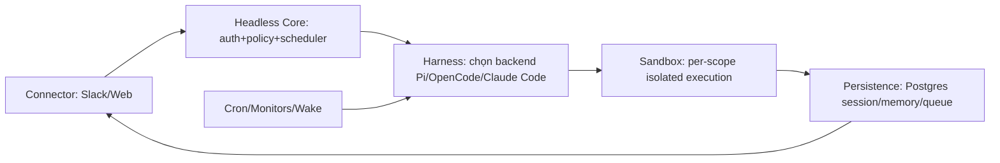
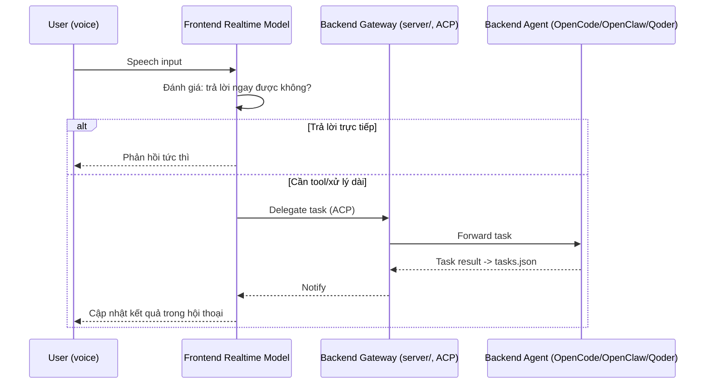
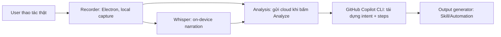
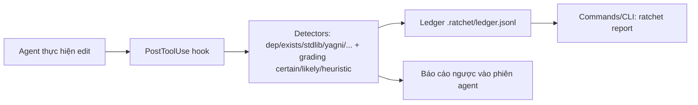

# Weekly Agentic AI Scan — 2026-08-02

**Nguồn dữ liệu:** GitHub Search API (`created:>2026-07-26`, `pushed:>2026-07-26`), truy vấn qua `api.github.com/search/repositories` (không dùng `gh` CLI vì session này không có quyền `gh`/GitHub MCP ra ngoài repo `undertheseanlp/underthesea`; toàn bộ tra cứu thực hiện qua fetch trang công khai).

## Executive summary

- Tuần này (26/07 – 02/08/2026) không có repo "big-bang" mới nổi bật về orchestration đa agent kiểu LangGraph/AutoGPT; các phát hiện đáng chú ý nhất là các **lớp hạ tầng quanh coding agent** (harness đa người dùng, hook giám sát hành vi agent, pipeline biến screen-recording thành skill) hơn là bản thân một "agent framework" mới.
- Sau khi loại các repo dạng prompt/skill thuần Markdown (`old-coder`, `ponytail-improved` — không đủ evidence kiến trúc code) và các repo hạ tầng không thực sự "agentic" (`deltafin` — inference server, tự nhận "agents are a curiosity, not a workflow"), còn lại **4 repo** đạt bộ lọc relevance.
- Điểm chung đáng học: cả 4 repo đều giải quyết vấn đề "agent đã chạy được, giờ làm sao vận hành/giám sát/tái sử dụng nó ở quy mô lớn hơn 1 người dùng" — một signal cho thấy trọng tâm cộng đồng đang dịch từ "xây agent" sang "vận hành agent".

## Mục lục

- [1. yc-software/qm — multiplayer agent harness](#1-yc-softwareqm)
- [2. QwenAudio/qwen-audio-agent — realtime voice agent runtime](#2-qwenaudioqwen-audio-agent)
- [3. microsoft/skill-recorder — session-to-skill compiler](#3-microsoftskill-recorder)
- [4. 0xwilliamortiz/ratchet — agent rule-following enforcement](#4-0xwilliamortizratchet)

---

## 1. yc-software/qm

### §1 Quick context
Harness đa người dùng để chạy coding agent (Claude Code, OpenCode, Pi) chung trong Slack/web với sandbox cách ly từng người. Stack: TypeScript/Node.js, Fastify, PostgreSQL, MIT license. Repo tạo 2026-07-29, ~5.264 stars, push gần nhất 2026-08-01. Có `test/` directory; không xác định được CI cụ thể từ trang repo (không thấy badge trong nội dung fetch được).

### §2 Architecture deep-dive

**A. Component inventory**
- `Headless core` (`src/core`) — API/identity/policy/scheduler trung tâm, mọi lượt tương tác đi qua đây.
- `Harness` (`src/harness`) — lớp chạy agent loop qua nhiều backend khác nhau (Pi, OpenCode, Claude Code) để sinh phản hồi.
- `Sandbox` (`src/sandbox`) — môi trường cô lập theo scope (per-user/per-room), chứa file, tool, service đã đăng nhập.
- `Policy` + `ACL` (`src/policy`, `src/acl`) — kiểm soát quyền hạn agent được làm gì trong sandbox.
- `Persistence` (`src/persistence`) — lưu session/memory/queue trong PostgreSQL.
- `Cron` / `Monitors` / `Wake` (`src/cron`, `src/monitors`, `src/wake`) — lịch trình và kích hoạt agent ngoài luồng chat trực tiếp.
- `Connectors` (`src/connectors`, `src/slack`) — tích hợp Slack và các bề mặt khác.
- Deployment tách biệt khỏi core: cấu hình riêng công ty (org config, custom tools/skills, sandbox image) sống trong một "deployment directory" ngoài core — README nêu rõ nguyên tắc "core is generic".

**B. Control flow — Hierarchical/harness-mediated, không phải ReAct loop lộ ra ngoài**
1. Request vào từ Slack hoặc web (`connectors`/`slack`).
2. `Headless core` xác thực danh tính, áp policy/ACL để quyết định scope.
3. `Scheduler` trong core chọn/khởi tạo phiên, giao việc cho `Harness`.
4. `Harness` chọn một trong các backend agent (Pi/OpenCode/Claude Code) chạy agent loop bên trong `Sandbox` riêng của scope đó, dùng `execute` như tool bề mặt cố định để chạy lệnh giới hạn.
5. Kết quả + trạng thái được ghi vào `Persistence` (Postgres: session/memory/queue).
6. Phản hồi trả lại qua connector gốc (Slack/web); `cron`/`monitors`/`wake` có thể tái kích hoạt agent ngoài lượt chat (background work).

**C. State & data flow:** state lưu tập trung ở PostgreSQL (`persistence`), tách biệt session, memory, queue — không xác định schema chi tiết từ code (chỉ có tên thư mục). Message format giữa harness và backend agent: không xác định từ code (không fetch được nội dung file cụ thể, chỉ có tên thư mục).

**D. Tool integration:** cơ chế "fixed tool surface" — agent trong sandbox chỉ có `execute` để chạy lệnh scoped; validation/sandbox cụ thể nằm ở `src/sandbox` + `src/policy` nhưng cơ chế function-calling (native tool-calling của model hay JSON tự parse) — không xác định từ code.

**E. Memory:** có thư mục `src/memory` riêng biệt với `persistence`, gợi ý tách bộ nhớ ngắn hạn khỏi lưu trữ bền vững, nhưng chiến lược summarization/compaction — không xác định từ code.

**F. Model orchestration:** đa backend (Pi, OpenCode, Claude Code) chọn theo harness, không rõ tiêu chí chọn model/backend nào cho tác vụ nào — không xác định từ code.

**G. Observability & eval:** có `src/audit` (audit logging) và `src/insights` (analytics) — cho thấy có lớp quan sát, nhưng công cụ tracing cụ thể (OpenTelemetry, Langfuse...) — không xác định từ code.

**H. Extension points:** README nêu rõ mọi thứ đặc thù theo công ty (custom tools/skills, sandbox image, infra) sống trong "deployment directory" tách biệt khỏi core — đây là extension point chính thức.

### §3 Architecture diagram

### §4 Verdict
Điểm đáng học: tách biệt rõ "core generic" khỏi "deployment directory" đặc thù công ty — một pattern multi-tenant hiếm thấy ở agent harness open source (đa số coding-agent harness hiện tại là single-tenant, chạy local). Việc dùng Postgres làm state store thay vì file/vector DB cũng là lựa chọn production-oriented rõ ràng. Red flag: phần lớn đánh giá kiến trúc ở đây dừng ở tên thư mục — nội dung file thực tế (schema, cách gọi tool, cơ chế chọn model) không fetch được nên nhiều dimension ghi "không xác định". Cần đào sâu: đọc `src/harness` và `src/wiring.ts` để hiểu cách các backend agent thực sự được plug vào core.

---

## 2. QwenAudio/qwen-audio-agent

### §1 Quick context
Runtime giọng nói realtime cho agent: trả lời tức thì bằng voice model, việc cần tool được giao cho agent nền chạy qua ACP. Stack: TypeScript/Node.js (>=22.22 hoặc >=24.15), Apache-2.0. Repo tạo 2026-07-27, ~1.429 stars, push gần nhất 2026-08-01. Có `test/` directory; CI cụ thể không xác định từ trang repo.

### §2 Architecture deep-dive

**A. Component inventory**
- `Frontend voice model` (mô tả trong README, chạy qua "Qwen Audio 3.0 Realtime") — xử lý hội thoại tức thời, quyết định trả lời ngay hay chuyển việc.
- `Backend agent gateway` (`server/`) — cầu nối tới các agent nền qua ACP (Agent Client Protocol).
- `CLI` (`cli/`), `TUI` (`tui/`), `Web UI` (`web/`), `Desktop app` (`desktop/`, macOS floating orb) — các bề mặt giao diện khác nhau dùng chung backend.
- `Shared` (`shared/`) — tiện ích dùng chung giữa các bề mặt.
- Trạng thái cục bộ lưu tại `~/.config/qwaudio/`: `USER.md`, `frontend-memory.json`, `tasks.json` — theo README, đây là nơi lưu hồ sơ người dùng, ngữ cảnh hội thoại, và kết quả tác vụ nền.

**B. Control flow — Router/delegation (không phải ReAct loop cổ điển, mà là "fast-path vs delegate")**
1. Người dùng nói (voice input) vào frontend realtime model.
2. Frontend tự đánh giá: câu hỏi trả lời trực tiếp được thì trả lời ngay ("能直接回答的问题会立即回答").
3. Nếu cần tool/xử lý kéo dài, task được giao cho backend agent nền (qua ACP — hỗ trợ agent ACP gốc, adapter ACP ngoài, hoặc generic stdio ACP; các agent cụ thể như OpenCode, OpenClaw, Qoder).
4. Backend agent thực thi tác vụ bất đồng bộ, ghi kết quả vào `tasks.json`.
5. Kết quả được đưa trở lại hội thoại đang diễn ra để người dùng theo dõi hoặc chỉnh sửa tiếp — người dùng có thể tiếp tục nói chuyện trong lúc agent nền vẫn chạy (đặc điểm "agents stay present").

**C. State & data flow:** state lưu local dạng file JSON/Markdown (`USER.md`, `frontend-memory.json`, `tasks.json`) tại `~/.config/qwaudio/` — không phải DB, không phải vector store. Đây là context management kiểu "flat file persistent memory", không xác định có summarization hay không từ nội dung fetch được.

**D. Tool integration:** cơ chế chính là ACP (Agent Client Protocol) — một chuẩn giao tiếp giữa frontend và agent backend, hỗ trợ 3 chế độ: ACP gốc, ACP adapter, và generic stdio. Đây khác với function-calling trực tiếp của model — nó là một lớp protocol trung gian cho phép cắm nhiều loại agent backend khác nhau (OpenCode, OpenClaw, Qoder) mà không cần sửa frontend.

**E. Memory:** phân biệt rõ 2 tầng — `frontend-memory.json` (ngữ cảnh hội thoại phía voice model) và `tasks.json` (kết quả/tác vụ phía backend agent) — tách bộ nhớ hội thoại khỏi bộ nhớ tác vụ. Retrieval strategy (vector/keyword) — không xác định từ code.

**F. Model orchestration:** model frontend cố định (Qwen Audio 3.0 Realtime) cho nhiệm vụ voice; model/agent backend có thể cấu hình (OpenCode/OpenClaw/Qoder) — đây là phân chia rõ ràng "một model nhanh cho tương tác realtime, nhiều agent linh hoạt cho công việc nặng" đúng như mô tả dimension F mong đợi, nhưng cơ chế fallback/parallelism — không xác định từ code.

**G. Observability & eval:** không xác định từ code (không có evidence về tracing/logging cụ thể trong nội dung fetch được).

**H. Extension points:** hỗ trợ "None" mode (chỉ chạy frontend, không backend) và ACP adapter cho phép cắm agent backend tuỳ ý — đây là extension point chính.

### §3 Architecture diagram

### §4 Verdict
Điểm novel: mô hình "voice frontend làm router, tự quyết định trả lời ngay hay delegate cho agent nền qua một protocol trung gian (ACP)" là một pattern control-flow rõ ràng và khác biệt so với ReAct loop đơn luồng phổ biến — nó tách latency-sensitive path (voice) khỏi work-heavy path (agent), và làm điều này qua một protocol (ACP) thay vì hard-code một agent framework cụ thể, nên có thể cắm OpenCode/OpenClaw/Qoder mà không sửa frontend. Red flag: toàn bộ state lưu flat-file cục bộ (`~/.config/qwaudio/`), không có concurrency/multi-device story rõ ràng — không xác định từ code liệu có xử lý race condition khi nhiều tác vụ nền ghi `tasks.json` cùng lúc không. Cần đào sâu: đọc `server/src` để hiểu chi tiết implementation của ACP gateway và cách nó phân biệt "cần tool" vs "trả lời ngay" (có phải một classifier riêng, hay chính frontend model tự quyết định qua system prompt).

---

## 3. microsoft/skill-recorder

### §1 Quick context
Ứng dụng Electron của Microsoft: ghi lại phiên làm việc trên máy (màn hình, click, chuyển app, giọng nói) rồi dùng GitHub Copilot CLI để tái dựng thành "Skill" hoặc "Automation" tái sử dụng được cho agent. Stack: TypeScript, Electron + Vite, Node.js 24, MIT. Repo tạo 2026-07-29, 386 stars, 47 forks, 103 commit trên main, 19 issue mở, 7 PR mở — hoạt động đều, có `.github/workflows` (CI) và `evals/` riêng.

### §2 Architecture deep-dive

**A. Component inventory**
- `Recorder` (`electron/`) — ứng dụng Electron chạy local, ghi screen video, chuyển đổi window/app, URL trình duyệt, clipboard preview.
- `Narration transcriber` — Whisper chạy on-device, hỗ trợ 99 ngôn ngữ, không gửi dữ liệu ra ngoài trong lúc ghi.
- `Analysis pipeline` (cloud) — khi người dùng bấm "Analyze", event timeline + ảnh màn hình + narration text được gửi lên cloud của GitHub, dùng Copilot CLI để tái dựng ý định tổng thể và các bước thứ tự.
- `Output generator` — biến phiên đã phân tích thành `Skill` (thủ tục theo yêu cầu) hoặc `Automation` (lịch trình/kích hoạt tự động), ưu tiên dùng tool gốc của agent (GitHub CLI, `web_fetch`) thay vì replay UI thô.
- `Evals suite` (`evals/`) — bộ đánh giá riêng cho pipeline phân tích.
- `Common` (`common/`) — tiện ích dùng chung giữa main process và renderer.

**B. Control flow — Pipeline 3 giai đoạn, không phải agent loop thời gian thực**
1. Người dùng thực hiện thao tác thật (VD: điền một form) trong khi Recorder ghi lại local.
2. Recorder capture screen, window transitions, URL, clipboard, narration (qua Whisper on-device) — không có gì rời máy ở bước này.
3. Người dùng bấm "Analyze" → timeline sự kiện + ảnh + narration text được gửi lên GitHub Copilot cloud.
4. Copilot tái dựng "overall intent" và chuỗi bước có thứ tự từ dữ liệu phiên.
5. Output generator sinh ra Skill/Automation, generalize từ một ví dụ đơn lẻ (VD: học từ một lần điền form để xử lý được nhiều form khác nhau).
6. Skill/Automation sinh ra được agent khác tái sử dụng (ưu tiên gọi tool gốc thay vì replay UI).

**C. State & data flow:** hai tầng rõ rệt — dữ liệu thô (video/sự kiện) ở local, chỉ chuyển sang dạng "event timeline + ảnh + text" khi gửi cloud để phân tích. Không phải context-window management của một agent đang chạy, mà là "capture rồi nén thành kịch bản" một lần.

**D. Tool integration:** không phải agent tự gọi tool trong lúc ghi — cơ chế là ngược lại: hệ thống quan sát người dùng dùng tool nào (qua window/URL tracking) rồi sinh ra hướng dẫn cho agent khác gọi đúng tool đó sau này, ưu tiên "agent native tools (GitHub CLI, web_fetch)" hơn là giả lập lại thao tác UI.

**E. Memory:** không có bộ nhớ dài hạn kiểu agent (không phải vector DB hay session memory) — sản phẩm đầu ra (Skill/Automation) chính là "bộ nhớ hoá" một quy trình thành artifact tái dùng được, khác về bản chất so với memory runtime của một agent đang hội thoại.

**F. Model orchestration:** Whisper cho transcription local (nhỏ, chạy on-device), GitHub Copilot cloud cho reasoning/tái dựng ý định (lớn, off-device) — đúng pattern "model nhỏ tại chỗ, model lớn cho việc nặng", nhưng cơ chế fallback/batching cụ thể — không xác định từ code.

**G. Observability & eval:** có thư mục `evals/` riêng biệt — cho thấy nhóm phát triển coi việc đánh giá chất lượng tái dựng ý định là một phần chính thức của kiến trúc, khác với nhiều agent tool khác chỉ log runtime; nội dung eval cụ thể (metric gì) — không xác định từ code.

**H. Extension points:** README cảnh báo rõ về secrets trong lúc ghi ("keep secrets out of your recordings") — cho thấy có ranh giới bảo mật rõ ràng giữa local/cloud, nhưng cơ chế plug-in agent/tool tuỳ chỉnh cụ thể — không xác định từ code.

### §3 Architecture diagram

### §4 Verdict
Điểm novel: đây không phải một agent, mà là một "compiler" biến hành vi người dùng thật thành capability cho agent khác — ranh giới local/cloud rõ ràng (capture 100% local, chỉ phân tích mới lên cloud) là một thiết kế privacy-first đáng học cho bất kỳ tool nào ghi lại hoạt động người dùng để train/generalize. Việc có `evals/` như first-class directory (không phải afterthought) cũng là tín hiệu engineering trưởng thành hiếm gặp ở repo mới 1 tuần tuổi. Red flag: phụ thuộc cứng vào GitHub Copilot CLI cho bước reasoning — không tự chủ về model, và cơ chế generalize "từ một ví dụ ra nhiều case" chưa có evidence cụ thể về giới hạn/thất bại. Cần đào sâu: đọc `evals/` để biết metric đánh giá độ chính xác tái dựng ý định, và `electron/` để hiểu ranh giới chính xác giữa main process (capture) và renderer.

---

## 4. 0xwilliamortiz/ratchet

### §1 Quick context
Hook giám sát coding agent theo thời gian thực: chặn mỗi lần agent sửa code, đo và báo cáo vi phạm quy tắc (dependency mới, code trùng lặp, vi phạm YAGNI...) ngay trong phiên đang chạy. Stack: JavaScript/Node.js >=20, MIT, plugin cho Claude Code. Repo tạo 2026-07-31, 408 stars. Có `tests/` với 115+ test case theo README; CI cụ thể không xác định từ trang repo.

### §2 Architecture deep-dive

**A. Component inventory**
- `PostToolUse hook` (`hooks/`) — điểm chặn chính: đọc mỗi edit agent thực hiện ngay khi nó xảy ra, đo lường, báo cáo ngược vào phiên đang chạy.
- `Detectors` (`skills/`) — logic phát hiện theo tag: `dep`, `exists`, `stdlib`, `native`, `wrapper`, `yagni`, `validation`, `budget`.
- `Commands/CLI` (`commands/`, `bin/`) — bao gồm `ratchet baseline` (chấp nhận code hiện tại làm nền, chỉ flag vi phạm mới) và `ratchet report` (xem xu hướng lịch sử).
- `Ledger` (`.ratchet/ledger.jsonl`) — file log theo phiên: số dòng thêm/xoá, file mới, dependency mới, số item bị flag.
- `Claude plugin integration` (`.claude-plugin/`) — tích hợp trực tiếp với Claude Code làm nền tảng chạy hook.

**B. Control flow — Event-driven interceptor, không phải agent loop độc lập (ăn theo loop của agent khác)**
1. Agent (Claude Code hoặc tương thích) thực hiện một lần edit code.
2. `PostToolUse hook` được framework agent gọi ngay sau edit đó, đọc diff.
3. `Detectors` chạy các quy tắc theo tag lên diff, gắn nhãn độ tin cậy: `certain` (parse được, không đoán), `likely` (structural), `heuristic` (pattern-matching).
4. Kết quả được ghi vào `.ratchet/ledger.jsonl` (per-session) và báo cáo ngược ngay vào phiên hội thoại agent đang chạy — agent nhận feedback trong khi vẫn đang làm việc, không phải sau khi xong.
5. Tuỳ chế độ vận hành (`advise` chỉ báo cáo / `guard` mặc định — báo cáo + cảnh báo budget / `strict` — chặn edit vượt budget), hệ thống quyết định có chặn edit hay không — chỉ finding `certain` mới có quyền chặn ở chế độ `strict`.
6. `ratchet report` cho phép xem lại xu hướng nhiều phiên từ ledger.

**C. State & data flow:** state là file JSONL cục bộ (`.ratchet/ledger.jsonl`), không DB, không vector store — pattern "append-only ledger" đơn giản, dễ audit, dễ diff. Message format giữa hook và detector — không xác định từ code (chỉ có tên thư mục/file).

**D. Tool integration:** ratchet không phải nơi agent gọi tool — nó là consumer của tool-use event (`PostToolUse`) do framework agent (Claude Code) phát ra; validation dựa trên "regex và `git grep`, không phải type checker" — README tự thừa nhận đây là nguồn false positive.

**E. Memory:** không có memory runtime kiểu agent — chỉ có "memory" ở dạng baseline (nợ kỹ thuật cũ được chấp nhận, `ratchet baseline`) và ledger lịch sử theo phiên; không có retrieval/vector.

**F. Model orchestration:** không dùng LLM cho việc phát hiện — detector là regex/git-grep thuần, không xác định từ code liệu ratchet có gọi LLM ở bất kỳ bước nào không (README không đề cập).

**G. Observability & eval:** đây chính là trọng tâm của repo — eval methodology dựa trên 3 mức độ tin cậy (`certain`/`likely`/`heuristic`) thay vì binary pass/fail, cộng với ledger lịch sử cho phép xem xu hướng theo thời gian (`ratchet report`) — một cách tiếp cận eval khác biệt so với LLM-as-judge phổ biến.

**H. Extension points:** kiến trúc tag-based (`dep`, `exists`, `stdlib`...) trong `skills/` gợi ý mỗi tag là một detector có thể thêm mới độc lập, nhưng cơ chế đăng ký detector tuỳ chỉnh cụ thể — không xác định từ code.

### §3 Architecture diagram

### §4 Verdict
Điểm novel: thay vì thêm một lớp "agent thứ hai" để review agent thứ nhất (kiểu LLM-as-judge tốn token và chậm), ratchet chọn regex/AST-lite + confidence grading (`certain`/`likely`/`heuristic`) chạy đồng bộ trong `PostToolUse` — rẻ, nhanh, và tự nhận giới hạn (false positive) thay vì giả vờ chính xác tuyệt đối. Cơ chế `baseline` (nợ cũ được grandfather, chỉ chặn nợ mới) là một eval-methodology pattern thực dụng, tránh việc một tool governance làm tê liệt codebase cũ. Red flag: phụ thuộc hoàn toàn vào chất lượng regex/git-grep nên dễ miss các vi phạm phức tạp về ngữ nghĩa; không có LLM nào tham gia detection nên khó bắt được vi phạm "tinh thần" quy tắc chứ không phải cú pháp. Cần đào sâu: đọc thực tế các file trong `skills/` để xem từng detector implement bằng regex đơn giản hay có logic AST-parsing thật, vì README chỉ mô tả ở mức khái niệm.

---

## Repos đã loại và lý do

| Repo | Lý do loại |
|---|---|
| `0xwilliamortiz/ponytail-improved` | Chủ yếu là skill/prompt định hướng hành vi agent ("decision ladder" chống over-engineering); có hooks/MCP thật nhưng cốt lõi giá trị là rule set, không phải kiến trúc agent để deep-dive theo khung 8 dimension. |
| `AmazingAng/old-coder` | Primary language là Markdown — skill definition (SKILL.md), không phải code có kiến trúc runtime. |
| `gavamedia/deltafin` | Inference server cho model Kimi K3 trên máy đơn lẻ; README tự nhận "agents are a curiosity, not a workflow" — không phải agentic architecture. |
| `uczltw6/trace-file-lineage` | Công cụ truy vết nguồn gốc file nói chung (Git/metadata), AI agent chỉ là một trong nhiều "producer" được nhận diện, không phải trọng tâm kiến trúc. |
| Các repo lớn lâu năm (`langchain`, `dify`, `langflow`, `browser-use`, `gemini-cli`...) xuất hiện trong `pushed:>7d` | Chỉ có commit định kỳ trong tuần, không có evidence về một thay đổi kiến trúc "đáng chú ý trong 7 ngày" — không tính là "significantly updated" theo tinh thần weekly scan. |

## Ghi chú về giới hạn nghiên cứu tuần này

Session này không có quyền dùng `gh` CLI hay GitHub MCP tools ra ngoài phạm vi repo `undertheseanlp/underthesea`, nên toàn bộ tra cứu được thực hiện qua fetch trang công khai (`api.github.com/search/repositories` và trang GitHub HTML) thay vì `gh api`. Một số fetch endpoint `api.github.com/repos/{owner}/{repo}` bị chặn (HTTP 403) nên số liệu stars/forks ở một số repo lấy từ kết quả search thay vì gọi trực tiếp endpoint repo — có thể lệch nhẹ so với thời điểm đọc. Một lần fetch sâu vào `ratchet/hooks` trả về nội dung không nhất quán với ngôn ngữ repo (JS) nên đã bị loại bỏ khỏi bằng chứng thay vì đưa vào báo cáo.
