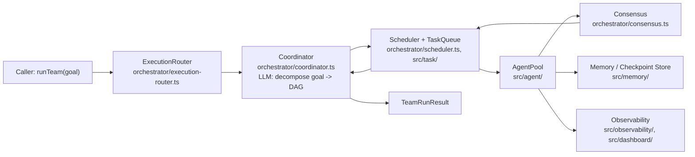
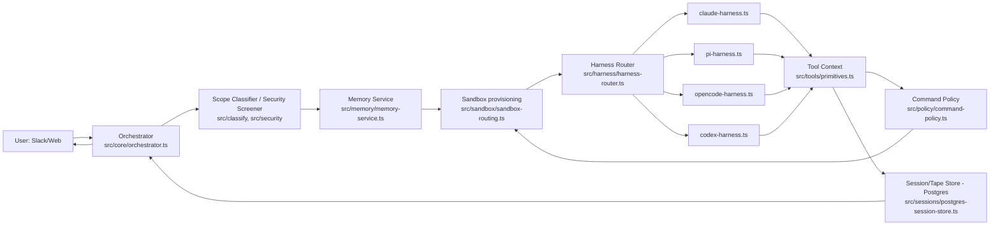
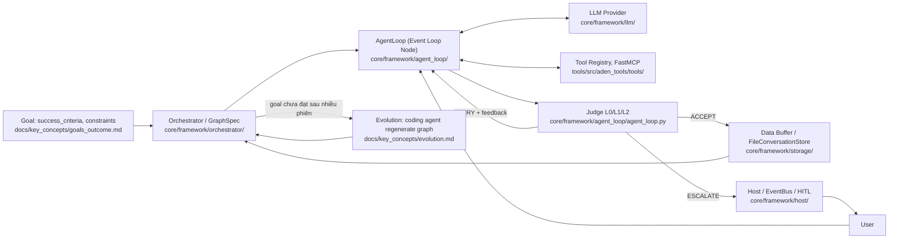

# Weekly Agentic AI Architecture Scan — 2026-08-03

**Phạm vi:** repos agentic AI mới publish hoặc active mạnh trong 7 ngày qua (27/07 – 03/08/2026).

**Nguồn dữ liệu:** không có quyền dùng `gh api`/GitHub REST search trong phiên này (session bị giới hạn phạm vi truy cập GitHub API vào đúng 1 repo, không liên quan tác vụ này), nên đã fallback sang HN Algolia API (Show HN + story search, lọc theo `created_at`/`points`) và WebSearch/WebFetch trên `github.com` + `raw.githubusercontent.com` để xác minh nội dung thật. Đây là giới hạn cần ghi nhận: coverage tuần này thiên về repo có traction trên Hacker News, không phải toàn bộ GitHub.

## Executive Summary

- **`open-multi-agent`** chứng minh được "runtime DAG planning" là cơ chế thật (Coordinator sinh task graph qua 1 LLM round-trip, executor dispatch event-driven), kèm cơ chế adaptive recovery (`PlanPatch`) khá tinh vi — đáng học nhất tuần này về kỹ thuật orchestration thuần túy.
- **`yc-software/qm`** đưa ra mô hình hạ tầng multi-tenant nghiêm túc hiếm gặp: mỗi user một sandbox cô lập (Docker/AWS microVM/Fly Sprites) nhưng cộng tác qua Slack/web chung, trừu tượng hoá 4 model harness khác nhau sau một interface.
- **`adenhq/hive`** có ý tưởng hay (pointer pattern cho tool output, judge 3 tầng, evolution loop tự sửa graph) nhưng pitch marketing ("OODA-loop", "Best-of-3") không khớp thuật ngữ thật trong docs, và có dấu hiệu cần cẩn trọng về số sao (bounty program trong CI, nghi vấn astroturfing từ chính cộng đồng HN).

## Mục lục

1. [open-multi-agent/open-multi-agent](#open-multi-agentopen-multi-agent)
2. [yc-software/qm](#yc-softwareqm)
3. [adenhq/hive](#adenhqhive)

---

## open-multi-agent/open-multi-agent

**Link:** https://github.com/open-multi-agent/open-multi-agent — đã xác minh tải được nội dung thật (README/About, `packages/`, `docs/`, `package.json`, các file source trong `packages/core/src`), không phải trang 404/placeholder.

### §1 Quick Context

"Describe the goal, not the graph" — coordinator LLM tự phân rã goal thành task DAG lúc runtime thay vì graph viết tay. Stack: TypeScript, Node.js ≥20, npm workspaces (`packages/core` v1.14.0, `packages/otel`, `create-oma-app`); dependencies chính `@anthropic-ai/sdk`, `openai`, `zod`, peer optional `@modelcontextprotocol/sdk`, Vercel AI SDK, AWS Bedrock, `@google/genai`. Repo: 6.7k sao, 2.4k fork, 459 commit, commit gần nhất 2026-08-02 (rất active), có CI thật (`ci.yml`, `provider-canary.yml`, `release-smoke.yml`) + CodeCov, `vitest.config.ts` và thư mục `tests/`.

### §2 Architecture Deep-Dive

**A. Component inventory** (tất cả path xác nhận qua directory listing thật của `packages/core/src`):
- `Coordinator` (`packages/core/src/orchestrator/coordinator.ts`) — LLM call phân rã goal → task DAG, và tổng hợp kết quả cuối (synthesis).
- `Orchestrator` (`packages/core/src/orchestrator/orchestrator.ts`) — entrypoint class `OpenMultiAgent`, expose `runTeam()`/`runAgent()`/`runTasks()`/`runFromPlan()`/`restore()`.
- `ExecutionRouter` (`packages/core/src/orchestrator/execution-router.ts`) — quyết định single-agent vs team mode (`DeterministicRouter` mặc định, `TaskProfiler`/`LLMTaskProfiler` khi `strategy: 'hybrid'`).
- `Scheduler` + `TaskQueue` (`packages/core/src/orchestrator/scheduler.ts`, `packages/core/src/task/`) — thực thi DAG event-driven, dispatch task khi dependency sẵn sàng.
- `AgentPool` (`packages/core/src/agent/`) — chạy từng agent qua LLM adapter, semaphore-based concurrency.
- `AgentSelector` (`packages/core/src/orchestrator/agent-selector.ts`) — model routing.
- `Consensus` (`packages/core/src/orchestrator/consensus.ts`) — proposer/judge verification loop.
- `Recovery` (`packages/core/src/orchestrator/recovery.ts`) — adaptive plan-repair (`PlanPatch`).
- `Memory` (`packages/core/src/memory/`) — `MemoryStore` interface, `InMemoryStore`, `FileStore`, `RedactingStore`.
- `Observability` (`packages/core/src/observability/`) — `TraceSink`/`TraceExporter`/`BatchingTraceSink`, `FileTraceStore` (NDJSON).
- `Dashboard` / Run Viewer (`packages/core/src/dashboard/`) — sinh HTML tĩnh offline.
- `Eval` (`packages/core/src/eval/`: `judge.ts`, `scorer.ts`, `evalset.ts`, `runner.ts`, `gate.ts`, `online.ts`).
- `CLI` (`packages/core/src/cli/`) — lệnh `oma` (bao gồm `oma dashboard`).
- `LLM adapters` (`packages/core/src/llm/`, `ai-sdk.ts`, `mcp.ts`, `acp.ts`, `process.ts`).
- `@open-multi-agent/otel` (`packages/otel`) — adapter OTel riêng.
- `create-oma-app` (`packages/create-oma-app`) — scaffolder.

**B. Control flow:** **planner-executor**, executor chạy theo **event-driven DAG scheduling** (không phải state-machine cố định). Happy path:
1. Caller gọi `runTeam(team, goal)`.
2. `ExecutionRouter` quyết định single-agent hay team mode.
3. `Coordinator` thực hiện **một** LLM round-trip để decompose goal thành task DAG có `dependsOn` — đây là "runtime DAG planning" thực tế, một structured-output LLM call, không phải thuật toán planning phức tạp.
4. `TaskQueue` phát event `task:ready` khi dependency thỏa; `Scheduler` dispatch task (qua gate budget/approval/cancellation) tới `AgentPool` theo strategy (dependency-first/composite/round-robin/least-busy).
5. Mỗi agent chạy LLM + tools; nếu cấu hình, `Consensus` chạy proposer→judges trước khi chấp nhận kết quả; task fail/skip cascade xuống dependents, nhánh khác vẫn chạy song song.
6. Khi mọi task terminal, `Coordinator` synthesis kết quả cuối, trả `TeamRunResult`.

**C. State & data flow:** Task-to-task truyền dữ liệu qua `dependencyPayload` (`'output' | 'structured' | 'both'`, cap 64 KiB/dependency). State lưu qua interface `MemoryStore` chung cho shared-memory lẫn checkpoint; mặc định in-memory, bền vững qua `FileStore` (`./.oma/memory.json`, `./.oma/checkpoint.json`, ghi atomic temp→fsync→rename). Context window: 4 chiến lược per-agent — sliding-window, summarize, compact (rule-based), hoặc custom `compress()`, cộng `compressToolResults`/`maxToolOutputChars`.

**D. Tool/capability integration:** Ba nguồn tool — built-in (`bash`, `file_read/write/edit`, `grep`, `glob`, **default-deny**, phải allowlist), custom tool qua `defineTool()` (Zod schema), và MCP server qua `connectMCPTools()`. Native function-calling là cơ chế chính; sandbox chỉ là path-containment cho filesystem tool, riêng `bash` **không sandbox thật** — docs tự nói "gating is coordination policy, not cryptographic isolation".

**E. Memory architecture:** Chỉ có shared memory dạng namespaced key-value (in-process/`FileStore`/custom cho Redis-Postgres); không thấy bằng chứng vector store/RAG — không xác định từ code liệu có long-term semantic memory.

**F. Model orchestration:** Routing rule-based theo `phase`/`agent`/`taskRole`/`taskPriority`/`leaf`/`hasDependencies`; ví dụ coordinator/synthesis dùng model flagship, leaf/worker task dùng model rẻ hơn — tiered cost. Fallback: ordered backup provider routes khi lỗi retryable. Parallelism: semaphore-based trong `AgentPool`.

**G. Observability & eval:** 3 lớp telemetry (`onProgress`, `onTrace` legacy, `TraceRecord v2` với span W3C) + `FileTraceStore` NDJSON. Run Viewer sinh **file HTML tĩnh self-contained** cho một run, nhưng docs tự khẳng định **"read-only... performs no replay or mutation"** — tính "replay" trong pitch thực chất là `runFromPlan()` (chạy lại frozen plan JSON), không phải replay execution đã ghi. Có framework eval riêng cho offline eval-set lẫn online gating.

**H. Extension points:** custom tool, MCP server, custom `ExecutionRouter`, custom `MemoryStore`, custom `Replanner`, custom model route, AI SDK provider bất kỳ, external agent qua Agent Client Protocol hoặc process backend, scaffold project mới qua `create-oma-app`.

### §3 Architecture Diagram

### §4 Verdict

**Đáng học:** "Runtime DAG planning" là thật, không phải marketing suông — Coordinator sinh structured task graph qua 1 LLM round-trip rồi executor chạy event-driven. Cơ chế adaptive recovery (`PlanPatch` với `addTasks`/`retargetPending`/`supersedePending`, completion barrier tránh race giữa task gốc và task thay thế) là thiết kế tinh vi, hiếm gặp ở framework OSS khác. Consensus proposer-judge có budget tích hợp cũng đáng học.

**Red flags:** Run Viewer bị quảng bá ngầm như "replay" nhưng thực chất read-only, không mutation/replay thật. Checkpoint chỉ resume ở granularity task, không lưu mid-task conversation state. `bash` tool không sandbox thật dù "default-deny" — an toàn phụ thuộc policy, không phải cô lập process-level.

**Câu hỏi mở:** Coordinator planning có retry/self-critique khi DAG invalid không? Cơ chế long-term/semantic memory (RAG) có tồn tại ngoài KV store không — không xác định từ code đã xem.

---

## yc-software/qm

**Link:** https://github.com/yc-software/qm — đã xác minh tải được nội dung thật (README, `src/`, `plugins/`, `docs/`, `cli/`, `adrs/`, `package.json`, `SECURITY.md`).

### §1 Quick Context

QM là agent harness đa người dùng cho doanh nghiệp: mỗi nhân viên có sandbox riêng nhưng cộng tác qua Slack/web chung. Stack: TypeScript/Node ≥24, Fastify, Postgres (`pg` + `pg-boss`) cho persistence/queue, đa harness (Claude Agent SDK, Pi, OpenCode, Codex), sandbox Docker/AWS microVM/Fly Sprites, Slack Bolt, web-ui Vite+Lit. Repo rất trẻ: ~40 commit trên `main`, commit mới nhất 31/07/2026, 7.7k sao, 809 fork, 21 issue mở, 76 PR mở. CI có (`cicd.yml`, `release.yml`), test suite thật (`test:e2e`, `test:pg`, `live-e2e` chống Slack thật).

### §2 Architecture Deep-Dive

**A. Component inventory:**
- `Orchestrator` (`src/core/orchestrator.ts`) — điều phối trung tâm mỗi turn (screening, memory, sandbox, harness, tape).
- `Harness abstraction` (`src/harness/harness.ts`) — interface chung `Harness`/`defineHarness()`.
- Harness implementations (`src/harness/claude-harness.ts`, `pi-harness.ts`, `opencode-harness.ts`, `codex-harness.ts`, `mock-harness.ts`) + `harness-router.ts`.
- `Context compaction` (`src/harness/context-compaction.ts`).
- `Tool context` (`src/tools/primitives.ts`) — ~40 phương thức tool (execute, file, memory, cron, chat surface).
- `Sandbox` (`src/sandbox/sandbox.ts`, `local-sandbox.ts`, `aws-sandbox.ts`, `sprites-sandbox.ts`, `sandbox-routing.ts`).
- `Command policy` (`src/policy/command-policy.ts`) và `Security screener` (`src/security/security-screener.ts`, `security-posture.ts`).
- `Scope classifier` (`src/classify/scope-classifier.ts`).
- `Sessions`/`Runs` (`src/sessions/postgres-session-store.ts`, `src/runs/worker.ts`, `tool-ledger.ts`).
- `Cron`/`Monitors` (`src/cron/scheduler.ts`, `src/monitors/monitor-poller.ts`).
- `Model gateway` (`src/model/model-gateway.ts`, `model-catalog.ts`).
- Plugins (`plugins/web-ui`, `plugins/portal`, `plugins/admin`, `plugins/chassis`, `plugins/auth`, `plugins/onboarding`) và `cli/`.

**B. Control flow:** event-driven orchestrator bọc một turn-based agent loop (gần state-machine, không phải ReAct thuần):
1. Message vào → `orchestrator.handleTurn()` xác thực actor, rate-limit.
2. Nếu nguồn external → `scope-classifier` + security screening, có thể quarantine.
3. Nạp memory (`memory.recall`), build system prompt + credentials.
4. Provision sandbox theo scope (`createTurnSandboxes`).
5. Gọi `harness.turns.runTurn()` — vòng lặp tool-calling nội bộ của harness cụ thể (Claude/Pi/OpenCode/Codex).
6. Ghi kết quả vào "tape" (lịch sử hội thoại) + audit log, trả `TurnResult`.

**C. State & data flow:** đơn vị lịch sử là "tape" gồm entry có type (`thinking`, `text`, `soul`, tool-call...). State ở Postgres qua nhiều store chuyên biệt (`postgres-session-store`, `postgres-run-store`, `postgres-memory-service`, `postgres-audit-log`, `postgres-config-store`); hàng đợi dùng `pg-boss` (Postgres-backed queue). Schema SQL cụ thể: không xác định từ code. Context window: `context-compaction.ts` dùng ngưỡng `COMPACT_SOFT_FRACTION=0.7`, `COMPACT_HARD_FRACTION=0.9`, ước lượng token qua LRU cache 50k entry, tóm tắt phần cũ, giữ nguyên phần gần nhất.

**D. Tool/capability integration:** Tool định nghĩa bằng TypeScript interface trong `tools/primitives.ts`. Với OpenCode, cầu nối dùng **native function calling** (Zod-wrapped JSON schema, `opencode-plugin.ts`) — không phải MCP dù `@modelcontextprotocol/sdk` có trong devDependencies (mục đích cụ thể không xác định từ code). Validation qua `command-policy.ts` (`evaluate → deny/require_approval`), path traversal check. Sandbox: 3 backend thật — Docker local, AWS microVM, Fly Sprites — chọn qua `sandbox-routing.ts` theo scope.

**E. Memory architecture:** scope-aware — `ccTargetFor()` "carbon-copy" dữ liệu từ kênh/nhóm shared vào memory cá nhân; `foldCapture()` dedup; giới hạn 300 fact/scope (LRU eviction); 4 chiến lược ghi nhớ (`agent-only.ts`, `consolidation.ts`, `per-turn.ts`, `scratch-promote.ts`). Retrieval: term matching thuần — không có embedding/vector DB trong dependencies.

**F. Model orchestration:** `harness-router.ts` chọn harness; `model-gateway.ts`/`model-catalog.ts`/`model-credential-store.ts` trừu tượng hoá provider. 4 harness thật xác nhận qua dependencies: `@anthropic-ai/claude-agent-sdk`, `@earendil-works/pi-ai`/`pi-coding-agent` (fork riêng có patch security), `@openai/codex`, `@opencode-ai/sdk`. Fallback/parallelism/batching cụ thể: không xác định từ code.

**G. Observability & eval:** `src/audit/audit-log.ts`, postgres error/metrics sinks, `harness/replay.ts` + `tape-fold.ts` cho replay hội thoại. Có bộ live-test thật chống Slack (`test/live-slack/run.ts`, `screenshots.ts`).

**H. Extension points:** harness mới qua `defineHarness()`; plugin mới qua thư mục `plugins/` (package riêng, ví dụ `plugins/portal` là "public SSO front door" OIDC + reverse-proxy); skill mới qua `skills-seed/` + `ensureSkillTree()`; deploy tuỳ biến qua `qm init` sinh `deploy/layers/<org>/`.

### §3 Architecture Diagram

### §4 Verdict

**Đáng học:** mô hình per-scope sandbox + shared Slack/web thực sự khác biệt — không phải chatbot mà là hạ tầng multi-tenant nghiêm túc (3 backend sandbox thật, chọn theo scope). Trừu tượng hoá 4 harness khác nhau sau một interface chung, cùng compaction có ngưỡng rõ ràng (0.7/0.9), cho thấy kỹ thuật khá chín.

**Red flags:** dùng `pg-boss` (Postgres) làm queue chính thay vì hệ chuyên dụng — có thể nghẽn khi scale. `SECURITY.md` tự nhận "early, experimental software", command policy "bypassable", posture mặc định "Auto" chỉ dùng classifier heuristic để screen dữ liệu external (không toàn diện). Memory retrieval là term-matching thuần, không vector search — đáng nghi vấn khả năng recall ngữ nghĩa ở quy mô lớn.

**Câu hỏi mở:** cơ chế fallback/parallel giữa các harness hoạt động thế nào? `@modelcontextprotocol/sdk` (dev dependency) thực sự dùng ở đâu?

---

## adenhq/hive

**Link:** https://github.com/adenhq/hive — trang `github.com` bị chặn bởi proxy nội bộ của môi trường nghiên cứu (403, chính sách egress, không phải lỗi từ phía GitHub); đã xác minh thay thế qua `raw.githubusercontent.com/adenhq/hive/main/...` — endpoint trả **HTTP 200** với nội dung source/docs thật, cross-check hàng chục file cụ thể (`pyproject.toml`, `core/framework/*`, `tools/src/aden_tools/*`, `.github/workflows/ci.yml`...). Số sao/contributor/ngày commit cuối lấy từ WebFetch ban đầu **không nhất quán** giữa các lần gọi (một lần trả về tên repo khác, số liệu khác) nên bị loại khỏi báo cáo — chỉ giữ lại thông tin xác minh qua raw file.

### §1 Quick Context

Hive là agent harness mã nguồn mở cho production: tự sinh graph đa-agent từ goal ngôn ngữ tự nhiên, tự phục hồi khi lỗi, có cơ chế verify nhiều tầng trước khi chấp nhận kết quả. Stack: Python 3.11+, `uv` workspace (`core` + `tools`), LLM qua `anthropic` SDK trực tiếp và `litellm==1.83.4` (100+ provider), `mcp`/`fastmcp` cho tool, `RestrictedPython` (tùy chọn) cho sandbox. Có CI thật (`ci.yml`: ruff lint + pytest matrix ubuntu/windows) và thư mục `tests/` trong cả `core` và `tools`. Số liệu sao/contributor: không tự xác minh được trong phiên này (proxy chặn GitHub API/web).

### §2 Architecture Deep-Dive

**A. Component inventory** (mỗi mục verify bằng raw file fetch, HTTP 200):
- `Orchestrator` (`core/framework/orchestrator/__init__.py`) — quản lý `GraphSpec`, `Goal`/`SuccessCriterion`/`Constraint`, `NodeSpec`, `NodeWorker`, chạy graph.
- `AgentLoop` (`core/framework/agent_loop/agent_loop.py`, `agent_loop/conversation.py`) — vòng lặp LLM-tool-output chính (`AgentLoop`, `OutputAccumulator`, `JudgeProtocol`, `JudgeVerdict`, `ConversationStore`).
- `LLM Provider abstraction` (`core/framework/llm/__init__.py`) — `AnthropicProvider`, `LiteLLMProvider`, `MockLLMProvider`.
- `Storage` (`core/framework/storage/__init__.py`) — `ConcurrentStorage`, `FileConversationStore`.
- `Host layer` (`core/framework/host/__init__.py`) — `ColonyRuntime`, `EventBus`, `Worker`.
- `Tool registry` (`core/framework/tools/`, `tools/src/aden_tools/tools/__init__.py`) — `register_all_tools(mcp, credentials=...)` qua FastMCP.
- `CLI` (`core/framework/cli.py`, entrypoint `hive`).
- `Docs kiến trúc` (`docs/architecture/README.md`, `docs/key_concepts/graph.md`, `evolution.md`, `worker_agent.md`).

**B. Control flow:** hierarchical state-machine-graph với reflexion loop lồng bên trong (không phải ReAct thuần). Happy path:
1. Người dùng định nghĩa `Goal` (success_criteria có trọng số + constraints cứng) → coding agent tự sinh `GraphSpec`.
2. `Orchestrator` duyệt graph, kích hoạt từng `NodeWorker`; nhánh song song hội tụ khi xong.
3. Mỗi node chạy như `AgentLoop`: LLM turn → gọi tool song song → `set_output(key,value)` ghi vào `OutputAccumulator`.
4. Judge pipeline 3 tầng (Level 0 implicit key-check → Level 1 custom `JudgeProtocol` → Level 2 LLM-vs-success_criteria) → verdict ACCEPT/RETRY/ESCALATE.
5. RETRY: feedback inject vào conversation, node lặp lại (reflexion in-context). ESCALATE: pause, chờ người dùng.
6. ACCEPT → sang node kế; nếu toàn phiên fail theo goal, "Evolution" (coding agent bên ngoài) đọc decision log, sinh lại graph/prompt cho thế hệ tiếp theo.

**C. State & data flow:** message giữa node là key-value qua "Data Buffer" (quyền đọc/ghi khai báo theo key); state hội thoại ghi qua `FileConversationStore`/`ConcurrentStorage` (đĩa, hỗ trợ crash-recovery). Context window: "pointer pattern" — tool result >30KB lưu file riêng, conversation chỉ giữ con trỏ, agent gọi `load_data(filename, offset, limit)` khi cần; vượt budget thì "structure-preserving compaction" giữ tool-call messages, spill văn bản tự do sang file `.md` riêng.

**D. Tool integration:** đăng ký qua FastMCP (`register_tools(mcp, credentials=...)` mỗi module, `register_all_tools()` tổng hợp) — chuẩn MCP thật, không tự parse JSON thủ công. Có tùy chọn `RestrictedPython` (extra `sandbox`) cho sandbox thực thi code, nhưng implementation cụ thể chưa xem được — không xác định mức độ sandbox thật sự chặt từ code đã đọc.

**E. Memory architecture:** ngắn hạn = conversation history + `OutputAccumulator`/`DataBuffer` trong phiên, nén qua pointer pattern ở trên. "3-layer prompt onion" (Identity tĩnh / Narrative tự build từ DataBuffer / Focus theo node hiện tại) đóng vai trò working-memory. Bộ nhớ dài hạn xuyên phiên (vector-store/RAG): không xác định từ code — README có nhắc "role-based evolving memory" nhưng chưa verify bằng source.

**F. Model orchestration:** provider trừu tượng qua `LLMProvider` (`AnthropicProvider`/`LiteLLMProvider`/`MockLLMProvider`); model set theo node. Fallback/model-degradation cho cost control được nhắc trong docs nhưng chưa xem code enforcement — không xác định từ code. Song song hoá xác nhận ở 2 chỗ: tool call trong 1 turn (parallel batch) và `delegate_to_sub_agent` chạy nhiều sub-agent song song.

**G. Observability:** `core/framework/observability/__init__.py` — structured JSON logging + trace context qua `ContextVar`. `EventBus` (`core/framework/host/event_bus.py`) phát sự kiện. Judge chạy như graph độc lập, đọc log qua `get_worker_health_summary` mỗi 2 phút để phát hiện "doom loop"/stall. Eval/replay hook độc lập ngoài decision log: không xác định từ code.

**H. Extension points:** custom node logic qua `NodeProtocol`; custom judge qua `JudgeProtocol`; tool mới qua viết module `register_tools()` mới; model mới qua `LLMProvider`/chuỗi litellm; agent mới bằng copy `examples/templates/`.

### §3 Architecture Diagram

### §4 Verdict

**Đáng học:** pointer pattern cho tool result (spill ra file + `load_data` pagination) là cách xử lý context budget thực dụng, sống sót qua cả compaction. "Judge 3 tầng" (rule cứng → LLM confidence-gated → human) tách rõ cost/latency theo độ chắc chắn. Evolution loop (coding agent tự sửa graph giữa các thế hệ dựa trên decision log) là ý tưởng thú vị hơn "self-healing" chung chung.

**Red flags:** thuật ngữ marketing/HN ("OODA-loop", "Best-of-3 stochastic verification") **không khớp** tên gọi thật trong docs — cơ chế thật là "Triangulated Verification" (3 loại tín hiệu khác nhau: rule/LLM/human, không phải 3 lần sample cùng model) và "Reflexion loop", không phải OODA. Sự vênh giữa pitch và docs kỹ thuật, cộng nghi vấn astroturfing sao trên HN, và sự tồn tại của `bounty-completed.yml`/`weekly-leaderboard.yml` trong CI (chương trình bounty có thể thổi phồng số PR/contributor) — đáng soi thêm trước khi tin số liệu sao là organic. Cost ceiling và convergence guarantee chỉ mô tả ở mức tài liệu, chưa xác minh implementation.

**Câu hỏi mở:** cơ chế enforce budget/cost ceiling thực thi ở đâu trong code? Evolution loop có giới hạn số thế hệ tối đa không, hay có thể lặp vô hạn nếu goal không bao giờ đạt? `FileConversationStore` có phải bottleneck khi scale multi-instance production thật không?

---

## Self-check

- [x] Mỗi repo có link verify được nội dung thật (open-multi-agent, yc-software/qm qua `github.com` trực tiếp; adenhq/hive qua `raw.githubusercontent.com` do `github.com`/`api.github.com` bị proxy chặn 403 trong môi trường này)
- [x] Không repo nào là awesome-list hoặc tutorial dump
- [x] §2.A: mọi component đều kèm file path thực tế
- [x] §2.B: control flow pattern được đặt tên rõ ràng cho cả 3 repo
- [x] §3: Mermaid syntax hợp lệ (flowchart LR, escape ký tự đặc biệt)
- [x] §3: mọi node trong diagram đều xuất hiện trong §2.A tương ứng
- [x] §4: điểm novel cụ thể theo từng repo, không generic
- [x] File path theo convention `research/weekly/{YYYY-MM-DD}-agentic-scan.md`, markdown render được trên GitHub

**Giới hạn cần lưu ý:** không dùng được `gh api search/repositories` (ngoài phạm vi GitHub access của phiên), nên danh sách repo tuần này được sourced qua HN Algolia + WebSearch thay vì quét toàn bộ GitHub theo `created:>7d stars:>200`. Vì vậy chỉ chọn được 3/8-10 repo mục tiêu — ưu tiên chất lượng deep-dive (đọc source thật, không bịa) hơn là đủ số lượng.
