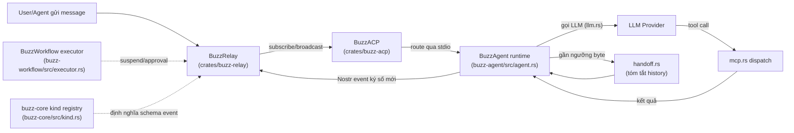
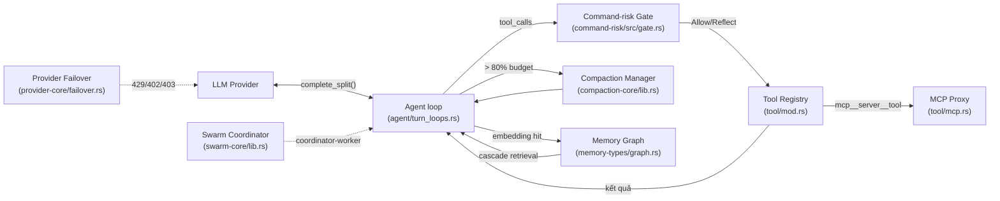
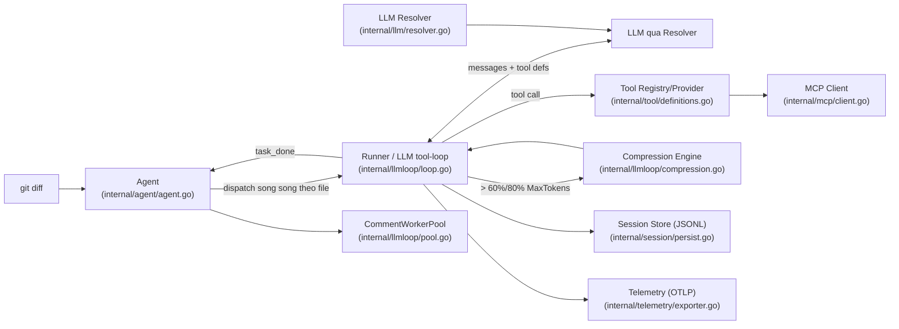
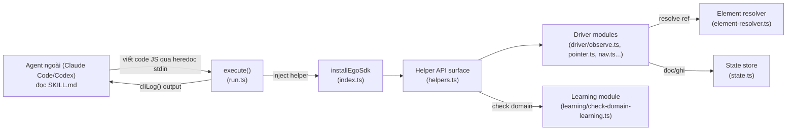

# Weekly Agentic AI Architecture Scan — 2026-08-04

## Executive summary

- Tuần này 4 repo được chọn deep-dive đều là **thứ thiệt** (không phải wrapper/awesome-list): mỗi repo có ít nhất một cơ chế đáng học không tìm thấy ở framework agent phổ thông — ví dụ long-term memory lưu như Nostr event mã hoá (`block/buzz`), memory graph HDBSCAN + BFS cascade retrieval (`1jehuang/jcode`), context compaction 3-vùng với ngưỡng nén sync/async riêng biệt (`alibaba/open-code-review`), và "code-execution as tool interface" thay cho function-calling truyền thống (`citrolabs/ego-lite`).
- Pattern lặp lại đáng chú ý: **3/4 repo** đều tự implement context-window management tinh vi hơn "summarize khi đầy" thông thường (byte-budget + handoff, token-budget 3-zone, sliding+summarize+emergency-truncate) — cho thấy đây đang là bài toán kỹ thuật trọng tâm của agent harness thế hệ mới, không phải model orchestration.
- Giới hạn phương pháp cần lưu ý: môi trường chạy scan này **không có quyền truy cập `gh` CLI / GitHub REST API trực tiếp**, nên không thể chạy đúng truy vấn `search/repositories` với `created:>7d` như thiết kế gốc. Đã dùng GitHub trending (weekly) qua WebFetch làm proxy cho tiêu chí fallback #2 (`pushed:>7d stars:>500`), và cross-verify từng repo bằng cách fetch trực tiếp trang repo để loại rủi ro hallucination từ tool tóm tắt.

## Mục lục

1. [block/buzz](#1-blockbuzz)
2. [1jehuang/jcode](#2-1jehuangjcode)
3. [alibaba/open-code-review](#3-alibabaopen-code-review)
4. [citrolabs/ego-lite](#4-citrolabsego-lite)
5. [Candidates đã xem xét nhưng không chọn](#5-candidates-đã-xem-xét-nhưng-không-chọn)

---

## 1. block/buzz

**Link:** https://github.com/block/buzz

### §1 — Quick context

Nền tảng giao tiếp "hive mind" tự host, nơi người và AI agent là thành viên bình đẳng trong cùng room qua một Nostr relay dùng chung. Stack: Rust (workspace ~27 crates: Axum, Tokio, sqlx/Postgres, deadpool-redis) cho backend/relay; TypeScript/React (Tauri) và Flutter cho client; LLM không cố định (Anthropic, OpenAI, OpenRouter, Databricks, hoặc self-host vLLM/llama.cpp/Ollama). Repo health: 22.0k sao, 2.4k fork, 2.091 commits, 753 issue mở, Apache-2.0, CI đa workflow (`ci.yml`, `docker.yml`, canary multi-OS), có test suite thật gồm golden-transcript regression test và crate `buzz-conformance` riêng.

### §2 — Architecture deep-dive

**A. Component inventory**

- `BuzzRelay` (`crates/buzz-relay`) — relay WebSocket+REST trên Axum, "single source of truth", xác thực NIP-42/NIP-98.
- `buzz-core kind registry` (`crates/buzz-core/src/kind.rs`) — bảng đăng ký mã `kind` Nostr cho mọi loại event, gồm các kind dành riêng cho agent (vd. `KIND_AGENT_PROFILE=10100`, `KIND_AGENT_ENGRAM=30174`, `KIND_AGENT_TURN_METRIC=44200`).
- `BuzzACP` (`crates/buzz-acp/README.md`) — cầu nối relay ↔ tiến trình agent ngoài (goose, codex-acp, claude-agent-acp) qua stdio theo giao thức ACP.
- `BuzzAgent runtime` (`crates/buzz-agent/src/agent.rs`, `llm.rs`, `mcp.rs`, `handoff.rs`, `catalog.rs`) — agent nội bộ tuân thủ ACP: gọi LLM → tool call qua MCP → nạp kết quả → lặp lại.
- `BuzzWorkflow executor` (`crates/buzz-workflow/src/executor.rs`) — state machine thực thi workflow tuần tự, có template resolution, điều kiện `if:` (qua `evalexpr`), cơ chế suspend chờ human approval.
- `BuzzPersona pack` (`crates/buzz-persona/PERSONA_PACK_SPEC.md`) — đặc tả gói persona: identity, system prompt, skill, cấu hình MCP.

**B. Control flow — pattern**: kết hợp **event-driven / pub-sub qua Nostr relay** ở tầng liên lạc, **ReAct loop** trong từng tiến trình agent, và **step-based state machine** cho automation (`buzz-workflow`). Happy path khi agent được mention:
1. Người/agent đăng message lên channel; `buzz-relay` lưu (nguồn sự thật duy nhất) và broadcast qua WebSocket.
2. `buzz-acp` (đang subscribe relay) khớp trigger theo cấu hình persona, route nội dung qua stdio tới tiến trình agent.
3. `agent.rs` gọi LLM provider (`llm.rs`) kèm history + system prompt lấy từ persona pack.
4. Nếu response có tool call, `mcp.rs` dispatch tới MCP server subprocess cô lập, đưa kết quả về history; lặp tối đa 64 tool call/lượt.
5. Khi history gần chạm ngưỡng byte, `handoff.rs` tự tóm tắt, xoá history cũ, chèn bản tóm tắt.
6. Agent xuất phản hồi qua `send_message`, tạo Nostr event ký số mới, đóng vòng lặp về relay cho cả room.

**C. State & data flow**: message giữa thành phần trên relay là **Nostr event đã ký, có schema theo `kind`**; giữa agent process và LLM/MCP là JSON-RPC 2.0 qua stdio. History của agent **hoàn toàn in-memory, per-process, không persist**. State bền vững ở tầng hệ thống nằm ở Postgres + Redis. Context window quản lý bằng **giới hạn byte** (mặc định 1 MiB qua `BUZZ_AGENT_MAX_HISTORY_BYTES`, ước lượng bảo thủ "1 byte = 1 token"), kích hoạt handoff/tóm tắt khi gần ngưỡng.

**D. Tool/capability integration**: qua **MCP** trên stdio (không parse JSON tự do). Tối đa 16 MCP server/session, 128 tool/session; tên tool/server validate bằng whitelist ký tự alphanumeric/`_`/`-`; subprocess cô lập bằng `process_group(0)` + `killpg(SIGKILL)`; biến môi trường truyền cho subprocess theo **allowlist** (`env_clear()` rồi chỉ cho qua danh sách cho phép). Tool tên bắt đầu bằng `_` là "hook" ẩn khỏi LLM.

**E. Memory architecture**: ngắn hạn = history in-process bounded (≤1 MiB). Dài hạn = event `KIND_AGENT_ENGRAM` (30174) — bộ nhớ dài hạn được lưu như **một Nostr event mã hoá sống trong cùng log sự kiện**, không phải vector DB riêng (không thấy bằng chứng embedding/vector search). Cơ chế retrieval cụ thể của engram — không xác định từ code.

**F. Model orchestration**: model chọn theo persona (`.persona.md` frontmatter: `model`, `temperature`...), truyền cho subprocess qua env var. `llm.rs` cài mỗi provider là một nhánh enum Rust; mỗi lượt là một HTTP POST không streaming, tuần tự. Không có bằng chứng về fallback tự động giữa model hay gọi song song nhiều model cùng lượt.

**G. Observability & eval**: `tracing` + `opentelemetry-otlp` (gRPC+TLS) ở workspace level, crate `metrics` với Prometheus exporter, crate `buzz-audit` riêng, tài liệu nhắc "tamper-evident hash chains". Eval: `buzz-agent/tests/golden_transcripts.rs` + `fake_llm.rs` — golden-transcript regression test với LLM giả lập; crate `buzz-conformance` riêng cấp workspace.

**H. Extension points**: **Persona Pack** là cơ chế plug-in chính — bundle độc lập chứa persona, skill, cấu hình MCP server, instruction, lifecycle hook, không cần sửa code `buzz-agent`. Ngoài ra bất kỳ agent runtime nào nói ACP qua stdio (goose, codex, claude code) đều thay thế được `buzz-agent` — điểm mở rộng ở cấp "agent binary", không chỉ tool.

### §3 — Architecture diagram

### §4 — Verdict

Điểm đáng học nhất: bộ nhớ dài hạn của agent được mô hình hoá như **một Nostr event mã hoá** sống chung trong log sự kiện đã ký, audit như mọi message khác — thay vì vector DB tách biệt; cộng với context-budget theo byte (cố ý overestimate) và workflow-as-event có approval gate cho human-in-the-loop. Red flag: `ARCHITECTURE.md` tự thừa nhận rate limiting và approval gate của workflow **chưa hoàn thiện**; vòng lặp tool-call của `buzz-agent` không giới hạn số round tổng; ranh giới bảo mật MCP dựa nhiều vào validate chuỗi ký tự. Câu hỏi mở: cơ chế retrieval thực sự của engram; trace OpenTelemetry có nối liền qua ranh giới relay → acp → agent process hay không.

---

## 2. 1jehuang/jcode

**Link:** https://github.com/1jehuang/jcode

### §1 — Quick context

Coding-agent harness viết bằng Rust, tối ưu mạnh cho RAM/tốc độ khởi động, hỗ trợ swarm đa agent song song và bộ nhớ ngữ nghĩa cục bộ. Stack: Rust (workspace ~85 crate), TUI tự viết, embedding cục bộ qua `tract` (ONNX runtime, model `all-MiniLM-L6-v2` 384-dim), 20+ LLM provider, SDK TypeScript, app iOS, telemetry-worker trên Cloudflare Workers + D1. Repo health: 15.6k sao, 1.7k fork, MIT, 6.672 commits, commit gần nhất (v0.67.0) ngày 03/08/2026. CI đa nền tảng thật (`ci.yml`, `windows-smoke.yml`, `freebsd-smoke.yml`, `ios-testflight.yml`), có tích hợp Terminal-Bench 2.0 để eval.

### §2 — Architecture deep-dive

**A. Component inventory**

- `Agent loop` (`crates/jcode-app-core/src/agent/turn_loops.rs`) — hàm `run_turn()`, vòng lặp chính điều khiển turn.
- `Tool registry` (`crates/jcode-app-core/src/tool/mod.rs`) — `Registry { tools: Arc<RwLock<HashMap<...>>>, skills, compaction }`.
- `Tool trait` (`crates/jcode-tool-core/src/lib.rs`) — trait `Tool` (`name`, `description`, `parameters_schema`, `execute`).
- `Command-risk gate` (`crates/jcode-command-risk/src/gate.rs`) — enum `GateOutcome{Allow, Reflect, Deny}`, struct `Justification` (≥25 ký tự khi risk "Confirm").
- `Compaction manager` (`crates/jcode-compaction-core/src/lib.rs`) — `DEFAULT_TOKEN_BUDGET=200_000`, `COMPACTION_THRESHOLD=0.80`, `CRITICAL_THRESHOLD=0.95`.
- `Memory graph` (`crates/jcode-memory-types/src/graph.rs`) — enum `EdgeKind`(HasTag, InCluster, RelatesTo, Supersedes, Contradicts, DerivedFrom), BFS cascade retrieval có trọng số.
- `Embedding engine` (`crates/jcode-embedding/src/lib.rs`) — `MODEL_NAME="all-MiniLM-L6-v2"` chạy qua `tract_onnx`, cục bộ.
- `Provider failover` (`crates/jcode-provider-core/src/failover.rs`) — enum `FailoverDecision{None, RetryNextProvider, RetryAndMarkUnavailable}`.
- `Planner/task DAG` (`crates/jcode-plan/src/dag/{mod.rs,ops.rs,schedule.rs,sim.rs,mermaid.rs}`).
- `Swarm coordinator` (`crates/jcode-swarm-core/src/lib.rs`) — enum `SwarmRole{Agent, Coordinator, Other}`, `MAX_SWARM_MEMBERS=1000`.
- `MCP proxy tool` (`crates/jcode-app-core/src/tool/mcp.rs`) — `McpManagementTool`, đăng ký tool ngoài dạng `mcp__{server}__{tool}`.
- `Replay` (`crates/jcode-app-core/src/replay.rs`).

**B. Control flow — pattern**: **ReAct loop** ở cấp single-agent; **hierarchical coordinator-worker** ở cấp swarm. Happy path của `run_turn()`:
1. Kiểm tra tín hiệu huỷ, đăng ký turn vào `turn_cancel_registry`.
2. Gọi model qua `provider.complete_split()` kèm messages + tool definitions, nhận stream sự kiện.
3. Trích xuất text và `tool_calls` từ stream.
4. Không có `tool_calls` → thoát vòng lặp, trả `final_text`.
5. Có `tool_calls` → mỗi lệnh đi qua `command-risk::gate` đánh giá rủi ro, rồi `registry.execute()`.
6. Kết quả tool append vào history, `continue` quay lại bước 2.

**C. State & data flow**: message là **typed schema** (Rust struct/enum + serde) — `Message`, `ContentBlock`, `Role`, `Request/ServerEvent` (`#[serde(tag="type")]`). State runtime `Arc<RwLock<...>>`; persist tại `~/.jcode/memory/` dạng JSON + embedding. Context window: **hybrid sliding-window + summarization + emergency truncation** — giữ 10 turn gần nhất nguyên văn (`RECENT_TURNS_TO_KEEP=10`), tóm tắt nền khi vượt 80% budget, hard-compact đồng bộ khi vượt 95%.

**D. Tool/capability integration**: đăng ký qua trait `Tool` + `Registry::register()`, expose bằng **native function-calling** (schema JSON qua `parameters_schema()`, tự chèn field `intent` bắt buộc). Có **MCP** thật: connect/disconnect/list/reload server, tool ngoài nạp động với tên `mcp__{server}__{tool}`. Sandbox/validation: lớp `command-risk::gate` bắt model tự viết `Justification` ≥25 ký tự khi risk "Confirm"; risk "Catastrophic" bị `Deny` vĩnh viễn — không dùng LLM-judge thứ hai.

**E. Memory architecture**: đồ thị bộ nhớ (`jcode-memory-types::graph`) — node Tag (thủ công), Cluster (tự động qua HDBSCAN trên embedding), Edge ngữ nghĩa có trọng số. Retrieval kiểu **cascade**: một embedding hit kích hoạt BFS có trọng số lan ra node liên quan (min-heap top-k). Pipeline chạy bất đồng bộ qua mpsc, chậm hơn agent chính một turn, không chặn main loop. Embedding sinh cục bộ, tách biệt model chính.

**F. Model orchestration**: failover tuần tự đa provider — lỗi context → retry cùng provider; 429/402 → đánh dấu tạm ngưng, chuyển provider kế; 401/403 → tương tự. Không có bằng chứng ensemble/song song nhiều model cho cùng câu hỏi.

**G. Observability & eval**: telemetry **custom** (không phải OpenTelemetry/Langfuse), gửi tới Cloudflare Worker + D1, chỉ thu metric thô. Có cơ chế **replay** phiên. Eval thật qua Terminal-Bench 2.0/Harbor (`scripts/run_terminal_bench_harbor.sh`).

**H. Extension points**: provider mới qua crate riêng (`jcode-provider-anthropic`, `jcode-provider-openai-runtime`...). Tool ngoài không cần sửa Rust — qua MCP (`tool mcp connect ...`), nạp động vào registry. Cơ chế plugin tool trait tuỳ chỉnh sâu hơn — không xác định rõ từ code đã xem.

### §3 — Architecture diagram

### §4 — Verdict

Điểm đáng học cụ thể: (1) "reflection gate" trong `command-risk/gate.rs` — thay vì LLM-judge thứ hai duyệt lệnh nguy hiểm, bắt chính model sinh lệnh viết justification ≥25 ký tự, tiết kiệm latency/API call; (2) memory graph kết hợp HDBSCAN cluster + BFS cascade-retrieval có trọng số, chạy bất đồng bộ với embedding cục bộ — thiết kế nghiêm túc, không phải RAG hời hợt; (3) swarm optimistic-concurrency (không khoá, xung đột giải quyết qua giao tiếp trực tiếp giữa agent) khác biệt với orchestrator tập trung thông thường. Red flag: monorepo ~85 crate rất rộng (ios app, desktop2 có thể làm loãng lõi agent); nhiều comment kiểu "issue #428/#732" cho thấy lịch sử vá race-condition dày quanh interrupt/cancel; không có tracing chuẩn ngành (OpenTelemetry). Câu hỏi mở: cơ chế "self-dev" (agent tự sửa code, rebuild, reload binary đang chạy) có sandbox riêng không.

---

## 3. alibaba/open-code-review

**Link:** https://github.com/alibaba/open-code-review

### §1 — Quick context

Công cụ code review dùng LLM agent kết hợp pipeline xác định (deterministic) để sinh comment chính xác từng dòng, có ruleset đa ngôn ngữ tích hợp sẵn. Stack: Go, phân phối qua npm, tương thích OpenAI & Anthropic API, có VSCode extension, GitHub Action, MCP client tích hợp sẵn. Repo health: 18.5k sao, 1.2k fork, 464 commits, 45 issue mở, 32 PR mở, Apache-2.0, CI thật (`ci.yml`, `release.yml`), test co-located gần như mọi file (`*_test.go`).

### §2 — Architecture deep-dive

**A. Component inventory**

- `Agent` (`internal/agent/agent.go`) — orchestrator: parse diff → plan theo file → dispatch subtask song song → thu thập comment.
- `Runner/LLM tool-loop` (`internal/llmloop/loop.go`) — vòng lặp hội thoại chính, `RunPerFile(ctx, messages, newPath)`, dispatch qua `executeToolCall`.
- `Compression engine` (`internal/llmloop/compression.go`) — quản lý context window bằng 3 vùng (frozen/compress/active).
- `CommentWorkerPool` (`internal/llmloop/pool.go`) — worker pool hậu xử lý comment bất đồng bộ, semaphore mặc định 8.
- `Tool Registry/Provider` (`internal/tool/definitions.go`) — interface `Provider{Tool(); Execute()}`, "frozen registry" (panic nếu register sau khi freeze).
- Tool cụ thể: `code_comment.go`, `code_search.go`, `file_read.go`, `file_find.go`, `file_read_diff.go`.
- `MCP client` (`internal/mcp/client.go`, `provider.go`) — adapter tool MCP ngoài thành `tool.Provider` nội bộ, tránh trùng tên tool.
- `Diff parser & positioning` (`internal/diff/parser.go`, `hunk.go`, `git.go`, `relocation.go`) — định vị dòng chính xác.
- `LLM resolver` (`internal/llm/resolver.go`, `providers.go`, `client.go`).
- `Session/state store` (`internal/session/persist.go`, `manifest.go`, `history.go`, `resume.go`) — JSONL log, resume phiên bị gián đoạn.
- `Telemetry` (`internal/telemetry/exporter.go`, `span.go`, `metrics.go`) — OpenTelemetry OTLP.

**B. Control flow — pattern**: **pipeline orchestrator xác định bọc một ReAct tool-use loop chạy song song theo file** (hybrid deterministic-pipeline + LLM-agent). Happy path:
1. `Agent.Run` parse git diff, xác định danh sách file/"bundle" liên quan (logic cứng, không qua LLM).
2. Mỗi file/bundle dispatch một subtask chạy song song.
3. Mỗi subtask gọi `llmloop.Runner.RunPerFile`: gửi messages + tool definitions tới LLM.
4. LLM trả tool calls → `executeToolCall` thực thi (đọc file, search code, ghi comment) → append vào lịch sử qua `addNextMessage`.
5. Lặp lại tới khi model gọi tool `task_done` state "DONE", hoặc vượt `MaxToolRequestTimes`/ngưỡng nén.
6. `Agent` thu thập comment từ mọi subtask; worker pool hậu xử lý bất đồng bộ, ghi kết quả cuối.

**C. State & data flow**: message là **typed schema** `llm.Message` (factory `NewTextMessage`, `NewToolCallMessage`, `NewToolResultMessage`), không phải string thô. State: JSONL tại `$HOME/.opencodereview/sessions/<repo-path>/<session-id>.jsonl`, mỗi record có UUID + parentUUID để chain lại toàn luồng. Context window: nén 3 vùng — frozen (2 message đầu giữ nguyên), compress zone (bị tóm tắt), active zone (giữ K round gần nhất); nén nền bất đồng bộ ở 60% `MaxTokens`, nén đồng bộ bắt buộc ở 80%.

**D. Tool/capability integration**: tool đăng ký qua interface `Provider` vào `Registry` có thể "freeze"; MCP tool ngoài adapter hoá cùng interface rồi convert sang `llm.ToolDef` — **native function-calling** chuẩn OpenAI/Anthropic. Không xác định từ code vị trí JSON schema tham số tường minh của từng tool. Không có bằng chứng về sandbox thực thi (không xác định).

**E. Memory architecture**: chỉ có short-term memory cấp hội thoại (mảng message per-file) với compaction 3 vùng ở mục C — không có long-term memory/vector DB. Session JSONL là audit log + checkpoint resume, không phải bộ nhớ truy xuất ngữ nghĩa.

**F. Model orchestration**: `resolver.go` có **chuỗi fallback theo thứ tự ưu tiên**: provider chỉ định tường minh → file config `~/.opencodereview/config.json` → biến môi trường `OCR_LLM_*` → biến môi trường Claude Code (`ANTHROPIC_*`) → shell RC files. Không có bằng chứng multi-model routing theo vai trò (dùng 1 model/run). Song song hoá ở 2 lớp: dispatch subtask theo file, và worker pool hậu kỳ comment.

**G. Observability & eval**: OpenTelemetry thật (OTLP gRPC + HTTP, console exporter khi debug) kết hợp session JSONL → cho phép replay toàn luồng (request/response LLM, tool_call, kết quả). Có repo benchmark riêng `alibaba/aacr-bench` nhưng không xác nhận liên kết trực tiếp trong code của `open-code-review`.

**H. Extension points**: custom ruleset theo thứ tự ưu tiên `--rule` CLI > `.opencodereview/rule.json` repo-level > `~/.opencodereview/rule.json` user-level > default, có `merge_system_rule`. Custom LLM qua env `OCR_LLM_URL/TOKEN/MODEL` hoặc config file. Custom tool qua MCP server pluggable. Có thêm `plugins/`, `extensions/vscode`, `action.yml` (điểm mở rộng IDE/CI, nội dung chưa kiểm chứng chi tiết).

### §3 — Architecture diagram

### §4 — Verdict

Điểm đáng học cụ thể: nén ngữ cảnh 3 vùng (frozen/compress/active) với ngưỡng nén bất đồng bộ (60%) và đồng bộ bắt buộc (80%) là giải pháp context-window tinh vi hơn "summarize toàn bộ" thông thường; kiến trúc hybrid pipeline-xác-định + ReAct-loop per-file (không để LLM tự quyết toàn bộ) là khác biệt thực chất, không chỉ marketing. Red flag: không tìm thấy sandbox cho tool execution; schema JSON tham số tool không lộ rõ ở nơi kỳ vọng; không có model-role routing dù README quảng cáo "Agent" khá mạnh; liên kết với benchmark AACR-Bench không xác nhận được trong chính repo. Câu hỏi mở: vị trí thật của tool schema JSON; logic "smart file bundling" nằm ở đâu trong `internal/diff`; cơ chế `internal/delegate` hoạt động thế nào.

---

## 4. citrolabs/ego-lite

**Link:** https://github.com/citrolabs/ego-lite

### §1 — Quick context

Trình duyệt Chromium chia sẻ phiên đăng nhập thật của người dùng cho AI agent (Claude Code, Codex, Cursor) tự động hoá thao tác web mà không làm phiền tab người dùng. Stack: TypeScript/Node.js (≥22), điều khiển trực tiếp qua Chrome DevTools Protocol (dependency runtime duy nhất: `acorn`), build bằng esbuild/rollup; không tự chứa LLM. Repo health: 8.1k sao, 395 fork, MIT, 239 commit trên `main`, CI thật (`ci.yml`: `npm ci` → `npm test` → `validate:site-skills`), test `.test.mjs` song song hầu hết file `.ts`.

### §2 — Architecture deep-dive

**A. Component inventory**

- `installEgoSdk` (`package/ego-browser/src/index.ts`) — cài SDK vào `globalThis`, bọc helper bất đồng bộ, định tuyến `console.log` qua sink của host.
- `CLI runtime / execute()` (`package/ego-browser/src/run.ts`) — nhận code JS agent gửi qua stdin, dựng `AsyncFunction` động và thực thi.
- `Helper API surface` (`package/ego-browser/src/helpers.ts`) — "Playwright-style page facade" (`click`, `fill`, `goto`, `snapshot`, `screenshot`...).
- `Driver modules` (`package/ego-browser/src/driver/{pointer,keyboard,nav,observe,locator,files,downloads,screencast,waits}.ts`) — mỗi module xử lý một nhóm thao tác CDP.
- `Element resolver` (`package/ego-browser/src/element-resolver.ts`) — phân giải "ref" (backendNodeId/role/name/frameId) hoặc CSS/XPath thành phần tử DOM thật, fallback khi ref stale.
- `Observe/snapshot driver` (`package/ego-browser/src/driver/observe.ts`) — sinh snapshot dạng text thân thiện agent (kèm ref ổn định) hoặc screenshot PNG.
- `State store` (`package/ego-browser/src/state.ts`) — object in-memory giữ sessionId, targetId, timeout, cờ CDP network domain.
- `Learning/memory module` (`package/ego-browser/src/learning/check-domain-learning.ts`) — kiểm tra/nạp "domain learning" theo tên miền.
- `Site-skill learnings store` (`skills/ego-browser/learnings/{google,x-com}/manifest.json`).
- `Agent-skill descriptor` (`skills/ego-browser/SKILL.md`) — hướng dẫn agent gọi tool qua heredoc Bash.

**B. Control flow — pattern**: **không phải** agent loop nội bộ ReAct/planner-executor — đây là lớp **"tool-as-code-execution"** cho agent ngoài điều khiển trình duyệt. Happy path:
1. Agent CLI đọc `SKILL.md`, biết cách gọi `ego-browser nodejs <<'EOF' ... EOF` qua Bash tool.
2. Agent viết một đoạn JS gọi helper (`goto`, `snapshot`, `click`...).
3. `run.ts` nhận code qua stdin, dựng `AsyncFunction` với helper đã inject vào context.
4. Code chạy, mỗi lệnh helper gọi CDP thật để thao tác trình duyệt.
5. Kết quả trả về qua `cliLog()` (console.log route qua sink định dạng riêng).
6. Agent đọc output text, quyết định bước tiếp theo — vòng lặp nằm ở phía agent ngoài, không phải trong repo này.

**C. State & data flow**: message giữa agent và tool là **code JS thô** (không phải JSON schema function-calling chuẩn) — mô hình "code execution as tool interface". State phiên lưu **in-memory** trong `state.ts`; "task space" quản lý qua `useOrCreateTaskSpace/handOffTaskSpace/takeOverTaskSpace`, persistent qua nhiều lượt heredoc trong cùng phiên trình duyệt. Không có context-window management (không có LLM trong repo này).

**D. Tool/capability integration**: không dùng native function-calling hay MCP — agent viết code JS trực tiếp gọi helper đã cài vào global scope ("code execution" tool-use). Trỏ phần tử DOM qua hệ ref (backendNodeId + role/name fallback) trong `element-resolver.ts`, hỗ trợ CSS/XPath/role/text selector. Không tìm thấy domain-allowlist hay permission-prompt trong code đã đọc — xem red flag ở §4.

**E. Memory architecture**: cơ chế "learning" theo domain — `manifest.json` trong `skills/ego-browser/learnings/<domain>/` lưu ghi chú/"tools" đã học cho từng site, khớp domain qua `domainMatches()` (hỗ trợ wildcard). Bộ nhớ dài hạn dạng file, tra cứu theo hostname — không phải vector DB/embedding.

**F. Model orchestration**: không xác định từ code — repo không chứa logic gọi LLM; model nằm ở agent CLI bên ngoài, ego-lite chỉ cung cấp registration cho từng provider (`skills/ego-browser/agents/openai.yaml`, `.claude-plugin/marketplace.json`).

**G. Observability & eval**: có `npm run validate:site-skills` trong CI để validate format learning; không thấy tracing kiểu OpenTelemetry/Langfuse trong các file đã đọc.

**H. Extension points**: thêm "site skill"/learning mới dưới `skills/ego-browser/learnings/<domain>/manifest.json`; cài qua `npx skills add citrolabs/ego-lite` cho các agent CLI khác nhau; mỗi agent CLI có file cấu hình riêng (`agents/openai.yaml` cho Codex, `.claude-plugin/marketplace.json` cho Claude Code).

### §3 — Architecture diagram

### §4 — Verdict

Điểm đáng học: mô hình "code-execution tool interface" thay vì function-calling/MCP truyền thống — agent viết cả một script JS nhiều bước thay vì gọi từng tool riêng lẻ, giảm round-trip token; "task space" cho phép agent và người dùng chia sẻ song song cùng trình duyệt đã đăng nhập; hệ "learned site-skill" theo domain là cache kỹ năng tái sử dụng khá thực tế. Red flag: **không tìm thấy domain-allowlist hay permission-prompt** trong lớp điều khiển DOM/CDP đã đọc — với agent chạy code JS tuỳ ý trong trình duyệt đã đăng nhập (cookie/session thật), rủi ro prompt-injection từ trang web dẫn tới hành động ngoài ý muốn trên tài khoản thật là đáng quan tâm. Câu hỏi mở: mã nguồn lõi trình duyệt (Electron/Chromium wrapper) có nằm trong repo công khai này không, hay chỉ có lớp `ego-browser` Node.js helper; cơ chế cấp quyền/allowlist domain (nếu có) nằm ở đâu.

---

## 5. Candidates đã xem xét nhưng không chọn

Từ danh sách GitHub trending tuần này (proxy cho tiêu chí "significantly updated, stars lớn"), các candidate sau được cân nhắc nhưng loại khỏi deep-dive:

- **different-ai/openwork** (~20.7k sao) — đã deep-dive đầy đủ nhưng loại ở vòng chọn cuối: lõi agent loop/planner thực sự bị uỷ quyền hoàn toàn cho dependency ngoài `@opencode-ai/sdk`, không nằm trong repo; phần "kiến trúc" hấp dẫn nhất (memory bank, `execute_capability`) chỉ là tài liệu thiết kế, chưa xác minh được code triển khai trong repo public. Giá trị nghiên cứu thật nằm ở lớp orchestration/plugin-interception (vá schema Anthropic, adaptive-thinking payload) — không đủ trọng lượng để cạnh tranh với 4 repo trên trong cùng 1 tuần.
- **microsoft/AI-For-Beginners** — loại vì là course/tutorial material, không phải kiến trúc production.
- **andrewyng/aisuite** — loại vì là wrapper mỏng (unified interface tới nhiều provider), không có orchestration/insight kiến trúc riêng.
- **zhaoxuya520/reverse-skill** — loại vì thực chất là một "skill router pack" (tập hợp prompt/skill định tuyến cho reverse engineering/pentest), không phải kiến trúc agent orchestration, sát với dạng "prompt-engineering framework trá hình" trong tiêu chí loại trừ.
- **moeru-ai/airi**, **earthtojake/text-to-cad**, **virgiliojr94/book-to-skill**, **ayghri/i-have-adhd** — được liệt kê trong bước identify ban đầu nhưng không đủ thời gian deep-dive trong tuần này; không loại trừ khả năng phù hợp, cần xem lại ở tuần sau nếu vẫn active.

---

*Phương pháp: candidate list lấy từ GitHub trending (`since=weekly`) qua WebFetch (không có quyền `gh` CLI/GitHub API trực tiếp trong môi trường chạy scan này), sau đó cross-verify từng repo bằng cách fetch trực tiếp trang repo/README/source file thật trước khi viết deep-dive — không có claim kiến trúc nào trong 4 mục trên thiếu bằng chứng file path cụ thể.*
