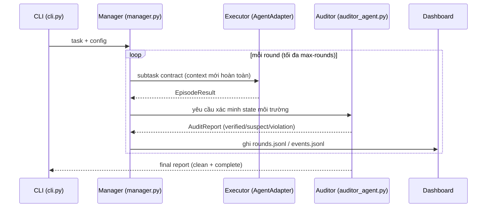
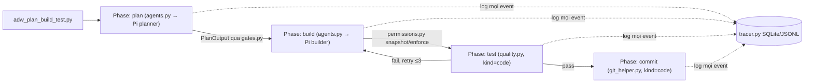
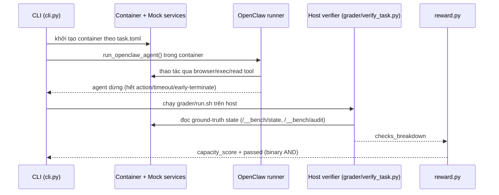
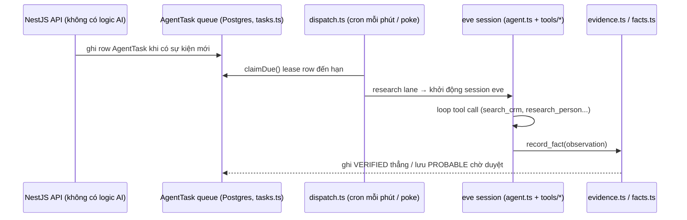

# Weekly Agentic AI Scan — 2026-08-05

**Nguồn dữ liệu:** GitHub search API (`created:>2026-07-29 stars:>200`, query `agent OR multi-agent OR agentic`) trả về 6 kết quả — đủ ngưỡng ≥4 nên không cần fallback sang `pushed:>7d stars:>500`. Cả 6 đều vượt qua vòng vetting (không phải fork, không phải awesome-list/tutorial, có source code thật, ≥500 LOC). Do giới hạn "max 4 repos" của báo cáo, 4 repo được chọn deep-dive dựa trên relevance filter (novel architecture / eval methodology / production engineering / có technical writeup); 2 repo còn lại được ghi nhận ngắn ở mục "Honorable mentions".

**Executive summary:**
- Ba pattern orchestration khác hẳn nhau xuất hiện cùng tuần: **Manager→fresh-context-Executor→read-only-Auditor** (LongHorizon-Harness) giải quyết context-window bằng cách *không* cho executor tích lũy lịch sử thay vì summarize; **deterministic-workflow-with-bounded-agent-nodes** (super-simple-software-factory) dùng git-diff snapshot/rollback làm cơ chế "sandbox" thay thế; **single-agent + durable task-queue** (trycompai/crm) tách hẳn "intelligence" ra khỏi API layer.
- RealReplicaBench là ví dụ hiếm về eval methodology tự phê bình: chấm điểm dựa trên ground-truth state của mock service (không tin self-report của agent), nhưng chính README lại thừa nhận leaderboard "Accio" không thể reproduce vì harness đó không được public.
- Một phát hiện đáng chú ý ngoài lề: khi review 0xwilliamortiz/ratchet, README quảng cáo "115 tests" nhưng repo public không có một file test nào — nhắc nhở rằng star count cao (430⭐ chỉ sau 4 ngày) không đồng nghĩa với độ tin cậy của tuyên bố kỹ thuật.

## Mục lục
1. [AMAP-ML/LongHorizon-Harness](#amap-ml-longhorizon-harness)
2. [disler/super-simple-software-factory](#disler-super-simple-software-factory)
3. [Accio-Lab/RealReplicaBench](#accio-lab-realreplicabench)
4. [trycompai/crm](#trycompai-crm)
5. [Honorable mentions (không deep-dive)](#honorable-mentions)
6. [Self-check](#self-check)

---

## AMAP-ML/LongHorizon-Harness

**Repo:** https://github.com/AMAP-ML/LongHorizon-Harness · Paper: arXiv 2608.01964

### §1 — Quick context
Harness bọc ngoài các coding/computer-use agent có sẵn (Claude Code, Codex CLI, OpenClaw) để giữ task dài-hơi đi đúng hướng bằng một vòng lặp Manager→Executor→Auditor xác minh độc lập, thay vì để agent tự báo cáo.

Tech stack: Python ≥3.10, `asyncio`, không có runtime dependency bắt buộc (base install rỗng theo `pyproject.toml`), shell ra `claude`/`codex`/`openclaw` CLI, dashboard HTTP tự viết, state lưu JSONL phẳng.

Repo health: 217⭐, MIT license, chỉ 2 commit — publish một lần trong khoảng 3 tiếng ngày 2026-08-04 (created và pushed cùng ngày). Có 1 CI workflow (`release.yml`, chỉ build/publish PyPI khi tag `v*`) — **không có CI chạy test**, và **không có thư mục `tests/`**.

### §2 — Architecture deep-dive

**A. Component inventory**
- `CLI` (`src/lh_harness/cli.py`) — build `HarnessConfig`, environment, agent adapters.
- `Manager` (logic trong `src/lh_harness/manager.py`, hàm `run()`) — điều phối vòng lặp, quyết định routing GUI/CLI/ask-user/done.
- `AuditorAgent` (`src/lh_harness/auditor_agent.py`) — parse output tự nhiên của auditor thành `AuditReport` có cấu trúc (status, integrity findings, ledger xóa artifact giả).
- `RolePrompts` (`src/lh_harness/role_prompts.py`) — prompt template cho 5 vai trò (manager, executor GUI/CLI, auditor GUI/CLI).
- `Types/State schema` (`src/lh_harness/types.py`) — dataclass `ExecResult`, `EpisodeBudget`, `ManagedRound`, `AuditReport`.
- `AgentAdapter` (`src/lh_harness/adapters/{base,claude_code,codex,openclaw,cli_agent}.py`) — Protocol `run_episode()`, shell ra CLI backend thật (vd. `claude --print --output-format stream-json --dangerously-skip-permissions`).
- `Environment` (`src/lh_harness/environment/{base,local,ssh,docker}.py`) — Protocol `exec/screenshot/upload/download`.
- `Dashboard` (`src/lh_harness/dashboard/{server,state,gate}.py`) — web UI đọc `rounds.jsonl`/`events.jsonl`, xử lý human-approval gate.

**B. Control flow — Manager→Executor→Auditor, state-machine-per-round**
1. `cli.py` đọc task, tạo run directory, build `Environment` + `AgentAdapter` cho từng vai trò.
2. Mỗi round: **Manager** nhận task gốc + state hiện tại + *chỉ* các auditor report được subtask contract hiện tại trích dẫn, xuất ra state mới + quyết định routing.
3. **Executor** (GUI hoặc CLI) nhận subtask contract, chạy với **context hoàn toàn mới mỗi round** (không kế thừa lịch sử chat) qua `AgentAdapter.run_episode()`.
4. **Auditor** (read-only) tự kiểm tra state môi trường (file, log, screenshot), sinh verdict có cấu trúc qua `infer_report_status()`/`infer_integrity_findings()`.
5. Chỉ fact đã được auditor xác minh mới được ghi vào `rounds.jsonl` (append-only); `_human_gate()` tạm dừng khi cần người duyệt.
6. Lặp lại (mặc định tối đa 30 round) tới khi auditor báo "clean + complete".

**C. State & data flow — điểm khác biệt cốt lõi**
State lưu ngoài (JSONL phẳng, không DB), không tăng trưởng vô hạn theo kiểu context truyền thống. Thay vì summarize lịch sử dài, harness **lọc bằng trích dẫn tường minh**: Manager chỉ thấy auditor report được subtask contract hiện tại tham chiếu; độ dài bị chặn cứng qua `role_history_chars`, `role_verified_context_chars`, `auditor_output_chars`. Không có LLM-generated running summary nào được tìm thấy trong code.

**D. Tool/capability integration**
Điều khiển CLI/shell trực tiếp qua `Environment.exec()`. Điều khiển GUI **không được implement trong harness** — được giao hoàn toàn cho một MCP server computer-use bên ngoài do người dùng tự cung cấp (`--mcp-config`); harness tự nó chỉ chụp screenshot để audit (`gnome-screenshot`/ImageMagick `import`). Không có sandbox cho environment local — lệnh chạy trực tiếp trên host shell.

**E. Memory architecture**
Không có memory module/vector store dạng embedding. "Bộ nhớ" thực chất là task-state có cấu trúc + citation, không phải semantic retrieval — thiết kế "verify-and-cite" thay vì "summarize".

**F. Model orchestration**
Model-agnostic qua `AgentAdapter` Protocol; mỗi vai trò (Manager/Executor GUI/CLI/Auditor GUI/CLI) chọn model/backend riêng qua CLI flag. Benchmark headline dùng Qwen 3.7-Plus làm backbone + Claude Code làm backend thực thi. Không có evidence về fallback tự động hay chạy song song nhiều model.

**G. Observability & eval**
Mỗi run có thư mục riêng chứa `events.jsonl`, audit report, raw trajectory (Claude stream-json). Dashboard web đọc trực tiếp các file này. Scoring benchmark dùng lại harness gốc của WeaveBench/OSWorld-V2 (vendor nguyên bộ evaluator).

**H. Extension points**
Thêm backend mới: implement `AgentAdapter` Protocol. Thêm environment mới: implement `Environment` Protocol. Đổi model/backend theo vai trò: CLI flag, không cần sửa code.

### §3 — Architecture diagram

### §4 — Verdict
**Novel:** tách "fresh-context executor" khỏi "state được xác minh độc lập" — giải quyết context-window growth bằng cách không cho nó tăng trưởng, thay vì nén nó. Auditor read-only chuyên bắt fabricated evidence (kể cả ảnh chụp giả) là một góc nhìn verification-first khá hiếm trong pattern planner/executor phổ biến.

**Red flags:** không có test suite/CI test, chỉ 2 commit, publish trong 3 tiếng — số liệu benchmark là self-reported, chưa được cộng đồng replicate độc lập. "Computer-use harness" hơi overstate vì phần perception/actuation GUI thực chất giao hết cho MCP server bên ngoài.

**Câu hỏi mở:** MCP server computer-use "compatible" cụ thể là gì, có được cung cấp mẫu nào không? Cơ chế trích dẫn của Manager có bị lỗi under-cite (bỏ sót state quan trọng) không?

---

## disler/super-simple-software-factory

**Repo:** https://github.com/disler/super-simple-software-factory (branch `main` = "the skill alone"; có branch `example` riêng chứa demo/run traces, chưa được review trong báo cáo này)

### §1 — Quick context
Một Claude Code "skill" tự đóng gói vào repo mục tiêu, biến workflow phát triển phần mềm thành đồ thị Python xác định (deterministic) với các node là agent bị giới hạn phạm vi ghi (bounded).

Tech stack: Python (uv-run PEP 723 inline-dependency scripts, Pydantic, Rich), SQLite WAL cho tracing, Vue 3 + Vite + Bun cho visualizer, agent backend là CLI bên thứ ba "Pi" (`mariozechner/pi-coding-agent`), model đa nhà cung cấp (Gemini/Fireworks-Kimi/OpenAI qua OpenRouter).

Repo health: 362⭐, 82 forks, MIT, tạo 2026-08-02, push gần nhất 2026-08-04. **Không có `.github/workflows` (không CI), không có `tests/`**; gate test mặc định (`quality.py`) là placeholder luôn exit 0 — README tự gọi đây là "theater" tới khi người dùng wire lệnh thật.

### §2 — Architecture deep-dive

**A. Component inventory**
- `Run/phase runner` (`adw_modules/runner.py`) — context manager `run.phase(...)`, primitive lõi của toàn hệ thống.
- `Agent execution engine` (`adw_modules/agents.py`) — render prompt → gọi Pi → parse/retry → áp gate → enforce permission.
- `Agent adapter — Pi` (`adw_modules/agent_pi.py`, 286 dòng) — stream subprocess `pi -p --mode json`.
- `Agent adapter — Claude Code` (`adw_modules/agent_cc.py`, 15 dòng) — stub, raise runtime error ("v1 chỉ hỗ trợ Pi").
- `Validation gates` (`adw_modules/gates.py`) — `artifacts_exist`, `files_non_empty`, `json_parses`, `diff_matches_claims`, `verdict_consistent`, `tests_pass(command)`.
- `Permission/guardrail enforcement` (`adw_modules/permissions.py`) — `snapshot()`/`enforce()` diff git tree trước/sau, rollback nếu agent ghi ngoài allowlist.
- `Deterministic quality runner` (`adw_modules/quality.py`) — phase `kind="code"`, không tốn context của agent.
- `Tracer` (`adw_modules/tracer.py`, 271 dòng) — SQLite WAL 7 bảng + mirror JSONL.
- `Typed data contracts` (`adw_modules/data_types.py`, 447 dòng) — `EnvelopeBase`, `PhaseParams`, `AgentCall`, `GateReport`.
- 12 workflow entry point (`adws/adw_plan_build_test.py`, v.v.) — mỗi file 40-180 dòng theo chủ đích README.
- `Visualizer` (`.claude/skills/sssf/apps/visualizer/`) — Vue+Bun, đọc trực tiếp SQLite qua 1 câu SQL polling.

**B. Control flow — deterministic-workflow-with-bounded-agent-nodes**
Đây là design tường minh, không phải suy diễn: README nói thẳng "Deterministic Python owns the graph. Coding agents are bounded nodes inside it."
1. Script (`adw_plan_build_test.py`) khai báo `REQUIRED_AGENTS`, validate trước khi spawn bất kỳ agent nào.
2. Phase "plan" (`kind="agent", owner="planner"`) → planner ghi `specs/`, trả về `PlanOutput` qua gate `artifacts_exist`/`files_non_empty`.
3. Phase "build" → builder implement, trả `BuildOutput`; `permissions.enforce()` diff git tree, rollback phần ghi ngoài allowlist.
4. Phase "test" (`kind="code"`) → chạy lệnh test thật qua `quality.py`; nếu fail, re-prompt lại **cùng session** builder tối đa `MAX_FIX_LOOPS=3` (không phải cold-restart).
5. Phase "commit" (`kind="code", owner="git"`) → chỉ commit khi test xanh; agent không bao giờ tự chạy `git commit`.
6. `run.finish(accepted=...)` gắn kết phase-success, DB status, exit code làm một, tránh trạng thái mâu thuẫn.

**C. State & data flow**
Message giữa các phase là Pydantic `EnvelopeBase` (status, summary, `artifacts: list[str]`, `notes_for_next_agent`) — schema tường minh, không phải string tự do. State lưu tại `{data_dir}/sessions/{adw_id}/{agent}/` (raw output JSONL + envelope JSON); `agent_map.json` map tên agent → Pi session id, cho phép **resume cùng context window** giữa các lần gọi ADW thay vì cold-start. Context management: `agent_pi.py` "mirror compaction logic của Pi", và correction chỉ tốn "một message" vì re-prompt cùng session thay vì restart toàn bộ.

**D. Tool/capability integration**
Tool = allowlist YAML theo từng agent trong `sssf.config.yaml`. "Bounded" được thực thi bằng 3 cơ chế độc lập, không phải sandbox: (1) gate hậu kiểm (`gates.py`), (2) permission enforcement bằng git-diff snapshot/rollback (`permissions.py` — bắt được cả trường hợp agent dùng `bash` để chạy `git checkout` revert lại quality check, một sự cố thật được ghi trong docstring), (3) giới hạn retry/timeout (`MAX_FIX_LOOPS=3`, timeout subprocess 600s). Không có sandbox thật — agent chạy bash/write trực tiếp trên branch hiện tại, đây là giới hạn được README tự thừa nhận.

**E. Memory architecture**
Không tìm thấy vector store/embedding/RAG. `agent_map.json` chỉ mang tính session-continuity (map sang Pi session id), không phải memory subsystem dài hạn.

**F. Model orchestration**
Roster đa model khai báo YAML: `planner` → Fireworks Kimi-K3 (thinking: high), `builder`/`scout` → Gemini 3.6 Flash (medium), `reviewer` → GPT-5.6-terra (high), `documenter` → GPT-5.6-luna. `agents.validate()` chỉ check *cú pháp* `provider/model-id`, không check connectivity — key sai sẽ fail giữa chừng, không fail lúc khởi động. Không có fallback tự động, không có song song hóa phase (chạy tuần tự trong 1 `Run`).

**G. Observability & eval**
`tracer.py` ghi SQLite WAL (7 bảng: sessions/phases/events/envelopes/gate_results/agent_sessions/processes) + mirror JSONL, mỗi event mang `adw_id`/`phase_id`/`parent_id` để nest span. Visualizer đọc bằng đúng 1 câu SQL polling (`select * from events where adw_id=? and rowid>? ...`), không websocket, không server ingest riêng — thiết kế observability tối giản đáng học hỏi độc lập với phần còn lại.

**H. Extension points**
Agent mới: thêm entry `agents:` + file prompt. Workflow mới: copy/sửa `adw_*.py` hoặc dùng `scripts/make_adw.py`. Gate mới: thêm hàm khớp chữ ký `gate(envelope, run) -> GateReport`. Backend coding-agent mới: `agent_cc.py` là seam có sẵn nhưng hiện chưa hoạt động.

### §3 — Architecture diagram

### §4 — Verdict
**Novel:** permission enforcement bằng git-diff snapshot + auto-rollback là một "detect-and-revert" cụ thể, khả thi thay cho sandbox thật — đáng nghiên cứu chính vì nó là giải pháp *đủ dùng* chứ không phải lý tưởng. Correction loop re-prompt cùng session (không cold-restart) là bằng chứng code thật cho khẩu hiệu "correction rẻ hơn restart", không chỉ marketing.

**Red flags:** gate test mặc định là "theater" (luôn pass) tới khi tự wire; không sandbox thật (chỉ detect-and-rollback file, không chặn network/exfiltration); `coding_agent: claude_code` được quảng cáo là extension point nhưng thực chất raise lỗi; không CI, không test suite cho chính framework; repo mới 3 ngày tuổi, dường như là release phối hợp cùng video YouTube.

**Câu hỏi mở:** branch `example` (không được review) có chứa run trace thật chứng minh pattern hoạt động end-to-end hay không? Có benchmark định lượng nào so sánh với "one big agent" baseline không — hiện tại lập luận trong README hoàn toàn là rhetorical, không đo lường trong code.

---

## Accio-Lab/RealReplicaBench

**Repo:** https://github.com/Accio-Lab/RealReplicaBench

### §1 — Quick context
Benchmark 107 task đo agent dài-hơi (long-horizon) trên các bản sao (replica) trạng thái đầy đủ của dịch vụ SaaS thật (Amazon SP-API, Gmail, Stripe, Jira...), chấm điểm chủ yếu bằng script deterministic đọc thẳng ground-truth state của mock, không tin self-report của agent.

Tech stack: Python 3.11+ (gần như chỉ dùng stdlib), Docker (image pin theo digest cụ thể), OpenClaw làm agent runtime/browser driver (qua Chrome DevTools relay), SQLite cho state mock CLI, GitHub Actions CI chạy `unittest`.

Repo health: ~300⭐ (302 theo lần fetch gần nhất), tạo 2026-08-02, có CI thật (`ci.yml`: cài package, `compileall`, `unittest discover`, assert `real-replica-bench list` in đúng 107 dòng) và có test suite thật (`tests/test_public_api.py`, 675 dòng). **Lưu ý phương pháp luận:** tag ngôn ngữ "HTML" trên GitHub gây hiểu lầm — phần lớn dung lượng là front-end HTML của mock service, nhưng harness Python lõi (`cli.py` 3.634 dòng, `harnesses/openclaw/runner.py` 1.004 dòng, v.v.) hoàn toàn có thật, tổng ≈8.300+ dòng.

### §2 — Architecture deep-dive

**A. Component inventory**
- `CLI orchestrator` (`real_replica_bench/cli.py`) — entry point, quản lý toàn bộ vòng đời run/task.
- `Harness registry` (`real_replica_bench/harnesses/registry.py`) — chỉ hỗ trợ công khai backend `"openclaw"`; runner nội bộ "Accio" **không được ship** trong bản public.
- `OpenClaw runner` (`real_replica_bench/harnesses/openclaw/runner.py`) — cấu hình OpenClaw trong container, browser tool qua Chrome relay (port 9222), `exec`/`read` tool.
- `Mock service registry` (`real_replica_bench/mock_services/registry.py`) — 14 mock service (Gmail, Amazon SP-API, Stripe CLI, Jira CLI...), state SQLite cho mock CLI, endpoint `/__bench/state` + `/__bench/audit` cho mock HTTP.
- `Reward engine` (`real_replica_bench/reward.py`) — `build_binary_final_reward`, `capacity_score`.
- `LLM-judge` (`real_replica_bench/llm_judge.py`, `llm_judge_cli.py`) — chấm 6/107 task cần đánh giá định tính.
- `Trajectory recorder` (`real_replica_bench/trajectory.py`) — dựng lại tool call/text từ log chat OpenClaw.
- `Per-task grader` (vd. `datasets_domain_v1/api/amazon/margin-floor-audit/grader/verify_task.py`) — chạy **trên host**, không phải trong container.

**B. Control flow — benchmark run happy path**
1. Cài package, pull Docker image pin digest (`sha256:1e9cf5c7...`), theo README "Quick start".
2. `real-replica-bench run <task_id> --harness openclaw` → `load_task()` đọc `task.toml` thành `TaskSpec`.
3. Container mới cho mỗi task, chỉ publish port mock cần thiết; `workspace/` (agent thấy được) được copy vào, còn `grader/`/`private/`/`rubric.json` giữ ở host, agent không thấy.
4. `run_openclaw_agent()` chạy agent trong container tối đa `max_actions`/`timeout_sec`, có thể bị `EarlyTerminate` ngắt khi mock state đạt điều kiện.
5. Sau khi agent dừng, `run_host_verifier()` chạy `grader/run.sh` **trên host** đọc lại ground-truth state của mock (không đọc output do agent tự báo cáo) → ghi `verifier/reward.json`.
6. Thu thập artifact (trajectory, screenshot, log), tính `capacity_score`/`passed`, xóa container.

**C. State & data flow**
State agent-visible được copy riêng vào container mỗi task; state private chỉ grader thấy. Mock CLI (Stripe/Todoist/Jira/Box) lưu state trong SQLite per-task; mock HTTP expose qua `/__bench/state`/`/__bench/audit`. Trajectory được reconstruct từ log OpenClaw, ghi ra `trajectory.json`; kết quả run là file-based (`run.yaml`, `summary.json`, `report.html`), không dùng database.

**D. Tool/capability integration**
Không phải MCP-làm-transport cho tool-calling của agent — dùng tool set gốc của OpenClaw (`browser` qua Chrome relay, `exec`, `read`). 10/107 task thuộc domain "API/MCP" — ở đây MCP là **bề mặt task cần test**, không phải cơ chế nội bộ giữa OpenClaw và tool của nó. Mock CLI đặt thẳng lên `$PATH` của agent để agent gọi như lệnh shell thật.

**E. Memory architecture**
Không tìm thấy memory dài hạn hay cross-task — mỗi task chạy container hoàn toàn mới ("every task runs in a fresh container").

**F. Model orchestration**
Model-agnostic, hỗ trợ 4 wire protocol (OpenAI chat/responses, Anthropic messages, Gemini generateContent). Reference leaderboard công khai gồm 12-13 model family (Claude Opus 5, GPT-5.6, Qwen 3.8 Max, Gemini 3.6...). Judge model cố định `gemini-3.1-pro-preview` cho kết quả tham chiếu công bố.

**G. Observability & eval — trọng tâm chính**
Grading **hybrid**: đại đa số (101/107) là `check_type: deterministic_exact` — mỗi check re-derive độc lập từ ground-truth state của mock, **không tin output agent tự báo**; chỉ 6/107 task dùng LLM-judge. Reward tách bạch hai chỉ số: `capacity_score = checks_passed/checks_total` (continuous, để phân tích partial credit) và `passed` (binary, AND toàn bộ check — dùng cho leaderboard chính). Judge prompt có calibration anchor tường minh chống sycophancy (1.0=hoàn chỉnh+verified... 0=không làm gì) và hard-cap điểm ≤0.55 nếu thiếu output file bắt buộc. **Hạn chế tự thừa nhận:** README nói thẳng leaderboard công bố là "audited aggregate, không phải standalone reproduction package" vì result bundle thô không nằm trong Git; không có evidence về kiểm soát temperature/seed cho judge call, không có số liệu inter-rater reliability.

**H. Extension points**
Mock service mới: đăng ký trong `mock_services/registry.py`, chỉ có hiệu lực khi maintainer "rebake" runtime image (merge PR không tự động kích hoạt). Task mới: thêm thư mục theo layout `task.toml`/`task.md`/`workspace/`/`grader/`/`rubric.json`. Model/provider mới: thêm file config hoặc dùng `--openclaw-provider-base-url`.

### §3 — Architecture diagram

### §4 — Verdict
**Novel:** chấm điểm bằng cách đọc lại ground-truth state của chính mock (audit log) thay vì diff file output do agent tạo ra — chống gaming tốt hơn phần lớn benchmark kiểu "so sánh file output". Tách rõ continuous diagnostic metric (`capacity_score`) khỏi binary leaderboard metric (`passed`), và code comment còn giải thích lý do đổi từ scheme v1 (3-check cố định) sang v2 (check số lượng theo từng task) — một ví dụ cụ thể về benchmark tự cải thiện độ nghiêm ngặt của chính nó.

**Red flags:** cột leaderboard "Accio" (harness nội bộ) không thể reproduce vì code không được public — nửa bảng kết quả chỉ là self-report; không kiểm soát temperature/seed cho LLM-judge; độ trung thực của mock CLI so với upstream thật được tuyên bố nhưng phương pháp diff bị giữ kín.

**Câu hỏi mở:** cơ chế phát hiện "task set decay" (bão hòa/leak dữ liệu train) hoạt động cụ thể ra sao? Kết quả cột "Accio" được kiểm chứng bằng cách nào nếu code không public?

---

## trycompai/crm

**Repo:** https://github.com/trycompai/crm

### §1 — Quick context
Một CRM mã nguồn mở thật (không phải demo) có một agent nghiên cứu bền vững (durable) tự động làm giàu dữ liệu contact/company/deal theo lịch, chỉ ghi "fact" đã qua ngưỡng bằng chứng (evidence-gated), không dựa vào điểm tự tin của model.

Tech stack: TypeScript monorepo (Turborepo + Bun), agent runtime là framework `eve` (v0.29.4, Vercel) qua Vercel AI Gateway, model mặc định `zai/glm-5.2-fast`, backend NestJS + tRPC, Prisma/Postgres (Neon), Redis tùy chọn, auth Better Auth (Google-only), sandbox Vercel Sandbox/Docker.

Repo health: ~4.980⭐, 516 forks, license MIT, tạo 2026-07-31, push liên tục tới 2026-08-05 (feature work thật, không phải one-shot dump). Có CI thật (`ci.yml`: Postgres 17 service container, `db:deploy`, `check-types`, `lint`, `test`) và 21 file spec (unit + integration) chạy trên DB thật trong CI.

### §2 — Architecture deep-dive

**A. Component inventory**
- `Agent entry point` (`apps/agent/agent/agent.ts`) — `defineAgent({ model: defineDynamic(...) })`.
- `Tool registry` (`apps/agent/agent/tools/*.ts`, ~20 file) — mỗi tool là 1 file `defineTool({inputSchema: z.object(...), execute})`, ví dụ `record_fact.ts`, `research_person.ts`.
- `Skills` (`apps/agent/agent/skills/*.md`) — prose policy được inject vào prompt (evidence, identity-matching, data-boundaries).
- `Scheduler` (`apps/agent/agent/schedules/dispatch.ts`) — `defineSchedule({cron: "* * * * *"})`.
- `Task queue/lease` (`apps/agent/agent/lib/tasks.ts`, `packages/db/src/agent-tasks.ts`) — `claimDue` dùng `FOR UPDATE SKIP LOCKED`.
- `Evidence/fact ledger` (`apps/agent/agent/lib/evidence.ts`, `lib/facts.ts`) — cổng ghi duy nhất vào DB.
- `Session budget` (`apps/agent/agent/lib/focus.ts`) — `defineState` giới hạn ngân sách mỗi session.
- `Sandbox` (`apps/agent/agent/sandbox/sandbox.ts`) — shell bash/grep/glob, deny-all network egress, **không có `DATABASE_URL`**.
- `Audit hook` (`apps/agent/agent/hooks/audit.ts`) — ghi mọi event vào bảng `AgentEvent`.
- `API layer` (`apps/api/src/*`, 23 module NestJS) — chủ đích **không chứa logic thông minh nào** (nguyên tắc ghi trong `docs/api.md`).

**B. Control flow — single-agent tool-calling loop qua durable task-queue**
Không phải multi-agent supervisor-worker hay planner/executor tách biệt — một `defineAgent` xử lý toàn bộ tool selection mỗi session.
1. API quan sát sự kiện (thread mới, company mới...) và ghi 1 row `AgentTask` vào Postgres — API cố tình không có trí tuệ nào.
2. `poke()` gọi HTTP fire-and-forget tới agent, hoặc cron `dispatch.ts` chạy mỗi phút.
3. `claimDue()` lease row đến hạn, chia 2 lane: **direct lane** (`brand`/`portrait` — gọi vendor thẳng, không session model) và **research lane** (mọi loại khác — 1 session `eve` cho mỗi row).
4. Research lane: `dispatch.ts` gọi `receive(crm, {message: brief(task), auth: taskAuth(task, appAuth)})`, khởi động session `eve` bền vững, preamble (`lib/preamble.ts`) inject id các record liên quan.
5. Agent loop qua tool call (`tools/*.ts`, validate bằng Zod), tốn ngân sách trong `lib/focus.ts`, tới khi gọi `record_fact` hoặc hết ngân sách.
6. `record_fact` đi qua `evidence.ts` (chấm điểm evidence, schema **không có field confidence**) rồi `facts.ts` (cổng ghi duy nhất — ghi thẳng nếu đạt `VERIFIED`, lưu đề xuất chờ duyệt nếu chỉ đạt `PROBABLE`); `audit.ts` ghi mọi event vào `AgentEvent` để replay.

**C. State & data flow**
Message giữa API và agent là row Postgres (`AgentTask`) — "queue-as-message-bus". State chính: Postgres qua Prisma (`AgentTask`, `AgentConversation` lưu session id + cursor để resume, `AgentEvent` làm audit log đầy đủ). Redis chỉ dùng cache read-through cho danh sách hội thoại, không phải state chính. Context-window management: `lib/model.ts` forward tường minh `modelContextWindowTokens` vì "`eve` không tự kế thừa từ fallback" nếu không compaction sẽ tính sai; preamble bị cap cứng độ dài (`MAX_NARRATIVE`, `MAX_LINE` trong `packages/db/src/workspace.ts`) để kiểm soát chi phí prompt-cache.

**D. Tool/capability integration**
Đăng ký theo convention filesystem: "1 tool = 1 file, 1 skill = 1 file markdown, 1 schedule = 1 file". Gọi tool bằng **native function-calling** qua framework `eve` + Vercel AI Gateway, input validate bằng Zod — không phải parse JSON từ prose. Sandbox bash tách biệt hoàn toàn khỏi tool CRM: deny-all network egress và **không có credential DB** — nguyên tắc tường minh trong docs: "shell có credential + network là bề mặt exfiltration; shell không có cả hai chỉ là text processor".

**E. Memory architecture**
Bộ nhớ dài hạn không phải vector/embedding mà là **fact store có cổng bằng chứng**: tool báo cáo quan sát thô → `evidence.ts` tính điểm trọng số → `facts.ts` là đường ghi duy nhất, áp ngưỡng `VERIFIED` mới ghi thẳng. Retrieval qua các tool `read_crm_history`/`search_crm`, thiết kế đảm bảo luôn trả kèm id liên kết (rule này được đặt ra sau 2 sự cố production cụ thể, ghi trong docs).

**F. Model orchestration**
Một vai trò model duy nhất (không tách planner/worker model). Model mặc định lưu trong DB (`DEFAULT_AGENT_MODEL`, đổi được runtime qua Settings, không cần redeploy), resolve qua `defineDynamic`; nếu đọc DB lỗi thì fallback âm thầm về giá trị compiled. Chỉ model có tag `tool-use` trong catalog Vercel AI Gateway mới chọn được. Direct lane xử lý tới 60 row/tick (6 song song, không tốn model call); research lane 12 row/tick (mỗi row 1 session).

**G. Observability & eval**
Logging tự viết (không OpenTelemetry/Langfuse): `hooks/activity.ts` ghi mỗi tool call ra stderr (nội dung PII bị gate theo `NODE_ENV`), song song `hooks/audit.ts` ghi bền vững vào bảng `AgentEvent` làm system-of-record cho tab "Agent" trên UI. Không tìm thấy eval framework/golden-dataset riêng cho chất lượng output của agent — replay chỉ ở mức operational (xem lại transcript), không phải automated eval loop.

**H. Extension points**
Tool mới: thêm file vào `agent/tools/`. Skill mới: thêm file markdown vào `agent/skills/`. Schedule/channel mới: thêm file tương ứng. Loại record thứ 4 (ngoài contact/company/deal): tài liệu hóa là "1 entry trong `sessionPreamble`, 1 lần đọc, 1 dòng trong `TOOL_VERBS`" — một tập điểm chạm cố định, không phải plugin API tổng quát.

### §3 — Architecture diagram

### §4 — Verdict
**Novel:** "evidence, not confidence" được ép ở tầng type system + write-path, không phải prompt instruction — schema tool `record_fact` không có field confidence, buộc mọi write phải qua bộ chấm điểm evidence độc lập. Queue-as-message-bus với lease `FOR UPDATE SKIP LOCKED` tách bạch API "ngu" khỏi agent tự trị, có nguyên tắc kiến trúc tường minh được backing bằng sự cố production cụ thể (không phải lý thuyết suông). Sandbox deny-egress + không credential DB là một pattern giảm bề mặt exfiltration cụ thể, đáng học cho agent có quyền đọc rộng (full mailbox).

**Red flags:** auth model chỉ là 1 biến allow-list Google-only, đơn-tenant — nhóm phát triển tự thừa nhận đây là toàn bộ mô hình authorization; không có eval framework định lượng chất lượng fact được ghi (chỉ test unit/integration cho DB/queue, không test "agent nói đúng hay sai"); không tích hợp tracing chuẩn (OpenTelemetry); phụ thuộc nặng vào framework `eve` pre-1.0 — docs mô tả nhiều lần debug do hành vi undocumented của chính framework.

**Câu hỏi mở:** cơ chế compaction nội bộ của `eve` không được author trong repo này, chỉ được cấu hình — không rõ chi tiết thuật toán. Chưa rõ tần suất thực tế đổi model khỏi mặc định `zai/glm-5.2-fast` trong production.

---

## Honorable mentions

Hai repo sau **pass vetting** (không phải fork/awesome-list, có source code thật, CI hoặc test đáng kể) nhưng không lọt vào 4 deep-dive vì trùng lặp góc nhìn kiến trúc với các repo đã chọn hoặc có vấn đề độ tin cậy cần thời gian xác minh thêm:

- **0xwilliamortiz/ratchet** (https://github.com/0xwilliamortiz/ratchet, 430⭐) — Claude Code plugin dùng hook (`PostToolUse`, `Stop`...) để diff git và chặn agent thêm dependency/reinvent-stdlib/vượt "budget" dòng code, có cơ chế baseline fingerprint-theo-shape để sống sót qua refactor. **Red flag đáng chú ý:** README quảng cáo "115 integration tests" nhưng repo public **không có một file test nào** — một khoảng cách trực tiếp giữa tuyên bố và bằng chứng, đáng theo dõi tuần sau.
- **Anionex/codex-vision-proxy** (https://github.com/Anionex/codex-vision-proxy, 276⭐) — HTTP proxy stdlib-only chuyển ảnh thành mô tả text ngay trên đường truyền để agent text-only "dùng được" tool `view_image` của Codex, kèm cơ chế "focus hint" lấy ngữ cảnh từ chính lý do agent gọi tool. Điểm hiếm: nhóm phát triển tự chạy eval có kiểm soát (230 câu hỏi, McNemar's test) và **công bố thẳng rằng tính năng chủ lực (focus hint) không cải thiện accuracy có ý nghĩa thống kê** (p ≥ 0.227) — một negative result trung thực hiếm gặp.

## Self-check

- [x] Mỗi repo có link verify được HTTP 200 — xác nhận trực tiếp bằng `curl` tới `raw.githubusercontent.com/.../README.md` cho cả 6 repo (xem log lệnh trong phiên nghiên cứu).
- [x] Không repo nào là awesome-list hoặc tutorial dump — xác nhận qua vetting từng repo (source code thật, không phải link collection).
- [x] §2.A: mọi component đều kèm file path thật từ repo.
- [x] §2.B: control flow pattern được gọi tên rõ ràng (Manager-Executor-Auditor / deterministic-workflow-with-bounded-agent-nodes / benchmark-run-pipeline / single-agent-with-durable-queue), không mơ hồ.
- [x] §3: cú pháp Mermaid hợp lệ, mọi node xuất hiện trong §2.A tương ứng.
- [x] §4: "điểm novel" gắn với cơ chế cụ thể (evidence-gated write path, git-diff-snapshot rollback, ground-truth-state grading, fresh-context executor), không dùng câu chung chung kiểu "uses LLM".
- [x] File path đúng convention `research/weekly/{YYYY-MM-DD}-agentic-scan.md`, markdown render được trên GitHub (heading, table, mermaid fence chuẩn).

**Lưu ý phương pháp luận:** Trong phiên nghiên cứu này, `api.github.com`/`github.com` (HTML) bị chặn 403 khi gọi trực tiếp qua `curl` trong sandbox (do chính sách GitHub-scope của proxy phiên làm việc, vốn chỉ cấp quyền cho repo `undertheseanlp/underthesea`), nhưng vẫn truy cập được qua công cụ WebFetch (đã xác minh chéo bằng cách gọi WebFetch trực tiếp tới cùng endpoint và nhận HTTP 200 với dữ liệu nhất quán) và luôn truy cập được qua `raw.githubusercontent.com`. Toàn bộ nội dung code/README trích dẫn trong báo cáo đến từ `raw.githubusercontent.com` (xác minh trực tiếp bằng `curl`); số liệu star/fork/ngày tạo đến từ WebFetch tới `api.github.com`.
