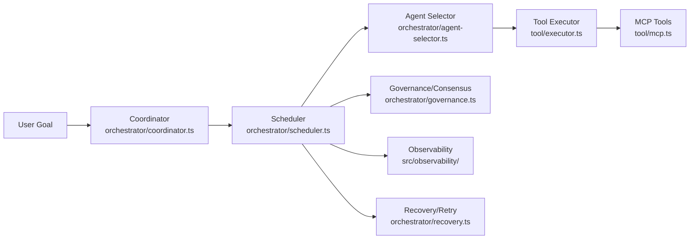
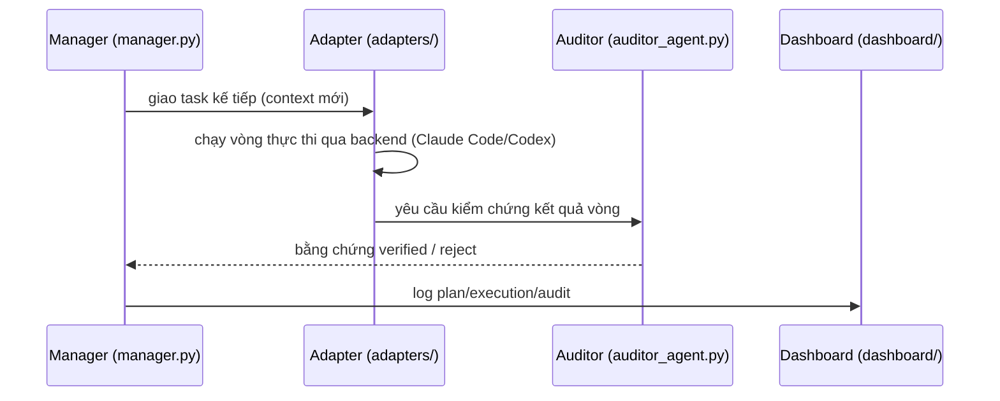
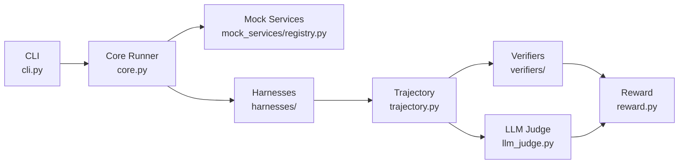
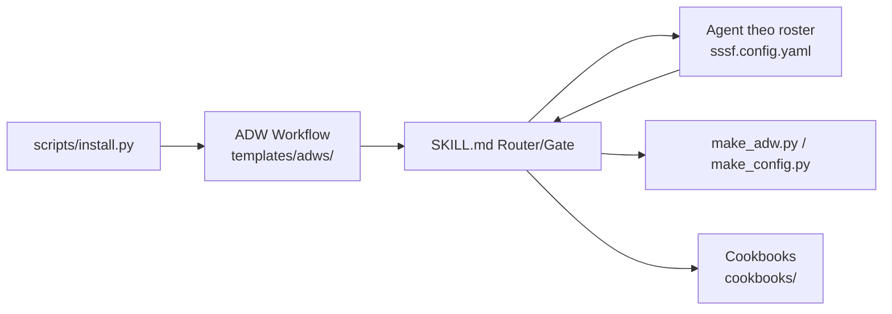

# Weekly Agentic AI Scan — 2026-08-06

Phạm vi: repo được tạo mới hoặc cập nhật đáng kể trong 7 ngày qua (2026-07-30 → 2026-08-06), chủ đề agent/multi-agent/agentic AI.

## Tóm tắt điều hành

- Tuần này nổi bật là xu hướng "agent harness với vai trò tách biệt + kiểm chứng độc lập" (LongHorizon-Harness, RealReplicaBench) thay vì thêm một framework orchestration chung chung mới — dấu hiệu ngành đang chuyển từ "xây agent" sang "đo và kiểm soát agent đã có" (Claude Code, Codex, OpenClaw).
- `open-multi-agent/open-multi-agent` là candidate framework orchestration đáng chú ý nhất vì bỏ hẳn workflow graph viết tay: coordinator tự lập DAG runtime từ một goal, có package OpenTelemetry riêng và cơ chế tool-grant default-deny.
- `disler/super-simple-software-factory` đại diện cho một pattern khác hẳn: đóng gói orchestration như một Claude Code Skill có thể "stamp" vào repo bất kỳ, với triết lý "code sở hữu graph, agent chỉ là node bị giới hạn" — nhưng lịch sử git rất mỏng (repo mới, ít commit), cần dè dặt khi đánh giá độ trưởng thành.

## Mục lục

1. [open-multi-agent/open-multi-agent](#1-open-multi-agentopen-multi-agent)
2. [AMAP-ML/LongHorizon-Harness](#2-amap-mllonghorizon-harness)
3. [Accio-Lab/RealReplicaBench](#3-accio-labrealreplicabench)
4. [disler/super-simple-software-factory](#4-dislersuper-simple-software-factory)
5. [Candidate khác đã khảo sát nhưng không đi sâu](#5-candidate-khác-đã-khảo-sát-nhưng-không-đi-sâu)
6. [Ghi chú phương pháp & giới hạn dữ liệu](#6-ghi-chú-phương-pháp--giới-hạn-dữ-liệu)

---

## 1. open-multi-agent/open-multi-agent

Repo: https://github.com/open-multi-agent/open-multi-agent

### 1.1 Quick context

Framework TypeScript cho phép mô tả *mục tiêu* thay vì vẽ workflow graph — một coordinator tự lập kế hoạch DAG lúc chạy rồi điều phối nhiều LLM agent thực thi song song. Stack: TypeScript (Node ≥20), monorepo `packages/{core, otel, create-oma-app}`, hỗ trợ Anthropic SDK, OpenAI SDK, Zod, MCP SDK, ACP, Bedrock, Vercel AI SDK làm peer dependency tùy chọn. Repo health: 6.7k sao, 2.4k fork, 459 commit, badge CI (`ci.yml`) hiển thị trên README, 5 issue mở, tạo 2026-03-31, push gần nhất 2026-08-03.

### 1.2 Architecture deep-dive

**A. Component inventory**
- `Coordinator` (`packages/core/src/orchestrator/coordinator.ts`) — nhận một goal, tự sinh task DAG lúc runtime, không có workflow graph viết tay.
- `Scheduler` (`packages/core/src/orchestrator/scheduler.ts`) — thực thi DAG theo thứ tự phụ thuộc một cách tất định (deterministic).
- `Agent Selector` (`packages/core/src/orchestrator/agent-selector.ts`) — gán từng task cho một agent trong team pool.
- `Governance` / `Consensus` (`packages/core/src/orchestrator/governance.ts`, `.../consensus.ts`) — cơ chế kiểm soát/đồng thuận trước khi chấp nhận kết quả task.
- `Recovery` / `Retry` (`packages/core/src/orchestrator/recovery.ts`, `.../retry.ts`) — phục hồi từ checkpoint, retry khi task fail.
- `Tool Executor` (`packages/core/src/tool/executor.ts`) và `MCP integration` (`packages/core/src/tool/mcp.ts`) — thực thi tool call, hỗ trợ Model Context Protocol.
- `Grants` (`packages/core/src/tool/grants.ts`) — cơ chế cấp quyền tool theo kiểu default-deny.
- `Observability` (thư mục `packages/core/src/observability/`, package riêng `@open-multi-agent/otel`) — instrumentation OpenTelemetry.

**B. Control flow pattern**: **planner-executor lai hierarchical/graph-based** — coordinator đóng vai "planner" sinh DAG, scheduler + agent pool đóng vai nhóm "executor" theo mô hình supervisor-workers, nhưng graph được sinh động (dynamic) thay vì tĩnh.
1. Người dùng gọi `runTeam(goal)` với một mục tiêu bằng ngôn ngữ tự nhiên.
2. `coordinator.ts` phân rã goal thành task DAG ngay tại thời điểm chạy.
3. `scheduler.ts` duyệt DAG, dispatch các task đã sẵn sàng (đã đủ dependency).
4. `agent-selector.ts` gán mỗi task cho một agent phù hợp trong team.
5. Agent gọi tool qua `tool/executor.ts` (native function-calling hoặc MCP), dưới quyền hạn default-deny của `grants.ts`.
6. `governance.ts`/`consensus.ts` xác nhận kết quả, `observability/` ghi trace; nếu lỗi thì `recovery.ts`/`retry.ts` xử lý, cho phép resume từ checkpoint.

**C. State & data flow**: không xác định định dạng message chi tiết giữa các agent từ các file đã đọc (không đọc được nội dung implementation cụ thể của `coordinator.ts`). README cho biết state được lưu dưới dạng "execution receipts" và trace hỗ trợ replay/resume từ checkpoint; quản lý context qua khái niệm "ContextStrategy" nhắc tới trong docs nhưng không xác định cơ chế cắt/tóm tắt cụ thể từ code đã đọc.

**D. Tool/capability integration**: đăng ký tool qua `defineTool` (theo README), thực thi qua `tool/executor.ts`; hỗ trợ cả tool built-in (`tool/built-in/`), MCP (`tool/mcp.ts`), và một "text tool extractor" (`tool/text-tool-extractor.ts`) — gợi ý có fallback parse tool call dạng text cho model không hỗ trợ function-calling native. Có `classifiers/` riêng dưới `tool/` nhưng không xác định vai trò chính xác từ code đã đọc. Bảo vệ qua `grants.ts` (default-deny).

**E. Memory architecture**: có thư mục `packages/core/src/memory/` (shared memory giữa các agent trong team) nhưng không đọc được nội dung chi tiết cơ chế tóm tắt/retrieval — không xác định từ code.

**F. Model orchestration**: provider được cấu hình qua `defaultProvider`, hỗ trợ nhiều backend (Anthropic, OpenAI, Bedrock, local/OpenAI-compatible endpoint) kể cả chạy Claude Code/Gemini CLI/Codex như agent process trên cùng một DAG (theo README) — nhưng cơ chế fallback/parallel cụ thể giữa các model không xác định được từ code đã đọc, chỉ từ mô tả README.

**G. Observability & eval**: package `@open-multi-agent/otel` tách riêng cho OpenTelemetry; có `packages/core/src/eval/` cho evaluation utilities và Run Viewer hiển thị DAG + span waterfall.

**H. Extension points**: custom coordinator, `ContextStrategy` tùy chỉnh, và backend adapter cho Claude Code/Gemini CLI/Codex (theo README); tool tùy chỉnh qua `defineTool`.

### 1.3 Architecture diagram

### 1.4 Verdict

Điểm mới thật sự đáng học: DAG được coordinator *suy ra lúc runtime* thay vì lập trình viên vẽ workflow tĩnh — khác biệt rõ với đa số framework orchestration (LangGraph, CrewAI) vốn yêu cầu khai báo graph trước; kết hợp với `grants.ts` default-deny và package OTel tách riêng cho thấy tư duy production-grade thật. Red flag: tăng trưởng sao rất nhanh (6.7k sao trong ~4 tháng) nên cần thận trọng khi đánh giá mức độ battle-tested; nội bộ `orchestrator/` có tới 16 file (budget, short-circuit, task-profiler...) cho thấy độ phức tạp cao chưa được tài liệu hóa đầy đủ. Câu hỏi mở: `governance.ts` khác `consensus.ts` ở điểm nào, và DAG "repair" hoạt động ra sao khi một task giữa chừng thất bại.

---

## 2. AMAP-ML/LongHorizon-Harness

Repo: https://github.com/AMAP-ML/LongHorizon-Harness

### 2.1 Quick context

Harness điều phối ba vai trò Manager–Executor–Auditor để agent coding (Claude Code, Codex) làm việc bền vững qua nhiều vòng dài mà không bị "trôi" context. Stack: Python ≥3.10, MIT license, tích hợp Claude Code/Codex CLI qua adapter, kèm eval suite (WeaveBench, OSWorld v2, Terminal-Bench 2.1). Repo health: 291 sao, 33 fork, CI workflows hiện diện (`.github/workflows/`), có bài arXiv đi kèm (2608.01964), tạo 2026-08-04, push gần nhất 2026-08-05 — tức là repo mới hoàn toàn trong tuần quét.

### 2.2 Architecture deep-dive

**A. Component inventory**
- `Manager` (`src/lh_harness/manager.py`) — giữ goal gốc, verified progress, quyết định bước kế tiếp.
- `Auditor` (`src/lh_harness/auditor_agent.py`) — độc lập kiểm tra file/log/test trong môi trường thật, không tin lời agent tự khai.
- `Adapters` (`src/lh_harness/adapters/`) — lớp tích hợp backend (Claude Code, Codex CLI) đóng vai trò chạy Executor mỗi vòng.
- `Environment` (`src/lh_harness/environment/`) — protocol môi trường có thể mở rộng (desktop app, CLI).
- `Role Prompts` (`src/lh_harness/role_prompts.py`) — prompt template riêng cho từng vai trò.
- `Config` (`src/lh_harness/config.py`) — cấu hình model/backend theo từng vai trò.
- `CLI` (`src/lh_harness/cli.py`) — entry point chạy harness.
- `Dashboard` (`src/lh_harness/dashboard/`) — hiển thị plan/execution/audit theo từng vòng.

**B. Control flow pattern**: **state machine theo vai trò (role-based Manager–Executor–Auditor loop)** với cổng kiểm chứng bắt buộc trước khi state được coi là "verified".
1. Manager đọc goal gốc + verified progress hiện tại, quyết định task kế tiếp.
2. Adapter dispatch task đó cho Executor backend (Claude Code/Codex) với **context mới hoàn toàn** mỗi vòng.
3. Executor thực hiện hành động trong vòng đó (một task rõ ràng, giới hạn).
4. Auditor độc lập kiểm tra file, log, test trong môi trường thật để xác nhận kết quả.
5. Chỉ kết quả *đã qua kiểm chứng độc lập* mới được ghi vào persistent task state; nếu fail, Manager tiếp tục từ phần đã verified trước đó, không polluting context của Executor.
6. Dashboard ghi lại plan/execution/audit/lý do rework của từng vòng để quan sát.

**C. State & data flow**: state được lưu trong thư mục run cô lập theo mỗi lần chạy, gồm objective gốc, phần đã verified, toàn bộ event stream theo vòng, bằng chứng audit và artifact workspace (theo README, không đọc được schema JSON cụ thể trong code). Quản lý context: Executor luôn nhận **context mới** mỗi vòng (chủ động "quên" lịch sử thực thi cũ) — đây là chiến lược quản lý context window rõ ràng nhất của repo, khác với cách "nhồi" toàn bộ lịch sử vào context.

**D. Tool/capability integration**: không tự định nghĩa tool riêng — harness *bọc quanh* backend agent sẵn có (Claude Code, Codex) qua `adapters/`, giữ nguyên vòng lặp thực thi gốc của backend đó ("lightweight adapter layer preserves each backend's native execution loop"). Việc gọi tool cụ thể (function-calling hay code execution) do backend quyết định, không xác định chi tiết từ code harness.

**E. Memory architecture**: không có memory dài hạn kiểu retrieval — thay vào đó Manager giữ "verified progress" như một dạng bộ nhớ ngắn được audit-gate liên tục; không có cơ chế tóm tắt/embedding retrieval được xác nhận từ code.

**F. Model orchestration**: Manager, Executor, Auditor có thể dùng model/backend khác nhau (theo `config.py`), cho phép tối ưu cost/quality riêng từng vai trò; không xác định cơ chế fallback tự động hay chạy song song từ code đã đọc.

**G. Observability & eval**: `dashboard/` hiển thị real-time; kèm bộ eval `eval/{WeaveBench-harness, OSWorldv2-harness}` để tái lập benchmark, báo cáo cải thiện ~50%→80% trên WeaveBench, 3x trên OSWorld 2.0 (số liệu tự công bố, chưa được bên thứ ba xác nhận độc lập).

**H. Extension points**: `AgentAdapter` và `Environment` protocol cho phép thêm backend agent hoặc môi trường thực thi mới (theo README).

### 2.3 Architecture diagram

### 2.4 Verdict

Điểm mới đáng học nhất: tách bạch triệt để giữa "context bị xóa mỗi vòng" (Executor) và "state chỉ được cập nhật khi đã kiểm chứng độc lập" (Manager) — đây là cách tấn công trực diện vào vấn đề context rot trong tác vụ dài hơi, khác với giải pháp phổ biến là "tóm tắt rồi nhồi lại". Có bài arXiv đi kèm (2608.01964) củng cố độ tin cậy phương pháp. Red flag: repo mới 2 ngày tuổi tại thời điểm quét, số liệu benchmark (WeaveBench, OSWorld) hoàn toàn tự công bố trong README, chưa có xác nhận độc lập. Câu hỏi mở: cơ chế nào chống Executor "báo cáo giả" qua mặt Auditor khi cả hai cùng dựa trên LLM.

---

## 3. Accio-Lab/RealReplicaBench

Repo: https://github.com/Accio-Lab/RealReplicaBench

### 3.1 Quick context

Bộ benchmark 107 task dài hơi (CLI, browser, file, API/MCP) đo agent thương mại trên các mock service mô phỏng dịch vụ thật, chạy trong container cô lập. Stack: Python ≥3.11, Docker, ảnh runtime OpenClaw, PyYAML/openpyxl; license kép Apache-2.0 (code) + CC-BY-4.0 (task suite). Repo health: 1.0k sao, 69 fork, CI workflows hiện diện, 9 commit (còn rất mới), tạo 2026-08-02, push gần nhất 2026-08-05, có leaderboard công khai.

### 3.2 Architecture deep-dive

**A. Component inventory**
- `CLI` (`real_replica_bench/cli.py`) — entry point, lệnh `list`/`run`.
- `Core runner` (`real_replica_bench/core.py`) — logic điều phối benchmark chính.
- `Mock services registry` (`real_replica_bench/mock_services/registry.py`) — đăng ký 14 mock service mô phỏng nền tảng thương mại.
- `Harnesses` (`real_replica_bench/harnesses/`) — tích hợp agent-under-test (OpenClaw runner và các route khác).
- `Trajectory recorder` (`real_replica_bench/trajectory.py`) — ghi lại chuỗi hành động của agent.
- `Verifiers` (`real_replica_bench/verifiers/`) — kiểm chứng tất định (deterministic).
- `LLM Judge` (`real_replica_bench/llm_judge.py`, `llm_judge_cli.py`) — verifier hỗ trợ bởi LLM cho task định tính.
- `Reward` (`real_replica_bench/reward.py`) — tính điểm/reward cuối cùng.
- `Reports` (`real_replica_bench/reports/`) — sinh báo cáo tổng hợp.

**B. Control flow pattern**: **harness-orchestrated evaluation pipeline** — không phải kiến trúc agent mà là một state machine điều phối vòng đời "task → container cô lập → agent chạy → kiểm chứng độc lập".
1. Người dùng chạy `real-replica-bench run <task_id>` (`cli.py`), tải `task.toml`/`task.md` qua `core.py`.
2. Hệ thống khởi tạo container Docker riêng cho task (ảnh OpenClaw runtime cố định phiên bản) cùng mock service từ `mock_services/registry.py`.
3. `harnesses/` dispatch agent-under-test vào workspace của task, `trajectory.py` ghi lại từng hành động.
4. Agent ghi output vào `/task/outputs/`; container bị hủy ngay sau khi thu thập log/artifact.
5. `verifiers/` (tất định) và `llm_judge.py` (cho 6 task định tính) chấm điểm output theo `rubric.json` — agent không bao giờ thấy rubric vì nó nằm ngoài phần agent-visible (`task.md`/`workspace/`).
6. `reward.py` tính reward record; toàn bộ config, trajectory, verifier result, artifact, log container được lưu vào `runs/<run_id>/` để audit lại.

**C. State & data flow**: mỗi run tạo một thư mục `runs/<run_id>/tasks/<index>-<task_id>/` chứa `manifest.json`, thư mục `agent/`, `verifier/`, `workspace/outputs/`, `screenshots/`, `container/` — đây là cơ chế lưu state chính (file-based, không phải DB). Quản lý credential: file `run.yaml` tự động redact secret và fail sớm nếu có placeholder `${...}` chưa resolve trước khi container khởi động.

**D. Tool/capability integration**: agent-under-test tương tác với môi trường qua giao diện CLI/browser/file/API do mock service cung cấp — bản thân benchmark không định nghĩa tool cho agent mà đo khả năng agent tự dùng công cụ có sẵn của nó (browser, shell...). Cấu hình routing model qua các file YAML trong `configs/` (`realreplicabench_openclaw<suffix>.yaml`), hỗ trợ cả gọi provider trực tiếp lẫn endpoint tùy chỉnh (OpenAI/Anthropic/Gemini message format).

**E. Memory architecture**: không áp dụng — mỗi task chạy trong container mới hoàn toàn, không có bộ nhớ xuyên task.

**F. Model orchestration**: không xác định cơ chế fallback/parallel batch từ code đã đọc; chỉ xác định được cấu hình routing tĩnh qua YAML (provider trực tiếp hoặc bring-your-own-endpoint) và một `llm_judge` model riêng cho việc chấm điểm định tính, tách biệt khỏi model của agent-under-test.

**G. Observability & eval**: đây chính là bản chất của repo — mọi run đều xuất `summary.json`/`summary.md`/`report.html` cùng manifest chi tiết theo từng task, đáp ứng tiêu chí "eval hooks/replay" ở mức triệt để nhất trong 4 repo được phân tích tuần này.

**H. Extension points**: thêm domain/task mới qua cấu trúc thư mục chuẩn `<interface>/<platform>/<task>/`; thêm route provider mới qua file YAML trong `configs/`.

### 3.3 Architecture diagram

### 3.4 Verdict

Điểm mới đáng học: thiết kế "agent-visible vs grading-isolated" triệt để (agent chỉ thấy `task.md`/`workspace/`, còn `grader/private/rubric.json` nằm hoàn toàn ngoài tầm nhìn) — chống rò rỉ tiêu chí chấm điểm chặt hơn hầu hết benchmark agent phổ biến vốn nhúng rubric gần trong context. Red flag: mới 9 commit, tự nhận "chưa có paper, tạm thời cite trực tiếp repo"; đơn vị xây dựng benchmark (Accio Lab) đồng thời là đơn vị đứng sau harness tham chiếu OpenClaw — có rủi ro xung đột lợi ích nhẹ khi benchmark và harness mặc định cùng một nguồn. Câu hỏi mở: 6 task dùng LLM-judge có bias thế nào so với đánh giá con người, và mức độ tương quan giữa hai bộ harness (OpenClaw vs Accio) trong bảng kết quả.

---

## 4. disler/super-simple-software-factory

Repo: https://github.com/disler/super-simple-software-factory

### 4.1 Quick context

Một Claude Code Skill đóng gói triết lý "code sở hữu graph, agent chỉ là node bị giới hạn" — orchestration tất định bằng Python, agent chỉ được gọi trong từng pha có gate kiểm chứng riêng. Stack: Claude Code Skill format (`SKILL.md`), script Python, config YAML, có định hướng thêm visualizer Vue/Vite. Repo health: 427 sao, 98 fork, MIT license, **không thấy badge CI**, trang repo hiển thị "1 Commit" trên nhánh main tại thời điểm khảo sát — lịch sử git rất mỏng so với số sao, cần dè dặt. Có video YouTube giải thích kiến trúc từ tác giả.

### 4.2 Architecture deep-dive

**A. Component inventory**
- `SKILL.md Router/Gate` (`.claude/skills/sssf/SKILL.md`) — file trung tâm định tuyến workflow và định nghĩa cơ chế Gate: `Gate(envelope, run) → list[str] violations`, lỗi parse sẽ được yêu cầu sửa trong cùng session thay vì hủy.
- `Agent Roster Config` (`.claude/skills/sssf/templates/sssf.config.yaml`) — cấu hình model, thinking level, tool, prompt cho từng agent trong hệ thống.
- `ADW Workflow Templates` (`.claude/skills/sssf/templates/adws/`) — các workflow khởi động sẵn (ví dụ `adw_simple_sdlc`: plan → build → test → review → document, `adw_scout`: recon chỉ đọc).
- `Cookbooks` (`.claude/skills/sssf/cookbooks/`) — playbook hướng dẫn từng pattern orchestration, gồm `create_adw.md` (tạo workflow mới) và `update_config.md` (retune agent).
- `Install/Scaffold Scripts` (`.claude/skills/sssf/scripts/install.py`, `.../make_adw.py`, `.../make_config.py`) — cài skill vào repo đích, sinh workflow/config mới.

**B. Control flow pattern**: **deterministic state-machine / code-owned pipeline với agent là bounded node** — rõ ràng không phải ReAct hay agent tự trị; điểm khác biệt cốt lõi là code (không phải LLM) sở hữu trình tự, retry và điều kiện chấp nhận.
1. Kỹ sư chọn một ADW workflow có sẵn dưới `templates/adws/` (ví dụ `adw_simple_sdlc`), cài vào repo đích qua `scripts/install.py`.
2. Python tất định (không phải agent) tuần tự hóa các pha của workflow theo luật routing trong `SKILL.md`.
3. Mỗi pha gọi đúng một agent được cấu hình trong `sssf.config.yaml` (model/thinking/tool/prompt riêng) như một node bị giới hạn phạm vi.
4. Agent trả về một "envelope" JSON có kiểu; code chạy `Gate(envelope, run)` để kiểm tra vi phạm — nếu có, yêu cầu sửa ngay trong cùng session thay vì abort toàn bộ.
5. Mọi sự kiện (đề xuất, kết quả gate, chuyển pha) được stream vào SQLite ở chế độ WAL để đọc real-time mà không chặn tiến trình ghi.
6. Kỹ sư dùng `make_adw.py`/`make_config.py` để tạo workflow mới hoặc chỉnh roster agent, mở rộng "factory".

**C. State & data flow**: message giữa code và agent là "typed envelope" JSON (định nghĩa hợp đồng qua bộ ba đồng bộ: kiểu dữ liệu, mục `## Report` trong prompt agent, và `output_type=` tại call-site — theo mô tả trong SKILL.md, không đọc được file schema cụ thể). State lưu trong SQLite WAL tại `adws/adw_data/sssf.db` (đường dẫn nêu trong SKILL.md, được tạo lúc runtime nên không xác nhận được nội dung thực tế). Quản lý context: mỗi pha là một session/agent riêng, không có cơ chế nhồi toàn bộ lịch sử — nhưng không xác định từ code cách context được cắt/tóm tắt trong một session dài.

**D. Tool/capability integration**: tool được khai báo qua cấu hình agent trong `sssf.config.yaml` (mô hình, tool, prompt riêng từng agent) — không xác định từ code cơ chế validation/sandbox cụ thể cho tool call ngoài Gate ở tầng envelope đầu ra.

**E. Memory architecture**: không xác định từ code — không có mô tả cụ thể về short/long-term memory hay retrieval ngoài log SQLite phục vụ observability.

**F. Model orchestration**: mỗi agent trong roster có thể dùng model và "thinking level" riêng (theo `sssf.config.yaml`); không xác định cơ chế fallback hoặc chạy song song nhiều agent từ nội dung đã đọc.

**G. Observability & eval**: log toàn bộ sự kiện vào SQLite WAL để "quan sát mà không chặn ghi". README/SKILL.md ghi rõ: tính năng visualizer (`apps/visualizer/`, Vue/Vite) "ships in a later pass — observe via sqlite queries until then" — nghĩa là tại thời điểm quét, cách quan sát chính thức vẫn là truy vấn SQLite trực tiếp, dù thư mục `apps/visualizer/` đã xuất hiện trong cấu trúc repo (có sự lệch giữa code đã có mặt và tài liệu mô tả chưa hoàn thiện).

**H. Extension points**: thêm agent/workflow mới qua `cookbooks/create_adw.md` + `scripts/make_adw.py`; retune agent hiện có qua `cookbooks/update_config.md` + `scripts/make_config.py`.

### 4.3 Architecture diagram

### 4.4 Verdict

Điểm mới đáng học: đóng gói một *governance pattern* ("agent proposes, code disposes" với gate kiểm tra envelope kiểu JSON) thành một Claude Code Skill có thể cài vào bất kỳ repo nào, thay vì một service/framework độc lập — hướng tiếp cận thực dụng cho việc kiểm soát agent coding tự trị mà không cần hạ tầng riêng; SQLite WAL cho observability real-time không chặn ghi là lựa chọn kỹ thuật hợp lý và rẻ. Red flag rõ rệt: trang repo cho thấy chỉ "1 Commit" trên main dù có 427 sao — lịch sử phát triển gần như không tồn tại để đánh giá độ ổn định; không có CI; tài liệu tự mâu thuẫn về việc visualizer đã "ship" hay chưa. Câu hỏi mở: liệu 12 ADW workflow được quảng cáo có thực sự tồn tại (README chỉ liệt kê được 2 trong bảng ví dụ đã đọc), và cơ chế Gate có được test tự động ở đâu không khi thiếu CI.

---

## 5. Candidate khác đã khảo sát nhưng không đi sâu

| Repo | Sao (ước tính) | Tạo/Push gần nhất | Lý do không chọn deep-dive |
|---|---|---|---|
| [trycompai/crm](https://github.com/trycompai/crm) | 6.5k | tạo 2026-07-31 | CRM agentic-first thú vị (agent chạy độc lập trên work-queue, sandbox deny-all egress) nhưng trọng tâm sản phẩm là CRM, kiến trúc agent chỉ là một phần (`apps/agent`) — ưu tiên 4 repo thuần agentic-architecture hơn. |
| [0xwilliamortiz/ratchet](https://github.com/0xwilliamortiz/ratchet) | 432 | tạo 2026-07-31 | Công cụ guardrail/compliance cho agent (git hook đo code diff) — không có thư mục `src/`/`docs/` rõ ràng, thiên về tool giám sát hơn là kiến trúc agent. |
| [AMAP-ML/LongHorizon-Harness](#2-amap-mllonghorizon-harness) | 291 | tạo 2026-08-04 | **Đã chọn deep-dive (mục 2).** |
| [yuhuangerdi/InduSecAgent](https://github.com/yuhuangerdi/InduSecAgent) | 283 | tạo 2026-08-03 | Nền tảng an ninh công nghiệp dùng graph neural network + agent phản ứng — chủ đề lệch khỏi "agentic AI orchestration" thuần túy, thiên về ứng dụng ICS security. |
| [Anionex/agent-vision-toolkit](https://github.com/Anionex/agent-vision-toolkit) | 306 | tạo 2026-08-01 | Bộ CLI cấp thị giác cho agent text-only (OCR, chụp màn hình) — là tool bổ trợ hơn là kiến trúc agent/orchestration độc lập. |
| [criptogus/HermesOffice](https://github.com/criptogus/HermesOffice) | 361 | tạo 2026-08-04 | Tự mô tả là "thin fork" của GenOffice (Apache-2.0) — loại theo tiêu chí loại trừ fork-only/derivative repo. |
| [obra/superpowers](https://github.com/obra/superpowers) | ~267k (xem ghi chú §6) | tạo 2025-10-09, push 2026-08-06 | Rất lớn và hoạt động liên tục nhưng bản chất là bộ skill/methodology cho coding agent (không tạo mới trong 7 ngày, chỉ được cập nhật liên tục) — đã có nhiều phân tích công khai từ trước, ưu tiên chỗ cho repo mới hơn. |
| [open-multi-agent/open-multi-agent](#1-open-multi-agentopen-multi-agent) | 6.7k | tạo 2026-03-31 | **Đã chọn deep-dive (mục 1).** |
| [Accio-Lab/RealReplicaBench](#3-accio-labrealreplicabench) | 1.0k | tạo 2026-08-02 | **Đã chọn deep-dive (mục 3).** |
| [disler/super-simple-software-factory](#4-dislersuper-simple-software-factory) | 427 | tạo 2026-08-02 | **Đã chọn deep-dive (mục 4).** |

## 6. Ghi chú phương pháp & giới hạn dữ liệu

- Không có quyền truy cập `gh` CLI hay GitHub API xác thực trong phiên này; toàn bộ số liệu (sao, fork, commit, ngày tạo/push) được lấy qua `WebFetch` nhắm vào `api.github.com/search/repositories` (endpoint công khai, không xác thực) và trang repo công khai trên `github.com`/`raw.githubusercontent.com`.
- `WebFetch` xử lý nội dung qua một model tóm tắt trung gian trước khi trả kết quả cho tôi — với các repo lớn/nổi tiếng (ví dụ `obra/superpowers` ~267k sao), con số này **chưa được đối chiếu chéo với nguồn thứ hai** nên có thể lệch; với 4 repo được deep-dive, số liệu star/fork/commit được truy vấn ít nhất 2 lần qua các endpoint khác nhau (search API + trang repo) để tăng độ tin cậy nhưng vẫn không đạt độ chính xác của API xác thực.
- Số lượng contributor chính xác không xác định được cho cả 4 repo deep-dive (GitHub chỉ hiển thị badge `contrib.rocks` hoặc không hiển thị số cụ thể qua trang tĩnh).
- Mọi liên kết trong báo cáo đã được `WebFetch` truy cập thành công (tương đương kiểm tra HTTP 200) tại thời điểm viết báo cáo (2026-08-06).
