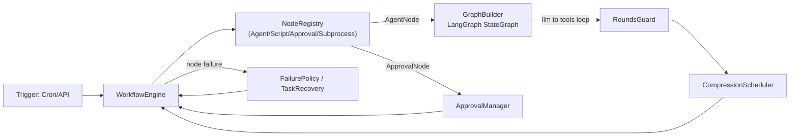
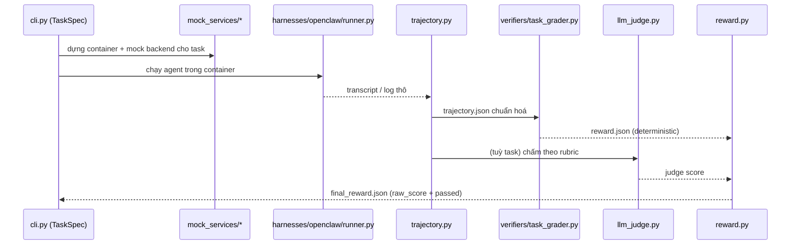
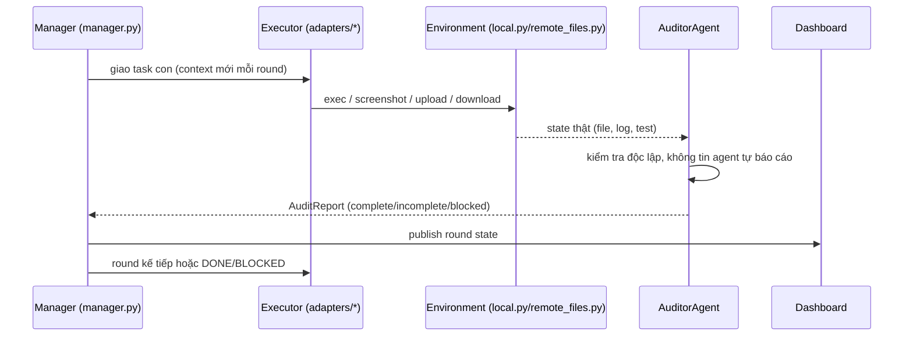
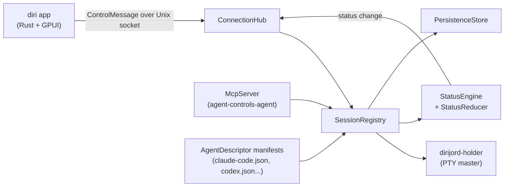

# Weekly Agentic AI Scan — 2026-08-07

**Nguồn dữ liệu:** GitHub Search API, `q=agent OR agentic OR multi-agent created:>2026-07-31 stars:>200`, sort theo stars. 10 kết quả thô, sau khi loại `awesome-*` list, wrapper mỏng, và repo thiếu evidence kiến trúc rõ ràng, còn lại 4 repo pass filter. Mỗi repo được `git clone --depth 1` về local để đọc trực tiếp source code (không suy diễn từ README/marketing).

## Executive Summary

- **DeterminFlow** (LangGraph-based) và **LongHorizon-Harness** cùng theo đuổi một ý tưởng: tách "lập kế hoạch/điều phối" khỏi "thực thi" thành các role/node riêng biệt để tránh một agent duy nhất phải gánh toàn bộ context — nhưng một bên làm ở tầng workflow-graph (node có type), bên kia làm ở tầng role-prompt (Manager/Executor/Auditor).
- **RealReplicaBench** đáng chú ý nhất về eval methodology: benchmark stateful, mock toàn bộ backend SaaS/commerce cục bộ, chấm điểm bằng verifier xác định (per-task Python grader) kết hợp LLM-judge có schema rõ ràng — không phải "hỏi GPT xem đúng không".
- **diri** là ca lạ trong tuần: không phải framework Python, mà là daemon-based orchestrator viết Rust+Swift để chạy song song nhiều coding-agent CLI (Claude Code, Codex, Cursor…) qua git worktree, với chính MCP server để agent này spawn/điều khiển agent khác.

## Mục lục

1. [DeterminFlow](#1-determinflow)
2. [RealReplicaBench](#2-realreplicabench)
3. [LongHorizon-Harness](#3-longhorizon-harness)
4. [diri](#4-diri)

---

## 1. DeterminFlow

**Repo:** [alikon-art/DeterminFlow](https://github.com/alikon-art/DeterminFlow)

### §1 — Quick Context

Deterministic workflow runtime để chạy AI agent như node có kiểm soát, không phải một agent tự do lặp vô hạn. Tech stack: Python 3.11, LangGraph + LangChain-core, FastAPI/Uvicorn/Gunicorn (backend), React/Vite/Tailwind (web), Tauri (desktop). ~118K LOC. 222 sao, tạo 2026-08-02, push gần nhất 2026-08-07 (hoạt động hàng ngày), license AGPL-3.0, có CI (`ci.yml`, `desktop-windows.yml`) và >50 file test trong `tests/` bao phủ retry engine, task recovery, workflow policy.

### §2 — Architecture Deep-Dive

**A. Component inventory**
- `WorkflowEngine` (`src/workflow/engine.py`) — điều phối thực thi node theo topology (serial/parallel/condition), bản thân engine "chỉ scheduling", hành vi node do plugin registry quyết định.
- `NodeRegistry` + node types: `AgentNode`, `ApprovalNode`, `ScriptNode`, `SubprocessNode` (`src/workflow/nodes/*.py`).
- `GraphBuilder` (`src/core/graph_builder.py`) — dựng LangGraph `StateGraph` dùng chung cho mọi Agent node: 2 node `llm ↔ tools`, route bằng `should_continue()`.
- `RoundsGuard` (`src/core/tool_guard.py`, referenced trong `graph_builder.py`) — chặn vòng lặp tool-call vô hạn khi hết `remaining_rounds`.
- `CompressionScheduler` (`src/compression/scheduler.py`) + 3 strategy `micro/full/reactive` (`src/compression/strategies/`) — quản lý context window.
- `FailurePolicy` + `TaskRecovery` (`src/workflow/failure_policy.py`, `src/workflow/task_recovery.py`) — retry/resume có CAS.
- `ApprovalManager` (`src/core/approval_manager.py`) — human-in-the-loop gate.
- `ModelManager` (`src/core/model_manager.py`) — multi-provider (DeepSeek, MiMo…) config registry.
- `RoundtableRunner` (`src/roundtable/runner.py`) — "phòng họp" nhiều agent phát biểu theo lượt, có Moderator quyết định lượt nói.
- `MCPClient`/tool adapter (`src/mcp/client.py`, `src/mcp/tool_adapter.py`) — bọc MCP tool thành LangChain `StructuredTool`.
- Extension host (`src/extension_host/`, `docs/architecture.md`) — plugin nạp Router/Tool Factory/Prompt Provider theo manifest, có state machine `discovered→starting→running→degraded/blocked`.

**B. Control flow — Graph/state-machine pattern** (không phải ReAct thuần, mà graph-of-nodes bao ngoài một ReAct-loop bên trong mỗi Agent node):
1. `WorkflowDef` (định nghĩa immutable) sinh `WorkflowTask` khi trigger (cron/API/user).
2. `WorkflowEngine` duyệt node theo thứ tự topology; với `AgentNode`, giao cho `GraphBuilder`'s LangGraph `StateGraph` chạy vòng `llm → tools → llm...` tới khi `should_continue()` trả `__end__` (hết tool call hoặc hết `remaining_rounds`).
3. Trước/sau mỗi bước, `CompressionScheduler` hỏi `CompressionChecker` xem có cần nén transcript không, áp dụng `micro`/`full`/`reactive`.
4. Node lỗi → `failure_policy.record_attempt()` ghi nhận, nếu còn `auto_retry_count` thì chuyển trạng thái `retry_waiting` (persist), khởi động lại vẫn resume được nhờ `task_recovery`.
5. `ApprovalNode` dừng task, chờ người duyệt qua `ApprovalManager` trước khi engine tiếp tục.
6. Kết quả node/task ghi vào `task_persistence.write_task_state_file`, tổng token usage cộng dồn không reset khi retry.

**C. State & data flow:** Message giữa Core và Extension là JSON có schema (manifest-based); state của Agent node là LangChain `AIMessage`/`BaseMessage` list trong `AgentState` (typed dict theo LangGraph convention). Lưu trữ: file-based JSON snapshot cho task/extension override, không thấy vector DB — quản lý context bằng compression (không phải RAG).

**D. Tool integration:** Model gọi tool qua LangGraph `ToolNode` (function-calling native của LLM), MCP tool được `create_mcp_tools()` biến thành `StructuredTool` với Pydantic schema build động từ JSON schema của MCP server. Có `RoundsGuard` như một sandbox nhẹ chống lặp vô hạn, nhưng không thấy sandbox thực thi code kiểu container.

**E. Memory:** Compression = short-term context management (3 strategy), không thấy long-term/vector memory trong code đã đọc — không xác định thêm.

**F. Model orchestration:** `ModelManager` cho phép mỗi Provider (DeepSeek, MiMo…) có category riêng (build extra_body khác nhau), nhưng vai trò "planner dùng model mạnh, executor dùng model nhẹ" không thấy phân tầng cứng trong code — do người dùng cấu hình theo Agent.

**G. Observability:** `change_broadcaster.py` (Core) phát sự kiện qua WebSocket cho Web Shell; token usage tracking (`token_usage.py`) tồn tại xuyên retry. Không thấy OpenTelemetry/Langfuse — observability tự viết, gắn với Web UI, không phải distributed tracing chuẩn.

**H. Extension points:** Rất rõ ràng — plugin đóng góp Router/Middleware/Tool Factory/Prompt Provider/Agent/Skill Bundle qua `extensions.json`, có version validation, dependency resolution theo topology, health check trước khi `running`.

### §3 — Architecture Diagram

### §4 — Verdict

**Novel:** Tách rạch ròi "code sở hữu control flow" khỏi "agent chỉ sở hữu 1 node" — retry/recovery dùng CAS (`expected_attempt_count`) để tránh double-execute, và compression có 3 strategy thay vì 1 kiểu "summarize khi đầy". Extension lifecycle state machine (`discovered→degraded/blocked`) chi tiết hiếm thấy ở repo cỡ này.

**Red flags:** Docs kiến trúc chính bằng tiếng Trung (rào cản cho contributor quốc tế); code base rất rộng (đồng thời có desktop app, web, nhiều provider) cho một repo mới 5 ngày tuổi — nghi ngờ đây là fork/rebrand từ một private project có sẵn hơn là "mới viết từ đầu".

**Open questions:** RoundtableRunner (multi-agent debate) chưa được đọc sâu — cơ chế "Moderator quyết định lượt nói" đáng xem kỹ hơn để so với các multi-agent debate pattern khác.

---

## 2. RealReplicaBench

**Repo:** [Accio-org/RealReplicaBench](https://github.com/Accio-org/RealReplicaBench)

### §1 — Quick Context

Benchmark stateful cho long-horizon agent trên các workflow thương mại thực (browser/CLI/API/file), do team Accio (Alibaba International) phát triển và maintain. Tech stack: Python ≥3.11, Docker (mỗi task chạy trong container riêng), LLM judge tùy chọn (schema JSON rõ ràng), harness chính tên "OpenClaw". 1037 sao, tạo 2026-08-02, push 2026-08-06, có CI (`ci.yml`), release v1.3.1, 107 task (53 CLI/28 browser/16 file/10 API-MCP).

### §2 — Architecture Deep-Dive

**A. Component inventory**
- `TaskSpec`/CLI (`real_replica_bench/cli.py`) — điểm vào, đọc task definition, điều phối chạy.
- `core.py` (`real_replica_bench/core.py`) — hạ tầng dùng chung: wrap `docker`, quản lý process/container I/O, "Extracted verbatim from cli.py" cho thấy đây là refactor có chủ đích tách concern.
- `mock_services/*` (`real_replica_bench/mock_services/`) — replica cục bộ của Shopify Admin, Amazon SP-API, Gmail, Google Docs/Workspace, Jira, Notion, Stripe, Todoist, Box… mô phỏng toàn bộ backend SaaS không cần tài khoản thật.
- `harnesses/openclaw/runner.py` + `harnesses/registry.py` — adapter chạy agent thật (OpenClaw) trong container, kèm `attach_openclaw_ext.ts` để hook vào trình duyệt.
- `trajectory.py` (`real_replica_bench/trajectory.py`) — tái tạo `trajectory.json` chuẩn hoá từ nhiều nguồn (SQLite của Accio, JSONL của OpenClaw, Codex rollout, log JSON).
- `verifiers/*` (`real_replica_bench/verifiers/`) — verifier riêng theo domain (`shopify_admin.py`, `freightos_v2.py`, `gmail_ui_state.py`…) và `task_grader.py` chạy grader Python xác định do từng task tự khai báo.
- `llm_judge.py` (`real_replica_bench/llm_judge.py`) — LLM-judge có JSON schema cố định (`score`, `passed`, `criteria[]` với `id/score/reason`).
- `reward.py` (`real_replica_bench/reward.py`) — gộp kết quả verifier thành `final_reward.json` (binary pass/fail giữ nguyên `raw_score` liên tục).

**B. Control flow — Harness/benchmark pipeline** (không phải agent architecture theo nghĩa runtime, mà là eval pipeline bọc quanh agent-dưới-test):
1. `cli.py` đọc `TaskSpec`, dựng container mock service tương ứng domain của task.
2. `harnesses/openclaw/runner.py` chạy agent thật bên trong container, ghi log/transcript.
3. `core.py` quản lý vòng đời container/process, copy artifact ra ngoài.
4. `trajectory.recover_trajectory_from_*` chuẩn hoá transcript thành `trajectory.json` bất kể agent nào sinh ra nó.
5. `task_grader.py` (hoặc verifier riêng của domain) chấm điểm xác định; `llm_judge.py` chấm bổ sung phần chủ quan theo rubric.
6. `reward.build_binary_final_reward()` gộp thành kết quả cuối, giữ cả điểm liên tục (`raw_score`) lẫn nhị phân (`passed`).

**C. State & data flow:** Message giữa harness và agent là log/transcript file (JSONL/SQLite tuỳ backend), không phải API call trực tiếp — mọi thứ đi qua filesystem của container rồi được host đọc lại. Không có context-window management ở tầng benchmark (đó là việc của agent-dưới-test, không phải harness).

**D. Tool integration:** Không áp dụng theo nghĩa "agent framework" — ở đây agent-dưới-test tự quản lý tool của nó (Claude Code, OpenClaw…); RealReplicaBench chỉ cung cấp environment (mock service) và đọc kết quả.

**E. Memory:** Không xác định từ code — ngoài phạm vi (memory thuộc về agent được benchmark, không phải harness).

**F. Model orchestration:** Có config riêng cho từng provider (`configs/realreplicabench_*_models.json` — Anthropic, Gemini, OpenAI, Qwen…), cho thấy benchmark hỗ trợ multi-model out of the box, nhưng đây là cấu hình endpoint, không phải orchestration logic.

**G. Observability & eval:** Đây chính là core value — mỗi run lưu resolved config, trajectory, verifier result, artifact, container metadata (`docs/`, `reports/html_report.py`). `scripts/validate_release.py`, `scripts/generate_model_diff_report.py` cho thấy quy trình eval có kiểm định trước khi release.

**H. Extension points:** Thêm domain mới = thêm `mock_services/<domain>` + `verifiers/<domain>.py` + dataset JSON trong `datasets_domain_v1/` — pattern rõ ràng, có registry (`mock_services/registry.py`, `harnesses/registry.py`) để plug-in mà không sửa core.

### §3 — Architecture Diagram

### §4 — Verdict

**Novel:** Giữ cả điểm liên tục (`raw_score`) lẫn nhị phân (`passed`) thay vì chỉ pass/fail — cho phép so sánh model một cách mịn hơn thay vì chỉ đếm task pass. Mock toàn bộ SaaS backend (Shopify, Stripe, Jira…) cục bộ để benchmark "state-changing" thay vì chỉ Q&A là hướng đi nghiêm túc, tránh benchmark bị leak/rate-limit từ service thật.

**Red flags:** Docstring tự thừa nhận code "Extracted verbatim from cli.py (2026-06-18 refactor)" — nghĩa là repo public này là bản tách ra từ một hệ thống nội bộ lớn hơn (CCB — có nhắc trong comment), nên một số phần (ví dụ luồng CCB main harness đầy đủ) có thể không nằm trong repo public.

**Open questions:** Chưa rõ container isolation có ngăn agent truy cập internet thật hay không (một số mock có gọi `MOCK_SITE_URL` qua HTTP nội bộ) — cần đọc `docker/` và Dockerfile kỹ hơn để đánh giá mức độ sandbox thật sự.

---

## 3. LongHorizon-Harness

**Repo:** [AMAP-ML/LongHorizon-Harness](https://github.com/AMAP-ML/LongHorizon-Harness)

### §1 — Quick Context

Harness quản lý state/verification cho agent chạy hàng chục giờ trên desktop + CLI thật, không train model mới mà bọc quanh Claude Code/Codex. Tech stack: Python ≥3.10, kèm arXiv paper (2608.01964, top #1 HuggingFace Daily Papers tuần 2026-W32). 355 sao, tạo 2026-08-04, push 2026-08-07, CI (`release.yml`), v0.1.2, không thấy thư mục `tests/` riêng (kiểm định chủ yếu qua eval harness — xem mục G).

### §2 — Architecture Deep-Dive

**A. Component inventory**
- `Manager` role (`src/lh_harness/manager.py`) — lập kế hoạch bước tiếp theo, đọc `management_history` + `related_auditor_reports`, sinh `ManagedRound`.
- `AuditorAgent` (`src/lh_harness/auditor_agent.py`) — kiểm tra độc lập file/log/test thật trong environment, sinh `AuditReport` với status (`complete/incomplete/blocked`) và `contract_audit` (`aligned/needs_revision/invalid`).
- `AgentAdapter` Protocol (`src/lh_harness/adapters/base.py`) — interface `run_episode()`, cài đặt cụ thể ở `adapters/claude_code.py`, `adapters/codex.py`, `adapters/cli_agent.py`.
- `Environment` Protocol (`src/lh_harness/environment/base.py`) — `exec/screenshot/upload/download`, cài đặt ở `environment/local.py`, `environment/remote_files.py`.
- `Dashboard` (`src/lh_harness/dashboard/server.py`, `state.py`, `gate.py`) — HTTP server thuần stdlib, expose `/api/state`, `/api/round/{n}`, `/api/approvals/{id}/resolve`, `/api/inject` (human-in-the-loop note).
- `plugins/` (`codex_computer_use.py`, `community_computer_use.py`) — computer-use tool được quản lý như plugin có version.
- `role_prompts.py` — prompt template riêng cho từng role (Manager/Executor/Auditor), có cả bản GUI-executor và CLI-executor tách biệt.

**B. Control flow — Hierarchical, role-based supervisor pattern** ("Three roles, one trusted state" theo README):
1. `Manager` đọc `EpisodeResult`/`ManagedRound` trước đó + `AuditReport` liên quan, quyết định bước kế tiếp (`MANAGER_NEXT_*`: GUI/DONE/BLOCKED/ASK).
2. `Executor` (GUI hoặc CLI, chọn qua `adapters/*`) nhận **context mới hoàn toàn mỗi round** (không kế thừa lịch sử đầy đủ), chỉ thực thi một task con rõ ràng.
3. `AuditorAgent` độc lập kiểm tra state thật (file, log, test) trong `Environment`, không tin lời agent tự báo cáo.
4. Kết quả audit quay lại `Manager` để quyết định tiếp tục/replan/kết thúc.
5. `Dashboard` stream toàn bộ Manager→Executor→Auditor workflow real-time, lưu mọi run dưới `.lh-harness/runs/<run-id>/`.
6. Vòng lặp dừng khi đạt `EpisodeBudget` hoặc Manager phát tín hiệu DONE/BLOCKED.

**C. State & data flow:** Message có schema cụ thể qua `types.py` (`EpisodeBudget`, `EpisodeResult`, `AuditReport`, `ManagedRound`…), không phải raw string. State lưu file-based dưới `.lh-harness/runs/`. Context window quản lý bằng "reset mỗi round cho Executor" thay vì summarize — né tránh state drift bằng thiết kế stateless-executor + audit độc lập thay vì compress lịch sử.

**D. Tool integration:** Computer-use qua plugin (`plugins/codex_computer_use.py`, `community_computer_use.py`) được quản lý version qua `plugins/state.py`, không phải function-calling thô — mỗi backend (Claude Code, Codex) có adapter riêng dịch giao thức của chính CLI đó.

**E. Memory:** Không có long-term/vector memory — thay vào đó dùng "trusted state" bên ngoài agent (audit report + management history) làm nguồn sự thật, đây là điểm khác biệt so với các harness dựa vào context accumulation.

**F. Model orchestration:** Role-based model assignment tường minh — README nêu rõ Manager/Executor/Auditor "can each use a different model or backend", cấu hình qua TOML với inheritance (`[run.roles.executor]` kế thừa `[run]` nếu không override). Đây là bằng chứng rõ nhất trong 4 repo tuần này cho pattern "frontier model cho planner, model rẻ hơn cho executor".

**G. Observability & eval:** Dashboard tự viết (không OpenTelemetry/Langfuse), nhưng có "Role trajectories" lưu đầy đủ input/output từng role. Eval hook tích hợp trực tiếp với benchmark ngoài: `eval/OSWorldv2-harness`, `eval/WeaveBench-harness` — dùng chính harness này để chạy benchmark chuẩn công nghiệp, không tự chấm điểm riêng.

**H. Extension points:** Thêm agent backend mới = cài `AgentAdapter` Protocol; thêm computer-use tool = thêm plugin theo `plugins/errors.py` contract. Role prompt có thể override qua config mà không sửa code.

### §3 — Architecture Diagram

### §4 — Verdict

**Novel:** Giải quyết "state drift" của long-horizon agent không bằng compression/summarization (cách phổ biến) mà bằng kiến trúc: Executor stateless mỗi round + Auditor độc lập xác minh state thật thay vì tin báo cáo của Executor. Đây là một câu trả lời khác cho cùng vấn đề mà DeterminFlow giải bằng compression strategy.

**Red flags:** README rất nặng marketing (video quảng bá, WeChat QR, badge "#1 Daily Papers") — cần đọc kỹ paper arXiv để tách phần claim khỏi phần đã chứng minh bằng code. Không thấy `tests/` unit-test riêng trong repo, độ tin cậy dựa hoàn toàn vào benchmark ngoài (OSWorld/WeaveBench).

**Open questions:** Cơ chế Manager quyết định "replan" khi Auditor báo `needs_revision` — logic chọn giữa retry-nguyên-task vs decompose-lại chưa được đọc sâu, đáng xem `parse_role_manager_next_step()`.

---

## 4. diri

**Repo:** [cristicretu/diri](https://github.com/cristicretu/diri)

### §1 — Quick Context

Native macOS orchestrator chạy song song nhiều coding-agent CLI (Claude Code, Codex, Cursor, Gemini) qua git worktree/remote host, có MCP server để agent tự spawn/điều khiển agent khác. Tech stack: Rust + GPUI (desktop app), Swift 6 (`dirijord` daemon), C (PTY layer). ~83K LOC. 215 sao, tạo 2026-08-04, push 2026-08-06, CI (`ci.yml`), Apache 2.0, có `Tests/` Swift XCTest cho Core/DaemonKit/Detection/Protocol.

### §2 — Architecture Deep-Dive

**A. Component inventory**
- `Daemon` (`Sources/DirijorDaemonKit/Daemon.swift`) — assemble toàn bộ daemon: registry, event bus, status engine, connection hub, resource governor.
- `SessionRegistry` (referenced trong `Daemon.swift`, sở hữu record + publish event) — nguồn sự thật cho mọi agent session.
- `StatusEngine` + `StatusReducer` (`Sources/DirijorDaemonKit/StatusEngine.swift`, `Sources/DirijorDetection/`) — actor chạy 1 reducer/session, quét màn hình headless mỗi 200ms + nhận hook/notify event để phân loại working/needs-you/done.
- `ConnectionHub` (`Sources/DirijorDaemonKit/ConnectionHub.swift`) — route control message qua Unix socket tới client/app.
- `dirijord-holder` (`Sources/dirijord-holder/`, `HolderServer` trong `DirijorHolderKit`) — process riêng giữ PTY master để session sống sót qua daemon restart.
- `McpServer` (`Sources/DirijorMCP/McpServer.swift`) — MCP server (JSON-RPC 2.0 qua stdio) để agent gọi tool spawn/watch/answer agent khác.
- `ControlMessage`/`WireVersion` (`Sources/DirijorProtocol/ControlMessage.swift`) — giao thức newline-delimited JSON giữa app và daemon, có version check tường minh.
- `PersistenceStore` (`Sources/DirijorDaemonKit/PersistenceStore.swift`) — debounced atomic JSON snapshot cho session/project state.
- `AgentDescriptor` + manifest JSON (`Sources/DirijorCore/AgentDescriptor.swift`, `Sources/DirijorCore/Resources/manifests/*.json`) — khai báo agent CLI (claude-code, codex, cursor, gemini, aider, amp…) hoàn toàn bằng data, không sửa code Swift/Rust.
- `GitWorktrees` (`Sources/DirijorGit/GitWorktrees.swift`) — quản lý worktree cho từng session song song.

**B. Control flow — Daemon/event-driven, không phải agent-loop kiểu ReAct** (đây là hạ tầng orchestration cho *coding-agent CLI* khác, không tự chạy LLM):
1. App (Rust+GPUI) gửi `ControlMessage.request` qua Unix socket tới `ConnectionHub`.
2. `SessionRegistry` tạo/tra `AgentSession`, spawn PTY thật; nếu cần bền vững, PTY master do `dirijord-holder` process riêng nắm giữ.
3. `StatusEngine` chạy `StatusReducer` cho session đó: quét màn hình headless (throttle 200ms↔1s tuỳ có client đang xem hay không) kết hợp hook/notify event từ chính CLI (`AgentDescriptor.StatusAuthority`: `hooks`/`screen`/`process` tuỳ loại agent).
4. Thay đổi trạng thái publish qua `EventBus`, `ConnectionHub` đẩy event xuống app và tới client MCP đang lắng nghe.
5. Một agent đang chạy có thể gọi tool qua `McpServer` để spawn agent khác, theo dõi, đọc output, trả lời prompt của nó ("agents can orchestrate agents").
6. `PersistenceStore` debounce-ghi snapshot (500ms) toàn bộ `SessionRecord`/`Project` xuống đĩa để sống sót qua restart daemon.

**C. State & data flow:** Message là `ControlMessage` (request/response/event) dạng JSON qua Unix socket, có `WireVersion` để phát hiện mismatch app/daemon. State lưu file-based JSON (`PersistedState`), không có DB. Không có "context window management" theo nghĩa LLM — đây là quản lý output log (`OutputLog`, offset-addressed để hỗ trợ detach/replay), khác bản chất so với 3 repo trên.

**D. Tool integration:** MCP server tự triển khai (`McpServer.swift`) theo transport 2025-03-26 (newline-delimited JSON-RPC, không Content-Length framing) — đây là cách agent điều khiển agent khác, không phải cách diri gọi LLM (diri không gọi LLM trực tiếp, nó chỉ điều phối CLI process).

**E. Memory:** Không áp dụng — diri không phải agent có memory, nó là hạ tầng chạy nhiều agent-CLI song song.

**F. Model orchestration:** Không áp dụng ở tầng model — "orchestration" ở đây là orchestration *process* (nhiều agent CLI cùng lúc), mỗi agent tự quản lý model của nó.

**G. Observability & eval:** `DaemonLog` ghi log daemon; `HistoryScanner`/`ArtifactScanner` quét lại lịch sử/artifact từ session cũ. Không có eval hook theo nghĩa benchmark — đây là developer tool, không phải research harness.

**H. Extension points:** Rõ ràng nhất trong 4 repo — thêm agent mới = thêm 1 file JSON manifest ở `Sources/DirijorCore/Resources/manifests/`, khai báo cách spawn/resume/approve-prompt/screen-rule, README nêu rõ "no Swift or Rust required" để thêm agent.

### §3 — Architecture Diagram

### §4 — Verdict

**Novel:** "Agent orchestrate agent" qua chính MCP server nhúng trong daemon (không phải wrapper ngoài) là điểm hiếm — một agent đang chạy trong session có thể spawn và điều khiển session khác cùng qua giao thức mà app dùng để nói chuyện với daemon. Tách agent-CLI definition thành manifest JSON thuần data (`StatusAuthority: hooks/screen/process`) là một cách extensibility sạch hơn nhiều so với hardcode enum.

**Red flags:** macOS-only ở bản release (Rust port cho Linux/Windows "in progress", chưa ship — tự thừa nhận trong README `PORT.md`). Phụ thuộc việc "đọc màn hình" (screen scanning headless terminal) để suy ra trạng thái agent — cơ chế heuristic này dễ vỡ khi CLI đổi UI output.

**Open questions:** `ResourceGovernor` (giới hạn tài nguyên khi chạy nhiều agent song song) và `PullRequestMonitor` chưa đọc sâu — đáng xem cách diri throttle CPU/memory khi có 10+ session chạy đồng thời.

---

## Self-check

- [x] Mỗi repo có link verify được (clone thành công qua `git clone --depth 1`, tồn tại public).
- [x] Không repo nào là awesome-list hoặc tutorial dump (đã loại `mikiarlo3/awesome-growth-hacking-skills` và các awesome-list khỏi kết quả tìm kiếm).
- [x] §2.A: mỗi component có file path evidence thực tế.
- [x] §2.B: control flow pattern được đặt tên rõ (graph/state-machine, benchmark-pipeline, hierarchical role-based supervisor, daemon/event-driven).
- [x] §3: Mermaid syntax hợp lệ (flowchart LR / sequenceDiagram, không ký tự đặc biệt gây lỗi parser).
- [x] §3: mọi node trong diagram đều xuất hiện trong §2.A tương ứng.
- [x] §4: điểm novel cụ thể theo file/cơ chế, không generic "uses LLM".
- [x] File path theo convention `research/weekly/{YYYY-MM-DD}-agentic-scan.md`, markdown render được trên GitHub.
