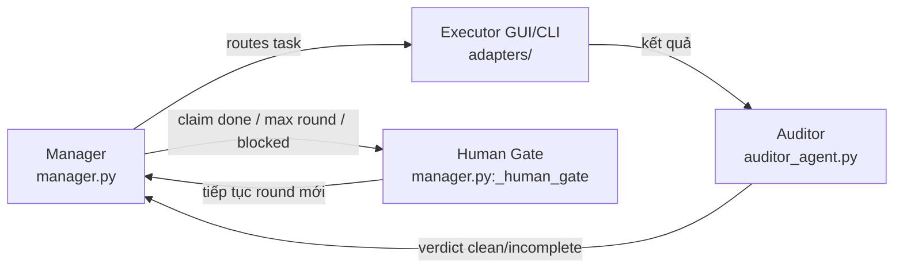
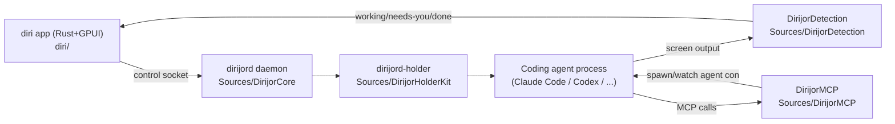
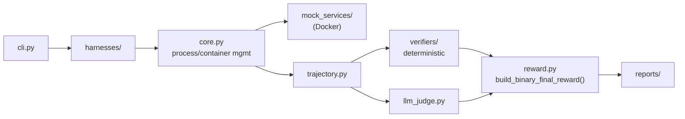
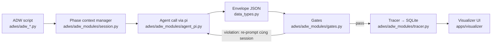

# Weekly Agentic AI Scan — 2026-08-08

**Nguồn dữ liệu:** GitHub Search API (`created:>2026-08-01 stars:>100`, mở rộng `pushed:>2026-08-01 stars:>500`), fetch trực tiếp README + directory tree của từng repo qua raw.githubusercontent.com và github.com.

## Executive Summary

- Tuần này (1–8/8/2026) không có "big bang" framework mới nào nổi bật về mặt lý thuyết — 4 repo được chọn đều là **engineering-heavy tooling** giải quyết một vấn đề cụ thể của agentic workflow ở production: quản lý context dài hạn (LongHorizon-Harness), orchestration nhiều agent trên desktop (diri), eval methodology cho long-horizon agent (RealReplicaBench), và kỷ luật hoá multi-agent SDLC bằng code thay vì prompt (super-simple-software-factory).
- Pattern lặp lại rõ rệt: tách "planning/decision" ra khỏi "execution" bằng một lớp code xác định (deterministic layer) — cả LongHorizon-Harness (Manager/Executor/Auditor) lẫn sssf (Phase + Gate + Envelope) đều theo triết lý "code sở hữu control flow, agent chỉ làm việc trong ranh giới đã gate".
- Không có repo nào trong 4 repo là wrapper mỏng quanh LangChain/CrewAI; tất cả đều có test/CI, license rõ ràng, và ít nhất một tài liệu kiến trúc/thiết kế nằm ngay trong repo (không chỉ marketing blog).

## Mục lục

1. [AMAP-ML/LongHorizon-Harness](#1-amap-mllonghorizon-harness)
2. [cristicretu/diri](#2-cristicretudiri)
3. [Accio-org/RealReplicaBench](#3-accio-orgrealreplicabench)
4. [disler/super-simple-software-factory](#4-dislersuper-simple-software-factory)

---

## 1. AMAP-ML/LongHorizon-Harness

**Repo:** https://github.com/AMAP-ML/LongHorizon-Harness

### §1 — Quick Context

Harness tách planning/execution/verification để agent làm việc dài hơi không "sập" vì context quá tải. Stack: Python 3.10+, chạy trên nền Claude Code hoặc Codex làm agent runtime, có plugin GUI dùng Node.js 20+. Repo health: 394 sao, 42 fork, tạo ngày 04/08/2026, push gần nhất 07/08/2026, license MIT, có `.github/workflows` (CI), có site docs riêng (lh-harness.pages.dev).

### §2 — Architecture Deep-Dive

**A. Component inventory**
- `Manager` (`src/lh_harness/manager.py`) — giữ goal, tiến độ đã verify, bước kế tiếp; hàm `run()` điều phối toàn bộ vòng lặp, `_human_gate()` xử lý điểm dừng cuối mỗi round.
- `Executor GUI/CLI` (`src/lh_harness/adapters/`) — thực thi một sub-task đơn lẻ với context "fresh" (browser, spreadsheet, design tool qua GUI, hoặc code edit/command qua CLI).
- `Auditor` (`src/lh_harness/auditor_agent.py`) — kiểm tra độc lập file, interface, log, test, trả về report có cấu trúc.
- `Runtime signal / logging` (`src/lh_harness/runtime_signals.py`, `agent_logs.py`) — ghi nhận sự kiện phase, lưu `events.jsonl`.
- `CLI entrypoint` (`src/lh_harness/cli.py`), `Config` (`src/lh_harness/config.py`), `Role prompts` (`src/lh_harness/role_prompts.py`), `Dashboard` (`src/lh_harness/dashboard/`).

**B. Control flow — Hierarchical supervisor kèm human-gate, không phải ReAct loop đơn giản**
1. Manager sinh plan và route: GUI-task / CLI-task / ask-user / done / blocked.
2. Executor tương ứng (GUI hoặc CLI) chạy sub-task với context mới hoàn toàn (không kế thừa lịch sử dài của Manager).
3. Auditor kiểm tra độc lập kết quả Executor, sinh report có cấu trúc (clean/incomplete/misaligned).
4. Report của Auditor được feed ngược cho Manager để quyết định round tiếp theo.
5. Khi Manager tuyên bố "done", hệ thống chỉ chấp nhận nếu report Auditor mới nhất xác nhận sạch — nếu không, loop tiếp tục.
6. `_human_gate()` được kích hoạt khi: claim hoàn thành, đạt max round, Manager bị block, hoặc Manager cần hỏi người dùng — operator có thể dừng, bơm thêm instruction, hoặc gia hạn budget.

**C. State & data flow**
- Giao tiếp giữa role dùng object kết quả có cấu trúc (`_run_role_episode`), không phải chuỗi tự do thuần tuý.
- State round-scoped nằm trong dataclass `_GateContext` (bao gồm `completion_satisfied`, `abort_reason`, `carryover_instructions`).
- Lưu trữ: file-based — `events.jsonl` cho audit trail, artifact round được lưu local và remote (trajectories + metadata). Không thấy bằng chứng dùng DB quan hệ hay vector store trong các file đã đọc.
- Context window management: chiến lược chủ đạo là "fresh context cho executor mỗi round" thay vì summarization/sliding window — đây chính là luận điểm kiến trúc cốt lõi của repo ("không để một context ngày càng phình to gánh hết trách nhiệm").

**D. Tool/capability integration**
- Cơ chế cụ thể (function-calling hay JSON parsing) không xác định rõ từ các file đã đọc (`manager.py`, README) — cần đọc `adapters/` và `plugins/` để xác nhận.
- Có thư mục `plugins/` riêng cho khả năng mở rộng GUI (browser, spreadsheet, design app).

**E. Memory architecture:** không xác định từ code đã đọc — không thấy module memory/vector-store rõ ràng trong `src/lh_harness/`.

**F. Model orchestration**
- Config cho phép chọn model theo từng role riêng (`config.py`, `./.lh-harness/config.toml`) — ngụ ý Manager/Executor/Auditor có thể dùng model khác nhau, nhưng phân bổ cụ thể (frontier cho planner, nhỏ cho executor) không xác định từ code, chỉ suy ra từ khả năng cấu hình.

**G. Observability & eval**
- Có thư mục `eval/` riêng và README công bố benchmark cụ thể: WeaveBench 51.8%→80.7%, OSWorld 2.0 cải thiện 3.0×, Terminal-Bench 2.1 69.7%→77.2%.
- Logging qua `events.jsonl` + `agent_logs.py`; không thấy bằng chứng tích hợp OpenTelemetry/Langfuse trong các file đã đọc.

**H. Extension points:** `plugins/` cho GUI capability, cấu hình role/model qua `.lh-harness/config.toml`.

### §3 — Architecture Diagram

### §4 — Verdict

Điểm đáng học: tách rõ "planner giữ trạng thái dài hạn" khỏi "executor luôn chạy với context sạch" — giải quyết trực diện vấn đề context rot mà hầu hết agent loop đơn-context gặp phải, và có số benchmark cụ thể (không chỉ tuyên bố suông) để chứng minh. Red flag: repo mới tạo 4 ngày, chưa rõ độ ổn định của con số benchmark (do ai đo, có reproducible script không); cơ chế tool-calling và memory chưa xác định được từ code đã đọc. Cần đào sâu thêm: đọc `adapters/` và `plugins/` để biết cơ chế gọi tool thực sự, và `eval/` để xác minh benchmark có script tái lập công khai hay không.

---

## 2. cristicretu/diri

**Repo:** https://github.com/cristicretu/diri

### §1 — Quick Context

Native macOS app orchestrate nhiều coding agent (Claude Code, Codex, Cursor, Gemini, shell thường) chạy song song, sống sót qua restart app. Stack: Rust + GPUI (Zed's UI framework) cho desktop app, Swift 6 cho daemon nền (`dirijord`). Repo health: 222 sao, 13 fork, tạo 04/08/2026, push 07/08/2026, có CI badge (`ci.yml`), license Apache-2.0, có `Tests/`.

### §2 — Architecture Deep-Dive

**A. Component inventory**
- `diri` app (`diri/`) — desktop app viết bằng Rust + GPUI: window, sidebar, terminal renderer, command palette, usage accounting.
- `dirijord` daemon (`Sources/DirijorCore`, `Sources/DirijorDaemonKit`) — Swift daemon headless, launch bởi app nhưng sống lâu hơn app; sở hữu PTY, output log offset-addressed (cho detach/replay), session registry, worktree, control socket.
- `dirijord-holder` (`Sources/DirijorHolderKit`, `Sources/dirijord-holder`) — giữ PTY master để session sống sót qua daemon restart.
- `DirijorDetection` (`Sources/DirijorDetection`) — terminal emulator headless để phát hiện trạng thái agent (working/needs-you/done) bằng cách đọc màn hình thực tế agent vẽ ra.
- `DirijorMCP` (`Sources/DirijorMCP`, gồm `McpServer.swift`, `Tools.swift`) — MCP server cho phép một agent đang chạy spawn, theo dõi, đọc output, trả lời prompt của agent khác.
- `DirijorClient` (`Sources/DirijorClient`) — giao thức wire protocol nối app ↔ daemon.
- `DirijorGit` (`Sources/DirijorGit`) — quản lý git worktree cho từng session.
- `dirijor-cli` (`Sources/dirijor-cli`) — CLI nhỏ: MCP shim tiêm vào agent, hook/notify forwarder, lệnh `status`/`doctor`.
- Rust port đang WIP: `diri/crates/diri-engine` (chưa ship, theo `diri/PORT.md`).

**B. Control flow — Two-process wire-protocol architecture, không phải agent loop đơn lẻ mà là orchestrator-of-orchestrators**
1. User tạo session trong app cho một agent (Claude Code/Codex/...) hoặc shell thường, gắn với một git worktree.
2. App gửi lệnh qua control socket tới `dirijord` daemon để spawn PTY + process agent.
3. `dirijord-holder` giữ PTY master; nếu daemon crash/restart, `dirijord-holder` vẫn giữ session sống.
4. Agent chạy, in output ra PTY; `DirijorDetection` đọc màn hình headless để suy ra trạng thái working/needs-you/done, đẩy status này về app qua wire protocol để hiển thị sidebar.
5. Nếu agent hỗ trợ MCP, `DirijorMCP` cho phép chính agent đó spawn/giám sát một agent con khác (agent orchestrate agent).
6. App có thể quit/reopen bất kỳ lúc nào — do PTY và state nằm ở daemon/holder chứ không nằm ở app, mọi session được "replay" lại từ output log offset-addressed.

**C. State & data flow**
- Message format giữa app và daemon: wire protocol riêng qua control socket (không xác định rõ là JSON hay binary từ README — cần đọc `DirijorProtocol/`).
- State lưu trữ: output log offset-addressed theo từng session (file-based) do daemon quản lý, không phải in-memory-only.
- Context window management: không áp dụng trực tiếp — đây là lớp orchestration hạ tầng (terminal/process), không phải lớp reasoning nên không có chiến lược summarization/RAG.

**D. Tool/capability integration**
- Cơ chế register agent là "data, not code": mỗi agent = một file JSON manifest trong `Sources/DirijorCore/Resources/manifests/`, mô tả cách spawn, cách resume, phím tắt approve/deny, và rule đọc màn hình để suy ra trạng thái.
- Gọi tool giữa agent với nhau qua MCP (`DirijorMCP`) — đây là native MCP, không phải JSON-parsing tự chế.
- Sandbox/validation: cô lập theo git worktree (`DirijorGit`) để nhiều agent không đụng độ khi sửa cùng repo; không thấy sandbox process-level (container) trong các file đã đọc.

**E. Memory architecture:** không áp dụng — đây không phải reasoning agent mà là lớp orchestration hạ tầng cho agent khác.

**F. Model orchestration:** không áp dụng trực tiếp — diri không tự gọi LLM, nó điều phối các coding-agent CLI có sẵn (Claude Code, Codex, Cursor, Gemini) như process con.

**G. Observability & eval**
- Có CI (`ci.yml`) và `Tests/` (Swift), cộng `swift test`/`cargo build` trong quy trình build từ nguồn.
- "Status detection" (`DirijorDetection`) bản chất là một dạng observability trạng thái theo thời gian thực, nhưng không có tracing kiểu OpenTelemetry.

**H. Extension points:** thêm agent mới = viết 1 file JSON manifest (copy từ manifest gần giống nhất), không cần đụng code Swift/Rust — đây là điểm mở rộng chủ đích, được README nhấn mạnh là "cách dễ nhất để contribute".

### §3 — Architecture Diagram

### §4 — Verdict

Điểm novel cụ thể: "status detection" bằng cách headless-render và đọc màn hình thực tế agent vẽ ra (thay vì parse log/stdout có cấu trúc), và kiến trúc "app có thể chết, daemon+holder vẫn giữ session sống" tách biệt rõ vòng đời UI khỏi vòng đời process — đây là bài toán thực tế của người chạy nhiều agent CLI song song, giải quyết bằng engineering chứ không phải prompt. Red flag: phần lõi engine đang port sang Rust nhưng chưa ship (`diri/PORT.md`), nghĩa là kiến trúc hiện tại (Swift daemon) sẽ thay đổi; cơ chế wire protocol cụ thể (`DirijorProtocol`) chưa đọc được nội dung nên chưa xác nhận format. Cần đào sâu: đọc `Sources/DirijorProtocol` để biết message schema, và benchmark độ trễ của detection loop khi có 10+ session chạy song song.

---

## 3. Accio-org/RealReplicaBench

**Repo:** https://github.com/Accio-org/RealReplicaBench

### §1 — Quick Context

Benchmark stateful cho long-horizon agent trên bản sao high-fidelity của các dịch vụ thương mại điện tử thật (do team Accio, Alibaba International, phát triển). Stack: Python 3.11+, Docker, hỗ trợ multi-provider (Gemini, Qwen/DashScope, OpenRouter, OpenAI/Anthropic-compatible). Repo health: ~1.0k sao, 79 fork, có `.github/workflows`, `CONTRIBUTORS.md`, dual license (Apache-2.0 code / CC-BY-4.0 dataset).

### §2 — Architecture Deep-Dive

**A. Component inventory**
- `CLI entrypoint` (`real_replica_bench/cli.py`, `__main__.py`) — điểm vào chạy benchmark.
- `Core process/container manager` (`real_replica_bench/core.py`) — quản lý subprocess/Docker, I/O container, ghi kết quả agent; chứa các hàm `run()`, `docker()`, `popen_docker_exec_log()`, `terminate_process()`, `copy_from_container()`, `write_agent_result()`.
- `Harnesses` (`real_replica_bench/harnesses/`) — bộ chạy nhiệm vụ cụ thể theo loại interface (CLI/browser/file/API-MCP).
- `Mock services` (`real_replica_bench/mock_services/`, `docker/openclaw/`) — bản mock local các nền tảng thương mại thật, không cần tài khoản production.
- `Verifiers` (`real_replica_bench/verifiers/`) — kiểm tra kết quả theo kịch bản deterministic.
- `LLM judge` (`real_replica_bench/llm_judge.py`, `llm_judge_cli.py`) — kiểm tra kết quả bằng LLM khi không thể verify deterministic.
- `Reward` (`real_replica_bench/reward.py`) — quy đổi kết quả verifier thành điểm số benchmark, hàm chính `build_binary_final_reward()`.
- `Trajectory` (`real_replica_bench/trajectory.py`) — ghi lại quỹ đạo hành động của agent.
- `Reports` (`real_replica_bench/reports/`), `Prompts` (`prompts.py`), `Constants` (`constants.py`).

**B. Control flow — Task-runner theo kiến trúc container-isolated, không phải agent loop mà là eval harness**
1. `cli.py` nhận cấu hình task/model, gọi harness tương ứng theo loại task (CLI/browser/file/API).
2. Harness khởi tạo container Docker cô lập, dùng `core.py` để spawn process/exec lệnh vào container và mock service tương ứng (`mock_services/`).
3. Agent (model được test) thực thi task bên trong container; `trajectory.py` ghi lại từng bước hành động.
4. Sau khi agent kết thúc, `verifiers/` chạy kiểm tra deterministic (script-based) trước; nếu task cần đánh giá tự nhiên hơn (vd. nội dung mô tả sản phẩm), `llm_judge.py` được gọi.
5. `reward.py` gộp kết quả verifier + llm-judge thành điểm nhị phân — v2 dùng tỷ lệ `checks_passed/checks_total` từ `test.sh`, mọi check bắt buộc phải pass để tính "1.0".
6. Kết quả xuất ra `reports/`.

**C. State & data flow**
- Message/kết quả giữa các layer: JSON có cấu trúc (`write_agent_result()` ghi kết quả chuẩn hoá gồm duration, pass/fail, response text).
- State: container Docker cô lập theo từng episode — không có shared state giữa các task, đúng tinh thần "reproducible replicas".
- Context window management: không xác định từ code đã đọc — đây là benchmark harness, quản lý context là trách nhiệm của agent được test, không phải harness.

**D. Tool/capability integration**
- Harness hỗ trợ 4 nhóm interface: 53 CLI, 28 browser, 16 file, 10 API/MCP task (theo README) — nghĩa là có tích hợp MCP thật cho nhóm API/MCP task.
- Validation/sandbox: mỗi task chạy trong container Docker riêng, `terminate_process()` xử lý timeout escalation (graceful → kill).

**E. Memory architecture:** không áp dụng — đây là benchmark, không phải agent có memory riêng.

**F. Model orchestration**
- Hỗ trợ multi-provider qua route (native Gemini, Qwen/DashScope, OpenRouter, OpenAI/Anthropic-compatible) — không phải orchestration nhiều role model, mà là để so sánh nhiều model trên cùng benchmark.
- README công bố số liệu: Claude Opus 5 dẫn đầu OpenClaw (56.1%), theo sau Claude Opus 4.8 (51.4%), GPT-5.6 Sol (49.5%); trên Accio harness riêng, Claude Opus 5 đạt 61.7%.

**G. Observability & eval — đây chính là trọng tâm của repo**
- Eval methodology non-trivial: 3 nhóm capability (text-only/browser-text-capable/vision-required), verify kết hợp deterministic script + LLM-judge, v2 reward schema dùng check-count thật từ `test.sh` thay vì v1 "x/3" cố định — cho thấy nhóm dev đã tự phát hiện và sửa vấn đề "reward hack" của schema cũ.
- `collect_proxy_usage()` trong `core.py` thu thập dữ liệu billing/token qua proxy shim — có ý thức đo cost, không chỉ pass/fail.

**H. Extension points:** repo chủ động mời đóng góp mock environment mới, có chuẩn trong `CONTRIBUTING.md`, mock được duyệt sẽ vào release sau.

### §3 — Architecture Diagram

### §4 — Verdict

Điểm đáng học cụ thể: reward schema v2 chuyển từ "x/3 cố định" sang `checks_passed/checks_total` lấy trực tiếp từ `test.sh` — một sửa lỗi eval methodology thực tế cho thấy nhóm dev từng bị reward hack và đã fix bằng cách gắn chặt reward vào script kiểm tra thay vì heuristic; kết hợp deterministic verifier + LLM-judge theo 3 nhóm capability (text/browser/vision) cũng là thiết kế eval khá chín. Red flag: benchmark do chính Alibaba (bên có lợi ích trong việc mock nền tảng thương mại của họ) phát triển và công bố số liệu Claude/GPT tự đo — cần kiểm chứng độc lập trước khi tin số liệu leaderboard. Cần đào sâu thêm: đọc `verifiers/` để biết mức độ "gameable" của check deterministic, và cơ chế `collect_proxy_usage()` để hiểu proxy shim có ảnh hưởng hành vi agent hay không.

---

## 4. disler/super-simple-software-factory

**Repo:** https://github.com/disler/super-simple-software-factory

### §1 — Quick Context

Skill cho Claude Code biến multi-agent SDLC (plan→build→test→review→document) thành workflow deterministic: code sở hữu vòng lặp, agent chỉ là node bị gate trong từng phase. Stack: Python + YAML config, agent runtime `pi`, SQLite cho trace, Vue/Vite/Bun cho UI trace. Repo health: 498 sao, 120 fork, tạo 02/08/2026, push 04/08/2026, license MIT, có kèm video YouTube giải thích thiết kế.

### §2 — Architecture Deep-Dive

**A. Component inventory**
- `SKILL.md` (`.claude/skills/sssf/SKILL.md`) — hard rule + bảng route request tới 1 trong 9 cookbook.
- `Cookbooks` (`.claude/skills/sssf/cookbooks/`) — playbook lazy-load: setup factory, tạo ADW, sửa chain, thêm agent, chạy & giám sát.
- `ADW scripts` (`adws/adw_*.py`, 12 workflow khởi điểm: `adw_prompt`, `adw_scout`, `adw_plan`, `adw_build`, `adw_quality`, `adw_plan_build`, `adw_build_test`, `adw_build_review`, `adw_plan_build_test`, `adw_plan_build_test_quality`, `adw_document`, `adw_simple_sdlc`).
- `ADW modules` (`adws/adw_modules/`) — toàn bộ logic thấp cấp: `agents.py` (load/validate config), `session.py` (`ensure()`), `gates.py`, `quality.py`, `git_helper.py`, `tracer.py`, `agent_pi.py`.
- `Agent roster config` (`adws/adw_sssf_config/sssf.config.yaml`) — mỗi agent định nghĩa qua 4 trục: context, model, prompt, tools.
- `Envelope schema` (`data_types.py`, ví dụ `EnvelopeBase`, `BuildOutput`).
- `Visualizer` (`.claude/skills/sssf/apps/visualizer/`) — Vue + Vite serve bởi Bun, đọc trực tiếp SQLite.

**B. Control flow — Deterministic orchestrator (code-owns-the-graph), không phải agent-loop tự trị**
1. ADW script load config, validate roster bắt buộc (`agents.validate(cfg, REQUIRED_AGENTS)` — thiếu agent thì fail trước khi spawn bất cứ gì).
2. `session.ensure()` pin-or-create session cho `adw_id`.
3. Mỗi bước bọc trong `run.phase(PhaseParams(...))` — 3 kind: `engineer` (người), `agent` (`ph.call(...)`: prompt vào, envelope JSON có kiểu ra, gate verify), `code` (bước code thuần, vd. commit).
4. Agent trả JSON đúng schema đã khai (`output_type=`); nếu parse lỗi hoặc gate fail, hệ thống **re-prompt cùng session** với correction cụ thể — không cold-restart, giữ nguyên context.
5. `run.finish(accepted=review.approved, reason=...)` quyết định exit code + trạng thái session cùng lúc.
6. Toàn bộ event (tool call, phase, envelope, gate result) stream real-time vào SQLite qua `tracer.py`; `apps/visualizer` poll DB bằng một câu query cursor duy nhất để hiển thị cả live view lẫn lịch sử.

**C. State & data flow**
- Message format: JSON envelope có kiểu (Pydantic-style `BaseModel`), không phải string tự do — mỗi agent-call khai `output_type=` cụ thể.
- State storage: SQLite WAL-mode, 7 bảng (`sessions`, `phases`, `events`, `envelopes`, `gate_results`, `agent_sessions`, `processes`); file thô (`raw_output.jsonl`, `envelope.json`) là bản ghi gốc, DB là "bản mirror có thể truy vấn" — README nói rõ "losing DB loses nothing you cannot rebuild".
- Context window management: mỗi agent-call dùng `--session-id` create-or-continue của `pi`, nên context của một agent được giữ xuyên suốt nhiều lần gọi trong cùng phase-chain thay vì tóm tắt lại — chiến lược "correction thay vì cold-restart" chính là cách giữ context rẻ.

**D. Tool/capability integration**
- Đăng ký agent qua YAML (`sssf.config.yaml`), không phải code — mỗi agent có `tools` (danh sách năng lực, vd. `bash`, `write`) tách biệt với `writes` (danh sách path được phép ghi).
- Validation: sau mỗi call, hệ thống so sánh repo trước/sau; thay đổi ngoài `writes` bị rollback và phase fail — đây là sandbox ở mức "diff-based enforcement", không phải container sandbox.
- Gate là hàm thuần: `gate(envelope, run) -> GateReport`, ví dụ có sẵn `artifacts_exist`, `files_non_empty`, `json_parses`, `diff_matches_claims`, `tests_pass(...)`.

**E. Memory architecture:** không có long-term memory/vector retrieval — "bộ nhớ" duy nhất là envelope truyền qua từng phase cộng với session resume của `pi`; đây là thiết kế cố ý (stateless phase, state ở code).

**F. Model orchestration**
- Multi-model theo role thực tế trong roster mẫu: `google/gemini-3.6-flash` (builder/scout, mặc định), `fireworks/.../kimi-k3` (planner, thinking cao hơn), `openai/gpt-5.6-terra` và `gpt-5.6-luna` (reviewer, documenter) — đúng pattern "planner dùng model mạnh hơn, các role khác linh hoạt theo chi phí".
- Không có fallback/parallelism/batching tự động được đề cập — validate chỉ kiểm tra format `provider/model-id`, không kiểm tra key có hoạt động hay không (lỗi phát hiện giữa chừng khi agent chạy).

**G. Observability & eval**
- Observability là trụ cột thiết kế: mọi event ghi SQLite ngay khi xảy ra (không phải sau khi xong), UI trace xem được live.
- "Eval hook" không phải theo nghĩa benchmark mà là `gates.py` + `tests_pass()` — README thẳng thắn cảnh báo: bản cài mới có `quality.py` placeholder luôn exit 0, phải tự nối lệnh test thật trước khi tin `adw_build_test`.

**H. Extension points:** thêm agent = sửa 1 dòng YAML; thêm chain = copy ADW script gần nhất (40–180 dòng); thêm gate = viết 1 hàm trong `gates.py`; toàn bộ template nằm ở `templates/` để fork/stamp vào repo khác.

### §3 — Architecture Diagram

### §4 — Verdict

Điểm novel cụ thể: tách `tools` (agent được phép làm gì) khỏi `writes` (agent được phép sửa gì) rồi enforce bằng diff-check sau mỗi call — giải quyết đúng vấn đề "agent nói không sửa gì nhưng lỡ tay sửa" mà nhiều framework bỏ qua; và cơ chế "gate fail → re-prompt cùng session thay vì cold-restart" là insight thực dụng hiếm thấy được viết thành pattern rõ ràng thay vì giấu trong code. Red flag tác giả tự nêu thẳng: `quality.py` mặc định là placeholder pass giả, không sandbox/branch-per-run, không rollback tự động khi merge — đây là framework cho một use case hẹp (repeatable SDLC trong 1 repo, 1 branch), không phải multi-tenant production. Cần đào sâu thêm: đọc `gates.py` để đánh giá độ chặt của `diff_matches_claims`, và so sánh nhánh `example` (đã stamp thật) để xem trace SQLite thực tế có khớp mô tả README không.
