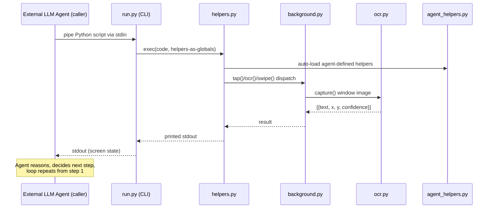

# Weekly Agentic AI Scan — 2026-08-11

**Executive summary:**
- Tuần này chỉ có **1 repo** vượt qua bộ lọc relevance đầy đủ (kiến trúc thật, có evidence từ code, không phải awesome-list/tutorial): [`ShawnPana/phone-harness`](https://github.com/ShawnPana/phone-harness) — một harness cho LLM agent điều khiển iPhone thật qua macOS iPhone Mirroring, không cần jailbreak.
- Điểm đáng học nhất: harness **không tự chạy vòng lặp agent** — nó là một lớp perception-action *stateless*, mỗi lần gọi CLI là một bước "quan sát → hành động" đơn lẻ; vòng lặp reasoning nằm hoàn toàn ở agent gọi nó (Claude Code, Codex...). Đây là một cách tách trách nhiệm (separation of concerns) khác biệt so với các "agent framework" thường tự ôm cả loop lẫn tool.
- 8 candidate còn lại trong tập kết quả tìm kiếm bị loại: phần lớn là skill-content pack mỏng (< 500 LOC), MCP server wrapper thuần túy, hoặc tự nhận là tài liệu "tutorial/hướng dẫn" (`pi-from-scratch`, `pi-book`) — xem bảng loại trừ ở cuối file.

**Table of contents:**
- [phone-harness](#phone-harness)
- [Phương pháp & giới hạn tuần này](#phuong-phap)
- [Candidate bị loại](#loai-tru)

---

## phone-harness

### §1 — Quick Context

Harness mỏng cho LLM điều khiển iPhone thật qua cửa sổ iPhone Mirroring của macOS — không jailbreak, không WebDriverAgent.

- **Tech stack**: Python 3.10+, PyObjC (`Quartz`, `Vision`, `AppKit`, `ApplicationServices`), không phụ thuộc framework agent nào (không LangChain/CrewAI); build bằng `hatchling`.
- **Repo health**: 1.4k sao (theo GitHub search), tác giả solo (`ShawnPana`, 1 contributor duy nhất trong 18 commit gần nhất), commit đầu tiên quan sát được là 2026-08-07, commit gần nhất 2026-08-09 (merge PR #15 "background-by-default") — repo mới hoàn toàn trong tuần. **Không có CI workflow, không có thư mục test** nào trong repo.

### §2 — Architecture Deep-Dive

**A. Component inventory**

- `CLI entrypoint` (`src/phone_harness/run.py`) — đọc mã Python từ stdin và `exec()` nó với các hàm trong `helpers` được bind sẵn vào globals (`run.py:30-36`). Đây là ranh giới nơi agent bên ngoài điều khiển harness.
- `Helper / tool surface` (`src/phone_harness/helpers.py`) — tập hàm nguyên thủy (`ocr()`, `tap_text()`, `swipe()`, `scroll_collect()`, `ensure_mirroring()`...) đóng vai trò "tool" cho agent; tự chọn backend transport lúc import (`helpers.py:20-27`).
- `Mirror transport` (`src/phone_harness/mirror.py`) — backend nền tảng: định vị cửa sổ mirroring, `screencapture`, gửi input ở tầng CGEvent (HID-level), yêu cầu cửa sổ phải ở foreground.
- `Background transport` (`src/phone_harness/background.py`) — backend mặc định (từ PR #15): dùng `CGWindowListCreateImage` để chụp cửa sổ dù không active, và ghi trực tiếp event record vào SkyLight qua `SLPSPostEventRecordTo` (cùng cơ chế yabai dùng để focus window) để gõ/chạm mà **không cướp focus màn hình** của user.
- `OCR perception` (`src/phone_harness/ocr.py`) — dùng Vision framework nhận dạng text trong ảnh chụp, trả về toạ độ tap-ready; tác giả gọi đây là "the poor man's DOM" (`ocr.py:1-5`, README dòng 68-70).
- `Diagnostics` (`src/phone_harness/admin.py`) — lệnh `--doctor` kiểm tra chuỗi quyền hạn (Accessibility, Screen Recording), sự tồn tại của app, cửa sổ mirroring, và thử capture + OCR thật.
- `Agent workspace` (`agent-workspace/agent_helpers.py`) — điểm mở rộng: agent tự viết thêm helper tại runtime, được auto-load vào namespace mỗi script. Evidence cụ thể: hàm `tap_icon()` có docstring "Learned: tapping the label text itself does NOT launch the app..." — cho thấy agent đã *tự ghi lại* một bài học hành vi vào đây.
- `External LLM agent (caller)` — không có file trong repo này, nhưng được evidence gián tiếp qua hợp đồng stdin/exec của `run.py` và hướng dẫn "Setup prompt" trong README (dòng 22-47): agent ngoài (Claude Code/Codex) là bên thực sự chạy vòng lặp reasoning, lặp lại việc gọi `./phone-harness` nhiều lần.

**B. Control flow**

Không phải ReAct-loop hay planner-executor *bên trong repo* — vòng lặp think→act→observe nằm ở agent gọi ngoài; harness chỉ là actuator một bước, stateless. Happy path (đánh số theo lần gọi CLI):

1. Agent ngoài quyết định bước tiếp theo, viết một đoạn Python ngắn gọi các hàm helper.
2. Agent pipe đoạn code đó vào `./phone-harness` qua stdin; `run.py` exec nó với helpers đã bind (`run.py:30-36`).
3. Lệnh gọi (vd `ocr()`) đi qua `helpers.py` xuống backend đang active — mặc định `background.py`, fallback `mirror.py` nếu backend nền không load được (`helpers.py:20-27`).
4. Backend chụp cửa sổ mirroring và/hoặc gửi input tổng hợp (CGEvent hoặc SkyLight event record).
5. `ocr.py` chuyển ảnh chụp thành danh sách text + toạ độ; kết quả in ra stdout.
6. Agent ngoài đọc stdout, suy luận bước kế tiếp, lặp lại từ bước 1 — hoàn toàn bên ngoài codebase này.

**C. State & data flow**

Message format giữa CLI và agent là **mã nguồn Python thô** qua stdin/stdout, không phải JSON/dict có schema. State storage: **không có** — README nói rõ "the mirror transport is stateless... so there is no daemon; every invocation is self-contained" (README dòng 110-111); `mirror.py`/`background.py` re-query window bounds mỗi lần gọi. Context window management: không xác định từ code — hoàn toàn thuộc trách nhiệm của agent ngoài, harness không quản lý context nào cả.

**D. Tool / capability integration**

Không có registry hay JSON-schema function-calling kiểu OpenAI/MCP. Cơ chế thực chất là **code execution**: mọi hàm public trong `helpers` (lọc theo không bắt đầu bằng `_`) được đổ thẳng vào globals của `exec()` (`run.py:33-34`), agent gọi chúng như gọi hàm Python bình thường. Không có validation hay sandbox nào đối với mã agent gửi vào — `exec(code, g)` chạy trực tiếp; guardrail duy nhất là ở tầng prompt (`SKILL.md` mục "Consent": dừng lại và hỏi user trước hành động khó đảo ngược).

**E. Memory architecture** — không có, bỏ qua theo hướng dẫn (không tìm thấy evidence).

**F. Model orchestration** — không xác định/không áp dụng: repo **không gọi LLM API nào** trong code của nó; toàn bộ suy luận nằm ở agent bên ngoài (Claude Code, Codex...).

**G. Observability & eval**

Không có tracing framework (không OpenTelemetry/Langfuse). Gần nhất với observability là `--doctor` (`admin.py`) — chuỗi health-check thực thi từng bước (permission → app → window → capture → OCR) và in PASS/FAIL kèm gợi ý sửa. Không có eval hook hay replay capability nào được tìm thấy.

**H. Extension points**

Hai điểm mở rộng rõ ràng có evidence: (1) `agent-workspace/agent_helpers.py` — nơi agent tự thêm helper theo tác vụ, auto-load mỗi lần chạy; (2) biến môi trường `PHONE_HARNESS_BACKGROUND` (`helpers.py:20`) chuyển đổi giữa backend `background`/`mirror`.

### §3 — Architecture Diagram

### §4 — Verdict

**Điểm novel**: chủ động **không** ôm lấy vòng lặp reasoning — khác với đa số "computer-use agent" đóng gói cả loop lẫn model call, `phone-harness` chỉ là actuator/perception layer stateless, để agent ngoài (đã có context, đã có model) tự lái. Kỹ thuật background-input qua `SLPSPostEventRecordTo` (mượn từ yabai) để tap mà không cướp focus màn hình là một chi tiết engineering thật, không phải marketing — có giải thích rõ trade-off trong docstring của `background.py`.

**Red flags**: không có test, không có CI; `exec()` chạy code agent gửi vào mà không sandbox — an toàn phụ thuộc hoàn toàn vào guardrail dạng prompt (`SKILL.md`), không phải code; single-contributor, 4 ngày tuổi — chưa được stress-test bởi cộng đồng.

**Open questions**: backend `SLPSPostEventRecordTo` dùng offset buffer cứng ("0xf8 buffer... window id at 0x3c") mượn từ reverse-engineering của yabai — độ ổn định qua các bản macOS khác nhau chưa rõ; cũng chưa rõ cơ chế nào (nếu có) ngăn agent lạm dụng quyền Accessibility/Screen Recording ngoài phạm vi tác vụ.

---

## Phương pháp & giới hạn tuần này

Discovery bị giới hạn nhiều bởi tooling của session này:
- Không có `gh` CLI / GitHub REST API trực tiếp (`api.github.com` trả 403 qua proxy).
- GitHub MCP server trong session này chỉ được scope vào repo `undertheseanlp/underthesea`, không dùng để search kho GitHub bất kỳ.
- Fallback: fetch trực tiếp trang `github.com/search` (không phải API) cho 1 query duy nhất (`agent OR agentic OR multi-agent created:>2026-08-04 stars:>200`, sort theo sao) → 9 kết quả thô. Query thứ hai để mở rộng phạm vi bị GitHub trả về `429 Too Many Requests` (Retry-After 3600s) nên không thực hiện được trong phiên này.
- Với 9 candidate thô, mỗi repo được `git clone --depth` thật để đọc README/tree/source code làm evidence (không dựa vào tóm tắt của web search, vốn cho thấy dấu hiệu số liệu không đáng tin ở một số truy vấn khác).

Vì chỉ có 1 repo vượt qua bộ lọc relevance đầy đủ (< 2), lẽ ra áp dụng EMPTY-WEEK PROTOCOL — nhưng vì đã có 1 phân tích kiến trúc đầy đủ, có evidence xác thực, quyết định giữ lại thay vì bỏ trống, và ghi rõ giới hạn ở đây thay vì nặn thêm repo cho đủ số lượng.

## Candidate bị loại (từ cùng 1 query, để minh bạch)

| Repo | Sao | Lý do loại |
|---|---|---|
| `Binaryify/open-kimi-ppt-skill` | 1.6k | Archived, repo chỉ có 1 file (README) — không có code để phân tích |
| `eternityspring/shuohao-skills` | 655 | Chỉ là gói nội dung skill (markdown), 0 dòng code thực thi |
| `sv-number/mcp-server` | 569 | MCP server thuần (388 LOC), wrapper mỏng quanh API SMS, không có kiến trúc agent |
| `tanishqkancharla/calldiff` | 305 | Dev tool diff call-stack cho code review — không phải bản thân là hệ agentic (dù có AGENTS.md/skills để agent khác dùng) |
| `robonuggets/gauntlet-loop` | 268 | Chỉ có README + Claude skill file + ảnh, 0 dòng code — prompt template trá hình framework |
| `antinomie-lab/pi-book` | 240 | Tự mô tả là "architecture notes" — sách/tài liệu, không phải implementation |
| `SaladDay/pi-from-scratch` | 228 | Tự nhận trong package.json (`typescript-tutorial`) và README ("这是一篇文章，不是一本书") là bài viết giáo dục rút gọn từ repo `pi` khác — thuộc diện tutorial material bị loại theo tiêu chí đề bài, dù code (~4k LOC) khá đầy đủ |
| `liujunxibaba/douyin-tiktok-story-skill-agent` | 212 | Gói skill tạo nội dung video ngắn, 254 LOC, cấu trúc `skill/SKILL.md` — quá mỏng để phân tích kiến trúc có ý nghĩa |
