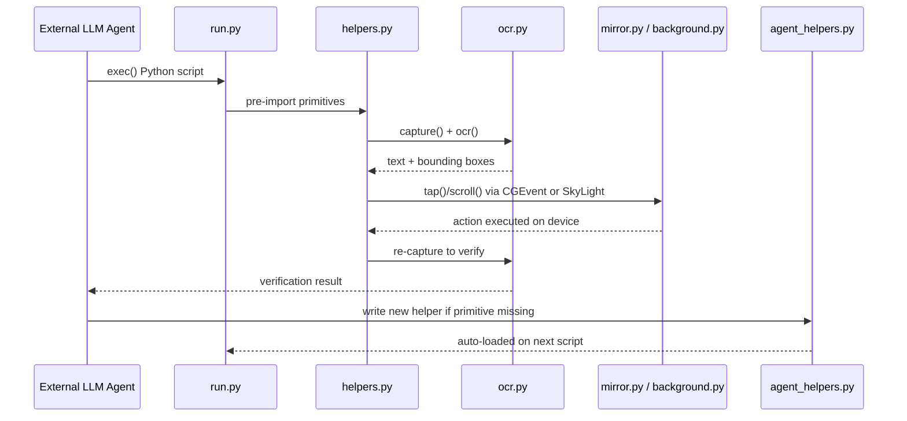
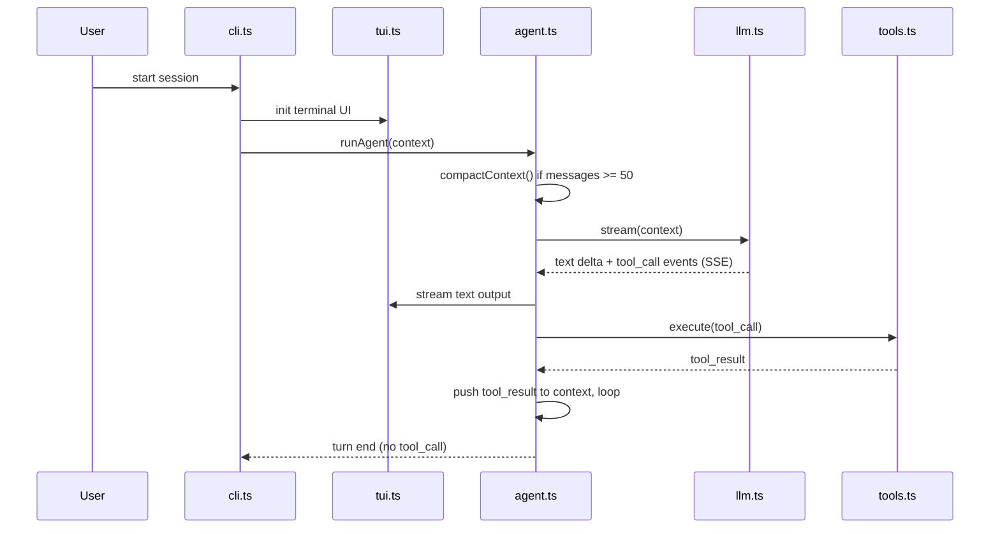

# Weekly Agentic AI Scan — 2026-08-13

**Cửa sổ tìm kiếm:** repos tạo mới từ 2026-08-06 đến 2026-08-13, `stars:>200`, qua GitHub Search API (`q=agent OR multi-agent OR agentic created:>2026-08-06 stars:>200`).

## Tóm tắt (3 bullet)

- Tuần này **rất mỏng** ở khoản repo mới (created trong 7 ngày) có kiến trúc agentic thật sự đáng đào sâu: search primary trả 6 kết quả, sau khi lọc theo tiêu chí (loại awesome-list, skill-definition thuần markdown, thin API wrapper, book/docs site) chỉ còn **2 repo pass filter** — không đạt ngưỡng "4 repo" mong muốn nhưng vượt ngưỡng empty-week (<2).
- Cả hai repo pass đều KHÔNG phải multi-agent orchestration framework cỡ lớn, mà là **compact, single-purpose implementations**: một harness điều khiển iPhone thật qua private macOS API (`phone-harness`), và một bản viết lại tối giản ~767 dòng của agent loop kiểu "pi" để học kiến trúc (`pi-from-scratch`) — cả hai đáng chú ý vì code đủ nhỏ để đọc hết trong một buổi, và cả hai đều **không có sandbox/validation** cho hành động tool-call, một pattern lặp lại đáng lưu ý.
- Một ứng viên thứ ba (`calldiff`) là AST-based call-stack diffing tool cho "agentic code review" — kỹ thuật tốt (Tree-sitter, 22 ngôn ngữ) nhưng bản thân không phải agent nên chỉ được ghi nhận honorable mention, không deep-dive đầy đủ.

## Mục lục

- [1. ShawnPana/phone-harness](#1-shawnpanaphone-harness)
- [2. SaladDay/pi-from-scratch](#2-saladdaypi-from-scratch)
- [Honorable mention: calldiff](#honorable-mention-tanishqkancharlacalldiff)
- [Loại khỏi digest tuần này](#loại-khỏi-digest-tuần-này)

---

## 1. ShawnPana/phone-harness

**Repo:** https://github.com/ShawnPana/phone-harness

### §1 — Quick context

Harness Python cho LLM agent điều khiển iPhone thật qua macOS iPhone Mirroring, không cần jailbreak. Tech stack: Python 3.10+, PyObjC (Quartz, Vision, AppKit, ApplicationServices), build bằng Hatchling; **không có LLM/model dependency nào trong code** — hoàn toàn model-agnostic, agent ngoài (Claude Code/Codex) mới cầm model. Repo health: 1662 sao, 145 fork, 21 open issue, **chỉ 1 contributor** (18 commit), tạo 2026-08-07, push gần nhất 2026-08-13 (đang active). Không có `.github/workflows` và không có thư mục `tests/`.

### §2 — Architecture deep-dive

**A. Component inventory**
- `CLI/entrypoint` (`src/phone_harness/run.py`) — `exec()` script Python từ stdin với helpers pre-import sẵn vào namespace; xử lý flag `--doctor` và lệnh `skill`.
- `Foreground transport` (`src/phone_harness/mirror.py`) — tìm window iPhone Mirroring qua Quartz, chụp màn hình bằng `screencapture -l`, gửi CGEvent (tap/drag/scroll/keycode) khi window đang frontmost.
- `Background transport` (`src/phone_harness/background.py`) — dùng private API SkyLight (`SLPSPostEventRecordTo`, `_SLPSSetFrontProcessWithOptions`) đóng gói "0xf8 buffer" để bơm event thẳng vào process, không cần cướp focus — kỹ thuật giống cơ chế yabai dùng.
- `OCR/perception` (`src/phone_harness/ocr.py`) — Vision framework, trả text kèm bounding box quy đổi ra tọa độ màn hình.
- `Helper/primitive library` (`src/phone_harness/helpers.py`, file lớn nhất ~13.8KB) — các hàm `tap_text`, `scroll_collect`, `wait_stable`, `connection_state`, `ensure_mirroring`.
- `Doctor/diagnostics` (`src/phone_harness/admin.py`) — kiểm tra permission, framework, capture, OCR trước khi chạy.
- `Agent-editable tool file` (`agent-workspace/agent_helpers.py`) — nơi agent tự viết hàm còn thiếu, được auto-load vào mọi script chạy sau đó.

**B. Control flow — pattern nào?**
Repo **không chứa agent loop/reasoning nội bộ** — nó chỉ là lớp perception-action (tools); planner nằm ở agent ngoài. Pattern thực chất là perceive-act-verify điều khiển từ bên ngoài:
1. Agent ngoài (Claude Code/Codex) viết một script Python (dùng `open_app`, `tap_text`, `type_text`...).
2. `run.py` `exec()` script đó với các helper đã pre-import sẵn.
3. `ocr()`/`capture()` đọc màn hình hiện tại (perceive).
4. `mirror.py` (CGEvent) hoặc `background.py` (SkyLight record) thực thi hành động (act).
5. Agent gọi lại `ocr()`/screenshot để xác nhận kết quả (verify).
6. Nếu thiếu primitive cần dùng, agent tự viết thêm hàm vào `agent_helpers.py` để lần sau tái sử dụng.

**C. State & data flow**
Message format là lời gọi hàm Python trả list-of-dict (`{"text":..., "box":..., "center":...}`) — không phải JSON-RPC hay schema chuẩn hoá. Không có state lưu trữ bền vững: README nói rõ "no daemon", mỗi lần gọi re-query window bounds qua Quartz (stateless theo thiết kế). Context-window management nằm ngoài phạm vi repo, do agent ngoài tự quản lý.

**D. Tool/capability integration**
Kiểu **code execution** thuần: agent viết code Python thật, không qua JSON function-calling hay MCP. Đáng chú ý: **không có validation/sandbox** cho code exec từ stdin (`run.py` `exec()` trực tiếp) — trong khi harness này có quyền điều khiển một thiết bị vật lý thật.

**E. Memory architecture**
Không có memory cổ điển (không vector DB, không summarization/retrieval). Điểm thú vị duy nhất: `agent_helpers.py` hoạt động như "self-extending tool library" — agent ghi hàm mới vào đây ngay trong lúc chạy, tự động load ở lần sau, gần như procedural memory nhưng thực hiện bằng cách sửa code trực tiếp thay vì lưu vector/text.

**F. Model orchestration**
Không xác định từ code — repo hoàn toàn model-agnostic, không gọi LLM API nào.

**G. Observability & eval**
Không có logging/tracing framework (không OpenTelemetry/Langfuse/custom tracer). `admin.py --doctor` chỉ là preflight check tĩnh (permission/OCR sanity), không phải trace hay eval hook.

**H. Extension points**
Biến môi trường `PHONE_HARNESS_BACKGROUND` chọn backend (foreground/background); `agent-workspace/agent_helpers.py` cho agent tự thêm hàm; file `SKILL.md` đăng ký harness như một "agent skill" để Claude Code/Codex tự nhận diện và dùng.

### §3 — Architecture diagram

### §4 — Verdict

**Đáng học:** (1) dùng private API SkyLight để bơm input mà không cướp focus — kỹ thuật hiếm gặp ngoài giới window-manager (yabai); (2) pattern "self-extending helper file" — agent tự sửa tool library của chính nó khi chạy, thú vị hơn cách tiếp cận RAG-memory thông thường vì nó mở rộng *capability* chứ không chỉ *context*.

**Red flags:** 1 contributor duy nhất, không CI/tests, `exec()` code Python tùy ý từ agent với quyền điều khiển thiết bị thật mà không sandbox nào, phụ thuộc private API macOS (dễ vỡ khi Apple update SkyLight), chỉ hỗ trợ macOS + iPhone, repo mới 6 ngày nên production-readiness chưa kiểm chứng dù đang viral.

**Câu hỏi mở:** cơ chế an toàn/consent khi agent bị prompt-injection điều khiển phone thật dựa vào đâu ngoài quy ước mô tả trong `SKILL.md` (không có enforcement bằng code)? Backend SkyLight còn hoạt động qua các bản macOS tương lai không?

---

## 2. SaladDay/pi-from-scratch

**Repo:** https://github.com/SaladDay/pi-from-scratch

### §1 — Quick context

Bản viết lại tối giản (767 dòng TypeScript trong `src/`) của agent coding "pi" (dự án gốc `earendil-works/pi`), dạy đọc/sửa file và chạy lệnh shell qua một agent loop cơ bản. Tech stack: TypeScript thuần, Node.js 22+, **zero runtime dependency** (`dependencies: {}`) — chỉ dùng `fetch` native gọi OpenAI-compatible API; devDeps gồm `typescript`, `vitest`, `tsx`. Repo health: 804 sao, 52 fork, 19 commit, tạo 2026-08-09 (4 ngày tuổi), có 6 file test dùng vitest nhưng **không có CI** (`.github/workflows/` không tồn tại); dấu hiệu là dự án một tác giả.

### §2 — Architecture deep-dive

**A. Component inventory**
- `Agent Loop` (`src/agent.ts`, 174 dòng) — vòng lặp điều phối stream LLM, thực thi tool, quản lý context, gọi context compaction khi cần.
- `LLM Client` (`src/llm.ts`, 268 dòng) — tự viết parser SSE stream từ OpenAI Chat Completions API thành các event, convert `Context` ↔ OpenAI messages format; không dùng SDK chính thức nào.
- `Tools` (`src/tools.ts`, 125 dòng) — 4 tool built-in: `read_file`, `write_file`, `edit` (unique-match replace), `run_bash`.
- `CLI` (`src/cli.ts`, 112 dòng) — lớp lắp ráp agent + tui + tools + llm, quản lý session persistence dạng JSONL.
- `TUI` (`src/tui.ts`, 88 dòng) — terminal UI tối giản dùng `readline`, in streaming text, xử lý Ctrl+C abort.

**B. Control flow — pattern nào?**
**Agent loop dạng async generator** (`runAgent(): AsyncGenerator<AgentEvent>`), tương tự ReAct nhưng không có bước "reasoning" tách biệt rõ ràng — model tự quyết định text vs tool_call trong cùng một lần stream:
1. `compactContext()` kiểm tra ngưỡng nén trước khi gọi model.
2. Stream LLM, tích lũy text delta + tool_call delta qua `for await`.
3. Đẩy assistant message hoàn chỉnh vào `context.messages`.
4. Nếu `stopReason === 'max_tokens'` và có tool_call dở dang → trả lỗi truncation, không thực thi.
5. Nếu không có tool_call → kết thúc turn.
6. Nếu có tool_call → thực thi **tuần tự** từng tool (`for...of`, không parallel), đẩy tool_result vào context, quay lại bước 1.

**C. State & data flow**
`Context = {systemPrompt?, messages: Message[]}` là JSON thuần, serialize được trực tiếp. Message dùng `ContentBlock[]` (text/tool_use/tool_result) thống nhất cho cả user và assistant. **Compaction:** khi `messages.length >= 50` (COMPACT_THRESHOLD), tóm tắt các message cũ (giữ lại 20 message gần nhất) bằng một lời gọi LLM non-stream riêng, thay bằng một message `[context summary]` duy nhất. Session ghi append-only ra file JSONL (`~/.nanopi/session.jsonl`), đọc lại khi khởi động, có tolerance cho dòng JSON hỏng.

**D. Tool/capability integration**
Đăng ký qua mảng `AgentTool{name, description, parameters (JSON Schema), execute}`, build thành `Map` tra cứu theo tên. Gọi tool qua **native function-calling** của OpenAI-compatible API — tool_call args tích lũy dần từ SSE delta theo `index` rồi `JSON.parse`. **Không có validation/sandbox**: code tự chú thích rằng args không được validate theo JSON Schema trước khi truyền vào `execute`; `run_bash` chạy shell command trực tiếp qua `child_process.exec`, chỉ giới hạn timeout 30s và `maxBuffer`, không sandbox.

**E. Memory architecture**
Không có long-term/vector memory; chỉ có compaction (tóm tắt hội thoại cũ) và session log JSONL làm bộ nhớ ngắn hạn/liên phiên.

**F. Model orchestration**
Một model duy nhất cho mọi việc, kể cả lời gọi tóm tắt khi compaction (dùng lại cùng model, non-streaming). Không có fallback. Comment trong code ghi nhận bản gốc `pi` hỗ trợ cả sequential/parallel tool execution, bản dạy học này lược bỏ về sequential-only.

**G. Observability & eval**
`scripts/generate-traces.ts` sinh dữ liệu trace tĩnh cho trang demo minh hoạ — không phải hệ thống eval/logging runtime thật; trang demo online dùng trace pre-generated, không gọi model thật khi xem.

**H. Extension points**
Interface `AgentTool` cho phép thêm tool mới dễ dàng. Tuy nhiên `stream` từ `llm.ts` được **import trực tiếp, không dependency-injection** — bản gốc `pi` dùng `StreamFn` để cho phép thay backend, bản dạy học này bỏ pattern đó; đổi provider chỉ qua env var (`NANOPI_BASE_URL`/`NANOPI_MODEL`), không phải kiến trúc pluggable thật sự.

### §3 — Architecture diagram

### §4 — Verdict

**Đáng học nhất:** zero-dependency SSE/tool-call parser tự viết tay (`llm.ts`) — phơi bày rõ cơ chế tích lũy tool_call delta theo `index` và cách ép kiểu content khi assistant message rỗng, những chi tiết thường bị SDK chính thức che giấu. Đây là compact reference implementation **thật sự chạy được** (có test suite, `npm run dev` kết nối API thật), không phải course fluff thuần narrative — code liên tục đối chiếu với repo `pi` gốc để chỉ rõ chỗ nào bị lược bỏ (VD: compaction gốc có token estimation/cut point, bản này rút gọn về đếm số message).

**Red flags:** không sandbox cho `run_bash`/`write_file`, không validate tool args theo JSON Schema (tự thừa nhận trong code), không CI, dự án một tác giả 4 ngày tuổi. Nhãn "600 dòng" trong tên repo hơi marketing — `src/` thực tế là 767 dòng.

**Câu hỏi mở:** so với bản `pi` gốc, những phần bị lược bỏ (token-aware compaction, parallel tool execution, pluggable `StreamFn`) ảnh hưởng thế nào đến độ tin cậy khi dùng thật thay vì chỉ để học? Compaction dựa trên số lượng message thay vì token count có gây tràn context window với message dài không?

---

## Honorable mention: tanishqkancharla/calldiff

**Repo:** https://github.com/tanishqkancharla/calldiff — không đủ điều kiện deep-dive đầy đủ vì **bản thân không phải một agent** (không planner/executor loop, không tool registry, không memory), mà là static-analysis CLI tool (AST-based, Tree-sitter, 22 ngôn ngữ) diff function call stacks giữa các git commit. Được đóng gói như "agent-friendly" skill (`skills/calldiff/`, `AGENTS.md`) để agent khác gọi vào trong lúc review code. Module structure sạch (`extract/diff/render/reach/infer`), test suite ấn tượng theo từng ngôn ngữ dùng vitest, nhưng không có CI pipeline công khai dù có test đầy đủ. Đáng chú ý về mặt kỹ thuật (AST-based, không type-check, cache grammar cục bộ) như một công cụ hỗ trợ agentic code review/eval, nhưng không có component inventory kiểu agent để phân tích kiến trúc.

## Loại khỏi digest tuần này

Các ứng viên khác từ cùng truy vấn primary search, loại kèm lý do cụ thể:

- **sv-number/mcp-server** (601 sao) — MCP server bọc một API third-party (đặt số điện thoại SMS verification). Có một số logic đáng chú ý (polling thông minh, TOTP local, error translation) nhưng về bản chất vẫn là thin wrapper quanh một dịch vụ đơn lẻ, không có kiến trúc orchestration đa-component để deep-dive.
- **ayi-ai/nie-grassroots-logic** (373 sao) — pure Claude Skill-definition package (toàn markdown, 14 module methodology về governance học từ sách tiếng Trung), không có `/src`, không code thực thi nào, không component agent/planner/executor nào có evidence.
- **antinomie-lab/pi-book** (279 sao) — website sách kiến trúc (Vue + Vite) giải thích `pi-agent-core`, không chứa code triển khai agent thật — thuộc diện tutorial/documentation material, bị loại theo tiêu chí.

---

*Ghi chú phương pháp: chỉ 2/6 ứng viên từ primary search pass filter tuần này — không nặn thêm repo để đạt đủ 4 theo target, theo đúng empty-week/quality-first protocol.*
