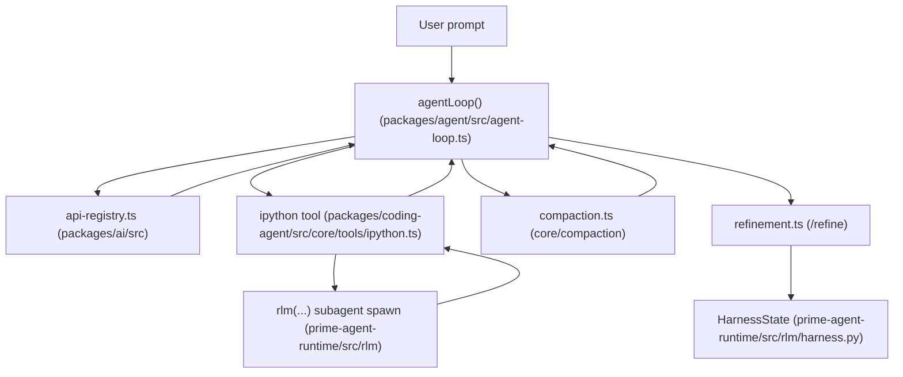
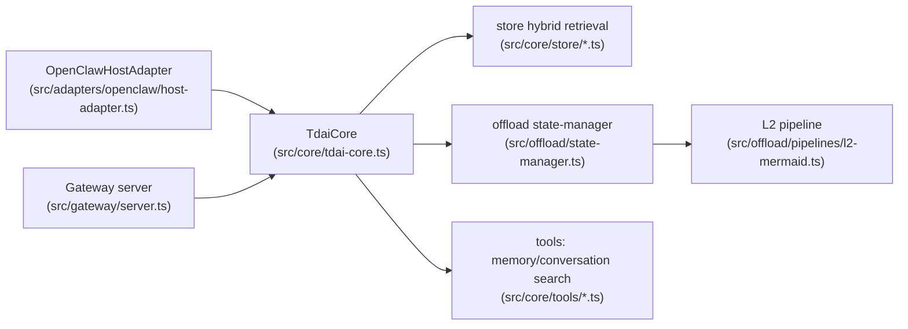
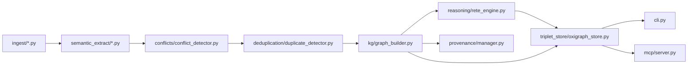
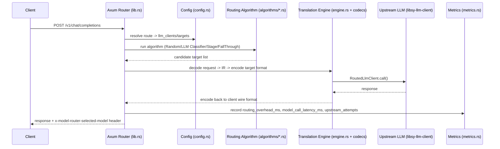

# Weekly Agentic AI Architecture Scan — 2026-08-16

**Executive summary:**
- Xu hướng "context-as-code" nổi lên rõ: `prime-agent` biến toàn bộ tool-calling thành lệnh gọi hàm trong một REPL Python bền vững thay vì JSON tool rời rạc; `TencentDB-Agent-Memory` offload log dài thành sơ đồ Mermaid có `node_id` để drill-down ngược thay vì nén một chiều.
- Kiến trúc neuro-symbolic quay lại mạnh: `semantica` kết hợp LLM extraction với reasoning engine symbolic thuần (Rete/Datalog/SPARQL) và gắn provenance (PROV-O) vào gần như mọi module, còn `Switchyard` dùng LLM làm classifier để route request giữa các model khác.
- Một phát hiện due-diligence đáng chú ý: mô tả "About" trên GitHub của `TencentDB-Agent-Memory` (MemoryCore/MemoryHub/MemoryProxy, 4 asset type, ACL team/private) **không khớp** với code thực tế trên nhánh `main` — nhắc nhở phải verify bằng code, không chỉ đọc marketing copy hay repo description.

**Mục lục:**
1. [PrimeIntellect-ai/prime-agent](#primeintellect-aiprime-agent)
2. [TencentCloud/TencentDB-Agent-Memory](#tencentcloudtencentdb-agent-memory)
3. [semantica-agi/semantica](#semantica-agisemantica)
4. [NVIDIA-NeMo/Switchyard](#nvidia-nemoswitchyard)

---

## PrimeIntellect-ai/prime-agent

**Link:** https://github.com/PrimeIntellect-ai/prime-agent

### §1 — Quick Context

Coding/research agent tự cải thiện dựa trên Recursive Language Model (RLM): context là biến Python, subagent là hàm gọi trong REPL bền vững. Tech stack: TypeScript host (Node ≥22.8, monorepo `packages/*`) điều phối provider/session, cầu nối tới Python/IPython kernel (`prime-agent-runtime`); xây trên framework `@earendil-works/pi-coding-agent`; hỗ trợ đa model qua registry (Anthropic, OpenAI, Google, Mistral, Amazon Bedrock, Azure, Cloudflare, và mọi API tương thích OpenAI như Ollama/vLLM). Repo health: 16.4k sao, 1.8k forks, MIT, ~4.510 commits, 65 PR/8 issue đang mở, có CI (`ci.yml`, `build-binaries.yml`, `contribution-gate.yml`, `nightly-process-stress.yml`) và test suite (`vitest.config.ts`); số contributor cụ thể không xác định từ code.

### §2 — Architecture Deep-Dive

**A. Component inventory**
- `agentLoop` (`packages/agent/src/agent-loop.ts`) — vòng lặp điều phối chính: stream LLM, phát hiện tool call, chạy tool, emit event.
- `ipython` tool (`packages/coding-agent/src/core/tools/ipython.ts`) — tool duy nhất model được gọi mặc định; cầu nối tới IPython kernel qua `KernelManager`/`IpythonKernelProvisioner` (ZMQ).
- RLM runtime Python (`prime-agent-runtime/src/rlm/__init__.py`, `mcp_base.py`, `skill.py`) — expose callable `rlm(...)` để spawn subagent con, `rlm.host_request(...)` gọi ngược host TypeScript.
- `HarnessState`/`HarnessEntry` (`prime-agent-runtime/src/rlm/harness.py`) — kho CRUD lưu prompt/memory/skill/subagent (Continual Harness).
- `refinement.ts` (`packages/coding-agent/src/core/refinement/refinement.ts`) — logic lệnh `/refine`, ghi `RefinementEvent` vào harness.
- `compaction.ts`, `branch-summarization.ts` (`packages/coding-agent/src/core/compaction/`) — nén/tóm tắt context.
- `agent-session.ts`, `session-manager.ts` (`packages/coding-agent/src/core/`) — quản lý vòng đời phiên/state.
- `model-registry.ts` (`packages/coding-agent/src/core/model-registry.ts`) + `api-registry.ts` và các file provider (`packages/ai/src/providers/anthropic.ts`, `openai-responses.ts`, `google.ts`, `mistral.ts`, `amazon-bedrock.ts`, …) — orchestration model đa nhà cung cấp.
- `packages/coding-agent/src/core/mcp/` + `packages/ai/src/mcp.ts` + `mcp_base.py` — tích hợp MCP.
- `skills.ts`, `skill-blocks.ts` — nạp skill dạng `SKILL.md` thành callable Python.

**B. Control flow pattern**: ReAct-loop (một meta-tool `ipython`) lồng hierarchical supervisor-workers ở tầng subagent. Happy path: (1) `agentLoop()` stream request tới model qua `api-registry.ts`; (2) model trả về duy nhất tool call `ipython` chứa code Python; (3) `IpythonKernelProvisioner` gửi code vào kernel bền vững qua ZMQ, thực thi tuần tự; (4) nếu code gọi `rlm(...)`, bootstrap import `prime-agent-runtime/src/rlm` spawn subagent con chạy song song, không block cha; (5) kết quả cell trả về `agent-loop.ts` dưới dạng event `tool_execution_end`, nối vào lịch sử; (6) khi context gần đầy, `compaction.ts` tóm tắt lượt cũ trước khi lặp tiếp; khi trajectory kết thúc hoặc gọi `/refine`, `refinement.ts` ghi bài học vào `HarnessState`.

**C. State & data flow**: Message trao đổi qua event stream nội bộ (`message_start`/`message_end`/`tool_execution_start`/`end`, định nghĩa gần `packages/agent/src/types.ts`). State runtime nằm trong biến Python của kernel (persist across turns, không đi qua context mỗi lượt), có thể snapshot namespace ra đĩa và phục hồi khi restart (mất object không serialize được thì bị drop). Context window quản lý bằng compaction/branch-summarization thay vì chỉ cắt bớt.

**D. Tool/capability integration**: Model chỉ có một tool native (`ipython`) qua function-calling chuẩn của provider; mọi khả năng khác (bash, edit file, subagent, skill, MCP) được phơi ra như hàm/biến Python bên trong kernel, không phải JSON tool riêng lẻ. Sandbox: không có — tài liệu RLM nói rõ kernel "executes model-generated Python with full OS permissions... not a security sandbox", khuyến nghị sandbox ngoài cho repo/skill không tin cậy.

**E. Memory architecture**: Ngắn hạn = biến kernel + lịch sử session (`agent-session.ts`), nén qua compaction. Dài hạn = Continual Harness (`harness.py`) lưu JSON tại `~/.prime/agent/harness/` (hoặc theo `RLM_HARNESS_STATE_DIR`), CRUD qua `create/get/list/upsert/delete`, có scope local/global và `overview()` tạo tóm tắt người đọc được. Cơ chế retrieval là liệt kê/lookup theo id, không tìm thấy bằng chứng vector search/embedding — không xác định từ code.

**F. Model orchestration**: Registry đa provider (`packages/ai/src/api-registry.ts` + `providers/*`); mỗi subagent có field `model` riêng nên có thể gán model khác cho từng child. Nhiều subagent chạy song song không blocking (evidence trực tiếp từ docs). Fallback tự động giữa provider không xác định từ code.

**G. Observability & eval**: Có `packages/ai/src/log.ts` và CI stress workflow (`nightly-process-stress.yml`); tracing kiểu OpenTelemetry/Langfuse không xác định từ code.

**H. Extension points**: Thư mục `packages/coding-agent/src/core/extensions/`, workspace ví dụ provider tùy biến (Anthropic, GitLab Duo) trong `package.json`, skill dạng thư mục `SKILL.md`, và MCP client để gắn tool server ngoài.

### §3 — Architecture Diagram

### §4 — Verdict

Điểm đáng nghiên cứu nhất: thay vì tool-calling JSON rời rạc, agent chỉ có một tool `ipython` — toàn bộ orchestration (bash, edit, subagent, skill, MCP) trở thành lệnh gọi hàm Python trong một kernel bền vững, biến "context" thành biến chương trình thay vì text nhồi vào prompt; đồng thời Continual Harness cho phép agent tự CRUD lên chính state/skill/prompt của mình qua `/refine`, tạo vòng self-improvement thực sự ghi log evidence. Red flag lớn: kernel chạy code do model sinh ra với đầy đủ quyền OS, tự nhận "not a security sandbox" — rủi ro cao khi chạy trên repo/skill không tin cậy. Câu hỏi cần đào sâu: cơ chế retrieval của harness có dùng semantic search không hay chỉ liệt kê tuyến tính; có fallback/circuit-breaker giữa các model provider khi lỗi không; `nightly-process-stress.yml` kiểm thử gì cụ thể (chưa xem nội dung).

---

## TencentCloud/TencentDB-Agent-Memory

**Link:** https://github.com/TencentCloud/TencentDB-Agent-Memory

### §1 — Quick Context

Plugin bộ nhớ 4 tầng (L0-L3) cho OpenClaw/Hermes, nén tool-log thành sơ đồ Mermaid để tiết kiệm token. Stack: TypeScript/Node.js ≥22.16, package `@tencentdb-agent-memory/memory-tencentdb` v0.3.6, dùng `ai`/`@ai-sdk/openai`, `sqlite-vec`, `@node-rs/jieba`, `zod`; backend SQLite (local) hoặc Tencent Cloud VectorDB (remote). Repo ~22k sao, ~2k fork, 129 issue mở, 463 PR mở, có CI qua `.github/workflows/pr-ci.yml`, có test (`vitest`, file `*.test.ts`).

### §2 — Architecture Deep-Dive

**A. Component inventory**
- `TdaiCore` (`src/core/tdai-core.ts`) — "host-neutral facade", orchestrator trung tâm điều phối recall/capture/search và pipeline L1-L3.
- `Gateway server` (`src/gateway/server.ts`) — HTTP server dựng bằng module `http` gốc của Node (không dùng Express/Fastify), expose các route `/health`, `/recall`, `/capture`, `/search/memories`, `/search/conversations`, `/session/end`, `/seed`; chạy như sidecar cho Hermes.
- `OpenClawHostAdapter` (`src/adapters/openclaw/host-adapter.ts`, cùng thư mục có `llm-runner.ts`, `index.ts`) — dịch sự kiện của OpenClaw thành lệnh gọi vào `TdaiCore`.
- Hooks (`src/core/hooks/auto-capture.ts`, `src/core/hooks/auto-recall.ts`) — móc vào vòng đời agent (`before_prompt_build`, `agent_end`) để tự động recall/capture.
- Tools (`src/core/tools/memory-search.ts`, `src/core/tools/conversation-search.ts`) — cài đặt hai tool agent-facing `tdai_memory_search` và `tdai_conversation_search`.
- Store/retrieval (`src/core/store/sqlite.ts`, `tcvdb.ts`, `tcvdb-client.ts`, `bm25-client.ts`, `bm25-local.ts`, `embedding.ts`, `factory.ts`) — lớp truy xuất lai keyword+vector.
- Offload/symbolic memory (`src/offload/state-manager.ts`, `mmd-injector.ts`, `reclaimer.ts`, `session-registry.ts`, `context-token-tracker.ts`) — quản lý việc offload log dài ra file và bơm canvas Mermaid gọn vào context.
- Pipeline L2 (`src/offload/pipelines/l2-mermaid.ts`) — sinh sơ đồ Mermaid từ trạng thái phiên.
- Entry point plugin (`index.ts` ở root) — hàm mặc định đăng ký plugin cho OpenClaw, wiring toàn bộ các thành phần trên.
- `hermes-plugin/memory/memory_tencentdb` — điểm tích hợp cho Hermes.

Không tìm thấy trong code các thành phần "MemoryCore/MemoryHub/MemoryProxy" như mô tả "About" của repo trên GitHub — không xác định từ code (xem §4).

**B. Control flow pattern** — chưa có tên chính thức trong code, có thể mô tả là "hook-driven facade over host-neutral core". Đường đi ghi nhớ (happy path):
1. Agent host (OpenClaw hoặc Hermes qua Gateway) gọi hook `before_prompt_build`.
2. `OpenClawHostAdapter`/Gateway route `/recall` gọi `TdaiCore.handleBeforeRecall()`.
3. `TdaiCore` truy vấn `store/` (BM25 + embedding) để lấy ký ức liên quan, format và bơm vào prompt.
4. Sau lượt hội thoại, hook `agent_end`/route `/capture` gọi `TdaiCore.handleTurnCommitted()`.
5. Dữ liệu thô được ghi ở L0, sau đó `wirePipelineRunners()` lên lịch chạy các runner L1 (trích xuất atom) → L2 (`l2-mermaid.ts`, tổng hợp scene) → L3 (tổng hợp persona), ghi vào `store/`.
6. Với log tool dài, `offload/state-manager.ts` tách nội dung ra `refs/*.md`, chỉ giữ canvas Mermaid nhẹ (vài trăm token) trong context, phục hồi đầy đủ qua `node_id`.

**C. State & data flow**: State lưu ở hai loại: SQLite (mặc định, mở rộng `sqlite-vec`) cho các tầng thấp (fact/log/trace) và file Markdown cho các tầng cao (persona, scene) — "heterogeneous dual-layer" theo README. Định dạng trung gian: JSONL cho step-summary, Mermaid cho task canvas. Quản lý context window qua `context-token-tracker.ts` và `fast-token-estimate.ts`/`benchmark-token-estimate.ts` (ước lượng token bằng `js-tiktoken`). Không có schema message cố định kiểu OpenAI messages trong các file đã đọc.

**D. Tool/capability integration**: Tool đăng ký qua entry point `index.ts` khi OpenClaw load plugin (gọi hàm default nhận `OpenClawPluginApi`), expose 2 tool schema (`tdai_memory_search`, `tdai_conversation_search`) định nghĩa ở `src/core/tools/`. Với Hermes, tích hợp qua Gateway HTTP (`src/gateway/server.ts`) với auth Bearer token tùy chọn (`server.apiKey`, so sánh constant-time) và CORS allow-list — đây là plugin hook + HTTP sidecar chứ không phải "transparently intercept API calls"; không xác định từ code có sandbox thực thi tool hay không.

**E. Memory architecture (trọng tâm)** — Mô hình 4 tầng rõ ràng trong code (`TdaiCore`, folder `src/core/{conversation,persona,profile,scene,record,seed}`):
- L0 Conversation: log hội thoại thô, embedding trì hoãn (deferred embedding).
- L1 Atom: trích xuất fact nguyên tử, suy luận xác định (deterministic).
- L2 Scenario: gom thành scene block/pattern giải pháp, cài đặt tại `src/offload/pipelines/l2-mermaid.ts`.
- L3 Persona: hồ sơ người dùng, sở thích dài hạn (`l3-helpers.ts`, `l3-token-counter.ts`, `l3-token-helpers.ts` trong `src/offload/`).
Truy xuất là hybrid: BM25 (`bm25-client.ts`, `bm25-local.ts`) + embedding vector (`embedding.ts`, backend `sqlite.ts` dùng `sqlite-vec` hoặc `tcvdb.ts`/`tcvdb-client.ts` cho Tencent Cloud VectorDB), kết hợp theo README bằng RRF fusion (không xác định file RRF cụ thể). Nén/compaction: offload (`reclaimer.ts`, `mmd-injector.ts`) chuyển log dài thành sơ đồ Mermaid + tham chiếu `node_id`/`result_ref` để drill-down, không nén một chiều không phục hồi được.

**F. Model orchestration**: Dùng `@ai-sdk/openai` và package `ai` (Vercel AI SDK) cho LLM extraction; có `local-llm/` trong `src/offload/` cho chế độ chạy LLM cục bộ độc lập (`src/adapters/standalone/`, `llm-runner.ts` trong adapter OpenClaw). Không xác định từ code cơ chế fallback/parallel/batch cụ thể giữa các model.

**G. Observability & eval**: Có `src/offload/opik-tracer.ts` (tích hợp tracing Opik), `state-reporter.ts`, benchmark script `benchmark-token-estimate.ts`. README công bố eval trên WideSearch và PersonaMem benchmark nhưng không thấy file harness cụ thể trong thư mục đã duyệt — không xác định từ code vị trí eval script.

**H. Extension points**: Mở rộng qua `src/adapters/` (đã có `openclaw/` và `standalone/`, kiến trúc adapter cho phép thêm host mới), cấu hình 3 cấp trong `openclaw.plugin.json`. Không tìm thấy interface adapter chính thức (base class) trong các file đã đọc — không xác định từ code.

### §3 — Architecture Diagram

### §4 — Verdict

Điểm đáng chú ý nhất: thay vì nén hội thoại một chiều thành vector, repo tách "symbolic short-term memory" (offload log dài thành Mermaid canvas + `node_id`/`result_ref` để drill-down ngược bằng grep) khỏi "layered long-term memory" (L0-L3), cho phép white-box debugging — mọi tầng trừ tầng thấp nhất đều là file Markdown đọc được. **Red flag quan trọng**: mô tả "About" trên GitHub của repo (MemoryCore/MemoryHub/MemoryProxy, 4 asset type Chat Memory/Skills/Wiki/CodeGraph, ACL private/team/restricted) **không khớp với README.md và mã nguồn thực tế trên nhánh `main`** — kiểm tra verbatim toàn văn README không thấy các cụm từ "Chat Memory", "Wiki", "CodeGraph", "ACL", "private/team/restricted". Các tính năng team-hub/ACL có thể chỉ tồn tại trên nhánh chưa merge `feat/server_team`, cho thấy sản phẩm được PR/marketing đi trước code thực tế trên main — một lời nhắc rằng repo description và README có thể lệch pha với code. Câu hỏi cần đào sâu: (1) nhánh `feat/server_team` có thực sự chứa MemoryHub/ACL hay chỉ là draft; (2) 463 PR mở so với ~22k sao là tỷ lệ bất thường, cần kiểm tra có phải spam/bot PR; (3) cơ chế RRF fusion và eval harness cho WideSearch/PersonaMem chưa thấy file cụ thể — cần xác minh benchmark có tái lập được không.

---

## semantica-agi/semantica

**Link:** https://github.com/semantica-agi/semantica

### §1 — Quick Context

Semantica là hạ tầng graph-native để dựng knowledge graph "có thể kiểm chứng" (accountable) cho hệ thống AI — không phải agent-loop framework. Core: Python ≥3.8, `rdflib`, `networkx`, `torch`/`transformers`/`spacy`/`sentence-transformers` cho extraction, LiteLLM để gọi đa LLM provider (OpenAI, Anthropic, Groq, Ollama...), explorer dùng React 19 + Sigma.js. Repo: ~8.000 sao, 817 fork, MIT, org tạo 6/2025, push gần nhất 15/8/2026, CI đầy đủ (`ci.yml`, `codeql.yml`, `benchmark.yml`, `security-scan.yml`), có `tests/`.

### §2 — Architecture Deep-Dive

**A. Component inventory** (path xác nhận qua GitHub tree):
- `Ingest layer` (`semantica/ingest/*.py` — 30 file, vd. `file_ingestor.py`, `web_ingestor.py`, `mcp_ingestor.py`) — nạp dữ liệu đa nguồn.
- `Semantic extraction` (`semantica/semantic_extract/ner_extractor.py`, `relation_extractor.py`, `triplet_extractor.py`, `event_detector.py`, `llm_extraction.py`) — NER/relation/triplet/event, có nhánh LLM riêng.
- `Conflict detector` (`semantica/conflicts/conflict_detector.py`, `conflict_resolver.py`).
- `Deduplication` (`semantica/deduplication/duplicate_detector.py`, `entity_merger.py`, `cluster_builder.py`).
- `KG builder` (`semantica/kg/graph_builder.py`, `knowledge_graph.py`, `entity_resolver.py`).
- `Reasoning engines` (`semantica/reasoning/rete_engine.py`→`ReteEngine`, `datalog_reasoner.py`→`DatalogReasoner`, `sparql_reasoner.py`, `deductive_reasoner.py`, `abductive_reasoner.py`, `explanation_generator.py`).
- `Provenance tracker` (`semantica/provenance/manager.py`→`ProvenanceManager`, `integrity.py`, `storage.py`) — W3C PROV-O.
- `Decision intelligence` (`semantica/context/decision_recorder.py`, `decision_query.py`, `context_graph.py`→`ContextGraph`, `causal_analyzer.py`, `policy_engine.py`).
- `Triplet store (RDF)` (`semantica/triplet_store/oxigraph_store.py`, `blazegraph_store.py`, `jena_store.py`, `rdf4j_store.py`).
- `Pipeline orchestration` (`semantica/pipeline/execution_engine.py`, `parallelism_manager.py`, `resource_scheduler.py`, `failure_handler.py`; điều phối tổng ở `semantica/core/orchestrator.py`).
- `MCP server` (`mcp/server.py`→`SemanticaMCPServer`, `mcp/session.py`, `mcp/schemas.py`; song song còn `semantica/mcp_server/__main__.py` — trùng lặp, xem §4).
- `CLI` (`semantica/cli.py`).

**B. Control flow**: pipeline/DAG tường minh (không event-driven, không agent-loop). Happy path:
1. `ingest/*` nạp → normalize/parse/split (thư mục con chi tiết không xác định từ code).
2. `semantic_extract/*` trích entity/relation/triplet (ML hoặc LLM).
3. `conflicts/conflict_detector.py` gắn cờ mâu thuẫn; `deduplication/*` gộp entity trùng.
4. `kg/graph_builder.py` dựng `KnowledgeGraph`, mỗi fact được `provenance/manager.py` gắn lineage; `reasoning/*` suy luận thêm fact.
5. Ghi vào `triplet_store/*` (RDF) và/hoặc `graph_store/` (LPG, chưa rõ file con) + `vector_store/` cho hybrid search.
6. Truy vấn/export qua `cli.py`, `mcp/server.py`, hoặc `semantica/export/`.

**C. State & data flow**: schema chuẩn hoá tại `semantic_extract/schemas.py`; đa backend "swappable" theo README (RDF: Oxigraph/Blazegraph/Jena/RDF4J; LPG: Neo4j/FalkorDB/Neptune — file cụ thể trong `graph_store/` không xác định). Context-window management kiểu agent-loop: không xác định từ code (hợp lý — đây là knowledge infra, không phải agent runtime).

**D. Tool integration**: MCP server thật (`mcp/server.py`), tool schema validate ở `mcp/schemas.py`, session singleton `ContextGraph` ở `mcp/session.py`; tool nêu trong README: `extract_entities`, `record_decision`, `run_reasoning`. Có REST riêng (`semantica/server.py`, entry `semantica-server`) nhưng framework cụ thể không xác định từ code. Sandboxing cho tool execution: không xác định từ code.

**E. Memory**: đáng chú ý — đây là knowledge graph làm "memory", không phải buffer/vector-only kiểu agent hội thoại. Có file riêng `context/agent_context.py`, `agent_memory.py`, `context_retriever.py` biến `ContextGraph` thành lớp memory cho agent.

**F. Model orchestration**: extraction dùng LLM đa provider qua `semantic_extract/providers.py` + `llm_extraction.py` (LiteLLM). Reasoning engine (Rete/Datalog/SPARQL) là symbolic thuần, không gọi model — kiến trúc lai neuro-symbolic rõ nét. Fallback/parallel giữa provider: không xác định từ code.

**G. Observability**: điểm bán hàng cốt lõi — gần như mọi module có file `*_provenance.py` riêng (`ingest_`, `semantic_extract_`, `conflicts_`, `kg_`, `pipeline_`, `context_`, `triplet_store_`, `reasoning_provenance.py`...), đổ về `ProvenanceManager` theo PROV-O, export JSON/CSV/RDF. `reasoning/explanation_generator.py` sinh giải thích suy luận. Eval/replay harness riêng cho chất lượng output AI: không xác định từ code.

**H. Extension points**: pattern registry lặp lại nhất quán — `core/plugin_registry.py` cấp cao, mỗi subsystem tự có `registry.py` (`ingest/registry.py`, `conflicts/registry.py`, `kg/registry.py`, `triplet_store/registry.py`...) để đăng ký custom ingestor/reasoner/store.

### §3 — Architecture Diagram

### §4 — Verdict

Điểm đáng nghiên cứu: pattern `*_provenance.py` phủ khắp mọi module (không chỉ 1 lớp audit tập trung) kết hợp decision graph có quan hệ nhân quả tường minh (`CAUSED`/`INFLUENCED`/`PRECEDENT_FOR` trong `context/decision_recorder.py`) — hiếm thấy ở repo "agent". Kiến trúc lai neuro-symbolic (LLM extraction + Rete/Datalog reasoning thuần symbolic) cũng đáng đào sâu. Red flag: tồn tại song song `mcp/server.py` và `semantica/mcp_server/__main__.py` — README ghi `python -m semantica.mcp_server` còn tree lại có `mcp/` riêng, khả năng trùng lặp/legacy chưa dọn; version còn 0.6.5 dù ~2300 commit và org mới lập 6/2025, bề mặt API rất rộng (30 ingestor, 4 RDF store, nhiều vector store) so với độ chín thực tế. Câu hỏi mở: mức độ test coverage thực của reasoning engine và cơ chế xử lý conflict (auto vs human-in-loop) trong `conflict_resolver.py`.

---

## NVIDIA-NeMo/Switchyard

**Link:** https://github.com/NVIDIA-NeMo/Switchyard

### §1 — Quick Context

Switchyard là Rust proxy/library route và dịch giao thức LLM đa nhà cung cấp, kèm metrics vận hành. Core stack: Rust (edition 2024) với Tokio, Axum, reqwest+rustls, OpenTelemetry/tracing, serde; Python bindings qua PyO3/maturin (`nemo-switchyard`, CLI dùng `uv`), config dạng TOML. Repo health: ~1.6k sao, 144 forks, 45 issues mở, 55 PR, license Apache 2.0; CI qua GitHub Actions với nhiều workflow thật (`ci.yml`, `perf.yml`, `readme.yml` chạy pytest trên chính ví dụ trong README); status chính thức "pre-alpha, evolving rapidly, không dùng production". Số contributor cụ thể không xác định từ code.

### §2 — Architecture Deep-Dive

**A. Component inventory**
- `Axum HTTP router` (`crates/switchyard-server/src/lib.rs`) — expose `POST /v1/chat/completions`, `/v1/messages`, `/v1/responses`, `/v1/messages/count_tokens`, `GET /v1/models`, `/metrics`, `/health`, `/v1/stats`.
- `Config loader TOML` (`crates/switchyard-server/src/config.rs`) — parse `llm_clients`, `targets`, `routes` (schema_version=1).
- `Entry point / CLI` (`crates/switchyard-server/src/main.rs`, `cli.rs`) — khởi tạo observability, đọc CLI args, gọi `run_server()`.
- `Routing algorithms` (`crates/libsy/src/algorithms/{rand,llm_class,stage,fall_through,noop,passthrough}.rs`) — các thuật toán route.
- `Translation engine` (`crates/switchyard-translation/src/engine.rs` + `codecs/{openai_chat,anthropic,responses}`) — decode/encode qua IR trung gian.
- `Upstream call abstraction` (`crates/protocol/src/client.rs` — trait `RoutedLlmClient`) và implementation thật (`crates/libsy-llm-client/src/client.rs`, `backend.rs`, `run.rs`).
- `Metrics/Prometheus exporter` (`crates/switchyard-server/src/metrics.rs`) qua OpenTelemetry.
- `Routing decision log` (`crates/switchyard-server/src/routing_log.rs`), `stats.rs`/`usage_metrics.rs` cho `/v1/stats`.
- `Python launcher/CLI` (`switchyard/cli/`, script `switchyard` trong `pyproject.toml`) và bindings (`crates/switchyard-py`, `switchyard_rust/_native.py`, `server.py`, `libsy.py`).

**B. Control flow** — pattern proxy/gateway kiểu API-translation gateway:
1. Client gửi POST tới `/v1/chat/completions` (hoặc `/v1/messages`, `/v1/responses`); middleware `stamp_request_start()` (`lib.rs`) đánh dấu thời điểm bắt đầu.
2. Body JSON được parse/validate, tên route ánh xạ tới cấu hình route trong TOML (`config.rs`).
3. Nếu cần, `TranslationEngine` (`engine.rs`) decode request từ format nguồn sang IR trung gian rồi encode sang format target qua `FormatCodec`.
4. Algorithm tương ứng trong `crates/libsy/src/algorithms/` chọn target model (xem mục F).
5. Request được gửi upstream qua `RoutedLlmClient` (implementation trong `libsy-llm-client`), kết quả trả về, metrics ghi nhận (`metrics.rs`).
6. Response dịch ngược sang wire-format client yêu cầu, gắn header `x-model-router-selected-model`, trả về client.

**C. State & data flow**: Config TOML (`llm_clients`/`targets`/`routes`) là nguồn cấu hình tĩnh; state runtime giữ trong `ServerState` (in-memory, gồm route registry, metrics, stats). Không thấy database/persistent store trong code đã duyệt. Cơ chế session-affinity của `llm_class.rs` dùng "session metadata"/hash tin nhắn đầu — cách lưu trữ cụ thể (in-memory only hay có TTL) không xác định từ code.

**D. Tool/capability integration**: không có framework thực thi tool riêng; `StageRouter` chỉ đọc kết quả tool-call trước đó (qua `ToolSignalProcessor`) làm tín hiệu routing, không tự gọi tool.

**E. Memory architecture**: không áp dụng; không tìm thấy module memory/vector-store trong repo.

**F. Model orchestration (core):**
- `Random` (`algorithms/rand.rs`): `RandomClassifier` dùng `WeightedIndex` + RNG bọc Mutex, chọn target theo trọng số tương đối (mặc định 1.0/target).
- `LLM Classifier` (`algorithms/llm_class.rs`): `LlmTaskClassifier` có 3 mode — Capability (ngưỡng `base_threshold`/`threshold_step` dựa xác suất judge), Escalation (gọi model hiệu quả trước, judge chất lượng, escalate sau chuỗi verdict cấu hình được), Custom (JSON schema + JSON Pointer). Prompt mặc định nạp từ `prompts/capability-classifier/prompt.md`.
- `Stage Router` (`algorithms/stage.rs`): cascade 3 tầng — tín hiệu tool-call (`ToolSignalProcessor`, cửa sổ `recent_window`) → judge dự phòng (`llm_fallback`, tái dùng `LlmTaskClassifier`) khi tín hiệu dưới `confidence_threshold` → tier mặc định. `SourceStamp` ghi nhận thành phần nào ra quyết định.
- `FallThrough` (`algorithms/fall_through.rs`): pipeline cascade classifier chung, trả về danh sách candidate có thứ tự (target chọn + phần còn lại); fallback/retry khi model call fail do consumer (server) tự xử lý, không tự động trong router — khớp với counter `router_retry_recovered` ở tầng server.
- `noop.rs`/`passthrough.rs`: baseline route tĩnh/một target cố định, dùng làm mẫu để viết algorithm mới.
- Parallelism/batching: không xác định từ code — không thấy bằng chứng gọi song song nhiều model; Escalation mode thêm 1 lượt gọi tuần tự (judge) trước khi escalate, không phải song song.

**G. Observability & eval**: `metrics.rs` export Prometheus qua OpenTelemetry tại `GET /metrics`: histogram `switchyard.routing_overhead_ms`, `switchyard.model_call_latency_ms`, `switchyard.total_latency_ms`; counter `switchyard.upstream_attempts`, `switchyard.client_responses`, `switchyard.router_retry_recovered`; gauge `switchyard.build_info`. `observability.rs` + `main.rs` khởi tạo/flush tracing (OTLP tùy chọn qua env var). `routing_log.rs` ghi log quyết định routing; `/v1/stats` (`stats.rs`, `usage_metrics.rs`) trả thống kê in-memory. Thư mục `benchmark/` (Harbor Terminal-Bench Lite: `prepare_harbor_dataset.py`, `run_manifest.py`, `agent-versions.env`) là bộ eval/benchmark so sánh routing qua Switchyard với gọi upstream trực tiếp — không phải "eval hook" runtime.

**H. Extension points**: thêm backend/route mới chỉ cần khai báo trong TOML (`llm_clients`/`targets`/`routes`, `config.rs`) không cần code Rust; thêm routing algorithm bằng implement trait `Classifier`/`Algorithm` (`crates/libsy/src/algorithms.rs`, `core.rs`), theo mẫu `noop.rs`/`rand.rs`; thêm wire-format bằng implement `FormatCodec` (`switchyard-translation/src/codecs/`); cắm transport gọi model tùy ý qua trait `RoutedLlmClient` (`crates/protocol/src/client.rs`); nhúng làm library trong ứng dụng Rust khác qua crate `libsy`, hoặc dùng qua Python bindings (`crates/switchyard-py`).

### §3 — Architecture Diagram

### §4 — Verdict

Điểm đáng nghiên cứu nhất không phải "dùng LLM để route" (đã phổ biến) mà là thiết kế `FallThrough` như một classifier-cascade generic tách biệt quyết định (router) khỏi retry/fallback (consumer), cộng với `Decision`/`RoutingFallbackReason` trong `protocol/client.rs` khiến verdict của classifier "trả lời luôn" câu hỏi nếu nó đã phải gọi model để phán đoán — tránh trả tiền hai lần cho cùng một lượt gọi. Red flag: tự nhận pre-alpha, đổi API nhanh, cơ chế lưu session-affinity không rõ ràng (in-memory hay có TTL), và retry-on-fail phân tán giữa router/consumer dễ gây bất nhất khi audit. Câu hỏi cần đào sâu thêm: `StageRouter`/`ToolSignalProcessor` phát hiện tool-call "thất bại" bằng heuristic gì; escalation streak threshold mặc định là bao nhiêu; và benchmark Harbor Terminal-Bench có công bố số liệu so sánh routing vs. gọi trực tiếp hay chưa.

---

*Báo cáo này được tạo tự động bởi weekly agentic AI research scout. Dữ liệu tổng hợp từ GitHub trending, GitHub search và đọc trực tiếp mã nguồn/README của từng repo tại thời điểm 2026-08-16; số liệu (sao, PR, issue) có thể thay đổi theo thời gian.*
