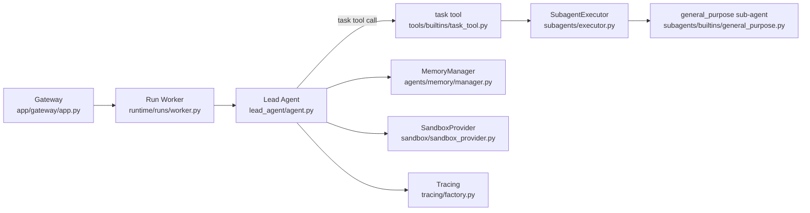
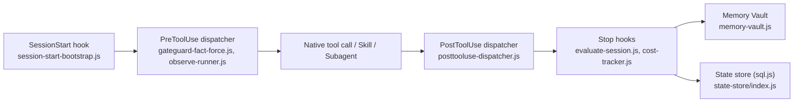
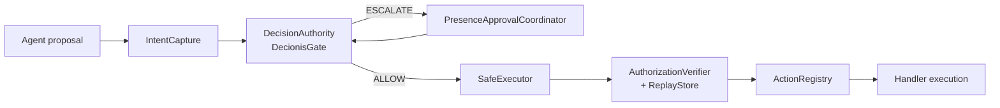
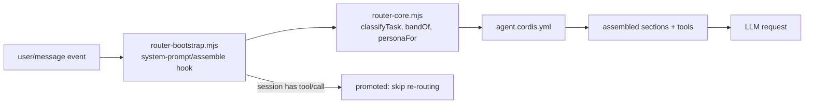

# Weekly Agentic AI Scan — 2026-08-17

**Nguồn dữ liệu:** GitHub Search API (`created:>2026-08-10 stars:>150`, mở rộng `pushed:>2026-08-10 stars:>500` do vòng lọc đầu chỉ ra ≤10 repo đạt chất lượng). Bốn repo dưới đây được chọn sau khi loại awesome-list, tutorial dump, và wrapper mỏng; mỗi repo được `git clone` về máy và đọc trực tiếp source code (không chỉ README) để lấy evidence.

## Executive summary

- **Kiến trúc "lead-agent gọi sub-agent qua tool" đang thắng thế so với LangGraph node-graph cổ điển** — cả `bytedance/deer-flow` (rewrite 2.0 hoàn toàn) lẫn `affaan-m/ECC` chọn mô hình 1 agent trung tâm + hook/tool-delegation thay vì static supervisor graph, cho thấy xu hướng học theo Claude Code/Codex hơn là LangChain truyền thống.
- **Tách "propose" khỏi "authorize" là pattern guardrail đáng chú ý nhất tuần này** — `decionis/agent-safe-pipeline` mã nguồn hoá kỹ một reference architecture cho production guardrail (fail-closed, single-use grant, mutation-tested), dù phần "não" quyết định vẫn là dịch vụ đóng bên ngoài.
- **Một case study cảnh báo về research integrity**: `yjh051108/dsh-router-standard` có cơ chế routing thật và được unit-test, nhưng chính tác giả tự rút lại lý thuyết giải thích, số liệu benchmark chủ đạo đến từ nguồn ngoài không kiểm toán (n=2-5/ô), và `npm test` mặc định lỗi.

## Mục lục

1. [bytedance/deer-flow](#1-bytedancedeer-flow)
2. [affaan-m/ECC](#2-affaan-mecc)
3. [decionis/agent-safe-pipeline](#3-decionisagent-safe-pipeline)
4. [yjh051108/dsh-router-standard](#4-yjh051108dsh-router-standard)

---

## 1. bytedance/deer-flow

**Repo:** https://github.com/bytedance/deer-flow

### §1 — Quick context

SuperAgent harness của ByteDance: 1 lead agent trung tâm gọi sub-agent qua tool `task`, sandbox riêng mỗi phiên, memory đa backend.

**Tech stack:** Backend Python ≥3.12 (`uv`), FastAPI Gateway, LangChain `create_agent`; Frontend Next.js 16 + React 19; sandbox providers (local/E2B/aio_sandbox/boxlite); memory backend chọn được (DeerMem/mem0/OpenViking/Honcho).

**Repo health:** ~80k sao, push mới nhất hôm nay; 14 workflow CI (unit/e2e/lint/skill-review/nightly/container build), 546+ file test Python dưới `backend/tests/`, `CONTRIBUTING.md` chi tiết kèm hướng dẫn `make test-e2e`.

### §2 — Architecture deep-dive

**Lưu ý quan trọng trước khi đọc:** đây là DeerFlow **2.0**, README tự nhận là "rewrite từ đầu, không chia sẻ code với v1". Kiến trúc planner→researcher→coder theo LangGraph cổ điển của bản 1.x **không còn tồn tại** trong codebase này — mọi tài liệu/bài viết cũ về DeerFlow 1.x không còn phản ánh đúng mã nguồn hiện tại.

**A. Component inventory**
- `Lead agent` (`backend/packages/harness/deerflow/agents/lead_agent/agent.py`) — dựng bằng `langchain.agents.create_agent`, bọc ~30 middleware.
- `SubagentExecutor` + `registry` (`subagents/executor.py`, `subagents/registry.py`) — spawn sub-agent trên thread pool, có sẵn `general_purpose`, `bash_agent`.
- `task tool` (`tools/builtins/task_tool.py`) — tool mà lead agent gọi để giao việc cho sub-agent.
- `SandboxProvider` (`sandbox/sandbox_provider.py`) — abstract, có provider local/E2B/aio_sandbox/boxlite.
- `MemoryManager` (`agents/memory/manager.py`) — ABC, chọn backend qua config.
- `Gateway` (`app/gateway/app.py` + routers threads/runs/mcp/memory/skills).
- `Skill loader` (`skills/catalog.py`, `installer.py`, `skills/public/*`).
- `Extension system` (`extensions/*` + package `deerflow_extension_api`).
- `Tracing` (`tracing/factory.py`) — tích hợp LangSmith/Langfuse/Monocle tại gốc invocation của lead agent.

**B. Control flow — pattern:** *lead-agent-with-tool-spawned-subagents* (không phải hierarchical supervisor→worker qua graph edge tĩnh). Happy path:
1. Request vào Gateway → tạo run (`runtime/runs/manager.py`, `worker.py`).
2. `make_lead_agent()` dựng model + tool + chuỗi middleware.
3. Lead agent gọi tool `task` để giao nghiên cứu cho sub-agent `general_purpose` (dùng Tavily/crawl4ai...).
4. Kết quả sub-agent ghi vào ledger `delegations`, đưa lại qua `DurableContextMiddleware`.
5. Lead agent có thể lặp lại (gọi thêm tool/sub-agent) rồi tổng hợp câu trả lời.
6. Response stream ngược qua Gateway/kênh IM.

**C. State & data flow:** `ThreadState(AgentState)` (`agents/thread_state.py`) — các field `messages`, `sandbox`, `artifacts`, `todos`, `goal`, `delegations`... mỗi field có reducer riêng (vd. `merge_delegations`). `/compact` là tính năng thật, implement tại `runtime/context_compaction.py`, expose qua `POST /{thread_id}/compact`. Goal tracking qua `GoalState` (`objective`, `continuation_count`, `no_progress_count`).

**D. Tool/capability integration:** Function-calling native của LangChain + MCP client riêng (`deerflow/mcp/*`). Skill chỉ là metadata cho tới khi được activate (`skill_activation_middleware.py`), bị security-scan trước khi dùng (`skills/security_scanner.py`). Sandbox enforce qua `sandbox/security.py`, `env_policy.py`.

**E. Memory:** `MemoryManager` chọn 1 trong 5 backend (deermem/mem0/openviking/honcho/noop) qua config, mode `middleware` (passive) hoặc `tool` (model tự gọi `memory_search`/`memory_add`). **Đính chính:** backend mặc định `deermem` dùng **SQLite FTS5 BM25 full-text search**, không phải vector/embedding — không tìm thấy reference `embedding`/`faiss` nào trong module retrieval.

**F. Model orchestration:** `config.example.yaml` cho phép set model riêng cho từng vai trò — `summarization.model_name`, `title.model_name`, `input_polish.model_name`, `moderation_model_name` (cho skill scanner) — và sub-agent có thể pin model riêng hoặc `"inherit"`.

**G. Observability & eval:** Tích hợp thật (không chỉ nêu trong README) với LangSmith (`LangChainTracer`), Langfuse (`CallbackHandler`), Monocle (`setup_monocle_telemetry`, gate bởi env `MONOCLE_TRACING`) — tất cả trong `tracing/factory.py`.

**H. Extension points:** `extensions/` (loader/manager/registry/policy) + package `deerflow_extension_api`; cấu hình MCP interceptor/server qua `extensions_config.example.json`; custom sub-agent qua `config.yaml`; custom model bằng cách thêm entry `models:` với `use:` là dotted class path bất kỳ.

### §3 — Architecture diagram

### §4 — Verdict

**Điểm novel:** chuyển hẳn từ LangGraph node-graph cổ điển sang mô hình lead-agent gọi sub-agent như tool call (giống kiến trúc Claude Code/Codex hơn là "chuẩn LangGraph"); memory abstraction cho swap DeerMem/mem0/Honcho không cần đổi code; observability tích hợp thật 3 nền tảng tracing khác nhau cùng lúc, có invariant chống double-span. **Red flags:** đây là rewrite hoàn toàn từ v1 — tài liệu/blog cũ có thể gây hiểu nhầm; backend memory mặc định là keyword BM25 chứ không phải semantic dù tên "DeerMem" dễ gây kỳ vọng vector search. **Open questions:** chuỗi ~30 middleware quanh lead agent gây overhead latency ở mức nào; cơ chế `reflection/resolvers.py` xử lý "no_progress_count" để dừng vòng lặp goal cụ thể ra sao chưa được đọc sâu.

---

## 2. affaan-m/ECC

**Repo:** https://github.com/affaan-m/ECC

### §1 — Quick context

Lớp "agent harness OS" phủ lên Claude Code/Codex/10+ CLI khác bằng hook, skill, memory và "instinct" học liên tục.

**Tech stack:** JavaScript/Node (core hook/script), Python (`src/llm/` — provider abstraction), Bash, Rust thử nghiệm (`ecc2/`); Yarn 4.9.2; `sql.js` (SQLite chạy WASM).

**Repo health:** hoạt động rất tích cực (commit gần nhất 2026-08-16, số PR đã qua #2800), CI 8+ job, 242 test JS + 12 test Python; MIT license. Git log mẫu chỉ thấy 1 tác giả — bus-factor thấp chưa xác nhận thêm.

### §2 — Architecture deep-dive

**A. Component inventory**
- `Skills` (`skills/*/SKILL.md`, 285 skill, YAML frontmatter + Markdown).
- `Agents` (`agents/*.md`, 68 subagent định nghĩa theo format Claude Code native).
- `Hook graph` (`hooks/hooks.json`) + script thực thi (`scripts/hooks/*.js`, vd. `gateguard-fact-force.js`).
- `Rules engine` (`rules/common/`, `rules/<lang>/` — nội dung Markdown nạp vào context, không phải code thực thi).
- `Memory Vault` (`scripts/lib/memory-vault.js`).
- `SQLite state store` (`scripts/lib/state-store/index.js`, dùng `sql.js`).
- `Instincts / continuous-learning-v2` (`skills/continuous-learning-v2/`).
- `Multi-harness adapter` (`.codex/`, `.cursor/`, `.gemini/`, `.opencode/`...).
- `AgentShield` — README nhắc nhiều nhưng **là package ngoài repo** (`github.com/affaan-m/agentshield`), trong repo chỉ có skill wrapper — *claimed but not verified in code*.

**B. Control flow — pattern:** hook-driven event chain (không phải agent reasoning loop):
1. `SessionStart` — `session-start-bootstrap.js` nạp context cũ.
2. `PreToolUse` — `gateguard-fact-force.js` chặn lần Edit/Write đầu tiên trên 1 file cho tới khi có "investigation" (exit code 2), song song `observe-runner.js` ghi nhận cho continuous-learning.
3. Tool thực thi qua cơ chế native của Claude Code (Read/Write/Edit/Bash, Skill, subagent).
4. `PostToolUse` — `posttooluse-dispatcher.js` chạy quality gate (Prettier/tsc...).
5. `Stop` — chuỗi hook `stop-format-typecheck.js`, `session-end.js`, `evaluate-session.js` (trích instinct), `cost-tracker.js`.
6. `SessionEnd` — ghi lifecycle marker.

`hooks/README.md` nói rõ: hook chạy **100% deterministic** mỗi tool call, còn skill chỉ được model gọi "probabilistically ~50-80%".

**C. State & data flow:** hook giao tiếp qua JSON stdin/stdout, exit code 2 = block. Memory Vault lưu file Markdown + YAML frontmatter dưới `.ecc/memory/{project,team}/` và `~/.ecc/memory/user/`, ghi atomic (temp file + `linkSync`). State store SQLite qua `sql.js` (WASM, không phải native binary), ghi atomic bằng temp+rename. Context window: chỉ cảnh báo bằng `suggest-compact.js` và giới hạn ký tự context bơm vào SessionStart (mặc định 8000) — **không có auto-summarization thật**, chỉ gợi ý dùng lệnh `/compact` gốc của host CLI.

**D. Tool/capability integration:** không có custom tool-calling runtime — dựa hoàn toàn vào cơ chế native của CLI host (`.claude-plugin/plugin.json` khai skill/command dir, subagent theo field `tools:` trong frontmatter). MCP server khai báo tĩnh trong `mcp-configs/mcp-servers.json`.

**E. Memory architecture:** 3 scope `project`/`team`/`user`, không phân tách rõ short vs long-term, không có logic decay/expiry. Instinct confidence-score 0.3–0.9, quan sát qua Pre/PostToolUse — nhưng **observer subagent mặc định TẮT** (`config.json`: `"observer": {"enabled": false}`), nghĩa là tính năng "học liên tục" — điểm bán hàng chính — không chạy out-of-the-box. Retrieval chỉ dựa keyword/substring scoring (`scoreMemory`), **không có vector search** dù tên gọi và mô tả gợi ý "AI-powered".

**F. Model orchestration:** `src/llm/` là Python provider abstraction chọn **1 provider tĩnh** qua biến môi trường `LLM_PROVIDER` — không phải per-role dynamic routing. Lệnh `/model-route` chỉ là prompt heuristic hướng dẫn Claude tự suy luận chọn tier haiku/sonnet/opus, **không có code nào thực sự enforce** việc chuyển model.

**G. Observability & eval:** `cost-tracker.js` (token/cost telemetry ở Stop hook), `governance-capture.js` (gate bởi env `ECC_GOVERNANCE_CAPTURE=1`), `skill-run-tracker.js`. Test harness: `tests/run-all.js` chạy 242 file JS + 12 file Python, CI có job `test/pack-installer/security/coverage/lint`.

**H. Extension points:** thêm `skills/<name>/SKILL.md`, `agents/<name>.md`, rule mới dưới `rules/<lang>/`, hoặc hook mới vào `hooks.json` — đều có hướng dẫn copy-paste cụ thể trong `hooks/README.md`.

### §3 — Architecture diagram

### §4 — Verdict

**Điểm novel:** kiến trúc "hook-graph" đảm bảo enforcement (chặn edit đầu tiên, cost tracking, governance capture) chạy **chắc chắn 100%** thay vì phụ thuộc model tuân thủ prompt — khác hẳn cách đa số "agent framework" chỉ nhồi rule vào system prompt; nỗ lực adapter cho 10+ CLI host cùng 1 bộ skill/rule là engineering effort thật đáng ghi nhận. **Red flags:** tính năng chủ đạo "instincts/continuous learning" mặc định tắt; `AgentShield` — thứ được nhắc như tính năng bảo mật cốt lõi — không nằm trong repo mà là sản phẩm ngoài; memory retrieval chỉ keyword, không semantic dù định vị "AI-powered memory". **Open questions:** bus-factor thực tế (git log mẫu chỉ 1 tác giả, cần xem lịch sử đầy đủ); độ trễ tích lũy khi chuỗi hook đồng bộ dài chạy trên mỗi tool call chưa được đo trong repo.

---

## 3. decionis/agent-safe-pipeline

**Repo:** https://github.com/decionis/agent-safe-pipeline

### §1 — Quick context

Reference architecture tách bạch "agent đề xuất hành động" khỏi "hệ thống cấp quyền" — agent không bao giờ tự authorize chính mình.

**Tech stack:** TypeScript/Node.js ≥22.14, pnpm workspace, Zod v4 (schema), Vitest, Stryker (mutation testing), fast-check (property fuzzing); publish npm `@decionis/agent-safe-pipeline`.

**Repo health:** CI rất nặng so với quy mô repo — CodeQL, gitleaks, fuzz, OpenSSF Scorecard, supply-chain, discovery — kèm Apache-2.0, `CONTRIBUTING.md`, `SECURITY.md`, `CODEOWNERS` đầy đủ.

### §2 — Architecture deep-dive

**A. Component inventory**
- `IntentCapture` (`packages/pipeline/src/intent/IntentCapture.ts`) — validate + đóng dấu thời gian đề xuất của agent.
- `CanonicalIntentHasher` (`.../intent/CanonicalIntentHasher.ts`) — canonicalize + SHA-256 hash.
- `DecisionAuthority` interface + `DecionisGate` (`.../decision/DecionisGate.ts`, HTTP client thật tới dịch vụ ngoài) và `FixtureDecisionAuthority` (dev-only).
- `PresenceApprovalCoordinator` (`.../approval/PresenceApprovalCoordinator.ts`) — bọc package `@decionis/presence-node` để xin xác nhận người.
- `ActionRegistry` (`.../execution/ActionRegistry.ts`) — đăng ký handler, phải `.seal()` trước khi dùng.
- `AuthorizationVerifier` + `DecionisGrantVerifier` (`.../execution/AuthorizationVerifier.ts`) — tiêu thụ grant một lần.
- `ReplayStore` (`.../execution/ReplayStore.ts`) — chống replay.
- `SafeExecutor` (`.../execution/SafeExecutor.ts`) — thực thi cuối cùng.
- `ShadowPipeline` (`.../shadow/ShadowPipeline.ts`) — chế độ observe-only.

**B. Control flow — pattern:** pipeline tuyến tính (không phải state machine tổng quát):
1. `IntentCapture.capture()` — validate proposal, gán UUID/timestamp, TTL ≤300s, canonicalize + hash.
2. `DecisionAuthority.evaluate()` → ALLOW/ESCALATE/BLOCK; lỗi/timeout/mơ hồ → **fail-closed BLOCK**.
3. Nếu ESCALATE: `PresenceApprovalCoordinator` xin xác nhận người, sau đó gọi lại `evaluate()` với evidence mới.
4. `SafeExecutor.run()` — kiểm tra lại verdict, hash binding, gọi `ActionRegistry.validate()`.
5. `AuthorizationVerifier.verifyAndConsume()` — tiêu thụ grant/token dùng-một-lần (JWT + `ReplayStore.claim()` ở fixture mode).
6. `ActionRegistry.execute()` — chạy handler đã đăng ký trước, tham số đã validate 2 lớp.

**C. State & data flow:** message giữa các bước là **schema Zod định kiểu chặt** (`CapturedIntent`, `GateDecision`), không phải plain object, và đều `Object.freeze` (immutable). State lưu **in-memory** (`Map` trong `InMemoryReplayStore`) — chính `THREAT-MODEL.md` ghi rõ đây là "development primitive, not a distributed consume service". Không có context-window management vì đây không phải LLM conversation library.

**D. Tool/capability integration:** đăng ký handler qua `ActionRegistry.register(name, {parametersSchema, execute})`, registry phải `.seal()` trước khi dùng (gọi `register()` sau khi seal sẽ throw). Validate 2 lớp: trước consume và trước execute. "Sandbox" chỉ mang tính khuyến nghị triển khai (tách executor thành service riêng theo `docs/trust-boundary.md`) — **không có VM/container isolation code thật** trong repo.

**E. Memory architecture:** không có — thứ gần "memory" nhất là `ReplayStore` chống phát lại, không phải bộ nhớ agent.

**F. Model orchestration:** không có evidence nào — `package.json` chỉ phụ thuộc `zod`, `jose`, `@decionis/presence-node`, không có SDK OpenAI/Anthropic. Đây thuần là lớp authorization/execution **phi-LLM** nằm phía sau agent; LLM call của agent nằm hoàn toàn ngoài phạm vi repo.

**G. Observability & eval:** audit trail qua `decisionId`/`dossierId`/`intentHash`/`reasonCodes`; conformance vectors thật (`conformance/vectors/*.json`: unicode-astral, negative-zero, utf16-sort-order...) test bằng `IntentConformance.test.ts`; fuzz test bằng `fast-check` chạy trong CI (`fuzz.yml`); mutation testing Stryker báo cáo 29/29 trong `SECURITY-EVIDENCE.md`; `ShadowPipeline` cho chạy observe-only để so sánh hành vi mà không cấp quyền thực thi thật.

**H. Extension points:** custom handler (implement `ActionHandler`, đăng ký trước `.seal()`), custom policy (implement `DecisionAuthority.evaluate()`, theo mẫu `FixtureDecisionAuthority`), custom verifier (implement `AuthorizationVerifier.verifyAndConsume()`), custom replay store (implement `ReplayStore.claim()`).

### §3 — Architecture diagram

### §4 — Verdict

**Điểm novel:** tách bạch rõ ràng và mã nguồn hoá kỹ "propose" vs "authorize" thành 2 thực thể độc lập, mặc định fail-closed, grant dùng-một-lần chống replay — pattern guardrail production-grade hiếm khi được open-source hoá tới mức có mutation testing + fuzzing + conformance vector như repo này. **Red flags:** `Decionis` và `Presence` — phần "não" ra quyết định, cũng là phần quan trọng nhất về an toàn — là **dịch vụ đóng bên ngoài**, không nằm trong repo mở; sandbox chỉ là khuyến nghị triển khai, không được enforce runtime trong code. **Open questions:** latency/SLA thật của `DecionisGate` (HTTP) trong production chưa rõ; `FixtureDecisionAuthority` có tương đương hành vi 100% với `DecionisGate` production hay chỉ mô phỏng gần đúng thì chưa kiểm chứng được từ repo này.

---

## 4. yjh051108/dsh-router-standard

**Repo:** https://github.com/yjh051108/dsh-router-standard

### §1 — Quick context

Router điều hướng persona/mode cho DeepSeek Harness dựa trên "behavior band" — nhưng tác giả đã tự rút lại lý thuyết giải thích đằng sau nó.

**Tech stack:** Node.js ESM, core logic (`router-core.mjs`) zero-dependency, plugin cho Cordis; MIT license; **không có CI** (`.github/workflows` không tồn tại).

**Repo health:** rất nhỏ (278 sao), có vẻ 1 tác giả chính; `npm test` cấu hình sẵn **lỗi ngay lập tức** (sai đường dẫn import) — dấu hiệu cụ thể của thiếu bảo trì dù có tài liệu nghiên cứu chi tiết.

### §2 — Architecture deep-dive

**Lưu ý quan trọng:** README mở đầu bằng một thông báo "correction & apology" (`docs/statement.md`, `docs/apology.md`): tác giả **rút lại lý thuyết giải thích** (giả thuyết "dual-attractor" A1–A4, "god/ghost duality") trong khi vẫn giữ nguyên số liệu đo và code. Mọi claim lý thuyết trong `docs/paper.md` nên coi là đã rút, chỉ bảng số liệu thô được khẳng định còn giá trị.

**A. Component inventory**
- `router-core.mjs` (`preset/router-standard/`, trùng bản trong `preset/router-spec/`) — logic thuần, không có dòng `import` nào.
- `router-bootstrap.mjs` — Cordis plugin (`export function apply(ctx, config)`), chỉ import từ `router-core.mjs` cục bộ.
- `agent.cordis.yml`, `preset.yml` — cấu hình Cordis.
- `router.test.mjs` (repo root) — 15 khối `test()` (README ghi "11 test" là sai).
- `docs/paper.md`, `docs/experiments.md` — tài liệu phương pháp/số liệu.
- `probe/` — ~25 script đo đạc độc lập + `probe/results/*.json`.

**B. Control flow — pattern:** prompt-assembly gate (router chèn/lọc system prompt và tool catalog trước khi request tới LLM):
1. Hook `system-prompt/assemble` chạy mỗi request.
2. Xác định mode: override tường minh → tin nhắn đầu tiên của user → session mode fallback.
3. Nếu `routerMode='standard'` (default): luôn dùng persona cố định `RL_PERSONA`, **bỏ qua** kết quả phân loại; nếu `'spec'`: dùng `personaFor(mode)`/`legacyCore(mode)` theo band đã phân loại.
4. Nếu session đã có sự kiện `tool/call` → coi là "đã cam kết" (promoted), trả lại full catalog không đổi nữa.
5. Ngược lại, lọc tool xuống core set + shell phát hiện được (`bash`/`pwsh`).
6. Band `mixed`/`transition` (0.2–0.49) **không bao giờ được tự động chọn** — chỉ vào được qua override tường minh `dev_router_mode balanced` — khớp đúng tuyên bố "tránh vùng chuyển tiếp không ổn định".

**C. State & data flow:** input là `session.events` (Cordis), cụ thể sự kiện `user/message` đầu tiên. "Path commitment" (mô hình không tự đổi trajectory giữa chừng) được cài đặt bằng cách kiểm tra sự **tồn tại của sự kiện `tool/call` bền vững** trong session — không phụ thuộc biến in-memory dễ mất khi restart, đây là điểm thiết kế tốt, resume-safe. Override tường minh per-session lưu trong `Map` in-memory — **không bền qua restart process**.

**D. Tool/capability integration:** hook vào Cordis qua `ctx.on('system-prompt/assemble', ...)` và `ctx.on('session/event', ...)`; đăng ký 3 tool hướng model: `dev_router_status`, `dev_router_mode`, `dev_mode_subagent`. Bản thân router không gọi tool ngoài nào — nó thuần là gate cho prompt/tool catalog.

**E. Memory architecture:** không có evidence trong code.

**F. Model orchestration:** `bandOf(mode)` map chính xác: `<0.2 → spec`, `0.2–0.49 → transition`, `≥0.5 → react` — khớp với ngưỡng công bố và có unit test xác nhận (`router.test.mjs`). `personaFor`/`coreFor` gán cố định persona text + tool set theo band. `dev_mode_subagent` chạy một LLM call cô lập với persona khác qua `ctx.llm.stream` để giữ mode isolation.

**G. Observability & eval:** `docs/experiments.md` mô tả phương pháp thật (API DeepSeek chính chủ, `reasoning_effort=max`, phân loại bằng lexicon từ khóa "We"/"let me"/"The"), nhưng **cỡ mẫu cực nhỏ (n=2–5/ô)**. Số liệu nổi bật nhất — "91/6" và "Project2 99/96" — đến từ **repo ngoài không kiểm toán** (`xiaobright/modeltest`), chính `NOTICE` ghi rõ "not a public benchmark," "frozen" — số liệu chủ đạo không tái lập được ngay trong repo đang xét. Tác giả cũng tự liệt kê hạn chế này.

**H. Extension points:** thêm band mới = thêm nhánh ngưỡng trong `bandOf()` + hằng persona + case trong `coreFor()` — phải sửa đồng thời ở **cả 2 bản sao** `preset/router-standard/` và `preset/router-spec/` vì đây là file trùng lặp, không share module dùng chung.

### §3 — Architecture diagram

### §4 — Verdict

**Điểm novel:** insight "path-committed behavior" — model một khi đã bắt đầu theo 1 trajectory (spec/react) thì không tự chuyển giữa chừng nên phải route **trước** bằng persona injection thay vì kỳ vọng model tự nhận biết — là quan sát thực tế cụ thể, và cơ chế "promoted" (dừng can thiệp routing ngay khi có `tool/call` đầu tiên) là giải pháp kỹ thuật gọn, dùng session event làm nguồn sự thật thay vì state in-memory dễ vỡ. **Red flags nghiêm trọng:** tác giả tự rút lại lý thuyết giải thích cơ chế (self-retraction hiếm gặp — đáng ghi nhận về liêm chính khoa học, nhưng cũng có nghĩa là "hoạt động đúng nhưng không rõ vì sao"); `npm test` cấu hình sẵn lỗi ngay từ đầu do sai đường dẫn import, cho thấy suite test có thể chưa từng chạy qua lệnh chính thức kể từ khi tách thư mục preset; số liệu benchmark chủ đạo lấy từ nguồn ngoài không kiểm toán với cỡ mẫu n=2–5. **Open questions:** cơ chế "path-committed routing" có tái lập được trên model/nhà cung cấp khác ngoài DeepSeek V4 Pro không; cần chạy lại benchmark với cỡ mẫu đủ lớn ngay trong repo trước khi coi số liệu là đáng tin.
