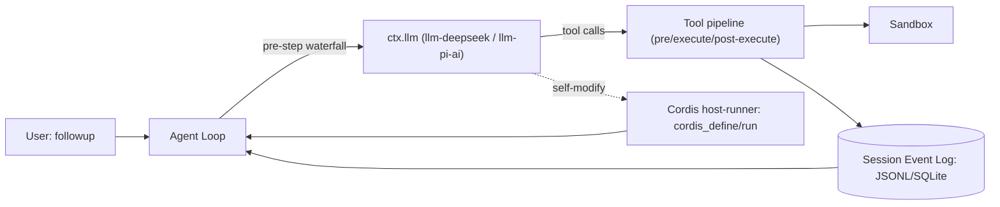
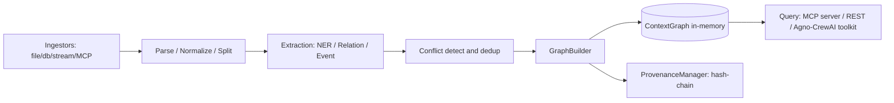
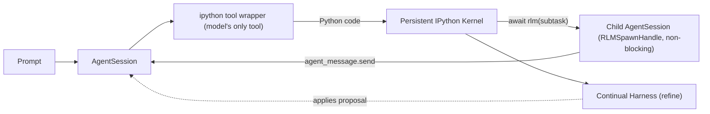
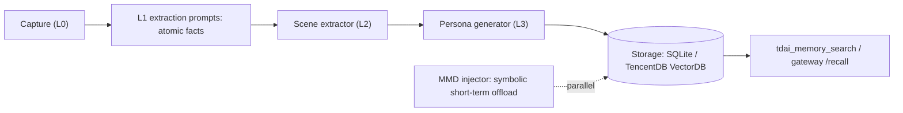

# Weekly Agentic AI Scan — 2026-08-18

**Executive summary:**
- Tuần này nổi bật nhất là **DeepSeek Harness (dsh)**: kernel plugin hóa toàn bộ (kể cả UI, sandbox, agent loop) theo mô hình Cordis, và cho phép model tự định nghĩa/chạy plugin mới ngay trong runtime — mức độ "self-modifying" hiếm gặp.
- **Semantica** và **Prime Agent** đều có kiến trúc đáng học (graph/provenance deterministic layer; RLM với context-as-variables trong IPython kernel), nhưng cả hai đều có gap thực sự giữa marketing và code: Semantica có Rete engine là stub (`return True` cứng), Prime Agent không sandbox model-generated code và CI loại trừ test daemon.
- **TencentDB Agent Memory** là trường hợp cảnh báo phương pháp luận: mô tả ban đầu (4 loại memory asset, ACL theo team) không khớp với source code thực tế (kiến trúc L0→L3 + symbolic offload bằng Mermaid) — báo cáo dưới đây dùng dữ liệu đã verify qua source, không dùng mô tả marketing ban đầu.

**Mục lục:**
1. [DeepSeek Harness (dsh)](#1-deepseek-harness-dsh)
2. [Semantica](#2-semantica)
3. [Prime Agent](#3-prime-agent)
4. [TencentDB Agent Memory](#4-tencentdb-agent-memory)

---

## 1. DeepSeek Harness (dsh)

Repo: [`deepseek-ai/deepseek-harness`](https://github.com/deepseek-ai/deepseek-harness) — developer preview, launch ~13/08/2026.

### §1 Quick context

Agent harness "everything is a plugin" — mọi subsystem (model, tool, sandbox, UI) đều là plugin cắm vào kernel **Cordis**. Stack: TypeScript/Node.js pnpm monorepo (ESM, strict mode), Python SDK riêng, native Node addon (`landlock-run`), VitePress docs. Health: 153.2k sao, 15.8k fork, 644 watcher, MIT, 12,404 commit trên `master`; không xác định số contributor cụ thể (trang contributors không render dữ liệu). CI rất nặng: 15 workflow, coverage gate 100% dòng/file, 5 tier test (unit, e2e thật, e2e không cần key, snapshot/replay, visual-regression Chromium).

### §2 Architecture deep-dive

**A. Component inventory**
- `Cordis kernel` (`vendor/`, giải thích ở `docs/cordis-primer.md`) — service-registration/DI kernel, nền tảng cho toàn bộ plugin.
- `Agent loop` (`packages/core/agent-loop`, `packages/core/agent`) — driver điều phối turn/step.
- `Model adapters` (`packages/llm/llm-deepseek`, `packages/llm/llm-pi-ai`, `packages/llm/llm-retry`) — seam `ctx.llm`.
- `Tool registry & pipeline` (`packages/core/tools`, `docs/tool-execution-pipeline.md`) — waterfall pre/execute/post.
- `Session manager` (`packages/session/session-persistence-jsonl`, `-sqlite`) — nguồn sự thật duy nhất (session log).
- `Sandbox` (`packages/sandbox/*`, `docs/subsystems/sandbox.md`) — Landlock/Seatbelt/Windows ACL, 3 policy mode.
- `Compaction` (`packages/compaction/*`) — nén context theo token-pressure.
- `Self-modifying runtime` (`packages/extensions/cordis-host-runner`, `tool-cordis`) — model tự định nghĩa/chạy Cordis package mới qua tool `cordis_define/cordis_run`.

**B. Control flow — Event-driven với waterfall hook**, không phải ReAct/planner-executor cổ điển:
1. User gọi `followup()`, driver claim message, phát `turn/start`.
2. Waterfall `agent/pre-step` cho phép plugin authorize/reject step.
3. System prompt lắp ráp qua waterfall → gọi `ctx.llm` → ghi assistant message.
4. Tool được phân loại và chạy qua waterfall `tools/pre-execute → execute → post-execute`.
5. Lỗi được xử lý bởi waterfall `agent/request-error` (retry hay propagate).
6. Turn đóng ở checkpoint `agent/turn-stopping`, hoặc lặp lại nếu còn message trong queue.

**C. State & data flow:** mọi thứ là `SessionEvent` JSON (`{type, seq, time, data}`), phân loại surface (model thấy) vs log-only. Event bus namespace theo slash (`agent/*`, `tools/*`...) với 4 mode: emit/waterfall/serial/parallel. Storage: JSONL nén Zstandard hoặc SQLite (`node:sqlite`) — không có DB ngoài bắt buộc.

**D. Tool integration:** tool là Cordis plugin đăng ký vào `ctx.tools`; schema sinh động (đọc từ `ctx.tools.schemas()` lúc boot, không hardcode). Có `run_code` (Code Mode) cho model viết chương trình TS gọi tool theo lập trình. MCP chỉ ở vai trò **client** (`packages/mcp/mcp-client`), không expose dsh như MCP server.

**E. Memory:** không có long-term/vector memory nội bộ; session log là "short-term memory" duy nhất; long-term được giao cho MCP memory server bên thứ ba (`examples/mcp-memory`).

**F. Model orchestration:** `ctx.llm` trung lập nhà cung cấp; `llm-deepseek` (native) và `llm-pi-ai` (multi-provider); `llm-retry` xử lý retry khi lỗi. Song song/hierarchy đạt được qua `packages/subagent` và `packages/workflow` (agent()/pipeline()/parallel()).

**G. Observability:** `session-telemetry` + `session-telemetry-otel` (OpenTelemetry JS SDK), 2 kênh "ledger"/"ops"; test snapshot replay session log để diff. Có 4 postmortem thật trong `docs/postmortem/` — dấu hiệu văn hóa kỹ thuật trưởng thành.

**H. Extension points:** bundle npm khai báo `dsh.bundle` manifest, cài qua `dsh plugin add`; discoverability qua GitHub topic `dsh-plugin`. Đặc biệt: agent có thể tự tạo plugin runtime (self-modifying), được tài liệu gắn cờ rõ là "deliberate opt-in".

### §3 Architecture diagram

### §4 Verdict

Novel nhất: kernel Cordis biến **mọi** subsystem — kể cả UI và chính agent loop — thành plugin có thể tắt/thay/thêm runtime, và cho phép model tự viết plugin mới để chạy ngay (self-modifying, có sandbox VM). Red flag: `CONTRIBUTING.md` nói thẳng "không nhận external PR" dù gắn mác open-source MIT; cảnh báo breaking-change liên tục (`SESSION_FORMAT_VERSION` không cam kết tương thích); star count 153k trong ~5 ngày không thể verify chéo qua contributors graph. Cần đào sâu: cơ chế fallback/routing thật của `llm-pi-ai`, và mức độ an toàn thực tế của self-modifying runtime khi chạy production.

---

## 2. Semantica

Repo: [`semantica-agi/semantica`](https://github.com/semantica-agi/semantica) — "Graph-Native Infrastructure for Context and Accountable AI Systems".

### §1 Quick context

Lớp hạ tầng graph xác định (deterministic), nằm dưới LLM/vector-store/agent-framework, tự nhận là "Open Source Palantir for AI Agents". Stack: Python ≥3.8, 40+ dependency (NumPy, PyTorch, spaCy, RDFlib, NetworkX...), CLI entry points (`semantica`, `semantica-server`, `semantica-mcp`...). Health: 8.7k sao, 891 fork, MIT; bản mới nhất trên `main` là **v0.6.5** (11/08/2026, "security release") — 5 minor version sau bản v0.3.0 "Production/Stable" đầu tiên hay được nhắc tới. Không xác định số contributor (trang lỗi khi fetch). CI có 9 workflow nhưng **không chạy pytest** dù có `tests/` với 25+ thư mục con.

### §2 Architecture deep-dive

**A. Component inventory**
- `ContextGraph` (`semantica/context/context_graph.py`) — graph engine in-memory (dict node + list edge), thread-safe bằng `RLock`.
- `ProvenanceManager` (`semantica/provenance/manager.py`) — hash-chain lineage (W3C PROV-O style), `checksum`/`verify_checksum`.
- `PolicyEngine` (`semantica/context/policy_engine.py`) — compliance rule-based (min/max/required-field).
- `Reasoning engines` (`semantica/reasoning/rete_engine.py`, `datalog_reasoner.py`, `sparql_reasoner.py`...) — deterministic reasoning, không cần LLM.
- `Ingestion pipeline` (`semantica/ingest/`, 30 connector: file/db/stream/MCP...).
- `Parse/Normalize/Split` (`semantica/parse`, `semantica/normalize`, `semantica/split`) — chunk text theo entity/relation-aware strategy.
- `Extraction layer` (`semantica/semantic_extract/`: NER/relation/event/triplet, tùy chọn `llm_extraction.py`).
- `Conflict detection / dedup` (`semantica/conflicts/`, `semantica/deduplication/`) — reconcile entity trùng/mâu thuẫn trước khi merge.
- `GraphBuilder` (`semantica/kg/`) — ghi node/edge đã reconcile vào `ContextGraph`.
- `Graph store / triplet store / vector store` (`semantica/graph_store/`, `triplet_store/`, `vector_store/`) — Neo4j/FalkorDB/Neptune/Oxigraph/FAISS/Qdrant...
- `MCP server` (`mcp/server.py`, 17 tool) và framework integration (`integrations/agno/`, `integrations/crewai/`).

**B. Control flow — Pipeline dạng ETL-vào-graph** (không phải agent loop):
1. Ingest (connector-specific) → normalize document.
2. Parse/normalize/split (chunk theo entity/relation-aware).
3. Extract (NER/relation/event, mặc định rule/model-based, tùy chọn LLM).
4. Conflict-detect & dedup trước khi merge.
5. GraphBuilder ghi node/edge vào `ContextGraph`, mỗi fact được `ProvenanceManager` gắn lineage.
6. Agent/LLM downstream query qua `ContextGraph.query()`, MCP tool, REST API, hoặc Agno/CrewAI toolkit (`query_graph(query: str) -> str`).

**C. State & data flow:** `ContextGraph` mặc định in-memory (không bắt buộc DB ngoài); node/edge có `node_type/edge_type` + metadata + bitemporal `valid_from/valid_until`. Provenance hỗ trợ lưu SQLite hoặc custom backend pluggable. Có hybrid retrieval (graph + vector, RRF fusion) qua `AgentContext(vector_store=..., knowledge_graph=...)`.

**D. Tool integration:** không dùng function-calling model trực tiếp làm cơ chế chính — thay vào đó lộ ra qua Toolkit class (Agno: đăng ký method tường minh bằng `self.register(fn)`, trả JSON string) hoặc MCP server 17 tool (Extraction/Decision Intelligence/Knowledge Graph/Reasoning/Export). Extension connector mới qua `MethodRegistry.register(task, name, fn)` (`semantica/ingest/registry.py`) — điểm plugin thật sự linh hoạt nhất trong repo.

**E. Memory:** không có bộ nhớ hội thoại kiểu agent; có "memory" ở nghĩa graph theo thời gian (`state_at(date)` snapshot bitemporal), không có bước tóm tắt/compaction bằng LLM.

**F. Model orchestration:** LLM **hoàn toàn tùy chọn**, chỉ dùng trong bước extract (`ner_method="llm"`), README khẳng định rõ reasoning engine (Rete/Datalog/SPARQL) không cần LLM.

**G. Observability:** provenance hash-chain (`sequence_id`/`previous_checksum`) cho audit trail; `decision_recorder.py`/`decision_query.py` ghi decision kèm `reasoning`, `confidence`, hỗ trợ `trace_decision_chain()`; export ra Turtle/RDF cho audit ngoài.

**H. Extension points:** connector mới qua `MethodRegistry`; policy mới qua `PolicyEngine.add_policy()`. Nhưng entity/edge type mới **không** có API đăng ký — bị hardcode trong `graph_schema.py`, phải sửa source trực tiếp.

### §3 Architecture diagram

### §4 Verdict

Điểm đáng học: `ProvenanceManager` với hash-chain integrity và `PolicyEngine` compliance là bằng chứng code thật cho "accountable AI", không chỉ marketing — hiếm thấy mức chi tiết này ở tầng infra context. Red flag nghiêm trọng: `rete_engine.py` — thành phần "deterministic reasoning" chủ lực — có `_matches()`/`_can_join()` trả `True` không điều kiện, tức là stub, mâu thuẫn trực tiếp với tuyên bố kiến trúc; đồng thời test suite (886+ test theo release note) không được wire vào CI (`ci.yml` không gọi pytest). Cần đào sâu: các reasoner còn lại (Datalog/SPARQL/deductive) có bị stub tương tự không, và vì sao gap CI/test tồn tại ở một dự án tự nhận "Production/Stable".

---

## 3. Prime Agent

Repo: [`PrimeIntellect-ai/prime-agent`](https://github.com/PrimeIntellect-ai/prime-agent) — phân phối thương hiệu của framework `pi` (earendil-works/pi), self-improving RLM agent.

### §1 Quick context

Agent code/nghiên cứu dùng **Recursive Language Model (RLM)**: model chạy Python trong IPython kernel bền vững, coi context là biến số, gọi subagent đệ quy qua `await rlm(...)`. Stack: TypeScript/Node.js host (Node ≥22.8) + Python 3.11 kernel side, package `@earendil-works/pi-coding-agent` v0.7.3. Health: 17.0k sao/1.8k fork/75 watcher (xác nhận 2 lần fetch — khác với con số ~6.6k sao ban đầu tìm được, cần verify lại), 4,524 commit, release mới nhất v0.7.3 (17/08/2026). CI có nhưng script `test:ci` **loại trừ test tiến trình daemon** — gap coverage đáng chú ý.

### §2 Architecture deep-dive

**A. Component inventory**
- `AgentSession` / `rlm-runtime` (`packages/coding-agent/src/core/agent-session.ts`, `rlm-runtime.ts`) — điều phối RLM policy, tạo/quản lý child session.
- `IPython kernel manager` (`core/kernel/index.ts`, `bootstrap.ts`, `fork-server.ts`) — giao tiếp ZeroMQ/Jupyter protocol.
- `ipython tool wrapper` (`core/tools/ipython.ts`) — tool duy nhất model được gọi trực tiếp; đây cũng là điểm model thực hiện "model call" trong happy path.
- `Continual Harness` (`core/refinement/refinement.ts`) — lưu prompt/memory/skill/subagent entry, có `loadHarnessState`/`applyRefinementProposal`.
- `Daemon/Supervisor` (`docs/daemon.md`) — giữ session sống qua disconnect/crash bằng "atomic launch lease".
- `Model resolver` (`core/model-resolver.ts`) — fallback chọn model theo thứ tự ưu tiên.
- `Trace exporter` (`core/agent-traces.ts`) — upload NDJSON lên Prime Agent Traces API.

**B. Control flow — RLM loop (không phải ReAct/planner-executor cổ điển)**:
1. Prompt vào qua `AgentConnection` → `Supervisor` → `AgentSessionRuntime`.
2. Model chỉ có 1 tool native: `ipython`.
3. Model sinh code Python, chạy trong kernel bền vững (biến/import sống qua nhiều turn) qua ZeroMQ có ký HMAC-SHA256.
4. Trong code đó, model gọi `await rlm("subtask")` → gửi Jupyter comm `host.request`/`rlm.run` → `AgentSession` cha tạo child session `sub-xxxxxxxx`, trả `RLMSpawnHandle` **ngay lập tức, không block**.
5. Nhiều `rlm()` có thể gọi song song không chờ; child báo kết quả qua `agent_message.send(receiver_role="parent")`, không qua return value.
6. `/refine` đọc tối đa 80k ký tự trajectory gần nhất, đề xuất sửa harness state, validator **từ chối cứng** mọi edit vào base system prompt.

**C. State & data flow:** session log JSONL tại `~/.prime/agent/sessions/<id>.jsonl`, entry dạng cây `id/parentId` (hỗ trợ branch không cần file mới). "Context as variables" là literal object Python sống trong kernel. Kernel state snapshot bằng `kernel-state.dill`+`.json`, lưu file-based (không DB) dưới `~/.prime/agent/session-artifacts/`. IPC binary framed protocol (Protocol v4) giữa supervisor/worker.

**D. Tool integration:** chỉ **một** tool function-calling (`ipython`); mọi thứ khác (shell qua `!cmd`/`%%bash`, edit file, MCP tool, skill) đều là Python callable/magic bên trong kernel — thiết kế cố ý để tool surface tối giản. **Không sandbox**: tài liệu nói thẳng IPython chạy với quyền OS của worker, "not a security sandbox".

**E. Memory (Continual Harness):** 2 tầng — global (`{agentDir}/harness/harness_state.json`, cross-session, read-only khi refine local) và local (session-scoped); 4 loại entry: prompt/memory/skill/subagent. Base system prompt bất biến được **enforce trong code** (`refinement.ts` reject edit).

**F. Model orchestration:** hỗ trợ Anthropic/OpenAI/Google + custom (Ollama/vLLM/OpenRouter). Child session mặc định kế thừa model cha trừ khi override; giới hạn độ sâu đệ quy mặc định = 1 (`RLM_DEPTH` env var). `model-resolver.ts` có fallback theo thứ tự CLI → scoped → saved default → key khả dụng đầu tiên.

**G. Observability:** `agent-traces.ts` export NDJSON structured event lên remote Trace API (không phải eval harness local). Không tìm thấy eval/replay có điểm số — "self-improvement" chỉ dựa vào LLM tự đọc lại trajectory, chưa có framework eval độc lập.

**H. Extension points:** Skill = thư mục có `SKILL.md` + optional Python package, cài editable vào kernel; thứ tự discovery CLI→project→global→package.json→built-in. Extension TypeScript qua `ExtensionAPI` (`pi.registerTool()`, `pi.registerCommand()`, hot-reload `/reload`).

### §3 Architecture diagram

### §4 Verdict

Novel: coi toàn bộ context (biến, import, tool handle) là state sống trong IPython kernel thay vì message list — subagent đệ quy trở thành lời gọi hàm bất đồng bộ (`await rlm()`) không block, khác hẳn pattern planner-executor/ReAct phổ biến; và việc base system prompt bất biến được validator enforce cứng trong code (không chỉ tài liệu) là điểm thiết kế tự-cải-thiện an toàn hiếm gặp. Red flag: model-generated code chạy full quyền OS, tự nhận không sandbox; CI loại trừ test daemon — đúng phần dễ vỡ nhất (lease/adopt khi crash); star count lệch (17.0k thực tế vs 6.6k tìm thấy ban đầu, chưa rõ nguyên nhân). Cần đào sâu: cơ chế eval/score thật cho "self-improving" (hiện chỉ là LLM đọc lại log), và độ tin cậy của daemon recovery trong production.

---

## 4. TencentDB Agent Memory

Repo: [`TencentCloud/TencentDB-Agent-Memory`](https://github.com/TencentCloud/TencentDB-Agent-Memory).

> **Lưu ý phương pháp luận:** mô tả ban đầu tìm được qua search (4 loại memory asset Chat/Skill/Wiki/Code-Graph, kiến trúc memory-core+memory-hub+proxy, ACL theo Admin/Member) **không khớp** với source code đã verify (README, `package.json`, cây thư mục `src/`). Toàn bộ phần dưới dùng dữ liệu đã đối chiếu chéo qua ~20 lần fetch file thật.

### §1 Quick context

Plugin memory cho agent theo mô hình **"symbolic short-term memory + layered long-term memory"**: nén tool log dài thành ký hiệu Mermaid gọn, và chưng cất hội thoại thành persona/scene có cấu trúc thay vì vector rời rạc. Stack: TypeScript/Node.js (`@tencentdb-agent-memory/memory-tencentdb` v0.3.6, Node ≥22.16), build bằng `tsdown`, test bằng `vitest`. Health: ~22.7k sao/2.1k fork (chỉ đọc được từ trang HTML, chưa verify qua API — số này cao bất thường so với changelog cho thấy dự án còn non trẻ, entry đầu tiên 26/03/2026); chỉ có 1 CI workflow (`pr-ci.yml`), test rải rác co-located, chưa thấy eval suite riêng.

### §2 Architecture deep-dive

**A. Component inventory**
- `tdai-core` (`src/core/tdai-core.ts`, `index.ts`, `types.ts`) — engine điều phối pipeline.
- `Conversation capture (L0)` (`src/core/conversation/`).
- `L1 extraction prompts` (`src/core/prompts/`) — rút atomic fact/insight, thích ứng theo ngôn ngữ input.
- `Scene extractor (L2)` (`src/core/scene/scene-extractor.ts`).
- `Persona generator (L3)` (`src/core/persona/persona-generator.ts`, `persona-trigger.ts`).
- `Storage layer` (`src/core/store/sqlite.ts`, `tcvdb.ts`, `bm25-local.ts`, `bm25-client.ts`, `embedding.ts`, `factory.ts`).
- `Tool surface` (`src/core/tools/memory-search.ts`, `conversation-search.ts`) — expose `tdai_memory_search`, `tdai_conversation_search`.
- `Symbolic offload` (`src/offload/mmd-injector.ts`, `mmd-meta.ts`) — nén tool log thành Mermaid symbol trong context.
- `HTTP gateway` (`src/gateway/server.ts`) — REST endpoint cho tích hợp Hermes.
- `Adapters` (`src/adapters/openclaw/`, `src/adapters/standalone/`).

**B. Control flow — Pipeline chưng cất bộ nhớ, chạy song song với vòng lặp tool-use**:
1. Capture hội thoại (hook OpenClaw plugin hoặc `POST /capture`) → lưu L0 raw.
2. Extract L1: rút atomic fact/insight (prompt theo ngôn ngữ input, ở `src/core/prompts/`).
3. Cluster L2: `scene-extractor.ts` nhóm atom thành scene, trigger sau delay cấu hình (mặc định 10s).
4. Synthesize L3: `persona-generator.ts` tổng hợp scene thành persona Markdown.
5. **Song song**: `mmd-injector.ts` duy trì 1 message Mermaid "active MMD" trong context khi đang chạy tool-use loop, thay log tool dài bằng node reference gọn.
6. Agent gọi `tdai_memory_search`/`tdai_conversation_search` trực tiếp (OpenClaw) hoặc qua gateway REST (`/recall`, `/search/memories`, `/search/conversations`); `/session/end` flush phiên.

**C. State & data flow:** L0/L1 lưu DB (SQLite mặc định, hoặc TencentDB Vector DB thật qua `tcvdb.ts`/`tcvdb-client.ts` — có script migrate `migrate-sqlite-to-tcvdb.mjs`), L2/L3 lưu file Markdown human-readable dưới `~/.openclaw/memory-tdai/`, có `result_ref`/`node_id` trace về evidence gốc. Cơ chế Mermaid offload **có bằng chứng code thật**: `MmdMeta{filename, taskGoal, nodeSummaries: [{nodeId, status, summary≤100 ký tự}]}`, tính fingerprint nội dung để tránh re-inject thừa, trỏ về file `offload.{sessionid}.jsonl` chứa chi tiết đầy đủ.

**D. Tool integration:** **không dùng MCP** (xác nhận đọc `server.ts` — HTTP thuần bằng Node `http`, không Express/MCP). Hai đường tích hợp: plugin OpenClaw (đăng ký tool trực tiếp) hoặc gateway Hermes (REST, Bearer token `TDAI_GATEWAY_API_KEY`, CORS allowlist).

**E. Memory architecture (trọng tâm repo):** 2 subsystem tách biệt trong code — offload ngắn hạn (Mermaid, ephemeral, theo session) và pyramid dài hạn L0→L1→L2→L3 (bền, LLM-driven mỗi tầng). Retrieval **hybrid thật**: vector embedding (`embedding.ts`) kết hợp BM25 (`bm25-local.ts`/`bm25-client.ts`), merge qua `search-utils.ts`; có giới hạn budget (`recall.maxCharsPerMemory`). Không có graph-based retrieval (Mermaid chỉ để hiển thị, không dùng để traverse).

**F. Model orchestration:** dùng Vercel AI SDK, model-agnostic qua `MODEL_BASE_URL`/`MODEL_NAME` cấu hình (ví dụ minh họa dùng `deepseek-v3.2` qua Tencent LKEAP hoặc `gpt-4o` qua OpenAI); có tùy chọn local inference (`node-llama-cpp`). Không có fallback provider tự động — chỉ có shim tương thích ngược cho OpenClaw host cũ.

**G. Observability:** tích hợp Opik tracer tùy chọn (`src/offload/opik-tracer.ts`, graceful degrade nếu không cài `opik`), theo dõi token usage thật (`context-token-tracker.ts`, `l3-token-counter.ts`). Các con số hiệu năng trong README (giảm 61.38% token trên WideSearch, +9.93% SWE-bench, PersonaMem 48%→76%) **không có eval/benchmark code kèm theo** trong repo đã fetch — cần coi là claim chưa verify được tại chỗ.

**H. Extension points:** backend lưu trữ mới qua `factory.ts` (switch theo `config.storeBackend`); framework agent mới qua thêm sibling dưới `src/adapters/`. Không có registry cho "asset type" tùy chỉnh, không có ACL đa vai trò — chỉ có API-key đơn (Bearer) + CORS allowlist ở tầng gateway.

### §3 Architecture diagram

### §4 Verdict

Điểm đáng học cụ thể: cơ chế offload bằng ký hiệu Mermaid (`mmd-injector.ts`) là một cách nén context tool-use thực dụng và có bằng chứng code rõ ràng — thay log dài bằng node status + con trỏ tới JSONL chi tiết, khác cách tiếp cận tóm tắt LLM thông thường. Red flag lớn nhất không nằm ở code mà ở **mô tả**: premise ban đầu (4 asset type, ACL team) sai hoàn toàn so với repo thật — bài học cho việc không nên tin single-source summary khi research repo mới. Thêm: benchmark trong README không có eval code đi kèm, sao count cao bất thường so với tuổi dự án chưa verify được qua API. Cần đào sâu: vì sao mô tả ban đầu lan truyền sai lệch xa vậy, và benchmark WideSearch/SWE-bench có tái lập được không.

---

*Tự động tạo bởi weekly agentic AI research scout. Nguồn: GitHub WebSearch + WebFetch (không dùng được `gh api search/repositories` do session bị giới hạn scope repo).*
