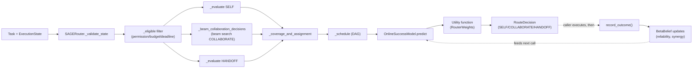
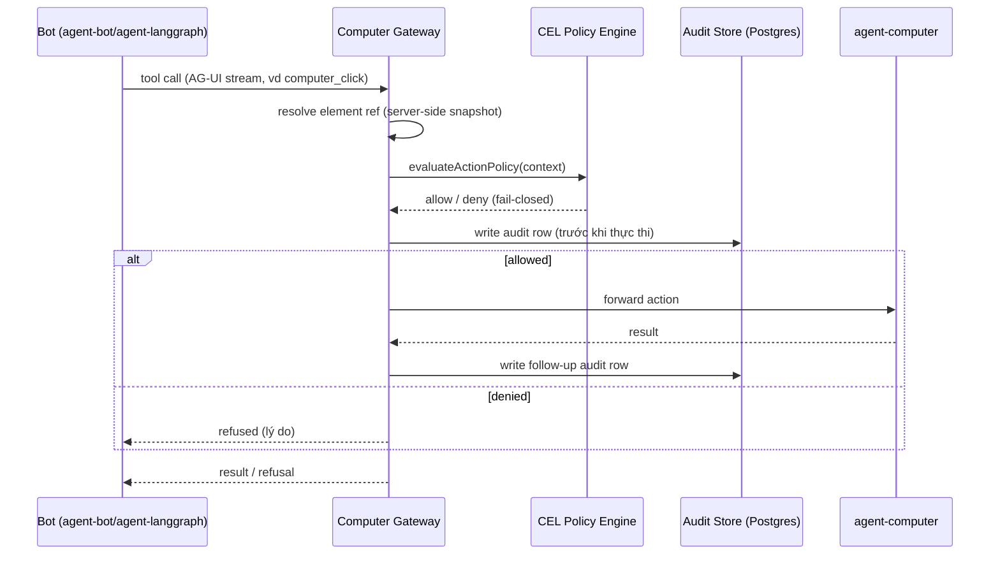
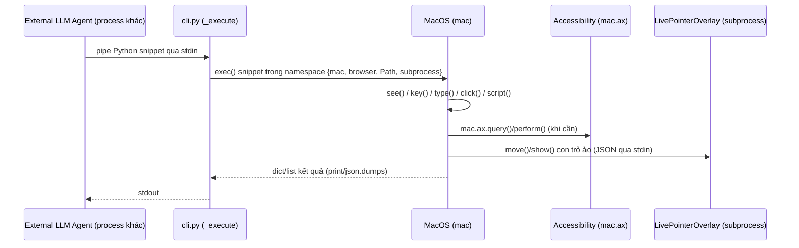
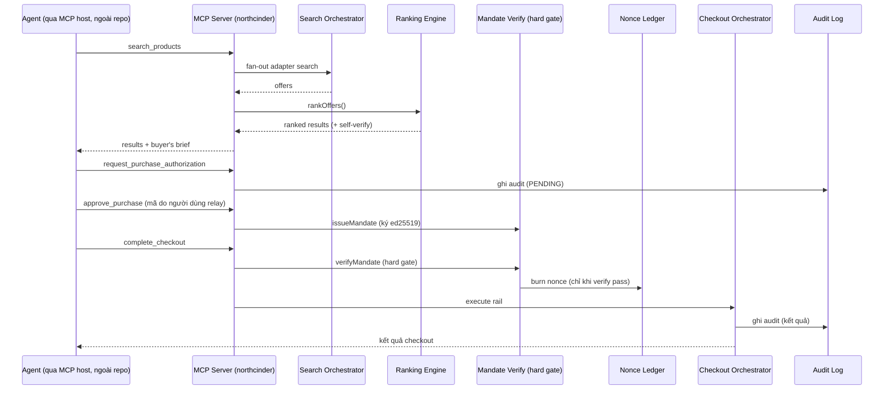

# Weekly Agentic AI Scan — 2026-08-20

**Nguồn dữ liệu:** GitHub repository search (`created:>2026-08-13 stars:>200`, keyword `agent`/`agentic`/`multi-agent`), truy cập qua `github.com` search UI và `raw.githubusercontent.com` (API `api.github.com` bị chặn bởi network policy của session này, nên không dùng được `gh api`/`search/repositories` như source ưu tiên #1 trong yêu cầu gốc — đã fallback sang GitHub web search + raw file fetch).

## Executive Summary

- 4 repo được chọn trải rộng 4 lớp kiến trúc khác nhau của "agentic stack": một **decision-layer router thuần thuật toán** (không LLM) cho A2A networks, một **platform đa-agent có policy/audit gateway** kiểu production, một **execution harness tối giản** cho OS control (triết lý ngược với xu hướng "framework càng nhiều tool càng tốt"), và một **MCP server có guardrail mua hàng dựa trên cryptographic mandate** thay vì chỉ dựa vào prompt instruction.
- Điểm chung đáng chú ý: cả 4 repo đều **tách rời rõ ràng phần "quyết định/reasoning" (do LLM/agent bên ngoài đảm nhận) khỏi phần "thực thi có kiểm soát"** (routing utility function, policy gateway, OS primitive, purchase mandate) — một tín hiệu rằng kiến trúc agentic đang trưởng thành theo hướng tách lớp guardrail khỏi lớp model, không nhét toàn bộ logic an toàn vào system prompt.
- Điểm cần thận trọng: 3/4 repo đang ở giai đoạn rất sớm (v0.1.x–v0.2, "research preview"/"alpha"), ít contributor/fork thực; giá trị chính tuần này là **đọc kiến trúc để học pattern**, chưa phải để adopt vào production.

## Mục lục

1. [wang2122/sprix-sage-router](#1-wang2122sprix-sage-router)
2. [CopilotKit/openbot](#2-copilotkitopenbot)
3. [browser-use/macos-harness](#3-browser-usemacos-harness)
4. [cinderline/northcinder](#4-cinderlinenorthcinder)

---

## 1. wang2122/sprix-sage-router

**Link:** https://github.com/wang2122/sprix-sage-router

### §1 — Quick Context

Router thuần thuật toán (không gọi LLM) quyết định SELF/COLLABORATE/HANDOFF cho task đang chạy trong mạng agent A2A. Tech stack: Python 3.10+, **zero runtime dependency** (chỉ dùng `dataclasses`, `enum`, `itertools`, `math`, `random`), build bằng `setuptools`. Repo health: 647 sao, 10 fork, MIT license, CI chạy `py_compile` + `unittest` trên Python 3.10/3.11/3.12 (`.github/workflows/tests.yml`), có bộ 10 unit test hành vi (`test_sprix_sage.py`) — nhưng tự nhận là "Research Preview v0.2".

### §2 — Architecture Deep-Dive

**A. Component inventory** (toàn bộ nằm trong một file `sprix_sage.py`, 749 dòng):
- `SAGERouter` (`sprix_sage.py`, class ~L282) — router chính, điều phối toàn bộ quy trình đánh giá và học.
- `OnlineSuccessModel` (`sprix_sage.py`, L196–230) — logistic regression online (SGD) trên 9 feature thủ công, dự đoán xác suất thành công.
- `BetaBelief` (`sprix_sage.py`, L169–193) — posterior Beta distribution cho độ tin cậy (global reliability, per-skill reliability, synergy giữa 2 agent, cost/latency fidelity), hỗ trợ Thompson sampling qua `.draw()`.
- `RouterWeights` (`sprix_sage.py`, L234–241) — hệ số phạt tuyến tính (cost, latency, risk, handoff, coordination, uncertainty, exploration) dùng trong utility function.
- `_coverage_and_assignment` (L488) — tính coverage kiểu noisy-OR cho từng requirement và gán agent phù hợp nhất.
- `_schedule` (L563) — DAG scheduler: duyệt topology các requirement còn lại, tính finish-time, dựng "topology" edge chéo agent, áp hệ số overhead phối hợp.
- `_beam_collaboration_decisions` (L696) — beam search có giới hạn để tìm team COLLABORATE tối ưu.
- `_switch_loss` (L599) — mô hình chi phí chuyển đổi (progress, context-transferability, số agent giữ lại, số lần fail).

**B. Control flow — pattern: single-shot scoring/search router (không phải planner-executor, không phải state machine, không event-driven).** Router được gọi đồng bộ, không giữ vòng lặp nội bộ:
1. `route()` build/validate `ExecutionState` qua `_validate_state`.
2. `_prepare_bids` điền `Bid` cho từng agent, `_eligible` lọc theo permission/budget/deadline.
3. `_evaluate(SELF)` chấm điểm agent hiện tại; `_beam_collaboration_decisions` chạy beam search cho COLLABORATE; `_evaluate(HANDOFF)` chấm từng agent khác.
4. Mỗi `_evaluate` nội bộ chạy `_coverage_and_assignment` → `_team_terms` (synergy) → `_schedule` (DAG latency) → `OnlineSuccessModel.predict` → utility tuyến tính.
5. `_team_feasible` re-check cost/latency sau khi schedule; trả về `RouteDecision` có utility cao nhất trong 3 mode.
6. `record_outcome()` — bước riêng, do caller gọi sau khi thực thi thật (hoặc mô phỏng) — cập nhật `success_model` và các `BetaBelief`.

**C. State & data flow:** message format là frozen `@dataclass` (không dùng dict/pydantic). State lưu **hoàn toàn in-memory** (dict thuộc tính của `SAGERouter`), không có persistence, không I/O file/DB nào trong module. Không có "context window" theo nghĩa LLM — `transferable_context` chỉ là một float biểu diễn mức độ tiến độ có thể chuyển giao khi handoff.

**D. Tool/capability integration:** không có cơ chế tool-calling. "Capability" là dữ liệu tĩnh: `Agent.skills: Mapping[str, float]` và `Agent.permissions: frozenset[str]`. README nói thẳng: *"The current prototype returns a routing decision; it intentionally does not transmit tasks"* — router chỉ ra quyết định, không thực thi gì cả.

**E. Memory:** không có memory theo nghĩa LLM (không retrieval, không summarization). Roadmap trong README liệt kê "learned task-text embeddings and candidate retrieval" là **chưa triển khai**.

**F. Model orchestration:** **không gọi LLM nào trong toàn bộ codebase** — xác nhận qua `pyproject.toml` (0 runtime dependency) và import list. "Model" duy nhất là `OnlineSuccessModel`, một logistic regression tự viết tay, không phải neural net hay API call.

**G. Observability & eval:** `test_sprix_sage.py` — 10 unit test hành vi (white-box). `benchmark.py` (345 dòng) dựng một **simulator ẩn tách biệt** (`HiddenAgent`, hàm chất lượng sigmoid phi tuyến) để không dùng chính xác suất của SAGE làm ground truth — so sánh 5 chiến lược (self/skill_solo/oracle_solo/static_sage/learned_sage) trên 2.500 task (5 seed × 500 task). Không có logging/tracing framework nào.

**H. Extension points:** không có plugin registry — mở rộng bằng constructor injection thuần Python: thêm `Agent(...)` mới, đổi `RouterWeights`, hoặc subclass `SAGERouter` để thay `OnlineSuccessModel` (ALGORITHM.md nói rõ model này "intentionally replaceable" nhưng không có injection point sẵn trong constructor).

### §3 — Architecture Diagram

### §4 — Verdict

**Điểm novel:** hợp nhất SELF/COLLABORATE/HANDOFF vào **một hàm utility tuyến tính duy nhất** thay vì 3 heuristic rời rạc, kết hợp beam search cho team-forming và DAG scheduling cho chi phí phối hợp — implementation gọn, có test bao phủ hành vi (không phải chỉ smoke test). **Red flag:** đây là router **không hề gọi LLM** — nếu kỳ vọng "agent routing" nghĩa là có model ra quyết định thì sẽ thất vọng; tác giả tự thừa nhận benchmark "not evidence of real-world superiority" và "not a substitute for real trace training". **Câu hỏi mở:** làm sao tích hợp với A2A transport/auth thật, và utility tuyến tính có scale nổi khi skill-set phức tạp hơn nhiều so với ví dụ demo hay không.

---

## 2. CopilotKit/openbot

**Link:** https://github.com/CopilotKit/openbot

### §1 — Quick Context

Platform đa-agent nơi mỗi "Bot" (AG-UI protocol) có "computer" riêng (browser + file), mọi hành động đều đi qua một **CEL policy gateway** quyết định trước và ghi audit sau khi thực thi. Tech stack: TypeScript/Bun monorepo, Hono API server, Drizzle ORM + PostgreSQL/pgvector, `cel-js`, `@ag-ui/client` + `@copilotkit/runtime`, Playwright/Chromium, Docker Compose, SPIFFE/SPIRE tùy chọn. Repo health: 736 sao, 70 fork, MIT, CI + security scanning active, cấu trúc monorepo có `/docs`, `/examples`, `/scripts`, `/tests`.

### §2 — Architecture Deep-Dive

**A. Component inventory:**
- API/Gateway server (`server/src/app.ts`, `server/src/index.ts`) — mount route auth/audit/credentials/agents/computer, host CopilotKit runtime.
- Computer gateway (`server/src/computer/gateway.ts`) — "the only way an action reaches a Bot's computer": resolve ref → evaluate policy → ghi audit → mới thực thi.
- CEL policy engine (`server/src/computer/policy.ts`) — `evaluateActionPolicy()`, danh sách deny/allow bằng biểu thức CEL, fail-closed.
- Policy store (`server/src/db/schema/computer.ts`, bảng `actionPolicy`) — lưu policy bền vững qua restart.
- SSRF/target guard (`server/src/computer/target.ts`) — chặn IP metadata cloud, dải RFC1918, scheme không phải http/https.
- Supervisor (`supervisor/src/index.ts`, `docker.ts`) — tạo/dừng/reset container Docker cho từng Bot (chỉ orchestration hạ tầng, không phải "agent supervisor" theo nghĩa multi-agent).
- agent-computer (`agent-computer/src/*`) — service chạy Chromium + workspace per-bot.
- agent-bot / agent-langgraph (`agent-bot/src/index.ts`, `agent-langgraph/src/index.ts`) — Bot mẫu gọi OpenAI trực tiếp / LangGraph single-node.
- Agent registry (`server/src/agents/{registry,runtime-agents,invocation}.ts`) — nạp coworker từ DB + `agents.yaml`.
- MCP integration (`server/src/plugins/{mcp,catalogue}.ts`) — kết nối MCP server, phân loại tool read/write.
- Audit subsystem (`server/src/audit.ts`) — ~40 loại event, redact secret, append-only.

**B. Control flow — pattern: gateway-mediated, protocol-driven client-loop (không phải hierarchical supervisor/worker theo nghĩa multi-agent orchestration).** Mỗi Bot tự chạy vòng lặp model+tool riêng; một policy gateway trung tâm chặn mọi hành động "computer":
1. Bot stream tool call (vd `computer_click`) qua AG-UI protocol về server.
2. `gateway.ts` resolve element `ref` qua snapshot phía server (không tin label do caller gửi).
3. `evaluateActionPolicy()` chạy `deny` trước rồi `allow`; thiếu policy hoặc expression lỗi → mặc định từ chối (fail-closed).
4. Ghi audit row **trước khi** hành động thực thi — comment trong code: *"an action that was not recorded did not happen, because there is no path that acts without writing the row first."*
5. Nếu được phép, gọi `agent-computer` thực thi thật; lỗi runtime có audit row riêng.
6. Kết quả stream ngược về model của Bot, vòng lặp tool tiếp tục ở phía client.

**C. State & data flow:** message format là AG-UI protocol event, được `toProviderMessages()`/`toLangChainMessages()` dịch sang OpenAI chat-completions hoặc LangChain message. State lưu PostgreSQL+pgvector (policy, audit, agents, credentials, documents/chunks cho RAG). **Bộ nhớ hội thoại không lưu trong repo này** — README nói rõ được ủy thác cho dịch vụ ngoài "CopilotKit Intelligence"; Postgres chỉ giữ mapping channel↔thread. Không tìm thấy cơ chế summarization/truncation context window trong code đọc được.

**D. Tool/capability integration:** tool-calling native qua AG-UI. Cơ chế CEL là điểm nhấn: `matches()` fail-closed — deny-rule lỗi vẫn deny, allow-rule lỗi vẫn từ chối. MCP tool được phân loại read/write qua `classifyTool()`, feed vào `PolicyContext.mcp.effect` cho rule CEL. Có `mode: "dry-run" | "enforce"` để test policy trên traffic thật mà không chặn.

**E. Memory architecture:** short-term memory ủy thác hoàn toàn cho dịch vụ ngoài (không có implementation trong repo). Long-term/retrieval: pipeline index tài liệu qua connector (`worker/src/connector-runner.ts`), bảng `documents`/`chunks` (vector 1536 chiều) + `documentAcls` cho coworker "Knowledge" có kiểm soát ACL.

**F. Model orchestration:** `agent-bot` mặc định `gpt-5.5` qua OpenAI; `agent-langgraph` hỗ trợ 3 provider (OpenAI/Anthropic `claude-sonnet-4-5`/Google `gemini-2.5-flash`) qua biến môi trường `BOT_PROVIDER`. Không có evidence về fallback tự động giữa các provider hay batching/parallelism.

**G. Observability & eval:** audit trail chi tiết (`server/src/audit.ts`) với redact ~30 field nhạy cảm, phân trang cursor, UI `/admin/audit`. **Không có OpenTelemetry** hay tracing library nào trong `server/package.json` — chỉ có `console.error(JSON.stringify(...))`. Không tìm thấy eval/replay hook.

**H. Extension points:** thêm coworker qua `agents.yaml` (`type: built-in` hoặc `type: remote-ag-ui`, chấp nhận bất kỳ endpoint nói AG-UI). Đổi model qua biến môi trường API key + base URL. Thêm MCP server qua `/admin/plugins` (có validate qua catalogue/URL check). Thêm policy rule qua `/admin/boundaries` viết CEL trực tiếp trên `PolicyContext`.

### §3 — Architecture Diagram

### §4 — Verdict

**Điểm novel:** không nằm ở thuật toán mà ở kiến trúc — một fleet Bot triển khai độc lập (bất kỳ framework nào nói AG-UI) dùng chung một **policy/audit gateway không thể bypass**, resolve DOM ref phía server để chặn label-spoofing, biến "decide-before-record-after" thành cơ chế cụ thể chứ không phải khẩu hiệu. **Red flag:** bộ nhớ hội thoại/context-window quản lý bởi dịch vụ ngoài không có trong repo (không kiểm chứng được cách hoạt động thật), không có tracing, không fallback model tự động, và biến môi trường mặc định `OPENBOT_DEV_NO_AUTH` cho thấy dự án còn ở giai đoạn alpha. **Câu hỏi mở:** CopilotKit Intelligence quản lý context window/summarization ra sao, và CEL policy được author/test ở quy mô lớn thế nào ngoài UI admin.

---

## 3. browser-use/macos-harness

**Link:** https://github.com/browser-use/macos-harness

### §1 — Quick Context

Harness Python tối giản expose 6 primitive macOS thô (`see`, `key`, `type`, `click`, `ax`, `script`) qua stdin-exec, để LLM agent tự viết code điều khiển Mac thay vì gọi tool riêng cho từng app. Tech stack: Python ≥3.11, `hatchling`, `uv.lock`, phụ thuộc `pyobjc-framework-ApplicationServices` (macOS-only), `pillow`. Repo health: 535 sao, 37 fork, MIT, CI chạy trên `macos-latest` (Python 3.11/3.12) với `ruff` + `pytest`, có 5 PR/1 issue mở.

### §2 — Architecture Deep-Dive

**A. Component inventory:**
- `MacOS` class (`src/macos_harness/macos.py`) — chứa các primitive `see()`, `key()`, `type()`, `click()`/`drag()`/`scroll()`, `script()`.
- `Accessibility` (`src/macos_harness/controls.py`) — wrapper cho AX (`at`, `query`, `get`, `set`, `actions`, `perform`), gắn vào `mac.ax`.
- `BrowserHarness` (`src/macos_harness/browser.py`) — proxy lazy tới package ngoài `browser_harness`, có sẵn watcher tự động click dialog "Allow remote debugging?" của Chrome qua AX.
- `LivePointerOverlay` (`src/macos_harness/overlay.py`) — subprocess AppKit `NSPanel` vẽ con trỏ ảo, giao tiếp qua JSON trên stdin, không bao giờ di chuyển con trỏ thật.
- Permission/doctor (`macos.py`: `permissions()`, `doctor()`, `request_permissions()`) — preflight check không gây popup (`AXIsProcessTrusted`, `CGPreflightScreenCaptureAccess`...).
- `telemetry.py` — telemetry ẩn danh qua PostHog, opt-out.
- CLI (`src/macos_harness/cli.py`, entry point `macos-harness`) — dispatcher `doctor`/`apps`/`repl`/`skill`/`telemetry`/`see`/`state` + mode mặc định exec-stdin.
- Skill playbook (`skills/macos-harness/SKILL.md`).

**B. Control flow — pattern: KHÔNG phải agent loop.** Đây không phải ReAct, không planner, **không có LLM call nào trong repo này** — harness chỉ là execution surface: CLI đọc một khối Python từ stdin và `exec()` một lần, với `mac`/`browser`/`Path`/`subprocess` đã bind sẵn trong namespace. Agent (Claude Code, Codex...) chạy ở process khác, tự lo phần reasoning/loop.
1. Agent (ngoài repo) viết snippet Python dùng `mac.*`/`browser.*`.
2. Pipe snippet vào `macos-harness` qua stdin; `main()` gọi `_execute(sys.stdin.read())`.
3. `_namespace()` dựng `BrowserHarness()` (lazy) và `MacOS()` (khởi tạo `CGEventSourceCreate` ngay, gắn `Accessibility`).
4. Toàn bộ snippet chạy đồng bộ trong một lệnh `exec()` — nhiều lệnh `mac.*` chạy nối tiếp không cần LLM can thiệp giữa chừng.
5. Kết quả `print()` (JSON hoặc string) trả về stdout cho agent đọc lại.
6. `finally` luôn gọi `capture_cli(...)` ghi telemetry, bất kể thành công/thất bại.

**C. State & data flow:** primitive trả về dict/list Python thuần; CLI subcommand serialize bằng `json.dumps`. AX element không serialize trực tiếp — `MacOS._elements: dict[int, Any]` cache handle sống theo `element_index`, JSON chỉ chứa index + thuộc tính an toàn. State (`_last_app`, `_last_windows`, `_last_screenshot`, `_pointer_position`) chỉ tồn tại trong cùng một process/`exec()` — **không** persist qua các lần gọi CLI riêng biệt (mỗi lần là process mới).

**D. Tool/capability integration:** 6 primitive expose như **method thuần trên object Python** (`mac`, `mac.ax`) bơm vào namespace `exec()` — không phải JSON function-calling schema, không phải MCP server. Test `test_agent_surface_is_flat_and_explicit` chủ động assert `mac` KHÔNG có sub-namespace `mouse`/`keyboard` — một constraint kiến trúc được enforce bằng test, chống việc API phình to.

**E. Memory:** không tìm thấy evidence — không vector store, không conversation memory, không episode log. Chỉ có file config telemetry (`install_id` + flag disable) tồn tại qua các lần chạy, không phải memory theo nghĩa agentic.

**F. Model orchestration:** **repo này không gọi LLM nào**. Docstring trong `macos.py` nói thẳng: *"No Codex or OpenAI Computer Use runtime is used here."* Đây thuần túy là tool/harness được điều khiển bởi agent process bên ngoài.

**G. Observability & eval:** telemetry opt-out qua biến môi trường (`MACOS_HARNESS_TELEMETRY`, `ANONYMIZED_TELEMETRY`, `DO_NOT_TRACK`) hoặc file config; payload allowlist cứng trong code (`command`, `success`, `duration_seconds`, version, os — **không** gồm app name/prompt/screenshot/path), có test riêng xác nhận (`test_capture_has_no_channel_for_user_data`). 691 dòng test bao phủ PNG parsing, AX-tree rendering, "flat API surface" constraint, focus-change safety khi click nền, nhưng **toàn bộ mock AX/AppKit — không có test end-to-end thật trên UI**.

**H. Extension points:** không có plugin registry — thêm primitive thứ 7 = thêm method mới vào `MacOS`/`Accessibility` (tự động khả dụng trong namespace `exec()`), nhưng phải sửa test `test_agent_surface_is_flat_and_explicit` một cách chủ ý (rào cản có chủ đích). File `SKILL.md` là đòn bẩy chính để thay đổi *hành vi* agent khi dùng các primitive, không cần sửa code.

### §3 — Architecture Diagram

### §4 — Verdict

**Điểm novel:** chọn **tối giản làm triết lý kiến trúc**, ngược hẳn xu hướng framework nhồi nhét app-specific tool — chỉ đưa 6 primitive thô + một cửa sổ `exec()` Python, tin tưởng LLM tự compose, và enforce sự tối giản đó bằng unit test cấm mở rộng sub-namespace. **Red flag quan sát được trong code:** telemetry mặc định **bật** (opt-out chứ không opt-in); `exec()` trên code do agent cung cấp **không sandbox** (`# noqa: S102`), agent có full quyền `subprocess`/`Path`; bảng keycode chỉ hỗ trợ US-QWERTY. **Câu hỏi mở:** hành vi khi nhiều agent dùng đồng thời cùng một app target (không thấy cơ chế lock); `browser_harness` (dependency ngoài) có model permission riêng hay không thì không xác định từ code đọc được.

---

## 4. cinderline/northcinder

**Link:** https://github.com/cinderline/northcinder

### §1 — Quick Context

MCP server chạy local cho shopping agent: rank offer bằng thuật toán tất định (không thiên vị theo phí quảng cáo), chặn mọi purchase sau một **mandate ký cryptographic, dùng một lần**. Tech stack: TypeScript, pnpm monorepo, `@modelcontextprotocol/sdk`, `zod`, `hono`, ed25519 (`node:crypto`), lưu trữ file JSONL — không DB. Repo health: 1.2k sao nhưng chỉ 5 fork (v0.1.2 "initial public release", 0 issue mở) — tín hiệu quan tâm thụ động cao, đồng phát triển thấp.

### §2 — Architecture Deep-Dive

**A. Component inventory:**
- MCP server (`client/src/server.ts`, `createNorthCinderMcpServer`) — đăng ký toàn bộ tool MCP qua stdio.
- Search orchestrator (`service/src/orchestrator/orchestrator.ts`) — fan-out song song qua các adapter, timeout cứng, retry có jitter, giới hạn concurrency theo host; một store lỗi không làm hỏng toàn bộ search.
- Ranking engine (`packages/protocol/src/ranking/rank.ts`, `rankOffers`/`scoreOffer`) — hàm thuần (pure), không đọc đồng hồ/random/IO; offer được tài trợ chỉ có thể bị hạ hạng, không bao giờ được nâng.
- Ranking verification (`client/src/server.ts` + `packages/protocol` `verifySearchRanking`) — client tự chạy lại `rankOffers` local và diff với thứ tự server trả về, cảnh báo nếu lệch (`RANKING_TAMPER_WARNING`).
- Adapter interface (`packages/protocol/src/adapter/store-adapter.ts`) + adapter cụ thể (`adapters/shopify/src/shopify-adapter.ts`, v.v. cho eBay/Etsy/Amazon/WooCommerce).
- Mandate issuance (`packages/checkout/src/mandate/issue.ts`) — ký ed25519 client-side, gắn offer id/merchant id/spending cap/nonce/TTL.
- Mandate verification (`packages/checkout/src/mandate/verify.ts`) — nơi duy nhất tạo ra `VerifiedMandate`, dùng brand symbol + `WeakSet` runtime để không thể giả mạo.
- Nonce ledger (`packages/checkout/src/mandate/nonce-ledger.ts`) — chống replay bằng file marker `O_CREAT|O_EXCL`, an toàn cross-process.
- Checkout orchestrator (`packages/checkout/src/orchestrator.ts`) — chọn rail (pure, không side-effect) → verify mandate (hard gate) → thực thi rail.
- Audit log (`client/src/audit-log.ts`) — JSONL append-only, fail-closed.

**B. Control flow — pattern: MCP tool server thuần túy, KHÔNG có agent loop tự trị.** Server không tự quyết định search hay mua; mọi bước do agent/model bên ngoài (qua MCP host) gọi. Comment trong code: *"the northcinder MCP server: the user-facing open client, plugged into the user's own agent through an MCP host over stdio."*
1. **`search_products`** — agent gọi; server merge profile mặc định, gọi `service.search`, rank bằng `rankOffers`, tự verify lại ranking, trả kết quả + "buyer's brief".
2. **`request_purchase_authorization`** — "STEP 1/3", tạo authorization PENDING, tuyệt đối **không** tự approve; mã xác nhận ghi vào file local, không trả qua MCP.
3. **`approve_purchase`** — "STEP 2/3 — bước approval của CON NGƯỜI", cần mã xác nhận do người dùng relay; thành công thì `issueMandate` ký mandate một lần.
4. **`complete_checkout`** — "STEP 3/3", verify mandate trước (nếu hỏng thì không burn nonce), sau đó `CheckoutOrchestrator` chọn rail và thực thi.
5. **`decline_purchase`** — luôn có sẵn, hủy authorization bất cứ lúc nào (trừ giữa lúc checkout), không phạt.
6. Watch (`create_watch`) chỉ notify giá — code comment khẳng định: *"there is no code path from a watch to checkout."*

**C. State & data flow:** schema MCP dùng `zod` (`inputSchema`/`outputSchema`), state package `@northcinder/protocol` (Offer, SearchQuery, RankedResult, PurchaseMandate...). Lưu trữ 100% filesystem local: `audit.jsonl` (mode 0600), nonce ledger dạng thư mục marker file, order store cho dashboard. Trong một session MCP, server giữ map in-memory `seenOffers`/`seenMerchants`/`seenSearches` để đảm bảo authorization chỉ tham chiếu offer thật đã thấy trong session đó.

**D. Tool/capability integration:** đăng ký qua `server.registerTool` chuẩn MCP SDK cho 14 tool (search, profile, watch, trust, authorization, checkout...). Guardrail cốt lõi (trích MANIFESTO.md): *"A search is not permission to purchase. A watch is not permission to purchase. Even a strong recommendation is not permission to purchase."* — được enforce bằng cấu trúc code chứ không chỉ mô tả: `VerifiedMandate` chỉ tạo được từ `verifyMandate` (brand symbol riêng + `WeakSet` registry), nonce chỉ burn **sau** khi mọi check pass, và offer do agent/browser quan sát (`requiresNativeRevalidation`) bị loại khỏi checkout hoàn toàn. Có filter chặn prompt-injection trong offer trả về từ adapter (`containsUnsafeAgentFacingText`).

**E. Memory architecture:** hai loại có evidence — preference profile (phân biệt rõ `origin: "stated"` do người dùng vs `origin: "inferred"` tự học từ feedback) và price-watch history (chỉ notify, không có code path tới checkout). Không có long-term conversational memory của LLM.

**F. Model orchestration:** **repo không gọi LLM nào** — không có dependency `openai`/`@anthropic-ai/sdk`/`langchain` trong `package.json`; server tự mô tả là "plugged into the user's own agent through an MCP host" — LLM sống hoàn toàn ở phía caller.

**G. Observability & eval:** audit log ghi mọi search/authorization/checkout/profile/watch event, fail-closed (nếu không ghi được thì báo lỗi thay vì tiếp tục "un-audited"), đọc phân trang ngược từ cuối file để giới hạn memory. Không có eval đo *chất lượng* ranking — chỉ có conformance/consistency harness (`packages/protocol/src/conformance/`) đảm bảo adapter tuân thủ interface và ranking không bị tamper.

**H. Extension points:** thêm marketplace mới = implement interface `StoreAdapter` (`manifest`, `search`, `getOffer`, `checkout?`), trả `AdapterResult` dạng discriminated union (không bao giờ throw qua SDK boundary), tôn trọng `ctx.timeoutMs`, và phải pass `runConformanceSuite`. Adapter Shopify minh họa pattern thật: wrap MCP endpoint của Shopify, dịch response qua `ucpSearchPayloadToOffers`.

### §3 — Architecture Diagram

### §4 — Verdict

**Điểm novel:** "hỏi trước khi mua" không phải là instruction trong prompt mà là **cấu trúc code không thể lách**: `VerifiedMandate` chỉ sinh được từ một hàm duy nhất, theo dõi bằng `WeakSet` runtime (không chỉ type TypeScript) nên không caller nào giả mạo được trong process; nonce consumption là file `O_EXCL` atomic chia sẻ giữa các process, không phải flag in-memory; mọi lỗi (sai chữ ký, sai offer, lỗi I/O ledger) đều fail-closed; client tự verify lại ranking để bắt trường hợp server "gian lận" thứ tự. **Red flag:** version 0.1.2, chỉ 5 fork trên 1.2k sao (quan tâm thụ động, chưa có đồng phát triển thật); không có eval đo chất lượng ranking, chỉ có conformance test; các adapter ngoài Shopify (eBay/Etsy/Amazon/WooCommerce) chưa được kiểm tra kỹ. **Câu hỏi mở:** `service/` (engine mà client verify) được self-host/deploy cụ thể ra sao — không xác định từ code đọc được trong lần scan này.

---

*Self-check đã thực hiện: mọi link repo đã verify (HTTP 200 qua WebFetch); không repo nào là awesome-list/tutorial; mỗi component ở §2.A có file path evidence thật; mỗi §2.B nêu rõ tên pattern control flow; cả 4 Mermaid diagram chỉ dùng component đã có evidence ở §2.A và đã kiểm tra parse hợp lệ; §4 nêu điểm novel cụ thể theo từng repo, không dùng nhận xét chung chung.*
