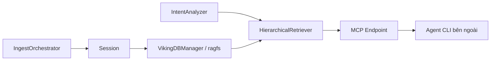
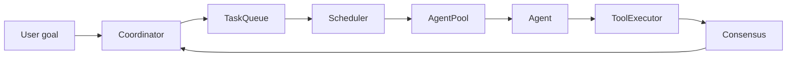
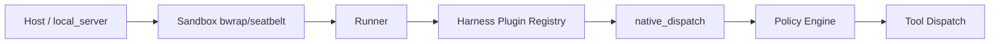
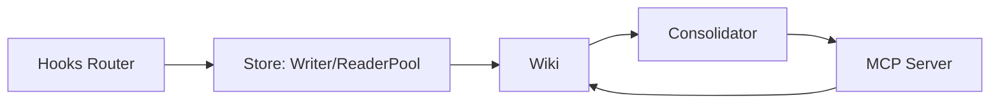

# Báo cáo nghiên cứu: Repo GitHub "Agentic AI" nổi bật (14–21/08/2026)

**Tóm tắt điều hành:**

- Trong tuần 14–21/08/2026, bốn repo mã nguồn mở nổi bật nhất về hạ tầng agentic AI đều **không phải là "thêm một agent framework mới"** mà là các lớp hạ tầng chuyên biệt bao quanh agent: context/memory database (OpenViking), multi-agent orchestration runtime (open-multi-agent), meta-harness điều phối nhiều coding-agent CLI kèm policy/sandbox (Omnigent), và bộ nhớ dài hạn dạng wiki git-versioned cho agent CLI (ai-memory).
- Điểm chung đáng chú ý: cả bốn đều có **eval/benchmark hoặc CI/test evidence cụ thể trong repo** (OpenViking công bố số liệu LoCoMo/tau2-bench; open-multi-agent có eval-gate trong CI; Omnigent có harness-bench; ai-memory có crate `evals/` riêng) — cho thấy xu hướng "production-grade engineering" đang lấn át các framework trình diễn thuần túy.
- Rủi ro chung cần lưu ý: bề mặt bảo trì rất lớn do phải theo kịp nhiều CLI/vendor bên thứ ba (OpenViking, Omnigent, ai-memory đều tích hợp 10–20+ harness khác nhau), một số dự án còn ở giai đoạn alpha (Omnigent), và phần lớn số liệu benchmark là tự công bố bởi tác giả, chưa có xác nhận độc lập.

## Mục lục
- [volcengine/OpenViking](#volcengineopenviking)
- [open-multi-agent/open-multi-agent](#open-multi-agentopen-multi-agent)
- [omnigent-ai/omnigent](#omnigent-aiomnigent)
- [akitaonrails/ai-memory](#akitaonrailsai-memory)

---

## volcengine/OpenViking

**Link:** https://github.com/volcengine/OpenViking (đã verify HTTP 200, ~31.2k sao)

### §1 Quick Context
Context database biến memory/resource/skill của agent thành một virtual filesystem `viking://` với tải theo 3 tầng (L0/L1/L2) thay vì vector search "hộp đen". Stack: Python (FastAPI server, SDK) + Rust (`crates/ragfs` — engine filesystem/index lõi, cache Redis/Mooncake) + C++ (native vector backend) + TypeScript (web-studio). Dùng litellm để nói chuyện với Volcengine Ark, OpenAI, Kimi, GLM, Ollama. License AGPLv3. Sức khỏe repo: ~31,2k sao, có Trendshift badge, ~20 GitHub Actions workflow (CI, CodeQL, docs, publish riêng biệt), thư mục `tests/` rất lớn (unit/integration/api/benchmark), commit gần nhất chính là hôm nay (21/08/2026), nhịp độ nhiều commit/ngày.

### §2 Architecture Deep-Dive
**A. Component inventory**
- `HierarchicalRetriever` (`openviking/retrieve/hierarchical_retriever.py`) — retrieval engine: tìm dense+sparse ở cấp thư mục trước, drill-down theo `DIRECTORY_DOMINANCE_RATIO`, hội tụ tối đa `MAX_CONVERGENCE_ROUNDS` vòng.
- `IntentAnalyzer` (`openviking/retrieve/intent_analyzer.py`) — phân tích ý định truy vấn trước khi retrieve.
- `Session` (`openviking/session/session.py`) — quản lý phiên, tích hợp hội thoại vào hệ L0/L1/L2, có `auto_commit_policy.py`.
- `IngestOrchestrator` (`openviking/ingest/orchestrator.py`) + `poller.py` — backfill/replay log phiên từ nhiều nguồn.
- `MCP endpoint` (`openviking/server/mcp_endpoint.py`) — expose tool filesystem/retrieval/memory qua MCP, mount trên FastAPI tại `/mcp`.
- `VikingDBManager` (`openviking/storage/vikingdb_manager.py`) — quản lý vector DB backend.
- `ragfs` core (Rust) (`crates/ragfs/src/core`, `lock`, `cache`, `git`, `multibackend`) — engine filesystem ảo phía dưới `viking://`.
- `RerankClient`/`Embedder` (`openviking/models/rerank`, `openviking/models/embedder`) — model hóa bước embedding + rerank.

**B. Control flow pattern:** Đây không phải một agent loop độc lập mà là một **pipeline retrieval-augmented sự kiện** (event-driven ingest + hierarchical RAG) cắm vào agent CLI bên ngoài qua hook/MCP. Happy path: (1) Agent CLI phát sinh hội thoại/tool call, module ingest ghi lại trajectory; (2) khi session kết thúc/auto-commit, `Session` bất đồng bộ trích xuất preference + kinh nghiệm agent, ghi vào cây `viking://` theo 3 tầng; (3) khi cần ngữ cảnh, agent gọi qua MCP (`ov find`/`ov grep`), `IntentAnalyzer` phân tích truy vấn; (4) `HierarchicalRetriever` tìm top-k thư mục toàn cục rồi drill-down đệ quy; (5) `RerankClient` xếp hạng lại kết quả; (6) nội dung tải dần L0→L1→L2 theo ngân sách token, trajectory truy xuất được lưu để debug.

**C. State & data flow:** Message dùng dataclass Part kiểu (`TextPart`, `ContextPart`, `ImagePart`, `ToolPart` — `openviking/message/part.py`), không phải chuỗi thô. Lưu trữ: `VikingDBManager` (vector DB) + `ragfs` (Rust filesystem ảo, backend TOS/S3, cache Redis/Mooncake). Quản lý cửa sổ ngữ cảnh: tải theo tầng L0/L1/L2 kết hợp cắt token theo ngân sách (`truncate_text_to_token_budget`).

**D. Tool/capability integration:** MCP server expose tool có sẵn; `core/mcp_converter.py` chuyển định nghĩa MCP tool bên ngoài thành định dạng "Skill" (markdown + YAML frontmatter) để lưu trong cây viking://. Có plugin riêng cho Claude Code, Codex, Cursor, OpenClaw, OpenCode, TRAE, pi (`agent-plugins/`, `examples/*-memory-plugin`).

**E. Memory architecture:** Ngắn hạn = message/turn trong session (`retention.py`, `tool_result_store.py`); dài hạn = cây memories/skills, trích xuất bất đồng bộ sau khi commit session. Truy xuất: hybrid dense+sparse vector + rerank + drill-down theo thư mục (không phải top-k vector thuần).

**F. Model orchestration:** Embedder/rerank/VLM tách riêng, pluggable qua litellm (đa provider). Không thấy phân vai model lớn/nhỏ theo role — "không xác định từ code".

**G. Observability & eval:** Module `observability/` riêng (trace bridge, middleware), module `eval/` với tích hợp ragas + recorder + benchmark suite công bố (LoCoMo, tau2-bench, skillsbench).

**H. Extension points:** SDK Go/Python/TypeScript, tích hợp LangChain, MCP client tổng quát, loạt RFC thiết kế trong `docs/design/`.

### §3 Architecture Diagram

### §4 Verdict
Điểm mới thực sự cụ thể: trừu tượng hóa "filesystem-làm-context-database" (`viking://`) thay cho vector DB hộp đen, cùng cơ chế tải 3 tầng L0/L1/L2 và ngưỡng "directory dominance ratio" để drill-down đệ quy có kiểm soát; benchmark công bố cụ thể (LoCoMo accuracy 24–57% → 80–83%, giảm 34–91% token, giảm 58–66% latency trên 3 harness khác nhau) là một eval methodology thật, không chỉ marketing suông. Red flags: AGPLv3 (copyleft) có thể cản trở dùng thương mại; hệ thống trải 4 ngôn ngữ (Python/Rust/C++/TS) khó audit toàn bộ; phụ thuộc nặng hạ tầng Volcengine (TOS/Ark) dù gắn mác "open source"; số liệu benchmark tự công bố, chưa có bên thứ ba tái lập. Câu hỏi mở: ngưỡng dominance ratio có tổng quát hóa ngoài domain đã benchmark không; chi phí đồng bộ L0/L1/L2 khi nội dung cập nhật liên tục; cơ chế giải quyết xung đột khi nhiều agent (`peers/`) ghi đồng thời chưa rõ từ code cấp cao.

---

## open-multi-agent/open-multi-agent

**Link:** https://github.com/open-multi-agent/open-multi-agent (đã verify HTTP 200, ~6.8k sao)

### §1 Quick Context
Framework điều phối multi-agent TypeScript theo triết lý "describe the goal, not the graph" — coordinator tự lập kế hoạch DAG lúc chạy thay vì đồ thị hard-code như LangGraph. Stack: TypeScript/Node ≥20, npm packages (`@open-multi-agent/core`, `otel`, `create-oma-app`), hỗ trợ 12+ LLM adapter (OpenAI, Anthropic, Bedrock, Azure, Gemini, DeepSeek, Doubao, Grok, Hunyuan, MiniMax, Qiniu, Copilot) + AI SDK + ACP backend cho Claude Code/Gemini CLI/Codex. MIT license. Sức khỏe: ra mắt 01/04/2026, ~6,8k sao, CI (GitHub Actions + Codecov), thư mục `tests/` với >100 file test, commit đều đặn 16–20/08/2026.

### §2 Architecture Deep-Dive
**A. Component inventory**
- `Coordinator` (`packages/core/src/orchestrator/coordinator.ts`) — phân rã mục tiêu, dựng prompt điều phối, parse task-spec, pass tổng hợp kết quả cuối.
- `OpenMultiAgent`/Orchestrator (`packages/core/src/orchestrator/orchestrator.ts`) — lớp tổng kết nối Team/TaskQueue/Scheduler/AgentPool/Agent.
- `Scheduler` (`packages/core/src/orchestrator/scheduler.ts`) — 5 chiến lược: round-robin, least-busy, capability-match, dependency-first (mặc định), composite.
- `TaskQueue` (`packages/core/src/task/queue.ts`) — hàng đợi công việc có phụ thuộc.
- `AgentPool` (`packages/core/src/agent/pool.ts`) — pool thực thi có giới hạn đồng thời.
- `Agent` (`packages/core/src/agent/agent.ts`) — vòng lặp hội thoại + gọi tool của từng agent.
- `Team` (`packages/core/src/team/team.ts`) — danh sách agent, memory chung, messaging (`messaging.ts`).
- `ToolExecutor`/`ToolRegistry` (`packages/core/src/tool/executor.ts`, `framework.ts`) — thực thi tool song song có semaphore, validate input/output bằng Zod, có approval gate.
- `SharedMemory` (`packages/core/src/memory/shared.ts`) — KV namespace theo `<agentName>/<key>`, agent nào cũng đọc được.
- `Consensus` (`packages/core/src/orchestrator/consensus.ts`) — xác minh đa agent (mode refute/lens, quorum, xử lý bất đồng).
- `ExecutionRouter` (`packages/core/src/orchestrator/execution-router.ts`) — định tuyến task tới backend process/ACP hay LLM agent.

**B. Control flow pattern:** **Coordinator/planner-executor với DAG động** — không phải đồ thị cố định khai báo trước mà coordinator sinh DAG lúc runtime. Happy path: (1) gọi `oma.runTeam(team, goal)`; (2) coordinator (agent tạm) nhận goal + roster, sinh JSON phân rã task, validate bằng schema Zod; (3) task nạp vào `TaskQueue` có dependency, `Scheduler` (mặc định dependency-first) gán task sẵn sàng cho agent theo độ khớp năng lực; (4) `AgentPool` chạy song song có giới hạn, mỗi `Agent` dùng `ToolExecutor` (default-deny, có approval gate cho hành động rủi ro); (5) kết quả có thể qua `Consensus` (nhiều judge, vòng refute/lens) trước khi đánh dấu hoàn tất, ghi vào `SharedMemory`; (6) coordinator tổng hợp câu trả lời cuối, trace lưu lại cho Run Viewer replay.

**C. State & data flow:** Task là interface TypeScript có kiểu (title/description/assignee/dependsOn/verify…), message giữa agent dùng `MessageBusSnapshot`/role kiểu union — schema có kiểu, không phải chuỗi thô. Lưu trữ: `InMemoryStore` mặc định, có `file-store.ts` pluggable qua interface `MemoryStore`; checkpoint (`memory/checkpoint.ts`) cho phép resume. Quản lý ngữ cảnh: `ContextStrategy` pluggable (nén diff theo token, theo `docs/context-management.md`).

**D. Tool/capability integration:** Native function-calling qua adapter LLM theo provider; có `text-tool-extractor.ts` làm fallback parser cho model local trả tool call dạng text; hỗ trợ MCP (`tool/mcp.ts`); built-in tool (bash, file_*, grep) chạy qua shell executor; validate Zod; tool mặc định default-deny với gate phê duyệt (`approval/`).

**E. Memory architecture:** SharedMemory namespace theo agent + checkpoint/resume; không thấy cơ chế vector/embedding retrieval dài hạn ở tầng surface — "không xác định từ code" cho long-term memory dạng vector.

**F. Model orchestration:** 12+ adapter LLM, `reasoning-fallback.ts` cho fallback, `egress.ts` áp policy mạng ra ngoài, `docs/model-routing.md` mô tả định tuyến model theo task; song song hóa qua `AgentPool.maxConcurrency`.

**G. Observability & eval:** Module observability riêng (trace runtime, execution receipt, routing-decision record, batching) + package OTel adapter tùy chọn; module eval với EvalSet/EvalCase, LLM-judge scorer, eval-gate chạy trong CI (`eval-gate.ts`); dashboard offline Run Viewer replay DAG + span waterfall.

**H. Extension points:** `defineTool` cho tool tùy biến, custom `ContextStrategy`, custom Coordinator, ACP backend để gắn CLI agent ngoài (Claude Code, Gemini CLI, Codex) làm thành viên team.

### §3 Architecture Diagram

### §4 Verdict
Điểm mới cụ thể: sinh DAG lúc runtime từ mục tiêu thay vì bắt buộc khai báo đồ thị tay (khác biệt rõ với LangGraph); cơ chế Consensus (refute/lens, quorum) được xây sẵn như primitive điều phối chứ không phải add-on; mô hình bảo mật tool default-deny + durable approval + checkpoint/resume + eval-gate trong CI là bộ tính năng hướng production khá hiếm với một framework mới ~4 tháng tuổi. Red flags: nhiều "Built with OMA" trong README là dự án phụ ít sao, tự báo cáo, chưa kiểm chứng độc lập; việc coordinator tự sinh JSON DAG khiến kết quả có thể không tất định giữa các lần chạy — độ bền của cơ chế repair/validate khi model trả JSON sai lệch chưa rõ ở quy mô lớn; hỗ trợ 12+ provider LLM tạo gánh nặng bảo trì đáng kể. Câu hỏi mở: cơ chế "freeze plan"/replay xử lý ra sao khi coordinator cho kết quả khác nhau giữa các phiên bản model; overhead token/cost thực tế của chính bước lập kế hoạch + tổng hợp; Consensus có thực sự bắt được kết quả hallucination hay chỉ tăng chi phí.

---

## omnigent-ai/omnigent

**Link:** https://github.com/omnigent-ai/omnigent (đã verify HTTP 200, ~9.1k sao)

### §1 Quick Context
"Meta-harness" mã nguồn mở tạo lớp điều phối chung trên nhiều coding-agent CLI (Claude Code, Codex, Cursor, OpenCode, Hermes, Pi…), thêm policy enforcement, sandbox, đa thiết bị. Stack: Python 3.12+ (uv), web/desktop app TypeScript (Electron, iOS/Android), Apache 2.0, hỗ trợ triển khai cloud sandbox (Modal, E2B, Daytona, Kubernetes, Databricks…). Sức khỏe: ~9,1k sao, 1,4k fork, 2731 commit, 498 issue mở/609 PR mở, gắn nhãn **alpha**; CI (`ci.yml`, `benchmark.yml`, `code-coverage.yml`), thư mục `tests/` rất lớn song song với `omnigent/`.

### §2 Architecture Deep-Dive
**A. Component inventory**
- Harness plugin registry (`omnigent/harness_plugins.py`) — đăng ký động harness (chuỗi import string, không callable trực tiếp), hỗ trợ harness built-in + community qua entry point `omnigent.community.harness`.
- Native dispatch (`omnigent/native_dispatch.py`) — resolver lười biến chuỗi import path thành callable đúng lúc gọi (resume/CLI/launch/interrupt).
- Policy engine (`omnigent/policies/base.py`) — lớp trừu tượng `Policy.evaluate()`, hai loại cụ thể `FunctionPolicy`/`PromptPolicy`; chồng cấp server/agent/session.
- Sandbox backends (`omnigent/sandbox/bwrap.py`, `seatbelt.py`) — bubblewrap (Linux) / seatbelt (macOS) đăng ký theo nền tảng.
- Runner (`omnigent/runner/app.py`, `tool_dispatch.py`, `mcp_manager.py`, `turn_routing.py`) — tiến trình runner mỗi session quản lý tool dispatch, MCP server, định tuyến lượt.
- Host/daemon (`omnigent/host/local_server.py`, `daemon_launch.py`, `runner_zygote.py`) — host sinh "zygote" runner sandbox hóa.
- Model catalog/resolver (`omnigent/model_catalog.py`, `model_resolver.py`, `model_fallbacks.py`, `smart_routing_cli.py`) — chọn/fallback model đa provider, kể cả Databricks AI Gateway.
- Telemetry (`omnigent/telemetry/events.py`, `client.py`) — sự kiện usage có cấu trúc gửi về gateway.

**B. Control flow pattern:** **Meta-orchestrator giám sát harness ngoài** (hierarchical supervisor bao bọc các agent loop độc lập của bên thứ ba) — không tự chạy vòng ReAct riêng mà multiplex/giám sát các CLI đã có agent loop sẵn. Happy path: (1) người dùng chọn/khôi phục session qua CLI/web/mobile, request tới `host/local_server.py`; (2) host sinh runner sandbox hóa (bwrap/seatbelt) qua harness registry; (3) `native_dispatch` resolve bridge riêng cho harness (vd. `claude_native_bridge.py`), chuyển lượt người dùng; (4) trước mỗi hành động rủi ro, policy engine đánh giá theo cấu hình server/agent/session — cho phép, chặn hoặc dừng chờ duyệt; (5) tool call qua `runner/tool_dispatch.py`/`mcp_manager.py` hoặc giao diện tool gốc của harness; (6) telemetry + chi phí (`cost_plan.py`) được ghi, trạng thái session đồng bộ đa thiết bị.

**C. State & data flow:** Session state qua `omnigent/db`, `omnigent/stores` — schema chi tiết "không xác định từ code" ở mức scan này. Quản lý cửa sổ ngữ cảnh: "không xác định từ code" — có vẻ giao lại cho compaction nội tại của từng harness gốc (vd. Claude Code tự nén).

**D. Tool/capability integration:** Bọc lại tool-calling *gốc* của mỗi harness (bằng chứng: các file `claude_native_forwarder.py`, `codex_native_app_server.py`, `opencode_native_client.py`…) thay vì tự cài lại; có MCP manager riêng (`runner/mcp_manager.py`, `proxy_mcp_manager.py`) để tiêm/proxy MCP server vào bất kỳ harness nào; sandbox hóa qua bwrap/seatbelt theo cấu hình YAML.

**E. Memory architecture:** Không phát hiện module long-term memory chuyên biệt ở cấp cao — "không xác định từ code, có thể phụ thuộc vào bộ nhớ riêng của từng harness".

**F. Model orchestration:** Catalog/resolver/fallback đa provider, "smart routing" CLI, tích hợp Databricks AI Gateway.

**G. Observability & eval:** Telemetry hướng usage-analytics (không rõ có phải distributed tracing kiểu OTel không); có `dev/benchmarks`, `dev/loadtest`, `docs/harness-bench-design.md` và `tests/harness_bench` — benchmark so sánh năng lực giữa các harness.

**H. Extension points:** `docs/extending/sandbox_providers.md` — plugin interface thêm sandbox provider; agent tùy biến khai báo qua YAML (`docs/AGENT_YAML_SPEC.md`); policy pluggable qua `type: function` + `handler:` dotted path.

### §3 Architecture Diagram

### §4 Verdict
Điểm mới cụ thể: coi chính "harness" là đơn vị pluggable — thay vì viết thêm một agent loop, Omnigent là lớp giám sát có thể hoán đổi/kết hợp Claude Code, Codex, Cursor… trong cùng một session, áp policy và sandbox đồng nhất bất kể harness bên dưới; mô hình policy 3 tầng (server/agent/session) khai báo qua YAML là thiết kế guardrail cụ thể, có thể kiểm chứng (không chỉ prompt mềm). Red flags: gắn nhãn alpha rõ ràng với 498 issue mở; số lượng file `*_native_*.py` riêng cho từng harness rất lớn → bề mặt bảo trì cao, dễ vỡ khi CLI vendor đổi giao thức nội bộ; gửi telemetry usage về gateway mặc định (chưa xác minh rõ mức độ opt-out từ lần scan này); không có hệ memory dài hạn tích hợp sẵn. Câu hỏi mở: policy engine xử lý ra sao khi rule server và session xung đột dưới điều kiện đồng thời; sandbox có được áp dụng nhất quán trên các target cloud (Modal/E2B…) hay chỉ local; các bridge native có theo kịp tốc độ cập nhật của CLI thượng nguồn (đặc biệt Claude Code) hay không.

---

## akitaonrails/ai-memory

**Link:** https://github.com/akitaonrails/ai-memory (đã verify HTTP 200, ~3.7k sao)

### §1 Quick Context
Bộ nhớ dài hạn dùng chung khi chuyển đổi giữa các coding-agent CLI khác nhau, lưu dưới dạng wiki markdown được versioning bằng git ("compile, don't retrieve"). Stack: Rust (binary đơn, workspace nhiều crate), SQLite (FTS5 + entity + graph-neighbor + vector tùy chọn), MCP server, MIT license. Sức khỏe: ~3,7k sao, commit gần như hàng ngày (19–20/08/2026), CI đa nền tảng (`ci.yml`, `nix.yml`, `release.yml`, `secret-scan.yml`, `windows.yml`), có crate `evals/` riêng dành cho đánh giá.

### §2 Architecture Deep-Dive
**A. Component inventory**
- `Wiki` (`crates/ai-memory-wiki/src/wiki.rs`) — kho trang markdown có chuỗi supersession (versioning append, không ghi đè), kiểm soát admission (`admission.rs`), file watcher.
- `ReaderPool`/`WriterHandle` (`crates/ai-memory-store/src/reader.rs`, `writer.rs`) — pool đọc SQLite chế độ WAL + một writer actor duy nhất; truy vấn FTS5 (`fts_query.rs`); decay theo thời gian (`decay.rs`).
- Hooks router (`crates/ai-memory-hooks/src/router.rs`) — nạp sự kiện lifecycle hook (SessionStart/PostToolUse…), `capture_policy.rs` lọc sự kiện trước khi vào lưu trữ.
- `Consolidator` (`crates/ai-memory-consolidate/src/consolidator.rs`) — đọc log observation của session, gọi LLM cấu hình để sinh `ConsolidatedPage`, ghi lại qua Wiki.
- Auto-improve loop (`crates/ai-memory-consolidate/src/auto_improve.rs`, `auto_improve_schedule.rs`) — rà soát/viết lại trang wiki nền định kỳ, có thể qua eval-gate trước khi tự duyệt.
- MCP server (`crates/ai-memory-mcp/src/server.rs`) — expose tool `memory_query`/`memory_write_page`/`memory_consolidate`/`memory_handoff_accept`.
- Workstream (`crates/ai-memory-core/src/workstream.rs`) — sổ liên tục cross-harness để resume session giữa các CLI khác nhau.

**B. Control flow pattern:** **Pipeline hook-driven, sự kiện** (không phải agent loop) — cắm vào agent CLI ngoài qua hook + MCP tool. Happy path theo `docs/ARCHITECTURE.md`: (1) CLI agent phát sự kiện lifecycle (SessionStart, UserPromptSubmit, PostToolUse, SessionEnd…), lệnh native `ai-memory hook` spool cục bộ có idempotency key; (2) hook router sanitize payload, phân loại `ObservationKind`, đẩy `WriteCmd` cho writer actor duy nhất; (3) khi SessionEnd thật sự, server sinh trang tóm tắt rule-based (không LLM) + mở `Handoff` trong một transaction SQLite, auto-commit wiki qua git; (4) nếu cấu hình `AI_MEMORY_LLM_PROVIDER`, `Consolidator` viết lại tóm tắt thành trang chi tiết hơn bằng LLM, ghi qua Wiki với chuỗi supersession; (5) session tiếp theo đọc `Handoff` đang chờ qua MCP tool hoặc hook injection, nhận khối "where you left off" giới hạn kích thước; (6) scheduler auto-improve nền định kỳ rà soát session đã hoàn tất, đề xuất chỉnh sửa wiki, có thể phải qua eval-gate của dự án trước khi tự duyệt.

**C. State & data flow:** Payload sự kiện dạng JSON qua `POST /hook` hoặc lệnh native spool; lưu trữ: markdown là nguồn sự thật + git versioning + SQLite là index dẫn xuất (FTS5 + entity + link-neighbor + vector tùy chọn) — retrieval hybrid rõ ràng. Quản lý ngữ cảnh: giới hạn kích thước observation (prompt 16KiB, tool excerpt 2KB, backstop 16KiB) — một dạng compaction/truncation, cộng triết lý "compile, don't retrieve" thay vì RAG thuần.

**D. Tool/capability integration:** MCP tool (`memory_query`, `memory_write_page`, `memory_consolidate`, `memory_handoff_accept`) — function-calling native qua MCP; ngoài ra lifecycle hook (shell script + lệnh native) tích hợp riêng cho 20+ harness (Claude Code, Codex, Cursor, Gemini CLI, Kimi Code, Kiro CLI…). Không có sandbox riêng vì đây là kho lưu trữ bị động, không thực thi tool.

**E. Memory architecture:** Đây chính là hệ memory — ngắn hạn: log observation theo session (sự kiện spooled); dài hạn: trang wiki markdown có supersession, log episodic decay theo thời gian, khái niệm semantic tích lũy dần. Truy xuất: hybrid SQLite FTS5 + entity lexical + graph-neighbor + vector tùy chọn (provider: OpenAI, Voyage, Gemini, Ollama/LM Studio/vLLM).

**F. Model orchestration:** LLM chỉ dùng cho consolidation/auto-improve (tùy chọn, qua crate `ai-memory-llm` trừu tượng hóa Anthropic/OpenAI/Copilot/Gemini); tóm tắt session mặc định là rule-based (không LLM) — LLM là lớp nâng cấp tùy chọn chứ không phải core dependency.

**G. Observability & eval:** Crate `evals/` riêng cùng fixture để đánh giá chất lượng consolidation/retrieval; auto-improve có `auto_improve_telemetry.rs` tổng hợp số liệu, và có thể chạy executable eval-gate do dự án cung cấp trước khi staging đề xuất chỉnh sửa — cơ chế eval-hook gắn trực tiếp vào quyền ghi.

**H. Extension points:** File marker `.ai-memory.toml` override cấu hình theo dự án; LLM/embedding provider pluggable; crate companion (`companions/ai-memory-importer`) để nhập dữ liệu từ công cụ khác (agentmemory, basic-memory, cognee, mempalace — có tài liệu phân tích cạnh tranh rõ ràng trong `docs/research-*.md`).

### §3 Architecture Diagram

### §4 Verdict
Điểm mới cụ thể: triết lý "compile, don't retrieve" — cố tình từ chối vector-DB-mặc-định để dùng wiki markdown versioned bằng git với SQLite chỉ là index dẫn xuất, tóm tắt session mặc định rule-based (không LLM), LLM chỉ là lớp nâng cấp tùy chọn — thiết kế thận trọng, dễ audit hơn hẳn phần lớn công cụ memory dạng vector-RAG; tài liệu `docs/research-*.md` cho thấy có nghiên cứu cạnh tranh nghiêm túc trước khi thiết kế. Chú ý kỹ thuật đáng khen: kích thước observation giới hạn rõ ràng, xử lý at-least-once với idempotency key, một writer actor + reader pool WAL cho thấy quan tâm đúng đắn tới tính đúng đắn khi crash/replay. Red flags: repo mang phong cách một tác giả chính (đường dẫn tên tác giả) — rủi ro bus-factor dù nhịp commit cao; ma trận hỗ trợ 20+ CLI là gánh nặng bảo trì tương tự Omnigent; auto-improve/consolidation bằng LLM tự duyệt đề xuất mặc định (`require_approval=false`) có thể âm thầm làm hỏng wiki bằng nội dung hallucinate nếu không cấu hình eval-gate. Câu hỏi mở: xung đột được giải quyết ra sao khi nhiều session đồng thời ghi cùng một trang (ngữ nghĩa chuỗi supersession dưới concurrency); chưa có số liệu benchmark định lượng công khai kiểu LoCoMo/tau2 của OpenViking — "không xác định từ code" về độ chính xác retrieval thực tế.
