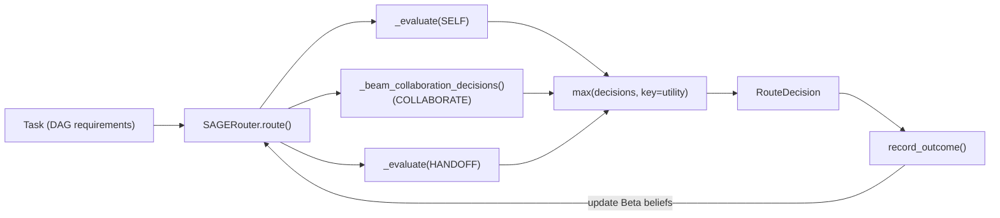
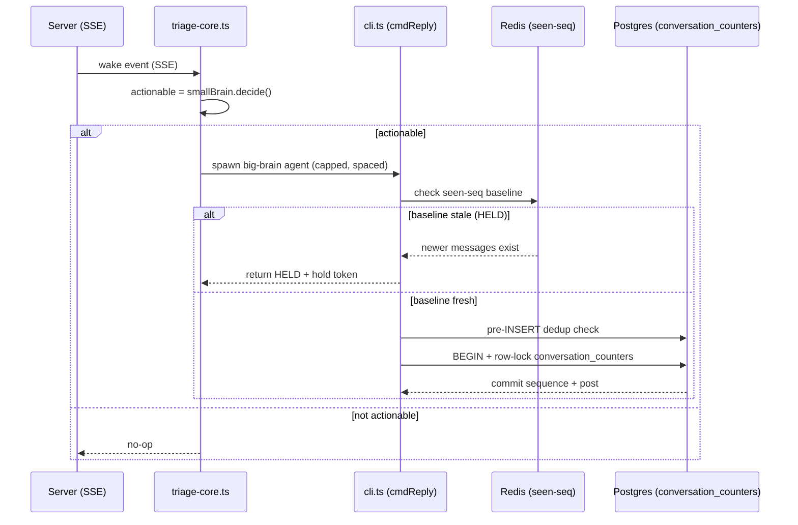
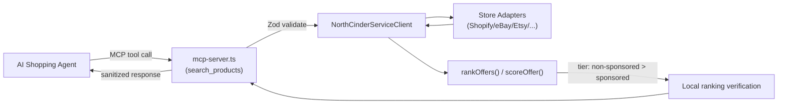

# Weekly Agentic AI Scan — 2026-08-22

**Nguồn**: GitHub search (`created:>2026-08-15 stars:>100`, mở rộng `pushed:>2026-08-15 stars:>500`), lọc loại awesome-list, tutorial, fork, repo <500 LOC.

## Executive Summary

- Tuần này nổi bật nhất là **[Sprix SAGE Router](#sprix-sage-router)** — một nghiên cứu định tuyến agent-to-agent với utility function tường minh (SELF/COLLABORATE/HANDOFF) thay vì heuristic rời rạc, đáng đọc cho ai làm orchestration layer.
- **[Cumora](#cumora)** giải quyết vấn đề engineering khó và ít được nói tới: race-condition giữa nhiều agent cùng đọc chung một conversation — cơ chế phòng thủ nhiều lớp (freshness preflight, row-lock dedup, hold token) là case study tốt về concurrency trong multi-agent thật.
- **[NorthCinder](#northcinder)** đáng chú ý vì threat model rõ ràng (chống thao túng ranking bởi sponsored listing) hơn là vì kỹ thuật agent — phù hợp cho ai quan tâm "trustworthy AI agent" pattern.
- **[OpenBot](#openbot)** là production platform (policy gateway, audit trail, multi-framework) nhưng phần lõi orchestration nằm sau code chưa fetch được đầy đủ trong lần scan này.

## Mục lục
- [Sprix SAGE Router](#sprix-sage-router)
- [OpenBot](#openbot)
- [Cumora](#cumora)
- [NorthCinder](#northcinder)

---

## Sprix SAGE Router

**Repo**: [wang2122/sprix-sage-router](https://github.com/wang2122/sprix-sage-router)

### §1 — Quick Context
Router tri-mode (SELF/COLLABORATE/HANDOFF) cho mạng agent, dựa trên một utility function duy nhất thay vì nhiều heuristic tách rời. Stack: Python 3.10+, không có runtime dependency, không dùng LLM/neural net — thuần thuật toán (Bayesian belief + logistic regression). Repo health: ~1,000 stars, 14 commits, 0 open issues, có CI ("Tests" badge), tự nhận là "early-stage research preview, not production".

### §2 — Architecture Deep-Dive

**A. Component inventory**
- `SAGERouter` (`sprix_sage.py`) — orchestrator trung tâm, giữ registry agent và các model đã học.
- `Task` / `Agent` / `ExecutionState` (`sprix_sage.py`) — cấu trúc dữ liệu mô tả yêu cầu (DAG dependency), năng lực agent, và trạng thái thực thi hiện tại.
- `RouteDecision` (`sprix_sage.py`) — output của một lần định tuyến: mode, agents, utility score, xác suất thành công.
- `OnlineSuccessModel` (`sprix_sage.py`) — logistic regression online, dự đoán xác suất thành công từ coverage/trust/synergy/losses.
- `BetaBelief` per-agent (`sprix_sage.py`, trong `self.reliability`, `self.skill_reliability`, `self.cost_fidelity`, `self.latency_fidelity`) — trust theo mô hình Bayesian Beta distribution.
- `benchmark.py`, `demo.py`, `test_sprix_sage.py` — benchmark suite, demo chạy thử, unit test.

**B. Control flow — Utility-maximization search (không phải ReAct, không phải state machine)**
1. Nhận `Task` mới, lọc `eligible` agents theo permission/khả dụng.
2. Nếu incumbent agent còn eligible → đánh giá option SELF.
3. Chạy `_beam_collaboration_decisions()` để mở rộng team COLLABORATE (beam search, mỗi vòng thêm 1 agent, giữ top `beam_width`).
4. Với mỗi agent khác incumbent → đánh giá option HANDOFF.
5. Gộp tất cả `RouteDecision` ứng viên, chọn `max(decisions, key=utility)`.
6. Sau khi task thực thi xong, `record_outcome()` cập nhật các Beta belief (trust, cost/latency fidelity) — vòng lặp học online cho lần route tiếp theo.

**C. State & data flow**
- Message/state format: object Python thuần (`Task`, `Agent`, `ExecutionState`), không phải dict tự do hay JSON schema.
- State storage: hoàn toàn in-memory, instance-level dict trên `SAGERouter` — không có DB/Redis, không phân tán, single-process.
- Không có context-window management vì đây không phải LLM-driven — không xác định từ code (không áp dụng).

**D. Tool / capability integration**
- Không xác định từ code — repo không có cơ chế "tool calling" theo nghĩa LLM function-calling; "capability" ở đây là skill-matching giữa `Agent.skills` và `Task` requirement DAG, xử lý thuần thuật toán.

**E. Memory architecture**
- Không có long-term memory truyền thống. Có "belief persistence": `self.reliability`, `self.skill_reliability`, `self.synergy` tồn tại xuyên suốt lifetime của router instance, cập nhật liên tục qua `record_outcome()` — về bản chất là một dạng learned long-term state nhưng không phải memory theo nghĩa RAG/vector.

**F. Model orchestration**
- Không dùng LLM. "Model" ở đây là `OnlineSuccessModel` — logistic regression với adaptive learning rate và L2 regularization, dự đoán xác suất thành công cho một route candidate. Không có phân vai frontier-model/small-model.

**G. Observability & eval**
- `benchmark.py` (31,895 bytes) — bộ benchmark synthetic 2,500 task, so sánh Online SAGE (quality 0.634) với incumbent-only (0.507). Tác giả tự ghi nhận đây "không phải bằng chứng real-world". Không thấy OpenTelemetry/Langfuse hay tracing — không xác định từ code ngoài benchmark suite.

**H. Extension points**
- Không xác định từ code trong nội dung đã đọc — README có nêu roadmap thêm A2A protocol adapter và learned embeddings nhưng chưa có trong code hiện tại.

### §3 — Architecture Diagram

### §4 — Verdict
**Novel**: gộp 3 chế độ điều phối vào một utility function duy nhất, có thể so sánh apple-to-apple thay vì if/else heuristic rời rạc — đây là điểm thiết kế đáng học nhất, kể cả khi không dùng LLM. Cách tách "global trust" và "skill-specific trust" theo trọng số 0.35/0.65 cũng là một chi tiết engineering cụ thể đáng tham khảo.
**Red flags**: tự nhận là nghiên cứu, chưa production; benchmark chỉ synthetic; state hoàn toàn in-memory nên không scale multi-process/multi-node hiện tại.
**Câu hỏi mở**: utility weights (`self.weights.cost/latency/risk/...`) được tune thế nào trong thực tế? Beam search với `max_collaborators` lớn sẽ scale ra sao về độ phức tạp?

---

## OpenBot

**Repo**: [CopilotKit/OpenBot](https://github.com/CopilotKit/OpenBot)

### §1 — Quick Context
Platform "AI coworker" tự host: mỗi bot chạy trong máy tính riêng (browser + file + tool có kiểm soát), gateway policy quyết định quyền truy cập. Stack: TypeScript/Bun monorepo (`app`, `server`, `worker`), React/Vite UI, Hono API, PostgreSQL+pgvector, Docker; hỗ trợ agent framework ngoài (LangGraph, Mastra, CrewAI) qua AG-UI protocol. Repo health: 2.2k stars, 84 commits, CI badge xanh (GitHub Actions `ci.yml`), 11 open issues, MIT license — do CopilotKit (công ty dev tools đã có sản phẩm khác) duy trì.

### §2 — Architecture Deep-Dive

**A. Component inventory**
- `app/` — React/Vite frontend, port 3010 (theo README).
- `server/` — Hono API server, port 3001; chứa `drizzle/` cho DB schema/migration Postgres+pgvector.
- `agent-bot/` — implementation của bot agent orchestration.
- `agent-computer/` — "computer" cô lập cho mỗi bot: screen capture, shell command, workspace, port 4100.
- `agent-langgraph/` — tích hợp LangGraph làm một trong các agent framework khả dụng.
- Example bots, port 4200–4201; supervisor component, port 4500 (theo README, chưa xác định path file cụ thể trong lần scan này).
- `app/src/lib/copilot/` — lớp tích hợp AI/tool trên frontend.
- `app/src/lib/plugins/` — hệ thống plugin.

**B. Control flow — Isolated-worker + policy gateway (không phải ReAct loop đơn lẻ)**
1. Người dùng cấu hình bot, gán quyền truy cập tool/tài nguyên qua policy (CEL rules, theo README).
2. Mỗi bot khởi chạy trong container riêng ("computer") với browser/login/file system độc lập — `agent-computer`.
3. Bot dùng framework agent bên ngoài (LangGraph/Mastra/CrewAI...) giao tiếp qua AG-UI protocol.
4. Mọi hành động (được phép, bị từ chối, hoặc lỗi) đi qua gateway và được ghi vào audit trail trước/trong khi thực thi.
5. Con người có thể override/can thiệp khi bot cần hỗ trợ ("human override capability").
Đây là kiến trúc **policy-gated isolated worker**, gần với mô hình "mỗi agent = một máy ảo có scope quyền hạn", không phải single-loop ReAct.

**C. State & data flow**
- Persistence: PostgreSQL + pgvector (theo README) — không xác định rõ từ code liệu pgvector dùng cho RAG hay chỉ lưu embedding phụ trợ.
- Message format giữa components: không xác định từ code trong phạm vi đã fetch (chỉ có README + package.json, chưa đọc source AG-UI integration).
- Credential: "encrypted credential storage that never appears in transcripts" — cơ chế cụ thể không xác định từ code đã đọc.

**D. Tool / capability integration**
- Policy-driven qua CEL (Common Expression Language) rules kiểm soát bot được truy cập tool/tài nguyên nào — file cụ thể chứa policy engine không xác định từ dữ liệu đã fetch (bị chặn 403 khi cố lấy `server/src` listing).
- Hỗ trợ multi-framework: agent viết bằng LangGraph, Mastra, CrewAI đều có thể cắm vào qua AG-UI protocol — đây là điểm khác biệt so với framework tự đóng kín.

**E. Memory architecture**
- Không xác định rõ từ code đã đọc — README chỉ nêu pgvector tồn tại trong stack, không nêu chiến lược retrieval/compaction cụ thể.

**F. Model orchestration**
- Không xác định từ code đã đọc trong phạm vi scan này (README không nêu phân vai model theo role).

**G. Observability & eval**
- Audit trail: "complete audit trails recording all permitted, refused, and failed actions" (README) — cơ chế lưu trữ cụ thể không xác định từ code đã đọc.
- Có `test`, `test:ci`, `test:smoke` script trong `package.json` — cho thấy có test suite thật, nhưng framework test cụ thể không xác định.
- Có script `diagram` để tự sinh sơ đồ kiến trúc — dấu hiệu tốt về maintain doc-as-code, nhưng nội dung output chưa fetch được.

**H. Extension points**
- Multi-framework adapter (LangGraph/Mastra/CrewAI qua AG-UI) là extension point chính đã xác nhận từ README.
- `app/src/lib/plugins/` gợi ý có hệ plugin ở tầng UI, nhưng cơ chế đăng ký cụ thể không xác định từ code đã đọc.

### §3 — Architecture Diagram
Không đủ evidence về data/control-flow ở mức file-level (do 403 khi cố đọc `server/src`, thiếu source code của policy gateway và AG-UI bridge) để vẽ chính xác — chỉ có mô tả cấp component/README. Theo quy tắc nghiêm ngặt của §3 (chỉ vẽ khi có evidence rõ trong §2.A và đủ chi tiết luồng), bỏ qua diagram cho repo này để tránh suy diễn quá mức từ mô tả cấp cao.

### §4 — Verdict
**Novel**: mô hình "mỗi bot = một máy tính cô lập + policy gateway CEL + audit trail bắt buộc" là một cách tiếp cận production-grade nghiêm túc cho vấn đề "cấp quyền thật cho agent" — vốn là điểm yếu của nhiều framework khác chỉ demo. Hỗ trợ đa framework qua AG-UI thay vì khoá cứng vào một agent lib cũng là lựa chọn kiến trúc tốt.
**Red flags**: phần lõi (policy engine CEL, AG-UI bridge, supervisor) chưa verify được bằng code thực trong lần scan này (bị 403 khi liệt kê `server/src`) — mọi tuyên bố "novel" ở đây dựa nhiều vào README hơn là code, cần đọc lại kỹ trước khi dùng làm reference thiết kế.
**Câu hỏi mở**: CEL policy engine implement ở đâu, và audit trail có tamper-evident không? Supervisor (port 4500) điều phối nhiều bot cùng lúc theo cơ chế gì?

---

## Cumora

**Repo**: [yetone/cumora](https://github.com/yetone/cumora)

### §1 — Quick Context
Team-chat nơi AI agent là thành viên ngang hàng con người (cùng roster, DM, Kanban, calendar), giải bài toán race-condition khi nhiều agent cùng đọc một conversation. Stack: Node.js/Express + WebSocket backend, React/Vite frontend, Postgres + Redis, Kubernetes (cloud), Electron (desktop), Go (`agent-fuse`). Repo health: 2.9k stars, created 2026-08-17 — quá mới để có số liệu contributor/CI ổn định, không xác định từ dữ liệu đã fetch.

### §2 — Architecture Deep-Dive

**A. Component inventory**
- BYOA daemon (`daemon.ts`, path đầy đủ không xác định chính xác nhưng được trích trong `docs/COORDINATION.md`) — chạy trên máy người dùng, nhận SSE event, spawn local CLI agent (Claude Code/Codex/Grok Build/Cursor Agent).
- `server/src/agents/computer/registry.ts` — model pinning cho từng agent (env var như `CUMORA_DEFAULT_CLAUDE_MODEL`).
- `server/src/agents/cli.ts` (hàm `cmdReply`) — freshness preflight, so baseline "seen seq" trước khi cho phép agent post.
- `server/src/agents/seen-boundary.ts` — phát hành/tiêu thụ hold token khi agent bị HOLD.
- `server/src/agents/triage-core.ts` — "small-brain" gate quyết định một wake-event có actionable hay không trước khi đánh thức "big brain".
- `server/src/agents/agenda.ts` — stall pipeline, phát hiện hội thoại im lặng và nudge agent qua claim NX (`cumora:nudge:<convoId>`).
- `server/src/agents/memory-scope.ts` — enforce ranh giới bộ nhớ agent (global identity vs project-scoped).
- `server/src/agents/glance-protocol.ts` — chứa `GLANCE_YIELD_RULES`, prompt rule dùng chung giữa BYOA daemon và cloud pod.
- `agent-cli/src/cli.ts` — CLI riêng cho agent tương tác.
- `agent-fuse/main.go` — filesystem agent viết bằng Go.

**B. Control flow — Event-driven wake + multi-layer gate (không phải planner-executor cổ điển)**
1. Server phát SSE event khi có tin nhắn mới trong conversation.
2. Mỗi agent session (BYOA daemon hoặc cloud pod) nhận wake độc lập, gọi `triage-core.ts` (small model) để quyết định `actionable: boolean`.
3. Nếu actionable, "big brain" (local CLI agent hoặc cloud agent) được spawn — có giới hạn concurrency (`CUMORA_BYOA_MAX_CONCURRENT_BIG_BRAIN`) và spacing tối thiểu (`MIN_SPAWN_INTERVAL_MS`, adaptive khi bị rate-limit).
4. Agent soạn phản hồi dựa trên `/runtime/inbox`; trước khi post, `cmdReply` chạy freshness preflight so baseline "seen seq" trong Redis với sequence hiện tại.
5. Nếu có tin mới hơn baseline → trả về HELD (exit code 2) kèm hold token; agent phải re-evaluate thay vì post đè.
6. Nếu qua được preflight, post đi qua pre-INSERT dedup check rồi in-transaction atomic check (row-lock trên `conversation_counters`) trước khi commit — đảm bảo không hai agent cùng post trùng nội dung.

**C. State & data flow**
- Message format: bảng `messages` với sequence number, không phải free-form JSON — sequence được cấp phát atomic qua row-level lock.
- State storage: Redis cho state ngắn hạn/có TTL (seen-seq baseline TTL 10 phút, hold token TTL 2 phút, nudge claim), Postgres cho message/conversation persistent.
- Context window: không xác định từ code đã đọc (tài liệu tập trung vào coordination, không nói rõ cách quản lý context per-turn).

**D. Tool / capability integration**
- Agent chạy qua CLI có sẵn của các coding-agent thật (Claude Code, Codex, Grok Build, Cursor Agent CLI) — nghĩa là Cumora không tự implement tool-calling mà wrap CLI process của agent bên thứ ba. Cơ chế register tool bên trong các CLI đó không xác định từ code Cumora.

**E. Memory architecture**
- Short-term: "seen seq" baseline trong Redis (theo conversation).
- Long-term: file-based — `~/.cumora/agents/<id>/memory/` (global identity) và `memory/projects/<projectId>/` (project-scoped fact), ranh giới enforce bởi `memory-scope.ts`.
- Không có retrieval vector/embedding được nêu trong tài liệu coordination đã đọc — không xác định là RAG hay chỉ file đọc trực tiếp.

**F. Model orchestration**
- Hai lớp: "small brain" (triage, quyết định actionable — model nhỏ/rẻ) và "big brain" (agent CLI thật, model lớn). Có semaphore riêng cho từng lớp (`MAX_CONCURRENT_BIG_BRAIN` = 6, `MAX_CONCURRENT_TRIAGE` = 8) vì cả hai chia sẻ chung rate budget của provider.
- Model pinning qua env var để tránh default flip ảnh hưởng hành vi phối hợp — một chi tiết engineering cụ thể và thực dụng.

**G. Observability & eval**
- Không xác định từ code đã đọc (tài liệu coordination không đề cập logging/tracing framework cụ thể).
- Có evidence gián tiếp về "replay/test" qua mô tả sự kiện "chain test 2026-06-03" (8/8 hoàn thành, 0 trùng lặp) nhưng không rõ đây là automated eval hay manual test log.

**H. Extension points**
- BYOA (Bring Your Own Agent): `npx cumora agent computer` cho phép người dùng gắn agent CLI của riêng họ (Claude Code, Codex, Grok Build, Cursor Agent) vào hệ thống — đây là extension point chính đã xác nhận.

### §3 — Architecture Diagram

### §4 — Verdict
**Novel**: đây là repo hiếm hoi công khai document chi tiết bài toán "N agent độc lập cùng wake trên 1 conversation" bằng cơ chế phòng thủ nhiều lớp cụ thể (freshness preflight + row-lock dedup + hold token có TTL + adaptive spawn pacing) thay vì chỉ dựa vào prompt engineering. Nguyên tắc "TEAM ADAPTS WHEN A MEMBER IS ABSENT" giải quyết vấn đề coverage khi một agent vắng mặt là một insight thiết kế cụ thể, không generic.
**Red flags**: repo mới tạo (2026-08-17), README tự thừa nhận đây vẫn là hệ thống đang tinh chỉnh qua nhiều "hard-won lessons" — độ ổn định production chưa rõ; phụ thuộc nặng vào CLI process của agent bên thứ ba nên bảo mật/sandbox của phần "brain" nằm ngoài tầm kiểm soát của Cumora.
**Câu hỏi mở**: `triage-core.ts` (small brain) dùng model gì và độ chính xác của quyết định "actionable" ra sao khi scale lên nhiều conversation đồng thời? Cơ chế memory (`memory-scope.ts`) có giới hạn kích thước/summarize không?

---

## NorthCinder

**Repo**: [cinderline/northcinder](https://github.com/cinderline/northcinder)

### §1 — Quick Context
MCP server "buyer-run" cho shopping agent: so sánh sản phẩm với ranking xác định (deterministic), không cho phép seller payment ảnh hưởng thứ hạng. Stack: TypeScript, Node.js 20+, Zod validation, kiến trúc packages/adapters (Shopify/WooCommerce/eBay/Etsy/Amazon). Repo health: 1.2k stars, chỉ 2 commit hiển thị, 0 open issues, v0.1.2 (bản phát hành công khai đầu tiên), MIT license.

### §2 — Architecture Deep-Dive

**A. Component inventory**
- `rankOffers` / `scoreOffer` (`packages/protocol/src/ranking/rank.ts`) — engine chấm điểm và sắp xếp offer, thuần hàm (pure function).
- `packages/protocol/src/trust/derive.ts` — suy ra trust signal cho merchant.
- `packages/protocol/src/schemas/core.ts`, `schemas/api.ts` — schema dữ liệu (Offer, SearchQuery, RankingInputs...).
- `remote/src/mcp-server.ts` — MCP server, expose 2 tool: `search_products`, `get_trust_signal`, đăng ký qua `server.registerTool()`.
- `remote/src/http-server.ts` — interface HTTP, gọi `NorthCinderServiceClient` — cùng client mà stdio dùng, để "verify results match" giữa 2 đường.
- `service/src/` — HTTP app và orchestrator (chưa đọc chi tiết source, chỉ xác nhận từ tree).
- Adapter theo store: `adapters/shopify/src`, `adapters/woocommerce/src`, `adapters/ebay/src`, `adapters/etsy/src`, `adapters/amazon/src`.
- `packages/checkout/src` — mandate/orchestration cho việc mua hàng, tách biệt khỏi remote MCP server (remote server không có code path tới checkout).

**B. Control flow — Deterministic scoring pipeline, tách bạch read vs write (không phải agent loop)**
1. Client (agent) gọi tool `search_products` qua MCP với `SearchQuery`.
2. `mcp-server.ts` parse input bằng Zod schema, trả lỗi có cấu trúc nếu sai.
3. Gọi `deps.service` (qua `NorthCinderServiceClient`, cùng HTTP contract với stdio client) để lấy offer từ các store adapter.
4. `rankOffers()` chấm điểm từng offer (price 40đ, spec-match 30đ, delivery, availability, merchant trust) rồi sắp theo tier: non-sponsored trước, sponsored sau — sponsored **không bao giờ** được cộng điểm, chỉ bị hạ tier.
5. Server tự re-run ranking cục bộ để verify kết quả khớp với engine gốc trước khi trả về ("ranking verification").
6. Output sanitize lỗi hạ tầng, chỉ giữ lại lỗi liên quan tới input người dùng, rồi compose buyer brief + markdown response.

**C. State & data flow**
- Message format: schema Zod tường minh (`Offer`, `SearchQuery`, `RankedResult`) — không phải free-form JSON.
- Ranking core được mô tả "no clock, no randomness, no I/O" — thuần hàm, dễ test/replay.
- State storage: không xác định từ code đã đọc cho phần lưu trữ dài hạn (chỉ có evidence engine ranking stateless); tool `search_products` được mô tả là "stateless — no profile merging".

**D. Tool / capability integration**
- Đăng ký qua `server.registerTool()` (MCP native), input/output schema bằng Zod, handler async.
- Chỉ expose 2 tool đọc: `search_products`, `get_trust_signal` — cố tình loại bỏ tool checkout/watch/profile khỏi remote server để "no code path from this server to a purchase" — đây là một sandbox theo thiết kế (capability tách theo package) chứ không phải sandbox runtime.

**E. Memory architecture**
- Không xác định từ code đã đọc — README nêu "profile merging" tồn tại ở package `profile/` khác nhưng không có trong remote MCP server đã đọc.

**F. Model orchestration**
- Không xác định từ code — đây không phải hệ thống multi-model, mà là một MCP tool thuần thuật toán cho agent (LLM) bên ngoài gọi vào.

**G. Observability & eval**
- Có "neutrality-audit" (`packages/protocol/src/ranking/neutrality-audit.ts`, theo tree listing) — gợi ý có cơ chế tự kiểm tra ranking không bị thao túng, nhưng nội dung cụ thể chưa đọc được.
- README tự ghi rõ giới hạn eval: "fixture and harness coverage does not prove current third-party credentials, production access to every store, or a completed real purchase" — một minh bạch hiếm gặp về giới hạn test.

**H. Extension points**
- Thêm store mới qua thư mục `adapters/<store>/src` theo interface adapter chung (`packages/protocol/src/adapter/`, theo tree listing).

### §3 — Architecture Diagram

### §4 — Verdict
**Novel**: quy tắc "sponsored NEVER contributes positively — chỉ hạ tier, không bao giờ cộng điểm" là một quyết định thiết kế cụ thể và có thể audit, giải quyết đúng vấn đề incentive-misalignment mà hầu hết shopping agent/recommendation system che giấu. Việc remote MCP server hoàn toàn không có code path tới checkout (tách package) là một dạng "capability sandbox bằng kiến trúc" đáng học hơn là sandbox bằng runtime permission.
**Red flags**: chỉ 2 commit, v0.1.2 — cực kỳ sớm; README tự thừa nhận chưa có bằng chứng access thật vào store/production; "neutrality-audit" chưa được đọc source nên chưa thể xác nhận nó thực sự kiểm chứng được gì.
**Câu hỏi mở**: `neutrality-audit.ts` kiểm tra bằng cách nào (so sánh thống kê? fuzz test?) — cần đọc source. Cơ chế "signed, single-use" checkout mandate ở `packages/checkout/src` hoạt động ra sao khi có nhiều adapter khác nhau?
