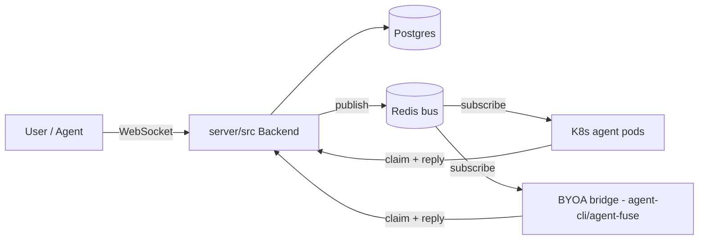
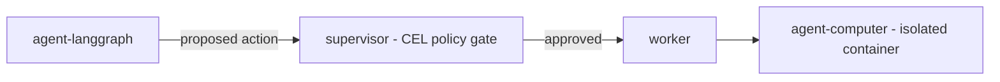
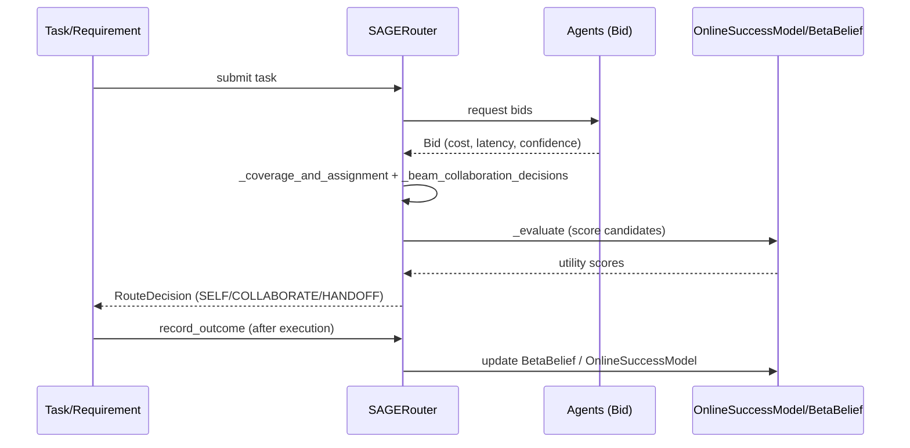
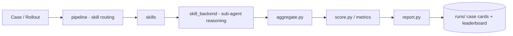

# Weekly Agentic AI Scan — 2026-08-23

**Nguồn dữ liệu**: GitHub search (`agent OR multi-agent OR agentic`, `created:>2026-08-16 stars:>200`), verify thủ công qua README/tree/source của từng repo. 4/10 repo pass filter (loại awesome-list, skill-pack thuần prompt, app UI thuần hiển thị agent session, wrapper mỏng).

## Executive Summary

- Tuần này nổi bật hai hướng đối lập: **hạ tầng multi-agent quy mô production** (Cumora — agent như thành viên team chat; OpenBot — agent có "máy tính riêng" với policy gate) và **lớp điều phối trừu tượng tách khỏi LLM** (Sprix SAGE Router — thuật toán routing SELF/COLLABORATE/HANDOFF chạy bằng logistic regression, không phải LLM).
- Điểm chung đáng chú ý: cả OpenBot và Sprix SAGE đều coi **quyết định hành động là một bước cần được duyệt/tính điểm tường minh** trước khi thực thi — audit trail và evidence tree thay vì "agent tự quyết rồi hy vọng đúng".
- HarnessEval-W đại diện cho mảng eval methodology: dùng chính kiến trúc agent (planner → sub-agent → aggregator) để chấm điểm world model khác, sinh "evidence tree" thay vì điểm số đơn lẻ.

## Mục lục

1. [yetone/cumora](#1-yetonecumora)
2. [CopilotKit/OpenBot](#2-copilotkitopenbot)
3. [wang2122/sprix-sage-router](#3-wang2122sprix-sage-router)
4. [MirroS-Lab/HarnessEval-W](#4-mirros-labharnesseval-w)

---

## 1. yetone/cumora

**Repo**: https://github.com/yetone/cumora

### §1 Quick Context
Team chat nơi AI agent là thành viên ngang hàng với con người, dùng chung roster/DM/Kanban. Stack: TypeScript (React 18 + Vite frontend; Electron/Capacitor cho desktop/mobile), Node/Express + WebSocket backend, PostgreSQL, Redis, Kubernetes (agent pods), OpenAI API, Cloudflare Workers, Resend, APNs/FCM. Health: 2.9k sao, MIT license, README có sơ đồ kiến trúc chi tiết, repo mới (~54 commit trên main), có `docs/`, `benchmarks/`.

### §2 Architecture Deep-dive

**A. Component inventory**
- `Frontend` (`src/`) — React/Vite client dùng chung cho web/desktop/mobile.
- `Backend server` (`server/src/`) — Express + WebSocket API, nhiều instance chạy song song.
- `Redis bus` — pub/sub + presence tracking, đồng bộ giữa các server instance sau load balancer.
- `Postgres` — lưu trữ bền vững (tin nhắn, Kanban, calendar).
- `K8s agent pods` (`server/k8s/`) — mỗi cloud agent chạy trong một pod riêng, dùng Go FUSE driver mount workspace.
- `BYOA bridge` (`agent-cli/`, `agent-fuse/`) — cầu nối để agent chạy local (Claude Code, Codex, Grok Build, Cursor Agent CLI) tham gia như thành viên team.
- `Cloudflare Workers` — xử lý mail inbound + CDN.

**B. Control flow — Event-driven, không phải ReAct loop cổ điển.** Happy path:
1. Người dùng/agent gửi message vào một conversation (WebSocket → `server/src`).
2. Server ghi vào Postgres, publish event lên Redis bus.
3. Các server instance khác + agent runtime (K8s pod hoặc BYOA local) nhận event qua subscribe.
4. Agent xử lý task, muốn nhận việc phải "atomic claim" một work item — tránh hai agent cùng nhận một task.
5. Trước khi trả lời, agent qua "seen-cursor freshness gate": nếu có tin nhắn mới hơn xuất hiện, reply cũ bị HELD và agent phải re-decide với context mới.
6. Kết quả ghi lại vào Postgres, broadcast qua Redis tới mọi client.

**C. State & data flow**: Message dạng structured record trong Postgres (không phải raw string thuần); Redis giữ state ngắn hạn (presence, pub/sub); không có bằng chứng về chiến lược context-window compaction/summarization trong README — **không xác định từ code**.

**D. Tool/capability integration**: Không phải function-calling nội bộ theo nghĩa cổ điển — agent là **tiến trình ngoài** (Claude Code/Codex CLI) được cấp workspace qua FUSE mount; cloud agent chạy sandbox trong pod K8s riêng (cách ly ở mức OS/container, không phải sandbox trong-process).

**E. Memory**: Không xác định từ code (README không mô tả cơ chế memory riêng ngoài lịch sử hội thoại trong Postgres).

**F. Model orchestration**: Cloud agent dùng OpenAI API; BYOA cho phép mỗi agent-identity mang backend model riêng (Claude, Codex, Grok, Cursor) — nghĩa là **model heterogeneous theo từng "nhân viên"**, không có model orchestration tập trung.

**G. Observability & eval**: Không xác định từ code — README không đề cập tracing/eval hook cụ thể.

**H. Extension points**: BYOA là cơ chế extension chính — gắn agent CLI tuỳ ý (miễn tuân theo giao thức FUSE workspace) làm "nhân viên" mới trong team.

### §3 Diagram

### §4 Verdict
**Novel**: cơ chế "seen-cursor freshness gate" + atomic claim để giải quyết race condition khi nhiều agent cùng theo dõi một kênh chat — vấn đề thực tế ít framework multi-agent hiện có xử lý tường minh. **Red flag**: chưa thấy evidence về observability/tracing hay memory strategy dài hạn; kiến trúc phụ thuộc nhiều hạ tầng (K8s + FUSE + Redis + Postgres) nên chi phí vận hành production không nhỏ cho một dự án 54 commit. **Cần đào sâu**: cơ chế BYOA thực sự cấp quyền gì cho agent local (giới hạn filesystem access ra sao), và liệu atomic claim có transactional guarantee hay chỉ best-effort.

---

## 2. CopilotKit/OpenBot

**Repo**: https://github.com/CopilotKit/OpenBot

### §1 Quick Context
"AI coworkers" mỗi agent có browser/file/tool riêng, mọi hành động được duyệt policy trước khi chạy và ghi log sau. Stack: Bun 1.3+, Hono API, LangGraph (agent orchestration), React/Vite, PostgreSQL + pgvector, Docker Compose, gVisor sandbox, giao thức AG-UI, CopilotKit Intelligence cho durable threads. Health: 2.4k sao, 268 fork, MIT, trạng thái Alpha, active development, có `.claude/skills`, `docs/`, `tests/`.

### §2 Architecture Deep-dive

**A. Component inventory**
- `agent-langgraph` (`agent-langgraph/src/index.ts`, `history.ts`) — đồ thị agent dựng bằng LangGraph, entry point xử lý luồng suy luận.
- `supervisor` (`supervisor/src/`) — lớp giám sát/điều phối, có Dockerfile + package.json riêng (chạy như service độc lập).
- `worker` (`worker/`) — service thực thi hành động thực tế (browser/file/shell/MCP).
- `agent-bot` (`agent-bot/`) — orchestrator cấp bot/agent identity.
- `agent-computer` (`agent-computer/`) — "máy tính" cách ly riêng cho từng agent (container, browser profile, filesystem).
- `server` (`server/`) — API layer (Hono).
- `shared` (`shared/`) — code dùng chung giữa các service.
- `Gateway/CEL policy engine` — theo README, đánh giá policy deny-first trước mọi action (vị trí file cụ thể không xác định được từ tree đã đọc).

**B. Control flow — Supervisor-worker, có policy gate chèn giữa quyết định và thực thi.** Happy path:
1. `agent-langgraph` sinh ra một action đề xuất (LangGraph node) dựa trên yêu cầu người dùng.
2. Action được gửi tới `supervisor` để đánh giá qua policy engine dạng CEL, deny-first.
3. Nếu được duyệt, `supervisor` dispatch cho `worker` chạy bên trong `agent-computer` (container cách ly, gVisor sandbox).
4. `worker` thực thi (browser automation / file / shell / gọi MCP server).
5. Kết quả + trạng thái permitted/refused/failed được ghi vào audit trail; thread state cập nhật bền vững qua CopilotKit Intelligence.
6. Với thao tác nhạy cảm (auth), quyền điều khiển được handoff thủ công về người dùng.

**C. State & data flow**: Durable threads (trạng thái hội thoại bền vững qua CopilotKit Intelligence); PostgreSQL + pgvector — có khả năng dùng cho retrieval, nhưng README không mô tả chi tiết pipeline retrieval nên **không xác định chắc chắn cơ chế context window**.

**D. Tool/capability integration**: Hỗ trợ MCP server, browser automation, file operations, shell commands; response không chỉ prose mà còn "React component-based responses" (generative UI) — actions cần qua **component approval workflow** trước khi hiển thị/thực thi.

**E. Memory**: pgvector cho thấy có lưu vector, nhưng ranh giới short-term/long-term và chiến lược retrieval cụ thể — không xác định từ evidence đã thu thập được.

**F. Model orchestration**: Model-agnostic — cấu hình API key OpenAI/Anthropic/Google; LangGraph đảm nhiệm điều phối bước suy luận (routing giữa các node trong graph), không có bằng chứng phân vai "planner dùng model lớn, executor dùng model nhỏ".

**G. Observability & eval**: Audit trail tự xây (ghi lại permitted/refused/failed action) — không có bằng chứng dùng OpenTelemetry/Langfuse cụ thể, đây là **custom logging** theo mô tả README.

**H. Extension points**: Skill management (cá nhân + toàn deployment), tích hợp identity provider (Google/Microsoft/Okta/SAML/OIDC) cho RBAC, và MCP server để thêm tool mới.

### §3 Diagram

### §4 Verdict
**Novel**: gate hành động qua CEL policy deny-first *trước khi* thực thi, kết hợp audit trail đầy đủ (permitted/refused/failed) — đây là mô hình "agent như nhân viên có giám sát" thực sự production-oriented, khác hẳn kiểu "cho agent full quyền rồi log lại sau" phổ biến. **Red flag**: dự án đang Alpha, tài liệu chưa lộ rõ vị trí file của Gateway/policy engine trong tree đã khảo sát (chỉ suy ra từ mô tả README, chưa map được path); phụ thuộc hạ tầng nặng (Docker Compose, gVisor, Postgres+pgvector) khiến việc self-host phức tạp. **Cần đào sâu**: policy engine CEL nằm ở service nào (`server/`, `shared/`, hay module riêng chưa liệt kê), và cơ chế pgvector dùng cho long-term memory hay chỉ semantic search tài liệu.

---

## 3. wang2122/sprix-sage-router

**Repo**: https://github.com/wang2122/sprix-sage-router

### §1 Quick Context
Thư viện routing quyết định agent nên "tự làm / hợp tác / bàn giao" trong mạng Agent-to-Agent, dựa trên belief học online chứ không phải LLM. Stack: Python thuần, đóng gói qua `pyproject.toml`, không phụ thuộc framework LLM nào. Health: 1.2k sao, 14 commit, có CI (`.github/workflows`), test (`test_sprix_sage.py`), benchmark script, `CITATION.cff` — mang tính research artifact, tự nhận là "research preview", chưa production-ready.

### §2 Architecture Deep-dive

**A. Component inventory**
- `SAGERouter` (`sprix_sage.py`) — router chính, thực hiện bounded beam search chọn team/mode.
- `RouteDecision` (`sprix_sage.py`) — kết quả routing: mode (SELF/COLLABORATE/HANDOFF), team, utility score, xác suất thành công.
- `BetaBelief` (`sprix_sage.py`) — belief Bayesian theo từng agent/requirement.
- `OnlineSuccessModel` (`sprix_sage.py`) — logistic regression dự đoán xác suất thành công, cập nhật online.
- `ExecutionState` / `ExecutionOutcome` (`sprix_sage.py`) — trạng thái routing sống và evidence sau khi thực thi.
- `Task` / `Requirement` (`sprix_sage.py`) — data model mô tả công việc và yêu cầu con (dependency, weight, ngưỡng tối thiểu).
- `Agent` / `Bid` (`sprix_sage.py`) — data model agent (skill score, cost, latency, permission) và đề xuất (bid) của agent cho một task.
- `benchmark.py` — script benchmark trên 2.500 task tổng hợp.

**B. Control flow — Planner/router pattern, không phải ReAct.** Happy path:
1. Task mới được submit cùng danh sách `Requirement` (phụ thuộc, trọng số, ngưỡng tối thiểu).
2. `SAGERouter` thu thập `Bid` (giá, latency, độ tin cậy) từ các `Agent` khả dụng.
3. `_coverage_and_assignment()` khớp requirement với agent dựa trên skill score.
4. `_beam_collaboration_decisions()` chạy bounded beam search khám phá các phương án SELF/COLLABORATE/HANDOFF.
5. `_evaluate()` chấm điểm mỗi phương án bằng `OnlineSuccessModel` + `RouterWeights` (cost, latency, risk, coordination…).
6. `route()` trả về `RouteDecision`; sau khi task chạy xong, `record_outcome()` cập nhật `BetaBelief`/`OnlineSuccessModel` để routing lần sau chính xác hơn — **vòng lặp học online**, không phải one-shot.

**C. State & data flow**: `ExecutionState` giữ trạng thái routing đang chạy (agent active, requirement hoàn thành, tiến độ, lỗi) — hoàn toàn **in-memory, single-process**, không thấy persistent store (Redis/DB) trong file core.

**D. Tool/capability integration**: Không áp dụng — đây là lớp routing thuần, không tự thực thi tool; giả định được nhúng vào một hệ A2A network có sẵn cơ chế thực thi.

**E. Memory**: Bỏ qua (không có thành phần memory dài hạn ngoài `BetaBelief` — vốn là model học, không phải bộ nhớ hội thoại).

**F. Model orchestration**: Điểm khác biệt lớn nhất — lớp điều phối **không dùng LLM** mà dùng logistic regression cổ điển (`OnlineSuccessModel`) để dự đoán xác suất thành công của từng phương án routing giữa các LLM agent. Nói cách khác, đây là "ML router điều phối LLM agent", không phải "LLM điều phối LLM".

**G. Observability & eval**: `RouteDecision` trả kèm diagnostic metrics; `benchmark.py` đo chất lượng routing (Online SAGE đạt 0.634±0.006 so với 0.507 của incumbent-only) trên dữ liệu tổng hợp — tác giả tự nêu rõ đây **chưa phải bằng chứng real-world**.

**H. Extension points**: `RouterWeights` cho phép tinh chỉnh trọng số (cost/latency/risk/handoff/coordination/uncertainty/exploration); belief model học riêng theo từng agent/requirement nên có thể cắm thêm agent mới mà không cần retrain toàn hệ thống.

### §3 Diagram

### §4 Verdict
**Novel**: tách hẳn lớp "quyết định ai làm gì" ra khỏi LLM, dùng model thống kê nhẹ (logistic regression + Bayesian belief) học online từ outcome thực tế — cách tiếp cận engineering-first, tránh dùng LLM cho một bài toán mà LLM không cần thiết và tốn kém. Beam search có bound rõ ràng thay vì brute-force. **Red flag**: chỉ 14 commit, tự nhận "research preview", benchmark hoàn toàn trên dữ liệu tổng hợp (synthetic), chưa có case study thật; thiếu cơ chế persistent state nên restart mất toàn bộ belief đã học (trừ khi caller tự serialize). **Cần đào sâu**: `RouterWeights` được tune thế nào trong thực tế, và độ nhạy của beam search width với số lượng agent lớn (scalability).

---

## 4. MirroS-Lab/HarnessEval-W

**Repo**: https://github.com/MirroS-Lab/HarnessEval-W

### §1 Quick Context
Framework "agent hoá" việc chấm điểm world model: dùng planner → sub-agent → aggregator thay vì rubric cứng, sinh "evidence tree" minh bạch. Stack: Python, `pyproject.toml`, có kèm paper + benchmark release (công bố 18/8/2026). Health: 248 sao, hoạt động trong 7 ngày qua, có `docs/`, `examples/`, `benchmark/`, `runs/` (lưu case card), CI không xác định rõ từ tree đã đọc.

### §2 Architecture Deep-dive

**A. Component inventory**
- `pipeline` (`src/harnesseval/pipeline/`) — điều phối 3 giai đoạn routing → reasoning → aggregation.
- `skills` (`src/harnesseval/skills/`) — tập skill đánh giá, mỗi skill tự quyết có áp dụng cho case hay không.
- `skill_backend` (`src/harnesseval/skill_backend/`) — backend thực thi cho từng skill (sub-agent reasoning).
- `aggregate.py` (`src/harnesseval/aggregate.py`) — aggregator, tổng hợp evidence thành case score cuối.
- `score.py` (`src/harnesseval/score.py`) — tính điểm/metric.
- `model_adapter.py` (`src/harnesseval/model_adapter.py`) — lớp adapter gọi model được đánh giá (world model) một cách thống nhất.
- `metrics/`, `metric_backends/` (`src/harnesseval/metrics/`, `src/harnesseval/metric_backends/`) — định nghĩa và backend tính metric.
- `report.py` (`src/harnesseval/report.py`) — sinh báo cáo/leaderboard.
- `runs/` — nơi lưu case card (artifact trace đầy đủ) sau mỗi lần chấm điểm.

**B. Control flow — Planner-executor / hierarchical (supervisor → skill sub-agent → aggregator).** Happy path:
1. Một case (rollout của world model) được đưa vào `pipeline` — planner xem case context và quyết định skill nào trong `skills/` áp dụng, skill nào bị skip (có ghi lý do).
2. **Quan trọng**: routing chỉ dựa vào case context, **không** dựa vào model đang được đánh giá — đảm bảo mọi model đối mặt cùng bộ câu hỏi trên cùng case (fairness by design).
3. Mỗi skill được chọn phân rã thành các sub-question, giao cho `skill_backend` (sub-agent) phân tích bằng chứng rollout.
4. Kết quả từng sub-agent được `aggregate.py` tổng hợp lại thành case score, kèm "evidence tree" — chuỗi lý luận đầy đủ.
5. `score.py`/`metrics/` tính điểm tổng hợp, `report.py` sinh leaderboard + case card lưu vào `runs/`.

**C. State & data flow**: Case card (dạng structured artifact) lưu trong `runs/` — file-based, không thấy DB. Message giữa planner/skill/aggregator có khả năng là schema có cấu trúc (do có `protocols.py`, `validation.py`) — **format cụ thể không xác định đầy đủ** từ evidence thu thập được (chưa đọc nội dung `protocols.py`).

**D. Tool/capability integration**: `model_adapter.py` là lớp trừu tượng gọi world model cần đánh giá — bản chất đây là "tool" duy nhất mà hệ agent gọi (chính là subject-under-test), không phải tool thực thi hành động ngoài.

**E. Memory**: Không áp dụng — đây là hệ eval one-shot theo từng case, không có bộ nhớ dài hạn xuyên case.

**F. Model orchestration**: Không rõ evaluator dùng model nào (frontier hay nhỏ) cho planner/skill/aggregator cụ thể — **không xác định từ code** đã khảo sát; `model_order.py` gợi ý có logic sắp xếp thứ tự đánh giá model nhưng chưa xác nhận được nội dung.

**G. Observability & eval**: Đây bản thân là một eval framework — "evidence tree" auditable, case card lưu trace đầy đủ trong `runs/`, `report.py` sinh leaderboard. Đây là điểm mạnh cốt lõi của repo (eval hook = chính sản phẩm).

**H. Extension points**: Thêm skill mới vào `skills/` + `skill_backend/` tương ứng; `model_adapter.py` cho phép cắm world model mới cần đánh giá mà không đổi pipeline.

### §3 Diagram

### §4 Verdict
**Novel**: dùng chính kiến trúc multi-agent (planner phân công, sub-agent thu thập bằng chứng, aggregator tổng hợp) để giải bài toán eval — thay vì rubric tĩnh, sinh ra "evidence tree" có thể audit từng bước, và ràng buộc rõ "routing không phụ thuộc model đang test" để đảm bảo công bằng giữa các world model được so sánh. **Red flag**: chưa xác nhận được model nào chạy planner/skill (chi phí eval có thể cao nếu dùng frontier model cho mọi sub-question); repo đi kèm paper nên có thể thiên về research demo hơn là tool sẵn sàng dùng ngoài lab. **Cần đào sâu**: đọc `protocols.py`/`validation.py` để biết schema giao tiếp giữa pipeline–skill–aggregator, và chi phí (số lệnh gọi model) cho một lần chấm điểm đầy đủ.
