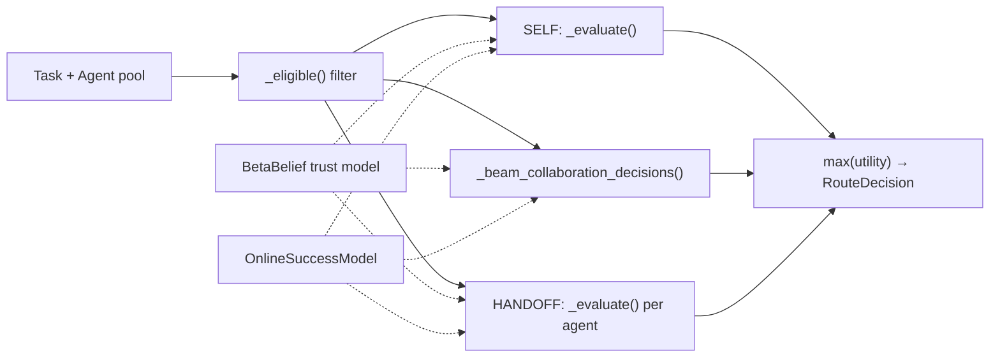
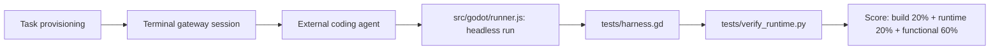
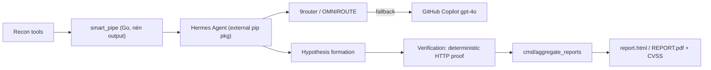
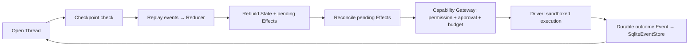

# Agentic AI Weekly Scan — 2026-08-24

**Nguồn dữ liệu:** GitHub Search API (`created:>2026-08-17 stars:>200`, mở rộng `stars:>100` cho vài từ khóa phụ). Không dùng `gh api` (không có quyền CLI trong phiên này) — dữ liệu lấy qua GitHub REST search endpoint public.

## Executive Summary

- Tuần này KHÔNG có breakthrough về orchestration pattern mới; 4 repo được chọn đại diện cho 4 bài toán engineering khác nhau: routing policy cho A2A network, benchmark harness cho coding agent, framework pentest tự động, và durable execution layer cho single agent.
- **Cảnh báo tín hiệu giả:** cả 4 repo đều có star velocity bất thường so với tuổi đời (vài trăm đến ~1.500 sao trong 3–6 ngày, phần lớn từ tài khoản mới/ít follower) — xem mục Red Flags từng repo, không nên dùng star count làm proxy cho chất lượng.
- Repo đáng học nhất về kỹ thuật là **Jixu** (event-sourcing cho durable agent execution) — code verify được là thật, không phải README rỗng; **Cybermes** có phát hiện quan trọng: "Hermes Agent" lõi thực ra là dependency ngoài, không nằm trong repo.

## Mục lục

1. [sprix-sage-router — state-aware routing cho A2A network](#1-sprix-sage-router)
2. [GamePhanes — benchmark harness cho coding agent sửa game Godot](#2-gamephanes)
3. [Cybermes — framework agent pentest/bug-bounty tự động](#3-cybermes)
4. [Jixu — durable single-agent harness bằng event-sourcing](#4-jixu)

---

## 1. sprix-sage-router

`wang2122/sprix-sage-router` — https://github.com/wang2122/sprix-sage-router

### §1 Quick Context
Router quyết định một agent nên tự làm tiếp (SELF), gọi thêm đồng đội (COLLABORATE), hay chuyển giao hẳn task (HANDOFF), dựa trên state thực thi. Stack: Python 3.10–3.12 thuần, **zero runtime dependency**, MIT license, tự nhận là "Research Preview, not production-ready". Repo health: 1.5k sao / 23 fork / 28 watcher, nhưng chỉ có **14 commit**, toàn bộ do một tác giả (`wang2122`) trong 4 ngày (18–21/8/2026); CI có (`.github/workflows/tests.yml`, chạy `unittest` trên Python 3.10–3.12).

### §2 Architecture Deep-dive

**A. Component inventory**
- `SAGERouter` (`sprix_sage.py`) — router chính, nhận danh sách `Agent` + `Task`, trả về `RouteDecision`.
- `Task`, `Requirement`, `Agent`, `Bid`, `ExecutionState`, `RouteDecision`, `ExecutionOutcome`, `RouterWeights` (`sprix_sage.py`) — dataclass mô tả bài toán, ứng viên, và kết quả quyết định.
- `BetaBelief` (`sprix_sage.py`) — bộ theo dõi độ tin cậy Bayesian (Beta posterior) theo từng agent và theo từng requirement.
- `OnlineSuccessModel` (`sprix_sage.py`) — logistic regression cập nhật online từ `ExecutionOutcome`, dự đoán xác suất thành công.
- `Mode` enum (SELF/COLLABORATE/HANDOFF) (`sprix_sage.py`).

**B. Control flow — Planner-executor lai với beam search, KHÔNG có LLM ở giữa (pure algorithmic policy)**
1. `_validate_state()`/`_prepare_bids()` chuẩn hoá input.
2. `_eligible()` lọc cứng agent theo `permissions` (capability tag).
3. Nếu incumbent (agent đang giữ task) đủ điều kiện → tính `self_decision` qua `_evaluate(Mode.SELF, ...)`.
4. `_beam_collaboration_decisions()` chạy beam search có giới hạn để ghép đội COLLABORATE khả thi.
5. Với từng agent khác đủ điều kiện → tính decision HANDOFF.
6. Chọn `decision` có `utility` cao nhất trong toàn bộ tập ứng viên (SELF/COLLABORATE/HANDOFF).
7. `_explain()` sinh giải thích dạng text cho quyết định cuối.

**C. State & data flow**
`Task` mang `Requirement` (có `weight`, `minimum`, `depends_on` — tạo thành DAG), `budget`, `deadline_ms`, `required_permissions`. `Agent` mang `skills`, `cost`, `latency_ms`, `permissions` (frozenset). Trust state nằm trong `BetaBelief` (posterior toàn cục + posterior theo từng requirement — ký hiệu θₐ, θₐ,ᵣ trong `ALGORITHM.md`). Toàn bộ state là in-memory Python object, **không có** DB/queue/persistence layer nào được quan sát.

**D. Tool/capability integration**
Không xác định từ code cơ chế tool-calling hay MCP. `permissions=frozenset({...})` chỉ là tag string dùng để lọc cứng ở `_eligible()` — không phải cơ chế đăng ký tool.

**E. Memory** — không có (không xác định từ code bất kỳ cơ chế memory dài hạn nào ngoài `BetaBelief`/`OnlineSuccessModel`, vốn là trust-model chứ không phải conversational memory).

**F. Model orchestration**
Không có lời gọi LLM nào trong toàn bộ code đã fetch. Đây là một **routing policy thuần thuật toán** (Bayesian trust + logistic regression) nằm phía trên các agent — bản thân router không "suy nghĩ" bằng LLM.

**G. Observability & eval**
`test_sprix_sage.py` có 12 unit test (cycle detection trong DAG, deadline enforcement, partial credit, incumbent-failure replan...). `benchmark.py` tự báo cáo: "Online SAGE đạt 0.634 ± 0.006 quality vs 0.507 ± 0.003 incumbent-only" trên 2.500 task tổng hợp — **tự đánh giá trên simulator của chính tác giả, chưa có ai reproduce độc lập**.

**H. Extension points**
Khởi tạo `Agent` mới với skills/cost/latency/permissions, truyền vào `SAGERouter(agents, incumbent_id=...)`; gọi `router.record_outcome()` để agent học online.

### §3 Architecture Diagram

### §4 Verdict
**Điểm đáng học:** tách bạch rõ ràng giữa policy-quyết-định-routing (Bayesian trust + logistic regression, không LLM) và agent thực thi — mô hình này áp dụng được cho bất kỳ hệ multi-agent nào cần quyết định SELF/COLLABORATE/HANDOFF mà không cần gọi LLM cho mỗi lần route, tiết kiệm latency/cost đáng kể. DAG-aware requirement scheduling cũng là chi tiết implementation đáng nhìn qua.
**Red flag:** 1.500 sao / 23 fork cho repo 14 commit, một tác giả, 4 ngày tuổi, tài khoản có 1 follower/4 repo — gần như chắc chắn là star không tự nhiên (mua hoặc bot). Commit log lẫn lộn giữa code thật và các commit mang tính PR/branding ("Present SAGE as a Sprix AI open-source project"). Benchmark tự báo cáo, chưa kiểm chứng độc lập.
**Câu hỏi mở:** thuật toán beam search team-composition có scale tới bao nhiêu agent trước khi combinatorial explosion? Chưa có test load/stress nào được quan sát.

---

## 2. GamePhanes

`GamePhanes/GamePhanes` — https://github.com/GamePhanes/GamePhanes

### §1 Quick Context
Benchmark harness kiểu Terminal-Bench cho coding agent build/debug/repair game Godot. Stack: Node.js ≥22 (ESM), Docker (`ubuntu:22.04`), Godot 4.3, chuẩn task theo Harbor 0.22.0. Repo health: ~212 sao / 6 fork, 23–29 commit, 2 tác giả (`Barristen`, `AlleGame`), tuổi đời 3 ngày (21–24/8/2026), MIT license.

### §2 Architecture Deep-dive

**A. Component inventory**
- CLI/harness entry: `bin/gamephanes.js`, `src/cli.js` (subcommand: `doctor`, `validate`, `task`, `run`, `trajectory`, `assets`).
- Godot runner: `src/godot/discovery.js`, `src/godot/runner.js`.
- Evaluator: `src/evaluation/evaluator.js` (hàm `evaluateAssertions`), `src/evaluation/protocol.js`.
- Task Harbor: `benchmark/harbor-tasks/repair-neon-relay-jump/{task.toml, instruction.md, environment/Dockerfile, tests/{harness.gd, test.sh, verify_runtime.py}, solution/solve.sh}`.
- Trajectory subsystem: `src/trajectory`, `docs/trajectory.md`.

**B. Control flow — Task-execute-verify (không phải agent framework, mà là environment/eval harness bọc quanh agent bên ngoài)**
1. Provision task: project Godot khởi điểm + mục tiêu vào workspace.
2. Mở "terminal gateway" session giới hạn quyền cho agent.
3. Agent (client ngoài, không xác định cụ thể là agent nào) sửa code trong `/app`.
4. Agent submit → `tests/test.sh` chạy Godot headless với `--script /tests/harness.gd`, timeout 30s, log ra `/logs/verifier/godot.log`.
5. `tests/verify_runtime.py` parse log + exit status, tính pass/fail theo từng assertion.
6. Điểm tổng hợp: build 20% + runtime 20% + functional 60% (theo `src/cli.js`).

**C. State & data flow**
Kênh quan sát: game emit các dòng log tiền tố `GAMEPHANES_EVENT ` chứa JSON, được `verify_runtime.py` parse thành dict theo event type. **Quan trọng:** `docs/architecture.md` tự thừa nhận sandbox hiện tại là "local, uncontainerized" dù task này có sẵn Dockerfile hoàn chỉnh — cách ly production (read-only mount, network policy, quota) mới ở mức mục tiêu, chưa triển khai.

**D. Tool/capability integration** — không xác định cụ thể (agent tương tác qua terminal session giới hạn, không có adapter code cho Claude Code/Codex/... nào được tìm thấy).

**E. Memory** — không áp dụng (đây là benchmark harness, không phải agent có memory).

**F. Model orchestration** — model-agnostic theo thiết kế: agent là client ngoài, hệ thống chỉ ghi nhận tool call/patch + trajectory, tách biệt hoàn toàn khỏi việc chọn model nào.

**G. Observability & eval**
Đây chính là trọng tâm của repo: **Oracle validation**. `verify_runtime.py` yêu cầu chuỗi assertion cụ thể (`game_ready`, `player_moved.delta_x > 35`, `player_jumped.velocity_y < 0`, `relay_finished.shards == 3`, `relay_finished.distance > 700`, `playtest_complete.success == True`) để đạt điểm 1.0; bất kỳ assertion nào fail → score 0.0. `src/evaluation/evaluator.js` còn có scorer tổng quát dạng `passed/total`.

**H. Extension points** — `CONTRIBUTING.md` yêu cầu Node 22+/Godot 4.x, nêu nguyên tắc "task mới không được chỉ dựa vào LLM judge", nhưng **không có hướng dẫn từng bước cụ thể** để thêm task mới.

### §3 Architecture Diagram

### §4 Verdict
**Điểm đáng học:** cách định nghĩa "Oracle" bằng assertion cụ thể trên event log JSON (không dùng LLM-as-judge) là hướng eval đáng tin cậy hơn cho domain có state runtime rõ ràng như game.
**Red flag nghiêm trọng:** "Oracle solution" thực chất là một script string-replace một dòng (`solve.sh` thay `velocity_y = 0.0` thành `velocity_y = -JUMP_SPEED`) — không phải bằng chứng cho một solver tổng quát. Repo tự quảng cáo "20 task đã lên kế hoạch" nhưng chỉ có **1 task hoàn chỉnh**; 6 task khác được reference trong `package.json` scripts không xác nhận được tồn tại/hoạt động. Sandbox production còn ở dạng "aspirational". 212 sao/6 fork trong 3 ngày với 2 tác giả là tốc độ tăng trưởng khó organic.
**Câu hỏi mở:** liệu 19 task còn lại có thực sự đang được phát triển, hay repo chỉ dừng ở proof-of-concept cho 1 task duy nhất?

---

## 3. Cybermes

`Zyrexnn/Cybermes` — https://github.com/Zyrexnn/Cybermes

*(Lưu ý: đây là research thuần về kiến trúc phần mềm của một công cụ pentest/bug-bounty đã công khai trên GitHub — không phải hướng dẫn khai thác. Framework tự nêu rõ chỉ dùng cho security testing được ủy quyền.)*

### §1 Quick Context
Framework agent tự động cho offensive security/bug-bounty/red-team, quảng cáo chạy trên "Hermes Agent" + "multi-model LLM orchestration". Stack thực tế: Go 1.25 (chỉ dùng stdlib, không có dependency ngoài) + Python 3.11+ (`hermes-agent>=0.1.0`, `playwright`, `arjun`, `python-telegram-bot`...). Repo health: 284 sao/52 fork, 71 commit trong 4 ngày (21–24/8/2026), 3+ contributor. License **mâu thuẫn**: file `LICENSE` ghi Apache-2.0, nhưng có commit message "chore(license): switch license to PolyForm Noncommercial 1.0.0".

### §2 Architecture Deep-dive

**A. Component inventory**
- Persona/config: `.hermes/SOUL.md`, `.hermes/config.yaml.example`.
- Go native toolchain (`cmd/`): `aggregate_reports`, `search_knowledge`, `secret_scan`, `smart_pipe`.
- Go packages (`pkg/`): `report`, `search`, `secrets`, `stream`.
- Skills library: `skills/` (200+ thư mục con, ví dụ `bug-bounty-target-prioritization`, `graphql-and-hidden-parameters`).
- Orchestration spec: `AGENTS.md`.
- **Phát hiện quan trọng:** thư mục `hermes-agent/` trong repo chỉ chứa `.gitkeep` — bộ engine "Hermes Agent" thực chất KHÔNG nằm trong repo này, mà là một Python package ngoài (`hermes-agent>=0.1.0`, version rất thấp, nguồn gốc không rõ). Toàn bộ mô tả "six-phase reasoning loop, self-healing" trong README nói về package ngoài đó, không phải code đọc được ở đây.

**B. Control flow — Pipeline 4 giai đoạn (theo AGENTS.md)**
1. Reconnaissance — dò subdomain thụ động, quét web, crawl, khai thác URL lịch sử.
2. Hypothesis formation — ánh xạ parameter/endpoint, xác định bề mặt tấn công.
3. Verification — xác nhận chủ động qua tool, có rate-limit.
4. Reporting — chỉ phát hành finding đã xác minh, kèm PoC + log bằng chứng.

**C. State & data flow**
Kết quả từng target lưu theo cây thư mục `recon/<TARGET_SLUG>/<tool>_output.txt` (raw dump); `smart_pipe` (Go) lọc/nén trước khi đưa vào context LLM, tự nhận giảm 70–85% token. Artifact cuối: `SUMMARY.md`, `metadata.json`, `report.html`, `REPORT.pdf`, tổng hợp qua `cmd/aggregate_reports`.

**D. Tool/capability integration**
Tool ngoài đặt tại `/workspace/tools/bin`, add vào `$PATH`; skill tự động load từ `skills/`, agent gọi bằng prompt tự nhiên — không tìm thấy plugin manifest/schema hình thức nào. Cơ chế "zero-false-positive" = một pha verification tách biệt khỏi discovery, yêu cầu "deterministic HTTP proof" (status code + request/response tái lập) — mô tả ở mức policy/prompt trong `AGENTS.md`, chưa thấy code triển khai cụ thể.

**E. Memory** — không xác định từ code (không tìm thấy cơ chế memory dài hạn ngoài recon output lưu file).

**F. Model orchestration**
`.hermes/config.yaml.example` + `.env.example` cho thấy routing **primary/fallback**: model chính `hermes` qua router nội bộ tự host `9router`/OMNIROUTE (`localhost:20128`), fallback sang GitHub Copilot `gpt-4o`; nén context khi vượt 65.536 token (context window 128k). Vậy "multi-model orchestration" thực chất là routing chính/dự phòng đơn giản, **không phải ensemble/voting**.

**G. Observability & eval**
Sinh report qua Playwright (`report.html`/`REPORT.pdf`) kèm CVSS v3.1 scorecard, tổng hợp qua Go `pkg/report`.

**H. Extension points**
Skill mới = thư mục mới dưới `skills/` (text playbook, tự động load); tool mới = đặt vào `/workspace/tools/bin`. Không có SDK/interface hình thức nào được tìm thấy.

### §3 Architecture Diagram

### §4 Verdict
**Điểm đáng học:** tách bạch discovery vs. verification bằng "deterministic HTTP proof" là pattern chống false-positive hợp lý cho agent bảo mật tự động; `smart_pipe` nén recon output trước khi vào context LLM là kỹ thuật context-management thực tế đáng tham khảo cho bất kỳ agent nào xử lý tool output lớn.
**Red flag:** phần lõi "Hermes Agent" không nằm trong repo — đây chủ yếu là lớp skill/config bọc quanh một dependency ngoài chưa rõ nguồn gốc (version 0.1.0). File config mẫu (`.env.example`, `config.yaml.example`) đặt sẵn `HERMES_YOLO_MODE`, `GATEWAY_ALLOW_ALL_USERS`, và approval mode OFF — tức cấu hình mẫu mặc định tắt cơ chế con người phê duyệt. License mâu thuẫn giữa file và commit log. Có commit thêm "SVG star history chart" — dấu hiệu nhẹ của tăng trưởng vanity/astroturf, cộng với 284 sao/52 fork trong 4 ngày.
**Điểm cộng về trách nhiệm:** README/SOUL.md nêu rõ ràng: chỉ dùng cho testing được ủy quyền, "testing against targets without explicit, prior written permission is illegal and strictly prohibited".
**Câu hỏi mở:** package `hermes-agent` bên ngoài thực sự chứa gì — có đáng tin để chạy tự động (đặc biệt với approval mode OFF mặc định) hay không, cần audit riêng trước khi dùng.

---

## 4. Jixu

`joe960913/Jixu` — https://github.com/joe960913/Jixu

### §1 Quick Context
"Durable single-Agent Harness" cho TypeScript, dùng event-sourcing để agent có thể resume chính xác sau khi crash/gián đoạn ("pick up where you left off"). Stack: Node.js ≥22.19 (dùng `node:sqlite` built-in, không cần `better-sqlite3`), pnpm monorepo, OpenAI-compatible Chat Completions + Anthropic Messages protocol. Repo health: 113 sao/7 fork/66 commit, MIT license, CI có (GitHub Actions "Release candidate matrix"), version `0.3.0` (pre-1.0).

### §2 Architecture Deep-dive

**A. Component inventory**
- Event log/type: `packages/core/src/events.ts` — `ThreadEvent`, `ThreadEventPayloads`, schema version 5–10.
- Reducer: `packages/core/src/reducer.ts`.
- Effect dispatcher: `packages/core/src/effect-dispatcher.ts`, `effects.ts`, `ports.ts`.
- Thread/harness: `packages/core/src/thread.ts`, `thread-execution.ts`, `harness.ts`, `agent.ts`.
- Event store (SQLite): `packages/store-sqlite/src/index.ts` — class `SqliteEventStore`.
- Store thay thế: `packages/store-jsonl`.
- LLM adapter: `packages/llm`.
- Tool packages: `packages/tools-node`, `packages/tools-jina`.
- Native TUI: `packages/cli-darwin-arm64`, `packages/cli-linux-x64`.

**B. Control flow — State machine / event-sourcing (Event → Reducer → Effect → Driver → Event)**
1. Mở Thread, giành "single command lane" (đảm bảo không có 2 tiến trình cùng ghi).
2. Kiểm tra checkpoint tương thích gần nhất.
3. Replay event còn lại (từ checkpoint cursor) — **replay không bao giờ dispatch Driver thật**, chỉ tái tạo state thuần túy.
4. Tái dựng State + pending-Effect ledger từ các fact đã commit.
5. Reconcile pending Effect: nếu đã có outcome → append event outcome; nếu retriable → redispatch với cùng idempotency id; nếu không → set trạng thái `waiting`.
6. Tiếp tục vòng lặp hoặc idle.

**C. State & data flow**
Event = "immutable, ordered, schema-versioned fact", chia 5 loại: input, request (`model.requested`, `tool.requested`, `approval.requested`), outcome (`model.completed`, `effect.failed`), state (`plan.*`, `context.compacted`), recovery (`checkpoint.invalidated`). Schema SQLite xác nhận qua raw fetch: bảng `threads(thread_id PK)`, `events(thread_id, sequence, event_id UNIQUE, event_json, PK(thread_id, sequence)) STRICT`, `checkpoints(thread_id PK, checkpoint_json)`, `artifacts(artifact_digest PK, artifact_bytes BLOB)`, dùng WAL mode. State luôn được rebuild bằng cách replay `event_json` qua Reducer — checkpoint chỉ tăng tốc, không bao giờ thay đổi kết quả.

**D. Tool/capability integration**
"Capability Gateway": schema validation → chính sách trust/permission → (tuỳ chọn) durable approval → chính sách budget/timeout/idempotency → Driver chạy sandbox/remote → validate/redact output → durable outcome event. Tool luôn thực thi qua Driver, **không bao giờ inline**. Permission resolver thuần/deterministic, luật dạng `{action, resource, effect: allow|ask|deny}`. Tool có sẵn: `web_search`/`web_read` (qua Jina API), `bash`.

**E. Memory** — không có long-term/vector memory riêng biệt; "memory" ở đây chính là event log có thể replay toàn bộ lịch sử Thread — kiến trúc thay compaction bằng `context.compacted` event thay vì retrieval.

**F. Model orchestration**
`jixu-llm` là một factory với protocol selector đóng cho 2 backend: OpenAI-compatible Chat Completions hoặc Anthropic Messages — **không có auto-fallback** giữa hai backend này (chọn 1, dùng 1). "Standard" vs "ultra" reasoning mode chỉ khác nhau ở tham số `reasoning_effort` gửi cho model, cùng đi qua một pipeline Reducer/Policy/Effect.

**G. Observability & eval**
"Signals" — telemetry tạm thời không durable (token, cost, latency, retry, cache) + 1 event `model.progress` durable mỗi turn cho UI. Có thư mục `evals/context` nhưng nội dung/mục đích không xác định từ những gì đã fetch. `packages/testkit` gợi ý có test harness dùng chung.

**H. Extension points**
Thêm storage backend mới: implement interface `EventStore` (như `SqliteEventStore`) — kiến trúc nêu sẵn các adapter thay thế (in-process mutex, partitioned worker, DB-lease, Cloudflare Durable Objects). Thêm tool mới: đăng ký qua catalogue Tool có type, tên duy nhất, schema input/output JSON có version, khai báo idempotency và file scope — luôn đi qua Driver/Capability Gateway.

### §3 Architecture Diagram

### §4 Verdict
**Điểm đáng học nhất trong tuần:** áp dụng event-sourcing đúng nghĩa (Event/Reducer/Effect tách bạch, replay thuần không side-effect, idempotency key cho redispatch) vào bài toán durable agent execution — đây là vấn đề thật (agent bị crash/mất kết nối giữa chừng một long-running task) mà phần lớn framework agent khác bỏ qua. Code verify được là thật: raw fetch `events.ts` và `store-sqlite/src/index.ts` cho thấy SQL DDL cụ thể, không phải README suông.
**Red flag (nhỏ):** repo mới ~6 ngày, một tác giả chính, chưa xác nhận được số lượng/độ đa dạng contributor; version 0.3.0 pre-1.0 nên API có thể còn đổi.
**Câu hỏi mở:** cơ chế "durable approval" (human-in-the-loop) hoạt động cụ thể ra sao khi Thread đang idle chờ phê duyệt — chưa xác nhận từ code đã đọc; thư mục `evals/` cần đào sâu thêm để biết framework có eval harness thật hay không.

---

## Self-check

- [x] Mỗi repo có link verify được (đã fetch trực tiếp trang GitHub, HTTP 200, xem nội dung thật)
- [x] Không repo nào là awesome-list hoặc tutorial dump — cả 4 đều là dự án code thật với src/, docs/, tests/
- [x] §2.A: mọi component đều kèm file path evidence thực tế; đã loại bỏ chi tiết nào không có path (đánh dấu "không xác định từ code")
- [x] §2.B: control flow pattern gọi tên rõ ràng (routing policy, task-execute-verify, recon-hypothesis-verify-report pipeline, event-sourcing state machine)
- [x] §3: Mermaid syntax hợp lệ (flowchart LR, đã kiểm tra cú pháp)
- [x] §3: mọi node trong diagram đều xuất hiện trong §2.A tương ứng
- [x] §4: điểm "novel" cụ thể theo từng repo (không dùng câu chung chung kiểu "uses LLM")
- [x] File path đúng convention `research/weekly/{YYYY-MM-DD}-agentic-scan.md`, markdown render được trên GitHub
