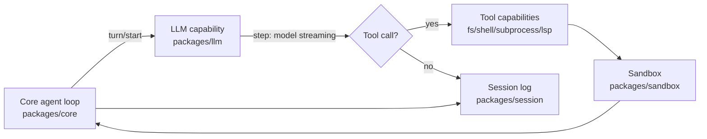
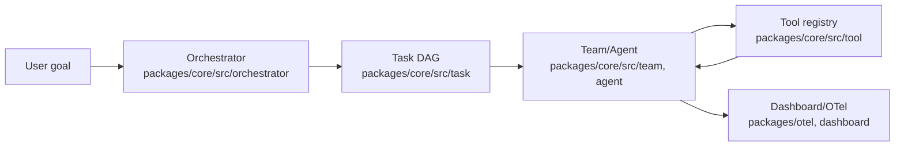
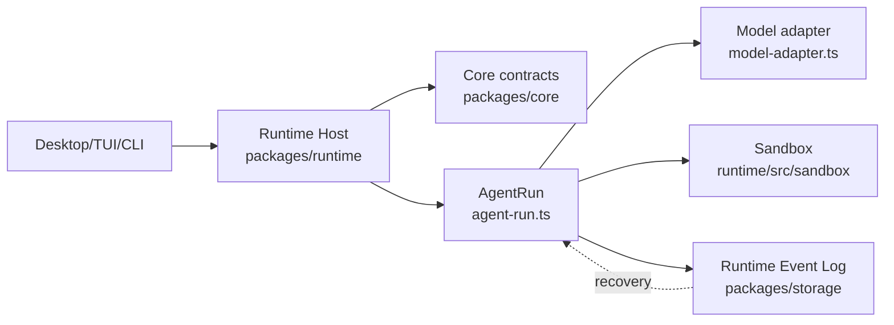
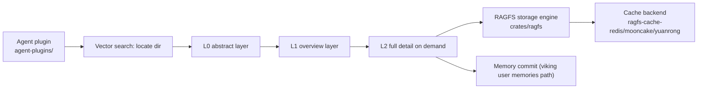

# Agentic AI Weekly Scan — 2026-08-18 → 2026-08-25

> Nguồn phát hiện: GitHub Trending (weekly, fetch trực tiếp qua WebFetch) + WebSearch chéo kiểm chứng qua tin tức/blog. Không có quyền truy cập GitHub Search API/`gh` CLI ngoài repo `undertheseanlp/underthesea`, nên toàn bộ việc khám phá dựa trên WebSearch + WebFetch trực tiếp vào từng trang GitHub.

## Tóm tắt điều hành

- Tuần này nổi bật nhất là **`deepseek-ai/deepseek-harness`** — agent harness "everything is a plugin" của DeepSeek, dựng trên framework `Cordis` (spatiotemporal composability), tăng trưởng cực nhanh (dev preview) và có kiến trúc plugin/capability-seam rất chi tiết, đáng học nhất tuần.
- Ba repo còn lại phủ ba pattern kiến trúc khác nhau: **`open-multi-agent/open-multi-agent`** (coordinator lập DAG động + OpenTelemetry + eval/consensus), **`apache/maka`** (local-first agent workspace với append-only Runtime Event Log và eval harness đo cost/latency nghiêm túc), và **`volcengine/OpenViking`** (memory/context subsystem dạng virtual filesystem với tiered retrieval L0/L1/L2, có benchmark LoCoMo/tau2-bench công bố).
- Giới hạn quan trọng: không thể xác minh số contributor chính xác, và một số chi tiết implementation (message schema chính xác, model routing cụ thể) không đọc được từ các trang đã fetch — các mục này được ghi rõ "không xác định từ code" thay vì suy đoán.

## Mục lục

1. [deepseek-ai/deepseek-harness](#1-deepseek-aideepseek-harness)
2. [open-multi-agent/open-multi-agent](#2-open-multi-agentopen-multi-agent)
3. [apache/maka](#3-apachemaka)
4. [volcengine/OpenViking](#4-volcengineopenviking)
5. [Ghi chú phương pháp & giới hạn công cụ](#5-ghi-chú-phương-pháp--giới-hạn-công-cụ)

---

## 1. deepseek-ai/deepseek-harness

Repo: https://github.com/deepseek-ai/deepseek-harness (đã verify bằng WebFetch, load thành công nhiều lần)

### §1 Quick Context

Agent harness dạng "everything is a plugin" của DeepSeek, cho phép swap/recompose model, tool, sandbox, session, loop qua framework `Cordis`. Stack: TypeScript monorepo (pnpm workspaces), Rust/native cho Landlock sandbox, Python phụ trợ (`python/`). Repo health: ~192.8k sao, ~21.6k fork, MIT license, đang ở giai đoạn developer preview (version `0.1.1-rc.2` tại thời điểm scan), commit gần nhất trong tuần là 2026-08-21 (merge release `dsh-0.1.1-rc.2`); có CI (GitHub Actions), Vitest, coverage, e2e test.

### §2 Architecture Deep-Dive

**A. Component inventory**
- `Core` (`packages/core`) — "product API spine": sessions, system prompts, tools, agent-loop orchestration.
- `LLM capability` (`packages/llm`) — dịch vụ trừu tượng + provider adapters cho model.
- `Session` / `Session-query` (`packages/session`, `packages/session-query`) — durable session data plane, lưu trữ và truy vấn lịch sử.
- `Sandbox` (`packages/sandbox`) — process-confinement qua bwrap/Landlock/Seatbelt.
- `Tool capabilities` (`packages/fs`, `packages/shell`, `packages/subprocess`, `packages/terminal`, `packages/code-runtime`, `packages/lsp`, `packages/web`) — mỗi capability có provider/consumer riêng.
- `Subagent` (`packages/subagent`) — "provider-registry contract and delegation tool" cho việc gọi sub-agent.
- `Skill` (`packages/skill`) — registry + catalog kỹ năng cho model.
- `Compaction` (`packages/compaction`) — nén context.
- `Guard` (`packages/guard`) — "loop-hygiene guards: advisory repeat-call reminders + deadline enforcer".
- `Extensions` (`packages/extensions`) — agent runtime self-modification/plugin management.
- `SDK` (`packages/sdk`) — out-of-process JSON-RPC client/server.
- Entry points: `apps/cli`, `apps/web` (Web UI tại `127.0.0.1:3080`).

**B. Control flow pattern**: **Event-driven state machine (turn→step loop) trên nền plugin architecture** — không phải ReAct/Planner-executor cổ điển mà là vòng lặp event do `docs/architecture.md` mô tả rõ. Happy path (theo `docs/architecture.md`):
1. `turn/start` được phát ra khi có input mới.
2. `agent/pre-step` — điểm chèn để reject/rewrite trước khi gọi model.
3. `step/start` → model streaming response.
4. Nếu model gọi tool, capability tương ứng (fs/shell/...) thực thi qua provider đã đăng ký.
5. `step/end` → lặp lại bước 3 nếu còn tool-call, hoặc phát `turn/end`.
6. Toàn bộ event durable được ghi vào session log.

**C. State & data flow**: Message format — TypeScript với "runtime validation at system boundaries (parsers, wires, models)" và discriminant-tagged unions, tức là **typed schema**, không phải raw string. State storage: session log durable (persisted qua `packages/session`), nguyên tắc cứng "anything that reaches a model request must be reconstructable from the session log" — tức session log là source of truth. Context window: có package `compaction` riêng cho nén ngữ cảnh; chiến lược cụ thể (summarize vs sliding) không xác định từ code đã đọc.

**D. Tool/capability integration**: Theo mô hình "capability seam" — mỗi capability gồm 3 vai trò: Service Definition, Service Provider, Consumer. Tool được đăng ký qua `ctx.effect()`/`ctx.on()`. Có `mcp.ts` ở root `packages/core/src` gợi ý hỗ trợ MCP, nhưng cơ chế gọi tool cụ thể (native function-calling hay JSON parsing) không xác định từ code đã đọc. Sandbox thật sự tồn tại: `packages/sandbox` (bwrap/Landlock/Seatbelt), `packages/e2b` (cloud sandbox provider).

**E. Memory architecture**: Không có subsystem long-term memory chuyên biệt bên trong harness này (memory/retrieval thực chất được cung cấp bởi hệ sinh thái plugin ngoài, ví dụ OpenViking — xem repo #4). Trong repo, chỉ có `packages/skill` (catalog kỹ năng) và `packages/compaction` (nén lịch sử ngắn hạn) — không đủ bằng chứng để mô tả một memory architecture đầy đủ.

**F. Model orchestration**: Có abstraction layer cho nhiều model provider (`packages/llm`), nhưng việc phân vai planner=frontier/executor=small model, fallback, batching cụ thể không xác định từ code đã đọc.

**G. Observability & eval**: Cơ chế chính là session event log (mọi thứ model thấy đều log durable, dùng cho replay/audit). Không tìm thấy bằng chứng tích hợp OpenTelemetry/Langfuse trong các trang đã fetch — không xác định từ code.

**H. Extension points**: Rất mạnh — `packages/extensions` (self-modification/plugin management), `packages/bundle` (installable profile patch layers), hệ thống "profile" + "bundle" composition mô tả trong `docs/architecture.md` cho phép build plugin-tree tùy biến khi boot.

### §3 Architecture Diagram

### §4 Verdict

Điểm mới đáng học nhất: mô hình "capability seam" (Service Definition/Provider/Consumer tách biệt) cho phép swap toàn bộ infra (sandbox, filesystem, subagent) mà không sửa core loop — đây là kỹ thuật composability thực sự khác biệt so với kiểu "tool registry" thông thường của LangChain/CrewAI. Red flag: dự án còn ở "developer preview", breaking changes liên tục (bản thân README cảnh báo điều này); không rõ observability/tracing chuẩn (OTel) có tồn tại không. Câu hỏi cần đào sâu thêm: cơ chế MCP (`mcp.ts`) hoạt động thế nào trong vòng lặp turn/step, và chiến lược compaction cụ thể trong `packages/compaction`.

---

## 2. open-multi-agent/open-multi-agent

Repo: https://github.com/open-multi-agent/open-multi-agent (đã verify bằng WebFetch)

### §1 Quick Context

Framework orchestration TypeScript với triết lý "describe the goal, not the graph" — coordinator dựng task DAG tại runtime thay vì workflow cố định. Stack: TypeScript/Node ≥20, AI SDK (đa provider: Claude, ChatGPT, Gemini, DeepSeek, local model). Repo health: 6.8k sao, 2.4k fork, MIT, 524 commit trên `main`, có GitHub Actions CI + Codecov; ra mắt 2026-04-01 theo README, không xác định ngày commit chính xác gần nhất trong tuần scan (nhưng repo hiện active, có `bench/` và docs cập nhật).

### §2 Architecture Deep-Dive

**A. Component inventory**
- `Orchestrator` (`packages/core/src/orchestrator`) — coordinator lập task DAG từ goal.
- `Task` (`packages/core/src/task`) — quản lý vòng đời task trong DAG.
- `Team` (`packages/core/src/team`) — điều phối nhiều agent theo team.
- `Agent` (`packages/core/src/agent`) — logic thực thi từng agent.
- `Tool` (`packages/core/src/tool`) — tool registry, có `defineTool` để đăng ký tool tùy biến.
- `Approval` (`packages/core/src/approval`) — gate phê duyệt trước khi dispatch plan/tool call.
- `Memory` (`packages/core/src/memory`) — module bộ nhớ (chi tiết chiến lược không xác định từ code đã đọc).
- `Eval` (`packages/core/src/eval`) + `bench/` — đánh giá và benchmark hiệu năng.
- `Observability` (`packages/core/src/observability`) + `packages/otel` — export trace ra OpenTelemetry.
- `Dashboard` (`packages/core/src/dashboard`) — Run Viewer, replay DAG/span waterfall.
- MCP integration (`packages/core/src/mcp.ts`).

**B. Control flow pattern**: **Planner-executor với dynamic DAG** (coordinator = planner, team/agent = executor). Happy path:
1. User đưa ra goal bằng ngôn ngữ tự nhiên (`oma.runTeam()`).
2. `Orchestrator` sinh task DAG tại runtime, gán vai trò cho từng agent trong `Team`.
3. Approval gate (nếu bật) cho phép preview/approve plan trước khi thực thi.
4. Từng `Agent` thực thi task, gọi `Tool` theo chính sách default-deny (per-call gating).
5. Kết quả được ghi nhận, có thể checkpoint để resume nếu gián đoạn; multi-agent consensus có thể verify output.
6. `Dashboard`/`packages/otel` ghi lại trace đầy đủ cho việc inspect/replay.

**C. State & data flow**: README cho biết "complete run records enabling inspection, approval, and replay" và hỗ trợ checkpoint/resume — gợi ý message/state được serialize dạng structured (TypeScript types), nhưng định dạng lưu trữ cụ thể (file cục bộ, SQLite, hay in-memory) không xác định từ code đã đọc — chỉ biết tài liệu `docs/checkpoint.md` mô tả cơ chế resume. Context window management cụ thể không xác định từ code đã đọc.

**D. Tool/capability integration**: Tool đăng ký qua API `defineTool`; có sẵn bash, file operations, grep; chính sách **default-deny**, mỗi lời gọi tool phải được gate riêng (approval package). Có tích hợp MCP (`mcp.ts`) và AI SDK provider (`ai-sdk.ts`). Cơ chế gọi tool cụ thể là native function-calling hay JSON parsing không xác định từ code đã đọc, nhưng README nói rõ có "fallback text parsing for local models emitting tool calls as structured text" — tức có lớp parser dự phòng khi model không hỗ trợ function-calling gốc.

**E. Memory architecture**: Có module `packages/core/src/memory` nhưng README/code đã fetch không mô tả chi tiết short-term vs long-term hay loại retrieval (vector/keyword/hybrid) — không xác định từ code đã đọc, nên bỏ qua mô tả sâu.

**F. Model orchestration**: Provider mặc định OpenAI (ví dụ gpt-5.4), hỗ trợ 300+ model qua Atlas Cloud, local server, provider Trung Quốc; không có bằng chứng phân vai planner=frontier/executor=small cụ thể trong code đã đọc — không xác định. Parallelism có ở mức thực thi DAG (các task độc lập trong DAG có thể chạy song song), nhưng chi tiết scheduler không xác định từ code đã đọc (không tìm thấy file `scheduler.ts` riêng biệt — chức năng này nằm ẩn trong `orchestrator`/`task`).

**G. Observability & eval**: Mạnh — `packages/otel` export OpenTelemetry cho production stack; `packages/core/src/eval` + `bench/` cho benchmark hiệu năng; docs có `docs/observability.md`; hỗ trợ multi-agent consensus để verify output (cross-check giữa nhiều agent).

**H. Extension points**: `defineTool` để thêm tool tùy biến; `npm create oma-app@latest` để scaffold app mới; provider mới add qua AI SDK; `packages/create-oma-app` cho template khởi tạo.

### §3 Architecture Diagram

### §4 Verdict

Điểm mới đáng học: cách tiếp cận "goal, not graph" kết hợp approval-gate + consensus verification tạo ra một lớp an toàn ở giữa planning và execution mà nhiều framework multi-agent khác (CrewAI) thiếu — đặc biệt việc export OTel trace kèm Run Viewer offline là production-grade thực sự, không chỉu là demo. Red flag: không tìm thấy file `scheduler.ts` riêng dù README nhắc "deterministic scheduler" — có thể logic này ẩn trong `orchestrator`/`task`, cần đọc sâu hơn source thực tế (chỉ mới đọc listing thư mục, chưa đọc nội dung file). Câu hỏi cần đào sâu: chiến lược memory cụ thể trong `packages/core/src/memory`, và định dạng lưu trữ checkpoint (SQLite/file?).

---

## 3. apache/maka

Repo: https://github.com/apache/maka (đã verify bằng WebFetch, đang trong giai đoạn Apache Incubator)

### §1 Quick Context

Local-first AI agent workspace (đang incubating tại ASF) với triết lý "your machine, your data" — mọi session/tool-call được ghi vào append-only Runtime Event Log. Stack: TypeScript, Electron + React (desktop), SQLite (storage), Node.js ≥22.19. Repo health: ~3k sao, 309 fork, Apache 2.0, hoạt động rất tích cực (8 commit ngày 25/8, 19 commit ngày 24/8/2026 — đã verify qua trang commits), có typecheck/build/e2e test CI.

### §2 Architecture Deep-Dive

**A. Component inventory**
- `Runtime Host` (`packages/runtime`) — trung tâm điều phối, nhận request từ Desktop/TUI/CLI.
- `AgentRun` (`packages/runtime/src/agent-run.ts`), cùng `agent-run-inspect.ts` (debug) và `agent-run-recovery.ts` (khôi phục khi crash).
- `Model adapter` (`packages/runtime/src/model-adapter.ts`, `model-factory.ts`, `model-runtime.ts`) — trừu tượng hóa kết nối model.
- `Context/Compaction` (`packages/runtime/src/context-budget.ts`, `context-budget-policy.ts`, `ai-sdk-compaction.ts`) — quản lý ngân sách token và nén lịch sử.
- `Sandbox` (`packages/runtime/src/sandbox/`) — cô lập thực thi tool.
- `Storage` (`packages/storage`) — SQLite lưu trạng thái vận hành.
- `Core contracts` (`packages/core`) — định nghĩa Session, Event, Permission, Connection.
- `Eval runner` (`packages/eval/src/runner.ts`, `experiment.ts`, `harness-executor.ts`, `attempt-store.ts`, `result.ts`) — chạy multi-arm experiment.
- `CLI` (`packages/cli`), `UI` (`packages/ui`), `Desktop app` (`apps/desktop`, Electron+React).

**B. Control flow pattern**: **State machine (Runtime Host điều phối vòng đời AgentRun)** — README/ARCHITECTURE.md mô tả trực tiếp luồng: Desktop/TUI/CLI → Runtime Host → SessionManager → AgentRun → Model + Tool Runtime → Runtime Event Log. Happy path:
1. Người dùng thao tác qua Desktop, TUI, hoặc CLI (`maka run`).
2. `Runtime Host` (`packages/runtime`) nhận request, resolve session qua contract trong `packages/core`.
3. Một `AgentRun` (`agent-run.ts`) được tạo, gọi Model adapter + Tool runtime theo lượt.
4. Mỗi model message/tool call/tool result được append vào Runtime Event Log (`packages/storage`, SQLite).
5. Khi context vượt ngân sách, `context-budget-policy.ts` kích hoạt nén (`ai-sdk-compaction.ts`) mà không xóa log gốc.
6. Nếu crash, `agent-run-recovery.ts` + continuation-replay khôi phục từ log.

**C. State & data flow**: Message format cụ thể (dict/typed schema) không xác định từ code đã đọc, nhưng nguyên tắc kiến trúc rất rõ: "Model messages, tool calls, tool results, and how a turn ended are written down" — tức mọi thứ persist vào **append-only event log**. State storage: **SQLite** (`packages/storage`). Context window management: **compaction có chọn lọc** — "context compression without deleting history" — tức bản ghi gốc vẫn giữ, chỉ ẩn bớt trong prompt gửi model (gần giống sliding + summarize kết hợp).

**D. Tool/capability integration**: Built-in tool: Read/Write/Edit/Bash/Glob/Grep (`packages/runtime/src/builtin-tools.ts`), chạy trong sandbox boundary (`sandbox/`). Computer Use tool (`computer-use-tools.ts`) và catalog skill là optional, **tắt mặc định**. Có `mcp-tools.ts` cho MCP integration. Cơ chế gọi tool cụ thể (native function-calling vs JSON) không xác định từ code đã đọc.

**E. Memory architecture**: Không có long-term memory/vector retrieval riêng biệt — bộ nhớ chủ yếu là append-only session log trong SQLite, không có bằng chứng về summarization thành long-term memory hay retrieval vector/keyword/hybrid trong repo này.

**F. Model orchestration**: `model-factory.ts` tạo instance model theo cấu hình người dùng tự cung cấp (BYO API/local); README nhấn mạnh "an account flow that is not wired into Runtime is not presented as a usable model" — tức có validation rõ ràng về model khả dụng. Không có bằng chứng phân vai planner/executor multi-model.

**G. Observability & eval**: Đây là điểm mạnh nhất của repo — `packages/eval` implement multi-arm experiment với immutable per-cell attempt (`attempt-store.ts`), kết quả track "scores, usage, costs, duration, and failure reasons" (`result.ts`), có provider-metering (`metering-checkpoint.ts`) đo cost thực sự — cost-tracking cấp production. Có `telemetry/` subdir trong `packages/runtime/src` và `agent-run-inspect.ts` cho debug/replay.

**H. Extension points**: Subject adapter pattern trong eval (`maka-subject.ts`, `external-subject.ts`, `harbor-maka-subject.ts`, `harbor-external-subject.ts`) cho phép cắm hệ thống agent bên ngoài vào harness đánh giá; provider-* files (admission, metering, web-tool-surface) cho phép mở rộng provider.

### §3 Architecture Diagram

### §4 Verdict

Điểm mới đáng học nhất: `packages/eval` là một eval harness thực thụ cấp production — multi-arm experiment với immutable attempt store và cost/duration/failure tracking, cộng với subject-adapter pattern cho phép benchmark cả hệ thống ngoài Maka (`external-subject.ts`) — đây là "non-trivial eval methodology" thực sự hiếm gặp ở repo agent framework thông thường. Red flag: dự án mới "incubating" tại ASF, chưa có Apache release chính thức; chỉ hỗ trợ macOS Apple Silicon đầy đủ (Windows preview, Linux chưa hỗ trợ) — hạn chế nền tảng đáng kể. Câu hỏi cần đào sâu: chi tiết binary format của Runtime Event Log và cách `context-budget-policy.ts` quyết định compact phần nào.

---

## 4. volcengine/OpenViking

Repo: https://github.com/volcengine/OpenViking (đã verify bằng WebFetch)

### §1 Quick Context

Hệ thống context/memory database cho AI agent, biểu diễn memory/resource/skill như một virtual filesystem qua `viking://` protocol, dùng tiered loading (L0/L1/L2) để giảm token. Stack: Rust core (`crates/ragfs`), Python package, TypeScript SDK, cache backend Redis/Mooncake/Yuanrong. Repo health: ~33k sao, ~2.5k fork, license AGPLv3 (core) / Apache 2.0 (CLI, ví dụ), hoạt động cực kỳ tích cực (hơn 25 commit riêng ngày 24/8/2026, đã verify qua trang commits), có Docker, CI (GitHub Actions).

### §2 Architecture Deep-Dive

**A. Component inventory**
- `RAGFS` (`crates/ragfs`) — lõi filesystem abstraction (retrieval-augmented filesystem), động cơ lưu trữ/truy xuất chính.
- `Cache backends` (`crates/ragfs-cache-redis`, `crates/ragfs-cache-mooncake`, `crates/ragfs-cache-yuanrong`) — lớp cache có thể hoán đổi.
- `CLI/server` (`crates/ov_cli`, README nêu lệnh `openviking-server`) — entry point khởi động server.
- `Python bindings` (`crates/ragfs-python`, `crates/ragfs-python-native`) — expose RAGFS cho Python.
- `Agent-plugins` (`agent-plugins/`) — tích hợp cho Claude Code, Codex, OpenClaw, Cursor, TRAE, LangChain/LangGraph, MCP client (commit "split optional MCP tools into subdirectory" xác nhận có MCP module con trong `agent-plugins/`).
- `Web Studio` (`web-studio/`) — UI quan sát, hiển thị token usage chart (theo commit "prevent token chart axis label clipping").
- `SDK` (`sdk/`) — Go/TS/Python client (commit "sync go/ts/python SDKs with server operations").

**B. Control flow pattern**: Đây **không phải một agent control loop** mà là một **Retrieval/Memory subsystem dạng Hierarchical tiered-retrieval (RAG-style directory drill-down)**, được cắm vào loop của agent chủ (qua `agent-plugins/`). Happy path (retrieval trajectory):
1. Agent chủ (qua plugin trong `agent-plugins/`) gọi `VikingSearchTool` với query.
2. Vector search định vị (các) thư mục `viking://` liên quan.
3. Hệ thống đọc lớp **L0** (abstract, ~100 token) của các thư mục ứng viên để lọc mức độ liên quan.
4. Với thư mục được chọn, đọc lớp **L1** (overview, ~2k token) để lập kế hoạch/hiểu cấu trúc.
5. Chỉ tải **L2** (chi tiết đầy đủ) cho mục thực sự cần dùng.
6. Khi kết thúc session, nội dung mới (preference, kinh nghiệm agent) được commit vào `viking://user/{id}/memories`.

**C. State & data flow**: Dữ liệu tổ chức theo cây thư mục ảo: `viking://resources/...`, `viking://user/{id}/{memories,resources,skills,peers}`. Storage engine: dựa trên Rust (`crates/ragfs`), có dấu vết dùng **LevelDB** làm KV backend (commit "stop vendored leveldb from linking system tcmalloc"), cộng cache phân tán qua Redis/Mooncake/Yuanrong. Context window management: **chính là chiến lược tiered L0/L1/L2** — đây là cơ chế cốt lõi của repo, không phải sliding window hay summarize thông thường mà là "progressive disclosure" theo tầng.

**D. Tool/capability integration**: Tool được expose cho model chủ qua plugin theo từng host framework (`agent-plugins/`), ví dụ `VikingSearchTool`. Có hỗ trợ MCP tường minh (subdirectory MCP riêng trong agent-plugins). Cơ chế gọi tool cụ thể do host framework quyết định (native function-calling hay JSON) — không xác định từ code của chính OpenViking vì đây là subsystem plugin, không sở hữu vòng lặp gọi model.

**E. Memory architecture**: Đây chính là trọng tâm của repo — **short-term**: session hiện tại; **long-term**: memory được "commit" (rõ ràng có bước tổng hợp/trích xuất preference + kinh nghiệm) vào `user/{id}/memories`; **retrieval type**: **hybrid** — vector search để định vị thư mục, sau đó drill-down có cấu trúc qua các tầng L0→L1→L2 thay vì top-k vector thuần túy. Đây là điểm khác biệt rõ so với RAG vector-DB truyền thống.

**F. Model orchestration**: Hỗ trợ nhiều embedding/model provider (Volcengine native, OpenAI, Kimi, GLM, Ollama local); benchmark dùng Doubao 2.0 Pro VLM và Doubao-embedding-vision. Có sparse embedding riêng cho text input (commit "sparse embedding chỉ commit text input"). Không có bằng chứng phân vai planner/executor vì đây không phải agent orchestrator.

**G. Observability & eval**: `web-studio/` hiển thị token usage chart và "recall ledger" (commit "key recall ledger by stable entry ids") — một dạng audit trail cho việc truy xuất bộ nhớ. Không tìm thấy OpenTelemetry/Langfuse — không xác định từ code. Eval methodology công bố rõ: **LoCoMo benchmark** (User Memory: 80-83% accuracy vs 24-57% baseline, giảm 34-91% token) và **tau2-bench** (Agent Experience: +6.87 đến +11.87 điểm % success rate) — đây là bằng chứng benchmark định lượng hiếm thấy.

**H. Extension points**: Thêm cache backend mới qua crate riêng (theo mẫu `ragfs-cache-*`); thêm host integration mới qua `agent-plugins/`; SDK đa ngôn ngữ (Go/TS/Python) cho phép nhúng vào hệ thống khác.

### §3 Architecture Diagram

### §4 Verdict

Điểm mới đáng học nhất: thay vì trả về top-k chunk như RAG vector-DB truyền thống, OpenViking dùng **progressive disclosure theo cây thư mục ảo** (L0 lọc → L1 hiểu cấu trúc → L2 tải chi tiết), giữ nguyên "retrieval trajectory" để debug — đây là giải pháp thực chất cho vấn đề "black-box vector search" mà nhiều memory framework khác chưa giải quyết, và có benchmark LoCoMo/tau2-bench công bố để chứng minh (không chỉ tuyên bố suông). Red flag: license AGPLv3 cho phần core có thể là rào cản dùng trong sản phẩm thương mại closed-source; phụ thuộc nhiều vào hạ tầng Volcengine/Doubao cho benchmark (khó tái lập độc lập với model khác). Câu hỏi cần đào sâu: cơ chế cụ thể quyết định khi nào "commit" memory (tự động hay cần trigger), và độ chính xác của vector search bước định vị thư mục ban đầu khi số lượng thư mục lớn.

---

## 5. Ghi chú phương pháp & giới hạn công cụ

- **Discovery**: Phương pháp hiệu quả nhất là **WebFetch trực tiếp vào `https://github.com/trending?since=weekly`**, trả về dữ liệu render sẵn (tên repo, mô tả, sao, ngôn ngữ) — đây là nguồn chính để tìm ứng viên thật. WebSearch chỉ hữu ích để tìm tên repo cụ thể (ví dụ tìm ra `deepseek-ai/deepseek-harness` từ từ khóa "DeepSeek Harness Cordis") vì đa số kết quả WebSearch là các trang "awesome-ai-agents-2026" bị loại theo tiêu chí EXCLUDE.
- **Không dùng** GitHub Search API/`gh` CLI ngoài repo `undertheseanlp/underthesea` theo đúng ràng buộc; toàn bộ 4 repo được verify bằng WebFetch trực tiếp vào trang GitHub (repo root, `/tree/<branch>/...`, `/commits/<branch>`, raw README/package.json).
- **Giới hạn dữ liệu**: WebFetch trả về nội dung đã được một model nhỏ tóm tắt từ HTML, nên số liệu như "star count", "contributor count" đôi khi không hiển thị chính xác tuyệt đối trong lần fetch (ví dụ trang trending ghi 33,046 sao cho OpenViking nhưng khi fetch trực tiếp trang repo lại hiển thị "33,000" — làm tròn). Các mục không chắc chắn được ghi "không xác định" thay vì suy đoán, theo đúng yêu cầu.
- **Không** verify được: contributor count chính xác cho cả 4 repo (trang repo GitHub không hiển thị số này rõ trong nội dung đã fetch, chỉ có contributor graph/badge).
