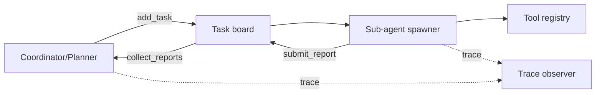
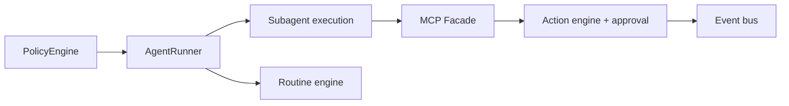
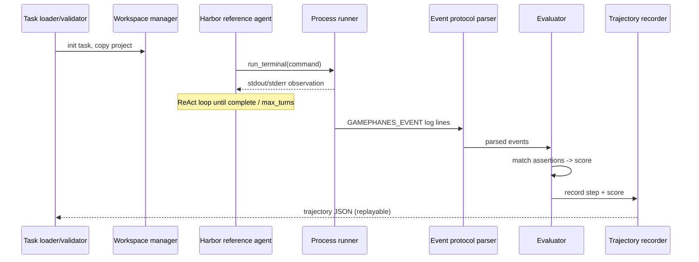
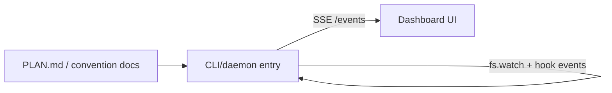

# Weekly Agentic AI Scan — 2026-08-26

**Nguồn dữ liệu:** GitHub public search API (`created:>2026-08-19 stars:>200`, query `agent OR "multi-agent" OR agentic`) — 9 kết quả, đủ để không cần fallback sang `pushed:>7d stars:>500` (query này quá nhiễu vì gần như mọi repo lớn đều "pushed gần đây").

## Executive Summary

- Tuần này nổi bật 2 pattern kiến trúc lặp lại: **hierarchical-supervisor bọc quanh runtime agent có sẵn** (Rome bọc Claude Agent SDK + Codex; FrontierAgent tự viết ReAct kernel + coordinator/task-board) — không repo nào thực sự phát minh loop reasoning mới, giá trị nằm ở lớp orchestration/policy/observability xung quanh.
- Điểm sáng thực dụng nhất tuần: `GamePhanes` mang eval methodology nghiêm túc (trajectory recording có schema version, assertion-based scoring, Harbor/OpenAI-compatible reference agent) cho một domain benchmark hẹp nhưng cụ thể (Godot game-repair), và `agenttrail` giải bài toán quan sát agent bằng thiết kế "dual-signal" (khai báo trong `PLAN.md` vs. thực tế filesystem) trong một file Node ~470 dòng, zero-dependency.
- Red flag chung: 3/4 repo được chọn có tuổi đời 3-5 ngày với tăng trưởng sao rất nhanh (337-691 sao) mà không xác minh được số contributor thật (GitHub contributors API/graph bị chặn hoặc cần JS) — nên đọc các con số "stars" trong báo cáo này với sự dè dặt, không coi là proxy độ trưởng thành. Một repo thứ 5 (`halofyai/halofy`, governance/RBAC layer) bị loại khỏi digest vì tín hiệu bất thường mạnh nhất (1 contributor, 12 commit, 235 sao trong 4 ngày).

## Mục lục

1. [ApodexAI/FrontierAgent](#1-apodexaifrontieragent)
2. [rome-os/rome](#2-rome-osrome)
3. [GamePhanes/GamePhanes](#3-gamephanesgamephanes)
4. [sodiumsun/agenttrail](#4-sodiumsunagenttrail)

---

## 1. ApodexAI/FrontierAgent

**Link:** https://github.com/ApodexAI/FrontierAgent

### §1 — Quick Context

Framework agent runtime + TUI terminal, hỗ trợ cả chế độ đơn-agent (ReAct) lẫn đa-agent điều phối qua task board. Stack: Python 3.12 (`uv`), OpenAI-compatible endpoints + Anthropic SDK, Rich/Textual TUI, Docker/SGLang cho self-host. Repo health: 691 sao, 63 fork, `fork:false`, tạo 2026-08-22, push gần nhất 2026-08-26 (repo mới ~4 ngày tuổi khi khảo sát); số contributor không xác định được (API bị chặn 403). Có CI thật (`.github/workflows/ci.yml`: ruff, pyright, pytest ×2, benchmark-registry check trên 97 task) và ≥66 file test.

### §2 — Architecture Deep-Dive

**A. Component inventory**
- `ReAct kernel` (`frontier_agent/core/runtime/`) — vòng lặp think→act→observe cho chế độ đơn-agent.
- `Coordinator/Planner` (`workflows/agent_team/spec.py`, `edges.py`) — lập kế hoạch và phân task cho chế độ đa-agent.
- `Task board` (`plugins/tools/task_board.py`) — trạng thái task (open/in_progress/resolved/cancelled), giao tiếp giữa coordinator và sub-agent.
- `Sub-agent spawner` (`plugins/tools/create_subagent.py`) — tạo tối đa 20 sub-agent/lệnh, giới hạn 100 turn/session.
- `Tool registry` (`frontier_agent/core/tool.py`) — decorator `@tool` tự sinh JSON schema function-calling từ type hint/docstring.
- `Message schema` (`frontier_agent/core/messages.py`) — định dạng OpenAI Chat Completions, có field nội bộ lọc trước khi gửi provider (`for_wire()`).
- `Event/state store` (`frontier_agent/state/event_store/sqlite.py`) — SQLite.
- `Model registry` (`frontier_agent/model_registry.yaml`) — map regex model-ID → định dạng reasoning-content khác nhau giữa provider.
- `Guards` (nêu trong `workflows/agent_team/README.md`: RepetitionGuard, NoProgressGuard, SpawnGuard) — chặn vòng lặp vô hạn, giới hạn depth/parallelism/wall-time khi spawn sub-agent.
- `Trace observer` (`apodex/trace.py`) — ghi JSONL mọi LLM call/tool call.
- `Sandbox layer` (`plugins/tools/_bash_policy.py`, `_net_guard.py`, `_path_auth.py`, `_exec_cgroup.py`, `_sandbox.py`).

**B. Control flow — Hierarchical-supervisor (chế độ Agent Team) + ReAct-style (chế độ đơn-agent), 2 mode tách biệt**

Happy path của Agent Team:
1. Coordinator nhận câu hỏi, vào giai đoạn "planning" (chỉ được dùng tool đọc + task board).
2. `finish_planning()` mở khóa, coordinator `add_task()` để post task lên Task board.
3. Sub-agent (S1..SN) lấy task, chạy song song trong giới hạn `SpawnGuard` (depth/parallelism/wall-time).
4. Mỗi sub-agent dùng Tool registry (web/file/sandbox) để thực thi.
5. Sub-agent gọi `submit_report` lên Task board; mọi bước được `Trace observer` ghi JSONL.
6. Coordinator `collect_reports`, tổng hợp câu trả lời cuối.

**C. State & data flow:** Message theo OpenAI Chat Completions format (`core/messages.py`); trạng thái lưu SQLite event store + session checkpoint. Context window quản lý theo profile: `simple` giữ 5 tool-result gần nhất, `benchmark` có LLM summarization khi áp lực bộ nhớ, `tui` dùng "filesystem spillover" (field `spill_refs`) — có bộ test riêng cho compaction (`test_compaction_observability.py`, `test_long_run_compaction.py`).

**D. Tool integration:** Native function-calling — `@tool` decorator sinh schema tự động. Đăng ký tường minh: thêm file vào `plugins/tools/` không tự cấp quyền, phải vào allowlist. Sandbox thật: cgroup exec, net guard, path auth — không phải chỉ mô tả suông. Không có bằng chứng MCP.

**E. Memory architecture:** Ngắn hạn = lịch sử message cắt theo profile; trung hạn = LLM summarization khi memory pressure; tràn = spillover filesystem + SQLite. Không có retrieval vector/RAG — không xác định từ code.

**F. Model orchestration:** `model_registry.yaml` chuẩn hóa format "reasoning content" giữa Claude (content_block), DeepSeek/Doubao (reasoning_content), OpenAI (none), Apodex (tag) — đây là lớp adapter, không phải router/fallback thật. Mỗi sub-agent bind 1 LLM riêng, chạy song song cùng loại model (không phải ensemble đa-model). Không có fallback đa-model dù docs có nhắc tới.

**G. Observability & eval:** `TraceObserver` ghi JSONL tại `.apodex/runs/<session-id>/trace.jsonl` (LLM call, tool call, duration, error, turn count). Bộ observer theo hook `on_loop_end()` (FinalAnswerSalvageObserver, ReporterStreamObserver...). `benchmarks/` chứa eval harness công khai (BrowseComp, HLE, GDPval), CI riêng kiểm registry 97 task.

**H. Extension points:** Workflow mới = thư mục con trong `workflows/` có `register(ctx)` — tự động discover qua `workflow_loader.py`. Tool mới = thêm vào `plugins/tools/` + allowlist thủ công. Model mới = bất kỳ endpoint OpenAI-compatible qua `.env`.

### §3 — Architecture Diagram

### §4 — Verdict

Không phải wrapper mỏng: sandbox thật (cgroup/net/path guard), event store SQLite, tracing JSONL, plugin loader, và bộ test chuyên biệt cho compaction/repetition/spawn-guard. Điểm đáng học cụ thể: `model_registry.yaml` chuẩn hóa "reasoning-content" khác biệt giữa 4 provider trong một schema thống nhất — vấn đề thực tế mà nhiều framework khác bỏ qua. Red flags: repo 4 ngày tuổi, công ty đứng sau (apodex.ai) khiến tỷ lệ sao/tuổi khả nghi marketing; không xác định được contributor thật; claim "fallback" trong docs không có bằng chứng code. Cần đào sâu: điểm benchmark thực tế trên 97-task registry, mức độ tập trung quyền tác giả.

---

## 2. rome-os/rome

**Link:** https://github.com/rome-os/rome

### §1 — Quick Context

"Hệ điều hành agent" đóng gói Claude Agent SDK + OpenAI Codex thành các "app" có bộ nhớ/workflow riêng thay vì một chat thread đơn thuần. Stack: TypeScript monorepo (pnpm, Node 24+), phụ thuộc trực tiếp `@anthropic-ai/claude-agent-sdk@0.2.90` và `@openai/codex@0.144.5`, Hono (API), Drizzle ORM + Postgres/SQLite, OpenTelemetry đầy đủ, kênh Discord/Telegram/WhatsApp/Lark. Repo health: 339 sao, 18 fork, tạo 2026-08-23, push gần nhất 2026-08-26 (~3 ngày tuổi); ≥6 tác giả commit quan sát được nhưng số contributor chính xác không xác định (API bị chặn). CI đầy đủ: lint, typecheck, unit sharded, integration, e2e, Playwright layout test.

### §2 — Architecture Deep-Dive

**A. Component inventory**
- `AgentRunner` (`packages/core/src/core/agent-runner.ts`) — vòng lặp thực thi turn, trừu tượng hóa `ModelProvider`.
- `Provider adapters` (`anthropic-provider.ts`, `codex-app-server-provider.ts`) — kết nối Claude Agent SDK và Codex app-server làm reasoning engine thực sự (không tự viết reasoning loop).
- `ActionRegistry` (`packages/core/src/actions/registry.ts`) — đăng ký tool theo tên, cấp catalog theo allow-list.
- `Action engine + approval` (`actions/engine.ts`, `approval-handler.ts`) — thực thi action, có gate phê duyệt con người cho hành động nhạy cảm.
- `MCP Facade` (`packages/core/src/core/mcp-facade.ts`) — lớp JSON-schema trung gian expose `list_actions`, `execute_action`, `ask_question`, `propose_routine`, `defer` như MCP tool.
- `Subagent execution` (`subagent-execution.ts` + `packages/core/agents/main.yaml`) — orchestrator (model: opus) quyết định delegate cho subagent (coding:planning / assistant:explore...).
- `PolicyEngine` (`policy-engine.ts`) — allow vs. sentinel_review theo sender/thread/tier/channel.
- `Routine engine` (`packages/core/src/routines/engine.ts` + trigger-providers) — lên lịch tác vụ định kỳ.
- `Event bus` (`packages/core/src/events/event-bus.ts`).
- `Memory templates` (`packages/core/memory.example/`: MEMORY.md, IDENTITY.md, journal/, topics/, relationship/) — bộ nhớ dựa file markdown do chính agent đọc/ghi, không phải vector DB.

**B. Control flow — Hierarchical-supervisor (bọc quanh 2 runtime agent có sẵn)**
1. Message vào qua channel adapter → PolicyEngine allow/sentinel_review.
2. AgentRunner mở session, nạp system prompt + tool catalog từ `main.yaml`.
3. Orchestrator (model cố định: opus) tự quyết xử lý trực tiếp hay `startSubagent()` delegate.
4. Cần công cụ → gọi MCP tool `execute_action`, có thể chờ approval nếu hành động nhạy cảm.
5. Subagent trả kết quả qua completion promise; orchestrator tổng hợp.
6. Ghi memory (file markdown) hoặc tạo routine mới nếu cần; mọi quyết định ghi OpenTelemetry span.

**C. State & data flow:** Message = `AgentMessage` qua async iterable (`ModelSession.events`). State lưu Drizzle ORM, DB "system" và "app" tách riêng. Context window: không xác định từ code — chỉ thấy MEMORY.md "always-loaded index" + topic file "loaded on-demand", không thấy cơ chế summarization/compaction tự động.

**D. Tool integration:** Native function-calling qua Claude Agent SDK; `mcp-facade.ts` định nghĩa schema JSON trung lập, adapter Anthropic convert sang Zod bằng `createSdkMcpServer()`. Validation qua `ajv`/`zod`. Sandbox: `action-subprocess.ts`, `worker-runtime.ts` gợi ý cô lập subprocess/worker; `approval-handler.ts` gate bằng con người cho hành động rủi ro.

**E. Memory architecture:** File markdown ở `~/.rome/<profile>/`, không có dependency embedding/vector DB trong package.json. Agent tự Read/Write/Edit để "truy xuất" — MEMORY.md luôn nạp, journal/topics/relationship nạp theo yêu cầu (giống context-engineering thủ công hơn RAG).

**F. Model orchestration:** Đa provider (Anthropic opus/sonnet/haiku/"Fable" và OpenAI gpt-5.6-sol/terra qua Codex). `main.yaml` cố định orchestrator dùng model opus. Có khái niệm "auto" routing nhưng logic backend không xác định từ code đã đọc. Nhiều subagent chạy song song qua `active-subagent-registry.ts`.

**G. Observability & eval:** OpenTelemetry đầy đủ (traces/metrics/logs) — `agent-trace-recorder.ts`, `turn-span-translator.ts`, dashboard riêng ở `infra/observability/`. Eval hook: không xác định từ code (chỉ có vitest thông thường, không thấy eval/replay framework riêng).

**H. Extension points:** SDK công khai `@rome-os/app-runtime` + `@rome-os/app-web-sdk` để viết "Rome App" riêng (`rome_apps/*`); subagent/tool mới khai báo bằng YAML (`agents/*.yaml`) không cần sửa core.

### §3 — Architecture Diagram

### §4 — Verdict

Codebase thật, có CI/test suite đầy đủ — không phải mã nguồn rỗng đằng sau README đẹp. Nhưng "kiến trúc agentic" thực chất là lớp orchestration/policy/memory nhẹ bọc quanh 2 runtime agent có sẵn (Claude Agent SDK + Codex) chứ không tự xây reasoning loop mới — giá trị novel nằm ở việc dùng "app" (có memory/workflow riêng) thay thế "chat thread" làm đơn vị đóng gói, và memory hoàn toàn dựa file markdown agent tự điều hướng thay vì vector DB. Red flags: repo 3 ngày tuổi nhưng 339 sao (cần cảnh giác nguồn tăng trưởng); contributor thật không xác minh được; logic "auto" model-routing không kiểm chứng được qua code đã đọc. Đáng đào sâu: cơ chế "auto" routing thực sự chọn model theo tiêu chí gì.

---

## 3. GamePhanes/GamePhanes

**Link:** https://github.com/GamePhanes/GamePhanes

### §1 — Quick Context

Benchmark/harness đánh giá AI coding agent sửa lỗi game Godot qua vòng lặp inspect→edit→run→observe→diagnose→repair→verify (mô hình kiểu Terminal-Bench/Harbor cho domain game). Stack: Node.js ≥22 (harness lõi), Python (Harbor integration + reference agent), GDScript (in-game harness), Godot 4.x, Docker cho môi trường task; model tham chiếu là Kimi K3 qua OpenAI-compatible API. Repo health: 337 sao, 6 fork, 0 open issue, 31 commit trên main, push gần nhất 2026-08-25; số contributor không xác định. Có CI thật (`.github/workflows/ci.yml`: npm test + npm run validate) và thư mục `test/` với unit test.

### §2 — Architecture Deep-Dive

**A. Component inventory**
- `Task loader/validator` (`src/core/task.js`) — parse & validate `task.json` theo schema v1 (registry, assertions, timeout 0-300s).
- `Workspace manager` (`src/core/workspace.js`) — copy project Godot vào workspace, hash SHA-256 trạng thái ban đầu.
- `Process runner` (`src/runtime/process.js`) — spawn tiến trình Godot, giới hạn timeout (mặc định 15s) và output (2MB).
- `Event protocol parser` (`src/evaluation/protocol.js`) — parse dòng log `GAMEPHANES_EVENT <json>` do harness GDScript emit.
- `Evaluator` (`src/evaluation/evaluator.js`) — so khớp assertion với event (operator exists/==/!=/>/>=/</<=/includes), tính score = passed/total.
- `Trajectory recorder` (`src/trajectory/recorder.js`) — ghi từng step (action, observation, reward) ra JSON schema versioned, ghi atomic (tmp file + rename).
- `CLI entrypoint` (`src/cli.js`, `bin/gamephanes.js`) — lệnh `doctor|validate|task init|run`; điểm tổng hợp = 20% build + 20% runtime + 60% functional.
- `Harbor reference agent` (`integrations/harbor/openai_tool_agent.py`) — agent tham chiếu gọi model qua OpenAI-compatible API.
- `Response policy` (`integrations/harbor/response_policy.py`) — phân loại `finish_reason` → tools/continue/complete.

**B. Control flow — ReAct-style (agent tham chiếu) trong vòng lặp benchmark do harness điều phối**
1. `gamephanes task init` copy project lỗi vào workspace, sinh `instruction.json`.
2. Reference agent (Kimi K3 qua `OpenAICompatibleToolAgent`) nhận instruction, model trả tool_call `run_terminal`.
3. Agent thực thi lệnh shell trong workspace cô lập, trả stdout/stderr (cắt 30.000 ký tự) làm observation.
4. Lặp Think→Act→Observe tới khi model trả "complete" hoặc chạm `OPENAI_MAX_TURNS` (mặc định 30).
5. `gamephanes run` chạy project qua harness GDScript, parse event `GAMEPHANES_EVENT`, đối chiếu assertions.
6. Evaluator tính score, Trajectory recorder ghi log đầy đủ + report.

**C. State & data flow:** Message agent-model = chat messages chuẩn OpenAI. Giao tiếp game→harness = dòng text JSON prefix `GAMEPHANES_EVENT`. State lưu file: `.gamephanes/workspace.json`, `instruction.json`, trajectory JSON ghi atomic. Không có cơ chế nén/tóm tắt hội thoại — chỉ giới hạn số lượt (`OPENAI_MAX_TURNS`).

**D. Tool integration:** Native function-calling chuẩn OpenAI, chỉ 1 tool đăng ký: `run_terminal` (tham số `command`, chạy trong workspace cô lập). Không có MCP. Validation/sandbox: giới hạn output 30.000 ký tự (agent) + 2MB/timeout 15s (process runner); môi trường task đóng gói Dockerfile riêng, nhưng process runner nội bộ không tự invoke Docker.

**E. Memory architecture:** Skip — chỉ có lịch sử hội thoại trong 1 lượt chạy (turn history), không có long-term/retrieval store.

**F. Model orchestration:** Một agent, một model mỗi job (cấu hình JSON: `model_name: "openai/kimi-k3"`, `n_concurrent_trials: 1`). Không có fallback hay multi-model ensemble trong code — dù biến môi trường `OPENAI_MODEL` cho thấy về nguyên tắc có thể đổi model.

**G. Observability & eval:** Đây là phần lõi của repo. Trajectory recorder ghi từng step (actor, timestamp, action, observation, reward) + trạng thái cuối (passed/failed/error/cancelled) + score, schema versioned, replay được bằng cách đọc lại JSON. Mỗi task = `task.json` + `instruction.md` + Dockerfile + harness `.gd` + bộ assertions + solution oracle. Kết quả "calibrated" đã lưu cho 3 task trong `benchmark/results/`. Không có leaderboard tổng hợp tự động.

**H. Extension points:** Agent mới = viết class Python kế thừa `BaseAgent` (Harbor) và trỏ `import_path` trong job JSON. Task mới = tạo thư mục theo chuẩn Harbor (task.toml, environment/, tests/, solution/) hoặc file JSON + harness `.gd` tương ứng, nộp qua PR.

### §3 — Architecture Diagram

### §4 — Verdict

Điểm đáng chú ý nhất: đây không phải "agent" mà là harness chấm điểm agent theo mô hình Terminal-Bench/Harbor áp dụng cho domain hẹp và cụ thể (sửa lỗi game Godot) — eval methodology có cấu trúc thật (assertion-based, trajectory versioned, solution oracle), agent tham chiếu (Kimi K3, đúng 1 tool `run_terminal`) chỉ dùng để hiệu chuẩn task chứ không phải sản phẩm chính. Red flag: thư mục `oj/` (server Node + Docker chấm bài ZIP) trông như một hệ thống online-judge tách biệt, chưa rõ liên kết với CLI chính hay mức độ trưởng thành. Đáng đào sâu: leaderboard công khai (chưa thấy), và liệu benchmark có mở rộng ra ngoài 3 task đã calibrate hay không.

---

## 4. sodiumsun/agenttrail

**Link:** https://github.com/sodiumsun/agenttrail

### §1 — Quick Context

Dashboard local-first theo dõi trực tiếp hoạt động của Claude Code (và tuyên bố hỗ trợ Codex/Cursor) qua file-watcher + file quy ước `PLAN.md`, không gửi prompt hay sửa code. Stack: Node.js ≥20 (ESM), toàn bộ backend gói trong 1 file `bin/agenttrail.mjs` (~470 dòng, zero dependency), frontend là 1 file HTML tĩnh dùng vanilla JS + SVG + EventSource. Repo health: 246 sao, 12 fork, 3 open issue, MIT license, tạo 2026-08-21, push gần nhất 2026-08-25 (~5 ngày tuổi); không có `.github/workflows` → không có CI.

### §2 — Architecture Deep-Dive

**A. Component inventory**
- `CLI/daemon entry` (`bin/agenttrail.mjs`) — file Node.js duy nhất: CLI parser, HTTP server, file watcher, `PLAN.md` parser, hook receiver, multi-repo discovery.
- `Dashboard UI` (`public/index.html`) — single-page vanilla JS, render file tree + component graph (SVG tự tính layout theo dependency depth) + agent run card, nhận cập nhật qua `EventSource('/events')`.
- `Convention/scaffold docs` (`PLAN.md`, `CLAUDE.md`, `AGENTS.md` ở repo root) — file mẫu convention do lệnh `init` sinh ra, agent phải tự cập nhật khi làm việc.

**B. Control flow — Event-driven / state-machine (bản thân tool không điều phối agent, chỉ quan sát)**
1. `npx agenttrail init` scaffold `PLAN.md`, cài Claude Code hook vào `.claude/settings.local.json`.
2. `npx agenttrail --open` khởi động daemon Node, `fs.watch()` đệ quy theo dõi repo + `PLAN.md`.
3. Song song, Claude Code gửi hook events (PreToolUse/PostToolUse/Stop/SessionStart) qua POST tới route `/hook`.
4. Daemon parse `PLAN.md` bằng regex (component `{#id}`, task `[ ]/[~]/[x]/[!]`), cập nhật state "live run" (tool hiện tại, 8 tool gần nhất, todo list).
5. State mới được đẩy qua Server-Sent Events tới route `/events`; UI render lại từng phần.
6. Run tự hết hạn sau 2 giờ hoặc 15 phút không hoạt động; daemon tự khám phá daemon anh em trên cổng 5330-5344 để liên kết chéo dự án.

**C. State & data flow:** Sự kiện là hook payload JSON POST vào `/hook`. Mô hình state là tổ hợp "declared intent" (từ `PLAN.md`, bền) và "live signal" (hoạt động file/tool, phai dần theo thời gian). Lưu trữ persist dạng file trong `~/.agenttrail/<repo-hash>/` (định dạng chi tiết không xác định từ code đã đọc). Route `/model` trả snapshot JSON toàn bộ state. Retention: run auto-expire 2h/15 phút idle, lịch sử giữ 8 tool-call gần nhất mỗi run.

**D. Tool integration:** Tích hợp qua Claude Code hooks (PreToolUse, PostToolUse, Stop, SessionStart) cấu hình trong `.claude/settings.local.json`; CLI subcommand `hook` relay payload từ stdin ra HTTP tới mọi daemon local đang chạy (hỗ trợ multi-repo). README nhắc Codex/Cursor trong mô tả nhưng cơ chế đọc log cụ thể của 2 công cụ này không xác định từ code đã kiểm tra — chỉ luồng hook Claude Code có bằng chứng rõ.

**E. Memory architecture:** Skip — đây là tool quan sát, không phải agent có bộ nhớ.

**F. Model orchestration:** Skip — không áp dụng.

**G. Observability & eval:** Đây là core của repo. Daemon HTTP local có route `/` (dashboard), `/model` (JSON snapshot toàn state), `/events` (SSE stream realtime), `/hook` (nhận hook payload), `/whoami` (định danh project/port). Không có replay lịch sử dài hạn, không cost/latency tracking, không trace framework kiểu LangSmith — đây là live map tại-thời-điểm-hiện-tại. "Eval" duy nhất là so khớp "declared" (checkbox trong PLAN.md) với "actual" (file thực sự đổi) để phát hiện agent khai báo tiến độ sai lệch với bằng chứng thực tế trên filesystem.

**H. Extension points:** Thêm component theo dõi mới = sửa `PLAN.md` (khai `{#id}`, `files: [globs]`, task list) — không cần code. Thêm nguồn agent mới (Codex/Cursor riêng) không xác định từ code đã xem — chỉ thấy route `/hook` generic, có thể agent khác gọi cùng route nhưng chưa có adapter/plugin API tách biệt.

### §3 — Architecture Diagram

### §4 — Verdict

Điểm đáng chú ý cụ thể: toàn bộ backend nằm trong đúng 1 file Node ~470 dòng, zero-dependency, và mô hình dữ liệu "dual-signal" (PLAN.md khai báo vs. filesystem thực tế) để bắt agent "nói dối" tiến độ là một ý tưởng nhỏ nhưng thực dụng, hiếm thấy ở các dashboard quan sát agent khác (thường chỉ hiển thị log thô). Red flag: không CI/test, tuyên bố hỗ trợ Codex/Cursor chưa có bằng chứng code (chỉ Claude Code hook được xác nhận), số contributor không xác minh được. Đáng đào sâu: cơ chế parse hook thực tế cho Codex/Cursor, định dạng lưu trữ chính xác trong `~/.agenttrail/`.
