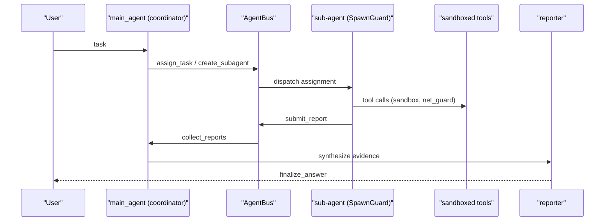
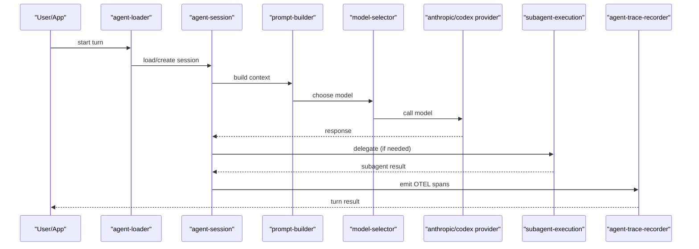
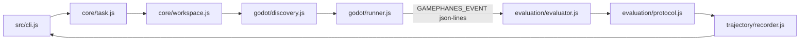
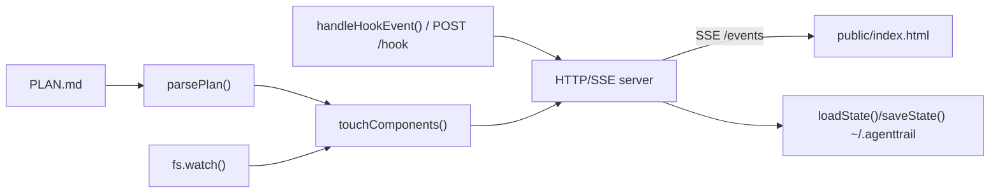

# Agentic AI Weekly Scan — 2026-08-27

## Tóm tắt điều hành

- Tuần này quét được 10 repo agentic mới nổi (created > 2026-08-20, stars > 200) qua GitHub Search API; sau khi áp bộ lọc loại trừ (awesome-list, tutorial, fork, thin wrapper) và bộ lọc liên quan (kiến trúc mới, eval nghiêm túc, kỹ thuật production-grade, có tài liệu kỹ thuật đi kèm), chọn ra **4 repo** đáng đọc sâu.
- Điểm chung đáng chú ý: hai repo (`FrontierAgent`, `rome`) đầu tư mạnh vào **guardrail vận hành thật** (sandbox cgroup, spawn-depth limit, cost accounting per-provider) thay vì chỉ là "wrapper gọi LLM"; một repo (`GamePhanes`) mang một **phương pháp eval mới** (oracle runtime thay vì LLM-judge); một repo (`agenttrail`) là ví dụ tốt về **observability tối giản, zero-dependency** cho chính các coding agent khác.
- Rủi ro chung cần theo dõi: tất cả đều rất mới (tạo trong tuần 2026-08-20 → 2026-08-27), nên số liệu sao/fork/contributor còn thấp và chưa có track record; một số tuyên bố trong README (ví dụ điểm benchmark, độ ổn định sandbox) chưa được xác minh bằng cách chạy thử code.

## Mục lục

1. [ApodexAI/FrontierAgent](#apodexai-frontieragent)
2. [rome-os/rome](#rome-os-rome)
3. [GamePhanes/GamePhanes](#gamephanes-gamephanes)
4. [sodiumsun/agenttrail](#sodiumsun-agenttrail)

---

## ApodexAI/FrontierAgent

**Link:** https://github.com/ApodexAI/FrontierAgent

### 1. Quick context

Agent runtime + CLI/TUI mã nguồn mở cho nghiên cứu dài hơi, có hai chế độ: ReAct đơn agent và "Agent Team" điều phối nhiều sub-agent chạy song song. Stack: Python 3.12, `uv` làm package manager, endpoint tương thích OpenAI, có tuỳ chọn tự host qua SGLang. Repo health: ~1.000 stars, 85 forks, license Apache 2.0, có `.github/workflows` (CI), có thư mục `tests/` và `benchmarks/` riêng, hoạt động rất gần đây (pushed 2026-08-27).

### 2. Kiến trúc chi tiết

**A. Component inventory**
- `main_agent` (coordinator) — `workflows/agent_team/nodes/main_agent.py`: agent chính nhận task, phân rã và điều phối.
- `AgentBus` — được mô tả trong `workflows/agent_team/README.md` ("main agent communicates with sub-agents through `AgentBus`"): kênh giao tiếp giữa coordinator và sub-agent.
- `SpawnGuard` — cũng mô tả trong `workflows/agent_team/README.md`: "enforces depth, parallelism, and wall-time limits" khi spawn sub-agent.
- `scheduler` / `process_manager` — `frontier_agent/scheduling/scheduler.py`, `frontier_agent/scheduling/process_manager.py`: lập lịch và quản lý vòng đời tiến trình sub-agent.
- `reporter` / `fast_reporter_v1` — `workflows/agent_team/nodes/reporter.py`, `workflows/agent_team/nodes/fast_reporter_v1.py`: node tổng hợp bằng chứng thành báo cáo cuối.
- Tool registry & sandbox — `plugins/tools/` chứa `assign_task.py`, `create_subagent.py`, `submit_report.py`, `collect_reports.py`, `task_board.py`, `finalize_answer.py`, cùng nhóm sandbox `_sandbox.py`, `_exec_cgroup.py` (cgroup), `_net_guard.py`, `_path_auth.py`, `_bash_policy.py`, `_code_sanitize.py`.
- Core message/tool schema — `frontier_agent/core/messages.py`, `frontier_agent/core/tool.py`, `frontier_agent/core/protocols.py`, `frontier_agent/core/loop_types.py`, `frontier_agent/core/llm.py`.
- Model registry — `frontier_agent/model_registry.yaml`.

**B. Control flow pattern**: **Hierarchical / supervisor-workers** (chế độ Agent Team), song song một chế độ **ReAct-style đơn agent** (`workflows/stateful_react_agent/`) cho task đơn giản. Happy path (Agent Team):
1. Người dùng gửi task cho `main_agent` (coordinator).
2. Coordinator phân rã task, gọi `create_subagent.py`/`assign_task.py` để dispatch; `process_manager.py`/`scheduler.py` quản lý tiến trình con, `SpawnGuard` giới hạn depth/parallelism/wall-time.
3. `AgentBus` chuyển message giữa coordinator và các sub-agent.
4. Sub-agent thực thi tool trong sandbox (`_sandbox.py`, `_exec_cgroup.py`, `_net_guard.py`) — được phép web/file/shell nhưng không tự spawn team mới trừ khi ngân sách runtime cho phép (theo README).
5. Sub-agent gọi `submit_report.py`; coordinator `collect_reports.py` tổng hợp.
6. `reporter.py`/`fast_reporter_v1.py` review bằng chứng, `finalize_answer.py` trả kết quả cuối.

**C. State & data flow**: message format định nghĩa ở `frontier_agent/core/messages.py`; theo README có filesystem theo task với `/inputs` (read-only), `/workspace`, `/outputs`. Không xác định từ code cơ chế nén context cụ thể (context window management) — chỉ thấy 3 guardrail thời gian/token cho streaming reply.

**D. Tool/capability integration**: tool được đăng ký như module riêng trong `plugins/tools/` (mỗi tool = 1 file, ví dụ `bash.py`, `web_search.py`, `read_file.py`, `run_python_code.py`); validate/sandbox qua `_bash_policy.py`, `_code_sanitize.py`, `_path_auth.py`, `_exec_cgroup.py` — đây là sandbox cấp OS (cgroup) thật, không chỉ prompt-level. Không xác định rõ từ danh sách thư mục cơ chế gọi tool là native function-calling hay JSON parsing (cần đọc `frontier_agent/core/tool.py` sâu hơn).

**E. Memory**: chỉ có session checkpointing + local tracing + lệnh `/revert` để hoàn tác thay đổi (theo README) — không thấy retrieval/long-term memory rõ ràng, nên không xác định cơ chế semantic memory.

**F. Model orchestration**: có `model_registry.yaml` cho phép cấu hình nhiều model, hỗ trợ endpoint OpenAI-compatible và self-host qua SGLang; chi tiết routing per-role không xác định từ các file đã fetch.

**G. Observability & eval**: guardrail chống loop cụ thể — `reasoning_only_timeout_s` (120s), `reasoning_only_max_tokens` (16.384), `logical_call_timeout_s` (900s), cộng `DuplicateQueryRollbackObserver`, `RepetitionGuard`, `TextRepetitionGuard`. Có benchmark harness riêng (`benchmarks/`) hỗ trợ judge deterministic hoặc model-based, cho các bộ BrowseComp, SuperChem, FrontierScience, DeepSearchQA; `apodex/` chứa CLI/TUI với sessions/traces.

**H. Extension points**: thêm tool mới = thêm file vào `plugins/tools/`; thêm pipeline mới = thêm workflow vào `workflows/` (nạp qua `frontier_agent/scheduling/workflow_loader.py`); thêm model = sửa `model_registry.yaml`.

### 3. Sơ đồ kiến trúc

### 4. Verdict

Điểm mới thật sự: sandbox cấp cgroup (`_exec_cgroup.py`) + `_net_guard.py` + `_path_auth.py` cho sub-agent là bảo vệ cấp hệ điều hành, không phải chỉ system-prompt "đừng làm X"; `SpawnGuard` giới hạn depth/parallelism/wall-time cho kiến trúc đa agent đệ quy là cơ chế an toàn cụ thể hiếm thấy được document rõ. Red flag: rất nhiều file tool bắt đầu bằng `_` (internal/private API) cho thấy bề mặt API chưa ổn định; chưa xác minh được điểm benchmark thực tế (không đọc `docs/eval.md`) nên chưa biết chất lượng thật của Agent Team so với single-agent. Câu hỏi mở: `SpawnGuard` xử lý thế nào khi team lồng nhiều cấp; sandbox cgroup có phải Linux-only không.

---

## rome-os/rome

**Link:** https://github.com/rome-os/rome

### 1. Quick context

"Agentic OS" — nền tảng cho agent chạy dài hạn với session, app, action, skill, hook như các nguyên thủy hệ điều hành, hỗ trợ đa provider (Anthropic, Codex). Stack: TypeScript, Node.js 24+, pnpm monorepo, Docker, Drizzle ORM, OpenTelemetry + ClickHouse cho observability. Repo health: 362 stars, 19 forks, MIT license, có CI badge/`.github/workflows`, rất nhiều file `*.test.ts` cùng `vitest.config.ts`.

### 2. Kiến trúc chi tiết

**A. Component inventory** (tất cả trong `packages/core/src/core/`):
- `agent-loader.ts` — nạp cấu hình agent.
- `agent-session.ts`, `agent-session-bridge.ts` — quản lý session và cầu nối session giữa các tiến trình/kênh.
- `agent-runner.ts`, `rpc-agent-runner.ts` — chạy vòng lặp turn của agent.
- `active-subagent-registry.ts`, `subagent-execution.ts` — đăng ký và thực thi sub-agent được delegate.
- `model-selector.ts`, `model-resolver.ts` — chọn/giải quyết model cho từng lời gọi.
- `anthropic-provider.ts`, `codex-app-server-provider.ts` — adapter cho từng provider, kèm `anthropic-usage-limit.ts`, `codex-usage-limit.ts`, `anthropic-auth-revoked.ts`, `codex-auth-revoked.ts` xử lý lỗi/giới hạn riêng từng bên.
- `provider-accounting.ts` — theo dõi cost/usage theo provider.
- `policy-engine.ts` — engine kiểm tra guardrail/quyền.
- `hook-loader.ts`, `hook-recursion.ts` — nạp và bảo vệ đệ quy cho lifecycle hook.
- `turn-middleware.ts`, `middleware-chain.ts` — pipeline xử lý theo từng turn.
- `skill-catalog.ts`, `slash-skill-command.ts` — catalog "skill" ngôn ngữ tự nhiên nạp theo nhu cầu.
- `prompt-builder.ts` — dựng prompt/context.
- `agent-trace-recorder.ts` — ghi trace OTEL.
- `session-manager.ts` — quản lý vòng đời session (mô tả trong `packages/core/src/sessions/` header nhưng file thực tế nằm ở `packages/core/src/core/session-manager.ts`).
- `mcp/` (thư mục con) — tích hợp Model Context Protocol.

**B. Control flow pattern**: **Hierarchical supervisor + subagent delegation trên một pipeline middleware/hook (session state machine)** — mỗi session là một chuỗi turn được xử lý qua middleware chain, có thể delegate sang subagent con.
1. Client gọi agent qua `agent-loader.ts`; `agent-session.ts` tạo/khôi phục session.
2. `prompt-builder.ts` dựng context, `skill-catalog.ts` nạp skill liên quan on-demand.
3. `model-selector.ts`/`model-resolver.ts` chọn provider, gọi qua `anthropic-provider.ts` hoặc `codex-app-server-provider.ts`.
4. `turn-middleware.ts` chạy `hook-loader.ts` và `policy-engine.ts` trước/sau mỗi action/tool call.
5. Nếu cần delegate, `subagent-execution.ts` spawn sub-agent, theo dõi qua `active-subagent-registry.ts`.
6. `agent-trace-recorder.ts` phát OTEL span (`model.call`, `agent:{name}`, `summon:{child}`, `action:{name}`) về pipeline Collector → ClickHouse.

**C. State & data flow**: state session lưu qua Drizzle ORM (SQL, cấu hình ở `packages/core/drizzle.config.ts`), có thư mục `packages/core/memory.example/` làm ví dụ cấu hình bộ nhớ. Message schema cụ thể (`agent-message.ts`) tồn tại nhưng nội dung chi tiết không xác định từ các file đã fetch. Không xác định cơ chế nén/compaction context cụ thể từ code đã đọc.

**D. Tool/capability integration**: có thư mục `mcp/` riêng trong core → tích hợp qua Model Context Protocol; "action" là thực thể hạng nhất (`docs/architecture/index.md` nhắc "a parked action call, its card, and its resolution... correlated across the chat seam"); `output-schema-validator.ts` và `capability-discovery.ts` phục vụ validate/khám phá capability.

**E. Memory**: có thư mục `memory.example/` nhưng không xác định cơ chế retrieval/summarization cụ thể từ code đã fetch.

**F. Model orchestration**: đa provider thật sự (Anthropic + Codex app-server) với xử lý riêng usage-limit và auth-revoked cho từng bên, cộng `provider-accounting.ts` gộp cost — đây là cơ chế fallback/kế toán chi phí cụ thể hơn hầu hết framework agent.

**G. Observability & eval**: pipeline OTEL → Collector → ClickHouse (`docs/observability/schema.md`); metric cụ thể `rome_model_tokens_total`, `rome_model_cost_usd_total`, `rome_action_duration_ms`, `rome_hook_duration_ms`, `rome_session_duration_ms`; span attribute `model.id`, `model.input_tokens`, `model.cost_usd`, `model.stop_reason`. Test: `vitest.config.ts` + rất nhiều `*.test.ts` song hành mỗi module core.

**H. Extension points**: `rome_apps/` (first-party apps), `packages/app-template` (template cho app tuỳ chỉnh), `packages/app-runtime-sdk`/`packages/app-web-sdk` (SDK công khai), `opencli-plugins/` (mở rộng CLI).

### 3. Sơ đồ kiến trúc

### 4. Verdict

Điểm mới thật sự: kiến trúc đa provider (Anthropic + Codex) với xử lý riêng biệt usage-limit/auth-revoked cho từng bên cộng `provider-accounting.ts` gộp cost là một thiết kế routing/fallback production-grade thật, không phải chỉ đổi API key; schema observability OTEL→ClickHouse với cost-per-span gắn sẵn (`model.cost_usd`, `rome_model_cost_usd_total`) chi tiết hơn phần lớn agent framework khác. Red flag: tài liệu `docs/architecture/index.md` khá trừu tượng/prose-heavy ("durable design documentation") thiếu cơ chế cụ thể; bề mặt repo rất lớn (14 package, hàng chục file core) nên chỉ xem qua directory listing không đủ để xác minh mọi tuyên bố. Câu hỏi mở: cơ chế retrieval/compaction thực tế của `memory.example/` là gì; xung đột giữa các session/subagent đồng thời được resolve ra sao ngoài câu "ordering rules that survive crashes".

---

## GamePhanes/GamePhanes

**Link:** https://github.com/GamePhanes/GamePhanes

### 1. Quick context

Benchmark + môi trường mã nguồn mở đánh giá coding agent qua việc build/debug/sửa game Godot bằng vòng lặp phát triển đầy đủ (inspect→edit→run→observe→diagnose→repair→verify), thay vì chỉ so exit-code. Stack: Node.js, Godot engine (headless), Docker cho task container. Repo health: 339 stars, 7 forks, MIT license, có `docs/`, `test/`, `.github/`, kèm `CITATION.cff` cho trích dẫn học thuật.

### 2. Kiến trúc chi tiết

**A. Component inventory**:
- CLI entry — `src/cli.js`: định nghĩa lệnh `doctor`, `validate`, `task init`, `run`, `trajectory validate`, `assets`.
- Task loader — `src/core/task.js`: nạp/giải quyết định nghĩa task JSON.
- Workspace — `src/core/workspace.js`: tạo bản copy tạm của project + hashing.
- Taxonomy — `src/core/taxonomy.js`: phân loại task.
- Godot discovery — `src/godot/discovery.js`: tìm binary Godot.
- Godot runner — `src/godot/runner.js`: chạy project headless, inject harness.
- Evaluator — `src/evaluation/evaluator.js`: hàm `evaluateAssertions` áp assertion deterministic lên event thu được, trả `score`/`passed`/`total`/`results`.
- Protocol — `src/evaluation/protocol.js`: định nghĩa protocol event.
- Trajectory recorder — `src/trajectory/recorder.js`: ghi lại patch, build log, screenshot, cost qua từng vòng lặp.

**B. Control flow pattern**: **Event-driven harness/oracle** — GamePhanes không tự chạy agent (agent là bên ngoài, ví dụ Claude Code/Codex thao tác qua terminal), mà đóng vai trò environment + evaluator quan sát kết quả runtime.
1. `src/cli.js run` nạp task JSON qua `src/core/task.js`.
2. `src/core/workspace.js` tạo bản copy tạm của starter project.
3. `src/godot/discovery.js` định vị Godot; `src/godot/runner.js` import headless và inject harness probe.
4. Harness ghi sự kiện dạng JSON-line có tiền tố `GAMEPHANES_EVENT` trong lúc chạy runtime.
5. `src/evaluation/evaluator.js` áp assertion deterministic lên các event thu được, `src/evaluation/protocol.js` chuẩn hoá kết quả pass/fail.
6. `src/cli.js` tính điểm tổng hợp (20% build + 20% runtime + 60% functional), ghi vào `src/trajectory/recorder.js` nếu bật, xuất báo cáo JSON.

**C. State & data flow**: message format là JSON-line sự kiện tiền tố `GAMEPHANES_EVENT` do harness Godot phát ra; state lưu dạng file JSON (task definition + trajectory report) trên đĩa, không có database. Không áp dụng context window management — GamePhanes không tự gọi LLM (agent chạy bên ngoài).

**D. Tool/capability integration**: không áp dụng theo nghĩa tool-registry cho LLM — GamePhanes là môi trường mà một coding agent bên ngoài thao tác vào (qua terminal), bản thân GamePhanes chỉ cung cấp oracle đánh giá.

**E. Memory**: không có (không phải agent, là eval harness) — bỏ qua mục này.

**F. Model orchestration**: không xác định/không áp dụng — GamePhanes model-agnostic, README chỉ ghi nhận kết quả thử nghiệm với Kimi K3 làm case study, không tự orchestrate model nào.

**G. Observability & eval**: đây là trọng tâm của repo — evaluator deterministic ("Deterministic before subjective: able-to-verify needs skip LLM assessment" theo `docs/architecture.md`), công thức điểm tổng hợp build/runtime/functional rõ ràng, có task công khai lẫn biến thể riêng tư để chống overfit lên benchmark, `trajectory/recorder.js` lưu đầy đủ patch/log/screenshot/cost để replay, `docs/benchmark-quality.md` bàn về chất lượng benchmark, `CITATION.cff` cho thấy định hướng công bố học thuật.

**H. Extension points**: thêm benchmark task mới theo cấu trúc `benchmark/harbor-tasks/<task-name>/` (`task.toml`, `instruction.md`, `environment/`, `tests/`, `solution/`); `docs/registry.js` gợi ý có registry duyệt task được.

### 3. Sơ đồ kiến trúc

### 4. Verdict

Điểm mới thật sự: phương pháp eval lấy chính runtime của game engine làm oracle xác thực (deterministic assertion trên event thật) thay vì dùng LLM-judge chủ quan, kết hợp điểm tổng hợp build/runtime/functional và tách task công khai/riêng tư để chống "học tủ" — đây là methodology eval nghiêm túc hơn phần lớn benchmark coding-agent hiện có. Red flag: theo README chỉ mới 3 task được calibrate với điểm oracle/NOP, và mới có 1 case study (Kimi K3) — chưa đủ dữ liệu để tin cậy khả năng phân biệt (discriminative power) của benchmark; bản thân repo không orchestrate agent nào nên xếp vào "agentic AI" hơi rộng nghĩa (nó là hạ tầng đánh giá agent, không phải agent). Câu hỏi mở: task riêng tư có thực sự được giữ kín hay chỉ gitignore cục bộ; giao thức JSON-line có xử lý nondeterminism khi render Godot khác platform không.

---

## sodiumsun/agenttrail

**Link:** https://github.com/sodiumsun/agenttrail

### 1. Quick context

Dashboard observability cục bộ, zero-dependency, đối chiếu ý định khai báo (`PLAN.md`) của một coding agent với những gì nó thực sự chạm vào trên filesystem, theo thời gian thực qua hook của Claude Code/Codex/Cursor. Stack: Node.js ≥20, vanilla JS/HTML, không build step, không database. Repo health: 268 stars, 15 forks, MIT license; README nêu rõ không có eval/test/CI nào trong repo, và directory listing không thấy thư mục `test/` hay `.github/workflows`.

### 2. Kiến trúc chi tiết

**A. Component inventory** (tất cả bằng chứng từ `bin/agenttrail.mjs`, 467 dòng, và `package.json`):
- PLAN.md parser — hàm `parsePlan()` trong `bin/agenttrail.mjs`: parse quy ước markdown thành đồ thị component/task với `needs:`/`links:`/`files:`.
- Filesystem watcher — `fs.watch(repo, {recursive:true}, ...)` trong `bin/agenttrail.mjs`: quan sát mọi ghi file thật, độc lập với hook.
- Component matcher — hàm `touchComponents()`/`rebuildMatchers()` trong `bin/agenttrail.mjs`: map file vừa ghi vào component tương ứng qua glob `files:`.
- Hooks adapter — hàm `handleHookEvent()`/`relayHook()` trong `bin/agenttrail.mjs`: nhận payload hook Claude Code (`PreToolUse`/`PostToolUse`/`Stop`/`SessionStart`) qua `POST /hook`.
- Live run tracker — hàm `runFor()`/`liveRuns()` trong `bin/agenttrail.mjs`: state phiên chạy hiện tại (tool đang chạy, todo, lịch sử tool call gần nhất).
- HTTP/SSE server — `http.createServer(...)` trong `bin/agenttrail.mjs`, endpoint `/model`, `/events` (Server-Sent Events), `/hook`, `/whoami`.
- State persistence — hàm `loadState()`/`saveState()` trong `bin/agenttrail.mjs`: snapshot JSON tại `~/.agenttrail/<sha1-repo>.json`.
- Multi-repo board discovery — hàm `discoverBoards()` trong `bin/agenttrail.mjs`: các daemon ở cổng 5330-5344 tự tìm nhau qua `/whoami`.
- Dashboard frontend — `public/index.html`: vẽ bản đồ SVG trực tiếp từ state server trả về.

**B. Control flow pattern**: **Event-driven observer / reconciliation loop** — đối chiếu trạng thái "khai báo" (PLAN.md) với trạng thái "quan sát" (filesystem + hook), không phải bản thân một agent orchestrator.
1. `agenttrail init` scaffold `PLAN.md` và nối hook Claude Code vào `.claude/settings.local.json` (hàm `installHooks()`).
2. Daemon khởi động (`listenWithFallback()`), đọc và parse `PLAN.md` (`parsePlan()`), khôi phục state đã lưu (`loadState()`).
3. Khi agent làm việc, Claude Code phát hook event; lệnh `agenttrail hook` (`relayHook()`) forward JSON đó tới `/hook` của daemon.
4. `handleHookEvent()` cập nhật run hiện tại (tool đang chạy, todo từ `TodoWrite`); song song, `fs.watch` độc lập phát hiện file thực sự bị ghi.
5. `touchComponents()` đối chiếu file vừa ghi với glob `files:` của từng component trong PLAN.md, đánh dấu component đó "live" bất kể checkbox khai báo thế nào.
6. Server đẩy state mới cho browser qua SSE (`broadcast()`/`broadcastTick()` trên endpoint `/events`), hiển thị trực tiếp độ lệch giữa kế hoạch khai báo và thực tế quan sát.

**C. State & data flow**: message format là JSON payload hook gốc của Claude Code (`tool_name`, `tool_input`, `session_id`, `cwd`, `hook_event_name`) gửi qua HTTP POST cục bộ; state đẩy tới browser dạng SSE frame `data: {...}\n\n`; lưu trữ là 1 file JSON mỗi repo dưới `~/.agenttrail/`, khoá bằng SHA1 của đường dẫn repo — không dùng database. Không có quản lý context window vì agenttrail không gọi LLM nào.

**D. Tool/capability integration**: không phải hệ tool-calling — agenttrail thụ động quan sát tool call của agent khác qua hook, không tự gọi tool nào.

**E. Memory**: không áp dụng (không phải agent, chỉ là observability layer) — bỏ qua mục này.

**F. Model orchestration**: không áp dụng — agenttrail không gọi bất kỳ model nào.

**G. Observability & eval**: đây là toàn bộ giá trị sản phẩm — nguyên tắc lõi trích trong README: *"A plan says what the agent intends to do. The filesystem says what it actually touched."* Không có eval hook hay khả năng replay chính thức, và README tự nhận "no database, build step, cloud service, account, or telemetry".

**H. Extension points**: quy ước `PLAN.md` chính là cơ chế mở rộng (khai báo component mới với `files:`/`needs:`/`links:`); theo comment trong code, hooks hiện chỉ dành riêng cho Claude Code — *"hooks become an optional fidelity adapter later"* — nên Codex/Cursor (được quảng cáo trong README) chỉ nhận được tín hiệu fs-watch thô hơn.

### 3. Sơ đồ kiến trúc

### 4. Verdict

Điểm mới thật sự: ý tưởng lõi — đối chiếu "ý định khai báo" và "thực tế quan sát" như hai nguồn tín hiệu độc lập (hook là tuỳ chọn, `fs.watch` là ground truth dự phòng) — là một pattern observability đơn giản nhưng hữu ích cho agent, và được hiện thực trong một file 467 dòng, zero dependency, tự nó là minh chứng cho sự tối giản có chủ đích. Red flag: hoàn toàn không có test, không có CI, không có eval harness trong repo; kiến trúc single-file khiến parsing/watching/HTTP-server/state đều gắn chặt vào nhau, là rủi ro bảo trì khi tính năng tăng lên; tín hiệu hook chi tiết chỉ có cho Claude Code, Codex/Cursor (được nêu trong mô tả README) chỉ nhận fallback fs-watch thô hơn. Câu hỏi mở: độ chính xác PLAN.md phụ thuộc hoàn toàn vào việc agent tự giác cập nhật checkbox — chưa có cơ chế xác minh độc lập; khả năng mở rộng của `fs.watch` recursive trên repo rất lớn chưa được bàn tới.
