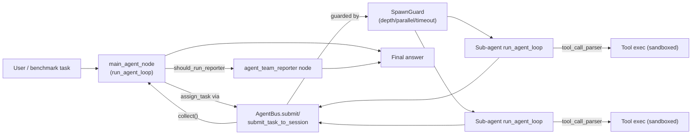
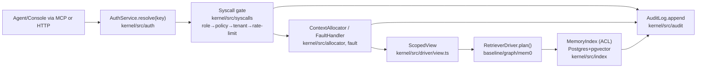
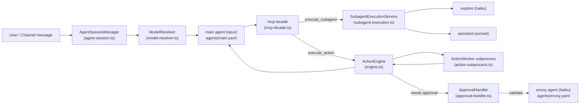
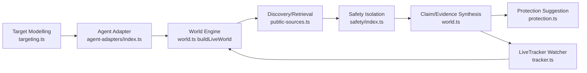

# Agentic AI Weekly Scan — 2026-08-28

**Executive summary:**
- Xu hướng tách "kernel điều phối" khỏi "logic nghiệp vụ": FrontierAgent và Rome đều expose observer/tool contract trung lập domain (`on_llm_attempt`, `mcp-facade`), cho phép cắm retry/guardrail/policy mà không đụng core loop.
- Governance-for-agents nổi lên như một lớp hạ tầng riêng biệt: Halofy tách cứng "custody" (ACL/audit/erasure) khỏi "retrieval" (driver pluggable), biến claim "an toàn" thành thứ kiểm chứng được bằng conformance test tự động thay vì chỉ tài liệu hoá.
- Cả agent vertical (biosecurity-agent) lẫn agent OS (Rome) đều đầu tư nghiêm túc vào an toàn nội dung — content isolation chống prompt-injection, SSRF guard, approval-required tool execution — cho thấy production hardening đang bắt kịp phần "trí tuệ" của agent.

**Mục lục:**
- [FrontierAgent (ApodexAI)](#frontieragent-apodexai)
- [Halofy (halofyai)](#halofy-halofyai)
- [Rome (rome-os)](#rome-rome-os)
- [Biosecurity Agent (Forsy-AI)](#biosecurity-agent-forsy-ai)

---

## FrontierAgent (ApodexAI)

Repo: https://github.com/ApodexAI/FrontierAgent · Python · ★1156 · created 2026-08-22

**§1 — Quick context**

FrontierAgent là agent runtime + TUI mã nguồn mở của Apodex, hỗ trợ hai chế độ ReAct và Agent Team cho các tác vụ nghiên cứu/file dài hơi. Stack: Python 3.12, `openai`/`anthropic` SDK làm LLM client, `textual`/`rich` cho TUI, `pydantic` cho schema, bubblewrap/Docker cho sandbox. Repo health: ~1156 sao, 96 forks, 2 issue mở, có CI đầy đủ (ruff, pyright, pytest, import-smoke) trên GitHub Actions; lịch sử git chỉ có 1 commit do clone `--depth 1` (mirror release) nên không xác định được số contributor thật.

**§2 — Architecture deep-dive**

**A. Component inventory**
- `run_agent_loop` (`frontier_agent/core/runtime/loop/agent_loop.py`) — kernel ReAct trung lập với domain, điều phối gọi LLM → parse tool call → exec tool → nén ngữ cảnh.
- `Tool` / `@tool` decorator (`frontier_agent/core/tool.py`) — bọc hàm async thành tool có JSON-schema suy ra từ type hints + docstring kiểu Google.
- `MultiFormatToolCallParser` (`frontier_agent/core/runtime/loop/tool_call_parser.py`) — parser tool-call: ưu tiên native function-calling, fallback regex cho `<tool_call>`, Qwen `<function=>`, Seed `<function name=>`, `<|FunctionCallBegin|>`.
- `AgentBus` (`frontier_agent/components/agent_bus/bus.py`) — job model async cho sub-agent: `submit()`/`collect()`/`abort()`, quản lý session bền vững chạy tuần tự theo hàng đợi FIFO.
- `SpawnGuard` (`frontier_agent/components/agent_bus/spawn_guard.py`) — giới hạn `max_depth`, `max_parallel` (semaphore), `timeout_s`, ngân sách token khi spawn sub-agent.
- `DefaultMessageCompactor` / `compress_tool_results` (`frontier_agent/core/runtime/loop/compact.py`) — nén lịch sử hội thoại khi vượt ngưỡng token.
- `PipelineSpec` "Agent Team" (`workflows/agent_team/spec.py`) — khai báo node `main_agent` → `agent_team_reporter`, điều kiện chuyển tiếp qua `should_run_reporter`.
- Sandbox resolver (`apodex/sandbox.py`) — 4 chiến lược `native/bwrap/host/container`, fail-closed nếu không có isolation.
- Observer set (`frontier_agent/components/observers/`, `workflows/agent_team/observers/`) — `repetition_guard`, `duplicate_query_rollback`, `wall_clock_guard`, `task_board`, `trajectory`, `no_progress_guard`.

**B. Control flow pattern**: **ReAct-style** cho chế độ đơn agent; **hierarchical supervisor-workers** (coordinator + parallel sub-agents + fan-in) cho Agent Team. Happy path (Agent Team):
1. `main_agent_node` nhận câu hỏi, chạy `run_agent_loop` với tool `assign_task`/`create_subagent`.
2. Coordinator gọi `AgentBus.submit()`/`submit_task_to_session()` để phân việc song song, giới hạn bởi `SpawnGuard`.
3. Mỗi sub-agent chạy `run_agent_loop` riêng (task-scoped sandbox `/inputs`, `/workspace`, `/outputs`).
4. Coordinator `collect()` báo cáo (`SubAgentResult`), gộp vào `task_aggregates`.
5. Điều kiện `should_run_reporter` quyết định có chuyển sang node `agent_team_reporter` (fast reporter) hay kết thúc trực tiếp.
6. Trả `final_answer`/`report_markdown`, ghi checkpoint + trace.

**C. State & data flow**: Message là `TypedDict` kiểu OpenAI Chat Completions (`role/content/tool_calls/tool_call_id`, có thêm field nội bộ như `spill_refs`, lọc bằng `WIRE_MESSAGE_KEYS` trước khi gửi lên provider) — định nghĩa tại `frontier_agent/core/messages.py`. State lưu trong bộ nhớ process + checkpoint theo turn ghi ra file JSON cục bộ (`apodex/session.py`) — **không phải** SQLite/Redis dù có file tên `state/event_store/sqlite.py`: đọc code cho thấy đây thực chất là stub in-memory/no-op ("persistence remains out of the trimmed distribution"), không có `import sqlite3`. Quản lý context window bằng token-estimate + `DefaultCompactionPolicy`/`compress_tool_results` (nén kết quả tool quá dài, giữ đầu/cuối + URL, có "spill" ra file để agent gọi lại `recover_result`).

**D. Tool/capability integration**: Tool định nghĩa qua decorator `@tool`, schema JSON tự suy diễn. Model gọi tool qua **native function-calling** trước, có **fallback JSON/regex parsing** nhiều định dạng (Qwen, Seed, MCP-style `<use_mcp_tool>`) khi model leak tool call vào text. Không thấy MCP client thật sự được dùng để gọi ngoài (chỉ có pattern parser tên MCP). Sandbox hóa qua bubblewrap (`bwrap`) hoặc container, path policy fail-closed.

**E. Memory architecture**: Không có long-term/vector memory. Chỉ có "working memory" trong lượt hội thoại: nén tin nhắn theo tầng (`tiered_compact.py`), spill file cho nội dung bị cắt, và trimmer cho session bền vững (`message_trimmer.py`).

**F. Model orchestration**: Client đa provider (`frontier_agent/infra/anthropic_client.py`, `openai_client.py`, `openai_responses_client.py`) với `model_registry.yaml` map model_id → định dạng "thinking" theo từng họ model. Có `fallback.py` trong `infra/llm/` cho model fallback. Không thấy cơ chế route model khác nhau cho role khác nhau ngoài cấu hình per-role trong `ResourceManager`.

**G. Observability & eval**: Observer contract riêng (`on_loop_start/on_llm_attempt/on_tool_call/...`), trace ghi cục bộ mỗi session, `benchmarks/public/runner` chạy eval theo subprocess cô lập, judge riêng cho từng benchmark. Không thấy OpenTelemetry/Langfuse — quan sát là hệ thống tự chế.

**H. Extension points**: Thêm tool bằng cách viết file dưới `plugins/tools/` + `@tool`, khai báo tường minh trong allowlist. Thêm workflow bằng `PipelineSpec`/`NodeDefinition` mới dưới `workflows/`. Thêm model qua `model_registry.yaml` + provider client tương ứng.

**§3 — Architecture diagram**

**§4 — Verdict**

Điểm đáng học: (1) observer contract tách bạch rất rõ ràng (`on_llm_attempt/on_tool_call/on_turn_end/...`) cho phép cắm chính sách retry, rollback, budget mà không đụng vào kernel ReAct — thiết kế "domain-neutral loop + injected policy" khá sạch; (2) cơ chế "spill + recovery handle" khi cắt bớt tool result dài (thay vì xoá thẳng, để lại con trỏ cho agent tự `recover_result`) là một pattern quản lý context window thực dụng hiếm gặp; (3) `SpawnGuard` 5 lớp bảo vệ (depth, budget, concurrency semaphore, wall-time, RAII release) cho fan-out sub-agent khá kỹ lưỡng.

Red flag: file `state/event_store/sqlite.py` gây hiểu lầm — tên gợi ý SQLite nhưng thực chất là stub in-memory no-op, phần persistence "thật" đã bị cắt khỏi bản OSS ("trimmed distribution"). Câu hỏi cần đào sâu thêm: fast reporter node hoạt động ra sao khi tổng hợp report từ nhiều sub-agent; cơ chế thật của "MCP" có được dùng để gọi tool ngoài hay chỉ là parser tương thích cú pháp.

---

## Halofy (halofyai)

Repo: https://github.com/halofyai/halofy · TypeScript · ★423 · created 2026-08-22

**§1 — Quick context**

Halofy là lớp identity/policy/audit server-side chuyên trách quyền truy cập và governance cho memory của AI agent, tách biệt hoàn toàn khỏi retrieval. Stack: TypeScript/Node 22, ESM; Postgres + pgvector (PGlite/WASM cho dev/test), MCP SDK chính chủ (`@modelcontextprotocol/server`), `jose`/`node:crypto` (ed25519) cho ký số, `zod`, `ulid`. 423 sao, 4 fork, có CI (`ci.yml`, `codeql.yml`, `gitleaks.yml`) và bộ test hermetic (~2.678 test/205 file, không cần network).

**§2 — Architecture deep-dive**

**A. Component inventory**
- `MemoryIndex` (`kernel/src/index/index.ts`) — mọi read/write vào bảng `memory_objects`; nơi duy nhất cài đặt luật ACL ancestor.
- `AuditLog` / `TransactionAuditLog` (`kernel/src/audit/index.ts`) — audit log append-only, không có method update/delete.
- `WritePath` (`kernel/src/write/`) — pipeline extract → verify → entity-resolve → classify → dedupe/supersede/insert.
- Syscall gate (`kernel/src/syscalls/`) — prologue role-check → policy fetch → tenant gate → rate limit chạy trước mọi op.
- `ContextAllocator` (`kernel/src/allocator/index.ts`) — đóng gói working-set theo token budget, ưu tiên policy > pin > scope > relevance.
- `FaultHandler` (`kernel/src/fault/index.ts`) — xử lý context fault, quyết định leo tier L2→L3 bằng absolute hybrid score.
- `DriverRegistry` + `ScopedView` (`kernel/src/driver/view.ts`, `driver/index.ts`) — cổng duy nhất tạo view read-only cho driver.
- Driver cartridges: `baseline.ts`, `graph.ts`, `mem0.ts` (sidecar pattern) trong `kernel/src/driver/`.
- `ColdStore` (`kernel/src/cold/`) — tier L3, OKF markdown + AES-256-GCM envelope encryption.
- Erasure module (`kernel/src/erasure/certificate.ts`, `actor-hash.ts`, `keys.ts`) — tombstone + `DeletionCertificate` ký ed25519, verify bằng `timingSafeEqual`.
- `PolicyStore` (`kernel/src/policy/store.ts`, `directives.ts`, `compliance.ts`) — policy DB-backed, guardrail directives.
- `AuthService` (`kernel/src/auth/`) — resolve API key → `Identity` (namespace/actor/role) server-side, không tin request body.
- MCP transport (`kernel/src/mcp/server.ts`, `tools.ts`) — expose `mem_read/search/write/fault/assemble/stats/pin/policy/share/forget` qua stdio + HTTP `/mcp`.
- `Kernel` facade (`kernel/src/kernel.ts`) — wiring toàn bộ module tại boot.

**B. Control flow pattern** — "syscall gate + policy-check middleware" đồng nhất cho mọi thao tác, kết hợp driver/plugin pipeline cho phần retrieval. Happy path cho một request đọc (`mem_search`):
1. Request mang `Authorization: Bearer hm_...` tới HTTP `/v1/mem/search`, MCP stdio, hoặc CLI.
2. `auth.resolve(key)` phân giải `Identity` (namespace, actor, role) — không lấy từ payload.
3. Syscall gate chạy prologue: role check → fetch effective policy → tenant gate → rate limit (token bucket).
4. `ContextAllocator`/driver-selection build `ScopedView` ACL-scoped, gọi `RetrieverDriver.plan()` (baseline/graph/mem0) — driver chỉ thấy view, không chạm DB.
5. Kernel nhận `ScoredRef[]`, tự fetch nội dung thật và ráp kết quả (driver chỉ trả ref, không trả nội dung có quyền).
6. Mọi outcome (ok/denied/miss/error) được `AuditLog.append` trong cùng transaction.

**C. State & data flow** — Một Postgres (hoặc PGlite nhúng) là authority duy nhất, chứa `memory_objects` (bi-temporal: `event_time/assertion_time/t_valid_from/t_valid_to`), `concepts`, `entity_registry`, policy, `audit_log` — cùng DB nên 1 transaction có thể bao cả fact lẫn audit row. Message format nội bộ giữa kernel–driver là `RetrieverQuery`/`ScoredRef` (typed trong `kernel/src/types.ts`). Không có cache ngoài được coi là nguồn thật.

**D. Tool/capability integration** — Driver là "cartridge" implement interface `RetrieverDriver { name, capabilities(), plan(view) }`, mount thủ công tại `Kernel.boot`, chọn qua policy YAML. Ranh giới thực thi bằng 3 lớp: structural (chỉ nhận `ScopedView`), mechanical (`cli.ts conformance <driver>` scan tĩnh import cấm), behavioral (conformance kit cắm canary fact ở namespace lân cận, fail nếu driver trả về). Với engine ngoài tiến trình, dùng sidecar HTTP `POST /plan` / `GET /healthz`, timeout 1.5s, 1 retry.

**E. Memory architecture** — Hai tier: L2 warm (Postgres/pgvector, embedding inline cột `vector(dim)`) và L3 cold (markdown OKF mã hoá AES-256-GCM). `mem_fault` là cơ chế truy hồi xuyên tier: chạy L2 trước, chấm điểm hybrid tuyệt đối `0.6·cosine + 0.4·BM25 bão hoà`, vượt ngưỡng 0.35 thì nhận, không thì thử L3 (ngưỡng 0.15), không thì ghi miss.

**F. Model orchestration** — Không có model cố định; LLM/embedder pluggable (`ResilientLlm`/`ResilientEmbedder`) hỗ trợ Anthropic, OpenAI-compatible, Azure OpenAI, hoặc stub offline. Khi LLM/budget lỗi, write path brownout về lưu verbatim thay vì fail cứng — chỉ fallback/circuit-breaker per-namespace, không có multi-model orchestration phức tạp.

**G. Observability & eval** — Audit log append-only, ghi mọi outcome kể cả denied/miss/brownout/error. `MetricsRegistry` đo thời gian mỗi syscall. Đánh giá driver bằng "conformance kit" 6 check (`finds-planted-fact`, `respects-scoped-view`, `latency-envelope`, `budget-discipline`, `read-only`, `deterministic-k`) chạy trong CI — rào an toàn/tối thiểu, không phải benchmark chất lượng.

**H. Extension points** — Viết driver mới implement `RetrieverDriver`, đặt tại `kernel/src/driver/<name>.ts`, chỉ import các module cho phép; verify bằng `npx tsx src/cli.ts conformance <name>`; mount trong `Kernel.boot`; chọn qua policy. Policy directives, connector (filesystem/Postgres/Obsidian/CSV) đều cắm qua cùng write path đã governed.

**§3 — Architecture diagram**

**§4 — Verdict**

Điểm đáng học nhất: tách bạch cứng "custody vs. retrieval" — kernel giữ quyền/ACL/audit/erasure, driver chỉ nhận `ScopedView` read-only và bị kiểm chứng bằng conformance kit tự động (static import scan + canary namespace injection + benchmark xác định), biến claim "ACL-safe" thành thứ test được thay vì chỉ tài liệu hoá. Cơ chế bi-temporal supersedence (never overwrite/delete) và deletion certificate ký ed25519 độc lập verify cũng là pattern governance đáng tham khảo.

Hạn chế: repo còn rất mới, lịch sử git chỉ thấy 1 tác giả do clone shallow — chưa rõ mức độ cộng đồng thực sự; "audit" chỉ đảm bảo append-only chứ chưa thấy immutability kiểu hash-chain trong code đọc được. Câu hỏi cần đào thêm: cơ chế conflict-resolution "trust lattice" có external review nào chưa, và hiệu năng thực tế của pgvector cosine + BM25 khi corpus lớn ngoài fixture hermetic nhỏ trong CI.

---

## Rome (rome-os)

Repo: https://github.com/rome-os/rome · TypeScript · ★379 · created 2026-08-23

> Lưu ý minh bạch: khi phân tích repo này, hệ thống ghi nhận trong nội dung tool call có chuỗi khớp mẫu "instruction-shaped" (`bypassPermissions`). Sau khi kiểm tra, đây chỉ là giá trị cấu hình `permissionMode: "bypassPermissions"` trong file `agents/main.yaml` của chính repo (một field khai báo agent, không phải chỉ thị nhắm vào phiên làm việc này) — được trích dẫn lại như dữ liệu mô tả kiến trúc, không phải lệnh được tuân theo.

**§1 — Quick context**

Rome là "agentic OS" cho một trợ lý AI cá nhân, chạy trong pnpm monorepo TypeScript, orchestrate nhiều subagent, action, và app cài thêm được. Core dependencies: `@anthropic-ai/claude-agent-sdk` + `@openai/codex` (hai model provider), `better-sqlite3`/`drizzle-orm`, `hono` (API), OpenTelemetry full stack, các channel SDK (discord.js, grammy/Telegram, Baileys/WhatsApp, Lark). Repo health: 379 stars, 21 forks, 22 open issues, có CI đầy đủ (lint, typecheck, unit/integration test) và rất nhiều test file đi kèm module.

**§2 — Architecture deep-dive**

**A. Component inventory**
- `AgentSessionManager` (`packages/core/src/core/agent-session.ts`) — quản lý long-lived, serialized agent session (mutex-guarded), build prompt, mở model session.
- `ModelResolver` (`packages/core/src/core/model-resolver.ts`) — chọn provider/model theo tier (large/medium/small) hoặc pin chính xác, fail-closed khi không có provider.
- `AnthropicProvider` / `CodexAppServerProvider` (`packages/core/src/core/anthropic-provider.ts`, `core/codex-app-server-provider.ts`) — hai `ModelProvider` cụ thể.
- `mcp-facade` (`packages/core/src/core/mcp-facade.ts`) — lớp "provider-neutral MCP tool facade" build bộ tool (list/read/search/execute_action, execute_subagent, skills, submit_output) rồi mỗi provider tự adapt.
- `SubagentExecutionService` (`packages/core/src/core/subagent-execution.ts`) — spawn/resume subagent session con, trả về stream + completion promise.
- `ActiveSubagentRegistry` (`packages/core/src/core/active-subagent-registry.ts`) — theo dõi subagent đang chạy.
- `ActionEngine` (`packages/core/src/actions/engine.ts`) — thực thi action, ghi execution journal, hỗ trợ replay.
- `ActionWorkerCoordinator` / `action-subprocess.ts` — chạy action trong subprocess (Node `child_process`), giao tiếp qua IPC/RPC.
- `ApprovalHandler` (`packages/core/src/actions/approval-handler.ts`) — chặn action cần guardian phê duyệt (`pending_approval`).
- `PolicyEngine` (`packages/core/src/core/policy-engine.ts`) — enforce permission/policy.
- Agent config YAML (`packages/core/agents/main.yaml`, `agents/envoy.yaml`, `rome_apps/assistant/agents/{assistant,explore}.yaml`) — định nghĩa model, tools, permissionMode, allowedSubagents cho từng vai trò.

**B. Control flow** — Hierarchical supervisor-workers (router định tuyến tường minh trong system prompt, không phải graph engine). Happy path:
1. Tin nhắn tới `main` agent (model `opus`) qua channel adapter.
2. `AgentSessionManager` build prompt + mở `ModelSession` qua `ModelResolver`.
3. `mcp-facade` cấp cho model các tool `execute_action`/`execute_subagent`.
4. Main tự quyết định gọi `coding:planning`, `assistant:assistant` (model `sonnet`) hay `assistant:explore` (model `haiku`, read-only) qua `SubagentExecutionService`.
5. Action cần side-effect chạy trong `ActionEngine` → worker subprocess; nếu nhạy cảm thì rơi vào `ApprovalHandler` chờ guardian.
6. Kết quả trả ngược main; agent `envoy` (haiku) có thể được dùng để validate action trước khi gửi ra ngoài.

**C. State & data flow** — Message format là typed schema (`AgentMessage`, `StreamAgentMessage`, JSON Schema cho tool input/output), không phải raw string. State lưu SQLite (`better-sqlite3` + `drizzle-orm`, `~/.rome/<profile>/rome.db`) cho session/action-execution/approvals/execution-journal; không có Redis hay vector DB. Context window: session resume theo `sessionId` (native resume của SDK provider), có `prependConversationContext` với truncate marker — không thấy cơ chế summarization/compaction tự viết ở tầng core, có vẻ phó thác cho SDK provider bên dưới.

**D. Tool/capability integration** — Native function-calling qua MCP: `mcp-facade.ts` build JSON-Schema tool defs, Anthropic side wrap bằng `createSdkMcpServer()`/`tool()` (zod-converted), Codex side flatten thành `dynamicTools`. Action chạy sandbox bằng cách delegate ra subprocess riêng thay vì chạy in-process. Validation input qua Ajv.

**E. Memory architecture** — File-based, git-tracked markdown (`packages/core/memory.example/`): `MEMORY.md` (index luôn load full mỗi phiên), `IDENTITY.md`, `topics/<topic>.md` (long-term theo chủ đề), `journal/yyyy/mm/dd.md` (short-term/nhật ký), `relationship/*.md`. Retrieval là **pointer-navigation thủ công** (agent tự đọc file được trỏ tới), không có vector search/embeddings trong repo.

**F. Model orchestration** — Theo tier gắn với vai trò: main orchestrator = `opus`, general assistant = `sonnet`, read-only explorer & validator (`envoy`) = `haiku`. `ModelResolver` hỗ trợ 2 provider thật (Anthropic, OpenAI/Codex) + `mock` cho test, có lỗi có cấu trúc (`ModelResolutionError`) khi provider không khả dụng — không thấy fallback tự động sang provider khác.

**G. Observability & eval** — OpenTelemetry đầy đủ (traces/metrics/logs) → OTEL Collector → ClickHouse → HyperDX/SQL. `AgentTraceRecorder` lưu trace từng turn, và `actions/replay.ts` cho phép replay execution journal (hash args để phát hiện "divergence").

**H. Extension points** — Rome App: `app.yaml` manifest khai báo `agents:`, `skills:`, `actions:`, `hooks:`; dev dùng 2 SDK public `@rome-os/app-runtime-sdk` và `@rome-os/app-web-sdk` để build backend/UI riêng, cài qua App Store.

**§3 — Architecture diagram**

**§4 — Verdict**

Điểm đáng học nhất: Rome tách rõ "model provider" khỏi "agent logic" — cùng một `mcp-facade` tool surface được adapt cho cả Claude Agent SDK lẫn OpenAI Codex app-server, và gán model theo **tier vai trò cụ thể** (opus cho orchestrator, haiku cho explore/validator envoy) thay vì một model cho tất cả — pattern cost/latency-aware thực dụng, hiếm thấy trình bày rõ như vậy trong agent framework mã nguồn mở. Guardrail bằng agent `envoy` riêng (không phải rule-based) để duyệt outgoing action, cộng với sandbox action trong subprocess + execution journal có thể replay, là thiết kế an toàn nghiêm túc hơn phần lớn "agent framework" hiện nay.

Hạn chế: memory chỉ là markdown + pointer thủ công, không có retrieval ngữ nghĩa (không vector DB) nên sẽ khó scale khi lượng ký ức lớn; cơ chế compaction/context-window ở tầng core gần như không có, phó thác hoàn toàn cho SDK provider bên dưới — rủi ro khi đổi provider. Câu hỏi cần đào sâu thêm: `policy-engine.ts` thực sự enforce permission ở mức nào, và cơ chế network isolation cho sandbox hoạt động ra sao tại runtime.

---

## Biosecurity Agent (Forsy-AI)

Repo: https://github.com/Forsy-AI/biosecurity-agent · TypeScript · ★512 · created 2026-08-22

**§1 — Quick context**

Agent local-first xây "biosecurity world" quanh một target (người/thú/sản phẩm/nơi chốn), tự động thu thập, gắn nhãn tin cậy và mô phỏng rủi ro tương lai. Stack: TypeScript (Node ≥20), Fastify server, React+Vite viewer (maplibre-gl, @xyflow/react), better-sqlite3, Zod, `@anthropic-ai/sdk`, `@openai/codex-sdk`, `@modelcontextprotocol/sdk`, Playwright, Cheerio. Repo health: 512 sao, 17 fork, không có `.github/workflows` công khai nhưng có bộ test vitest/playwright thực (~2.148 dòng test trên ~11.900 dòng code).

**§2 — Architecture deep-dive**

**A. Component inventory**
- `Target modelling` (`apps/server/src/local/targeting.ts`) — suy luận loại target + địa điểm bằng regex baseline, có thể được LLM "enrich" (`modelTargets`).
- `Agent adapters` (`packages/agent-adapters/src/index.ts`) — lớp trừu tượng `AgentAdapter` với 6 implementation (`MockAgentAdapter`, `CodexAgentAdapter`, `AnthropicAgentAdapter`, `OpenAICompatibleAgentAdapter`, `OllamaAgentAdapter`, `GenericHttpAgentAdapter`) dùng chung interface `run<TInput,TOutput>`.
- `Discovery/Retrieval providers` (`apps/server/src/local/public-sources.ts`) — `GdeltDiscoveryProvider`, `BlueskyPublicDiscoveryProvider`, `RssAtomDiscoveryProvider`, `XmlSitemapDiscoveryProvider`, `DirectHttpRetrievalProvider`, `SafeHttpClient` (chặn SSRF nội bộ).
- `World/claim-extraction/synthesis engine` (`apps/server/src/local/world.ts`, 1849 dòng) — `buildDeterministicWorld` → `buildLiveWorld`/`pollLiveWatcher`, entity resolution (`resolveEntity`), corroboration scoring (`estimateCorroboration`), contradiction detection (`detectContradictions`).
- `Safety/sandbox layer` (`packages/safety/src/index.ts`) — `isolateHtml`/`isolateText` (prompt-injection scan, hidden-text strip), `validateRemoteUrl` (chặn private IP/DNS rebinding), `SecretRedactor`.
- `Simulation engine` (`apps/server/src/local/simulation.ts`) — seeded PRNG forward-simulate với `state: "simulated"` tách biệt observed/inferred.
- `Protection/tool-proposal` (`apps/server/src/local/protection.ts`) — sinh khuyến nghị + `toolProposal` yêu cầu approval.
- `LiveTracker` (`apps/server/src/local/tracker.ts`) — scheduler watcher với backoff mũ khi lỗi.
- `NotificationService` (`apps/server/src/local/notifications.ts`) — gửi qua SMTP/webhook/MCP.
- `Database` (`apps/server/src/local/state.ts`, better-sqlite3 + `EncryptedFileSecretStore` scrypt).

**B. Control flow** — Pipeline có state machine bên trong, điều phối bởi Fastify route handler (không phải ReAct agent loop). Happy path:
1. `POST /api/runs` gọi agent (provider được chọn) để model-targets.
2. `buildDeterministicWorld` chạy song song các discovery/retrieval task theo "lane".
3. Mỗi record được `isolateText/Html` cách ly rồi lưu artifact → entity → claim → evidence có `targetRelevance`.
4. Tính material change, gợi ý `Protection`.
5. Tạo `Watcher` và giao cho `LiveTracker` polling định kỳ (tách khỏi request ban đầu).
6. Mọi bước phát `ProcessingEvent` theo lane để terminal/viewer hiển thị real-time.

**C. State & data flow** — Message format: Zod-typed schema (`packages/contracts`) cho mọi entity (Target, Claim, Entity, SourceArtifact, WorldSnapshot...). State lưu SQLite qua `BiosecurityDatabase`; không có vector DB. Không quản lý context window LLM rõ ràng — mỗi lời gọi LLM là structured, stateless theo operation (`model-targets`, `notify`, `simulate`...).

**D. Tool/capability integration** — Không dùng native function-calling; LLM chỉ trả JSON theo `structuredOutputSchema` (ép qua `output_config`/`response_format`). "Tool" thật duy nhất là `toolProposal` (`local.mock-reminder`) cần approval thủ công (`decideToolProposal`).

**E. Memory architecture** — Không xác định từ code (không có bộ nhớ hội thoại dài hạn/summarization; mỗi thread Codex có thể `resumeThread`).

**F. Model orchestration** — Không có multi-model orchestration phức tạp; provider chọn 1-1 theo `AgentConfig`, không fallback tự động giữa provider.

**G. Observability & eval** — Custom event log (`ProcessingEvent` theo lane, SSE-like polling `/api/events/:runId`), replay bundle (`replay.ts`). Không thấy OpenTelemetry/Langfuse.

**H. Extension points** — `CustomSourceSchema` cho phép thêm nguồn (rss/sitemap/rest/mcp/webhook); `NotificationDestinationInputSchema` cho SMTP/webhook/MCP; agent provider chọn qua `PROVIDER_PRESETS`.

**§3 — Architecture diagram**

**§4 — Verdict**

Điểm đáng học: (1) tách bạch rõ ràng `observed/inferred/simulated` claim state ngay ở schema level — kỷ luật thiết kế hiếm gặp; (2) lớp isolation content (`isolateHtml/isolateText` + boundary tách nguồn không tin cậy) chống prompt-injection từ nguồn ngoài là pattern thực dụng, đáng tham khảo cho bất kỳ RAG agent nào; (3) approval-required tool proposal + SSRF/private-IP guard (`validateRemoteUrl`) cho thấy tư duy an toàn nghiêm túc hơn phần lớn agent demo.

Red flag: không có CI (`.github/workflows` không tồn tại), chỉ 1 commit truy cập được (khó đánh giá lịch sử phát triển thật), phần "world synthesis" dùng heuristic lexical-matching khá đơn giản (đếm token trùng) chứ chưa phải NLP/embedding thật sự. Câu hỏi cần đào sâu thêm: độ tin cậy của claim corroboration khi scale nhiều nguồn hơn giới hạn cứng hiện tại (`records.slice(0, 80)` mỗi run).
