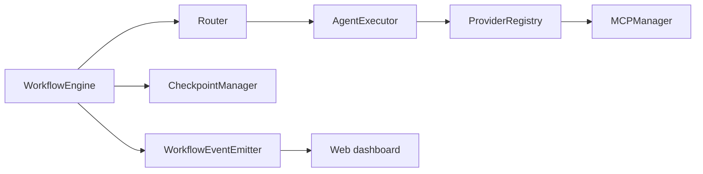
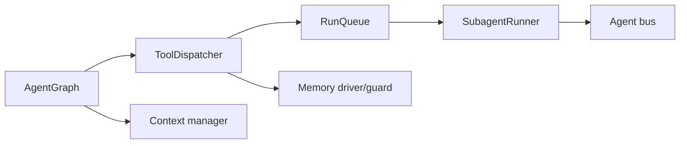
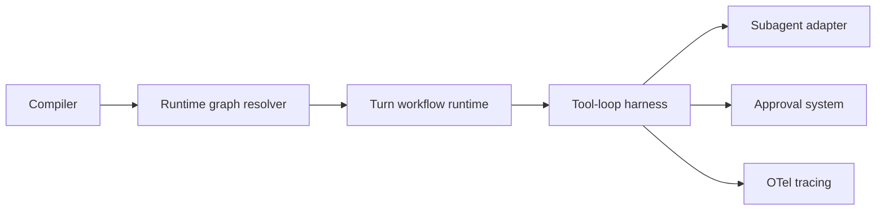
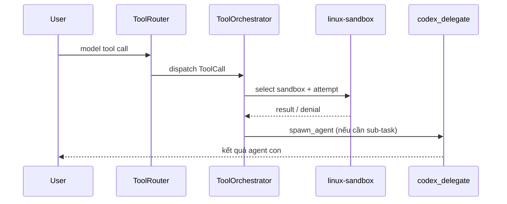

# Weekly Agentic AI Scan — 2026-08-30

**Window quét:** 2026-08-23 → 2026-08-30. Nguồn: GitHub Trending (weekly/daily), Hacker News "Show HN", web search cho các framework mới/được cập nhật mạnh trong tuần. Mỗi repo được `git clone` thực tế và đọc source code (không chỉ README) để rút ra kiến trúc.

## Tóm tắt điều hành

- 4 repo lọt vòng cuối đều là **production-grade agent orchestration engines** thực sự có commit trong tuần (23–30/8), không phải awesome-list hay wrapper mỏng: `microsoft/conductor` (deterministic YAML multi-agent orchestrator), `tinyhumansai/openhuman` (Rust "agent fleet" harness + memory-tree), `vercel/eve` (filesystem-first durable agent framework trên AI SDK), `openai/codex` (Rust coding agent với OS-level sandboxing).
- Điểm chung đáng chú ý: cả 4 repo đều tách rời rõ ràng **"model quyết định gọi gì" khỏi "hệ thống cho phép làm gì"** — approval/sandbox/policy nằm ở layer host, không phải ở model hay ở lớp parse tool-call — một pattern kiến trúc lặp lại đáng học.
- Rủi ro chung cần lưu ý: `openhuman` có README thiên marketing mạnh (badge ProductHunt/Trendshift) và lõi orchestration (`tinyagents`) là submodule vendor riêng, khó audit đầy đủ từ repo này; `eve` phụ thuộc khá sâu vào hạ tầng AI Gateway/durable workflow của Vercel cho các tính năng "durable".

## Mục lục

- [1. microsoft/conductor](#1-microsoftconductor)
- [2. tinyhumansai/openhuman](#2-tinyhumansaiopenhuman)
- [3. vercel/eve](#3-verceleve)
- [4. openai/codex](#4-openaicodex)

---

## 1. microsoft/conductor

**Repo:** https://github.com/microsoft/conductor (verified via `git ls-remote`, cloned và đọc trực tiếp)

### §1 — Quick context

CLI Python điều phối multi-agent workflow bằng YAML, routing tất định (không LLM), hỗ trợ nhiều model provider và sandbox từ xa. Stack: Python 3.12+, Pydantic, Jinja2 + `simpleeval`, MCP SDK, `uv`, Textual (Fleet TUI). Health: 407 stars, badge CI (`ci.yml`) trong README, commit gần nhất trong cửa sổ quét là 2026-08-28 (`cut 0.1.35`), rất nhiều `tests/test_*` bao phủ engine/executor/cli/mcp/registry — CI + test rõ ràng có.

### §2 — Architecture deep-dive

**A. Component inventory**
- `WorkflowEngine` (`src/conductor/engine/workflow.py`) — vòng lặp thực thi chính, điều phối step, gate, checkpoint.
- `Router` (`src/conductor/engine/router.py`) — đánh giá `routes` bằng Jinja2/`simpleeval`, rule đầu tiên khớp thắng.
- `AgentExecutor` (`src/conductor/executor/agent.py`) — chạy một agent step qua provider đã resolve.
- `ScriptExecutor`/`SetExecutor`/`WaitExecutor` (`src/conductor/executor/script.py`, `set_step.py`, `wait.py`) — step không cần LLM (shell, gán giá trị, polling).
- `ProviderRegistry` + adapter (`src/conductor/providers/{copilot,claude,openai,hermes,aca}.py`) — abstraction đa provider.
- `MCPManager` (`src/conductor/mcp/manager.py`) — spawn/quản lý MCP server qua stdio, có cơ chế truncate + spill file.
- `CheckpointManager` (`src/conductor/engine/checkpoint.py`) — lưu state ra file JSON khi lỗi/định kỳ để resume.
- `LimitEnforcer` (`src/conductor/engine/limits.py`) — giới hạn iteration/timeout/budget.
- `WorkflowEventEmitter` (`src/conductor/events.py`) — pub/sub event cho console, web dashboard, Fleet TUI.
- `HumanGateHandler`/`InterruptHandler` (`src/conductor/gates/human.py`, `interrupt.py`) — human-in-the-loop.
- Web dashboard server (`src/conductor/web/server.py`) — visualize DAG real-time + replay.

**B. Control flow pattern:** **state machine / graph** tường minh, định nghĩa bằng YAML — KHÔNG phải LLM-orchestrated (README nhấn mạnh "no LLM in the orchestration loop"). Happy path:
1. `conductor run workflow.yaml` — parse + validate YAML thành `WorkflowConfig` (`config/loader.py`, `schema.py`).
2. `WorkflowEngine` khởi tạo `WorkflowContext`, bắt đầu từ `entry_point`.
3. Executor tương ứng chạy step (agent step gọi `AgentExecutor` → provider; script/set/wait chạy local).
4. `Router.evaluate()` chọn target kế tiếp theo rule đầu tiên khớp (hỗ trợ parallel group / `for_each` fan-out động).
5. Sự kiện phát qua `WorkflowEventEmitter` tới console/dashboard/TUI; checkpoint được ghi khi lỗi hoặc theo chu kỳ.
6. Lặp tới khi route trỏ `$end` hoặc gặp step `terminate`.

**C. State & data flow:** `WorkflowContext` (`engine/context.py`) giữ input, output từng agent, lịch sử — dict/dataclass in-process, template Jinja2 đọc trực tiếp từ đây. State bền vững: **file JSON** (`engine/checkpoint.py`) ghi khi fail/định kỳ để resume; fleet record cũng lưu file dưới `$TMPDIR/conductor` (`fleet/records.py`). Không có DB/vector store — chỉ file + context in-memory.

**D. Tool/capability integration:** MCP server (stdio transport) spawn theo từng agent qua `MCPManager`; tool cũng lộ ra qua cơ chế function-calling gốc của từng provider (Copilot/Claude/OpenAI). Output tool quá lớn bị truncate với marker + spill file trên đĩa để không mất dữ liệu. Sandbox thực sự chỉ có ở provider `aca` — toàn bộ agentic loop (kể cả tool call) được giao cho một **Azure Container Apps dynamic-sessions sandbox** từ xa, dùng cho agent chạy code không tin cậy.

**E. Memory architecture:** không xác định từ code — không có subsystem long-term memory; context chỉ tồn tại trong phạm vi một lần chạy workflow. "Workflow registry" chỉ là kho định nghĩa workflow dùng lại, không phải bộ nhớ agent.

**F. Model orchestration:** `runtime.provider` chọn 1 trong Copilot/OpenAI/Claude/Claude Agent SDK/Hermes/ACA theo workflow hoặc override theo agent; `providers/factory.py` resolve instance. Static/dynamic parallel group cho phép chạy nhiều agent song song. Fallback tự động giữa các provider: không xác định từ code (chỉ thấy indirection `inner_provider` của ACA).

**G. Observability & eval:** `WorkflowEventEmitter` → console renderer + web dashboard (DAG real-time, token/cost per-node) + Fleet TUI (sparkline token-burn); `UsageTracker`/`ModelPricing` (`engine/usage.py`, `engine/pricing.py`) tính cost; `conductor replay` phát lại run cũ từ event log (`web/replay.py`, `engine/event_log.py`). Không thấy tích hợp OpenTelemetry/Langfuse — tracing tự chế dựa trên event log.

**H. Extension points:** provider mới bằng cách implement `providers/base.py` rồi đăng ký ở `factory.py`/`registry.py`; step type mới qua `executor/`; tool qua khai báo MCP server trong YAML; plugin/skill phân phối như marketplace Claude Code/Copilot CLI (`plugins/conductor`, `.claude-plugin/marketplace.json`).

### §3 — Architecture diagram

### §4 — Verdict

Điểm mới đáng học: orchestration **tất định phi-LLM** — routing do Jinja2/expression quyết định thay vì một "planner" LLM, khiến run tái lập được và diff được trong PR như code thường; provider `aca` đẩy toàn bộ agentic loop (không chỉ một tool call) vào sandbox từ xa là một ranh giới cô lập ít gặp, đáng học cho use-case chạy code sinh tự động. Hạn chế: không có long-term memory (chủ đích, ngoài phạm vi); phụ thuộc nhiều CLI subprocess (`gh`, `copilot`, `claude`) khiến vận hành trên Windows khá mong manh (README dành hẳn một đoạn dài xử lý lỗi path trên Windows). Câu hỏi mở: checkpoint/resume xử lý ra sao khi fail giữa một parallel group; registry version-pinning (`registry/version_resolver.py`) đảm bảo reproducibility thế nào theo thời gian.

---

## 2. tinyhumansai/openhuman

**Repo:** https://github.com/tinyhumansai/openhuman (verified via `git ls-remote`, cloned và đọc trực tiếp)

### §1 — Quick context

Binary Rust chạy local, điều phối "fleet" agent qua đồ thị có checkpoint, có trí nhớ dạng cây Markdown nén và lớp trừu tượng tool-dialect đa mô hình. Stack: Rust core (~720K LOC first-party, cộng crate vendor `tinyagents`/`tinyflows`/`tinytools`), Tauri desktop shell, SQLite cho memory, frontend TypeScript/React. Health: 38.9k stars, GPLv3, gắn nhãn "Early Beta", commit cùng ngày 2026-08-30 (rất nhiều PR merge trong ngày), không thấy badge CI/test trong README dù repo có test file rải rác trong Rust crate.

### §2 — Architecture deep-dive

**A. Component inventory**
- `ToolDispatcher` (`src/openhuman/agent/dispatcher.rs`) — trừu tượng hoá "dialect" gọi tool (Native/XML/PFormat) giữa model và harness.
- `AgentGraph` (`src/openhuman/agent/harness/agent_graph.rs`) — chọn turn-graph mặc định hay tuỳ biến cho từng agent, chạy trên crate vendor `tinyagents`.
- `SubagentRunner` (`src/openhuman/agent/harness/subagent_runner/`) — spawn/chạy sub-agent tối đa 3 cấp sâu, có cache handoff kết quả.
- `RunQueue` (`src/openhuman/agent/harness/run_queue/`) — hàng đợi/điều phối turn của agent.
- Memory driver/guard (`src/openhuman/memory/driver/mod.rs`, `memory/guard/{budget,policy,mandatory}.rs`) — bind vào module biên dịch sẵn "TinyMemory TinyBus", ép budget/policy khi truy cập memory.
- `Agent bus` (`src/openhuman/agent/bus.rs`) — message bus agent-to-agent/progress event.
- Context manager (`src/openhuman/agent/context/manager.rs`) — dựng prompt/context mỗi turn (channel, session memory).
- TokenJuice compaction (khai báo ở `Cargo.toml`, dùng trong `agent_graph.rs`) — nén tool-output/context.

**B. Control flow pattern:** **hierarchical/supervisor-workers** trên đồ thị có checkpoint (chạy trên crate `tinyagents` vendor). Happy path:
1. Tin nhắn vào (channel/UI/schedule) được triage; `AgentGraph` resolve turn-graph Default hay Custom cho agent đích.
2. `ToolDispatcher` format turn theo dialect của model, gửi `AgentTurnRequest` (history, tools, budget) vào vòng lặp dựa trên `tinyagents`.
3. Model trả lời, tool call được parse và thực thi dưới policy approval/sandbox/timeout của chính harness (dialect chỉ format, không quyết định "được phép làm gì").
4. Nếu cần chuyên gia, harness spawn sub-agent turn (`subagent_runner`) tới độ sâu giới hạn (`spawn_depth_context`); kết quả cache/handoff về agent cha.
5. `AgentTurnResult` (history, usage, early-exit, breaker halt) trả về; circuit breaker phát hiện lặp lỗi có thể dừng run và báo "Incomplete" kèm nguyên nhân gốc.
6. Turn/session state cùng memory đã nén được lưu bền để run sống sót qua restart.

**C. State & data flow:** định dạng message = `ChatMessage`/`ConversationMessage`; state turn/session được checkpoint (README: "survive a restart, resume mid-run"). Long-term memory lưu dạng cây Markdown có điểm số trong **SQLite**, mirror ra Obsidian vault trên đĩa — README nói rõ "No vector-soup black box"; có backend `agentmemory` (vector-based) tuỳ chọn qua `memory.backend` trong config.

**D. Tool/capability integration:** `Tool` trait + `ToolSpec`/`ToolSchema` registry; ba dialect gọi tool — Native function-calling, XML, "PFormat" — trừu tượng qua `ToolDialect`/`ToolDispatcher` để code harness không phải đặc biệt hoá theo từng model. Tích hợp tới 5.000+ MCP server theo README (`src/openhuman/mcp/`). Thực thi qua approval gate + sandbox tuỳ chọn, nằm ngoài lớp dialect.

**E. Memory architecture:** ngắn hạn = lịch sử `ChatMessage` theo session + context manager; dài hạn = "Memory Tree" — auto-fetch mỗi 20 phút nén Gmail/Slack/GitHub/note thành Markdown có điểm số, chunk ≤3k token, gộp thành cây tóm tắt theo nguồn/chủ đề/ngày, lưu SQLite và mirror ra Obsidian vault chỉnh sửa được — chiến lược nén/summarization dạng cây thay vì thuần vector, có thể gắn thêm backend vector qua `agentmemory`.

**F. Model orchestration:** README mô tả "model routing" chọn LLM theo workload, kiến trúc "split brain" — một reflex agent nhanh triage traffic vào trong khi lõi reasoning sâu hơn phân việc cho worker fleet; hỗ trợ BYOK hoặc Ollama local theo từng workload. Logic routing/fallback chi tiết: không xác định từ code (nằm sau abstraction `inference::provider` chưa đọc hết).

**G. Observability & eval:** Sentry crash-reporting khởi tạo đầu `main.rs` (feature `crash-reporting`) kèm scrub secret trước khi gửi; tổng hợp cost/usage theo call (`agent/cost.rs`, `AgentTurnUsage`); README nói "every run replays with real per-call costs". Tracing ngoài Sentry + usage accounting: không xác định từ code.

**H. Extension points:** MCP server, OAuth integration, và "Skills" (90.000+) là bề mặt plug-in chính; agent chuyên biệt tự định nghĩa turn-graph riêng qua `graph.rs::graph()` trả về `AgentGraph::Custom(runner)` — docstring của `agent_graph.rs` gọi đây chính là "extension point" cho agent đặc thù (orchestrator, researcher…) mà không phải rẽ nhánh runner dùng chung; backend memory thay thế được qua config.

### §3 — Architecture diagram

### §4 — Verdict

Điểm mới đáng học: seam `AgentGraph::Default | Custom(fn)` cho từng agent là extension point gọn — phần lớn agent dùng chung turn-graph mặc định, chỉ vài agent chuyên biệt (orchestrator, researcher) mới cần graph `tinyagents` riêng, không phải rẽ nhánh runner dùng chung; thiết kế memory từ chối vector-DB-first, chọn Markdown tree đọc/sửa tay và mirror ra Obsidian — đánh đổi "tính minh bạch" đáng nghiên cứu so với RAG chuẩn. Red flag: README thiên marketing rõ rệt (badge ProductHunt/Trendshift, khẩu hiệu "personal AI super intelligence"), lõi orchestration thật sự (`tinyagents`) là crate vendor pin riêng — nội bộ vòng lặp không audit đầy đủ được chỉ từ repo này; GPLv3 kèm mô hình subscription trả phí phủ lên client mã nguồn mở đáng xem xét kỹ. Câu hỏi mở: cơ chế "reflex vs reasoning core" route ra sao; memory guard's budget/policy tương tác thế nào với compaction khi tool output mang nội dung độc hại.

---

## 3. vercel/eve

**Repo:** https://github.com/vercel/eve (verified via `git ls-remote`, cloned và đọc trực tiếp)

### §1 — Quick context

Framework TypeScript filesystem-first cho AI agent bền vững: quy ước thư mục thay cho config, tool loop chạy trong workflow durable, có sẵn eval và OpenTelemetry tracing. Stack: TypeScript, Vercel AI SDK (`ToolLoopAgent`), OpenTelemetry, hạ tầng AI Gateway/workflow durable của Vercel. Health: 4.9k stars, gắn nhãn beta, 1.101+ commit, hoạt động dày trong cửa sổ quét (commit 2026-08-28, 450 PR, 289 issue mở), test rất rộng (`*.test.ts`, `*.integration.test.ts`, `*.scenario.test.ts`) dù không thấy badge CI hiển thị trong README.

### §2 — Architecture deep-dive

**A. Component inventory**
- Compiler (`packages/eve/src/compiler/`) — biên dịch thư mục quy ước `agent/` (agent.ts, tools/, skills/, channels/) thành runtime artifact.
- Runtime graph resolver (`packages/eve/src/runtime/graph.ts`, `resolve-agent-graph.ts`, `resolve-agent.ts`) — resolve đồ thị agent + subagent + tool + connection lúc khởi động.
- Tool-loop harness (`packages/eve/src/harness/tool-loop.ts`) — vòng lặp gọi model thật, bọc quanh `ToolLoopAgent` của Vercel AI SDK.
- Workflow runtime / turn workflow (`packages/eve/src/execution/workflow-runtime.ts`, `turn-workflow.ts`) — thực thi "turn" như một workflow durable, resume được.
- Subagent adapter/invocation (`execution/subagent-adapter.ts`, `subagent-invocation.ts`, `delegation-tool.ts`) — delegation phân cấp tới subagent, kể cả subagent từ xa (`subagent-start-remote.ts`).
- Approval system (`packages/eve/src/approval/`, `harness/approval-candidates.ts`) — human-in-the-loop gate.
- Evals (`evals/judge.ts`, `evals/autoevals-client.ts`, `evals/define-eval.ts`) — eval harness có LLM-judge.
- Tracing (`tracing/agent-otel-provider.ts`, `batch-span-processor.ts`, `local-traces.ts`) — instrumentation OpenTelemetry kèm local trace store.
- Sandbox (`packages/eve/src/sandbox/state.ts`) — state cho thực thi sandbox.
- Channels (`packages/eve/src/channel/`, `eve-channel/`) — kênh Slack/Discord/HTTP.

**B. Control flow pattern:** **ReAct-style tool loop** bọc trong **durable workflow/state machine** (mỗi "turn" tự nó là một chuỗi step workflow), kèm delegation phân cấp sang subagent. Happy path:
1. `npx eve init` scaffold thư mục `agent/`; `compiler` build thành artifact runtime có kiểu (config agent, tool/skill/channel được tự phát hiện).
2. Một channel (HTTP/Slack/schedule) kích hoạt `workflow-entry.ts`, khởi động `turn-workflow` cho session.
3. `dispatch-turn-step.ts` gọi harness `tool-loop.ts` — chạy `ToolLoopAgent` của AI SDK: gọi model → parse tool call → `execute-tool.ts` → nối kết quả vào history, lặp tới khi có câu trả lời cuối hoặc gặp interrupt (approval/input request).
4. Nếu model gọi tool delegation, `subagent-invocation.ts`/`subagent-adapter.ts` spawn turn con (local hoặc remote) và proxy event/approval ngược về agent cha (`subagent-event-proxy-step.ts`, `subagent-hitl-proxy.ts`).
5. Compaction (`execution/compaction.ts`, `harness/compaction.ts`) cắt bớt history khi chạm giới hạn token/session.
6. Mỗi bước phát OTel span (`tracing/*`) và state session được checkpoint qua `durable-session-store.ts`, nên một turn có thể dừng chờ approval/input rồi resume sau.

**C. State & data flow:** định dạng message theo kiểu `ModelMessage`/`ConversationMessage` của AI SDK; state turn/session lưu qua `execution/durable-session-store.ts` — backing store cụ thể (hạ tầng durable workflow của Vercel hay local file) không xác định từ code ở độ sâu đọc này, dù `runtime/resolve-memory.ts` và `docs/memory.md` cho thấy có memory resolver pluggable; context window quản lý qua `harness/compaction.ts`, `session-token-limits.ts`, `subagent-token-budget.ts`.

**D. Tool/capability integration:** tool là file thường trong `agent/tools/*.ts` dùng `defineTool` + schema Zod, được compiler/`discover/` tự phát hiện (quy ước filesystem, không đăng ký thủ công); gọi tool qua **native function-calling** của AI SDK (`ToolLoopAgent`/`TypedToolCall`); validate bằng `inputSchema` Zod; tool động/sandbox resolve qua `runtime/resolve-dynamic-tool.ts` và `sandbox/state.ts`.

**E. Memory architecture:** `docs/memory.md` và `context/memory-lifecycle.js` (`prepareMemoryPreamble`, `drainMemoryCommit`, `prepareMemoryCompaction`) cho thấy có vòng đời preamble/compaction memory móc vào tool loop, nhưng cơ chế lưu trữ/truy hồi cụ thể (vector/keyword/file) không xác định từ code nếu không đọc trọn `runtime/resolve-memory.ts`.

**F. Model orchestration:** model chọn theo từng agent trong `agent.ts` (`defineAgent({ model: ... })`), resolve qua AI Gateway của Vercel (`internal/gateway.ts`, `formatLanguageModelGatewayId`); subagent có thể khai model riêng. Fallback/parallelism tự động ngoài concurrency của subagent: không xác định từ code.

**G. Observability & eval:** OpenTelemetry hạng nhất — có provider riêng, batch span processor, content-attribute span processor, và một hệ **local trace reader/retention** (`local-trace-reader.ts`, `local-trace-retention.ts`) để xem trace mà không cần backend ngoài; module `evals/` cung cấp `defineEval`, `judge.ts` (LLM-as-judge), tích hợp `autoevals-client.ts` — eval hook thật, không chỉ log.

**H. Extension points:** toàn bộ là quy ước file-drop — tool mới trong `agent/tools/`, skill mới trong `agent/skills/`, channel mới trong `agent/channels/`, job định kỳ trong `agent/schedules/`; các sub-package `eve/tools`, `eve/evals`... export để mở rộng bằng code; có package `eve-self-modification` cho phép agent tự đề xuất sửa source của chính nó.

### §3 — Architecture diagram

### §4 — Verdict

Điểm mới đáng học: biến toàn bộ bề mặt authoring thành quy ước filesystem (agent.ts/instructions.md/tools//skills//channels//schedules/) với auto-discovery zero-config là một canh bạc UX thực sự khác biệt so với framework code-first (LangGraph/CrewAI) — cảm giác như "Next.js file-routing" áp cho agent; ghép ReAct tool loop với nền **durable workflow** (turn có thể dừng giữa một tool call chờ approval rồi resume sau restart process) là tính năng production thật, không phải demo nghiên cứu. Cũng đáng chú ý: package self-modification cho agent tự sửa source. Red flag: phụ thuộc khá sâu vào AI Gateway/hạ tầng workflow durable riêng của Vercel cho các tuyên bố "durable" và "model routing qua gateway" — chưa rõ portability nếu self-host ngoài Vercel; bề mặt code rất lớn (86K+ LOC chỉ riêng một package) cho một framework còn ở giai đoạn beta. Câu hỏi mở: `durable-session-store` và `resolve-memory` thực sự backed bởi gì khi deploy ngoài Vercel — đáng đào sâu cho ai muốn self-host.

---

## 4. openai/codex

**Repo:** https://github.com/openai/codex (verified via `git ls-remote`, cloned và đọc trực tiếp)

### §1 — Quick context

Coding agent chạy trong terminal, lõi viết lại hoàn toàn bằng Rust, sandbox thực thi ở cấp hệ điều hành, hỗ trợ spawn agent con và MCP hai chiều. Stack: Rust (workspace Cargo/Bazel 60+ crate dưới `codex-rs/`), TypeScript chỉ làm launcher mỏng, Landlock/seccomp (Linux) và Seatbelt (macOS) cho sandbox, OpenTelemetry (crate `otel`). Health: 119.9k stars, 10.000+ commit, hoạt động dày đặc trong cửa sổ quét (nhiều commit/ngày 08-29 → 08-30), CI xác nhận có thật (`rust-ci-full.yml`, `blocking-ci.yml`, `postmerge-ci.yml` trong `.github/workflows/`), test bao phủ rộng (rất nhiều file `*_tests.rs` trong từng crate).

### §2 — Architecture deep-dive

**A. Component inventory**
- `ToolRouter` (`codex-rs/core/src/tools/router.rs`) — chọn tool/spec hiển thị cho model theo turn, phân biệt nguồn gọi trực tiếp vs plaintext.
- `ToolOrchestrator` (`codex-rs/core/src/tools/orchestrator.rs`) — chuỗi "approval → chọn sandbox → thử → retry với sandbox leo thang khi bị từ chối" cho mọi `ToolRuntime`.
- `SandboxManager` (crate `codex-rs/sandboxing`, dùng bởi `orchestrator.rs`) — quản lý loại sandbox (Landlock/seccomp/Seatbelt) theo nền tảng.
- `linux-sandbox` (`codex-rs/linux-sandbox/src/{landlock,bwrap,launcher}.rs`) — thực thi sandbox kernel-level trên Linux qua Landlock + bubblewrap.
- `codex_delegate` (`codex-rs/core/src/codex_delegate.rs`) — khởi tạo một sub-Codex thread con (`SubAgentSource`, `MultiAgentVersion`) cho tác vụ con.
- `agent-roles` crate (`codex-rs/agent-roles/src/{loader,discovery,agent_role_config}.rs`) — nạp cấu hình vai trò agent.
- `agent-graph-store` crate (`codex-rs/agent-graph-store/`) — lưu trạng thái đồ thị agent (đa agent).
- `mcp-server` (`codex-rs/mcp-server/src/{codex_tool_runner,active_turn_registry}.rs`) — Codex tự expose chính nó như một MCP server (không chỉ là MCP client).
- `otel` crate (`codex-rs/otel/src/{provider,otlp,tool_result}.rs`) — provider OpenTelemetry + export OTLP + ghi nhận kết quả tool vào span.
- `app-server-protocol` (`codex-rs/app-server-protocol/src/rpc.rs`) — giao thức RPC cho app server (giao tiếp với client/IDE).

**B. Control flow pattern:** **ReAct-style tool loop** ở lõi single-agent, có khả năng **spawn thread con (hierarchical)** khi cần task con. Happy path:
1. Người dùng nhập lệnh trong terminal/IDE; `app-server`/`cli` gửi submission vào core qua `Session`/`TurnContext`.
2. Model trả về response, `ToolRouter` map lời gọi vào `ToolCall` (namespace + tên tool, kể cả tool "collaboration" như `spawn_agent`, `send_message`, `followup_task`).
3. `ToolOrchestrator` chạy chuỗi: xin approval (nếu policy yêu cầu) → chọn sandbox phù hợp → thử thực thi → nếu bị sandbox từ chối thì retry với sandbox leo thang, không hỏi lại approval nhờ cache quyết định.
4. Việc thực thi thật (shell command, patch...) chạy trong `linux-sandbox`/`windows-sandbox-rs` cách ly ở cấp hệ điều hành (Landlock/seccomp hoặc Seatbelt).
5. Nếu cần một agent con độc lập, `codex_delegate.rs` khởi động một sub-Codex thread riêng (`SubAgentSource`) với IO channel riêng, kết quả trả ngược qua event.
6. Mỗi bước ghi OTel span (`otel::provider`) và log tool-dispatch trace (`tools/tool_dispatch_trace.rs`) phục vụ debug/observability.

**C. State & data flow:** đơn vị hội thoại là `ResponseItem`/history theo `Session`/`TurnContext`; rollout (lịch sử phiên) được ghi ra đĩa qua crate `rollout`/`rollout-trace` để có thể replay/resume; không thấy state lưu trong DB/vector store ở phần lõi đã đọc — chủ yếu file-based rollout + in-memory session. Quản lý context window qua các module `compact*.rs` (`compact.rs`, `compact_token_budget.rs`, `compact_remote_v2.rs`) — có cả compact "remote" (nén qua API) lẫn theo ngân sách token cục bộ.

**D. Tool/capability integration:** tool đăng ký qua `ToolRegistry`/`ToolSpec` (`tools/registry.rs`, `spec_plan.rs`); model gọi bằng **native function-calling** của Responses API; có "code mode" riêng (crate `code-mode`, `code-mode-runtime`) cho phép model chạy code làm cơ chế gọi tool thay vì JSON call thuần. Validation/sandbox qua `ToolOrchestrator` + `SandboxManager` như mô tả ở §2.B; Codex cũng đóng vai **MCP server** (`mcp-server/`) lẫn **MCP client** (`rmcp-client/`), tức có thể vừa expose tool của chính nó vừa gọi MCP server khác.

**E. Memory architecture:** không xác định từ code — không tìm thấy crate/memory dài hạn kiểu vector/graph trong phạm vi đã đọc (có `message-history`/`history` crate nhưng đó là lịch sử hội thoại theo phiên, không phải bộ nhớ dài hạn xuyên phiên).

**F. Model orchestration:** `model-provider`/`model-provider-info`/`models-manager` crate quản lý danh sách model và provider (kể cả local qua `ollama`, `lmstudio` crate); `codex_delegate` cho phép sub-agent dùng model khác agent cha trong tác vụ đa agent (`MultiAgentVersion`). Chính sách fallback/retry chi tiết theo model: không xác định từ code ở độ sâu đã đọc.

**G. Observability & eval:** crate `otel` riêng với `provider.rs`, `otlp.rs` (export OTLP chuẩn), `tool_result.rs` (gắn kết quả tool vào span); thêm `tool_dispatch_trace.rs` trong core để log quyết định dispatch tool. `analytics`/`feedback`/`diagnostics` crate riêng cho số liệu sử dụng và chẩn đoán. Không thấy eval-harness LLM-judge tích hợp sẵn — "eval hooks/replay" chủ yếu qua `rollout`/`rollout-trace` (replay phiên), không phải scoring tự động.

**H. Extension points:** MCP client gắn tool ngoài; `mcp-server` expose Codex như tool cho host khác; `plugin`/`core-plugins` mở rộng hành vi core; `agent-roles` định nghĩa vai trò agent tuỳ biến; `hooks` crate cho lifecycle hook tuỳ chỉnh.

### §3 — Architecture diagram

### §4 — Verdict

Điểm mới đáng học: `ToolOrchestrator` tách bạch "approval" khỏi "chọn sandbox" khỏi "retry leo thang" thành một chuỗi tái sử dụng cho mọi `ToolRuntime`, cache quyết định approval để không hỏi lại khi retry — pattern guardrail gọn, đáng nhân rộng; Codex vừa là MCP client vừa tự expose qua `mcp-server` (cả hai đầu giao thức) là composability hiếm gặp ở coding agent CLI khác. Hạn chế: không có bộ nhớ dài hạn xuyên phiên trong phạm vi đã đọc (chỉ rollout/history theo phiên); workspace 60+ crate khiến audit toàn diện tốn công; "code mode" (model chạy code để gọi tool) mở rộng bề mặt tấn công nếu sandbox cấu hình sai. Câu hỏi mở: chính sách fallback/retry giữa các model provider cụ thể ra sao; giới hạn độ sâu khi `codex_delegate` spawn nhiều sub-agent lồng nhau được kiểm soát ở đâu.

---

*Ghi chú phương pháp: các repo được xác minh tồn tại qua `git ls-remote`, lấy metadata qua trang GitHub, và được `git clone --depth` để đọc trực tiếp README, cây thư mục, và mã nguồn thật (không suy đoán từ mô tả). Mọi dòng ở mục §2.A đều có đường dẫn file cụ thể trong repo đã clone.*
