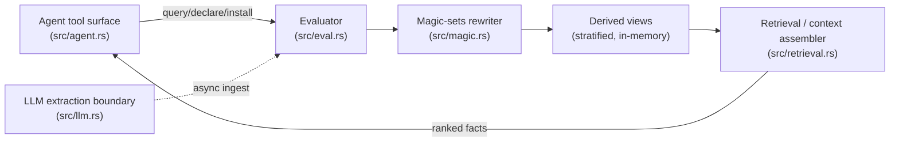
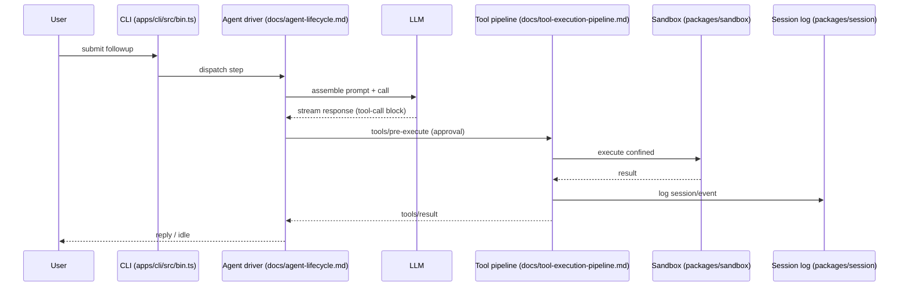
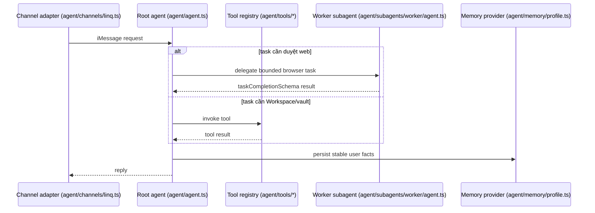
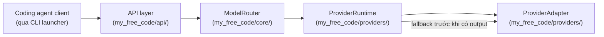

# Agentic AI Weekly Scan — 2026-08-24 → 2026-08-31

> Scheduled research scan. Nguồn: GitHub Search API (`created:>2026-08-24 stars:>200`, từ khoá `agent OR multi-agent OR agentic`). Đọc trực tiếp README, cấu trúc thư mục, entry point và dependency file của từng repo qua `raw.githubusercontent.com` / trang GitHub — không dùng dữ liệu suy đoán.

## Tóm tắt điều hành

- Query gốc (`created:>7d stars:>200`) trả về đủ 8 ứng viên ngay ở fallback đầu tiên (không cần hạ ngưỡng xuống `pushed:>7d stars:>500`); sau khi loại tutorial-dump, list-kiểu-awesome và các repo thiếu bằng chứng kiến trúc, còn lại 4 repo đáng đọc sâu.
- Chủ đề nổi bật trong tuần: **memory-as-database** (Lemmalog dùng Datalog thay vector store), **hook pipeline có permission gate rõ ràng** thay vì loop ReAct đơn giản (Pentest Harness), và **multi-agent theo convention thư mục + vault tách biệt secret khỏi LLM** (OpenInstinct) — không phải trend "wrapper LangChain" chung chung.
- Rủi ro chung đáng chú ý: ít nhất 2/4 repo (Pentest Harness, OpenInstinct) không tự viết agent-loop core — họ vendor hoặc import framework ngoài (`Cordis`/"DeepSeek Harness" vendored; package `eve` từ npm) rồi xây lớp domain riêng lên trên. Cần đọc kỹ để tách phần "đóng góp thật" khỏi phần "thừa hưởng".

## Mục lục

1. [JordyZomer/lemmalog — Datalog engine cho agent memory](#lemmalog)
2. [S1N6H/pentest-harness — Agent harness cho pentest, xây trên Cordis vendored](#pentest-harness)
3. [Merit-Systems/OpenInstinct — Trợ lý iMessage + browser worker + vault](#openinstinct)
4. [hkqr/my-free-code — Gateway định tuyến model đa nhà cung cấp](#my-free-code)

---

## 1. JordyZomer/lemmalog

**Repo:** https://github.com/JordyZomer/lemmalog

### §1 — Quick Context

Datalog engine dùng làm bộ nhớ suy diễn cho agent LLM, thay vector store bằng cơ sở dữ liệu có thể kiểm chứng và tăng dần. Stack: Rust (Cargo), feature `llm` (extraction qua OpenAI/LM Studio/llama.cpp), feature `mcp` (binary `lemmalog-mcp` — MCP server cho Claude Code/Kimi CLI). Repo health: 210 sao, 15 fork, tạo 2026-08-27, push gần nhất 2026-08-28, MIT license, có `tests/` và README nói tới differential testing trên 450 chương trình ngẫu nhiên + fuzzing, nhưng không thấy badge CI hay thư mục `.github/workflows`.

### §2 — Architecture Deep-Dive

**A. Component inventory** (tất cả có evidence từ `src/`):
- `Agent tool surface` (`src/agent.rs`) — expose 3 tool cho agent: `query`, `declare`/`install`, `why`.
- `Evaluator` (`src/eval.rs`) — seminaive fixpoint evaluator, leapfrog triejoin, incremental delta maintenance.
- `Magic-sets rewriter` (`src/magic.rs`) — demand-driven rewrite để query chỉ chạm phần dữ liệu liên quan.
- `Semantics/stratification` (`src/semantics.rs`) — xử lý negation-as-absence, thứ tự stratum.
- `Canonicalization` (`src/canonical.rs`) — entity resolution kiểu star-shaped aliasing.
- `Retrieval / context assembler` (`src/retrieval.rs`) — hybrid BM25 + entity-match + budget-aware assembly.
- `LLM extraction boundary` (`src/llm.rs`) — pipeline trích fact từ hội thoại, memoize theo episode-hash.
- `Session/episode manager` (`src/session.rs`) — theo dõi epoch hội thoại cho incremental delta.
- `Benchmark harness` (`src/longmemeval.rs`, binary `lemmalog-bench`) — chạy LongMemEval/LoCoMo.
- `Skill packaging` (`skills/lemmalog/SKILL.md`) — đóng gói thành agent skill.

**B. Control flow — pattern: state machine/deductive-DB (không phải ReAct, không phải supervisor-worker).** Happy path:
1. Agent gọi tool `query`/`declare`/`install` qua `src/agent.rs`.
2. Fact/rule mới được chèn vào change stream, evaluator (`src/eval.rs`) chạy seminaive incremental re-derivation theo stratum.
3. `magic.rs` rewrite truy vấn theo demand để chỉ tính phần dữ liệu cần.
4. Derived views (CurrentFacts, Relevance, Contradictions, Salience) cập nhật trong bộ nhớ.
5. `retrieval.rs` xếp hạng fact theo confidence/salience, đặt vị trí trong context (né "lost-in-the-middle").
6. Song song, `llm.rs` trích fact mới từ episode (async, sau lượt hội thoại), memoized theo hash.

**C. State & data flow:** tuple bi-temporal có schema cố định `edge(entity, relation, object, valid_from, valid_to, asserted_at, confidence, provenance)` — đây là typed schema, không phải string tự do. State lưu in-memory (Rust struct, entity interning qua `src/intern.rs`); không thấy Redis/SQLite/vector DB nào được dùng làm store chính. Quản lý context window bằng retrieval xếp hạng + magic-sets demand-eval, không phải sliding-window hay RAG vector thuần.

**D. Tool/capability integration:** expose qua MCP (Model Context Protocol) — tool-calling chuẩn hoá qua giao thức, không phải JSON-parsing tự chế. Sandbox/validation nằm ở chỗ ngôn ngữ truy vấn (Datalog) tự giới hạn: rule đệ quy phải khai báo depth limit nên query do LLM viết không thể phân kỳ.

**E. Memory architecture:** đây chính là hệ bộ nhớ của dự án. Ngắn hạn = delta/episode theo lượt; dài hạn = kho fact bi-temporal tích luỹ, cập nhật bằng supersession (đánh dấu `valid_to`) thay vì xoá. Không có bước "summarize bằng LLM" — nén ngữ cảnh là kết quả của suy diễn rule + xếp hạng, không phải tóm tắt văn bản. Retrieval là hybrid (BM25 + entity-matching + rule-derived relevance), không phải vector thuần.

**F. Model orchestration:** LLM chỉ chạy ở "boundary" — trích fact từ hội thoại (ingest), không bao giờ tham gia vòng lặp fixpoint suy luận (vì sẽ phá tính đơn điệu/tốn kém). Không xác định từ code việc có multi-model routing hay batching song song ngoài delta theo epoch.

**G. Observability & eval:** có eval methodology rõ ràng — tích hợp LongMemEval (F1 0.463±0.010 ở 1/40 token so với full-context) và LoCoMo (F1 0.533, hạng 3/10 hệ thống, 1/4–1/6 token). README còn nói tới differential testing 450 chương trình ngẫu nhiên và parser fuzzing. Không xác định từ code có OpenTelemetry/Langfuse hay tracing production.

**H. Extension points:** rule Datalog là "runtime-loaded, versioned, hot-loadable" — thêm logic suy luận mới không cần build lại. Bất kỳ MCP client nào (Claude Code, Kimi CLI) cắm vào qua `lemmalog-mcp`. Feature flag `llm` cho phép đổi backend extraction (OpenAI/LM Studio/llama.cpp).

### §3 — Architecture Diagram

### §4 — Verdict

**Đáng học:** coi bộ nhớ agent là một deductive database tăng dần (stratified Datalog) thay vì vector store, và giữ LLM hoàn toàn ngoài vòng lặp suy luận cốt lõi — chỉ dùng để trích fact ở biên. Có benchmark thật (LongMemEval, LoCoMo) với số F1 cụ thể, cộng differential testing/fuzzing — mức độ nghiêm túc hiếm gặp ở một memory library mới 1 tuần tuổi. **Red flag:** F1 trên LoCoMo tự nhận là "statistically tied" với baseline ở một số kịch bản; expose một ngôn ngữ truy vấn (dù có giới hạn) cho LLM ghi là bề mặt tấn công mới cần theo dõi; chưa thấy CI. **Câu hỏi cần đào sâu:** entity resolution có scale tốt ở nhiều người dùng/nhiều phiên đồng thời không, và chi phí `why()` proof-tree tăng thế nào theo độ sâu stratum.

---

## 2. S1N6H/pentest-harness

**Repo:** https://github.com/S1N6H/pentest-harness

### §1 — Quick Context

Agent harness tự host cho pentest/bug bounty/CTF ("Heaven for Hackers"), xây trên nền plugin **Cordis** được vendor lại từ một dự án khác (`vendor/`, package gốc `@pentest-harness/dsh-root`). Stack: TypeScript monorepo (pnpm workspaces), Node 22.19+/24+, có phần native (`native/`, sandbox kiểu landlock) và Python (`python/`). Repo health: 304 sao, 50 fork, tạo 2026-08-26, push 2026-08-29, MIT, có `.github/workflows` + `.gitlab-ci.yml`, có `tests/`, script `test:coverage`/`test:e2e`/snapshot test trong `package.json`.

### §2 — Architecture Deep-Dive

**A. Component inventory:**
- `CLI entry` (`apps/cli/src/bin.ts`, `apps/cli/src/args.ts`) — parse arg, load runner tương ứng.
- `Vendored Cordis core` (`vendor/`, mô tả trong `AGENTS.md`) — framework plugin lifecycle (`ctx.effect()`/`ctx.on()`), không phải code gốc của repo này.
- `Agent driver / step lifecycle` (`docs/agent-lifecycle.md`) — điều phối pre-step hook, gọi LLM, stream response, log step.
- `Tool execution pipeline` (`docs/tool-execution-pipeline.md`) — waterfall `tools/pre-execute` → `tools/execute` → `tools/post-execute`.
- `Sandbox` (`packages/sandbox`, native module trong `native/`) — cô lập tiến trình khi chạy tool tấn công.
- `Session log` (`packages/session`) — event log durable (`session/event`), hỗ trợ replay, JSONL/SQLite.
- `Subagent` (`packages/subagent`) và `Jobs` (`packages/jobs`) — spawn subagent, chạy job nền.
- `Credentials store` (`packages/credentials`) — API key lưu owner-only, chỉ tham chiếu, không bao giờ vào settings/log.
- `Agent preset` (`apps/cli/config/agent-presets/pentest/`) — persona/tool preset dành riêng cho pentest.

**B. Control flow — pattern: event-driven waterfall-hook pipeline** (không phải ReAct loop trần trụi — có cổng permission/sandbox chèn giữa mỗi bước). Happy path (theo `docs/agent-lifecycle.md` và `docs/tool-execution-pipeline.md`):
1. User gửi followup → driver "thức dậy", message được xếp vào inbox và claim.
2. Waterfall pre-step hook chạy (có thể reject/approve step đề xuất).
3. Driver log step start, ghép system prompt, gọi LLM, stream response, ghi `assistant/message` vào session log.
4. Tool-call block trong response đi qua `tools/pre-execute` waterfall — kiểm tra permission, sandbox, `ctx.approval`.
5. `tools/execute` waterfall chạy thân tool (có timeout/retry), qua cổng mutation-intent (`fs/write-intent`) nếu ghi file.
6. `tools/post-execute` + `tools/result` thông báo session; turn kết thúc, trạng thái về idle khi hết tool-call.

**C. State & data flow:** message là **structured event object** (không phải string thô) — sự kiện `session/event` mang "replay fact" bền vững, còn `agent/*` chỉ mang coordination sống (không lưu). Lưu trữ qua JSONL/SQLite (theo README) hỗ trợ replay lại toàn bộ phiên.

**D. Tool/capability integration:** native function-calling (tool-call block chuẩn), đi qua pipeline permission ở trên; có "monotonic guard" chỉ được deny hoặc abstain (không được lật quyết định approve trước đó); sandbox qua native landlock-run module — mức độ nghiêm ngặt hơn hẳn loop "confirm y/n" thông thường.

**E. Memory architecture:** session event log chính là bộ nhớ (replay-able); không xác định từ code có hệ long-term/vector memory riêng ngoài session log.

**F. Model orchestration:** kiến trúc adapter cho nhiều LLM provider (`packages/llm` — OpenAI/Anthropic/DeepSeek/Google/Mistral) với "one-click model auto-discovery"; không xác định từ code việc planner/executor dùng model khác cấp hay có parallel/batching cụ thể ngoài subagent/background job.

**G. Observability & eval:** "Model-visible means logged" là nguyên tắc thiết kế xuyên suốt — mọi thứ model thấy phải tái dựng được từ session log; CI chạy unit/e2e/coverage/snapshot test. Không xác định từ code có tích hợp OpenTelemetry/Langfuse.

**H. Extension points:** toàn bộ hành vi mở rộng qua plugin Cordis — thêm capability bằng cách đăng ký lên `ctx.tools`, chặn workflow bằng lắng nghe `agent/*`/`tools/*`, thêm state bền bằng mở rộng `SessionEventMap`, giới hạn tiến trình qua `ctx.sandbox` backend — tài liệu hoá rõ trong `AGENTS.md`/`docs/capability-seams.md`.

### §3 — Architecture Diagram

### §4 — Verdict

**Đáng học:** pipeline permission chia 3 pha (`pre-execute` → `execute` → `post-execute`) với "monotonic guard" (chỉ được deny/abstain, không lật approve) và cổng mutation-intent (`fs/write-intent`) trước khi ghi file — mô hình kiểm soát chặt hơn nhiều so với vòng lặp "LLM gọi tool rồi confirm" phổ biến; credential store owner-only không bao giờ để secret lọt vào prompt/log là guardrail thật cho một agent chuyên dùng để tấn công hệ thống. **Red flag lớn nhất:** phần lõi agent-loop/plugin engine (`Cordis`, event system, step lifecycle) là **vendor từ dự án khác** ("DeepSeek Harness", package `@pentest-harness/dsh-root`), không phải viết mới — đóng góp thật của repo là preset/tool/skill riêng cho pentest, cần nói rõ ranh giới này thay vì để README tự nhận là "AI agent harness" chung chung. **Câu hỏi cần đào sâu:** tỷ lệ code trong `packages/*` là vendor thuần túy so với code tự viết cho pentest; cơ chế landlock-run thực sự cô lập được tool tấn công tới mức nào.

---

## 3. Merit-Systems/OpenInstinct

**Repo:** https://github.com/Merit-Systems/OpenInstinct

### §1 — Quick Context

Trợ lý cá nhân qua iMessage có thể duyệt web thay người dùng (đặt vé, mua sắm) và giữ vault mật khẩu mã hoá tách khỏi tầm nhìn của LLM. Stack: Next.js 16 + TypeScript, tRPC, Drizzle ORM/Postgres (Neon), better-auth, "ai" SDK (Vercel AI) và framework agent ngoài tên **`eve`** (import `from "eve"`), deploy Vercel + Kernel (cloud browser) + Vercel Blob. Repo health: 219 sao, 28 fork, 4 issue mở, 11 PR, tạo 2026-08-25, push 2026-08-28, MIT, có `.github/`, có `evals/` và `tests/` (vitest).

### §2 — Architecture Deep-Dive

**A. Component inventory:**
- `Root coordinator agent` (`agent/agent.ts`) — `defineAgent` từ `eve`, chọn model động theo người gọi đã xác thực, `reasoning: "low"`, compaction ở ngưỡng 70%.
- `Worker subagent` (`agent/subagents/worker/agent.ts`) — thực thi "one bounded browser assignment", output ràng buộc bởi `taskCompletionSchema`.
- `Browser-execution skill` (`agent/subagents/worker/skills/browser-execution/`) — năng lực duyệt web đóng gói riêng cho worker.
- `Tool registry` (`agent/tools/*.ts`) — `ask_question.ts`, `google_workspace_read.ts`, `google_workspace_write.ts`, `request_vault_import.ts`, `request_vault_setup.ts`, và `agent.ts` (tắt tool `agent` mặc định của `eve`).
- `Memory provider` (`agent/memory/profile.ts`) — profile bền vững của user, backend chọn qua `resolveProfileMemoryBackend(env)` (file local hoặc Vercel Blob).
- `Channel adapters` (`agent/channels/linq.ts` cho iMessage, `agent/channels/eve.ts`).
- `Eval harness` (`evals/browser/browser.eval.ts`, `benchmark-reporter.ts`, `benchmark-schema.ts`) — benchmark agent duyệt web chạy song song, có task list ở `lib/browser/benchmark-tasks.ts`.

**B. Control flow — pattern: hierarchical supervisor→worker, đăng ký theo convention thư mục** (`agent/subagents/<tên>/agent.ts`). Happy path:
1. Tin nhắn iMessage tới qua `agent/channels/linq.ts`, route vào root agent (`agent/agent.ts`).
2. Root agent chọn model động theo caller đã xác thực (event `turn.started`/`step.started` → `getModelSettings`/`scopeFromPrincipal`).
3. Root agent gọi một tool trong registry (Workspace, ask_question, vault setup/import) **hoặc** giao việc bị giới hạn phạm vi cho `worker` subagent.
4. Worker chạy `browser-execution` skill: tự động điền vault, chuẩn bị giao dịch, có thể chuyển giao cho người (human-takeover) khi cần.
5. Worker trả kết quả đã được validate theo `taskCompletionSchema` về root.
6. Root ghi fact ổn định về user vào `agent/memory/profile.ts` rồi trả lời qua channel gốc.

**C. State & data flow:** dữ liệu giữa worker↔root là **typed schema** (`taskCompletionSchema`), không phải string tự do — mọi lần gọi lại (resumed call) đều bắt buộc theo schema này. Bộ nhớ dài hạn lưu ở file hoặc Vercel Blob, scoped theo user. Context window được quản lý bằng compaction tự động của `eve` (`compaction.thresholdPercent: 0.7`) chứ không phải code sliding-window tự viết trong repo này.

**D. Tool/capability integration:** tool định nghĩa bằng `defineAgent`/`defineDynamic`/`disableTool` của `eve` — native function-calling theo convention của framework ngoài; guardrail đáng chú ý: `request_vault_import.ts`/`request_vault_setup.ts` là đường duy nhất chạm vault, tách biệt hoàn toàn khỏi tool Workspace — LLM chỉ thấy yêu cầu/tham chiếu, không bao giờ thấy secret thật (khớp với tuyên bố README "LLMs never access passwords or credit card information").

**E. Memory architecture:** ngắn hạn = compaction của `eve` theo ngưỡng token; dài hạn = `agent/memory/profile.ts` lưu "stable facts and preferences", backend đổi được (file/Blob). Không xác định từ code có retrieval vector/embedding — có vẻ là lưu trữ profile phẳng, không phải RAG.

**F. Model orchestration:** cả root và worker đều chọn model động theo scope của người gọi (cùng cơ chế `scopeFromPrincipal`/`getModelSettings`) — nghĩa là có thể gán model khác nhau theo tier người dùng cho từng vai trò, nhưng không xác định từ code việc mặc định root/worker có cố định dùng model khác cấp (frontier vs nhỏ) hay không.

**G. Observability & eval:** có `evals/browser/` là eval harness thật — benchmark agent chạy song song với schema và reporter riêng, không chỉ unit test. Không xác định từ code việc có tracing production (OpenTelemetry/Langfuse).

**H. Extension points:** thêm tool mới bằng cách thêm file vào `agent/tools/`; thêm subagent chuyên biệt bằng cách thêm thư mục `agent/subagents/<tên>/agent.ts` (convention-based); thêm channel mới bằng file trong `agent/channels/`.

### §3 — Architecture Diagram

### §4 — Verdict

**Đáng học:** multi-agent hierarchy được định nghĩa hoàn toàn theo convention thư mục (`agent/subagents/<tên>/agent.ts`) — thêm một agent con chuyên biệt chỉ là thêm một thư mục, không cần đăng ký thủ công ở đâu khác; và guardrail vault là một **thuộc tính cấu trúc kiểm chứng được** (tool chạm secret tách biệt vật lý khỏi tool khác trong registry), không phải lời quảng cáo suông. Có eval harness browser-agent thật, hiếm gặp ở repo cỡ này. **Red flag:** toàn bộ agent-loop lõi (turn loop, compaction, tool-calling, ép output theo schema) nằm trong package ngoài `eve` — không có trong repo này — nên các tuyên bố về "kiến trúc" thực chất là kế thừa từ `eve`, phần OpenInstinct tự viết là lớp domain (tool, channel, memory backend, worker skill). **Câu hỏi cần đào sâu:** `eve` là framework gì, nguồn mở hay nội bộ Merit Systems; ranh giới vault↔LLM có được `eve` enforce ở tầng framework hay chỉ là quy ước "không tool nào chạm cả hai" mà lập trình viên phải tự giữ kỷ luật.

---

## 4. hkqr/my-free-code

**Repo:** https://github.com/hkqr/my-free-code

### §1 — Quick Context

Gateway tự host, đa nhà cung cấp cho Claude Code và các coding agent khác, định tuyến theo tier model (Sonnet/Opus/Haiku/Fable) sang bất kỳ backend nào kèm fallback. Stack: Python 3.10+, FastAPI + Uvicorn, httpx. Repo health: 403 sao, 152 fork, tạo 2026-08-27, push 2026-08-28 (rất mới — chỉ 1 ngày tuổi khi scan), MIT, ~15 commit, có `tests/` với pytest/pytest-asyncio nhưng không thấy `.github/workflows`.

### §2 — Architecture Deep-Dive

**A. Component inventory** (theo `my_free_code/` và `ARCHITECTURE.md`):
- `API layer` (`my_free_code/api/`) — endpoint `/v1/messages` (kiểu Anthropic), `/v1/responses` (kiểu OpenAI), `/v1/models`, `/admin`.
- `ModelRouter` (`my_free_code/core/`) — quyết định gateway vs. đích provider trực tiếp, ánh xạ tên tier công khai sang model upstream thật.
- `ProviderRuntime` (`my_free_code/providers/`) — admission control, chọn adapter, gọi upstream, chuẩn hoá response, thực thi "fallback invariant".
- `ProviderAdapter` (`my_free_code/providers/`) — adapter chung kiểu OpenAI-chat cộng profile riêng cho từng provider (auth, format, streaming).
- `CLI launchers` (`my_free_code/cli/`) — bọc client agent cài sẵn qua biến môi trường proxy cục bộ, không bypass auth của provider gốc.
- `Model registry` (`my_free_code/core/`) — catalog cấu hình qua biến môi trường (vd. `MODEL_SONNET=deepseek/deepseek-chat`), expose qua `/v1/models`.

**B. Control flow — pattern: routing/gateway** (đây là hạ tầng cho agent khác gọi vào, bản thân nó không có vòng lặp reasoning). Happy path:
1. Client coding-agent (vd. Claude Code) gửi request tới gateway cục bộ (`127.0.0.1:8082/v1/messages`) qua env proxy do CLI launcher thiết lập.
2. `API layer` parse request, chuyển cho `ModelRouter`.
3. `ModelRouter` map tên tier công khai (vd. "claude-sonnet") sang provider+model thật cấu hình sẵn trong model registry.
4. `ProviderRuntime` chọn `ProviderAdapter` tương ứng, admission-check, gọi API upstream.
5. Nếu lỗi **trước khi** có output quan sát được, `ProviderRuntime` fallback sang provider dự phòng (fallback invariant: không bao giờ fallback sau khi đã trả một phần response).
6. Response được chuẩn hoá về đúng identity model công khai ban đầu rồi stream về client.

**C. State & data flow:** request/response là JSON có schema cố định theo chuẩn Anthropic Messages/OpenAI Responses (typed contract, không phải string tự do); gateway stateless theo từng request, không thấy store bền vững nào. Quản lý context window: không xác định từ code — gateway có vẻ chỉ pass-through, không tự quản lý hội thoại.

**D. Tool/capability integration:** tool definition từ client được truyền nguyên vẹn tới upstream provider (README nhắc "tool definitions" trong danh sách hỗ trợ) — gateway không tự đăng ký/thực thi tool. Không xác định từ code có validation/sandbox nào cho tool payload.

**E. Memory architecture:** không có — đây là gateway stateless, không lưu trạng thái hội thoại.

**F. Model orchestration:** đây là trọng tâm của repo — routing theo tier (Sonnet/Opus/Haiku/Fable → model upstream cấu hình được qua env), chuẩn hoá reasoning mode (auto/on/off) làm một lần duy nhất ở biên gateway thay vì rải rác trong code, có fallback chain. Không xác định từ code có load-balancing/parallel-race giữa nhiều provider (thiết kế mô tả là single-attempt + fallback tuần tự).

**G. Observability & eval:** có Admin UI cục bộ ở `/admin` để soi trạng thái; `ARCHITECTURE.md` liệt kê "observability" ngay trong mục **"Future extension points"** — nghĩa là tác giả tự nhận đây là phần **chưa làm**, một điểm hiếm thấy sự trung thực trong tài liệu kiến trúc. Không xác định từ code có tracing/cost-tracking hiện tại.

**H. Extension points:** `ProviderAdapter` là cơ chế mở rộng chính thức để thêm provider mới (kế thừa transport chung, override auth/format/stream); `ARCHITECTURE.md` liệt kê rõ roadmap (reasoning format riêng provider, native response adapter, health tracking bền vững, observability).

### §3 — Architecture Diagram

### §4 — Verdict

**Đáng học:** `ARCHITECTURE.md` viết ra hai **invariant** cụ thể thay vì mô tả chung chung — "routing invariant" (identity model công khai không bao giờ bị lộ thành identity upstream thật trong response) và "fallback invariant" (chỉ fallback trước khi có output quan sát được, tránh trả lời trùng/nửa vời) — đây là loại correctness property chính xác mà phần lớn gateway LLM tự chế không buồn viết ra, và nó ngăn trực tiếp một lớp bug thật (response nhân đôi, lộ backend thật). **Red flag:** dự án cực mới (tạo trước ngày scan 1 hôm, ~15 commit, chưa có CI); tự nhận "not affiliated with Anthropic" nhưng giả lập tên model Claude để định tuyến sang provider khác — cần cân nhắc rủi ro ToS/trust cho ai trỏ Claude Code vào backend tuỳ ý; bản thân nó không phải "agent" — không có reasoning loop, không tool execution, chỉ là hạ tầng định tuyến. **Câu hỏi cần đào sâu:** cơ chế bảo mật API key của từng provider (README chỉ nói auth token local, chưa rõ lưu secret thế nào); chưa có số liệu test coverage dù đã cấu hình pytest.

