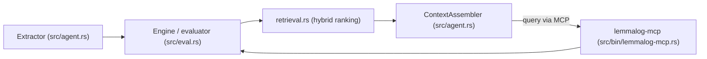
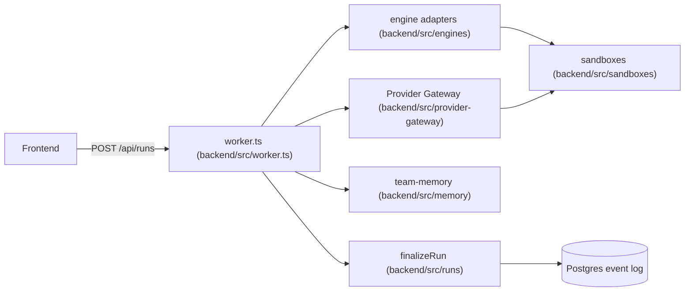

# Agentic AI Weekly Scan — 25/08/2026 → 01/09/2026

## Tóm tắt điều hành

- Tuần này quét được rất nhiều repo gắn mác "agentic" mới tạo, nhưng phần lớn là skill/prompt cho Claude Code, gateway mỏng, hoặc awesome-list — sau khi lọc chỉ còn **3 repo** đạt tiêu chí kiến trúc thật sự đáng đọc (thấp hơn mức tối đa 4, chủ động không "độn" thêm repo yếu).
- Điểm chung đáng chú ý: cả ba đều coi **log sự kiện (event log/event sourcing) là nguồn sự thật** thay vì giữ state chỉ trong bộ nhớ — `lemmalog` dùng nó cho fact/provenance, `pentest-harness` dùng cho session replay, `useAgent` dùng Postgres event log cho durable run.
- Một repo (`lemmalog`) đưa ra kiến trúc bộ nhớ agent khác biệt hẳn xu hướng vector-RAG (Datalog suy diễn thay vì embedding thuần), kèm số liệu benchmark cụ thể (LongMemEval, LoCoMo) — hiếm gặp ở một repo mới 5 ngày tuổi.

## Mục lục

1. [Lemmalog — Datalog Engine cho Agent Memory](#1-lemmalog)
2. [Pentest Harness — Plugin-based Agent Harness cho Security](#2-pentest-harness)
3. [useAgent — AI Coworker Orchestration Platform](#3-useagent)
4. [Repo bị loại và lý do](#repo-bị-loại-và-lý-do)

---

## 1. Lemmalog

Repo: [github.com/JordyZomer/lemmalog](https://github.com/JordyZomer/lemmalog)

### §1 — Bối cảnh nhanh

Một Datalog engine viết bằng Rust, dùng làm bộ nhớ làm việc (working memory) suy diễn được cho LLM agent, thay vì chỉ lưu embedding. Stack: Rust (edition 2021), không phụ thuộc runtime ngoài `serde_json`/`ureq` (tùy chọn qua feature flags `llm`, `mcp`); tích hợp MCP server (`lemmalog-mcp`) cho Claude Code/Kimi CLI. Repo health: 240 sao, 17 fork, tạo ngày 27/08/2026, commit gần nhất 31/08/2026; không tìm thấy thư mục `.github/workflows` (không có CI Actions công khai); có bộ test riêng (42 test đơn vị + differential testing so với "naive fixpoint oracle" theo tài liệu thiết kế). Số lượng contributor chính xác không xác định được qua API (trang contributors cần JavaScript), nhưng mọi bằng chứng cho thấy đây là dự án một tác giả.

### §2 — Kiến trúc chuyên sâu

**A. Component inventory**
- `Engine`/evaluator (`src/eval.rs`) — seminaive fixpoint evaluator, stratified negation, leapfrog-join, magic-sets demand evaluation (`ask_deep`).
- `Extractor` trait + `MockExtractor`, `ContextAssembler` (`src/agent.rs`) — ranh giới gọi LLM để trích xuất fact từ episode, và bộ lắp ráp context theo vị trí (positional assembly).
- `ast.rs` — AST cho rule/query Datalog.
- `intern.rs` — interning entity thành ID nguyên (Value/Term).
- `retrieval.rs` — xếp hạng lai (hybrid ranking: BM25 + entity-match + salience diffusion).
- `magic.rs`, `semantics.rs`, `canonical.rs` — magic-sets rewriting, phân tích ngữ nghĩa, chuẩn hóa.
- `session.rs` — quản lý episode/session.
- `longmemeval.rs` và binary `lemmalog-bench` (`src/bin/lemmalog-bench.rs`) — harness benchmark LongMemEval/LoCoMo.
- Binary `lemmalog-mcp` (`src/bin/lemmalog-mcp.rs`) — MCP server expose 3 tool: `query`, `declare/install`, `why`.

**B. Control flow**: **event-driven pipeline** (không phải ReAct kinh điển) — mỗi lượt hội thoại là một sự kiện/epoch kích hoạt chuỗi ingest → update decision → derive → retrieve, mô tả rõ trong `datalog-context-engine-design.md` §3.4:
1. Ingest (bất đồng bộ, sau lượt hội thoại): `Extractor` biến episode thành candidate fact có confidence + provenance, được memo hóa theo `(episode-hash, extractor-version)`.
2. Update decision: tầng rule (stratum) phát hiện mâu thuẫn/trùng lặp; trường hợp rõ ràng được rule tự xử lý (đặt `valid_to`), trường hợp mơ hồ được leo thang cho agent.
3. Derive: engine tái hội tụ fixpoint trên delta mới bằng seminaive evaluation — chạy nền, không nằm trên hot path.
4. Retrieve & assemble: `ContextAssembler` đặt fact đã suy diễn (độ tin cậy cao) ở đầu context, trích dẫn provenance nguyên văn ở cuối, theo ngân sách token cố định.
5. Agent gọi `lemmalog.query()` qua MCP để truy vấn view đã suy diễn theo Datalog bị giới hạn độ sâu (an toàn, đảm bảo dừng).
6. `lemmalog.why(fact)` trả về cây chứng minh (proof tree) khi cần audit.

**C. State & data flow**: đơn vị dữ liệu là **quan hệ có chú thích bi-temporal** — tuple `(entity, relation, object, valid_from, valid_to, asserted_at, confidence, provenance)`, chú thích qua semiring (confidence dùng t-norm, provenance dùng set-union). Lưu trữ: fact log append-only kiểu event-sourcing + snapshot quan hệ dạng cột + WAL, hoàn toàn cục bộ (không Redis/SQL server ngoài). Quản lý context: assembler định vị theo vị trí (positional), không phải sliding-window hay tóm tắt LLM.

**D. Tool/capability integration**: 3 tool agent-facing qua MCP (`query`, `declare/install`, `why`); không dùng function-calling gốc của model để gọi engine mà expose như MCP tool chuẩn, có ràng buộc độ sâu đệ quy để chống chương trình không dừng.

**E. Memory architecture**: ngắn hạn = delta theo từng lượt hội thoại (epoch); dài hạn = view suy diễn được duy trì tăng dần, lưu bền qua snapshot+WAL; truy xuất là hybrid BM25 + graph entity-match + salience lan truyền kiểu PPR giới hạn độ sâu (rule `near`).

**F. Model orchestration**: LLM chỉ được gọi ở ranh giới ingestion (extractor) — fixpoint suy diễn hoàn toàn không chứa LLM call (chủ đích thiết kế). Đã thử nghiệm với Claude Opus và qwen3.8-27b+nomic-embed qua LM Studio; không có fallback model rõ ràng trong code đã đọc.

**G. Observability & eval**: differential testing so với oracle fixpoint ngây thơ (bắt được lỗi soundness của negation); LongMemEval F1 0.483 (30 mẫu, "hòa thống kê" với baseline full-context F1 0.50 nhưng ít token hơn 1.4–30 lần), LoCoMo F1 0.573 (hạng 2/10); không dùng OpenTelemetry/Langfuse, chỉ eval harness tùy biến.

**H. Extension points**: `Extractor` và `Embedder` là trait có thể thay thế; rule Datalog cài đặt runtime qua `lemmalog.install()`, có versioning và rollback; feature flag `mcp`/`llm` bật/tắt tích hợp.

### §3 — Sơ đồ kiến trúc



### §4 — Đánh giá

Điểm mới thực sự: kết hợp **bi-temporal supersession + semiring provenance + incremental Datalog evaluation** làm nền bộ nhớ agent, expose qua đúng 3 tool MCP tối giản (`query`/`declare`/`why`) — và điều hiếm thấy là tác giả tự báo cáo kết quả "hòa thống kê" thay vì phóng đại thắng baseline. Điểm trừ: repo 5 ngày tuổi, không CI Actions, eval LongMemEval mới chạy 30 mẫu (N nhỏ), chất lượng toàn hệ thống phụ thuộc hoàn toàn vào extractor LLM ("garbage rules over garbage facts" — tự thừa nhận trong design doc). Câu hỏi mở: rule registry có thực sự chặn được rule do agent tự cài gây xung đột/loop ở quy mô lớn không, và hiệu năng ở 10M tuple (mới chỉ benchmark ở kịch bản 1000 lượt) ra sao.

---

## 2. Pentest Harness

Repo: [github.com/S1N6H/pentest-harness](https://github.com/S1N6H/pentest-harness)

### §1 — Bối cảnh nhanh

Agent harness dạng plugin-toàn-phần (built trên "Cordis", vendor hóa trong repo) dành cho pentest/bug-bounty/CTF có phép, chạy cục bộ. Stack: TypeScript/Node ^22.19–24, pnpm workspace, Python SDK đi kèm, native addon Rust/Node cho sandbox landlock. Repo health: 314 sao, 49 fork, tạo 26/08/2026, commit gần nhất 29/08/2026, 7 PR đang mở, 0 issue mở; **20 workflow GitHub Actions** (ci.yml, ci-master.yml, e2e.yml, e2b-e2e.yml, sandbox.yml, landlock-run.yml, release*.yml…) — CI/test rất đầy đủ cho một repo mới. Số contributor chính xác không xác định qua API, nhưng cấu trúc AGENTS.md/CLAUDE.md rất chi tiết cho thấy phát triển có kỷ luật cao (có thể với sự hỗ trợ nặng của agent AI).

### §2 — Kiến trúc chuyên sâu

**A. Component inventory**
- `agent-loop` (`packages/core/agent-loop`) — bộ điều khiển agent mặc định (turn/step driver).
- `agent` (`packages/core/agent`) — interface, registry và từ vựng sự kiện của agent.
- `session` (`packages/core/session`) — session log dạng event-sourced, lưu trong bộ nhớ ("in-memory storage system").
- `tools` (`packages/core/tools`) — registry tool có phạm vi (scoped) và pipeline thực thi.
- `system-prompt` (`packages/core/system-prompt`) — registry lắp ráp prompt và tool-schema.
- `subagent` (`packages/subagent`) — tool ủy quyền (delegation) cho subagent.
- `guard` (`packages/guard`) — `repeat-tool-reminder` (cảnh báo lặp tool) và `timeout-policy` (deadline mỗi tool call).
- `sandbox` (`packages/sandbox`) — seam giam giữ tiến trình, nhiều backend (gồm landlock).
- `compaction` (`packages/compaction`) — capability nén context.
- `interaction` (`packages/interaction`) — seam human-in-the-loop/approval.
- `llm` (`packages/llm`) — Service Definition trừu tượng + adapter (DeepSeek…).
- `mcp` (`packages/mcp`) — tích hợp MCP.
- `acp` (`packages/acp`) — server Agent Client Protocol tự động hóa.

**B. Control flow**: **state machine hướng sự kiện** trên nền plugin Cordis (không phải ReAct tự do mà là chuỗi trạng thái tường minh, tài liệu trong `docs/architecture.md`):
1. `turn/start` → nhận input cho step tiếp theo.
2. `agent/pre-step` → lắp ráp các phần prompt (qua `system-prompt`).
3. `step/start` → nối message, suy ra lịch sử gửi model → `agent/request`.
4. `llm/stream` → `assistant/message`.
5. `tool/call*` → `tools/execute` (chạy trong `sandbox`) → `tool/result*`.
6. `step/end` → `agent/turn-stopping` → `turn/end`.

**C. State & data flow**: dữ liệu giữa component là **event có kiểu (typed event map)**, không phải chuỗi tự do — nguyên tắc kiến trúc "Model-visible ⟺ logged": bất cứ gì tới model đều phải tái dựng được từ session log. Lưu trữ: session log event-sourced, in-memory (theo mô tả package); nén context qua `compaction` (chỉ có "basic provider", chưa rõ chiến lược cụ thể từ file đã đọc).

**D. Tool/capability integration**: theo mẫu **capability seam** (Service Definition / Service Provider / Consumer) — tool đăng ký qua `ctx.tools`, model adapter qua `ctx.llm`. Sandbox hóa thật ở cấp OS (landlock, qua `native/` + `packages/sandbox`) — hiếm thấy ở agent harness mã nguồn mở, đáng chú ý cho hạng mục "guardrail".

**E. Memory architecture**: không có subsystem bộ nhớ dài hạn tách biệt ngoài session log + `compaction`; không xác định từ code liệu có vector store hay không.

**F. Model orchestration**: `llm` package định nghĩa Service Definition trừu tượng, README nêu hỗ trợ đa nhà cung cấp (OpenAI/Anthropic/DeepSeek/Google/Mistral/Groq/OpenRouter/Azure) nhưng cơ chế fallback/định tuyến cụ thể không xác định từ các file đã đọc.

**G. Observability & eval**: session log chính là cơ chế replay/audit (`test:snapshot` — "keyless ACP/headless replay vs expected outputs"); coverage gate 100% per-file trên `packages/*/*/src`; không thấy OpenTelemetry/Langfuse.

**H. Extension points**: "everything is a plugin" — thêm capability = thêm plugin package theo bộ ba Service Definition/Provider/Consumer; `packages/preset` cho phép soạn agent theo phiên từ file `cordis.yml`; `packages/extensions` cho phép agent tự soi/tự gắn plugin của chính nó (self-modification).

### §3 — Sơ đồ kiến trúc

```mermaid
sequenceDiagram
    participant U as User
    participant Loop as agent-loop (packages/core/agent-loop)
    participant Prompt as system-prompt (packages/core/system-prompt)
    participant LLM as llm (packages/llm)
    participant Tools as tools (packages/core/tools)
    participant Sandbox as sandbox (packages/sandbox)
    participant Session as session (packages/core/session)

    U->>Loop: turn/start
    Loop->>Prompt: assemble prompt sections
    Loop->>Session: log input
    Loop->>LLM: agent/request
    LLM-->>Loop: assistant/message + tool/call*
    Loop->>Tools: tools/execute
    Tools->>Sandbox: process-confined execution
    Sandbox-->>Tools: tool/result*
    Tools-->>Loop: tool/result*
    Loop->>Session: log step/end
    Loop-->>U: turn/end
```

### §4 — Đánh giá

Điểm mới thực sự: áp dụng kiến trúc **capability-seam + plugin toàn phần** (không có "core code đặc quyền" — kể cả agent-loop cũng chỉ là một plugin thay được) vào một agent harness bảo mật cụ thể, cộng với nguyên tắc kiến trúc cứng "model-visible ⟺ logged" đảm bảo replay/fork/resume, và sandbox hóa thật ở cấp OS (landlock) thay vì chỉ giới hạn ở prompt. Đây là mức kỷ luật kỹ thuật hiếm gặp ở repo 6 ngày tuổi. Điểm trừ: mục đích pentest kép (tấn công) đi kèm rủi ro lạm dụng dù có tuyên bố "chỉ dùng có phép"; tài liệu tự nêu rõ "pre-release — không cam kết tương đương ngược" (schema có thể vỡ bất cứ lúc nào); bề mặt hơn 40 package cho một repo mới là rủi ro bảo trì nếu chỉ có một tác giả chính. Câu hỏi mở: các tool pentest cụ thể (không phải phần khung) đã trưởng thành tới đâu, và guard/timeout-policy có thực sự chặn được hành vi agent chạy lan (runaway) trong tình huống thực chiến hay chỉ là cảnh báo tư vấn.

---

## 3. useAgent

Repo: [github.com/useagenthq/useagent](https://github.com/useagenthq/useagent)

### §1 — Bối cảnh nhanh

Nền tảng điều phối biến các coding agent có sẵn (Claude Code, Codex, OpenCode) thành "đồng nghiệp AI" chạy trên sandbox cloud riêng, trả lại sản phẩm hoàn chỉnh (website, PR, tài liệu). Stack: TypeScript/Bun, Postgres 16+ với pgvector, Drizzle ORM, sandbox qua Daytona hoặc CubeSandbox. Repo health: 220 sao, 28 fork, tạo 29/08/2026, commit gần nhất 31/08/2026, giấy phép AGPL-3.0 (có license thương mại riêng — mô hình open-core); có CI (`ci.yml`, `docs.yml`); trạng thái tự khai báo "alpha". Là repo tổ chức (useagenthq), số contributor chính xác không xác định qua API.

### §2 — Kiến trúc chuyên sâu

**A. Component inventory**
- Worker/actor-per-run (`backend/src/worker.ts`) — registry một actor logic cho mỗi run id, điều phối dispatch/cancel/finalize.
- Engine adapters (`backend/src/engines`) — `resolveProviderRegistration`/`runProviderTurn` cho OpenCode/Claude/Codex.
- Provider Gateway (`backend/src/provider-gateway`) — cấp và xác minh capability đã ký cho provider, proxy traffic, quản lý credential.
- Knowledge Gateway (`backend/src/knowledge/gateway`) — expose MCP tool cho phiên sandbox bằng token ngắn hạn thay vì credential thô.
- Sandboxes (`backend/src/sandboxes`) — trừu tượng hóa Daytona/CubeSandbox.
- Team memory (`backend/src/memory/team-memory.ts`, `memory/scope.ts`, `memory/retrieval-ledger.ts`) — nhớ lại theo phạm vi tổ chức, ghi log truy xuất.
- Skills (`backend/src/skills`) — catalog, pin phiên bản, format skill.
- Fleet (`backend/src/fleet/admission.ts`, `fleet/pump.ts`) — kiểm soát nhận việc/đồng thời giữa các run.
- Runs (`backend/src/runs` — `finalize.ts`, `turn-stream.ts`, `run-timing.ts`, `inactivity-watchdog.ts`) — vòng đời run bền vững.
- `agent-harness` package (`packages/agent-harness/src`) — từ vựng sự kiện chuẩn (canonical event vocabulary) dịch từ OpenCode/Claude ACP/Codex ACP.

**B. Control flow**: **orchestration theo actor bền vững trên event log** (mỗi run là một actor sống trong Postgres event log, không phải vòng lặp ReAct đơn giản):
1. Frontend gửi run qua `POST /api/runs`.
2. Backend phân giải danh tính/tổ chức, kiểm tra chính sách engine và tài nguyên, ghi run+command vào DB nguyên tử.
3. `worker.ts` phân giải engine qua provider registry, đăng ký actor trong `registry` Map theo `runId`.
4. Worker gom context (nhớ lại từ `memory`, catalog `skills`, snapshot tài nguyên) rồi gọi `runProviderTurn`, stream qua engine adapter vào sandbox cô lập.
5. Sự kiện stream ngược qua SSE (`bus`/`channel`); mọi lời gọi tool/tích hợp đi qua Provider Gateway/Knowledge Gateway (credential không bao giờ vào sandbox); tool phá hủy dừng lại chờ approval card.
6. Khi xong/hủy/timeout, `finalizeRun` ghi trạng thái cuối vào Postgres, xếp hàng việc theo sau (ghi nhớ, gửi Slack), `emitFinalizedEnd` phát sự kiện bus.

**C. State & data flow**: hợp đồng sự kiện **có kiểu, chuẩn hóa** qua `@useagent/agent-harness/canonical` — không phải chuỗi tự do. Lưu trạng thái: Postgres làm nguồn sự thật (event sourcing), yêu cầu bắt buộc extension pgvector (ngụ ý embedding cũng nằm trong Postgres). Quản lý context: gom skill catalog + memory recall trước khi dispatch (thấy trong import của `worker.ts`); chi tiết chiến lược nén/sliding-window không xác định từ các file đã đọc.

**D. Tool/capability integration**: tool được "trusted gateway" của backend expose có kiểu; credential không bao giờ vào sandbox. MCP dùng ở Knowledge Gateway cho tool tri thức. Việc gọi tool bên trong một lượt thực thi (function-calling) do chính engine bên dưới (Claude Code/Codex/OpenCode) đảm nhiệm — useAgent điều phối agent có sẵn chứ không tự cài vòng lặp function-calling riêng.

**E. Memory architecture**: dịch vụ team-memory tùy chọn (`MEMORY_API_URL` không set thì tắt hẳn — "off when unset"), có scope theo tổ chức, ghi log nguồn truy xuất (`retrieval-ledger.ts`); cơ chế truy xuất cụ thể (vector/keyword/hybrid) không xác định chắc chắn từ file đã đọc, dù pgvector là dependency bắt buộc gợi ý hướng vector.

**F. Model orchestration**: không tự chạy LLM — chọn model phụ thuộc engine người dùng cấu hình (Claude Code/Codex/OpenCode, dùng subscription của chính họ); không có fallback engine tường minh trong phần code đã đọc.

**G. Observability & eval**: Postgres event log cho phép replay đầy đủ; SSE reconnect trả "fresh authoritative snapshot"; `run-timing.ts` theo dõi stage timer và outcome (tiền đề cho quan sát chi phí/độ trễ); có test (`worker.test.ts`, `engine-gate.test.ts`, `release.test.ts`); không thấy OpenTelemetry/Langfuse trong phần đã đọc.

**H. Extension points**: engine là "một cái phích cắm" — thêm engine mới chỉ cần một adapter theo canonical event contract; sandbox provider pluggable (Daytona/CubeSandbox sau một contract chung); skill nạp từ GitHub dưới dạng `SKILL.md` có versioning; connector qua OAuth broker (Gmail/Linear/Notion/HubSpot).

### §3 — Sơ đồ kiến trúc



### §4 — Đánh giá

Điểm mới thực sự: tách bạch triệt để giữa **hợp đồng sự kiện chuẩn hóa, không phụ thuộc engine** (cho phép hoán đổi Claude Code/Codex/OpenCode mà thread/artifact/memory không đổi) với thiết kế "trusted gateway — credential không bao giờ vào sandbox" và approval card cho tool phá hủy — một câu trả lời có hình hài production cho câu hỏi "chạy coding agent của người khác như đồng nghiệp tự động một cách an toàn thế nào". Điểm trừ: tự nhận "alpha", và đáng chú ý nhất — comment ngay trong `worker.ts` nói thẳng vòng lặp actor hiện tại "is a STUB" thay cho "the real Claude Agent SDK loop (migration step 2)", nghĩa là phần lõi thực thi công khai thừa nhận chưa hoàn thiện; cơ chế bộ nhớ/truy xuất cũng chưa đủ minh bạch qua các file public. AGPL-3.0 kèm license thương mại là mô hình open-core, cần cân nhắc khi đánh giá governance dài hạn. Câu hỏi mở: vòng lặp agent thật (sau khi thay STUB) sẽ trông ra sao, và fleet admission control chịu tải đồng thời thực tế tốt tới đâu.

---

## Repo bị loại và lý do

| Repo | Lý do loại |
|---|---|
| `Nanako0129/sepia` | Là skill "de-AI writing" cho agent có sẵn, không phải framework/orchestration — không có component agent (planner/executor/tool registry). |
| `cbrock84/headcount` | Ngôn ngữ chủ yếu Markdown — bộ sưu tập skill/prompt cho Claude Code, đúng dạng "disguised prompt-engineering framework" bị loại trừ theo tiêu chí. |
| `hkqr/my-free-code` | Chỉ 86KB, là gateway định tuyến model đơn thuần (proxy), không có kiến trúc agent (planner/memory/tool registry) đủ sâu để phân tích §2. |
| `MirroS-Lab/Code-as-World` | Repo nghiên cứu world-model/VLM cho physical reasoning; "agentic" ở đây là quy trình training/eval offline, không phải hệ thống agent runtime với component tương tác được — không đủ bằng chứng cho khung phân tích component-based. |
| Các repo `alphaparkinc/genpark-*`, `breko861-hash/*`, `Akgithub2028/LOOM`, v.v. (từ truy vấn "multi-agent orchestration") | Đa số 2–8 sao, tạo trong 1 ngày, không có cấu trúc `/src` hay `/docs` đáng kể — thuộc diện repo hobby/thử nghiệm dưới ngưỡng LOC tối thiểu. |

## Ghi chú phương pháp

- Endpoint `GET /repos/{owner}/{repo}` và `GET /repos/{owner}/{repo}/contents/{path}` của GitHub REST API liên tục trả 403 qua công cụ fetch trong phiên này (kể cả với repo lớn như `torvalds/linux`), trong khi `GET /search/repositories` vẫn hoạt động ổn định — nghi ngờ giới hạn/khóa riêng theo endpoint từ phía proxy hoặc GitHub, không phải do vượt hạn mức 60 request/giờ. Đã khắc phục bằng cách dùng `search/repositories?q=repo:{owner}/{repo}` để lấy metadata, và các trang HTML `github.com/{owner}/{repo}/tree/...` + `raw.githubusercontent.com` để lấy directory listing/nội dung file — cả hai đều hoạt động bình thường trong suốt phiên.
- Vì hạn chế trên, số lượng contributor chính xác (cần trang `graphs/contributors` render bằng JS) không lấy được cho cả ba repo; đã ghi rõ "không xác định" thay vì đoán.
