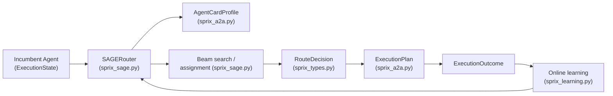
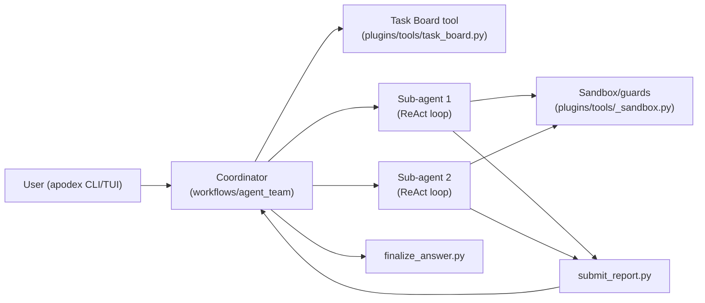
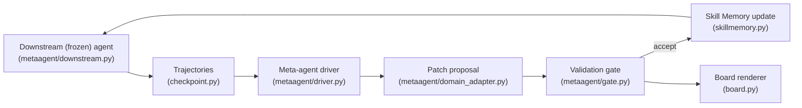

# Weekly Agentic AI Scan — 2026-09-02

Phạm vi: các repo GitHub về agentic AI được tạo mới hoặc cập nhật đáng kể trong khoảng 26/08 – 02/09/2026 (~7 ngày), có traction thực tế và có bằng chứng kiến trúc kiểm chứng được từ README + source code.

## Tóm tắt điều hành

- Tuần này nổi bật nhất là **lemmalog** — một hướng đi khác biệt cho agent memory: dùng Datalog engine (suy diễn hình thức, có provenance, bi-temporal) thay vì vector RAG thông thường, kèm chính sách cập nhật fact kiểu Mem0 (ADD/UPDATE/NOOP/ESCALATE) rất rõ ràng.
- **sprix-sage-router** và **FrontierAgent** đại diện cho hai cách tiếp cận orchestration khác nhau: một là routing động giữa SELF/COLLABORATE/HANDOFF tại các checkpoint giữa tác vụ (không phải quyết định một lần khi dispatch), một là mô hình coordinator chỉ-lập-kế-hoạch (không thực thi code) điều phối sub-agent chạy song song trong sandbox cô lập bằng cgroup/network guard.
- **Recuris** là repo có eval methodology nghiêm túc nhất trong nhóm: cải thiện agent bằng cách tiến hóa memory (không fine-tune, không sửa prompt), với một "validation gate" dùng paired-bootstrap confidence interval và held-out split trước khi chấp nhận patch — đây là tuyên bố có thể kiểm chứng, không phải marketing.
- Một số ứng viên khác (Cybermes, hexstellar, useagent, acryl, quackd...) bị loại vì thiên về tool-wrapper/gộp CLI tool có sẵn hơn là kiến trúc agent mới, hoặc README mang tính marketing nhiều hơn bằng chứng code kiểm chứng được (xem phần "Loại trừ" cuối file).

## Mục lục

1. [lemmalog — A Datalog Engine for Agent Memory](#1-lemmalog--a-datalog-engine-for-agent-memory)
2. [Sprix SAGE Router — checkpoint-aware mid-execution rerouting cho A2A](#2-sprix-sage-router--checkpoint-aware-mid-execution-rerouting-cho-a2a)
3. [FrontierAgent — ReAct + Agent Team runtime](#3-frontieragent--react--agent-team-runtime)
4. [Recuris — Recursive Memory Evolution cho Long-Horizon Agent](#4-recuris--recursive-memory-evolution-cho-long-horizon-agent)

---

## 1. lemmalog — A Datalog Engine for Agent Memory

**[JordyZomer/lemmalog](https://github.com/JordyZomer/lemmalog)**

### §1 — Quick context

Datalog engine đóng vai trò bộ nhớ có thể suy diễn và kiểm chứng cho LLM agent, thay thế vector store bằng deductive database. Stack: Rust (edition 2021), optional `serde_json`/`ureq`, expose qua MCP server (`lemmalog-mcp`), CLI (`lemmalog-cli`), REPL, hoặc Rust crate nhúng. Repo health: 252 sao, 18 fork, tạo ngày 27/08/2026, 32 commit trên nhánh main, MIT license, có 44 unit test (`cargo test`) nhưng **không tìm thấy thư mục `.github/workflows`** — tức không có CI tự động chạy test.

### §2 — Architecture deep-dive

**A. Component inventory**
- `Core Engine` (`src/eval.rs`) — stratified Datalog, seminaive fixpoint evaluation, negation-as-absence, trail-backtracking, hash index theo vị trí.
- `AgentMemory facade` (`src/agent.rs`) — kết hợp inference engine, extractor, episode list, escalation queue; expose `observe()`, `maintain()`, `ask()`.
- `Extractor / MockExtractor / LlmExtractor` (`src/agent.rs`) — ranh giới trích xuất, chuyển Episode (đoạn hội thoại) thành `CandidateFact`.
- `Magic-sets query engine` (`src/magic.rs`) — demand-driven rewriting cho `ask_deep()`, tránh full fixpoint khi chỉ cần point query.
- `Session/REPL` (`src/session.rs`) — command surface dòng lệnh (`rule`, `+`, `?`, `??`, `why`, `run`, `dump`) dùng chung cho REPL, test, và MCP.
- `MCP server binary` (`lemmalog-mcp`, khai báo trong `Cargo.toml`, feature `mcp`) — expose engine như MCP tool cho agent harness bên ngoài.
- `Symbol interner` (`src/intern.rs`), `Semantic indexing` (`src/semantics.rs`).

**B. Control flow pattern.** Đây **không phải** một agent-loop (không có planner/executor riêng) mà là một **data-plane component event-driven**, được một agent bên ngoài gọi qua MCP tool-call hoặc crate API — mô hình "query/ingest-response" của một database engine, không phải ReAct hay supervisor-workers.

Happy path (6 bước):
1. Agent ngoài gọi `observe()`/`observe_at()` với một `Episode` (id, text, timestamp, speaker).
2. `Extractor` (Mock hoặc Llm) chuyển text thành `CandidateFact` (subject, predicate, object, confidence).
3. `apply_update()` áp chính sách xác định: ADD (fact mới) / NOOP (trùng) / UPDATE (predicate loại trừ) / ESCALATE (mâu thuẫn ở predicate không loại trừ).
4. Fact được lưu vào store có index; `maintain()` chạy seminaive fixpoint tăng dần trên các stratified rule để suy ra fact mới.
5. Agent gọi `ask()`/`ask_deep()` (magic-sets) hoặc `assemble_context()` để lấy fact/episode liên quan trong ngân sách token.
6. Có thể gọi `why()` để lấy proof tree kèm provenance cho bất kỳ fact nào trả về.

**C. State & data flow.** Message vào là `Episode`; state nội bộ là fact có annotation bi-temporal (`valid_from`/`valid_to`/`asserted_at`) và semiring (confidence × provenance). Lưu trữ: in-memory, persist bằng snapshot tab-separated, rebuild qua event sourcing khi load. Quản lý context window: `assemble_context()` giảm hiện tượng "lost-in-the-middle" (fact tin cậy cao ở đầu, episode gốc ở cuối) trong ngân sách token; README báo cáo giảm ~45x token trên LongMemEval và ~6x trên LoCoMo (số liệu tự báo cáo, chưa kiểm chứng độc lập).

**D. Tool/capability integration.** Expose như MCP server (JSON-RPC qua `serde_json`) để mọi harness hỗ trợ MCP gọi `ask`/`observe`/`why` như tool; ngoài ra có CLI và crate nhúng. Không cần sandbox vì đây là data engine cục bộ, không thực thi code.

**E. Memory architecture.** Đây chính là kiến trúc memory: long-term = fact suy diễn + provenance trong Datalog store; short-term = Episode gốc; "compaction" tương đương incremental derivation kiểu DRed-lite (chỉ tính lại phần phụ thuộc bị ảnh hưởng); retrieval = hybrid BM25 trên fact + text episode, có entity-match boosting.

**F. Model orchestration.** `LlmExtractor` bọc một model call OpenAI-compatible (LM Studio/llama.cpp/OpenAI qua feature `llm`) chỉ ở bước trích xuất; fixpoint suy diễn cốt lõi **không gọi LLM** — lựa chọn thiết kế tường minh để giữ suy diễn deterministic.

**G. Observability & eval.** Có `benchmarks/`, binary `lemmalog-bench`, `src/scenario.rs` là harness đánh giá tổng hợp; số liệu LongMemEval/LoCoMo nêu trong README. Không thấy tích hợp OpenTelemetry/Langfuse — không xác định từ code.

**H. Extension points.** `Extractor` trait cho phép cắm logic trích xuất tùy biến; `skills/lemmalog/SKILL.md` đóng gói thành agent skill; giao diện MCP cho harness bất kỳ; dùng như thư viện Rust nhúng.

### §3 — Architecture diagram

### §4 — Verdict

Điểm mới thật sự: dùng deductive database (Datalog) làm memory thay vì vector RAG, với chính sách cập nhật fact kiểu Mem0 (ADD/UPDATE/NOOP/ESCALATE) rõ ràng, deterministic, và có proof tree (`why()`) cho khả năng audit — hiếm thấy ở agent-memory repo. Tách bạch LLM (chỉ ở extraction boundary) khỏi fixpoint suy diễn (không LLM) là thiết kế đáng học. Red flag: không có CI (`.github/workflows` không tồn tại), chỉ dựa vào `cargo test` thủ công; số liệu giảm token 45x/6x là tự báo cáo, tôi chưa chạy lại được để kiểm chứng độc lập; repo còn rất mới (32 commit), số lượng contributor không rõ. Câu hỏi mở: entity resolution xử lý hội thoại nhiễu/không chính thức tốt tới đâu; `LlmExtractor` có được đánh giá độ chính xác ngoài LongMemEval/LoCoMo không.

---

## 2. Sprix SAGE Router — checkpoint-aware mid-execution rerouting cho A2A

**[wang2122/sprix-sage-router](https://github.com/wang2122/sprix-sage-router)**

### §1 — Quick context

Lớp quyết định routing runtime cho mạng multi-agent theo giao thức A2A (Agent2Agent): tại mỗi checkpoint giữa tác vụ, quyết định agent hiện tại nên tiếp tục (SELF), gọi thêm đồng đội (COLLABORATE), hay chuyển giao hoàn toàn (HANDOFF). Stack: Python ≥3.10, **zero runtime dependency** (chỉ dùng dev-deps: mypy, ruff, build, twine), MIT license. Repo health: 3.185 sao, 368 fork, tạo ngày 18/08/2026, 43 commit, có CI (`.github/workflows/tests.yml`) và bộ `test_*.py`. Tỉ lệ sao/hoạt động cao bất thường so với tuổi repo — cần thận trọng khi diễn giải mức độ "traction thực".

### §2 — Architecture deep-dive

**A. Component inventory**
- `SAGERouter` (`sprix_sage.py`) — engine quyết định SELF/COLLABORATE/HANDOFF.
- `Beam search scheduler` (`sprix_sage.py`, hàm `_beam_collaboration_decisions`, `_assignment_candidates`) — tìm kiếm đội hình và phân vai theo topological order, giới hạn beam width.
- `Online learning model` (`sprix_learning.py`) — ước lượng độ tin cậy (Beta belief) theo agent, theo skill, và synergy giữa cặp agent, cập nhật từ `ExecutionOutcome`.
- `Type/data contracts` (`sprix_types.py`) — `Task`, `Requirement`, `Agent`, `Bid`, `RouteDecision`, `ExecutionState`, `ExecutionOutcome`, `RouterWeights`, đều validate range số học.
- `A2A adapter` (`sprix_a2a.py`) — `AgentCardProfile`, `ExecutionStep`, `ExecutionPlan`, hàm `profile_from_agent_card()` và `execution_plan()`.
- Test suite `test_*.py` + CI workflow (`.github/workflows/tests.yml`).

**B. Control flow pattern.** **Router dạng handoff/swarm được checkpoint-hóa** (không phải supervisor tĩnh phân công một lần) — đứng như một lớp quyết định phía trên A2A, được gọi lại nhiều lần trong vòng đời một task khi trạng thái thay đổi, khác với pattern hierarchical/supervisor cổ điển chỉ phân công lúc dispatch.

Happy path (6 bước):
1. Agent đang thực thi một `Task` chạm checkpoint (tiến độ DAG thay đổi), gọi router kèm `ExecutionState` hiện tại.
2. Router dựng/refresh `AgentCardProfile` cho các agent ứng viên qua `profile_from_agent_card()` (kết hợp skill khai báo trong Agent Card + bằng chứng đo được cục bộ, chủ động không suy diễn năng lực từ văn bản marketing).
3. `_topological_requirements()` tính các requirement khả thi hiện tại theo phụ thuộc DAG.
4. `_beam_collaboration_decisions()` + `_assignment_candidates()` tìm đội và phân vai bằng beam search có giới hạn, chấm điểm theo coverage, vi phạm ràng buộc, và utility (trust, synergy, cost, latency, switching friction).
5. Router trả `RouteDecision` (mode + agent được chọn) kèm `RoutingTrace` (phương án thắng + các phương án khác); `execution_plan()` chuyển thành `ExecutionPlan` trung lập về transport cho A2A client.
6. Sau khi thực thi, `ExecutionOutcome` được đưa ngược vào `sprix_learning.py` để cập nhật Beta-belief (vòng lặp online learning).

**C. State & data flow.** Message là dataclass được validate chặt (`Task`, `Agent`, `Bid`, `RouteDecision`...); state là `ExecutionState` in-memory theo từng task (không phụ thuộc DB ngoài — phù hợp với zero runtime dependency). Quản lý context window: không xác định từ code — router thao tác trên metadata task/agent có cấu trúc, không trực tiếp quản lý token của LLM.

**D. Tool/capability integration.** Thích ứng với giao thức A2A qua Agent Card; bản thân router không gọi LLM/tool — nó điều phối các agent bên ngoài vốn đã nói A2A. Cách các agent downstream gọi tool cụ thể (native function-calling, MCP...) không xác định từ code trong repo này.

**E. Memory architecture.** Không có bộ nhớ dài hạn dạng lưu trữ tri thức; chỉ có belief state (Beta distribution theo agent/skill/cặp agent) tồn tại xuyên suốt các quyết định routing trong một tiến trình — bản chất là online learning ngắn hạn, không phải retrieval memory.

**F. Model orchestration.** Router tự thân không gọi LLM (zero runtime dependency, chấm điểm thuần thuật toán); việc orchestration model được giao hoàn toàn cho các agent nó điều phối.

**G. Observability & eval.** `benchmark.py`, `benchmark_dynamic.py`, `benchmark_trust.py` + `docs/` hướng dẫn benchmarking; `RoutingTrace` ghi lại phương án thắng và các phương án bị loại để phục vụ audit; có `ALGORITHM.md` đặc tả hình thức. Không thấy OpenTelemetry/Langfuse — không xác định từ code.

**H. Extension points.** `RouterWeights` cho phép tinh chỉnh hệ số utility; `AgentCardProfile` cắm được profile mới; `docs/` có hướng dẫn tích hợp vào mạng A2A khác.

### §3 — Architecture diagram

### §4 — Verdict

Điểm mới đáng chú ý: coi routing là quyết định **liên tục, có checkpoint** thay vì phân công một lần lúc dispatch — phần lớn framework multi-agent khác quyết định "ai làm gì" ngay từ đầu, còn ở đây router được tư vấn lại giữa chừng dựa trên Beta-belief học online về trust/synergy. Zero runtime dependency + mypy strict cho một repo 2 tuần tuổi là mức kỷ luật hiếm gặp. Red flag lớn nhất: 3.185 sao / 368 fork sau chỉ 43 commit và ~2 tuần tồn tại, từ một tài khoản cá nhân, là tỉ lệ sao/hoạt động bất thường — tôi không thể xác minh tính xác thực của star graph hay danh tính contributor, nên khuyến nghị đọc số liệu "traction" này một cách thận trọng. Ngoài ra chỉ thấy benchmark tổng hợp (`benchmark*.py`), chưa thấy demo trên mạng A2A thật. Câu hỏi mở: đã test với Agent Card thật/độc hại chưa; beam width nhạy thế nào với thông tin Agent Card sai lệch.

---

## 3. FrontierAgent — ReAct + Agent Team runtime

**[ApodexAI/FrontierAgent](https://github.com/ApodexAI/FrontierAgent)**

### §1 — Quick context

Agent runtime + terminal UI mã nguồn mở, có hai chế độ: ReAct đơn-agent và "Agent Team" (coordinator điều phối nhiều sub-agent song song), kèm benchmark harness riêng. Stack: Python 3.12, `openai`≥1.50 + `anthropic`≥0.87 (đa provider), Pydantic, Textual/Rich (TUI), `tenacity` (retry), tùy chọn E2B sandbox, Docker. Repo health: 1.369 sao, 126 fork, tạo ngày 22/08/2026, 56 commit, Apache 2.0, có CI (`.github/workflows`).

### §2 — Architecture deep-dive

**A. Component inventory**
- `Coordinator (Agent Team)` (`workflows/agent_team/__init__.py`) — chạy ở "Planning Mode" (chỉ dùng `add_task`/`update_task`/`finish_planning`, **không thực thi code**), phân rã task, tạo và điều phối sub-agent.
- `Sub-agents` (`workflows/agent_team/__init__.py`, `plugins/tools/create_subagent.py`, `stop_subagent.py`) — chạy tác vụ cụ thể, trả report có cấu trúc (scope, findings, evidence).
- `Stateful ReAct loop` (`workflows/stateful_react_agent/`, `frontier_agent/core/loop_types.py`) — `LoopConfig` (max 50 turn, context 120K token, chiến lược compaction), `TurnContext`, `AgentLoopResult`.
- `Tool registry` (`plugins/tools/` — `bash.py`, `read_file.py`, `web_search.py`, `task_board.py`, `submit_report.py`, `finalize_answer.py`...).
- `Sandbox/guard layer` (`plugins/tools/_sandbox.py`, `_exec_cgroup.py`, `_net_guard.py`, `_path_auth.py`) — cô lập filesystem/mạng/thực thi.
- `Observer/Intervention hooks` (`frontier_agent/core/loop_types.py` — `BaseObserver`, `Intervention`, `ToolCallIntervention`) — can thiệp giữa chừng, ghi đè tool call, không làm mất tiến độ.
- `Terminal CLI/TUI` (`apodex/`) — session, trace, approval gate hiển thị diff.
- `Evaluation harness` (`benchmarks/`) — APEX-Agents, GDPval, FrontierFinance.

**B. Control flow pattern.** **Hierarchical/supervisor-workers** (Agent Team Mode) kết hợp với **ReAct-style** cho từng sub-agent riêng lẻ — coordinator không thực thi trực tiếp, chỉ lập kế hoạch và tổng hợp; mỗi sub-agent tự chạy một ReAct loop độc lập trong sandbox riêng.

Happy path — Agent Team Mode (6 bước):
1. Người dùng gửi task qua CLI/TUI (`apodex/`); coordinator vào Planning Mode (chỉ đọc/lập kế hoạch, không chạy code).
2. Coordinator dùng tool `task_board.py` (`add_task`/`update_task`) để phân rã task thành task board.
3. Coordinator gọi `create_subagent.py` để tạo sub-agent song song, mỗi sub-agent có sandbox riêng (`/inputs` chỉ đọc, `/workspace`, `/outputs`) và tập tool giới hạn.
4. Mỗi sub-agent chạy ReAct loop riêng (`LoopConfig`: 50 turn, 120K token, có compaction) dùng `bash`/`read_file`/`web_search`..., bị giới hạn bởi sandbox/network/path guard.
5. Sub-agent gọi `submit_report.py`/`collect_reports.py` trả kết quả có cấu trúc về coordinator; người dùng có thể inject can thiệp bất đồng bộ qua `BaseObserver` mà không mất tiến độ đang chạy.
6. Coordinator tổng hợp report thành sản phẩm cuối (`finalize_answer.py`), có checkpoint phiên, trace log, và approval gate hiển thị diff cho thao tác thay đổi dữ liệu trên `apodex/` CLI.

**C. State & data flow.** Message = `TurnContext`/`LLMDeltaContext` (turn state có cấu trúc: text, tool call, message, usage) trong `loop_types.py`. Lưu trạng thái: `execution_context.py` + session checkpoint (có `/revert`) — cơ chế persistence cụ thể (file/DB) không xác định rõ từ danh sách file đã xem. Quản lý context window: `LoopConfig` đặt giới hạn 120K token với "compaction strategy" tường minh (`CompactionEvent` ghi lại lần tóm tắt và lượng token giải phóng).

**D. Tool/capability integration.** Tool đăng ký dưới dạng module Python riêng trong `plugins/tools/` (ví dụ `bash.py`, `web_search.py`), có registry/protocol ở `frontier_agent/core/tool.py`, `protocols.py`; gọi bằng **native function-calling** (phụ thuộc trực tiếp `openai`/`anthropic` SDK, không thấy JSON-parsing thủ công). Sandbox thực thi qua guard chuyên biệt: `_sandbox.py`, `_exec_cgroup.py` (cô lập bằng cgroup), `_net_guard.py`, `_path_auth.py`, cộng thêm tùy chọn Docker/E2B.

**E. Memory architecture.** Không thấy subsystem memory dài hạn/vector rõ ràng trong cấu trúc file quan sát được — chỉ có context/compaction trong phạm vi một run; không xác định từ code liệu có long-term memory giữa các phiên.

**F. Model orchestration.** Hỗ trợ đa provider tường minh (`openai`≥1.50 và `anthropic`≥0.87 cùng lúc); có `tenacity` cho retry; `LLMAttemptContext` ghi nhận kết quả từng lần thử theo provider (latency, token) — gợi ý cơ chế multi-attempt/fallback giữa provider. Song song hóa: sub-agent chạy đồng thời trong Agent Team Mode (nêu rõ trong README).

**G. Observability & eval.** Có session trace + `/revert`; `benchmarks/` báo cáo điểm số Apodex-1.1 trên benchmark công khai (APEX-Agents 38.5%, GDPval 78.8%, FrontierFinance 54.3%) — eval methodology dùng benchmark đặt tên cụ thể, không phải số tự chế. Không thấy tích hợp OpenTelemetry/Langfuse — không xác định từ code.

**H. Extension points.** Thêm tool mới vào `plugins/tools/`; `model_registry.yaml` để đăng ký model/provider mới; `workflows/` có pipeline pluggable (standard/report-oriented + legacy alias theo mô tả `agent_team/__init__.py`); `config/` cho môi trường.

### §3 — Architecture diagram

### §4 — Verdict

Điểm đáng học: tách bạch coordinator "chỉ lập kế hoạch, không thực thi code" khỏi sub-agent thực thi trong sandbox có cgroup/network/path guard riêng — mức cô lập production-grade hiếm thấy ở agent framework mã nguồn mở; cơ chế observer/intervention cho phép can thiệp giữa chừng mà không hủy tiến độ là pattern hữu ích nhưng ít nơi làm tốt. Báo cáo điểm số trên benchmark có tên cụ thể (APEX-Agents, GDPval, FrontierFinance) thay vì số tự chế. Red flag: không thấy tích hợp tracing chuẩn (OpenTelemetry/Langfuse) dù có nói "trace" — có vẻ chỉ là session log cục bộ; bề mặt dependency khá lớn (đọc/ghi docx/pptx/xlsx, E2B sandbox, nhiều search API) làm tăng attack surface cho một công cụ vốn nhấn mạnh sandbox an toàn; điểm benchmark là tự báo cáo bởi chính tổ chức phát triển Apodex-1.1. Câu hỏi mở: cgroup/network guard hoạt động ra sao trên non-Linux; có audit độc lập nào cho điểm benchmark không.

---

## 4. Recuris — Recursive Memory Evolution cho Long-Horizon Agent

**[Gen-Verse/Recuris](https://github.com/Gen-Verse/Recuris)**

### §1 — Quick context

Framework cải thiện long-horizon agent bằng cách tiến hóa memory (không fine-tune weight, không sửa prompt), dùng meta-agent phân tích lỗi và vá memory có validation gate thống kê. Stack: Python 3.12, core nhẹ (`pyyaml`, `loguru`), extras (`pydantic`, `numpy`, `openai`, `fastapi`, `harbor`/Docker cho Terminal-Bench 2.1). Repo health: 127 sao, 23 fork, 1 issue mở, tạo ngày 25/08/2026, 31 commit, Apache 2.0, có CI (`.github/workflows`).

### §2 — Architecture deep-dive

**A. Component inventory**
- `Downstream (frozen) agent` (`src/recuris/metaagent/downstream.py`) — agent long-horizon bị đóng băng weight/prompt, chỉ memory thay đổi.
- `Skill Memory` (`src/recuris/skillmemory.py`) — cấu trúc M = (E, W, ρ, C): experience log, working memory, routing, context.
- `Meta-agent driver` (`src/recuris/metaagent/driver.py`) — đọc trace thực thi, khoanh vùng lỗi vào thành phần memory cụ thể, đề xuất patch.
- `Validation gate` (`src/recuris/metaagent/gate.py`) — chấp nhận/từ chối patch dựa trên held-out set (≥12 task), paired-bootstrap CI (10.000 resample), yêu cầu cải thiện task lỗi + cải thiện ròng dương + số task thoái lui trong giới hạn cho phép.
- `Board renderer` (`src/recuris/board.py`) — `BoardRenderer` render trạng thái task từ ledger, whitelist bằng regex để chặn output không được phép ("customer-facing", chống model tự ý format sai).
- `Integrity/guard layer` (`src/recuris/metaagent/integrity.py`, `reachability.py`, `sanitize.py`, `lint.py`) — kiểm tra tính hợp lệ của memory đã tiến hóa trước khi chấp nhận.
- `Domain adapters` (`src/recuris/metaagent/tau2_domain_adapter.py`, `benchmark_protocol.py`) — kết nối vào τ²-Bench, Terminal-Bench 2.1.
- `Checkpoint` (`src/recuris/checkpoint.py`) — lưu trạng thái chạy.

**B. Control flow pattern.** **Meta-agent supervisor loop bọc ngoài một downstream agent bị đóng băng** — đây là vòng lặp cải tiến offline/recursive (self-improvement), khác với ReAct/loop thời gian thực thông thường: meta-agent không tham gia thực thi task, chỉ giám sát trace và vá memory giữa các vòng.

Happy path (6 bước):
1. Downstream agent (frozen) chạy một task benchmark (ví dụ τ²-Bench retail/airline) dùng Skill Memory hiện tại (E, W, ρ, C) để truy hồi context/skill.
2. Trajectory có cấu trúc (state, experience, action, observation) được ghi lại qua `checkpoint.py`/`events.py`.
3. `metaagent/driver.py` đọc các trace này, khoanh vùng lỗi vào đúng thành phần memory (không sửa toàn bộ prompt).
4. Meta-agent đề xuất patch nhắm đúng thành phần memory đó (qua `domain_adapter.py`).
5. `gate.py` kiểm định patch: chạy baseline vs candidate trên tập held-out, yêu cầu 3 điều kiện (task lỗi được sửa, cải thiện ròng dương, số thoái lui trong giới hạn) qua paired-bootstrap CI.
6. Nếu đạt, Skill Memory mới thay thế bản cũ và có thể chuyển sang model downstream khác mà không cần huấn luyện lại (training-free); `board.py` render tóm tắt trạng thái đã qua whitelist chính sách.

**C. State & data flow.** State/message = trajectory có cấu trúc (state, experience, action, observation); lưu trữ = package `skill_memories/` (bản memory theo phiên bản) + `splits/` (dữ liệu held-out) trên đĩa. Quản lý context: "working memory drives skill invocation, retrieval conditioned on verified task state" — retrieval theo trạng thái đã xác thực chứ không phải similarity search thuần túy (theo README); thuật toán retrieval cụ thể bên trong `skillmemory.py`/`wm/` không xác định từ code đã đọc được (chỉ thấy tên file, chưa đọc nội dung).

**D. Tool/capability integration.** Dựa vào endpoint OpenAI-compatible ngay cả khi chạy model mã nguồn mở; benchmark harness tích hợp Docker/Harbor để sandbox hóa SkillFlow và Terminal-Bench 2.1. Không thấy MCP; cách downstream agent gọi tool cụ thể (function-calling hay JSON) không xác định từ code trong phạm vi repo này (nằm ở harness chạy frozen agent, không phải Recuris).

**E. Memory architecture.** Đây chính là trọng tâm kiến trúc: long-term = Experience log (E) + skill package đã tiến hóa; working memory (W) dẫn dắt việc gọi skill ngắn hạn; ρ = routing; C = context assembly. Thuật toán compaction/summarization cụ thể không xác định chi tiết từ file list (chưa đọc nội dung `skillmemory.py`).

**F. Model orchestration.** Hỗ trợ đa model rõ ràng cho downstream agent: mã nguồn mở (Granite, Qwen, GPT-OSS) và frontier (Gemini, GPT-5.6, Claude Opus 5, Doubao); meta-agent (nhóm dependency `metaagent` có `openai`, `fastapi`) dường như dùng model riêng để đề xuất patch — bản thân sự tách meta-agent/downstream-agent đã là một hình thức phân vai model.

**G. Observability & eval.** Đây là repo có eval methodology chặt chẽ nhất trong nhóm 4 repo tuần này: validation gate dùng paired-bootstrap thống kê, held-out split, giới hạn thoái lui; có runner riêng cho τ²-Bench và Terminal-Bench 2.1; `eval_run_guard.py` gợi ý thêm lớp bảo vệ tính toàn vẹn khi chạy eval.

**H. Extension points.** Pattern `domain_adapter.py`/`tau2_domain_adapter.py` để cắm thêm benchmark domain mới; `skill_memories/` là package có thể hoán đổi; README có nhắc tới config generator cho model downstream mới.

### §3 — Architecture diagram

### §4 — Verdict

Điểm mới đáng chú ý nhất trong cả 4 repo: coi cải thiện agent là bài toán tiến hóa memory chứ không phải fine-tune hay prompt-editing, với validation gate thống kê nghiêm túc (paired-bootstrap CI, held-out split, giới hạn thoái lui) trước khi chấp nhận bất kỳ patch nào — đây là eval methodology chặt hơn hẳn phần còn lại tuần này. Tuyên bố "memory tiến hóa transfer được nguyên vẹn giữa các model khác nhau" (Granite/Qwen/GPT-OSS/Gemini/Claude/Doubao) là claim có thể kiểm chứng, không phải câu marketing chung chung. Red flag: repo còn nhỏ (127 sao, 31 commit), phụ thuộc endpoint OpenAI-compatible ngay cả để chạy model mã nguồn mở (thêm một lớp proxy); tôi chưa đọc được nội dung thật của `skillmemory.py`/`wm/` nên thuật toán retrieval "state-grounded" mới chỉ được xác nhận qua mô tả README, chưa qua code. Câu hỏi mở: kích thước/tốc độ tăng của skill memory sau nhiều vòng tiến hóa là bao nhiêu; giới hạn thoái lui trong gate có khiến hệ thống kẹt ở local optimum, bỏ lỡ patch tốt về lâu dài nhưng tốn kém ban đầu hay không.

---

## Phụ lục — Ứng viên đã xem xét nhưng loại trừ

- **Cybermes** (`Zyrexnn/Cybermes`, 694 sao) — chủ yếu là bộ gộp CLI tool bảo mật có sẵn (subfinder, httpx, katana, ffuf, nuclei, sqlmap) qua "Hermes Agent" và MCP server; kiến trúc orchestration nông, gần với tool-wrapper hơn là agent architecture mới.
- **hexstellar** (`brayonpi/hexstellar`, 567 sao) — mô tả nặng tính marketing ("certainty labels, verification receipts") mà chưa kiểm chứng được cấu trúc thư mục/source thực tế trong phạm vi thời gian nghiên cứu.
- **useagent, acryl, quackd, my-free-code, pentest-harness, OpenInstinct, PawWork_ZhuaZhua, Code-as-World, OpenBot** — có traction hợp lý nhưng hoặc thiên về routing/gateway/UI hơn là kiến trúc agent lõi mới, hoặc chưa đủ thời gian kiểm chứng sâu source code trong đợt scan này; có thể xem xét ở tuần sau nếu tiếp tục hoạt động.
