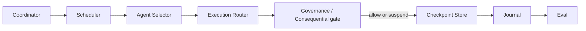
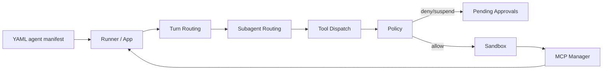
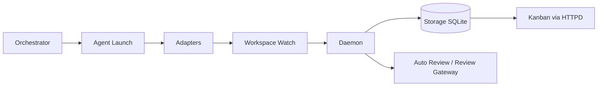
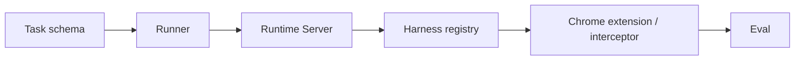

# Weekly Agentic AI GitHub Scan — 2026-09-05

Phạm vi: repo về agent/multi-agent/agentic có hoạt động đáng kể trong khoảng 2026-08-29 → 2026-09-05, tìm qua WebSearch và xác minh trực tiếp qua WebFetch (README, cây thư mục, commit log) trên GitHub công khai — không dùng GitHub API/MCP để search ngoài phạm vi repo `undertheseanlp/underthesea`.

## Tóm tắt điều hành

- Tuần này nổi bật lên một nhóm 3 "coding-agent orchestrator" (OMA, Omnigent, Untrivial-ai Agent Orchestrator) đều đang phát triển rất tích cực (commit hàng ngày, 6.9k–10.9k sao) nhưng cách tiếp cận kiến trúc khác hẳn nhau: OMA đặt cược vào runtime task-DAG planning + approval gate có thể replay; Omnigent đặt cược vào "meta-harness" bọc sandbox quanh các CLI agent có sẵn; Untrivial-ai đặt cược vào việc suy ra trạng thái Kanban thuần từ dữ kiện Git/CI/PR.
- Về phía eval, ClawBench (TIGER-AI-Lab) là repo đáng chú ý nhất có phương pháp luận nghiêm túc: harness-agnostic benchmark cho browser agent, chặn request thật bằng interceptor, chấm 2 tầng (deterministic match + LLM judge), và có cơ chế tự-tái lập kết quả leaderboard (`clawbench-rescore`) — mức độ chặt chẽ hiếm gặp ở benchmark agent.
- Rủi ro chung cần lưu ý: cả 3 orchestrator đều có phần lõi "mở" đi kèm sản phẩm thương mại (cloud/pricing/private directories ở Untrivial-ai, subscription credentials ở Omnigent), nên ranh giới giữa "nghiên cứu kiến trúc" và "go-to-market" khá mờ; nhiều chi tiết về context-window management và memory dài hạn không thể xác minh chỉ từ các trang đã fetch.

## Mục lục

1. [OMA (open-multi-agent/open-multi-agent)](#1-oma-open-multi-agentopen-multi-agent)
2. [Omnigent (omnigent-ai/omnigent)](#2-omnigent-omnigent-aiomnigent)
3. [Agent Orchestrator / AO (Untrivial-ai/agent-orchestrator)](#3-agent-orchestrator--ao-untrivial-aiagent-orchestrator)
4. [ClawBench (TIGER-AI-Lab/ClawBench)](#4-clawbench-tiger-ai-labclawbench)

---

## 1. OMA (open-multi-agent/open-multi-agent)

Repo: https://github.com/open-multi-agent/open-multi-agent

### §1 — Quick Context

Framework TypeScript cho multi-agent: mô tả mục tiêu, coordinator tự lập task DAG lúc runtime thay vì hand-wired graph, có approval gate và replay cho production. Stack: TypeScript/Node 20+, monorepo npm (`packages/core`, `create-oma-app`, `otel`, `release-bot`), 13 provider tích hợp sẵn (Claude, OpenAI, Gemini, DeepSeek, local models). Sức khỏe repo: ~6.9k sao, 100+ contributor, 552 commit, MIT license, CI GitHub Actions + codecov đều xanh, commit gần nhất 2026-09-05 (đang release core v1.18.0).

### §2 — Architecture Deep-Dive

**A. Component inventory** (tất cả trong `packages/core/src/`):
- `Coordinator` (`orchestrator/coordinator.ts`) — biến một goal thành task DAG lúc runtime.
- `Scheduler` (`orchestrator/scheduler.ts`) — thực thi DAG một cách deterministic trên "team" agent.
- `Orchestrator` (`orchestrator/orchestrator.ts`) — lớp glue nối coordinator, scheduler, recovery.
- `Agent Selector` (`orchestrator/agent-selector.ts`) — chọn agent phù hợp cho từng task.
- `Execution Router` (`orchestrator/execution-router.ts`) — định tuyến thực thi (local/process/ACP).
- `Governance`/`Consequential` (`orchestrator/governance.ts`, `orchestrator/consequential.ts`) — tool-gate default-deny, phân loại lệnh gọi "hệ trọng".
- `Budget` (`orchestrator/budget.ts`) — kiểm soát ngân sách token/chi phí.
- `Recovery`/`Retry`/`Short-circuit` (`orchestrator/recovery.ts`, `retry.ts`, `short-circuit.ts`) — xử lý lỗi.
- `Checkpoint Store` (`memory/checkpoint.ts`, `memory/file-store.ts`) — lưu trạng thái run xuống file (`.oma/run.json`).
- `Redacting Store` (`memory/redacting-store.ts`) — lọc dữ liệu nhạy cảm trước khi lưu.
- `Journal` (`journal/`) — batch hóa sự kiện run.
- `Eval` (`eval/`) — dựng `judgePrompt`, EvalSets có thể replay.
- `Observability` (`observability/`) + gói `packages/otel` — export OpenTelemetry.
- MCP client (`mcp.ts`) — kết nối MCP server ngoài làm nguồn tool.

**B. Control flow**: **planner-executor kết hợp hierarchical supervisor-workers**, có thêm cổng approval dạng state machine (suspend/resume). Happy path:
1. Người dùng gọi runtime với một goal + danh sách agent + tool preset.
2. `Coordinator` phân rã goal thành task DAG (mỗi task có `status`, `assignee`, `dependsOn`).
3. `Scheduler` duyệt DAG theo thứ tự phụ thuộc, `Agent Selector`/`Execution Router` chọn agent và cách thực thi cho từng task.
4. Mỗi lệnh gọi tool đi qua `Governance`/`Consequential`: lệnh không hệ trọng auto-allow, lệnh hệ trọng khiến run chuyển sang trạng thái `suspended` chờ người duyệt qua callback `onToolCall`.
5. Kết quả và checkpoint được ghi vào `Checkpoint Store` + `Journal` sau mỗi bước để có thể replay qua Run Viewer.
6. Khi hoàn tất, toàn bộ run (task, `agentResults` theo role, token usage, approval) trả về dưới dạng dữ liệu có thể đưa vào `Eval` để tạo EvalSet/CI gate.

**C. State & data flow**: message giữa các thành phần là object TypeScript có kiểu (task object, `agentResults` là Map theo role) — không phải chuỗi tự do. Lưu trạng thái: file-based (`FileStore` ghi `.oma/run.json`), không dùng DB. Context-window management: không xác định rõ từ code đã fetch — chỉ thấy có kiểu `ContextStrategy` truyền vào `defineTool`, gợi ý có cơ chế tùy biến theo token nhưng chưa xác nhận chi tiết thuật toán.

**D. Tool/capability integration**: tool khai báo qua `toolPreset` (vd `'readwrite'`) hoặc tự viết bằng `defineTool`; hỗ trợ MCP native qua `mcp.ts`. Cơ chế bảo vệ là **default-deny ở tầng approval** (mọi tool call phải qua gate, hệ trọng thì suspend) chứ không phải sandbox OS.

**E. Memory**: ngắn hạn = trạng thái task/agent trong run; dài hạn = checkpoint file; `redacting-store` gợi ý có lọc PII/secret trước khi persist. Không thấy retrieval vector/keyword — không xác định từ code.

**F. Model orchestration**: `defaultModel` cấu hình toàn cục, override qua env `OMA_MODEL`; ví dụ tài liệu cho thấy coordinator có thể dùng model khác agent thực thi (vd ghép với DeepSeek). Không thấy bằng chứng rõ ràng về fallback chain tự động.

**G. Observability & eval**: có gói OpenTelemetry riêng (`packages/otel`), module `eval/` với `judgePrompt` cấu trúc theo từng judge — đây là eval hook thực sự, không chỉ log thô.

**H. Extension points**: `create-oma-app` để scaffold dự án mới; agent/coordinator tùy biến qua config; tool tùy biến qua `defineTool`; agent ngoài (Claude Code, CLI khác) cắm vào qua `process.ts`/`acp.ts` (Agent Client Protocol).

### §3 — Architecture Diagram

### §4 — Verdict

Điểm đáng học: default-deny tool gate có thể **suspend/resume và replay từ file checkpoint** là một pattern an toàn sản xuất thực chất (không phải guardrail marketing), kết hợp với `Eval`/`judgePrompt` cấu trúc cho phép CI gate thật sự trên hành vi agent. Red flag: checkpoint dựa hoàn toàn vào file cục bộ (`.oma/run.json`) — chưa rõ câu chuyện scale multi-node; chiến lược quản lý context window không được tài liệu hóa rõ trong các phần đã đọc. Câu hỏi mở: `classifiers.ts` phân loại "consequential" dựa trên heuristic hay LLM — cần đọc trực tiếp file này để đánh giá độ tin cậy của cổng approval.

---

## 2. Omnigent (omnigent-ai/omnigent)

Repo: https://github.com/omnigent-ai/omnigent

### §1 — Quick Context

"Meta-harness" mã nguồn mở: một lớp điều phối chung để chạy Claude Code, Codex, Cursor, Pi và agent tự viết mà không cần viết lại logic agent. Stack: Python 3.12+ (uv/pip), phần web/editor dùng Node 22; sandbox đa backend (bwrap, seatbelt, Modal, Daytona, E2B, Kubernetes, Databricks). Sức khỏe: 9.7k sao, 1.5k fork, 3.354 commit, Apache 2.0, có `tests/harness_bench` làm test bench, phát hành PyPI, commit gần nhất 2026-09-05.

### §2 — Architecture Deep-Dive

**A. Component inventory** (thư mục `omnigent/`):
- `Runner/App` (`runner/app.py`) — điều phối một session/turn.
- `Turn Routing` (`runner/turn_routing.py`) — quyết định lượt của agent nào tiếp theo.
- `Subagent Routing` (`runner/subagent_routing.py`) — cho phép agent giám sát (vd "Polly") giao việc cho sub-agent.
- `Tool Dispatch` (`runner/tool_dispatch.py`) — điều phối lệnh gọi tool/function tới handler đúng.
- `MCP Manager` / `Proxy MCP Manager` (`runner/mcp_manager.py`, `runner/proxy_mcp_manager.py`) — kết nối MCP server local/remote làm nguồn tool.
- `Policy` (`runner/policy.py`, `policies/base.py`, `policies/registry.py`, `policies/schema.py`) — tầng governance quyết định agent được chạy shell, sửa file, tiêu token đến đâu, ở 3 cấp (server/agent/session).
- `Pending Approvals` (`runner/pending_approvals.py`) — hàng đợi approval người-trong-vòng-lặp.
- `Sandbox` (`sandbox/`) — backend cô lập OS/cloud (bwrap trên Linux, seatbelt trên macOS, Modal/Daytona/E2B/K8s/Databricks trên cloud).
- `Session Init Protocol` (`runner/session_init_protocol.py`) — khởi tạo session đồng bộ qua terminal/web/mobile.
- `Native harness adapters` (`runner/native/`, các file `*_native*.py` cho Claude/Cursor/Codex/Goose/Antigravity) — adapter riêng cho từng harness.
- `ACP CLI harnesses` (`acp_cli_harnesses.py`) — cầu nối Agent Client Protocol cho agent ngoài (Grok Build, Devin) qua stdio.
- `Telemetry` (`telemetry/`) — theo dõi usage.

**B. Control flow**: **hierarchical supervisor-workers kết hợp handoff/swarm**, chạy trên nền event-driven turn router. Happy path:
1. Người dùng định nghĩa agent trong file YAML (prompt, tool, sub-agent, policy).
2. `Session Init Protocol` khởi session; `Runner/App` bật harness được chọn (Claude Code/Codex/Cursor/Pi/custom) bên trong sandbox tương ứng OS.
3. `Turn Routing` quyết định lượt; `Subagent Routing` cho phép agent giám sát giao task cho sub-agent chạy song song trong các git worktree riêng.
4. Mỗi lệnh gọi tool qua `Tool Dispatch`, đối chiếu `Policy` (3 cấp); hành động hệ trọng vào `Pending Approvals` chờ người duyệt.
5. `MCP Manager`/`Proxy MCP Manager` phân giải tool đăng ký qua MCP (local command hoặc remote URL) khi agent gọi tới.
6. Kết quả sub-agent (vd diff code) được route tới agent review; trạng thái session đồng bộ đa thiết bị; `Telemetry` ghi nhận usage.

**C. State & data flow**: cấu hình agent/tool là YAML có schema (không phải free text); session đồng bộ đa thiết bị (terminal/web/mobile) nhưng cơ chế lưu trữ cụ thể không xác định rõ từ nội dung đã fetch — có thư mục `db/` và `stores/` trong repo cho thấy có lớp persistence riêng nhưng chưa xác nhận công nghệ cụ thể. Context-window management: không xác định từ code đã xem.

**D. Tool/capability integration**: 3 nguồn tool khai báo trong YAML — hàm Python local (schema tự sinh từ signature = native function-calling), MCP server (local/remote), hoặc sub-agent lồng nhau. Sandbox là lớp validation bắt buộc: Linux **bắt buộc** bwrap (thiếu binary thì terminal không khởi động được — fail-closed), macOS dùng seatbelt, Windows chỉ có Job Object (không cô lập filesystem/network — điểm yếu rõ ràng), cloud dùng sandbox dùng-một-lần (Modal/Daytona/E2B/K8s/Databricks).

**E. Memory**: không có bằng chứng rõ về kiến trúc memory ngắn/dài hạn tách biệt trong tài liệu đã đọc — session giữ "messages, sub-agents, terminals, files" nhưng không thấy cơ chế tóm tắt/vector retrieval cụ thể.

**F. Model orchestration**: mỗi harness có model mặc định riêng, "cùng tồn tại" (Claude default cho Claude Code, khác cho Codex); 4 loại credential (API key, subscription như Claude Pro/Max hay ChatGPT, gateway tương thích OpenAI/Anthropic, Databricks workspace) — đây là abstraction provider, không phải fallback tự động khi lỗi.

**G. Observability & eval**: `telemetry/` + `tests/harness_bench` — bench này là cơ chế eval/replay thật để kiểm tra năng lực agent qua các harness khác nhau, không chỉ log.

**H. Extension points**: agent mới = file YAML mới; "agent có thể tự viết agent" (một Omnigent chat có thể sinh file YAML agent hộ bạn); policy tùy biến qua `policies/registry.py`; tool tùy biến qua hàm Python hoặc MCP server.

### §3 — Architecture Diagram

### §4 — Verdict

Điểm đáng học: coi sandbox là **bắt buộc và fail-closed** trên Linux (thiếu bwrap thì không chạy) thay vì opt-in như phần lớn framework agent khác; ý tưởng "meta-harness" (bọc quanh các CLI agent có sẵn thay vì viết lại agent loop) là một canh bạc kiến trúc khác biệt rõ so với 2 repo orchestrator còn lại trong danh sách này. Red flag: sandbox trên Windows yếu hơn hẳn (không cô lập filesystem/network) — lỗ hổng bảo mật thật với người dùng đa nền tảng; kiến trúc memory dài hạn không được tài liệu hóa công khai. Câu hỏi mở: khi policy server-wide, per-agent, per-session mâu thuẫn nhau thì `policies/registry.py` giải quyết theo thứ tự ưu tiên nào — cần đọc trực tiếp mã nguồn.

---

## 3. Agent Orchestrator / AO (Untrivial-ai/agent-orchestrator)

Repo: https://github.com/Untrivial-ai/agent-orchestrator

### §1 — Quick Context

"Agent IDE" quản lý cả đàn coding agent qua Kanban sống: một orchestrator bền vững tự lập kế hoạch, tách task, sinh worker, và bám theo CI/PR/review tới khi merge. Stack: backend Go (monorepo `go.work`, sqlc sinh SQL), frontend React/JS, đóng gói Electron (DMG/EXE/AppImage/DEB/RPM), build bằng Nix. Sức khỏe: 10.9k sao, 1.5k fork, 2.574 commit, Apache 2.0, hỗ trợ 26 coding agent (Claude Code, Cursor, Aider, GitHub Copilot...), commit gần nhất 2026-09-04; có tab Actions/Security nhưng không thấy badge test rõ ràng trên README.

### §2 — Architecture Deep-Dive

**A. Component inventory** (thư mục `backend/internal/`):
- `Daemon` (`daemon/`) — dịch vụ nền theo dõi hoạt động agent và trạng thái source-control.
- `Session Manager` (`session_manager/`) / `Session Guard` (`sessionguard/`) — quản lý và bảo vệ vòng đời session của worker.
- `Agent Launch` (`agentlaunch/`) — khởi chạy tiến trình coding agent cho một worker.
- `Lifecycle` (`lifecycle/`) — state machine vòng đời worker.
- `Adapters` (`adapters/`) — tích hợp riêng cho 26 coding agent (Claude Code, Cursor, Aider, Copilot...).
- `Workspace Watch` (`workspacewatch/`) — theo dõi trạng thái git worktree/branch của từng worker.
- `Auto Review` (`autoreview/`) / `Review Gateway` (`reviewgateway/`) — tự động hóa review, đẩy phản hồi CI/reviewer về worker.
- `Storage` (`storage/sqlite/`) — lưu trữ qua SQL sinh bởi sqlc.
- `Terminal`/`Tmuxbin` (`terminal/`, `tmuxbin/`) — quản lý terminal đa phiên cho từng worker.
- `HTTPD` (`httpd/`) — API server phục vụ Kanban ở frontend.

**B. Control flow**: **hierarchical supervisor-workers**, nhưng điểm khác biệt là trạng thái được **suy ra (derived)** từ dữ kiện git/CI/PR thay vì set thủ công — gần với event-driven state machine chồng lên supervisor-workers. Happy path:
1. Người dùng trò chuyện với Orchestrator (agent lập kế hoạch bền vững ở cấp project), agent này kết hợp lịch sử hội thoại với ngữ cảnh repo và trạng thái AO hiện tại (worker đang chạy, PR, CI, review).
2. Khi kế hoạch đủ cụ thể, Orchestrator tách thành task và gọi `Agent Launch` để sinh/điều hướng Worker.
3. Mỗi Worker nhận một workspace cô lập (branch + git worktree, theo dõi bởi `Workspace Watch`) và chạy một trong 26 coding agent qua `Adapters`, bên trong `Terminal`/`Tmuxbin` riêng.
4. `Daemon` liên tục quan sát hoạt động agent, trạng thái git, PR, kết quả CI, ghi vào `Storage` (SQLite).
5. Kanban (phục vụ qua `HTTPD`) suy ra cột của mỗi thẻ (Working / Needs you / In review / Ready to merge) hoàn toàn từ dữ kiện session+PR+CI+review — không phải cờ trạng thái thủ công.
6. `Auto Review`/`Review Gateway` đẩy lỗi CI hay comment reviewer về đúng Worker sở hữu, khép vòng phản hồi mà không cần người can thiệp cho tới khi cần quyết định.

**C. State & data flow**: trạng thái worker/task được suy ra từ dữ kiện git+CI+PR (event-driven), không phải schema message giữa các agent theo nghĩa cổ điển; lưu trữ = SQLite (query có kiểu qua sqlc). Context-window management: không xác định từ nội dung đã fetch.

**D. Tool/capability integration**: khác 2 repo trên, AO không có tool registry dùng chung — tích hợp ở mức **tiến trình agent**: mỗi trong 26 `Adapters` bọc một CLI coding agent với cơ chế gọi tool riêng của chính nó. Cô lập chỉ dừng ở mức git worktree (theo nội dung đã fetch), không thấy bằng chứng sandbox OS như bwrap/seatbelt — đây là điểm yếu hơn so với Omnigent.

**E. Memory**: không có kiến trúc memory riêng được ghi nhận — trạng thái hệ thống suy ra từ git/CI/PR, không phải bộ nhớ hội thoại tích lũy.

**F. Model orchestration**: người dùng "chọn agent và model" theo từng task; không thấy bằng chứng về cơ chế fallback/routing model tự động trong nội dung đã fetch.

**G. Observability & eval**: bản thân Kanban chính là bề mặt quan sát (derived view sống trên worker/PR/CI); `Daemon` liên tục theo dõi thay đổi. Không thấy tích hợp OpenTelemetry/Langfuse trong nội dung đã fetch.

**H. Extension points**: thư mục skill (`.agents/skills/<tên>/SKILL.md`, ví dụ `bug-triage`) cho phép thêm skill tùy biến cho orchestrator/worker; agent mới cắm qua `Adapters` (đã có 26, kèm hướng dẫn setup riêng từng agent).

### §3 — Architecture Diagram

### §4 — Verdict

Điểm đáng học: suy ra trạng thái Kanban **thuần từ dữ kiện git/CI/PR** thay vì để agent tự báo cáo trạng thái là một lựa chọn thiết kế "tin dữ kiện hơn tin lời agent nói" đáng giá — tránh lệch pha giữa việc agent tuyên bố đã xong và thực tế repo. Red flag: đây thực chất là sản phẩm thương mại mở lõi (repo có `pricing/`, `cloud/`, `private/`) nên khung "repo nghiên cứu kiến trúc agentic" hơi gượng ép; cô lập chỉ ở mức git worktree, yếu hơn sandbox OS của Omnigent khi agent chạy lệnh shell tùy ý. Câu hỏi mở: nội dung `private/` và `cloud/` chứa gì, và bao nhiêu phần logic lập kế hoạch của Orchestrator thực sự mở so với bị khóa sau gói cloud/pricing.

---

## 4. ClawBench (TIGER-AI-Lab/ClawBench)

Repo: https://github.com/TIGER-AI-Lab/ClawBench

### §1 — Quick Context

Benchmark mã nguồn mở đánh giá browser agent trên tác vụ đời thường thật (đặt vé, đặt đồ ăn, xin việc...) trên website sống, chặn request nguy hiểm để đo chính xác mà không gây hậu quả thật. Stack: Python 3.11+, Docker/Podman, Chromium qua CDP, Playwright MCP, ffmpeg/noVNC, judge model DeepSeek-v4-Pro (LiteLLM-routed), quản lý gói bằng uv. Sức khỏe: 649 sao, Apache 2.0 (+ MIT cho phần Claw-Eval kế thừa), có paper arXiv:2604.08523 (EMNLP 2026 Findings), CI GitHub Actions, PR #341 merge ngày 2026-09-05.

### §2 — Architecture Deep-Dive

**A. Component inventory** (thư mục `src/clawbench/`):
- `Runner` (`runner/`) — điều khiển việc chạy một task từ đầu đến cuối.
- `Harness registry` (`runtime/harnesses/harnesses.yaml`) — khai báo các agent-harness cắm được (OpenClaw, Hermes, Claude Code, browser-use, Pi, baseline `random-click`/`null`).
- `Runtime Server` (`runtime/runtime-server/`) — server FastAPI ghi nhận tương tác trong phiên chạy.
- `Chrome extension / interceptor` (`runtime/chrome-extension/`) — chặn request HTTP hệ trọng (checkout, submit) qua Chrome Fetch API domain.
- `Harbor` (`runtime/harbor/`) — framework quản lý container/registry cho môi trường chạy task.
- `Eval` (`eval/`) — bộ chấm điểm 2 tầng (khớp deterministic + LLM judge).
- `TUI` (`tui.py`) — entrypoint giao diện terminal (lệnh `clawbench`).
- Task schema (`test-cases/task.schema.json`) — định nghĩa task có kiểu (instruction, time_limit, eval_schema).

**B. Control flow**: đây là **pipeline/state-machine đánh giá** (không phải kiến trúc agent tự thân — ClawBench đánh giá agent, không phải là agent). Happy path:
1. `clawbench-run`/`clawbench-batch` chọn task từ `test-cases/v1` hoặc `v2`, hợp lệ theo `task.schema.json`.
2. Một container Docker/Podman dựng Chromium cô lập (CDP cổng 9222) + Xvfb + `Runtime Server` FastAPI, kèm hồ sơ người dùng giả lập.
3. Harness được chọn từ `harnesses.yaml` (vd OpenClaw qua Playwright MCP, Hermes qua CDP native) điều khiển trình duyệt thực hiện task, sinh đồng thời 5 lớp ghi log (video, screenshot, DOM action, HTTP traffic, agent message).
4. `Chrome extension/interceptor` theo dõi request ra ngoài; gặp request hệ trọng (checkout/submit/send) thì chặn lại, lưu snapshot vào `interception.json`, kết thúc phiên — đảm bảo không có tác động thật nào xảy ra.
5. `Eval` chấm 2 tầng: tầng 1 so khớp deterministic request bị chặn với `eval_schema` (regex URL/method/body) của task; nếu chưa đủ, tầng 2 đưa cả 5 lớp log cho LLM judge (deepseek-v4-pro mặc định) chấm theo rubric lenient/strict so với run tham chiếu của người.
6. Kết quả nạp vào `clawbench-analyze` và leaderboard công khai; `clawbench-rescore`/`clawbench-reproduce` cho phép bất kỳ ai chấm lại trace đã công bố để xác minh trong sai số ±2 điểm phần trăm.

**C. State & data flow**: task định nghĩa là JSON có schema; artifact mỗi run là file phẳng (mp4/png/jsonl/json), không dùng DB. Không áp dụng khái niệm "context window management" theo nghĩa agent-memory vì ClawBench là harness đánh giá, không phải bản thân một agent.

**D. Tool/capability integration**: trục này ở ClawBench thể hiện qua việc **harness-agnostic theo thiết kế** — cùng một phiên Chromium instrumented được điều khiển bởi nhiều cơ chế gọi tool khác nhau tùy harness: function-calling native (browser-use qua LiteLLM), MCP (Playwright MCP cho OpenClaw/Claude Code), hoặc CDP tool native (Hermes, Pi) — cho phép so sánh táo với táo giữa các agent khác kiến trúc, đây là điểm phương pháp luận thực sự mới chứ không chỉ là danh sách benchmark.

**E. Memory**: bỏ qua — không áp dụng (ClawBench là benchmark, không phải kiến trúc agent).

**F. Model orchestration**: model judge cấu hình qua `models/models.yaml` (LiteLLM-routed, mặc định deepseek-v4-pro, có thể đổi sang Gemini); model agent-được-đánh-giá cấu hình theo từng harness. Không thấy fallback chain ngoài việc đổi config thủ công.

**G. Observability & eval**: đây chính là trọng tâm của repo — tính tái lập được thiết kế ngay trong CLI (`clawbench-rescore` chấm lại trace cũ mà không cần chạy lại agent tốn kém, `clawbench-reproduce` xác minh khớp leaderboard trong ±2pp) — mức độ chặt chẽ hiếm gặp ở benchmark agent.

**H. Extension points**: thêm task bằng cách đóng góp JSON vào `test-cases/v1|v2` theo `task.schema.json` (có `CONTRIBUTING.md`); thêm harness bằng cách đăng ký trong `harnesses.yaml`; thêm judge model qua `models/models.yaml` (api_key/base_url/api_type).

### §3 — Architecture Diagram

### §4 — Verdict

Điểm đáng học: thiết kế harness-agnostic trên **cùng một phiên Chromium instrumented** giúp so sánh công bằng giữa các agent dùng cơ chế gọi tool hoàn toàn khác nhau (MCP, native function-calling, CDP tool) — hiếm framework eval nào làm được điều này một cách sạch sẽ; cơ chế `clawbench-rescore`/`reproduce` biến "tái lập kết quả" thành một lệnh CLI thay vì lời hứa suông trong paper. Red flag: điểm cao nhất hiện tại chỉ ~33%, cho thấy bản thân benchmark còn rất khó và có thể chưa ổn định qua các phiên bản judge model; thư mục `prorl/` xuất hiện trong cây mã nguồn nhưng chức năng không xác định từ nội dung đã fetch — cần đọc trực tiếp. Câu hỏi mở: độ lệch giữa rubric "lenient" và "strict" của LLM judge lớn tới đâu trên cùng một tập trace, ảnh hưởng gì tới thứ hạng leaderboard.
