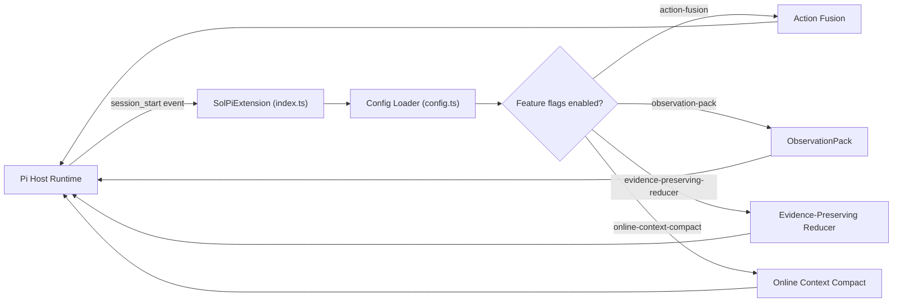
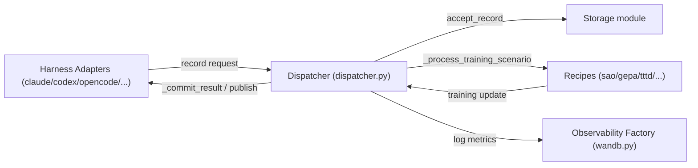
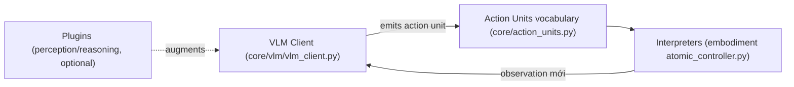
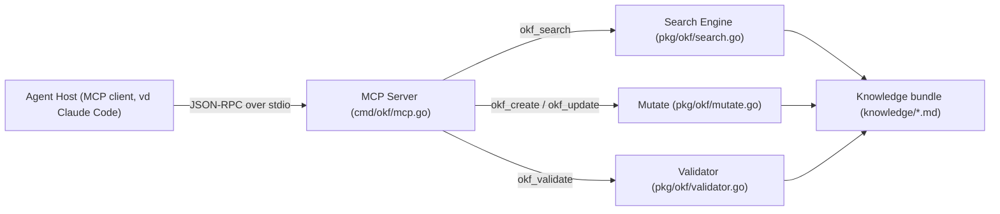

# Weekly Agentic AI Scan — 2026-09-12

**Phạm vi:** repo public/hoạt động mạnh trong khoảng 2026-09-05 → 2026-09-12.
**Nguồn dữ liệu:** không có `gh` CLI / GitHub token trong môi trường này, nên toàn bộ dữ liệu lấy qua `WebFetch` trên các endpoint public không cần auth: `api.github.com/search/repositories` (query `created:>2026-09-05` và `pushed:>2026-09-05`, các biến thể `agent`/`multi-agent`/`agentic`), `raw.githubusercontent.com/{owner}/{repo}/{branch}/README.md`, và trang HTML `github.com/{owner}/{repo}/tree/...` để lấy directory listing (endpoint `git/trees` của REST API trả 403 liên tục trong phiên này — có thể do rate-limit ẩn danh 60 req/giờ — nên phải dùng trang HTML làm fallback). Mọi số liệu (sao, fork, path file) dưới đây đều lấy trực tiếp từ các lần fetch thành công, không suy đoán.

## Executive summary

- Các repo đáng chú ý nhất tuần này không thêm "một lớp prompt engineering mới" mà tấn công thẳng vào **hạ tầng bên dưới agent loop**: context compaction (SoL-Pi), memory-as-a-service qua MCP (okf-agent-memory), và điều phối đa-harness cho continual learning (Reef).
- Hai trong bốn repo (**NVlabs/SoL-Pi**, **okf-memory/okf-agent-memory**) có benchmark định lượng cụ thể (token reduction, TTFT, ablation pass-rate) thay vì chỉ tuyên bố — mức độ engineering-maturity cao hơn phần lớn "agent framework" thường thấy.
- **showlab/Show-Harness** (robot) và **Human-Agent-Society/reef** (continual learning đa-harness) đại diện hai hướng mở rộng ít được nói tới của "agentic AI": embodied action-vocabulary và meta-layer tự-cải-thiện đứng trên nhiều CLI agent có sẵn (Claude Code, Codex, OpenCode, Hermes, Pi, Terminus).

## Mục lục

1. [NVlabs/SoL-Pi](#1-nvlabs-sol-pi)
2. [Human-Agent-Society/reef](#2-human-agent-society-reef)
3. [showlab/Show-Harness](#3-showlab-show-harness)
4. [okf-memory/okf-agent-memory](#4-okf-memory-okf-agent-memory)
5. [Candidate khác đã xem xét (không đào sâu tuần này)](#5-candidate-khác-đã-xem-xét)

---

## 1. NVlabs SoL-Pi

**Repo:** `NVlabs/SoL-Pi` — https://github.com/NVlabs/SoL-Pi

### §1 — Quick context

Extension tối ưu chi phí/context cho agent harness **Pi**, đóng gói 4 cơ chế hiệu năng được tuyên bố là "discovered through scaled auto-research loops". Tech stack: TypeScript, Node.js ≥22.19, npm, cắm vào host qua package `@earendil-works/pi-coding-agent` (yêu cầu Pi 0.84.2). Repo health: **1.2k sao, 87 fork, 5 watcher, license MIT**, có `.github/workflows/`, `tests/`, `AGENTS.md`/`CLAUDE.md`/`CONTRIBUTING.md`/`SECURITY.md` — mức độ chỉn chu của 1 dự án do NVIDIA maintain, tạo ngày 2026-09-02 (rất mới).

### §2 — Architecture deep-dive

**A. Component inventory**
- `Pi Host Runtime` — external, agent loop chính mà SoL-Pi cắm vào; evidence: import `ExtensionAPI/ExtensionContext/ExtensionFactory` từ `@earendil-works/pi-coding-agent` trong `src/sol-pi/index.ts`.
- `SolPiExtension factory` (`src/sol-pi/index.ts`) — hook vào event `"session_start"`, load config rồi đăng ký các feature module.
- `Config Loader` (`src/sol-pi/config.ts`) — đọc `sol-pi.json` project-level (ưu tiên hơn user-level); mọi mechanism mặc định **disabled** (opt-in).
- `Action Fusion` (`src/sol-pi/extensions/action-fusion/{index.ts,file-queue.ts,then-run.ts}`) — gộp lệnh edit/write cùng lệnh validation follow-up vào 1 tool call.
- `ObservationPack` (`src/sol-pi/extensions/observation-pack/`) — biến kết quả text lặp lại lớn thành "stable handle" kèm paged recall chính xác.
- `Evidence-Preserving Reducer` (`src/sol-pi/extensions/evidence-preserving-reducer/`) — nén log dài thành "receipt" ngắn, chỉ giữ quotation khớp đúng nguồn lưu trữ.
- `Online Context Compact` (`src/sol-pi/extensions/online-context-compact/`) — biến plan-step đã hoàn thành thành điểm ứng viên cho cơ chế compaction gốc của Pi.

**B. Control flow — Event-driven** (không có ReAct loop riêng, "ăn theo" agent loop có sẵn của host). Happy path:
1. Pi khởi động session → emit event `session_start`.
2. `createSolPiExtension` (index.ts) bắt event, gọi Config Loader đọc `sol-pi.json`.
3. `registerConfiguredFeatures` kiểm tra từng flag, chỉ đăng ký module đang bật.
4. Mỗi module đăng ký hook riêng vào tool-call pipeline của Pi.
5. Khi runtime phát sinh sự kiện tương ứng (tool call lớn, log dài, plan step xong, compaction event), extension tương ứng biến đổi payload trước khi chạm model.
6. Evidence-Preserving Reducer (nếu bật) có thể gọi model/provider riêng để rút gọn, nhưng validate quotation với session archive trước khi trả về.

**C. State & data flow:** kiểu message giữa host–extension không xác định chi tiết từ evidence (chỉ thấy type `ExtensionAPI/ExtensionContext`, không thấy schema cụ thể). State lưu **local theo session archive, không tự xoá**. Context window management: kết hợp "stable handle + paged recall" (ObservationPack) với việc **outsource** cho compaction gốc của host thay vì tự viết summarizer riêng (Online Context Compact).

**D. Tool/capability integration:** không tạo agent loop hay tool-calling riêng — cắm thẳng vào pipeline có sẵn của Pi qua `ExtensionFactory`. Không có bằng chứng về MCP hay JSON-parsing riêng trong 4 extension.

**E. Memory:** không xác định từ code — "session archive" chỉ phục vụ evidence-preservation, không phải retrieval memory dài hạn → skip.

**F. Model orchestration:** Evidence-Preserving Reducer "may send content to configured remote models when enabled" — tức có thể dùng 1 model tách biệt (khác model chính) chỉ để nén log. Không có bằng chứng fallback/parallelism khác.

**G. Observability & eval:** điểm đặc biệt nhất của repo — README khẳng định 4 mechanism được "discovered through scaled auto-research loops", tức có một quy trình tự động chạy thử agent ở quy mô lớn để tìm cơ chế tiết kiệm hiệu quả nhất. Tuy nhiên **pipeline research đó không nằm public trong repo này** — chỉ thấy kết quả (4 module), không thấy code sinh ra chúng.

**H. Extension points:** bản thân SoL-Pi là một mẫu extension cho Pi — dev khác viết thêm extension theo cùng `ExtensionFactory` pattern, hook vào cùng event `session_start`.

### §3 — Architecture diagram

### §4 — Verdict

**Novel:** thay vì tối ưu agent bằng prompt engineering, SoL-Pi tấn công tầng hạ tầng của agent loop (tool-call batching, evidence-preserving summarization, outsourced compaction) — và gắn liền với tuyên bố các cơ chế này đến từ một "auto-research loop" quy mô lớn, tức research-as-a-pipeline thay vì thiết kế thủ công. **Red flag:** giá trị phụ thuộc hoàn toàn vào hệ sinh thái Pi (cùng công ty earendil-works), không tổng quát hoá ngay được cho framework khác; chính "auto-research loop" — thứ làm nên tên gọi và tuyên bố chính của repo — không có bằng chứng code public. **Open question:** quy trình auto-research loop chạy trên benchmark nào, quy mô bao nhiêu, để chứng minh 4 mechanism là lựa chọn tối ưu (chưa thấy blog/paper riêng trong evidence đã fetch).

---

## 2. Human-Agent-Society reef

**Repo:** `Human-Agent-Society/reef` — https://github.com/Human-Agent-Society/reef

### §1 — Quick context

Hạ tầng continual learning cho agent tự cải thiện qua vòng lặp **Serve → Observe → Grow → Commit**, hỗ trợ cả train trọng số lẫn tiến hoá harness. Tech stack: Python (`pyproject.toml`/`uv.lock`), Docker, tích hợp Weights & Biases, adapter cho nhiều coding-agent harness (Claude Code, Codex, OpenCode, Hermes, Pi, Terminus). Repo health: **985 sao, 67 fork, 6 watcher, 49 issue mở, 5 PR mở, 244 commit trên main**; CI "ci" chạy thật (workflow run #1259/#1260 quan sát được, hơn 2.500 lần chạy tổng), có `AGENTS.md/CLAUDE.md/CONTRIBUTING.md`, `tutorials/`.

### §2 — Architecture deep-dive

**A. Component inventory**
- `Dispatcher` (`reef/dispatcher.py`) — coordinator toàn tiến trình: quản lý scenario lifecycle, `accept_record()`, điều phối training thread nền, publish model qua `_PublicationState`.
- `Harness Adapters` (`reef/harness/adapters/{claude,codex,dsh,hermes,native,opencode,pi,terminus}/descriptor.py`) — lớp thích ứng cho phép Reef "lái" nhiều coding-agent CLI khác nhau như backend phục vụ request.
- `Core data types` (`reef/core/records_types.py`, `reef/core/training_request.py`, `reef/core/artifact_ref.py`) — schema hoá record/training-request/artifact, không phải dict tuỳ tiện.
- `Recipes` (`reef/recipes/{basic,coral,gepa,meta_harness,openclawrl,sao,skillclaw,tttd}/`) — 8 "công thức" học tập hiện thực hoá cụ thể các learning pathway.
- `Observability Factory` (`reef/observability/{base.py,factory.py,wandb.py}`) — `build_experiment_tracker()` khởi tạo `WandbExperimentTracker` hoặc `NullExperimentTracker` khi tắt.
- `Storage` (`reef/storage/`) — tồn tại theo directory listing, chưa đọc chi tiết code bên trong.
- `CLI` (`reef/cli.py`, `reef/__main__.py`) — entrypoint dòng lệnh.

**B. Control flow — Event-driven pipeline theo 4 stage cố định** (tên gọi lấy trực tiếp từ README, không phải suy diễn):
1. **Serve:** `Dispatcher.accept_record()` nhận record suy luận từ 1 trong các Harness Adapter (claude/codex/opencode/...).
2. **Observe:** hệ thống match feedback với record đã ghi (module cụ thể phụ trách bước này **không xác định path rõ ràng** trong evidence đã fetch).
3. **Grow:** `_process_training_scenario()` / `_drain_training()` trong Dispatcher chạy 1 recipe (vd `sao`, `gepa`, `tttd`) trên thread nền để sinh update (trọng số hoặc artifact harness).
4. **Commit:** `_commit_result()` áp policy chọn lọc rồi publish qua `_PublicationState`.
5. `Observability Factory` ghi metrics quá trình training vào W&B (nếu bật).
6. Client mới (qua Harness Adapter) đọc version model/harness mới nhất, vòng lặp lặp lại.

**C. State & data flow:** message có **typed schema** rõ ràng (`records_types.py`, `training_request.py`, `artifact_ref.py`), không phải str/dict tự do. State lưu qua `reef/storage/` (tồn tại, chưa đọc chi tiết implementation). Context window management: không xác định từ code — trách nhiệm này thuộc về harness adapter/host, không phải Reef.

**D. Tool/capability integration:** Reef **không tự làm tool-calling** — nó uỷ quyền hoàn toàn cho harness đang chạy (Claude Code, Codex, OpenCode, Hermes, Pi, Terminus, "native") qua interface `descriptor.py` trong từng thư mục adapter.

**E. Memory:** skip — không có evidence về long-term memory runtime cho agent; chỉ có record/feedback log phục vụ training.

**F. Model orchestration:** 3 learning pathway độc lập nêu rõ trong README và hiện thực hoá qua `recipes/`: (1) model weight training (cần GPU, ví dụ recipe `sao`), (2) harness optimization (chỉ cần model endpoint, không cần GPU local — cải thiện skill/prompt/harness thay vì trọng số), (3) test-time training (cho scientific discovery, cần execution environment + objective đo được).

**G. Observability & eval:** tích hợp thẳng **Weights & Biases** qua factory pattern (`observability/factory.py`, fallback `NullExperimentTracker`) — bằng chứng production-grade rõ nhất trong repo này.

**H. Extension points:** thêm learning pathway mới = viết recipe mới trong `recipes/`; thêm harness backend mới = viết adapter mới trong `harness/adapters/` theo interface `descriptor.py`.

### §3 — Architecture diagram

### §4 — Verdict

**Novel:** tách rõ 3 learning pathway (weight / harness / test-time) trong CÙNG một Dispatcher, và hỗ trợ đa dạng harness backend (claude/codex/opencode/hermes/pi/terminus) như plug-in — tức đây là một "meta-layer" đứng trên nhiều coding-agent CLI phổ biến để agent tự học mà không cần từng host tự cài RL riêng. **Red flag:** bước "Observe" (match feedback với record) không có path code rõ ràng trong evidence đã đọc — chưa biết feedback đến từ đâu (human label? auto-eval? reward model?); 49 issue mở so với chỉ 5 PR mở gợi ý review throughput có thể chậm. **Open question:** "selection policy" ở bước Commit chọn/loại update dựa tiêu chí gì — chưa thấy rõ trong evidence.

---

## 3. showlab Show-Harness

**Repo:** `showlab/Show-Harness` — https://github.com/showlab/Show-Harness

### §1 — Quick context

Framework cho VLM điều khiển robot qua vocabulary "action unit" rời rạc, dùng chung được cho cả zero-shot frontier model lẫn policy fine-tune nhỏ. Tech stack: Python, `pyproject.toml`, fine-tune qua LLaMA-Factory, hỗ trợ Franka/AgileX Piper/ManiSkill/Isaac Lab; showlab = Show Lab (NUS), có paper đi kèm (arXiv:2609.10522, Chen et al. 2026). Repo health: **259 sao, 9 fork, 1 watcher** — rất mới (tạo 2026-09-07), có `tests/`, `.github/workflows/`, `CITATION.cff`.

### §2 — Architecture deep-dive

**A. Component inventory**
- `Action Units vocabulary` (`core/action_units.py`) — token rời rạc (`MV_FWD/BACK/LEFT/RIGHT/UP/DOWN`, `ROTATE_CW/CCW`, `STOP`, `GRASP`, `RELEASE`, `DONE`, `STILL`) làm "ngôn ngữ chung" giữa VLM và robot.
- `VLM Client & roles` (`core/vlm/vlm_client.py`, `core/vlm/roles.py`, `core/vlm/dual_roles.py`, `core/vlm/mvtoken_roles.py`, `core/vlm/dual_mvtoken_roles.py`) — giao tiếp với VLM, hỗ trợ nhiều biến thể prompting (single/multi-view token, single/dual-arm).
- `Agent stage control` (`core/agent/stage_control.py`) — điều khiển giai đoạn trong một episode/task.
- `Interpreters` (`interpreters/{franka,maniskill,piper,real,robolab}_atomic_controller.py`) — lớp grounding embodiment-specific: dịch action unit trừu tượng thành lệnh motor thật.
- `Plugins` (`plugins/{action_ablation,action_chunk,affordance,auto_release,coords,dagger,deepplan,ego,mcq,mem_text,proprioception,recovery,rotation,smooth,subgoal,variable_step,video_ref,view_select,wrist_frame}/`) — 19 augmentation độc lập cho perception/reasoning/action.
- `GUMI` (`gumi/`) — teleoperation qua browser để thu thập demonstration.
- `Training pipeline` (`train/`) — fine-tune LoRA qua LLaMA-Factory.
- `Launch entrypoint` (`core/launch.py`) — khởi chạy interaction loop.

**B. Control flow — embodied "ReAct-kiểu-action-unit"**: VLM quan sát → emit 1 action unit → interpreter ground thành motion → env trả observation mới. Happy path:
1. `core/launch.py` khởi tạo runner (zero-shot VLM hoặc fine-tuned policy) và embodiment qua `interpreters/`.
2. `core/vlm/vlm_client.py` gửi ảnh/multi-view + prompt role (`core/vlm/roles.py`) tới model, nhận về 1 action unit từ `action_units.py`.
3. `plugins/` liên quan (vd `affordance`, `subgoal`, `deepplan`) can thiệp input/output bước reasoning nếu bật, độc lập với nhau.
4. `interpreters/{embodiment}_atomic_controller.py` ánh xạ action unit sang lệnh motor cho robot/sim tương ứng.
5. `core/agent/stage_control.py` theo dõi tiến trình stage, quyết định khi phát `DONE`.
6. Lặp lại tới `DONE`/timeout; ở chế độ GUMI, con người thay VLM sinh action unit để thu thập data train.

**C. State & data flow:** message VLM↔interpreter là **1 token rời rạc cố định** (action unit) — không phải free-text hay JSON, dễ audit/log. State lưu trữ giữa các step: **không xác định từ evidence đã fetch** (chưa đọc `core/record/`). Context window: không áp dụng theo nghĩa LLM-agent văn bản thông thường — mỗi step là ảnh hiện tại + role prompt template, không thấy RAG/summarize dài hạn.

**D. Tool/capability integration:** "tool" ở đây là robot/embodiment, đăng ký qua `interpreters/` — thêm embodiment mới = viết 1 `*_atomic_controller.py` theo cùng interface. Không có function-calling API chuẩn hay MCP — giao tiếp qua vocabulary token cố định tự định nghĩa.

**E. Memory:** không đủ evidence — có plugin tên `mem_text` gợi ý liên quan bộ nhớ dạng text nhưng chưa đọc code bên trong, nên **không xác định cơ chế cụ thể**.

**F. Model orchestration:** 2 mode rõ ràng — (1) frontier VLM zero-shot qua `vlm_client.py`, (2) fine-tuned policy nhỏ (0.8B–9B, 5 LoRA adapter công bố trên Hugging Face) train qua `train/` + LLaMA-Factory, tốn "dưới vài H200 GPU-hour". Không có bằng chứng fallback/parallel multi-model.

**G. Observability & eval:** eval methodology đáng chú ý nhất — 19 plugin độc lập, "byte-identical khi tắt", cho phép ablation sạch để đo đóng góp riêng từng augmentation. Có `tests/`. Không thấy tracing kiểu OpenTelemetry/Langfuse.

**H. Extension points:** hai điểm mở rõ ràng — embodiment mới qua `interpreters/`, augmentation reasoning/perception mới qua `plugins/` (cùng interface, độc lập, tắt được).

### §3 — Architecture diagram

### §4 — Verdict

**Novel:** dùng 1 vocabulary action-unit rời rạc **chung cho mọi embodiment** thay vì mỗi robot một action space riêng, cho phép cùng một VLM (zero-shot hoặc fine-tune nhẹ) chạy trên Franka/Piper/ManiSkill/Isaac Lab mà không đổi kiến trúc — đây là điểm engineering đáng học nhất. Thiết kế plugin "byte-identical khi tắt" để ablation là một eval methodology sạch, hiếm gặp ở agent repo thông thường. **Red flag:** chưa xác định được cơ chế lưu state/memory giữa các step (`core/record/` chưa đọc); không có observability chuẩn ngoài `tests/`. **Open question:** `plugins/mem_text` và `plugins/deepplan` làm gì chính xác (tên gợi ý memory-in-text và deep planning nhưng chưa đọc code) — cần đào sâu ở lần sau.

---

## 4. okf-memory okf-agent-memory

**Repo:** `okf-memory/okf-agent-memory` — https://github.com/okf-memory/okf-agent-memory

### §1 — Quick context

Bộ nhớ dài hạn **git-native** cho coding agent, implement chuẩn mở **Open Knowledge Format (OKF) v0.2**, search BM25 in-memory <300µs, expose qua MCP server. Tech stack: Go (zero external dependency), CLI `cmd/okf`, benchmark riêng `cmd/okf-benchmark`. Repo health: **580 sao, 38 fork**, CI badge "CI" hiển thị trên README, có `CONTRIBUTORS.md`, `benchmarks/`, default branch `develop`.

### §2 — Architecture deep-dive

**A. Component inventory**
- `Agent Host (MCP client)` — external, ví dụ Claude Code/Cursor; evidence: README ghi rõ `./bin/okf mcp knowledge` "runs as an MCP server for Claude and Cursor".
- `MCP Server` (`cmd/okf/mcp.go`) — expose 6 tool (`okf_search`, `okf_show`, `okf_validate`, `okf_create`, `okf_update`, `okf_relate`) qua JSON-RPC 2.0 stdio.
- `Search Engine` (`pkg/okf/search.go`) — BM25/TF-IDF in-memory, `Search()` và `SearchForPath()`.
- `Validator` (`pkg/okf/validator.go`) — kiểm tra schema OKF v0.2, governance, drift, chặn path-traversal (CWE-22).
- `Mutate` (`pkg/okf/mutate.go`, có test riêng `mutate_security_test.go`) — ghi/sửa concept.
- `Bundle/Bootstrap` (`pkg/okf/bundle.go`, `pkg/okf/bootstrap.go`) — load bundle, scaffold `knowledge/` mới.
- `CLI entrypoint` (`cmd/okf/main.go`) — lệnh `validate`, `search`, `bootstrap`.
- `Knowledge bundle` (`knowledge/*.md`, Markdown + YAML frontmatter) — nguồn sự thật duy nhất.
- `Benchmark runner` (`cmd/okf-benchmark/`, `benchmarks/`) — so sánh chiến lược context.

**B. Control flow — request/response qua MCP tool server** (không phải agent loop tự thân, mà là capability provider cho agent khác):
1. Agent host khởi `okf mcp knowledge` (`cmd/okf/mcp.go`) → server load bundle qua `bundle.go`.
2. Agent gọi `okf_search` với query → `Search()`/`SearchForPath()` (`search.go`) chấm điểm BM25 (title×4.0, tags×3.5, description×2.5, id×2.0, body×1.0) rồi rank theo governance + relevance.
3. Kết quả trả về là path/outline (progressive disclosure) — agent gọi tiếp `okf_show` để lấy full content khi cần.
4. Khi cần ghi kiến thức mới, agent gọi `okf_create`/`okf_update` → `mutate.go` ghi file Markdown mới vào `knowledge/`.
5. `resolveBundleDir` (trong `mcp.go`) chặn path traversal bằng symlink resolution trước mọi read/write.
6. Người dùng/CI chạy `okf validate --strict --drift` (`validator.go`) định kỳ để phát hiện concept mồ côi, link hỏng, metadata trôi khỏi code thật.

**C. State & data flow:** message = **Markdown file + YAML frontmatter** — không có schema JSON/dict trung gian, mọi thứ đi qua file git-diff-được. Không SQLite/vector DB — search parse lại bundle mỗi lần gọi ("~4.0ms cho toàn corpus"). Context window management: **progressive disclosure** — trả path/outline trước, full content chỉ khi `okf_show` được gọi — khác hẳn RAG vector hay sliding-window.

**D. Tool/capability integration:** 6 tool đăng ký cứng trong `getMCPTools()` (`mcp.go`), expose qua **MCP chuẩn** (JSON-RPC 2.0 qua stdio) — repo duy nhất trong 4 repo tuần này dùng MCP native. Sandbox: `resolveBundleDir` confine mọi thao tác trong server root; `validator.go` chặn path-traversal ở tầng nội dung (`code_refs`).

**E. Memory:** đây chính là kiến trúc memory của repo — đơn vị là "concept" persistent gắn `code_refs` trỏ vào source thật, không phân tách theo agent-session. Compaction/consolidation: không có cơ chế "sleep-time" tự động, quản lý qua nguyên tắc **Search-Before-Write** (chống trùng lặp) + validate drift định kỳ. Retrieval: BM25/TF-IDF thuần, không vector/embedding, không hybrid — đánh đổi lấy tốc độ.

**F. Model orchestration:** repo core **không tự gọi LLM nào** (điểm mạnh: zero API key). Benchmark runner (`cmd/okf-benchmark`) có gọi LLM (LM Studio/Ollama local, hoặc OpenAI/Claude/Gemini cloud) nhưng chỉ để đo hiệu quả context strategy, không phải model chạy production.

**G. Observability & eval:** eval methodology cụ thể, có số liệu — `benchmarks/` so sánh "monolithic context" (~3.000 token) vs "progressive disclosure" (~500 token) trên Gemma 26B và Gemma 12B: **giảm 80,1% token ở cả hai model**; nhanh hơn **1,8x TTFT** (27,1s vs 47,7s) trên Gemma 26B; ở Gemma 12B, progressive disclosure đạt **4/4 policy compliance** trong khi monolithic chỉ **1/4** — gợi ý hiện tượng "lost-in-the-middle" khi model nhỏ bị overload context.

**H. Extension points:** schema OKF v0.2 (frontmatter, `code_refs`, governance field) là spec mở — bất kỳ tool nào theo format Markdown+YAML này đều tương thích, không khoá vào riêng CLI `okf`. MCP server portable cho mọi host MCP-compatible, không chỉ Claude Code/Cursor.

### §3 — Architecture diagram

### §4 — Verdict

**Novel:** implement một spec bên ngoài (Google OKF v0.2) thay vì tự bịa format riêng; chọn BM25 thuần (không embedding) để đổi lấy latency <300µs và zero-dependency — một lựa chọn kiến trúc rõ ràng, **có đo lường** (80% token reduction, 1,8x TTFT) chứ không chỉ tuyên bố. Progressive disclosure qua 6 MCP tool tách bạch (search → show → create/update) là pattern sạch cho "memory-as-a-service". **Red flag:** BM25 thuần không có semantic/vector search nên có thể miss concept liên quan về nghĩa nhưng không trùng từ khoá; `validator.go` dựa nhiều vào naming convention/heuristic nên dễ vỡ nếu agent ghi sai định dạng. **Open question:** ngưỡng similarity cụ thể của "Search-Before-Write" để chống trùng lặp concept là gì (chỉ dựa BM25 score threshold?) — chưa thấy rõ trong evidence.

---

## 5. Candidate khác đã xem xét

Trong quá trình quét (`created:>2026-09-05` và `pushed:>2026-09-05`, kết hợp từ khoá agent/agentic/multi-agent/agent memory/agent eval), các repo sau cũng lọt qua filter loại trừ (không phải awesome-list, không phải tutorial, có `/src` hoặc `/docs`) nhưng không được chọn đào sâu tuần này, để dành ngân sách WebFetch (giới hạn rate ẩn danh) cho 4 repo trên:

- `tigerless-labs/agent-memory` (1.1k sao) — cùng chủ đề memory với okf-agent-memory (Python + SQLite cache + BM25/vector fusion, benchmark LongMemEval-S 52,9% vs 35,8%) — đáng đào sâu tuần sau để so sánh trực tiếp 2 kiến trúc memory (Go/BM25-thuần/git-native vs Python/hybrid-retrieval/SQLite-cache).
- `anthropics/commerce-agents` (2,7k sao) — reference blueprint cho shopping/merchant agent; nghiêng về ví dụ tham khảo hơn là kiến trúc mới.
- `achimala/dream-loop` (863 sao) — agent skill dùng subagent-critic loop cho 3D visuals (Blender); pattern thú vị nhưng domain hẹp.
- `S1N6H/pentest-harness` (356 sao) — agent harness cho pentest/CTF; chưa đủ thời gian đọc code trong phiên này.
- `Station-Sciences/bot-crossing` (484 sao) — "video game cho AI agent", tiềm năng làm eval environment nhưng thiếu tài liệu kiến trúc sâu tại thời điểm quét.
- `Vincentwei1021/anything2explainer` (966 sao) — multi-agent video-generation skill (Remotion); nghiêng về ứng dụng hơn là novel orchestration.

---

*Ghi chú phương pháp: mọi con số sao/fork/path file trong tài liệu này được lấy trực tiếp từ kết quả `WebFetch` thành công trên `api.github.com`, `raw.githubusercontent.com`, hoặc trang HTML `github.com/.../tree/...` — không có số liệu nào được suy đoán hoặc lấy từ bộ nhớ huấn luyện. Những chỗ không đủ evidence được ghi rõ "không xác định từ code/evidence" thay vì bịa.*
