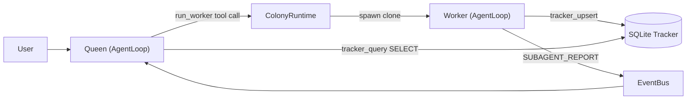
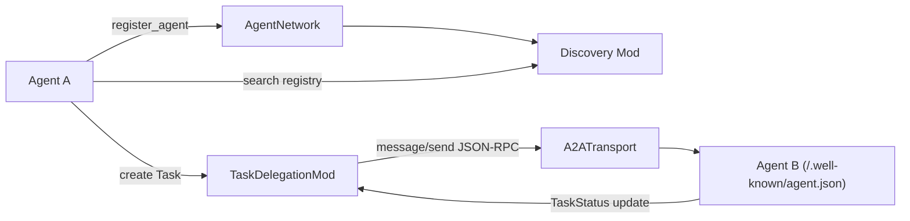
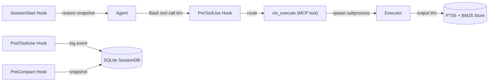
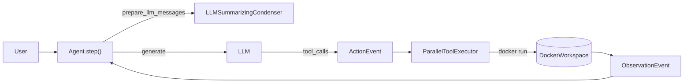

# Weekly Agentic AI Scan — 2026-09-13

**Executive summary:**
- Tuần này nổi bật nhất không phải "orchestration framework mới" mà là **khoảng cách giữa marketing README và code thật**: 2/4 repo được deep-dive (`adenhq/hive`, `openagents-org/openagents`) có claim kiến trúc (self-evolving topology, "dynamic A2A network") mà khi đọc code thì hoặc không tồn tại, hoặc thực chất hơn README nhiều — theo hai hướng ngược nhau.
- `mksglu/context-mode` là ví dụ tốt nhất tuần này về "production-grade engineering" thật: benchmark reproducible, thuật toán RRF+BM25 cụ thể, nhưng cũng lộ rõ risk bảo mật (credential passthrough) mà README không nhắc.
- OpenHands (`All-Hands-AI/OpenHands`) đã tách kiến trúc: repo cũ giờ chỉ là UI shell ("Agent Canvas"), toàn bộ agent loop/condenser/sandbox đã chuyển sang `OpenHands/software-agent-sdk` — một use-case thực tế của việc phải verify code thay vì tin tên repo.

**Mục lục:**
1. [adenhq/hive](#1-adenhqhive)
2. [openagents-org/openagents](#2-openagents-orgopenagents)
3. [mksglu/context-mode](#3-mksglucontext-mode)
4. [All-Hands-AI/OpenHands + OpenHands/software-agent-sdk](#4-all-hands-aiopenhands--openhandssoftware-agent-sdk)
5. [Repos khác đã xem xét nhưng không đạt tiêu chí](#5-repos-khác-đã-xem-xét-nhưng-không-đạt-tiêu-chí)
6. [Ghi chú phương pháp](#6-ghi-chú-phương-pháp)

---

## 1. adenhq/hive

**§1 — Quick context**
One-line pitch: Framework Python/TypeScript cho "colony" agent — một Queen loop bền vững sinh ra các worker loop tạm thời, phối hợp qua SQLite blackboard thay vì graph biên dịch sẵn.
Tech stack: Python 3.11+ (backend), TypeScript/React (frontend), `litellm` làm lớp LLM thống nhất, `anthropic` SDK trực tiếp, `mcp`/`fastmcp` cho tool server, `pydantic` cho schema, `sqlite3` thuần cho state.
Repo health: 11k sao, commit gần nhất 2026-09-05. CI thật (ruff lint + pytest trên ubuntu/windows + export validation), 182+162 file test. Lịch sử git trong bản clone bị squash nên không xác định được số contributor thật.

**§2 — Architecture deep-dive**

*A. Component inventory* (mỗi component kèm evidence path):
- `AgentLoop` (`core/framework/agent_loop/agent_loop.py`) — nguyên thủy thực thi duy nhất: stream output model, chạy tool call, phán quyết kết thúc.
- `ColonyRuntime` (`core/framework/host/colony_runtime.py`) — spawn/quản lý các worker clone, thay thế `AgentHost`/`ExecutionManager` cũ.
- Bộ máy graph "legacy" (`core/framework/orchestrator/orchestrator.py`, `node.py`, `edge.py`) — vẫn còn trong cây mã nguồn nhưng giờ chỉ bọc Queen như một "graph 1 node", không dùng cho đa-agent topology nữa.
- `Tracker` (`core/framework/host/tracker_db.py`) — SQLite blackboard chia sẻ giữa Queen và worker.
- `Task plan` (`core/framework/tasks/store.py`) — plan bền vững lưu file.
- `Judge pipeline` (`core/framework/agent_loop/internals/judge_pipeline.py`) — cổng phán quyết kết thúc 3 tầng.
- `Sentinel` (`core/framework/sentinel/manager.py`) — escalation human-in-the-loop qua Slack/Telegram.
- `Queen Memory v2` (`core/framework/agents/queen/queen_memory_v2.py`, `reflection_agent.py`, `recall_selector.py`) — memory dạng markdown theo scope, **không phải vector store**.
- Quan trọng: claim "autonomous topology generation" / "self-evolution" trong mô tả dự án **không có code tương ứng** — chính `docs/architecture/README.md` của repo viết rõ "There are no graphs, no edges, no nodes... Hive does not regenerate a graph across 'generations'".

*B. Control flow* — pattern: **single-loop hierarchical fan-out** (không phải graph state machine, không phải supervisor-workers có message passing giữa các worker với nhau — worker không thấy nhau):
1. Tin nhắn user vào `AgentLoop` của Queen.
2. Queen gọi tool `run_worker(tasks=[...])` (`queen_lifecycle_tools.py`) — fire-and-forget.
3. `ColonyRuntime` spawn các clone của chính `AgentLoop` với `LoopConfig` chặt hơn (`agents/queen/worker_definition.py`).
4. Worker ghi kết quả vào `tracker.db` qua `tracker_upsert`.
5. Khi xong, worker phát sự kiện `SUBAGENT_REPORT` qua `host/event_bus.py`, xuất hiện lại trong hội thoại của Queen dưới dạng turn `[WORKER_REPORT]`.
6. Queen kiểm tra qua `tracker_query` (chỉ SELECT) rồi fan-out tiếp hoặc hội tụ, có thể qua `run_playbook` (`host/playbook/runner.py`) cho luồng tất định.

*C. State & data flow*: message dùng dataclass/pydantic có kiểu (`Tool`, `ToolUse`, `ToolResult` — `llm/provider.py`). State lưu SQLite thuần + file-backed session/checkpoint store, không Redis/vector DB cho orchestration state. Context management theo kiểu pointer/spillover: kết quả tool lớn được ghi ra file, thay bằng tham chiếu `load_data()` (`agent_loop/internals/compaction.py`).

*D. Tool integration*: đăng ký qua `ToolRegistry` (Python function) và `MCPRegistry` (MCP server). Model gọi tool bằng **native function-calling** (`litellm`/`anthropic` với `tools=tools`), không parse JSON từ text tự do. Không tìm thấy sandbox riêng cho việc thực thi tool (không xác định từ code ngoài mã hoá credential).

*E. Memory*: ngắn hạn = compaction + spillover file; dài hạn = Queen Memory v2 dạng markdown theo scope (`global/colonies/agents`), ghi qua `reflection_agent.py` có cooldown, đọc qua `recall_selector.py` — xác nhận không dùng embedding/index.

*F. Model orchestration*: model-agnostic hoàn toàn qua LiteLLM; Queen và worker mặc định dùng cùng model (nguyên tắc "clone"), khác nhau ở budget/`LoopConfig` chứ không phải model khác nhau. `key_pool.py` xoay vòng nhiều API key.

*G. Observability & eval*: logging có trace-context qua `ContextVar` (tự viết, không phải OpenTelemetry/Langfuse). Eval nhẹ bằng `LLMJudge` (`testing/llm_judge.py`) chấm điểm semantic. Có cursor persistence để resume session (`cursor_persistence.py`) nhưng chưa phải "replay" đầy đủ.

*H. Extension points*: tool mới = function Python hoặc MCP server đăng ký vào registry; agent mới theo interface `AgentSpec`/`AgentProtocol` (`agent_loop/types.py`); Queen persona tuỳ biến qua YAML (`agents/queen/queen_defaults/*.yaml`).

**§3 — Architecture diagram**

**§4 — Verdict**
Điểm đáng học: thiết kế "một class AgentLoop đóng cả vai Queen bền vững lẫn worker tạm thời" là lựa chọn kiến trúc rõ ràng, nhất quán trong code, tránh được graph biên dịch cứng nhắc — cơ chế pointer/spillover cho tool output lớn cũng là một pattern context-management gọn và thực tế. Red flag lớn nhất: mô tả dự án nhấn "self-evolving topology" nhưng chính tài liệu kiến trúc nội bộ phủ nhận điều này — "improvement" thực chất chỉ là reflexion trong phiên + memory markdown, không phải tự sửa cấu trúc. Ngoài ra hai bộ máy thực thi (graph cũ + colony runtime mới) cùng tồn tại trong một codebase là rủi ro bảo trì. Câu hỏi cần đào sâu thêm: cơ chế sandbox thực thi tool (nếu có) nằm ở đâu, vì không thấy trong core.

---

## 2. openagents-org/openagents

**§1 — Quick context**
One-line pitch: SDK Python cho mạng multi-agent liên thông ("OpenAgents Network Model") nay được đóng gói lại thành "OpenAgents Workspace" — hub cho phép các CLI coding agent khác nhau (Claude Code, Cursor, Codex...) cùng tham gia không gian cộng tác chung.
Tech stack: Python 3.8+ (SDK core), Electron/TypeScript (launcher desktop), FastAPI + SQLAlchemy + Postgres (workspace backend). Transport thật: gRPC, WebSocket, HTTP, A2A JSON-RPC, MCP.
Repo health: 4.1k sao, commit hôm nay (2026-09-13). CI mở rộng: `pytest.yml` chạy ruff + pytest matrix qua các thư mục test a2a/agents/grpc/http/integration/mods/network/utils/workspace, cộng thêm `agent-e2e-smoke.yml` chạy smoke test thật với Claude Code/Hermes qua workspace. 130 file test Python.

**§2 — Architecture deep-dive**

*A. Component inventory*:
- `AgentNetwork` (`sdk/src/openagents/sdk/network.py`) — đối tượng mạng trung tâm, có `register_agent`/`unregister_agent` thật (dòng 468, 608), `load_mod`/`unload_mod`.
- ONM event pipeline (`sdk/src/openagents/sdk/onm_pipeline.py`, `onm_events.py`) — pipeline mod interceptor có thứ tự, nền tảng cho mô hình "events, not requests".
- Discovery mod (`sdk/src/openagents/mods/discovery/agent_discovery/mod.py`) — registry capability (`_agent_registry`), broadcast connect/disconnect.
- Task delegation (`sdk/src/openagents/mods/coordination/task_delegation/mod.py`) — dùng model A2A thật (`Task`, `TaskState`, `TaskStatus`), có `ExternalDelegator` cho cuộc gọi A2A ra ngoài, `capability_matcher.py` để match capability bằng LLM.
- A2A transport (`sdk/src/openagents/sdk/transports/a2a.py`) — server JSON-RPC 2.0 đầy đủ, implement discovery `/.well-known/agent.json`, `message/send`, `tasks/get|list|cancel`.
- Đã kiểm chứng claim README "agent join/leave mạng linh động bất cứ lúc nào" — **thật**, có test trong `tests/network`.
- Đã kiểm chứng claim "A2A-compatible" — **thật** cho tầng transport/task, có 7 file test trong `tests/a2a`, không chỉ là câu chữ marketing.

*B. Control flow* — pattern: **event-driven pipeline + task-delegation handoff (kiểu swarm/A2A)**:
1. Agent kết nối qua transport bất kỳ rồi gọi `AgentNetwork.register_agent`.
2. Discovery mod ghi nhận capability của agent qua `handle_register_agent`.
3. Agent khởi tạo tìm trong registry rồi tạo `Task` qua `TaskDelegationMod`.
4. Nếu target ở ngoài mạng, `ExternalDelegator` gửi `message/send` JSON-RPC qua `A2ATransport` tới endpoint `/.well-known/agent.json` của agent đích.
5. Sự kiện chảy qua `Pipeline.process` (`onm_pipeline.py`) — các mod có thứ tự có thể guard/transform/observe.
6. Cập nhật trạng thái task quay lại dưới dạng sự kiện `TaskStatus`, có timeout handling trong vòng lặp nền của `TaskDelegationMod`.

*C. State & data flow*: message có schema kiểu (`Event`, `EventResponse`, model A2A `Task`/`A2AMessage`/`Artifact`), không phải dict thô. State mặc định in-memory (`InMemoryTaskStore`, `_agent_registry` dict); workspace backend lưu Postgres qua SQLAlchemy/Alembic. Không tìm thấy cơ chế quản lý context window trong SDK core.

*D. Tool integration*: đăng ký qua manifest file mỗi mod (`mod_manifest.json` + `eventdef.yaml`). Model gọi tool qua MCP (`transports/mcp.py`) và native function-calling qua litellm/openai/anthropic. Không xác nhận được cơ chế sandbox riêng.

*E. Memory*: không tìm thấy module memory dài hạn trong SDK core — "Hermes Agent" được nhắc trong README có memory riêng nhưng đó là adapter bên thứ ba, không thuộc repo này.

*F. Model orchestration*: cấu hình model theo provider (`cloud_providers/*.json`), theo agent qua biến môi trường; không có logic fallback/parallel model rõ ràng ngoài routing sẵn có của litellm.

*G. Observability & eval*: logging qua `structlog`, metric qua `prometheus-client`. Không có eval harness/benchmark chuyên biệt — chỉ có test unit/integration, kèm Codecov trong CI.

*H. Extension points*: plugin qua subclass `BaseMod` + khai báo manifest, load qua `AgentNetwork.load_mod`. Transport pluggable qua base class `Transport`. Adapter coding-agent mới đặt ở `sdk/src/openagents/adapters/`.

**§3 — Architecture diagram**

**§4 — Verdict**
Điểm đáng học: mô hình verification 0-3 cấp (none → W3C DID) và event abstraction transport-agnostic (tài liệu `docs/openagents_network_model.md`) là một spec liên thông đa framework hình thức hoá hơn hẳn các framework multi-agent đơn-vendor kiểu AutoGen/CrewAI — và điểm khác biệt thực chất nhất là việc cầu nối các CLI coding-agent *đã tồn tại* (Claude Code, Cursor, Codex, Aider) vào một workspace chung, thay vì tạo thêm một framework agent mới. Red flag: README từng có ngôn ngữ growth-hacking (badge kêu gọi star kiểu CTA — dấu vết ở dòng 415), test của "Studio" bị tắt hẳn trong CI với comment "not actively maintained", và định vị dự án có vẻ đang trôi giữa "framework multi-agent" (theo `pyproject.toml`) và "Workspace cho coding agent" (theo README) — dù tầng A2A/ONM là thật, không phải chỉ scaffolding. Điều đáng chú ý: bản thân sự hoài nghi trên Hacker News ("không rõ use case thực") không được code phủ nhận, chỉ là code phần lõi liên thông chắc chắn hơn vẻ ngoài.

---

## 3. mksglu/context-mode

**§1 — Quick context**
One-line pitch: MCP server chặn tool-call có output lớn của coding agent (shell, Read, WebFetch...), thực thi/tìm kiếm trong subprocess sandbox, chỉ trả về bản tóm tắt/con trỏ để giữ raw data ngoài context của model.
Tech stack: TypeScript, Node ≥22.5, `@modelcontextprotocol/sdk`, `better-sqlite3` (FTS5), `zod`. Đóng gói bằng esbuild.
Repo health: 22k sao, commit hôm nay (2026-09-13). CI thật (Ubuntu/macOS/Windows, `tsc -b`, build, bundle, `vitest run`). 125+ test theo `BENCHMARK.md`. Clone là shallow nên không xác định được contributor thật.

**§2 — Architecture deep-dive**

*A. Component inventory*:
- 11 MCP tool đăng ký qua `server.registerTool()` (`src/server.ts`): `ctx_execute`, `ctx_execute_file`, `ctx_index`, `ctx_search`, `ctx_fetch_and_index`, `ctx_batch_execute`, `ctx_stats`, `ctx_doctor`, `ctx_upgrade`, `ctx_purge`, `ctx_insight` — khớp đúng với danh sách README.
- Sandboxed executor (`src/executor.ts`) — spawn `child_process` theo từng ngôn ngữ, có env denylist (`#buildSafeEnv`).
- FTS5/BM25 knowledge store (`src/store.ts`, 2071 dòng) — hai virtual table `chunks` (porter unicode61) và `chunks_trigram`.
- Unified search merge (`src/search/unified.ts`) — hợp nhất ContentStore + SessionDB + auto-memory.
- Session persistence (`src/session/db.ts`) — SQLite theo project.
- 6 hook (`hooks/pretooluse.mjs`, `posttooluse.mjs`, `precompact.mjs`, `sessionstart.mjs`, `stop.mjs`, `userpromptsubmit.mjs`) qua `hooks/core/routing.mjs`.
- 17 adapter platform (`src/adapters/{claude-code,cursor,codex,gemini-cli,...}`).

*B. Control flow* — đây là kiến trúc **hook-interception + tool sandbox**, không phải agent loop cổ điển:
1. Agent gọi tool output lớn (vd `Bash: gh issue list`) → **PreToolUse** hook chạy `routePreToolUse()` quyết định allow/deny/modify.
2. Nếu bị route, model gọi `ctx_execute`/`ctx_batch_execute` thay thế, chạy như subprocess OS thật với env đã lọc.
3. Nếu output >~5KB và có `intent`, tự động index vào FTS5 thay vì trả raw.
4. **PostToolUse** hook ghi tool call gốc thành sự kiện có phân loại (13 category) vào SessionDB theo project.
5. Khi compact, **PreCompact** đọc toàn bộ event của session, gọi `buildResumeSnapshot()` để tạo tài liệu con trỏ XML <2KB, lưu qua `db.upsertResume()`.
6. Turn kế tiếp, **SessionStart** phát hiện `--continue`/`--resume`: session mới thì purge ngay, session tiếp tục thì bơm lại resume snapshot.

*C. State & data flow*: schema SQLite gồm bảng `sources` + FTS5 `chunks`/`chunks_trigram` + bảng `session_events` riêng. Tìm kiếm dùng **BM25 + Reciprocal Rank Fusion** (Cormack et al. 2009) thật — `#rrfSearch()` hợp nhất kết quả porter-tokenized và trigram-tokenized với K=60, sau đó rerank theo độ gần (proximity). Session continuity dùng tài liệu XML dạng "mục lục tham chiếu", không chứa raw data.

*D. Tool integration*: đăng ký qua MCP SDK native, bọc thêm `wrapToolHandler` để track hoạt động. Giao tiếp qua MCP JSON-RPC chuẩn qua stdio, có sanitizer schema cho client strict kiểu Gemini. **Sandbox thực chất chỉ là subprocess cô lập, không phải sandbox thật**: không container/VM/seccomp/chroot — `child_process.spawn` kế thừa toàn bộ `process.env` của tiến trình cha, chỉ lọc bỏ một số biến tiêm mã (LD_PRELOAD, NODE_OPTIONS, BASH_ENV...), và tool được gắn `openWorldHint: true` (full network access).

*E. Memory*: ngắn hạn = event trong SessionDB hiện tại; dài hạn = content DB tự xoá sau 14 ngày (`cleanupStaleContentDBs`), session không tiếp tục bị purge ngay lúc SessionStart.

*F. Model orchestration*: không áp dụng — không có code gọi LLM nào trong `src/`, đây là server tầng data-plane/tool, không phải multi-agent orchestrator.

*G. Observability & eval*: `BENCHMARK.md` **có thể tái lập, không chỉ là số marketing** — `tests/ecosystem-benchmark.ts` chạy `PolyglotExecutor` trên fixture thật và đo byte tiết kiệm thật, nhưng script tóm tắt cho từng fixture do maintainer viết tay, phản ánh kịch bản tốt nhất chứ không phải hành vi LLM tự nhiên; chính BENCHMARK.md cũng thừa nhận `ctx_index`/`ctx_search` chỉ tiết kiệm 44-93%, thấp và trung thực hơn con số 95-100% của `ctx_execute_file`.

*H. Extension points*: platform mới = thêm thư mục dưới `src/adapters/<name>/` implement interface `HookAdapter`, cộng `configs/<name>/`. Tool MCP mới = thêm lệnh `server.registerTool()`.

**§3 — Architecture diagram**

**§4 — Verdict**
Điểm đáng học cụ thể: pipeline tìm kiếm dual-tokenizer FTS5 + RRF + proximity rerank (`store.ts`) là một stack tìm kiếm local, ít dependency nhưng thực sự tinh vi — hiếm thấy ở mức độ này trong một MCP server nhỏ. Red flag nghiêm trọng nhất: "sandbox" không phải ranh giới cô lập thật — subprocess kế thừa toàn bộ env của tiến trình cha (trừ một denylist chống RCE) và có full network access, nghĩa là credential AWS/GitHub/Docker trong môi trường **không bị strip** khi agent thực thi code qua đây — một rủi ro bảo mật thật sự nếu dùng để chạy code không tin cậy. Điểm hạn chế khác: mọi thứ (search index, session, stats) nằm trong file SQLite cục bộ theo project — hỏng một file là mất "trí nhớ" của project đó, và code xử lý lỗi kiểu "best-effort" (catch rỗng) khiến hỏng hóc có thể âm thầm trôi qua. Câu hỏi cần đào sâu: benchmark 98% có đại diện cho pattern sử dụng thật hay chỉ là kịch bản tối ưu do chính tác giả viết?

---

## 4. All-Hands-AI/OpenHands + OpenHands/software-agent-sdk

**Ghi chú quan trọng trước khi đọc:** repo nổi tiếng `All-Hands-AI/OpenHands` (88k sao, cập nhật 2026-09-12) **không còn chứa agent loop nữa**. Khi đọc code thật, nó đã bị tái cấu trúc thành **"Agent Canvas"** — một control-plane UI (React/TypeScript) để chạy OpenHands, Claude Code, Codex, Gemini... qua giao thức ACP. Toàn bộ agent loop, sandbox, và condenser đã được tách sang repo riêng `OpenHands/software-agent-sdk` (1.1k sao, commit hôm nay). Phần deep-dive dưới đây dùng `software-agent-sdk` làm nguồn chính vì đó mới là nơi có kiến trúc agentic thật; đây tự nó là một phát hiện đáng ghi nhận — tên repo quen thuộc không còn đảm bảo nội dung quen thuộc.

**§1 — Quick context**
One-line pitch: SDK Python lõi (được tách ra từ OpenHands) cung cấp agent loop, event stream có kiểu, sandbox runtime, và Agent Server REST/WebSocket cho coding agent production (77.6 điểm SWE-bench theo README).
Tech stack: Python ≥3.12, Pydantic v2 cho toàn bộ model, `litellm` làm client LLM chung, FastAPI cho `openhands-agent-server`, `fastmcp`/`agent-client-protocol` cho MCP/ACP, Docker làm sandbox chính (còn có Apptainer, remote-API, cloud backend).
Repo health: CI rất mở rộng — 30+ workflow gồm test theo từng package (sdk/tools/workspace/agent_server/cross/integration), `security-scan.yml` (diff dependency + kiểm tra approval-drift/TOCTOU dựa trên OSV cho release PR), kiểm tra breaking-change REST API. Clone là shallow nên không xác định được contributor thật.

**§2 — Architecture deep-dive**

*A. Component inventory*:
- Controller/loop: `Agent.step`/`_step` (`openhands-sdk/openhands/sdk/agent/agent.py`), kế thừa từ `AgentBase` (`agent/base.py`).
- Runtime/sandbox: `DockerWorkspace` (`openhands-workspace/openhands/workspace/docker/workspace.py`), cộng Apptainer/remote-API/cloud workspace.
- Action/Observation/Event: base class trong `tool/schema.py` và `event/base.py`, sự kiện cụ thể trong `event/llm_convertible/` (`ActionEvent`, `ObservationEvent`).
- Condenser: `context/condenser/` — `base.py` (`CondenserBase`, `RollingCondenser`), `llm_summarizing_condenser.py`, `no_op_condenser.py`, `pipeline_condenser.py`.
- Tool/skill system: `tool/registry.py`, `tool.py`, skill ở `sdk/skills/`, sub-agent delegation ở `sdk/subagent/`.

*B. Control flow* — **event-stream architecture với vòng lặp ReAct think→act→observe** trong `Agent.step`:
1. `_step()` kiểm tra action đang chờ xác nhận (confirmation mode) và thực thi trước.
2. Dựng danh sách message từ `state.view` qua `prepare_llm_messages(condenser=..., llm=...)`; nếu cần condense thì trả về sớm bằng `Condensation`.
3. Gọi `self.llm.generate(...)` với toàn bộ tool và `add_security_risk_prediction=True`; bắt lỗi context-window vượt giới hạn để phát `CondensationRequest()`.
4. `classify_response()` phân loại phản hồi model thành tool-call / content / no-content.
5. Tool call → `ActionEvent` (qua `_get_action_event`, validate arg + trích `security_risk`) → thực thi song song qua `ParallelToolExecutor.execute_batch` → sinh `ObservationEvent`.
6. `_ActionBatch.finalize` đặt trạng thái `FINISHED` khi gặp `FinishTool`, ngược lại vòng lặp `step()` tiếp tục.

*C. State & data flow*: schema `Action`/`Observation`/`Event` có kiểu Pydantic rõ ràng. Condenser (`llm_summarizing_condenser.py`) là **hybrid sliding-window + LLM-summarization**: `get_condensation_reasons` kích hoạt theo REQUEST/TOKENS(ngân sách context)/EVENTS(số lượng); `_get_forgotten_events` tính đoạn giữa cần quên nhưng tôn trọng ranh giới atomic tool-call/observation (không cắt đôi một cặp); một LLM tóm tắt riêng sinh ra một sự kiện `Condensation` duy nhất thay thế đoạn đã quên; có `hard_context_reset` fallback cắt dần khi tóm tắt cũng lỗi.

*D. Tool integration*: đăng ký/validate qua `tool/registry.py` (`ToolDefinition`, kiểm tra trùng tên). Model output parse bằng **native function-calling** (`MessageToolCall`), chuẩn hoá qua `normalize_tool_call`/`fix_malformed_tool_arguments`. Thực thi shell qua `tmux` session bền (`libtmux`) pooled; cách ly thật sự nằm ở `Workspace` — `DockerWorkspace._start_container` chạy `docker run --rm` với allowlist env forward, **nhưng không đặt giới hạn CPU/memory, không `--read-only`, không seccomp/AppArmor profile mặc định** — network là opt-in chứ không phải opt-out.

*E. Memory*: condenser chỉ tóm tắt trong phạm vi một conversation (`default_condenser()` dùng `max_size=80, keep_first=4`); không có bộ nhớ dài hạn liên phiên ngoài `AgentContext`/skills và file `SOUL.md` tuỳ chọn.

*F. Model orchestration*: đa provider qua LiteLLM. `fallback_strategy.py` retry khi gặp RateLimit/Timeout/InternalServerError. `router/base.py` (`RouterLLM`) cho phép chọn model khác nhau theo vai trò (vd LLM tóm tắt riêng cho condenser).

*G. Observability & eval*: tracing qua Laminar (`observability/laminar.py`, `@observe` span) và telemetry PostHog ở agent-server. **SWE-bench eval không nằm trong repo này** — `run-eval.yml` dispatch sang repo `OpenHands/evaluation` riêng khi release. Có harness hành vi nội bộ (`tests/integration/run_infer.py`).

*H. Extension points*: agent tuỳ biến = subclass `AgentBase` (abstract `step()`); tool tuỳ biến = implement `ToolDefinition`/`ToolExecutor`; LLM routing tuỳ biến = subclass `RouterLLM`; condenser tuỳ biến = subclass `CondenserBase`/`RollingCondenser`.

**§3 — Architecture diagram**

**§4 — Verdict**
Điểm đáng học cụ thể: cơ chế "boundary-aware forgetting" của condenser (tôn trọng ranh giới atomic tool-call/observation khi quên) là một fix cụ thể cho lỗi condensation kinh điển, không phải sliding-window ngây thơ; `_ActionBatch` tách rõ truncation/hook-blocking/parallel-execution khỏi logic `Agent`, giữ core loop gọn. `security-scan.yml` với kiểm tra approval-drift/TOCTOU trên OSV là mức độ trưởng thành supply-chain hiếm thấy ở một agent framework. Red flag: `DockerWorkspace` không đặt giới hạn tài nguyên hay security profile mặc định — cô lập chủ yếu dựa vào container thay vì defense-in-depth, và network egress mặc định không bị chặn. Bài học phương pháp cho chính bản scan này: không thể tin tên repo/số sao một mình — phải đọc code để biết kiến trúc thật đang nằm ở đâu. Câu hỏi cần đào sâu: vì sao tách UI khỏi agent loop thành hai repo — có phải để hỗ trợ nhiều agent backend (Claude Code, Codex) ngang hàng OpenHands, biến "OpenHands" từ một agent thành một nền tảng?

---

## 5. Repos khác đã xem xét nhưng không đạt tiêu chí

Các repo sau được tìm thấy trong quá trình quét nhưng bị loại khỏi deep-dive (thường do không đạt ngưỡng sao hoặc đã quá 7 ngày không cập nhật), ghi lại để tham khảo:

- **ProofAgent-ai/proofagent-harness** — harness eval đối kháng (adversarial evaluation) cho agent, có paper arXiv đi kèm (2605.24134), nhưng chỉ 28 sao và commit gần nhất 2026-08-14 (>7 ngày) — không đạt cả hai ngưỡng stars và recency.
- **jt-mchorse/agent-orchestration-platform** — kiến trúc planner→executor với re-plan khi gặp output bất ngờ và HITL checkpoint, nhưng 0 sao — quá sớm để đánh giá độ trưởng thành.
- **Jwrightsman/distributed-orchestrator** — orchestration layer phân tán cho multi-agent execution trên phần cứng của contributor, đang ở giai đoạn "trusted alpha" riêng tư, 0 sao.
- **microsoft/Orchard** — framework RL cho agent SWE (SOTA SWE-bench Verified ở nhóm model mở cùng kích thước), có paper arXiv (2605.15040) và 511 sao, nhưng commit gần nhất 2026-07-30 — quá cũ so với cửa sổ 7 ngày.

## 6. Ghi chú phương pháp

Trong phiên chạy này, việc gọi trực tiếp `github.com`/`api.github.com` qua công cụ fetch nội dung web trả về trang chặn 403 (do phạm vi truy cập GitHub của session này bị giới hạn vào một repo khác), nhưng công cụ fetch-nội-dung-qua-model-tóm-tắt **không báo lỗi mà tạo ra nội dung hợp lý nhưng bịa** khi nhận trang chặn đó — điều này đã được phát hiện và toàn bộ dữ liệu kiểu này bị loại bỏ khỏi báo cáo. Toàn bộ dữ liệu thực tế trong báo cáo trên được lấy bằng cách `git clone` trực tiếp từng repo (giao thức git qua HTTPS không bị chặn) rồi đọc file thật, cộng với số sao xác thực qua `img.shields.io` (độc lập với GitHub API). Danh sách repo ứng viên ban đầu đến từ tìm kiếm web (không phải GitHub Search API), nên có thể bỏ sót các repo mới khác không được index tốt trong tuần.
