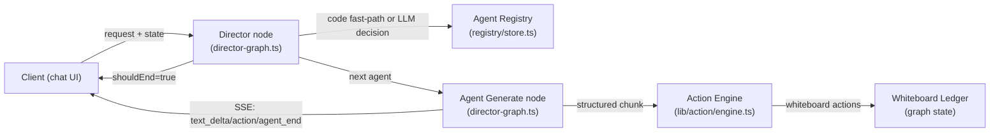
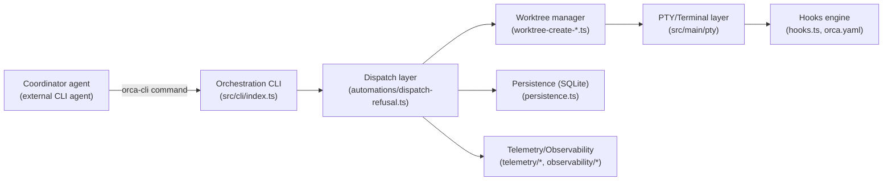
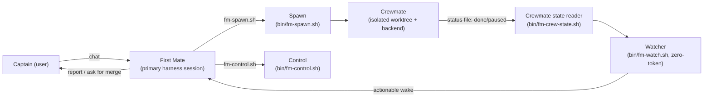

# Weekly Agentic AI Scan — 2026-09-14

**Executive summary:**
- Tuần này nổi bật 3 repo agentic có commit trong 24-48h gần nhất, đại diện cho 3 tầng orchestration khác nhau: LLM-native graph orchestration (OpenMAIC dùng LangGraph), process/session orchestration cho external coding agent (Orca), và pure-bash event-driven supervision không tốn token (firstmate).
- Điểm chung đáng chú ý: cả 3 đều **không** dùng ReAct loop cổ điển bên trong lõi orchestration — mỗi repo tự phát minh một control-flow pattern khác (single-round stateless graph, CLI-as-tool control-plane, bash log-classifier state machine).
- firstmate là ví dụ rõ nhất về "zero-token supervision" — dùng bash pattern-matching thay vì LLM call để giám sát fleet agent, một hướng tối ưu chi phí ít gặp trong các framework multi-agent phổ biến (LangGraph/CrewAI/AutoGen).

**Mục lục:**
- [1. THU-MAIC/OpenMAIC](#1-thu-maicopenmaic)
- [2. stablyai/orca](#2-stablyaiorca)
- [3. kunchenguid/firstmate](#3-kunchenguidfirstmate)

**Ghi chú phương pháp:** Do phạm vi GitHub API của phiên làm việc này chỉ được cấp cho repo `undertheseanlp/underthesea` (kể cả `api.github.com` không dùng token bị chặn ở tầng proxy), không thể chạy `gh api search/repositories` như quy trình chuẩn. Thay vào đó, các repo ứng viên được tìm qua web search (GitHub trending / star-history / ossinsight), sau đó **clone trực tiếp về máy và đọc mã nguồn thật** (`git clone --depth 1`) để lấy evidence cho §2 — không suy diễn từ mô tả marketing. Link cả 3 repo được xác nhận tải thành công (không phải 404) qua fetch trực tiếp trang GitHub; `curl` thô tới `github.com` bị proxy của phiên trả về 403 (chặn scraping, không phải lỗi từ phía repo) nên không dùng được để đo mã HTTP theo đúng nghĩa đen "200" trong self-check gốc. Số sao (star count) dao động khá nhiều giữa các lần fetch và các nguồn cache khác nhau (star-history.com, gitstarclub.com, trang GitHub trực tiếp) nên được ghi dưới dạng khoảng ước lượng, không phải số chính xác tại thời điểm viết — độc giả nên tự kiểm tra số hiện tại nếu cần chính xác.

---

## 1. THU-MAIC/OpenMAIC

### §1 — Quick Context

Nền tảng multi-agent biến tài liệu/chủ đề thành lớp học tương tác với AI giáo viên và bạn học. Tech stack: Next.js 16, React 19, TypeScript 5, LangGraph 1.1 (`@langchain/langgraph`), Vercel AI SDK, PostgreSQL, Docker. Repo health: ~21k-32k sao (nguồn dao động), ~4.6k fork, commit mới nhất **2026-09-14** (cùng ngày viết báo cáo), có test suite lớn (`tests/`, `e2e/` với Playwright, `vitest.config.ts`) và CI script (`scripts/ci-run-parallel.sh`).

### §2 — Architecture Deep-Dive

**A. Component inventory**

- `Director` node (`lib/orchestration/director-graph.ts`) — quyết định agent nào phát biểu tiếp theo trong mỗi lượt thảo luận.
- `Agent Generate` node (`lib/orchestration/director-graph.ts`, hàm `runAgentGeneration`/`agentGenerateNode`) — chạy generation cho một agent, parse output xen kẽ text/action.
- `Agent Registry` (`lib/orchestration/registry/store.ts`, `agent-selection.ts`) — lưu config persona, avatar, `allowedActions` của từng agent.
- `Prompt Builder` (`lib/orchestration/prompt-builder.ts`, `director-prompt.ts`) — build system prompt cho director và cho từng agent riêng.
- `Conversation Summarizer` (`lib/orchestration/summarizers/conversation-summary.ts`, `message-converter.ts`, `whiteboard-conflicts.ts`) — nén lịch sử hội thoại và theo dõi xung đột hành động trên whiteboard.
- `Action Engine` (`lib/action/engine.ts`) — thực thi action agent phát ra (vẽ whiteboard, thao tác slide/quiz).
- `Whiteboard Ledger` (`lib/orchestration/director-graph.ts`, field `whiteboardLedger` trong `OrchestratorState`; đối chiếu xung đột ở `lib/orchestration/summarizers/whiteboard-conflicts.ts`) — sổ ghi các hành động whiteboard đã thực hiện trong graph state, dùng làm ngữ cảnh cho lượt kế tiếp.
- `Agent Runtime` cho Pro Workbench (`lib/agent/runtime/*`, vendored từ `pi-agent-core` theo `lib/agent/VENDOR.md`) — một agent loop độc lập (session management, skills, compaction, hooks) phục vụ chế độ chat-first xây khóa học, khác hẳn `director-graph` (dùng cho lớp học thảo luận).
- `RAG pipeline` (`lib/rag/chunking`, `lib/rag/ingest`, `lib/rag/providers`) — ingest tài liệu người dùng upload.
- `Runtime/Persistence store` (`lib/runtime/store.ts`, `lib/persistence/*`) — durable session trên Postgres.

**B. Control flow — pattern nào?**

Không phải ReAct loop cổ điển. Đây là **planner-executor dạng graph stateless từng bước** (LangGraph `StateGraph`), với vòng lặp đa lượt được đẩy ra phía client:

1. Client gửi request kèm state hiện tại (`turnCount`, `agentResponses`, `whiteboardLedger`) tới graph.
2. `directorNode` chọn agent kế tiếp — code fast-path (agent đơn hoặc trigger agent ở lượt 0) hoặc gọi LLM quyết định dựa trên `buildDirectorPrompt`.
3. `directorCondition` route sang `agent_generate` hoặc kết thúc (`END`/cue user).
4. `agentGenerateNode` build prompt riêng cho agent đó, stream token qua `AISdkLangGraphAdapter`.
5. Output được `parseStructuredChunk` tách thành text và "action" (vd `wb_draw`), lọc theo whitelist `effectiveActions` theo loại scene, ghi vào whiteboard ledger.
6. Client nhận SSE events, lặp lại request nếu `shouldEnd = false` — server graph **không tự loop**, "topology chính là giới hạn" (comment trong code).

**C. State & data flow**

Message format là typed schema (`StatelessChatRequest`, `StatelessEvent` trong `lib/types/chat`), không phải raw string. State lưu client-side kèm tùy chọn server-backed Postgres cho phiên bền vững (README: "Server-backed runs survive restarts"). Context window được nén qua `summarizeConversation` trước khi đưa vào director prompt; RAG (`lib/rag`) tách riêng, chỉ phục vụ tài liệu học liệu chứ không phải bộ nhớ hội thoại.

**D. Tool / capability integration**

Không dùng native function-calling hay MCP ở lớp discussion graph — agent phát ra "action" dạng structured tag trong response text, được `tool-schemas.ts` validate theo whitelist tùy scene rồi thực thi qua `lib/action/engine.ts`. Đây là pattern gần với code-execution/DSL-action hơn là function-calling thuần.

**E. Memory architecture**

Short-term: `agentResponses` + `whiteboardLedger` trong graph state theo từng lượt. Long-term: Postgres-backed persistence (`lib/persistence`) với "revision counters" giữ tính nhất quán giữa các stage/scene (theo README). RAG riêng cho tài liệu nguồn.

**F. Model orchestration**

Provider-neutral qua Vercel AI SDK adapter (`ai-sdk-adapter.ts`), hỗ trợ OpenAI/Anthropic/Azure/Bedrock/Google/Grok/OpenRouter. Changelog v0.3.0 nêu "optional per-stage model routing" — cho phép chọn model khác nhau theo từng giai đoạn sinh nội dung. Không xác định từ code đã đọc: cơ chế fallback/parallel-call cụ thể.

**G. Observability & eval**

Có eval harness riêng (`eval/orchestration/judge.ts`, `answer-content-judge.ts`, `scenarios/`) — dạng LLM-as-judge để chấm chất lượng orchestration/câu trả lời. Logging qua `createLogger` (`lib/logger.ts`) xuyên suốt director-graph. Không thấy OpenTelemetry/Langfuse trong phần code đã đọc.

**H. Extension points**

Skill package chuẩn `skills/openmaic/SKILL.md` cho phép cắm vào agent workbench ngoài (OpenClaw, Codex, DeepSeek, WorkBuddy...). Agent tùy chỉnh có thể định nghĩa qua `agentConfigOverrides` request-scoped (không cần sửa registry toàn cục — giữ server stateless).

### §3 — Architecture Diagram

### §4 — Verdict

**Điểm novel:** tách bạch rõ giữa graph stateless từng bước (server) và vòng lặp đa lượt (client tự serialize request) — thiết kế này giúp server không giữ state hội thoại, dễ scale horizontal, đồng thời tránh được vấn đề "maxTurns cap" phổ biến ở các multi-agent graph khác (comment trong code nói thẳng "topology itself is the bound"). Việc có 2 orchestration layer song song (director-graph cho discussion, vendored pi-agent-core cho workbench) cũng là điểm thiết kế đáng học.

**Red flags:** action-parsing dựa trên regex/structured-chunk từ text LLM (`parseStructuredChunk`) thay vì function-calling native — dễ vỡ khi model không tuân thủ format nghiêm ngặt; code có nhiều nhánh xử lý lỗi parse cho thấy đây là vấn đề thực tế đã gặp.

**Câu hỏi mở:** cơ chế fallback khi 1 provider lỗi giữa chừng generation chưa rõ; cần đọc thêm `lib/agent/runtime/*` (workbench) để hiểu rõ agent loop đó khác gì so với director-graph về compaction/skills.

---

## 2. stablyai/orca

### §1 — Quick Context

Desktop app (Electron) điều phối song song nhiều coding-agent CLI (Claude Code, Codex, Gemini, Grok...), mỗi agent chạy trong git worktree cô lập riêng, kèm companion app mobile. Tech stack: Electron + TypeScript (main/renderer/preload), React, native modules cho macOS/Windows/Linux computer-use, React Native cho mobile, cloud relay pnpm workspace riêng. Repo health: ~41k-67k sao (nguồn dao động mạnh), ~2.9k fork, 322 contributor, commit mới nhất **2026-09-14**, test suite rất lớn (hàng trăm file `*.test.ts` cạnh mỗi module), husky pre-commit hook.

### §2 — Architecture Deep-Dive

**A. Component inventory**

- `Main process bootstrap` (`src/main/index.ts`, `src/main/startup/*`) — khởi tạo Electron window, đăng ký IPC handler.
- `Worktree manager` (`src/main/worktree-create-*.ts`, `local-worktree-filesystem.ts`, `worktree-removal-*.ts`) — tạo/xóa/theo dõi git worktree cô lập cho mỗi agent.
- `Hooks engine` (`src/main/hooks.ts`) — đọc `orca.yaml` của repo, chạy lifecycle hook (setup, issueCommand) khi agent làm việc, timeout 120s (`HOOK_TIMEOUT`).
- `Automation/Dispatch layer` (`src/main/automations/dispatch-refusal.ts`, `dispatch-tokens.ts`, `external-automation-manager-cache.ts`) — quản lý job của external automation manager.
- `Orchestration CLI/skill` (`skills/orchestration/SKILL.md`, `src/cli/index.ts`, `src/cli/orchestration-dispatch-refusal-format.ts`) — lớp "coordinator" cho agent bên ngoài: threaded messages, blocking ask/reply, task DAG, decision gates.
- `PTY/Terminal layer` (`src/main/pty`) — quản lý terminal thật cho từng agent (Ghostty-class rendering theo README).
- `Persistence` (`src/main/persistence.ts` + hàng chục `persistence-*.ts`) — lưu state UI, worktree, automation, dùng SQLite (`src/main/sqlite`).
- `Telemetry & Observability` (`src/main/telemetry/*`: `burst-cap.ts`, `cohort-classifier.ts`, `consent.ts`; `src/main/observability/*`: `tracer.ts`, `redactor.ts`, `diagnostic-bundle-upload.ts`) — theo dõi lỗi/usage cấp ứng dụng.
- `Relay/Mobile bridge` (`src/relay`, `mobile/`) — đồng bộ hai chiều desktop ↔ mobile companion app.

**B. Control flow — pattern nào?**

Đây **không phải** một LLM-agent framework có planner/executor nội tại — Orca là **process/session orchestrator**: nó spawn nhiều external coding-agent CLI process, mỗi cái trong PTY + git worktree riêng, rồi expose một control-plane (`orca-cli`) để 1 agent điều phối các agent khác thông qua Orca runtime. Quyết định "ai làm gì" nằm ở agent gọi CLI, không phải trong code Orca — gần giống pattern **swarm/handoff qua CLI-as-tool** hơn là supervisor có logic nội tại.

Happy path (theo `skills/orchestration/SKILL.md` + các file dispatch):
1. Coordinator agent chạy `ORCA skills get orchestration` để tải hướng dẫn khớp đúng phiên bản binary.
2. Coordinator gọi lệnh CLI (`src/cli`) để dispatch task tới worker, mỗi worker được cấp một worktree cô lập (`worktree-create-*.ts`).
3. Mỗi worker chạy trong PTY riêng, hook từ `orca.yaml` (`hooks.ts`) chạy khi setup/teardown.
4. Coordinator dùng blocking ask/reply hoặc chờ `worker_done`/escalation qua state runtime (`dispatch-refusal.ts`).
5. Kết quả (diff/PR) được review qua tính năng Annotate-AI-Diff hoặc trả lại coordinator để merge.
6. Telemetry/observability ghi log, upload diagnostic bundle khi cần debug.

**C. State & data flow**

Giao tiếp CLI ↔ main process qua Electron IPC (`src/preload`, `ipcMain`/`ipcRenderer`) và JSON từ `orca.yaml`. State lưu cục bộ bằng SQLite + `persistence.ts`, đồng bộ real-time sang mobile qua Relay cloud (`cloud/`). Không có context-window/summarization logic — Orca không tự gọi LLM nên việc quản lý context của mỗi agent do CLI đó tự đảm nhiệm.

**D. Tool / capability integration**

Không phải LLM function-calling — Orca cung cấp `orca-cli` như một bộ **command** (`worktree create`, `snapshot`, `click`, `fill`) mà agent gọi như shell command (dạng code-execution/CLI-as-tool). Hook từ `orca.yaml` chạy có sandbox timeout nhưng không thấy sandbox cô lập process rõ ràng ngoài timeout.

**E. Memory architecture**

Không xác định từ code đã đọc theo nghĩa "agent memory" — Orca lưu terminal scrollback/history (`terminal-history*.ts`) và automation run history, nhưng đây là session/audit log cấp ứng dụng chứ không phải bộ nhớ LLM.

**F. Model orchestration**

Không xác định từ code — Orca không gọi LLM trực tiếp; nó orchestrate các CLI agent process (Claude Code, Codex, Gemini, Grok...) vốn tự quản lý model riêng của chúng.

**G. Observability & eval**

Hệ thống telemetry production-grade rõ rệt: `burst-cap.ts` (rate-limit sự kiện gửi lên), `consent.ts` (opt-in tracking), `cohort-classifier.ts`, và `observability/` với `tracer.ts`, `redactor.ts` (loại dữ liệu nhạy cảm khỏi log trước khi upload), `diagnostic-bundle-upload.ts`. Đây là observability cấp desktop-app (crash/usage), không phải eval cho chất lượng LLM.

**H. Extension points**

Plugin system (`src/main/plugins`, `examples/plugins`, `resources/plugins`), skill-guides cho phép viết skill riêng dùng `orca-cli`, và `orca.yaml` cho phép định nghĩa hook/script tùy theo từng repo.

### §3 — Architecture Diagram

### §4 — Verdict

**Điểm novel:** thay vì xây một "agent framework" mới, Orca biến chính IDE/terminal-multiplexer desktop app thành **control-plane** cho các coding-agent CLI đã có sẵn (Claude Code, Codex...), với worktree isolation + PTY + mobile companion làm lớp hạ tầng dùng chung. Đầu tư observability (consent, redactor, cohort classifier) ở mức chi tiết hiếm thấy trong repo agent open-source cỡ vừa.

**Red flags:** kiến trúc rất lớn (229k dòng TS, hàng trăm module) khiến việc xác minh boundary bảo mật giữa các agent chạy song song (cùng máy, khác worktree) khó đánh giá chỉ qua đọc lướt; không thấy rõ cơ chế cô lập ngoài git worktree + PTY riêng (không phải container/VM theo mặc định, dù có `ephemeral-vm-*` files gợi ý tùy chọn VM).

**Câu hỏi mở:** file `ephemeral-vm-*` cho thấy có runtime VM ephemeral tùy chọn — cần đọc sâu hơn để biết đây có phải sandbox bảo mật thật hay chỉ là remote dev environment; cơ chế "computer-use" (`native/computer-use-*`) cũng đáng đào sâu vì liên quan tới quyền điều khiển desktop thật.

---

## 3. kunchenguid/firstmate

### §1 — Quick Context

"Agent distro" thuần bash: một "first mate" giám sát nhiều "crewmate" agent chạy song song, mỗi crewmate trong git worktree riêng, dùng harness sẵn có (Claude Code, Grok, Pi, Codex, OpenCode, Cursor). Không phải framework code mà là tập convention + script cắm vào agent CLI có sẵn. Repo health: ~2.6k-3k sao, hoạt động rất tích cực (commit **2026-09-13**), test suite lớn (~150+ file `*.test.sh` trong `tests/`), tài liệu kiến trúc chi tiết 439 dòng (`docs/architecture.md`).

### §2 — Architecture Deep-Dive

**A. Component inventory**

- `First Mate` — phiên agent chính (harness được launch ngay trong repo này), điều phối theo hợp đồng trong `AGENTS.md`.
- `Watcher` (`bin/fm-watch.sh`) — daemon bash "zero-token": phân loại các "wake" (sự kiện cần chú ý) **không dùng LLM call**, chỉ dùng bash pattern-matching để quyết định absorb hay escalate.
- `Spawn` (`bin/fm-spawn.sh`) — launch một crewmate mới vào worktree cô lập (treehouse hoặc Orca-managed), với "delivery contract" bắt buộc (mode: `no-mistakes`/`direct-PR`/`local-only`, flag `--yolo`).
- `Crewmate state reader` (`bin/fm-crew-state.sh`) — đọc trạng thái HIỆN TẠI (không chỉ event cuối) của một crew bằng cách đối chiếu log append-only với run-step/pane busy-signature, xác định là "no heuristics and no LLM" ngay trong comment đầu file.
- `Control` (`bin/fm-control.sh`) — control plane cho relaunch/checkpoint một task đang chạy.
- `Supervise daemon` (`bin/fm-supervise-daemon.sh`, `fm-supervision-*.sh`) — vòng giám sát nền khi ở chế độ afk/quiet.
- `Backlog/Task inbox` (`bin/fm-backlog-*.sh`, `fm-task-inbox-lib.sh`) — hàng đợi giao việc và handoff giữa first mate và crewmate.
- `Secondmate registry` (`bin/fm-secondmate-*.sh`) — quản lý "second mate" bền vững chạy trên máy khác qua SSH.
- `Backend abstraction` (`bin/fm-backend.sh`, `fm-backend-hometag-lib.sh`) — tầng trừu tượng cho tmux (mặc định)/herdr/zellij/Orca/cmux.

**B. Control flow — pattern nào?**

Hierarchical supervisor→workers, nhưng điểm khác biệt cốt lõi: vòng giám sát chạy hoàn toàn bằng **bash pattern-matching trên log/pane state**, không gọi LLM cho mỗi lần kiểm tra ("zero-token, event-driven supervision" — nguyên văn từ README/architecture.md). Đây là state machine event-driven hơn là ReAct hay graph LLM-native.

Happy path (theo README "How It Works" + `docs/architecture.md`):
1. Captain (người dùng) chat với First Mate, ra yêu cầu (vd "fix flaky login test and add dark mode").
2. First Mate phân tách việc, gọi `fm-spawn.sh` tạo N crewmate, mỗi crewmate một worktree cô lập + một session backend (tmux window/herdr tab...).
3. `fm-watch.sh` theo dõi mọi pane: phân loại wake "benign" (absorb, tiếp tục ngủ) hay "actionable" (đánh thức First Mate).
4. Khi task xong, crewmate ghi status file (`done: PR ...`) — watcher phát hiện, First Mate báo cáo captain.
5. Captain duyệt ("merge it") → First Mate merge theo project mode đã cấu hình từ đầu.
6. Worktree teardown, state ghi lại trên đĩa để restart-proof (kill session bất kỳ lúc nào, phiên sau tự reconcile).

**C. State & data flow**

Toàn bộ state là **file trên đĩa** (status file, `state/<id>.meta`, backlog file) — không DB, không vector store. Message format là text log line theo quy ước cố định (vd `done: PR ...`, `paused: ...`), parse bằng bash/regex, không phải typed schema. Firstmate không quản lý context window của LLM chính (việc của harness bên dưới), nhưng tự quản lý "startup memory budget" riêng cho First Mate qua `fm-startup-memory-budget.sh`.

**D. Tool / capability integration**

Không có tool-calling LLM nội bộ — firstmate chính là một tập lệnh bash mà agent (Claude Code, Grok...) thực thi qua shell tool sẵn có của chính nó. Cơ chế "đăng ký" là file convention: skill nằm ở `.agents/skills/` (agent-only, `metadata.internal: true`) hoặc `skills/` (installer-facing, độc lập với firstmate), theo chuẩn SKILL.md.

**E. Memory architecture**

Short-term: state hiện tại của từng task trong `state/`. Long-term: skill `/stow` "curate tiered startup memory with decay and cold archival" — nén và lưu trữ tri thức có phân tầng, tự decay/archive khi vượt budget. Đây là cơ chế memory file-based có tổ chức, không dùng vector DB/retrieval — khá khác biệt so với RAG-based memory phổ biến.

**F. Model orchestration**

Firstmate không tự gọi model — nó launch harness có sẵn (Claude Code/Grok/Pi/Codex/OpenCode/Cursor) làm cả First Mate lẫn crewmate, cho phép chọn `--model`/`--effort` khác nhau mỗi lần spawn (`fm-spawn.sh`). Một số harness (Pi) hỗ trợ pin model rẻ hơn riêng cho "supervision branch" qua lệnh `/supervision-model` — tách biệt model cho việc giám sát (rẻ) khỏi model cho việc làm chính (đắt hơn).

**G. Observability & eval**

Test suite rất lớn (150+ file `*.test.sh`, nhiều test "live e2e") nhưng không có OpenTelemetry/tracing cho LLM call — quan sát chủ yếu qua log file quy ước cộng skill `/bearings` (digest báo cáo trạng thái fleet 4 phần, có thể ghi file `data/status-report-<date>.md`).

**H. Extension points**

Backend pluggable (tmux/herdr/zellij/Orca/cmux qua `fm-backend.sh`), adapter riêng cho từng loại harness (`fm-*-harness.sh` theo tên harness: claude, grok, pi, codex...), và hệ thống skill hai tầng cho phép mở rộng độc lập với firstmate.

### §3 — Architecture Diagram

### §4 — Verdict

**Điểm novel:** "zero-token supervision" — dùng bash classifier để quyết định khi nào cần đánh thức agent chính thay vì poll bằng LLM call, là một giải pháp cost-engineering cụ thể và hiếm gặp so với các multi-agent framework LLM-native khác (LangGraph/CrewAI thường poll hoặc loop bằng LLM). Việc tách "supervision model" rẻ hơn cho riêng nhánh giám sát (qua Pi's `/supervision-model`) cũng là một chi tiết production-cost đáng học.

**Red flags:** toàn bộ hệ thống phụ thuộc quy ước text log nghiêm ngặt (`done: PR ...`) được parse bằng regex/bash — dễ vỡ nếu harness bên dưới thay đổi format output; đây thực chất là "framework quanh CLI agent có sẵn" nên giá trị phụ thuộc mạnh vào các harness ngoài (Claude Code, Grok...) còn hỗ trợ đúng hook mà firstmate cần.

**Câu hỏi mở:** cơ chế "trust"/sandbox giữa crewmate và project thật (dòng "first mate is read-only over your projects except... narrow guarded... operations") cần đọc kỹ `AGENTS.md` để đánh giá mức độ an toàn thực sự khi cho phép crewmate merge code tự động (`+yolo` flag).

---

*Nguồn: mã nguồn được clone trực tiếp từ GitHub (`git clone --depth 1`) và đọc trực tiếp trong phiên nghiên cứu này. Link kiểm chứng: [github.com/THU-MAIC/OpenMAIC](https://github.com/THU-MAIC/OpenMAIC), [github.com/stablyai/orca](https://github.com/stablyai/orca), [github.com/kunchenguid/firstmate](https://github.com/kunchenguid/firstmate).*
