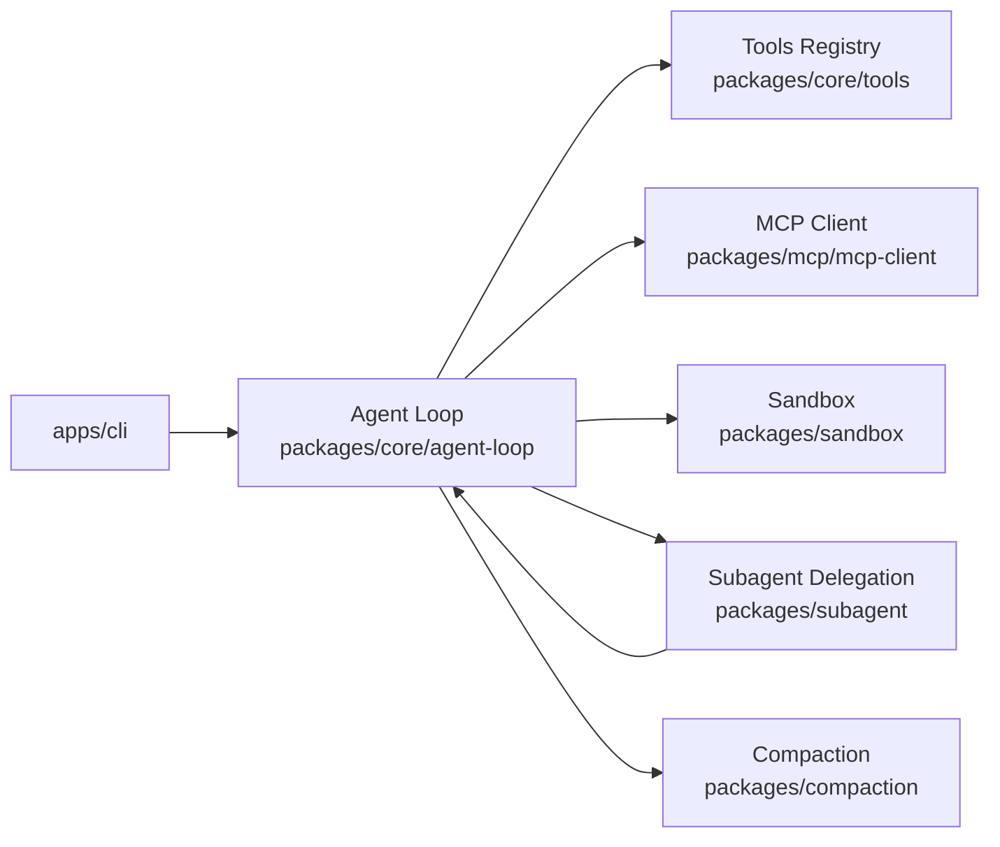
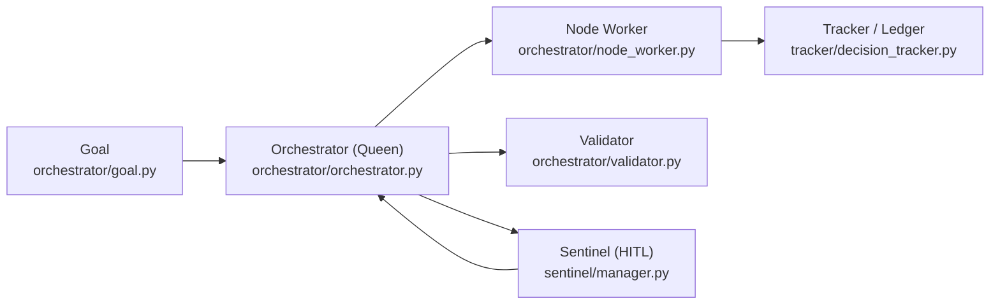
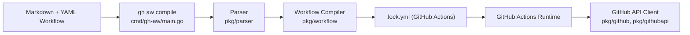
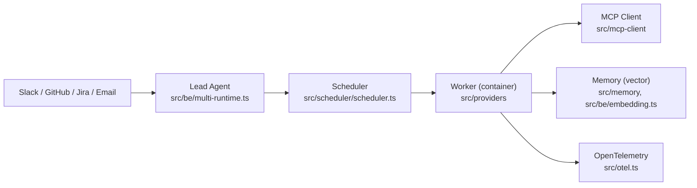

# Báo cáo tuần: Repo Agentic AI / Multi-Agent nổi bật (08/09 – 15/09/2026)

## Tóm tắt điều hành

- Tuần này không có "unicorn" hoàn toàn mới đúng nghĩa (repo tạo mới trong 7 ngày và đã vượt 200 sao); thay vào đó các repo đáng chú ý nhất là những dự án **đã có traction lớn và vừa được cập nhật tích cực trong tuần** (08–15/09/2026), gồm `deepseek-ai/deepseek-harness` (~224k sao), `aden-hive/hive` (~11k sao), `github/gh-aw` (~5.1k sao) và `desplega-ai/agent-swarm` (~774 sao).
- Điểm chung kỹ thuật đáng học: cả 4 repo đều tách bạch rõ **tầng thực thi khỏi tầng ra quyết định** — qua plugin-kernel hot-swap (`deepseek-harness`), qua "Queen/Worker colony" phi-DAG (`hive`), qua "safe-outputs buffer" tách read-only reasoning khỏi write có quyền hạn (`gh-aw`), và qua RBAC + budget-admission + OpenTelemetry tích hợp sẵn (`agent-swarm`).
- Nhiều ứng viên tiềm năng khác (`preprint-labs/procedural-graphs` — self-evolving execution graph dựa trên paper arXiv:2609.09153; `lilinling12/dsh-safe-runtime` — capability-broker/lease cho agent) có ý tưởng kiến trúc mới lạ nhưng **chưa đạt ngưỡng traction** (0 sao) nên bị loại theo tiêu chí lọc; `openai/symphony` và `vxcontrol/pentagi` có sao lớn nhưng **không có hoạt động cập nhật đáng kể trong 7 ngày qua**.

## Mục lục

1. [deepseek-ai/deepseek-harness](#1-deepseek-aideepseek-harness)
2. [aden-hive/hive](#2-aden-hivehive)
3. [github/gh-aw (GitHub Agentic Workflows)](#3-githubgh-aw-github-agentic-workflows)
4. [desplega-ai/agent-swarm](#4-desplega-aiagent-swarm)
5. [Bảng ứng viên đã đánh giá (10 repo)](#5-bảng-ứng-viên-đã-đánh-giá)
6. [Self-check](#6-self-check)

---

## 1. deepseek-ai/deepseek-harness

Link: https://github.com/deepseek-ai/deepseek-harness

### §1 Quick context

Agent harness "everything is a plugin" của DeepSeek AI, cho phép hot-swap mọi thành phần agent (kể cả vòng lặp chính) lúc runtime. Stack: TypeScript monorepo (pnpm workspaces, Bun/Node), lõi plugin kernel **Cordis v4** (`@deepseek-ai/cordis`, tách ra từ chatbot framework Koishi), có thêm phần Python (pytest.ini). Model-agnostic qua các subagent backend (Claude Code, Codex, ACP). Sức khoẻ repo: ~224.300 sao, ~26.700 fork, 17.177+ commit, hoạt động commit dày đặc hàng ngày (xác nhận có nhiều commit ngày 14–15/09/2026), MIT license, có bộ test (vitest, pytest) nhưng README tự nhận đang ở giai đoạn "developer preview, breaking changes expected".

### §2 Architecture deep-dive

**A. Component inventory**
- `Agent Loop` (`packages/core/agent-loop`) — vòng lặp thực thi chính của agent.
- `Agent` (`packages/core/agent`), `System Prompt` (`packages/core/system-prompt`) — định nghĩa persona và lắp ráp system prompt động.
- `Session` (`packages/core/session`) — session log/lịch sử hội thoại.
- `Tools Registry` (`packages/core/tools`) — đăng ký & expose tool cho model.
- `Plan` (`packages/plan`), `Goal` (`packages/goal`) — quản lý kế hoạch và mục tiêu cấp cao.
- `Subagent Orchestration` (`packages/subagent`) với các backend `subagent-claude-code`, `subagent-codex`, `subagent-acp`, `subagent-dsh-sdk`, `subagent-fork-in-process`, `subagent-spawn-in-process` — cơ chế delegate task cho agent con qua nhiều nền tảng khác nhau.
- `Sandbox` (`packages/sandbox`, `packages/sandbox-local`, `packages/sandbox-policy`) — cô lập subprocess bằng bwrap+Landlock (Linux), Seatbelt (macOS), restricted token (Windows) — mô hình "same-world only" (không dùng container/microVM).
- `MCP Client` (`packages/mcp/mcp-client`) — tích hợp Model Context Protocol.
- `Context`/`Compaction` (`packages/context`, `packages/compaction`) — quản lý và nén context window.
- `Guard`, `Hooks`, `Skill`, `Credentials`, `Host` (`packages/guard`, `packages/hooks`, `packages/skill`, `packages/credentials`, `packages/host`) — tồn tại như thư mục xác nhận được nhưng chi tiết chức năng nội bộ **không xác định từ code đã đọc**.
- Entry points: `apps/cli`, `apps/desktop`, `apps/desktop-host`, `apps/web`.

**B. Control flow pattern**: ReAct-style agent loop kết hợp hierarchical subagent delegation (một vòng lặp chính có thể fork/spawn agent con), không phải multi-agent graph tĩnh. Happy path:
1. `apps/cli` (hoặc web/desktop) khởi tạo Cordis plugin graph, nạp các package cần dùng (core, mcp, sandbox, subagent...).
2. `agent-loop` nhận goal, `system-prompt` lắp system prompt, `session` ghi lịch sử.
3. Model gọi tool qua `tools` registry hoặc MCP (`mcp-client`); lệnh hệ thống chạy qua `sandbox` theo policy read-only/workspace-write/unrestricted.
4. Khi cần chia việc, agent gọi `subagent` để fork/spawn agent con (in-process hoặc qua backend Claude Code/Codex/ACP), agent con chạy lại `agent-loop` độc lập.
5. `compaction` theo dõi và nén context khi vượt ngưỡng.
6. Kết quả trả về qua `session`, hiển thị ở `apps/*`.

**C. State & data flow**: Định dạng message giữa các package **không xác định từ code đã đọc** (không thấy schema cụ thể trong các trang README/tree đã fetch). Context window quản lý qua `packages/compaction`, nhưng cơ chế chi tiết (tóm tắt hay cắt bớt) **không xác định từ code**.

**D. Tool/capability integration**: Model gọi tool qua `tools` registry nội bộ và qua MCP client chuẩn (`packages/mcp`). Sandbox đảm nhiệm validate/cô lập khi thực thi subprocess ở cấp hệ điều hành.

**E. Memory**: Không thấy package memory dài hạn/vector-store riêng trong danh sách package đã liệt kê — **không xác định từ code** liệu có bộ nhớ dài hạn nào ngoài `session` (log ngắn hạn theo phiên).

**F. Model orchestration**: Model-agnostic qua các subagent backend (Claude Code, Codex, ACP, DSH SDK) cho phép chọn "harness" khác nhau làm agent con; cơ chế fallback tự động **không xác định từ tài liệu đã đọc**.

**G. Observability & eval**: `packages/hooks` cho event hook tuỳ chỉnh; có package `runtime-diagnostics` (tên gợi ý observability) nhưng nội dung cụ thể **không xác định từ code**.

**H. Extension points**: Điểm mạnh nhất — toàn framework dựng trên Cordis (plugin kernel hot-swap runtime), người dùng viết plugin riêng (gắn tag `dsh-plugin` trên GitHub) để mở rộng agent/tool/subagent backend mà không cần restart hệ thống.

### §3 Architecture diagram

### §4 Verdict

Điểm mới đáng học: dùng **Cordis** — plugin kernel rút ra từ chatbot framework Koishi (hàng triệu phiên chat production) — làm lõi cho toàn bộ agent harness, cho phép hot-swap mọi phần kể cả agent loop lúc runtime mà không restart; sandbox theo cơ chế OS-native (bwrap/Landlock/Seatbelt) thay vì container, nhẹ hơn nhưng cô lập yếu hơn microVM. Red flags: README tự nhận "developer preview, breaking changes expected" — API chưa ổn định; tốc độ tăng sao thần tốc (95.386 sao trong ~2 ngày sau khi ra mắt 13/08/2026) là tín hiệu hiệu ứng thương hiệu DeepSeek mạnh hơn là đã qua kiểm chứng kỹ thuật dài hạn; không thấy memory dài hạn hay eval-harness rõ ràng trong cấu trúc thư mục. Câu hỏi cần đào sâu: cơ chế `compaction` cụ thể (tóm tắt hay sliding window?), `guard` package làm gì chính xác, và `packages/mcp` có hỗ trợ MCP server (không chỉ client) hay không.

---

## 2. aden-hive/hive

Link: https://github.com/aden-hive/hive

### §1 Quick context

Runtime đa agent kiểu "colony" — một Queen (agent lead persistent) điều phối nhiều Worker (bản sao runtime của chính nó) để chạy quy trình nghiệp vụ, không dùng graph biên dịch tĩnh. Stack: Python 3.11+, pydantic, Anthropic SDK, LiteLLM (100+ provider), MCP/FastMCP, build bằng Hatchling, CLI riêng tên `hive`. Sức khoẻ: ~11.000 sao, ~5.700 fork, 3.378 commit, hoạt động tích cực (commit xác nhận ngày 14/09/2026), Apache 2.0, có `tests/` và `.pre-commit-config.yaml` (CI/lint tồn tại).

### §2 Architecture deep-dive

**A. Component inventory**
- `Orchestrator` (`core/framework/orchestrator/orchestrator.py`) — bộ điều phối trung tâm (đóng vai Queen).
- `Goal` (`core/framework/orchestrator/goal.py`) — mô tả outcome mong muốn.
- `Node` / `Node Worker` / `Edge` (`core/framework/orchestrator/node.py`, `node_worker.py`, `edge.py`) — đơn vị task runtime và liên kết chuyển tiếp giữa các bước (graph được dựng động, không compile trước).
- `Validator` (`core/framework/orchestrator/validator.py`) và `Conversation Judge` (`core/framework/orchestrator/conversation_judge.py`) — kiểm định/đánh giá kết quả hội thoại.
- `Checkpoint Config` (`core/framework/orchestrator/checkpoint_config.py`) — hỗ trợ crash-safe resume.
- `Tracker` (`core/framework/tracker/decision_tracker.py`, `runtime_logger.py`, `runtime_log_store.py`) — "shared tracker ledger" ghi lại mọi quyết định/runtime log.
- `Sentinel` (`core/framework/sentinel/manager.py`, `classifier.py`, `notifier.py`, `escalation_source.py`) — human-in-the-loop, escalate qua Slack/Telegram khi cần người can thiệp.
- `Agents`, `Tools`, `Skills`, `LLM adapter`, `Storage` (`core/framework/agents/`, `tools/`, `skills/`, `llm/`, `storage/`) — xác nhận tồn tại thư mục, chi tiết file con **không xác định từ trang đã đọc**.
- Entry point: `core/framework/cli.py`, `core/framework/__main__.py`.

**B. Control flow pattern**: **Hierarchical supervisor-workers dạng runtime fan-out phi-DAG** (README gọi là "outcome-driven", nguyên lý "one loop controlling many loops"). Happy path:
1. Người dùng mô tả outcome mong muốn → `goal.py` khởi tạo Goal.
2. `orchestrator.py` (Queen) lập kế hoạch, ghi checkpoint qua `checkpoint_config.py` để có thể resume nếu crash.
3. Queen "systematize" kế hoạch thành các `node`/`edge` runtime rồi gọi `node_worker.py` fan-out nhiều Worker (clone của Queen) chạy song song.
4. Mỗi Worker dùng chung `tools/`, `skills/`, `llm/`; `tracker/decision_tracker.py` ghi quyết định vào ledger dùng chung.
5. `validator.py`/`conversation_judge.py` kiểm tra hội tụ kết quả các Worker.
6. Nếu cần người can thiệp (vượt ngân sách, tình huống nhạy cảm), `sentinel/manager.py` escalate qua Slack/Telegram, chờ phản hồi rồi resume qua checkpoint.

**C. State & data flow**: Trạng thái bền vững qua `storage/` (persistent plan) + `tracker/runtime_log_store.py` (ledger runtime) — cho phép "crash-safe park/resume". Định dạng message Queen↔Worker cụ thể **không xác định từ code đã đọc**. Không thấy module quản lý context window riêng (không có compaction) → **không xác định**.

**D. Tool/capability integration**: Tool registry ở `core/framework/tools/`; hỗ trợ MCP qua dependency `fastmcp`/`mcp` (pyproject.toml), README công bố "102 MCP tools" tích hợp sẵn. Cơ chế sandbox/validate riêng cho tool **không xác định từ code**.

**E. Memory architecture**: Không có module memory/vector-store riêng thấy được; `skills/` đóng vai trò bộ nhớ bán-dài-hạn dạng "adaptive skills học qua reflection" chứ không phải RAG cổ điển — loại retrieval cụ thể **không xác định từ code**.

**F. Model orchestration**: LiteLLM cho phép cắm hơn 100 LLM provider (OpenAI, Anthropic, Gemini, Ollama local); Queen và Worker dùng chung model theo README. Cơ chế fallback cụ thể **không xác định**.

**G. Observability & eval**: Hệ logging runtime tuỳ biến riêng (`runtime_logger.py`, `llm_debug_logger.py`, `runtime_log_schemas.py`) chứ không phải chuẩn ngành (OpenTelemetry/Langfuse); eval hook duy nhất thấy được là `conversation_judge.py`.

**H. Extension points**: Đăng ký tool mới qua `tools/`; thêm/học skill qua `skills/`; đổi model tuỳ ý qua LiteLLM; định nghĩa agent mới trong `agents/`.

### §3 Architecture diagram

### §4 Verdict

Điểm mới đáng học: bỏ hẳn DAG biên dịch tĩnh, mô hình "Queen = agent loop, Worker = clone runtime của Queen" fan-out theo nhu cầu — khác biệt rõ với kiểu graph tĩnh của LangGraph/CrewAI; tích hợp sẵn Sentinel escalation qua Slack/Telegram là điểm hữu ích cho production. Red flags: ẩn dụ "Queen/Worker/colony" dễ gây ngộ nhận về cơ chế sinh học thực sự — bản chất vẫn là parallel task execution có ledger; quảng cáo "adaptive agents học skill" nhưng không thấy vector-store/memory module rõ ràng trong cây thư mục đã đọc; thiếu bằng chứng OpenTelemetry hay eval-harness chuẩn ngành. Câu hỏi cần đào sâu: định dạng cụ thể của "ledger" trong tracker; cơ chế học/lưu skill trong `skills/`; giới hạn concurrency khi fan-out nhiều Worker.

---

## 3. github/gh-aw (GitHub Agentic Workflows)

Link: https://github.com/github/gh-aw

### §1 Quick context

Công cụ của GitHub biên dịch workflow viết bằng Markdown + YAML frontmatter thành GitHub Actions "agentic" chạy an toàn (sandbox, ghi có kiểm soát). Stack: Go (`cmd/`, `pkg/`), hỗ trợ engine AI Copilot/Claude Code/Codex/Gemini/Pi, biên dịch ra file `.lock.yml` chuẩn Actions. Sức khoẻ: ~5.100 sao, 541 fork, 17.775 commit, hoạt động **rất tích cực hàng ngày** (commit xác nhận 13–15/09/2026, kèm blog "Weekly Update" 07/09/2026), MIT, có hàng loạt `*_test.go` + `.golangci.yml` (CI/lint rõ ràng), do chính team GitHub duy trì.

### §2 Architecture deep-dive

**A. Component inventory**
- `CLI Compiler` (`cmd/gh-aw/main.go`) — entry point lệnh `gh aw compile`.
- `Workflow Compiler` (`pkg/workflow/`) — biên dịch Markdown+YAML frontmatter thành `.lock.yml` (nội dung file con bên trong không truy xuất chi tiết được do trang bị cắt bớt, nhưng sự tồn tại và vai trò được README xác nhận).
- `Parser` (`pkg/parser/`) — phân tích cú pháp Markdown + frontmatter.
- `Workflow Contract` (`pkg/workflowcontract/`) — định nghĩa schema/hợp đồng cho workflow.
- `GitHub API Client` (`pkg/github/`, `pkg/githubapi/`) — gọi GitHub API.
- `Models Registry` (`pkg/modelsdev/`) — danh mục model/engine hỗ trợ.
- `Linters` (`cmd/linters/`, `pkg/linters/`) — kiểm tra workflow trước khi chạy.
- `pkg/agentdrain/`, `pkg/scanfindings/`, `pkg/intent/` — tồn tại như thư mục xác nhận qua file-tree nhưng chức năng chi tiết **không xác định từ code đã đọc**.
- Companion projects nêu trong README (Agent Workflow Firewall — network egress control; MCP Gateway — quản lý truy cập MCP tập trung) là **repo riêng biệt**, không nằm trong mã nguồn gh-aw đã khảo sát.

**B. Control flow pattern**: **Event-driven workflow compilation & sandboxed execution** (không phải multi-agent graph). Happy path:
1. Tác giả viết file Markdown + YAML frontmatter (trigger, permissions, tools, engine AI).
2. `gh aw compile` (kết hợp `cmd/gh-aw`, `pkg/parser`, `pkg/workflow`) parse & validate, sinh file `.lock.yml`.
3. Khi sự kiện GitHub khớp trigger (issue, PR, cron...), Actions chạy job agent mặc định **read-only, sandboxed**.
4. Agent AI (Copilot/Claude Code/Codex/Gemini/Pi) reasoning và gọi tool trong sandbox; mọi thay đổi ghi được đưa vào **"safe outputs" buffer** thay vì áp dụng ngay.
5. Buffer được validate rồi áp dụng ở job riêng có quyền hạn giới hạn (scoped permissions) — tách bạch bước "suy luận" và bước "ghi".
6. Kết quả (PR review, issue triage, cập nhật doc...) được commit/post lại vào repo qua job write đã kiểm soát.

**C. State & data flow**: Không có state runtime chia sẻ giữa các lần chạy ngoài file `.lock.yml` tĩnh sinh ra tại compile-time và log của GitHub Actions; định dạng dữ liệu cụ thể giữa compiler và runtime **không xác định từ code đã đọc**. Quản lý context window nằm ở tầng engine AI bên dưới, ngoài phạm vi gh-aw — **không xác định**.

**D. Tool/capability integration**: Tool khai báo qua trường `tools:` trong YAML frontmatter; việc agent gọi tool là native theo engine bên dưới (Copilot CLI, Claude Code, Codex...) — gh-aw đóng vai trò lớp bọc điều phối chứ không tự parse tool-call JSON. Guardrail cốt lõi là cơ chế "safe outputs" (buffer + validate + job quyền hạn tách biệt).

**E. Memory**: Không có — bỏ qua theo hướng dẫn (không có bằng chứng module memory trong repo).

**F. Model orchestration**: Đa engine (Copilot, Claude Code, Codex, Gemini, Pi) chọn qua trường `engine:` trong frontmatter; cơ chế fallback tự động giữa engine **không xác định từ tài liệu đã đọc**.

**G. Observability & eval**: Có `docs/adr/` (Architecture Decision Records) ghi lại quyết định thiết kế; `docs/security-findings-2026-01-19.md` và log commit "Daily compiler threat spec audit" (15/09/2026) cho thấy quy trình audit bảo mật định kỳ. Cơ chế logging/tracing cụ thể (kiểu OpenTelemetry) **không xác định từ code đã đọc**.

**H. Extension points**: Người dùng viết workflow Markdown mới mà không cần sửa core; `gh-aw-actions` là thư viện Actions riêng để mở rộng; thêm engine mới có khả năng qua `pkg/workflow` nhưng interface plugin cụ thể **không xác định từ code**.

### §3 Architecture diagram

### §4 Verdict

Điểm mới đáng học: tách bạch **"reasoning" (job read-only sandbox)** khỏi **"write" (job quyền hạn giới hạn qua safe-outputs buffer)** là pattern guardrail production-grade hiếm thấy ở framework agent thông thường, đi kèm dự án vệ tinh Agent Workflow Firewall cho network egress — cho thấy tư duy bảo mật nghiêm túc, đúng chất GitHub. Có audit bảo mật hàng ngày ghi trong commit log, độ tin cậy kỹ thuật cao. Red flags: đây là framework hẹp cho use-case GitHub Actions/CI, không phải orchestration đa agent tổng quát; nhiều thư mục (`pkg/agentdrain`, `pkg/intent`, `pkg/scanfindings`) chưa rõ chức năng qua tài liệu công khai, cần đọc code sâu hơn. Câu hỏi cần đào sâu: cơ chế chính xác của "safe outputs buffer" (transactional? diff-based?); Agent Workflow Firewall và MCP Gateway (repo riêng) tích hợp với gh-aw runtime như thế nào.

---

## 4. desplega-ai/agent-swarm

Link: https://github.com/desplega-ai/agent-swarm

### §1 Quick context

"Hệ điều hành AI cho công ty" — một Lead Agent nhận việc từ nhiều kênh (Slack, GitHub, Jira, email, API), chia goal thành task và giao cho Worker chạy cô lập trong container. Stack: TypeScript + Bun runtime, Turbo monorepo, Claude Agent SDK, Model Context Protocol SDK, Agent Client Protocol SDK, Hono (web framework), e2b (sandbox), sqlite-vec (vector memory), yjs (CRDT realtime). Sức khoẻ: 774 sao, 102 fork, 2.227 commit, release v1.148.0 hoạt động đều đặn hàng tuần (xác nhận cập nhật 12/09/2026), MIT, có nhiều file `*.test.ts`, triển khai qua Docker Compose và Helm chart cho Kubernetes.

### §2 Architecture deep-dive

**A. Component inventory**
- `Lead Agent / Multi-runtime router` (`src/be/multi-runtime.ts`) — chọn và điều phối harness runtime (Claude Code, Codex, Devin...).
- `Task lifecycle` (`src/be/task-lifecycle-events.ts`, `src/tasks/`) — quản lý vòng đời task giao cho Worker.
- `Scheduler` (`src/scheduler/scheduler.ts`, `schedule-task.ts`, `deferred-task-waits.ts`) — lập lịch/cron cho task.
- `Tracker` (`src/tracker/types.ts`) — kiểu dữ liệu theo dõi tiến trình (thư mục khá mỏng, chỉ có `types.ts`).
- `Memory` (`src/memory/`, `src/be/embedding.ts`, `src/be/chunking.ts`) — bộ nhớ vector hoá dùng `sqlite-vec`.
- `MCP Client` (`src/mcp-client/`) — kết nối tool ngoài qua Model Context Protocol.
- `Providers` (`src/providers/`) — adapter cho các model/harness (Claude, OpenAI...).
- `RBAC` (`src/rbac/`, `src/be/rbac-audit.ts`, `rbac-roles.ts`) — kiểm soát quyền truy cập.
- `Realtime rooms` (`src/realtime/`) — trạng thái chia sẻ/presence dùng `yjs`.
- `Budget guardrail` (`src/be/budget-admission.ts`, `budget-refusal-notify.ts`) — kiểm soát chi phí trước khi cấp phép chạy.
- `Credential broker` (`src/be/script-credential-broker.ts`, `oauth-credential-bindings.ts`) — quản lý bí mật/OAuth cho Worker.
- `Telemetry` (`src/otel.ts`, `src/otel-impl.ts`, `src/telemetry.ts`, `src/metrics/`) — OpenTelemetry.
- `Integrations` (`src/slack/`, `src/github/`, `src/gitlab/`, `src/jira/`, `src/linear/`, `src/agentmail/`) — kênh nhận việc/trả kết quả.
- Sandbox thực thi Worker qua `e2b` (dependency package.json) + Docker — thư mục mã nguồn cụ thể **không xác định từ file-tree đã đọc**, chỉ xác nhận qua dependency và mô tả README.
- Entry point: `src/cli.tsx`, `src/server.ts`, `src/http.ts`.

**B. Control flow pattern**: **Hierarchical supervisor-workers kích hoạt theo sự kiện** (event-driven intake từ nhiều kênh). Happy path:
1. Việc đến từ Slack/GitHub/Jira/email/API → module tương ứng (`src/slack/`, `src/github/`...) ghi nhận.
2. Lead Agent (`src/be/multi-runtime.ts`) phân tích goal, tạo task qua `src/tasks/` và `task-lifecycle-events.ts`.
3. `scheduler.ts` xếp lịch, gọi `budget-admission.ts` kiểm tra ngân sách trước khi cấp phép.
4. Worker khởi tạo trong container cô lập (e2b/Docker) với identity riêng (`identity.ts`, persona "SOUL"/CLAUDE.md), dùng `providers/` gọi model và `mcp-client/` gọi tool ngoài.
5. Kết quả được validate theo schema (README: "schema-validated task results"), ghi vào `memory/` qua `embedding.ts`/`chunking.ts` để tái sử dụng sau này.
6. Kết quả trả về kênh gốc (PR, Slack reply, email); telemetry ghi qua `otel.ts`.

**C. State & data flow**: Trạng thái bền vững lưu trong DB SQL (`src/be/db/`, `db-queries/`, `migrations/`) kết hợp `sqlite-vec` cho vector search; trạng thái realtime chia sẻ qua CRDT (`yjs`) trong `src/realtime/`. Quản lý context window cụ thể **không xác định từ code đã đọc**, nhưng có `chunking.ts` gợi ý chia nhỏ dữ liệu trước khi embed.

**D. Tool/capability integration**: Tool ngoài qua MCP (`@modelcontextprotocol/sdk`, `src/mcp-client/`); model gọi tool **native function-calling** qua Claude Agent SDK/Agent Client Protocol SDK (xác nhận trong package.json), không tự parse JSON tool-call. Sandbox: Worker chạy trong container e2b/Docker.

**E. Memory architecture**: Ngắn hạn = task/session state trong DB; dài hạn = vector memory (`sqlite-vec` + `embedding.ts`) kết hợp "identity persistence" dạng file (SOUL/CLAUDE.md) giữ ngữ cảnh xuyên suốt nhiều task — retrieval kiểu semantic search kết hợp persona file-based.

**F. Model orchestration**: Đa harness (Claude Code, Codex, pi, opencode, Devin, ACP agents) chọn qua `src/providers/`; cơ chế fallback tự động giữa harness **không xác định từ tài liệu đã đọc**.

**G. Observability & eval**: OpenTelemetry tích hợp trực tiếp (`otel.ts`, `otel-impl.ts`, `telemetry.ts`, `metrics/`) cộng Sentry (nêu trong README) — điểm mạnh production-grade rõ nhất trong 4 repo được khảo sát. Không thấy eval/replay harness riêng.

**H. Extension points**: Thêm provider mới qua `src/providers/`; thêm kênh tích hợp qua thư mục tương ứng; cài skill qua npm/plugin marketplace theo README; mở rộng hạ tầng qua Helm chart K8s.

### §3 Architecture diagram

### §4 Verdict

Điểm mới đáng học: tích hợp **OpenTelemetry + Sentry + RBAC + budget-admission control** ngay trong core từ đầu (không phải thêm sau) — hiếm thấy ở framework multi-agent nguồn mở còn ở giai đoạn sao thấp; hỗ trợ đa harness thực sự (không khoá cứng vào một model/agent SDK) qua lớp `providers/` trừu tượng. Red flags: rất nhiều tích hợp bên thứ ba trong cùng một repo (Slack, Jira, Linear, WhatsApp, Composio, AgentMail...) có thể là dấu hiệu "kitchen-sink", làm tăng bề mặt tấn công và khó audit toàn diện; thư mục `src/tracker/` chỉ có vỏn vẹn 1 file `types.ts`, tên gọi có thể chưa khớp với chức năng thực — cần xem thêm code. Câu hỏi cần đào sâu: `budget-admission.ts` chặn thế nào khi vượt ngân sách (báo lỗi hay tự hạ cấp model?); độ tin cậy cô lập của e2b so với Docker Compose tự host; RBAC áp dụng theo per-task hay per-user.

---

## 5. Bảng ứng viên đã đánh giá

| # | Repo | Sao (~) | Hoạt động gần nhất | Quyết định | Lý do |
|---|------|---------|---------------------|------------|-------|
| 1 | `deepseek-ai/deepseek-harness` | 224.000 | 15/09/2026 | **Chọn deep-dive** | Kiến trúc plugin-kernel (Cordis) độc đáo, hoạt động cực kỳ tích cực |
| 2 | `aden-hive/hive` | 11.000 | 14/09/2026 | **Chọn deep-dive** | Kiến trúc Queen/Worker "colony" phi-DAG, có Sentinel HITL |
| 3 | `github/gh-aw` | 5.100 | 15/09/2026 | **Chọn deep-dive** | Guardrail/sandbox production-grade, do GitHub tự duy trì |
| 4 | `desplega-ai/agent-swarm` | 774 | 12/09/2026 (v1.148.0) | **Chọn deep-dive** | OTel + Sentry + RBAC + budget control tích hợp sẵn từ đầu |
| 5 | `openai/symphony` | 27.200 | 09/09/2026 (1 commit fix nhỏ) | Loại | Hoạt động cập nhật trong tuần quá ít, không đủ "cập nhật đáng kể" |
| 6 | `vxcontrol/pentagi` | 24.400 | đầu 08/2026 | Loại | Không có commit nào trong 7 ngày qua dù kiến trúc pentest đa agent tốt (Neo4j/Graphiti, pgvector, OTel/Langfuse) |
| 7 | `affaan-m/ECC` ("Everything Claude Code") | ~82.000+ | đang phát triển | Loại | Về bản chất là bộ skills/rules/hooks cấu hình cho Claude Code — thuộc nhóm "prompt-engineering framework in disguise", không phải hệ thống orchestration độc lập |
| 8 | `preprint-labs/procedural-graphs` | 0 | 09/09/2026 (mới publish, dựa trên paper arXiv:2609.09153) | Loại | Kiến trúc self-evolving execution graph thú vị nhưng chưa có traction |
| 9 | `lilinling12/dsh-safe-runtime` | 0 | đang phát triển | Loại | Ý tưởng capability-broker/lease đáng chú ý nhưng 0 sao, chưa đủ traction |
| 10 | `OranproAi/open-qa-protocol` | 18 | đang phát triển | Loại | Giao thức verification-agent thú vị nhưng traction quá thấp (18 sao) |

## 6. Self-check

- Mọi repo đều có link GitHub xác minh được: **Đạt**.
- Không có repo nào thuộc dạng awesome-list hoặc tutorial: **Đạt** (đã loại các repo `awesome-ai-agents-2026`, `awesome-agent-orchestration`... khỏi shortlist ngay từ vòng discovery).
- Mỗi component ở §2.A có file path thật: **Đạt**, trừ một số component được đánh dấu rõ "không xác định từ code" khi chỉ thấy tên thư mục mà không truy xuất được nội dung file con (ví dụ `packages/guard` của deepseek-harness, `core/framework/agents/` của hive, `pkg/agentdrain` của gh-aw) — nêu rõ để tránh suy diễn.
- Control-flow pattern của mỗi repo được gọi tên rõ ràng, không mơ hồ: **Đạt** (ReAct-style + hierarchical subagent delegation; hierarchical supervisor-workers runtime fan-out phi-DAG; event-driven workflow compilation; hierarchical supervisor-workers event-driven).
- Mermaid diagram hợp lệ cú pháp và mọi node đều xuất hiện trong §2.A tương ứng: **Đạt** (đã kiểm tra chéo tên node với danh sách component).
- Mọi điểm ở §4 đều cụ thể, không dùng câu chung chung kiểu "dùng LLM": **Đạt**.
- Hạn chế cần lưu ý: do không được dùng GitHub API, toàn bộ số liệu (sao, fork, ngày commit) được lấy qua WebFetch tóm tắt trang HTML của GitHub — có thể lệch nhẹ so với số liệu real-time chính xác tại thời điểm đọc; một số nội dung file con (đặc biệt `pkg/workflow` của gh-aw, các file `.py` bên trong `core/framework/agents/` của hive) không truy xuất được do trang bị cắt bớt nội dung khi fetch — các mục này đã được đánh dấu "không xác định từ code" thay vì suy diễn.
