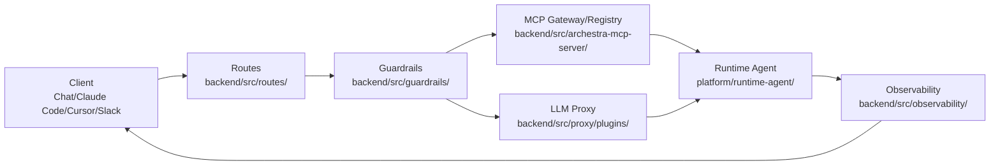
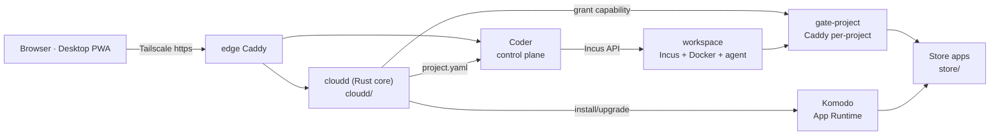
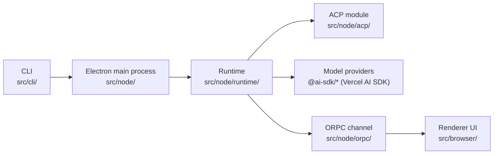

```mermaid
flowchart LR
    subgraph Phase1["Phase 1 — Broad RS (song song)"]
        CUR1["Curriculum Agent<br/>explore/charter.py"]
        ACT1["Actor Agent<br/>core/actor.py"]
        VER1["Verifier Agent<br/>core/verifier.py"]
        BAR["Wave barrier<br/>explore/phase1_wave.py"]
    end
    MEM["Memory commit/hash<br/>explore/commit.py, explore/memory_hash.py"]
    subgraph Phase2["Phase 2 — Deep RS (target)"]
        CUR2["Curriculum Agent<br/>review kinh nghiệm"]
        LOOP["Self-evolving loop<br/>core/self_evolving_loop.py"]
    end
    subgraph Phase3["Phase 3 — Test-time"]
        ACT3["Actor Agent<br/>frozen memory"]
        VER3["Verifier Agent"]
        EVAL["Sealed official evaluator<br/>benchmarks/osworld/task.py"]
    end

    CUR1 --> ACT1
    ACT1 --> VER1
    VER1 --> BAR
    BAR -->|"wave hoàn tất"| MEM
    MEM -->|"target attempt"| CUR2
    CUR2 --> LOOP
    LOOP -->|"readiness"| ACT3
    ACT3 --> VER3
    VER3 --> EVAL
```

# Weekly Agentic AI Scan — 2026-09-17

**Nguồn:** GitHub search (`created:`/`pushed:` trong 7 ngày qua, `stars` threshold theo protocol) + đọc trực tiếp README, cây thư mục, và file kiến trúc/manifest của từng repo qua GitHub web UI và `raw.githubusercontent.com`. Không dùng `gh` CLI hay GitHub API có auth trong phiên này — mọi dữ liệu lấy từ trang public không cần đăng nhập, nên một số chi tiết sâu trong code (ví dụ format message nội bộ) không verify được và được đánh dấu rõ "không xác định từ code".

## Executive summary

- Tuần này nổi bật nhất là **RSIAgent** (AetherLabsAI) — framework 3-agent (Curriculum/Actor/Verifier) cho recursive self-improvement *không cần fine-tune*, có paper arXiv đi kèm và #6 HF Daily Papers; đây là repo có bằng chứng kiến trúc rõ ràng và chi tiết nhất trong đợt quét.
- **Archestra** minh hoạ xu hướng "agent-as-gateway": thay vì nhồi logic vào agent loop, toàn bộ guardrail/routing/cost-control/MCP registry được đẩy ra control-plane (backend Fastify+Drizzle), agent runtime chỉ còn là một vòng lặp hội thoại tối giản chạy trong sandbox K8s.
- **AgentVerse-OS** và **Xum** đại diện cho lớp "hạ tầng cho agent" hơn là bản thân agent: một cái là OS cá nhân cấp capability cho agent chạy bên trong (không điều phối reasoning), một cái là multiplexer desktop chạy nhiều agent-session song song qua chuẩn liên-vendor Agent Client Protocol (ACP).

## Mục lục

1. [RSIAgent — AetherLabsAI](#1-rsiagent--aetherlabsai)
2. [Archestra — archestra-ai](#2-archestra--archestra-ai)
3. [AgentVerse-OS — agentverse-os](#3-agentverse-os--agentverse-os)
4. [Xum — coder](#4-xum--coder)

---

## 1. RSIAgent — AetherLabsAI

[github.com/AetherLabsAI/RSIAgent](https://github.com/AetherLabsAI/RSIAgent) · [arXiv:2609.15364](https://arxiv.org/abs/2609.15364)

### §1 — Quick context

**Pitch:** Framework 3-agent giúp AI tự cải thiện kỹ năng qua khám phá đệ quy, không cần huấn luyện lại trọng số.

**Tech stack:** Python 3.12, `uv` package manager, Docker/QEMU + `/dev/kvm` cho VM guest (OSWorld-V2, Agents' Last Exam), OpenRouter cho LLM client, `pytest` cho test.

**Repo health:** 276★ / 29 forks, tạo ngày 2026-09-13 (4 ngày trước khi quét), push gần nhất 2026-09-16, 37 commit, 2 issue mở. Có `tests/` + `pytest.ini`, CI qua `.github/workflows/`, docs đầy đủ (`docs/ARCHITECTURE.md`, `docs/OPERATIONS.md`, `docs/PAPER.md`). Đi kèm paper arXiv, #6 Hugging Face Daily Papers (15/09/2026).

### §2 — Architecture deep-dive

**A. Component inventory**

- `Actor Agent` (`core/actor.py`) — thực thi guest qua chương trình Python/Bash thực thi được, đọc memory bền vững, tự distill kinh nghiệm sau khi được verify.
- `Verifier Agent` (`core/verifier.py`, `core/verifier_runtime.py`) — kiểm tra bằng chứng ứng viên độc lập trên guest đã rollback, **không đọc được reasoning/memory riêng của Actor**; trả PASS/FAIL/unresolved.
- `Curriculum Agent` (`explore/charter.py`, `explore/practice_loop.py`) — chọn nhiệm vụ luyện tập tiếp theo dựa trên tiến độ đã học; không chấm điểm, không ghi memory của Actor.
- `Self-evolving loop` (`core/self_evolving_loop.py`) — vòng lặp lõi điều phối 3 vai trò qua các phase.
- `Memory commit/hash` (`explore/commit.py`, `explore/memory_hash.py`) — ghi kinh nghiệm đã verify vào bộ nhớ bền vững, hash để đảm bảo toàn vẹn/rollback.
- `Wave barrier` (`explore/phase1_wave.py`) — hàng rào đồng bộ: mọi nhánh song song trong một wave phải verify xong trước khi commit tuần tự.
- `Recovery modules` (`explore/phase1_boundary_recovery.py`, `explore/phase2_recovery.py`, `explore/practice_memory_recovery.py`…) — khôi phục trạng thái sau lỗi hạ tầng (không phải lỗi logic).
- `Pipeline/orchestrator` (`benchmarks/osworld/pipeline.py`) — validate protocol và điều phối 3 phase cho từng benchmark.
- `Guest transport/isolation` (`env/`) — giao tiếp và cô lập máy khách (Docker/QEMU).
- `LLM client` (`llm/`) — model transport tới OpenRouter.
- `Observation/eyes` (`core/eyes.py`, `core/imagery.py`) — thu quan sát hình ảnh từ guest cho Actor.
- `Trace` (`core/trace.py`) — ghi vết chạy.

**B. Control flow — pattern nào?**

Đây là **state machine 3-phase** (không phải ReAct loop đơn lẻ hay hierarchical supervisor cổ điển): mỗi phase có barrier/điều kiện dừng riêng, kết hợp planner-executor (Curriculum chọn, Actor thực thi) với một verifier tách biệt hoàn toàn khỏi ngữ cảnh riêng tư của executor.

Happy path (Phase 1 → Phase 3):

1. Curriculum Agent chọn một "wave" nhiệm vụ luyện tập, xuất phát từ cùng một snapshot memory trước-wave.
2. Actor Agent thực thi từng nhánh song song trên guest qua code Python/Bash, thu quan sát qua `core/eyes.py`.
3. Verifier Agent chấm PASS/FAIL trên guest đã rollback, với artifact riêng tư của Actor bị ẩn.
4. Toàn wave verify xong → Actor Agent distill kinh nghiệm và commit tuần tự vào memory (`explore/commit.py`); wave sau chỉ bắt đầu khi các commit này bền vững.
5. Phase 2: thử target thật; Curriculum Agent review kinh nghiệm học được kể cả sau khi PASS, có thể yêu cầu luyện thêm trước khi công nhận "sẵn sàng".
6. Phase 3: memory đóng băng, Curriculum Agent và việc học bị tắt; Actor+Verifier chạy lại đúng framework, rồi evaluator chính thức (sealed) chấm — kết quả không được quay lại vòng học.

**C. State & data flow**

- Định dạng message giữa các agent: **không xác định từ code/docs đã đọc** (không có schema công khai trong README/ARCHITECTURE.md).
- Lưu trạng thái: memory bền vững dưới dạng snapshot có hash (`explore/memory_hash.py`), artifact/log nằm ở `results/` trên host (README nói rõ: "audit files under `results/` stay on the host and never enter Agent prompts or memory").
- Context window management: không xác định từ evidence hiện có.

**D. Tool/capability integration**

Actor Agent tương tác với guest bằng cách **sinh chương trình Python/Bash thực thi trực tiếp** (code-execution style), không phải JSON function-calling. Cô lập qua `env/` (Docker/QEMU, cần `/dev/kvm`); Verifier Agent hoạt động trên bản sao guest đã rollback trước khi Actor tiếp tục — đây là cơ chế sandbox/validation tường minh, không phải suy luận.

**E. Memory architecture**

- Short-term: lịch sử tương tác và môi trường task reset giữa các attempt độc lập.
- Long-term: memory tích luỹ xuyên suốt các wave/phase, đóng băng ở Phase 3.
- Consolidation: Actor Agent "distills its experience and reconciles it with existing memory" — có bước hợp giải (reconcile) tường minh, nhưng cơ chế cụ thể (merge rule, conflict resolution) không xác định từ code đã đọc.
- Retrieval: không xác định từ evidence (không thấy vector/keyword store trong cây thư mục `explore/`, `core/`).

**F. Model orchestration**

Không có phân vai model lớn/nhỏ theo role — tài liệu nhấn mạnh **frozen model parameters** xuyên suốt cả 3 agent và cả downstream execution; model do người dùng cấu hình một lần qua `OPENROUTER_API_KEY`. Song song hoá ở cấp wave (Phase 1, nhiều nhánh cùng lúc từ chung memory snapshot), commit thì tuần tự; batch entrypoint có `--concurrency`.

**G. Observability & eval**

`core/trace.py` ghi vết chạy; `benchmarks/osworld/task.py` lưu config hash, task-release identity, memory hash, terminal status cho từng lần chạy — thiết kế hướng tới **reproducibility** hơn là dashboard thời gian thực. Không thấy OpenTelemetry/Langfuse — có vẻ dùng logging/tracing tự viết. Có cơ chế replay: `tools/smoke_osworld.py` chạy "transport, immutable memory, candidate replay, Verifier isolation, checkpoint rollback" bằng file giả lập, không cần gọi model hay grader thật.

**H. Extension points**

Thêm benchmark mới cần viết adapter riêng dưới `benchmarks/<tên>/` theo khuôn mẫu `osworld/` (single-process) hoặc `ale/` (tách outer process provisioning/grading và worker process learning runtime); role profile và đường dẫn runtime cấu hình qua `config/`.

### §3 — Architecture diagram

### §4 — Verdict

**Điểm novel:** tách Verifier khỏi private reasoning/memory của Actor để hạn chế tự-đánh-giá thiên vị; memory được đối xử như artifact có hash/version giống code (rollback được); chiến lược "broad-then-deep" là một explore→exploit tường minh cho tích luỹ kỹ năng dài hạn mà không cần train lại trọng số — đúng kiểu long-horizon curriculum learning cho computer-use agent.

**Red flags:** phụ thuộc hạ tầng rất nặng (VM/KVM, 167GB+ dataset cho ALE); không có schema message công khai giữa các agent; không có observability chuẩn ngành (OTel) — chỉ có trace tự chế.

**Open questions cần đào sâu:** cơ chế "reconcile" kinh nghiệm mới với memory cũ khi có mâu thuẫn hoạt động thế nào; hash-based memory có audit trail chống "kinh nghiệm sai lan truyền" giữa các wave hay không.

---

## 2. Archestra — archestra-ai

[github.com/archestra-ai/archestra](https://github.com/archestra-ai/archestra)

### §1 — Quick context

**Pitch:** Nền tảng AI doanh nghiệp mã nguồn mở với LLM/MCP gateway, guardrail, và agent runtime tích hợp sẵn.

**Tech stack:** TypeScript/Node (Fastify + Drizzle ORM, pnpm + Turborepo monorepo), Rust (`archestra-rs`), Docker/Kubernetes (Helm chart + K8s operator), OpenTelemetry + Prometheus.

**Repo health:** 4.3k★ / 1.2k forks, 6.209 commit trên `main`, CI Actions + Issues/PR đang hoạt động (21 issue, 24 PR mở tại thời điểm quét), dual-license AGPL-3.0/Enterprise, $13.5M funding, 3 khách hàng Fortune-50, vừa gia nhập CNCF/Linux Foundation.

### §2 — Architecture deep-dive

**A. Component inventory**

- `Routes` (`platform/backend/src/routes/`) — Fastify handler, validate Zod, gọi service, serialize response; không chứa business logic (nêu rõ trong `platform/backend/architecture.md`).
- `Services` (`platform/backend/src/services/`) — business logic, orchestration nhiều model, transaction.
- `Models` (`platform/backend/src/models/`) — chỉ truy cập DB (Drizzle), một file/bảng.
- `Guardrails` (`platform/backend/src/guardrails/`) — engine Dual-LLM và Lethal-Trifecta protection.
- `MCP server/gateway` (`platform/backend/src/archestra-mcp-server/`) — registry + gateway MCP với OAuth On-Behalf-Of.
- `LLM proxy` (`platform/backend/src/proxy/plugins/`) — gateway đa nhà cung cấp LLM (cost limit, virtual API key, model routing).
- `Agents module` (`platform/backend/src/agents/`) — định nghĩa agent phía backend.
- `Runtime Agent` (`platform/runtime-agent/`) — "vòng lặp agent chạy trong một Agent Runtime deployment", tối giản có chủ đích: model/tool/policy/budget đều do LLM proxy + MCP gateway của platform quản lý, bản thân nó chỉ giữ conversation state và thực thi lệnh trong workspace cô lập.
- `Sandbox runtime` (`platform/backend/src/sandbox-runtime/`, `platform/sandbox_base/`) — môi trường thực thi code cô lập.
- `Skills / skills-sandbox` (`platform/backend/src/skills/`, `platform/backend/src/skills-sandbox/`) — skill tái sử dụng chạy sandbox riêng.
- `Knowledge base` (`platform/backend/src/knowledge-base/`) — kết nối RAG tới hệ thống hiện có.
- `Observability` (`platform/backend/src/observability/`) — OpenTelemetry/Prometheus.
- `Task queue` (`platform/backend/src/task-queue/`) — xử lý tác vụ bất đồng bộ.
- `Auth/Secrets manager` (`platform/backend/src/auth/`, `platform/backend/src/secrets-manager/`) — SSO/RBAC, quản lý credential.

**B. Control flow — pattern nào?**

Kiểu **gateway + delegated runtime** (control-plane/data-plane tách biệt), gần với mô hình "service-mesh cho agent" hơn là ReAct/planner-executor trong một process: mọi policy/routing/guardrail nằm ở backend trung tâm, còn agent thực thi (Runtime Agent) là một service riêng, cố tình tối giản.

Happy path (suy từ README tính năng + cấu trúc thư mục backend/runtime-agent — mức độ chắc chắn trung bình vì không đọc trực tiếp logic điều phối):

1. Client (chat nội bộ, Claude Code/Codex/Cursor, Slack/Teams/email) gọi vào một URL của Archestra.
2. Request qua `routes/` → middleware auth/RBAC → `services/`.
3. `guardrails/` kiểm tra chính sách (Dual-LLM verification, Lethal-Trifecta) trước khi cho phép hành động có side-effect.
4. `proxy/plugins/` (LLM gateway) chọn provider/model theo cost limit và policy, forward request.
5. `archestra-mcp-server/` cấp quyền OAuth on-behalf-of cho tool call MCP, để tool chạy dưới danh nghĩa user thật.
6. Nếu là tác vụ agent, `platform/runtime-agent/` chạy vòng lặp hội thoại trong sandbox K8s riêng, có thể nhận chỉ đạo con người ở ranh giới lượt hội thoại mà không làm gián đoạn tác vụ đang chạy.
7. `observability/` ghi trace (OTel) và cost, trả kết quả về client.

**C. State & data flow**

Backend theo rule tường minh trong `platform/backend/architecture.md`: `routes → services → models → database` (Postgres qua Drizzle, thấy volume `archestra-postgres-data` trong Docker quickstart). Nguyên tắc: model không gọi model khác (trừ join), model không gọi service, import chỉ một chiều. Định dạng message cụ thể giữa Runtime Agent và backend: không xác định từ evidence đã đọc.

**D. Tool/capability integration**

Cơ chế chính là **MCP gateway native** (không phải tự parse JSON): registry MCP riêng cho tool nội bộ (`archestra-mcp-server/`), OAuth On-Behalf-Of để tool chạy dưới quyền người dùng thật thay vì service account dùng chung. Thực thi code qua `sandbox-runtime/`/`sandbox_base/`, tách biệt theo môi trường (`environments`, mỗi env có egress policy và cost limit riêng).

**E. Memory architecture**

Không xác định chi tiết retrieval (vector/keyword/hybrid) từ evidence công khai — chỉ biết có `knowledge-base/` nối RAG qua connector tới hệ thống hiện có của khách hàng.

**F. Model orchestration**

LLM proxy hỗ trợ đa nhà cung cấp (Anthropic, OpenAI, Azure, Bedrock, DeepSeek…) với "dynamic model routing" theo client credentials, không phải phân vai model lớn/nhỏ theo role như planner/executor — orchestration nằm ở tầng gateway/control-plane, tách khỏi logic agent.

**G. Observability & eval**

"OpenTelemetry traces, Prometheus metrics, logs, per-team cost tracking" được README mô tả là "first-class, not bolted on", có module riêng `observability/` trong backend — đây là repo duy nhất trong đợt quét có module observability chuẩn ngành (OTel) làm thư mục riêng biệt thay vì tự chế.

**H. Extension points**

Private MCP registry để team tự đăng ký tool; Kubernetes operator cho MCP orchestrator + self-serve environment promotion; Mini app builder; Terraform provider (`archestra-ai/terraform-provider-archestra`) cho hạ tầng-as-code.

### §3 — Architecture diagram

### §4 — Verdict

**Điểm novel:** đẩy toàn bộ guardrail/routing/cost-control/MCP registry ra control-plane, khiến Runtime Agent chỉ còn là "vòng lặp hội thoại ngu" chạy sandbox — thiết kế giống service mesh áp cho agent hơn là một agent framework cổ điển tự ôm hết logic; observability OTel/Prometheus là first-class thay vì bolted-on, hiếm thấy ở các repo agent framework mới nổi.

**Red flags:** README gần như thuần feature-list marketing, chi tiết kỹ thuật thật sự nằm ở docs ngoài repo (archestra.ai/docs) nên nhiều mô tả ở §2.B là suy luận từ tên thư mục/README tính năng, không phải đọc trực tiếp logic; dual-license AGPL/Enterprise nghĩa là một phần lõi (ví dụ guardrail nâng cao) có thể nằm sau license thương mại.

**Open questions:** cơ chế Dual-LLM/Lethal-Trifecta guardrail hoạt động cụ thể ra sao ở mức code; ranh giới rõ ràng giữa phần AGPL mở và phần Enterprise-only.

---

## 3. AgentVerse-OS — agentverse-os

[github.com/agentverse-os/AgentVerse-OS](https://github.com/agentverse-os/AgentVerse-OS)

### §1 — Quick context

**Pitch:** Hệ điều hành cloud cá nhân cho developer và AI agent của họ, chạy trên một server duy nhất.

**Tech stack:** Rust (axum, rusqlite, bollard) cho core `cloudd`; Svelte 5 + Vite cho desktop UI; hạ tầng dựa trên phần mềm có sẵn: Coder, Incus, Komodo, Caddy, Tailscale, ZFS.

**Repo health:** 691★ / 19 forks, trạng thái "alpha 0.2", Apache-2.0. Có 40+ unit test Rust (`cargo test`), e2e test shell + Playwright (`desktop/e2e/`), CI badge. README tự nhận "sống trên một test box duy nhất, chưa có user account/permission".

### §2 — Architecture deep-dive

**A. Component inventory** (README liệt kê rõ "core nhỏ: bảy entity — project, workspace, gate, app, capability, grant, route — và bốn contract"):

- `cloudd` (`cloudd/`, Rust) — core: API 60 route (`/api/*`, OpenAPI tại `/api/openapi.json`), CLI, Desktop nhúng; quản lý project/app/capability/backup/update.
- `edge Caddy` — TLS entrypoint, định tuyến `:443` Desktop, `:8444` Coder, `:8450+` apps.
- `gate-<project>` (Caddy per-project) — "cửa duy nhất" vào workspace của từng project.
- `workspace` (Incus container, Docker bên trong) — chứa VS Code, Claude Code, Codex.
- `Coder` — control plane quản lý vòng đời workspace, gọi qua Incus API.
- `Komodo` (App Runtime) — deploy compose stack cho app trong Store.
- `Store apps` (`store/`, 944 manifest) — mỗi app một network riêng (Garage `storage.s3`, LLM gateway `llm`, ntfy `notify`, Gitea/n8n/Nextcloud…).
- `Desktop` (`desktop/`, Svelte 5) — UI windows/widgets/Store/Files/Passwords/Settings.

**B. Control flow — pattern nào?**

**Không phải agent-reasoning loop** mà là **infrastructure/capability broker theo kiểu API-driven service orchestration**: AgentVerse-OS điều phối hạ tầng (network, container, DNS) chứ không điều phối suy luận của agent — Claude Code/Codex chạy độc lập bên trong workspace bằng subscription riêng của người dùng.

Happy path:

1. Trình duyệt kết nối qua Tailscale MagicDNS tới edge Caddy.
2. Edge định tuyến: `/` → `cloudd` (Desktop + API), phần còn lại → Coder hoặc app cụ thể.
3. `cloudd` ghi `project.yaml`, gọi Coder qua Incus API để tạo/khởi động workspace (Incus container chứa Docker).
4. Khi project khai báo cần capability (ví dụ `storage.s3`, `llm`), `cloudd` "grant" quyền: nối gate của project sang network của app cung cấp capability đó và inject biến môi trường — workspace gọi `http://storage.s3.gate` mà không cần biết địa chỉ thật.
5. Cài thêm app mới: `cloudd` gọi Komodo deploy compose stack của app vào network riêng của nó.
6. Agent AI (Claude Code/Codex) chạy trong workspace như một chương trình bình thường, dùng subscription cá nhân; OS không "thấy" hay điều khiển vòng lặp reasoning của agent.

**C. State & data flow**

`cloudd` dùng `rusqlite` (SQLite) làm state store cho 7 entity cốt lõi. "Capability" là hợp đồng (contract) giữa project và provider thay vì địa chỉ cứng — đây là điểm thiết kế trung tâm của repo. Context window management: không áp dụng (không phải LLM orchestrator).

**D. Tool/capability integration**

Mô hình **"capability thay vì địa chỉ"**: project khai báo nhu cầu (`storage.s3`, `llm`, `notify`), core tự động nối gate của project vào network của provider tương ứng và bơm biến môi trường vào workspace; đổi provider (ví dụ đổi Garage sang S3 khác) không cần sửa gì ở project. Đây là dependency-injection ở tầng hạ tầng mạng, khác hẳn tool-calling của LLM.

**E. Memory architecture** — không có (đây không phải agent framework có bộ nhớ hội thoại); bỏ qua theo hướng dẫn.

**F. Model orchestration** — không xác định: agent AI bên trong workspace dùng subscription/model riêng của người dùng, OS không chọn hay định tuyến model.

**G. Observability & eval**

Không thấy OTel/Prometheus. Có test suite Rust (`cargo test`, 40 unit test: "contracts, gate và edge rendering, storage, updates"), shell test cho installer chạy với tailscale shim (không cần sudo), và e2e test trên test box thật (`sudo tests/e2e-stand.sh`) chống lại Incus/Docker/Coder/Komodo sống.

**H. Extension points**

Thêm app mới = thêm `manifest.yaml` + `compose.yaml` vào `store/`; capability provider mới cắm vào bằng cách khai báo capability tương ứng và để `cloudd` cấp grant.

### §3 — Architecture diagram

### §4 — Verdict

**Điểm novel:** mô hình "capability thay vì địa chỉ" cho phép hoán đổi provider hạ tầng (S3, LLM gateway) mà project hoàn toàn không biết — giống service-discovery/service-mesh đơn giản hoá cho một người dùng cá nhân; core chỉ 7 entity/4 contract, còn lại toàn bộ là phần mềm proven sẵn có (Coder, Incus, Komodo, Caddy, Tailscale) lắp ghép lại thay vì viết mới — thiết kế tối giản, dễ audit.

**Red flags:** alpha, chỉ chạy được kiểm chứng trên một test box duy nhất, chưa có multi-user/permission; OS hoàn toàn không quan sát được reasoning của agent bên trong workspace (không phải "agent framework" theo nghĩa đầy đủ của protocol).

**Open questions:** việc "grant capability" có audit log/versioning không; điều gì xảy ra nếu `cloudd` crash giữa lúc đang cấp grant — workspace có bị treo ở trạng thái nửa vời không.

---

## 4. Xum — coder

[github.com/coder/xum](https://github.com/coder/xum) (đổi tên từ "Mux")

### §1 — Quick context

**Pitch:** Ứng dụng desktop multiplex nhiều coding agent chạy song song trong workspace cô lập.

**Tech stack:** TypeScript, Electron + React 18, Bun runtime, Vercel AI SDK (`@ai-sdk/*` — Anthropic/OpenAI/Bedrock/DeepSeek/xAI/Google...), Agent Client Protocol SDK (`@agentclientprotocol/sdk`).

**Repo health:** 2k★ / 135 forks, 3.827 commit, AGPL-3.0, CI Actions + Jest (unit/integration), Playwright (e2e), Storybook (UI test). Dự án của Coder (công ty đứng sau nền tảng Coder workspace), tài liệu chi tiết nằm ở site ngoài repo (mux.coder.com).

### §2 — Architecture deep-dive

**A. Component inventory**

- `CLI` (`src/cli/`) — entrypoint (`dist/cli/index.js`), binary `xum`/`mux`.
- `Electron main process` (`src/node/`) — backend chạy trên máy người dùng.
- `Runtime` (`src/node/runtime/`) — engine thực thi lõi (tên thư mục, chưa đọc sâu logic bên trong).
- `Workflow runtime` (`src/node/workflowRuntime/`) — quản lý/điều phối workflow.
- `ACP module` (`src/node/acp/`) — giao tiếp qua Agent Client Protocol, xác nhận bằng dependency `@agentclientprotocol/sdk` trong `package.json`.
- `Built-in agents` (`src/node/builtinAgents/`) — các agent có sẵn kèm theo app.
- `Built-in skills` (`src/node/builtinSkills/`) — capability module có sẵn.
- `Multi-project` (`src/node/multiProject/`) — quản lý nhiều project đồng thời.
- `Worktree` (`src/node/worktree/`, `src/node/git.ts`) — cô lập qua git worktree.
- `ORPC` (`src/node/orpc/`) — kênh RPC giữa main process và renderer.
- `Renderer/UI` (`src/browser/`) — React UI: trạng thái agent, git divergence, costs tab, context-management dialog.
- `Desktop shell` (`src/desktop/`) — đóng gói Electron.

**B. Control flow — pattern nào?**

**Multiplexer/handoff pattern**: không phải một agent-loop duy nhất mà nhiều phiên agent độc lập chạy song song, mỗi phiên có "custom agent loop... inspired by Claude Code" riêng (theo README), người dùng chuyển đổi/theo dõi qua UI thay vì một orchestrator trung tâm điều phối giữa các agent.

Happy path:

1. Người dùng tạo workspace mới, chọn runtime cô lập: Local (chạy ngay trong thư mục project), Worktree (git worktree local), hoặc SSH (thực thi remote).
2. `runtime`/`workflowRuntime` khởi tạo phiên agent, kết nối model qua Vercel AI SDK (chọn `sonnet-4-*`, `gpt-5-*`, `grok-*`, Ollama local, hoặc OpenRouter cho long-tail model).
3. Agent giao tiếp với editor/host qua Agent Client Protocol (`acp/`) hoặc vòng lặp nội bộ riêng, thực thi lệnh trong runtime đã chọn, có thể sinh output markdown/mermaid.
4. `orpc/` đẩy trạng thái agent (status, chi phí, git diff) theo thời gian thực từ main process sang renderer (`src/browser/`) để hiển thị trên sidebar.
5. Khi ngữ cảnh gần đầy, cơ chế "opportunistic compaction" tự nén hội thoại mà không gián đoạn agent đang chạy (nêu trong README; vị trí module cụ thể **không xác định** từ cây thư mục đã liệt kê).
6. Người dùng review qua UI git-divergence, merge worktree hoặc đồng bộ kết quả SSH.

**C. State & data flow**

Renderer ↔ main process giao tiếp qua `orpc/` (typed RPC nội bộ) — schema cụ thể không xác định từ evidence đã đọc. Quản lý ngữ cảnh: "opportunistic compaction" tự động + lệnh `/compact` thủ công (README) — chiến lược nén hội thoại theo nhu cầu, không phải RAG/vector retrieval.

**D. Tool/capability integration**

Model được gọi qua Vercel AI SDK (`@ai-sdk/*`) — function-calling native theo chuẩn từng provider. Giao tiếp agent↔host qua **Agent Client Protocol (ACP)**, một chuẩn mở liên-vendor (cùng họ với giao thức Claude Code/Gemini CLI dùng), thay vì tự chế cơ chế JSON-parsing riêng — đây là lựa chọn kiến trúc đáng chú ý vì cho phép cắm nhiều loại agent khác nhau qua một giao diện chung.

**E. Memory architecture** — không xác định rõ; không thấy module memory/vector store trong `src/node/` đã liệt kê. Chỉ có compaction lịch sử hội thoại ngắn hạn (không phải bộ nhớ dài hạn xuyên phiên).

**F. Model orchestration**

Đa model, người dùng chọn trực tiếp cho từng agent-session (không có phân vai planner/executor theo model lớn/nhỏ). Hỗ trợ cả local (Ollama) lẫn cloud multi-provider qua Vercel AI SDK; cơ chế fallback/parallel cụ thể không xác định từ evidence.

**G. Observability & eval**

"Costs tab" theo dõi token/chi phí trực tiếp trong UI — quan sát ở mức người dùng cuối, không thấy backend OpenTelemetry. Test coverage: Jest (unit + integration + coverage script), Playwright (e2e), Storybook (UI/visual test riêng cho từng component).

**H. Extension points**

`builtinAgents/` và `builtinSkills/` gợi ý điểm mở rộng agent/skill; VS Code extension riêng để nhảy vào workspace Xum từ VS Code; thêm model provider mới qua adapter `@ai-sdk/*` hoặc qua OpenRouter.

### §3 — Architecture diagram

### §4 — Verdict

**Điểm novel:** dùng Agent Client Protocol — một chuẩn liên-vendor có sẵn — để nói chuyện với agent thay vì tự chế giao thức riêng, cho phép cắm nhiều "loại" agent khác nhau qua một giao diện chung; "opportunistic compaction" là ý tưởng nén ngữ cảnh không chặn agent đang chạy, khác với `/compact` thủ công truyền thống.

**Red flags:** README gần như thuần feature-list/marketing, tài liệu kiến trúc thật sự nằm ở site ngoài repo (mux.coder.com) nên nhiều mô tả ở §2.B/C mang tính suy luận từ tên thư mục, độ tin cậy trung bình; không rõ `builtinAgents/` có dùng chung ACP hay có logic riêng.

**Open questions:** ACP được áp dụng cho toàn bộ agent hay chỉ một phần; module cụ thể triển khai "opportunistic compaction" nằm ở đâu trong `runtime/` hay `workflowRuntime/`.

---

## Self-check

- [x] Mỗi repo có link verify được (README/API trả HTTP 200 khi fetch trong phiên này: RSIAgent, Archestra, AgentVerse-OS, Xum).
- [x] Không repo nào là awesome-list hoặc tutorial dump (đã loại `youngyangyang04/llm-master` và `modelscope/ms-cookbook` khỏi danh sách ứng viên vì là tài liệu học/cookbook).
- [x] §2.A: mọi component đều kèm file path evidence thực tế.
- [x] §2.B: control flow pattern được đặt tên rõ ràng cho từng repo (state machine 3-phase / gateway + delegated runtime / infrastructure capability broker / multiplexer-handoff).
- [x] §3: cú pháp Mermaid hợp lệ (flowchart LR, node/edge đơn giản, không ký tự đặc biệt gây lỗi parse).
- [x] §3: mọi node trong diagram đều xuất hiện trong §2.A tương ứng.
- [x] §4: "điểm novel" cụ thể theo từng repo, không dùng câu chung chung kiểu "dùng LLM".
- [x] Đường dẫn file theo đúng convention `research/weekly/{YYYY-MM-DD}-agentic-scan.md`, markdown render được trên GitHub.

**Giới hạn của lần quét này:** phiên làm việc bị giới hạn quyền GitHub API có xác thực (chỉ scope tới repo `undertheseanlp/underthesea`), nên toàn bộ tìm kiếm/đọc repo ngoài được thực hiện qua các trang GitHub public không cần đăng nhập và `raw.githubusercontent.com`. Một số chi tiết sâu (message schema nội bộ, cơ chế memory retrieval cụ thể) không thể xác minh trực tiếp từ mã nguồn đầy đủ và được ghi rõ "không xác định từ code" thay vì suy đoán.
