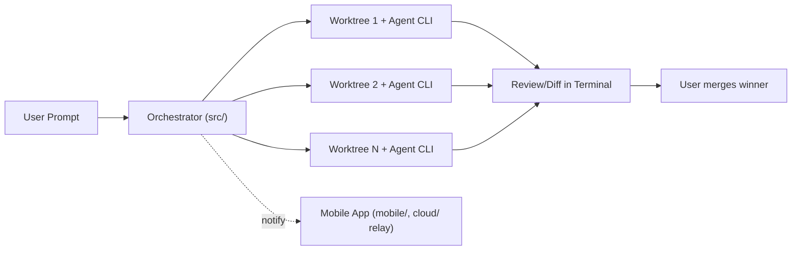
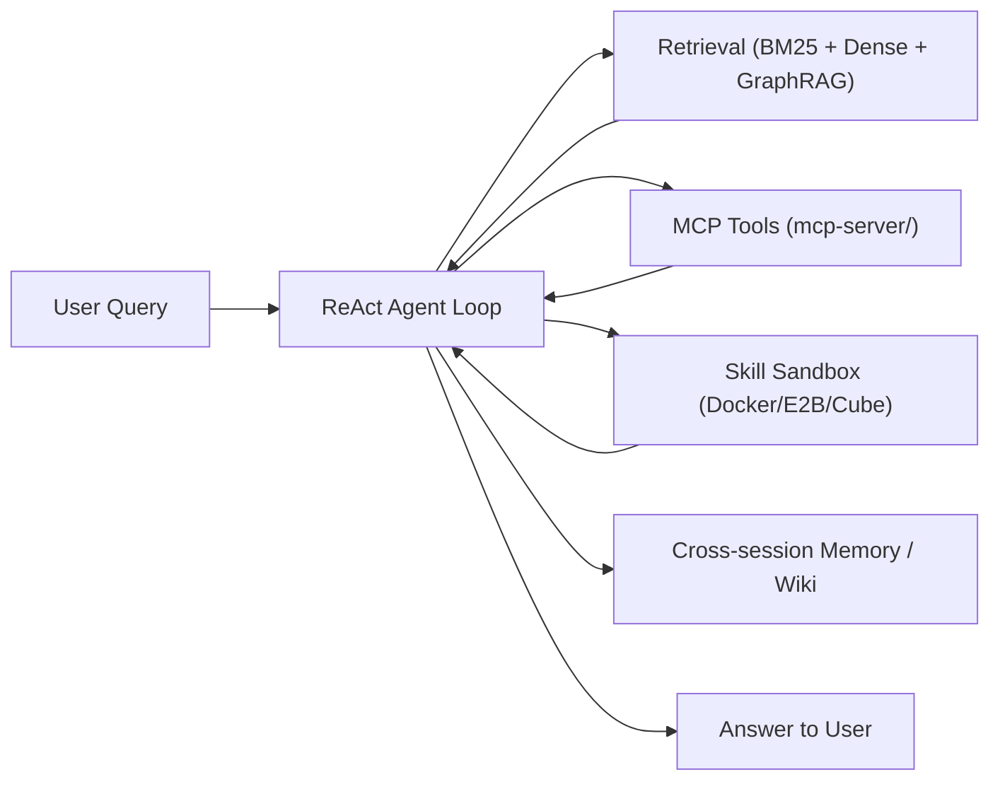
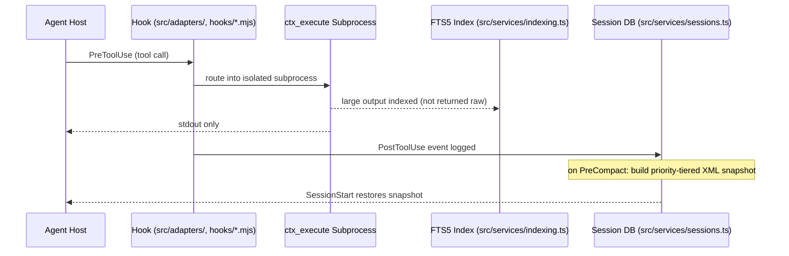
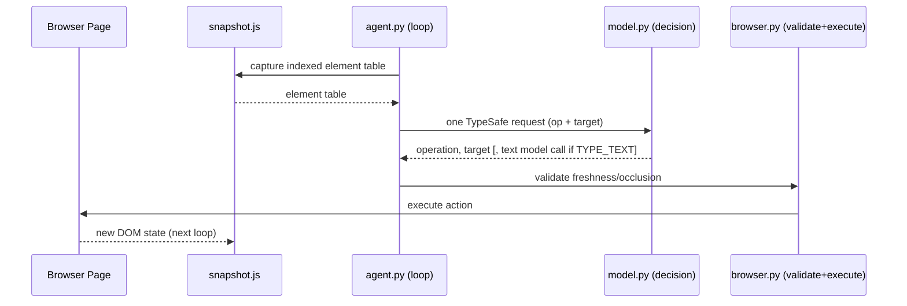

# Weekly Agentic AI Scan — 2026-09-18

**Nguồn dữ liệu:** GitHub Trending (weekly, agent/AI category) + Hacker News (Algolia API, tin đăng 11–18/09/2026) — không dùng được `gh api search/repositories` trong phiên này vì GitHub access bị giới hạn (scoped) vào repo `undertheseanlp/underthesea`, nên phải fallback sang web/HN làm nguồn discovery, sau đó verify từng repo qua README/tree thực tế trên `github.com` và `raw.githubusercontent.com`.

## Executive Summary

- Tuần này nổi bật nhất là **`browser-use/jev-ultrafast`** — kiến trúc browser agent với "single-request decision cycle" giảm số lần gọi browser protocol từ 1092 xuống 101, có bằng chứng code cụ thể (`agent.py`, `snapshot.js`, `model.py`) và eval methodology minh bạch (kể cả tự nhận hạn chế).
- **`Tencent/WeKnora`** là repo production-grade nhất: enterprise RAG + ReAct agent + skill sandbox (Docker/E2B/Cube) + Langfuse tracing — nhưng phần lớn evidence chỉ dừng ở README, chưa xác nhận được path code cụ thể cho reasoning loop.
- **`stablyai/orca`** (agent-fleet orchestration ADE) và **`mksglu/context-mode`** (context-economy engineering cho coding agent) đáng học về mặt product/infra engineering hơn là về model orchestration — cả hai đều loại `affaan-m/ECC` khỏi danh sách vì đó thực chất là bộ sưu tập skill/prompt Markdown, không có `src/` thực chất.

## Table of Contents

1. [stablyai/orca](#1-stablyaiorca)
2. [Tencent/WeKnora](#2-tencentweknora)
3. [mksglu/context-mode](#3-mksglucontext-mode)
4. [browser-use/jev-ultrafast](#4-browser-usejev-ultrafast)

---

## 1. stablyai/orca

**Repo:** https://github.com/stablyai/orca

### §1 — Quick Context

Fleet orchestrator điều khiển song song nhiều AI coding agent trong các git worktree cô lập. Stack: TypeScript/Electron (desktop) + Vite, companion app mobile (iOS/Android), workspace `cloud/` riêng (pnpm) làm relay. Repo health: theo GitHub Trending (weekly) tăng **+5,305 sao trong tuần**, tổng ~71k sao, ~4.7k fork, MIT license, có `.github/`, `tests/`, hoạt động daily-release theo mô tả README.

### §2 — Architecture Deep-Dive

**A. Component inventory**
- `Orchestrator/Client core` (`src/`) — quản lý vòng đời worktree và phiên terminal (path xác nhận từ tree repo, chưa có file cụ thể hơn).
- `Agent CLI subprocess wrapper` — Orca không tự chạy model, mà spawn CLI agent có sẵn (Claude Code, Codex, OpenCode, Devin, Grok, Copilot, ...) làm subprocess trong terminal riêng; evidence: README "any CLI agent — if it runs in a terminal, it runs in Orca."
- `Skills` (`skills/`) — agent skill implementations riêng của Orca.
- `Native bridge` (`native/`) — thành phần native code (không rõ chi tiết từ evidence có sẵn).
- `Mobile relay/Cloud` (`cloud/`, có `cloud/README.md` riêng, pnpm workspace tách biệt) — pairing app mobile với desktop host qua relay.
- `Mobile companion app` (`mobile/`) — app iOS/Android để theo dõi và gửi follow-up.

**B. Control flow — pattern nào?**
Đây không phải ReAct hay planner-executor cổ điển, mà là **fan-out song song + human-in-the-loop merge**:
1. User nhập một prompt.
2. Orchestrator tạo N git worktree cô lập từ cùng một repo.
3. Mỗi worktree spawn một agent CLI riêng (có thể khác loại agent) chạy độc lập, song song.
4. Mỗi agent chạy hoàn chỉnh vòng lặp riêng của nó (ReAct hay gì đó) — Orca không can thiệp vào bên trong.
5. User xem kết quả qua terminal/diff view, có thể nhận thông báo mobile khi agent xong.
6. User chọn "merge the winner" — không có bước tự động chọn kết quả tốt nhất.

**C. State & data flow**
- Message format giữa Orca core và agent: không xác định từ code (tương tác chủ yếu qua terminal I/O/pty, không phải structured schema).
- State storage: filesystem — mỗi worktree là một bản sao git độc lập, đó chính là cơ chế lưu trạng thái chính; không xác định có DB nội bộ khác không.
- Context window management: không xác định từ code — đây là trách nhiệm của từng agent CLI được nhúng vào, không phải của Orca.

**D. Tool/capability integration**
- Không có cơ chế tool-calling nội bộ; "tool" ở đây chính là agent CLI đã được cài sẵn trên máy.
- CLI scripting layer cho phép tự động hoá worktree: `orca worktree create`, `snapshot`, `click`, `fill` (README).
- Sandbox/validation: không xác định từ code — không có mô tả cách ly quyền hạn giữa các agent chạy song song có quyền ghi vào cùng repo gốc.

**E. Memory architecture**
Không có evidence về short-term/long-term memory riêng của Orca — bộ nhớ nằm hoàn toàn bên trong từng agent CLI được nhúng.

**F. Model orchestration**
Không có model routing nội bộ — Orca agent-agnostic theo thiết kế, user tự chọn agent nào cho worktree nào. Không có fallback/parallelism ở cấp model, chỉ có song song ở cấp process.

**G. Observability & eval**
Tính năng "monitor and steer your agents from your phone — get notified when an agent finishes" là observability cấp trạng thái (status/notification), không phải tracing kỹ thuật (không có OpenTelemetry/Langfuse). Không có eval hook nào được ghi nhận.

**H. Extension points**
`skills/` cho phép mở rộng skill riêng của Orca; `cloud/` là workspace pnpm tách biệt có thể build/deploy độc lập; CLI subcommands là bề mặt scripting chính.

### §3 — Architecture Diagram

### §4 — Verdict

**Novel/đáng học:** biến "chạy N coding agent song song trong git worktree" thành một sản phẩm hoàn chỉnh có desktop + mobile + relay, là một pattern ops/UX cho agent fleet hiếm thấy ở mã nguồn mở (đa số framework khác dừng ở library). **Red flags:** phần lõi giá trị là app Electron/mobile đã build sẵn, không phải library tái sử dụng; không tìm thấy `docs/architecture.md` hay mô tả cơ chế conflict/permission khi nhiều agent cùng có quyền ghi vào một repo. **Open questions:** cơ chế cách ly credential giữa các worktree chạy song song với quyền truy cập repo thật; có tự động ranking/eval các output fan-out hay 100% do người chọn; xử lý merge conflict giữa các nhánh agent thế nào.

---

## 2. Tencent/WeKnora

**Repo:** https://github.com/Tencent/WeKnora

### §1 — Quick Context

Nền tảng knowledge/RAG doanh nghiệp kết hợp agent ReAct tự suy luận nhiều bước. Stack: Go (backend), pgvector/Elasticsearch/Milvus/Weaviate/Qdrant (vector DB, pluggable), Docker/E2B/Cube (skill sandbox), Langfuse (tracing), Helm (K8s deploy). Repo health: theo GitHub Trending +3,982 sao/tuần, ~26.5k sao tổng, có `cli/`, `mcp-server/`, `frontend/`, `website-docs/`, nhiều README đa ngôn ngữ, CI có vẻ đầy đủ qua Helm/Docker/Makefile.

### §2 — Architecture Deep-Dive

**A. Component inventory**
- `MCP integration layer` (`mcp-server/`) — expose/consume MCP tools.
- `CLI` (`cli/`) — command-line interface.
- `Frontend` (`frontend/`) — web UI.
- `Docs site` (`website-docs/`, VitePress) — tài liệu sản phẩm.
- `ReAct reasoning agent` — mô tả rõ trong README ("ReACT progressive multi-step reasoning"), nhưng **không xác định path code cụ thể** từ evidence hiện có (không tìm được thư mục `agent/`/`internal/agent/` xác nhận).
- `Skill sandbox runtime` — hỗ trợ Docker/E2B/Cube, mô tả trong README, không xác định path cụ thể.
- `Retrieval pipeline` — BM25 + dense (pgvector HNSW) + GraphRAG + parent-child chunking, mô tả trong README, không xác định path cụ thể.

**B. Control flow — pattern nào?**
**ReAct-style** (think → act → observe), có bằng chứng trực tiếp từ README ("ReACT progressive multi-step reasoning, autonomously orchestrating knowledge retrieval, MCP tools, skill sandboxes, and web search"):
1. User đặt câu hỏi.
2. Agent suy luận bước tiếp theo cần công cụ gì (retrieval / MCP tool / skill sandbox / web search).
3. Gọi công cụ tương ứng, nhận kết quả.
4. Agent đánh giá kết quả, lặp lại bước 2 nếu chưa đủ.
5. Trả lời cuối, có thể kèm auto-extract vào long-term memory.
6. (Wiki mode) Agent tự ghi/cập nhật trang Markdown vào "self-maintaining Wiki".

**C. State & data flow**
- Message format: không xác định từ code (README không mô tả schema nội bộ giữa agent và tool).
- State storage: vector DB pluggable (pgvector 1024-dim HNSW, Elasticsearch, Milvus, Weaviate, Qdrant); memory profile/preference/fact/task/interest lưu riêng, không rõ backend cụ thể.
- Context window management: kết hợp retrieval (RAG) + memory auto-extract thay vì nhồi toàn bộ hội thoại — đây là chiến lược "retrieve + compact-write-back" (ghi lại vào Wiki/memory thay vì giữ nguyên trong context).

**D. Tool/capability integration**
- MCP tools qua `mcp-server/` — cơ chế chuẩn MCP, không phải tự chế JSON parsing.
- Skill sandbox: cài skill từ catalogue (ClawHub, SkillHub, git, zip), chạy trong Docker/E2B/Cube với `shell_exec`, file tools, artifacts, network policy per-sandbox.
- Validation/sandbox: cách ly bằng container/VM-level sandbox (Docker/E2B/Cube) thay vì chỉ prompt-level guardrail.

**E. Memory architecture**
- Short-term: trong phiên hội thoại (không rõ chi tiết).
- Long-term: cross-session memory — auto-extract profile/preference/fact/task/interest, có bước user confirm, truy xuất qua `search_memory` on-demand.
- Compaction: "self-maintaining Wiki" — agent tự viết lại tri thức thành trang Markdown, một dạng compaction ở cấp tri thức chứ không chỉ ở cấp hội thoại.
- Retrieval: hybrid — dense + BM25 (sparse) + GraphRAG + parent-child chunking, tức kết hợp cả vector, keyword và graph.

**F. Model orchestration**
Hỗ trợ 20+ LLM provider, nhưng README không mô tả rõ role-based routing (planner dùng model lớn, executor dùng model nhỏ) — **không xác định từ evidence**.

**G. Observability & eval**
Langfuse tracing cho toàn bộ ReAct loop, token usage, tool invocation, từng stage của RAG pipeline; có dashboard admin theo dõi task-queue (queue depth, concurrency per-model, failed-task retry). Đây là mức observability production-grade rõ ràng nhất trong 4 repo được review tuần này.

**H. Extension points**
Pluggable vector DB backend, MCP tool registry, skill catalogue (git/zip/marketplace), IM channel integration (WeCom, Feishu, Slack, Telegram).

### §3 — Architecture Diagram

### §4 — Verdict

**Novel/đáng học:** pattern "retrieval rồi ghi ngược lại tri thức" (agent tự cập nhật Wiki Markdown sau khi suy luận) là một vòng feedback ít thấy ở chatbot RAG thông thường, cộng với multi-backend sandbox (Docker/E2B/Cube) cho skill execution là engineering production-grade thật sự (Langfuse, RBAC, Helm). **Red flags:** phần lớn evidence dừng ở mức README — không xác nhận được path code cho ReAct loop hay memory extraction, nên rủi ro README "nói hay hơn code làm". **Open questions:** ReAct loop có giới hạn số bước/chi phí không; khi memory tự-extract mâu thuẫn với fact cũ thì xử lý conflict/versioning thế nào; Wiki tự sinh có cơ chế review trước khi publish hay không.

---

## 3. mksglu/context-mode

**Repo:** https://github.com/mksglu/context-mode

### §1 — Quick Context

MCP server sandbox hoá tool output và nén ngữ cảnh cho coding agent (tuyên bố giảm 98% dữ liệu vào context). Stack: TypeScript, SQLite (FTS5, qua `better-sqlite3`/`bun:sqlite`/`node:sqlite`), 12 runtime ngôn ngữ được sandbox. Repo health: GitHub Trending +1,482 sao/tuần, ~23.4k sao tổng, ~1.7k fork, 2,189 commit trên main, có `tests/` (vitest).

### §2 — Architecture Deep-Dive

**A. Component inventory**
- `Platform hook adapters` (`src/adapters/`) — implement hook cho từng nền tảng (Claude Code, Cursor, VS Code Copilot, ...).
- `Indexing/FTS5 service` (`src/services/indexing.ts`) — chunk + index nội dung vào SQLite FTS5, xếp hạng BM25.
- `Session continuity service` (`src/services/sessions.ts`) — quản lý event log phiên và snapshot khi compaction.
- `Hook scripts per-platform` (`hooks/*.mjs`) — enforce routing công cụ vào sandbox.
- `Config templates` (`configs/`) — file hướng dẫn routing riêng cho từng platform (CLAUDE.md, GEMINI.md, AGENTS.md...).
- `MCP tool surface` — 11 tool + 4 meta-tool (`ctx_execute`, `ctx_index`, `ctx_search`, `ctx_stats`, `ctx_doctor`...) — entrypoint cụ thể trong `src/` nhưng file chính xác không xác định từ evidence có sẵn.

**B. Control flow — pattern nào?**
**Event-driven** qua hook lifecycle (không phải ReAct hay planner-executor):
1. Agent host gọi một tool (ví dụ chạy script/shell).
2. `PreToolUse` hook chặn và route lệnh vào sandbox (`ctx_execute`) thay vì chạy trực tiếp.
3. Lệnh chạy trong subprocess cô lập (1 trong 12 runtime), chỉ stdout được trả về context; output >5KB bị lọc theo intent và được index thay vì trả nguyên văn.
4. `PostToolUse` hook ghi event vào SQLite session DB.
5. Khi context sắp bị compact, `PreCompact` đọc toàn bộ event từ SQLite, dựng snapshot XML phân tầng ưu tiên (≤2KB), lưu vào bảng `session_resume`.
6. Sau compaction/resume, `SessionStart` đọc snapshot để khôi phục trạng thái làm việc.

**C. State & data flow**
- Message format: JSON qua stdin/stdout theo wire protocol hook chuẩn (PreToolUse/PostToolUse/...), có field `additionalContext`, `updatedInput`, `permissionDecision`.
- State storage: 2 SQLite DB riêng theo project — `~/.context-mode/content/` (nội dung đã index) và `~/.context-mode/sessions/` (event log phiên).
- Context window management: kết hợp 2 chiến lược — (i) sandbox + tóm tắt: chỉ trả stdout, raw data lớn được index chứ không nhồi thẳng vào context; (ii) compaction snapshot phân tầng ưu tiên (P1: file/task/plan/rule/prompt; P2: decision/git-op/error/constraint/blocker/rejected-approach/env-change/subagent-finding) khi context bị nén.

**D. Tool/capability integration**
- Đăng ký qua chuẩn MCP (11 tool + 4 meta-tool).
- Model gọi tool qua MCP function-calling chuẩn (không phải tự parse JSON từ text).
- Sandbox: mỗi `ctx_execute` là 1 subprocess biệt lập, không chia sẻ memory/state; `ctx_execute_file` bị giới hạn trong project root, chặn path traversal/symlink escape; `ctx_fetch_and_index` chặn cloud metadata endpoint (169.254.169.254) và target nguy hiểm; redact credential pattern (`api_key`, `token`, `secret`...) trước khi lưu.

**E. Memory architecture**
- Short-term: session event log SQLite (per-project), theo dõi theo priority tier P1/P2.
- Compaction: snapshot XML ≤2KB dựng từ event log khi PreCompact, khôi phục ở SessionStart — đây chính là chiến lược summarization/compaction rõ ràng nhất trong 4 repo tuần này.
- Retrieval: hybrid — FTS5 BM25 (Porter stemming) + trigram substring match, hợp nhất bằng Reciprocal Rank Fusion (RRF), có proximity rerank và Levenshtein correction cho lỗi gõ; cache TTL 24h mặc định, tự xoá nội dung >14 ngày.

**F. Model orchestration**
Không áp dụng — đây là lớp hạ tầng chạy cạnh agent host, không tự vận hành/orchestrate model riêng.

**G. Observability & eval**
`ctx_stats` (context savings breakdown, call count, session report), `ctx_doctor` (chẩn đoán runtime/hook/FTS5/version) — observability nội bộ nhẹ, không có OpenTelemetry/Langfuse; không có eval hook độc lập/replay được ghi nhận.

**H. Extension points**
Thêm platform mới qua `src/adapters/` + `hooks/*.mjs` + template trong `configs/`; đã hỗ trợ 17+ agent host (Claude Code, Gemini CLI, Codex CLI, OpenCode, KiloCode, OpenClaw, Oh My Pi...).

### §3 — Architecture Diagram

### §4 — Verdict

**Novel/đáng học:** đây là repo có "context economics" cụ thể và verifiable nhất — sandbox subprocess-per-call + hybrid FTS5(BM25)+trigram+RRF retrieval + snapshot phân tầng ưu tiên gắn trực tiếp vào lifecycle hook PreCompact/SessionStart là một giải pháp kỹ thuật thật cho vấn đề context rot, không phải chỉ là prompt template. **Red flags:** các con số "98% reduction" và "~60% vs ~98% compliance" đều tự công bố, không kèm benchmark/methodology độc lập; chưa rõ locking model khi nhiều tool call ghi đồng thời vào cùng SQLite session DB. **Open questions:** độ trễ thực tế của việc spawn subprocess cho mỗi `ctx_execute` là bao nhiêu; khi 2 agent/tool-call ghi đồng thời vào FTS5 index có race condition không; cơ chế review nội dung bị redact có audit log không.

---

## 4. browser-use/jev-ultrafast

**Repo:** https://github.com/browser-use/jev-ultrafast

### §1 — Quick Context

Browser agent tối ưu tốc độ bằng "single-request decision cycle" trên action space có đánh index động, thay screenshot bằng DOM snapshot có cấu trúc. Stack: Python (`pyproject.toml`, `uv.lock`), JS cho snapshot (`snapshot.js`), model qua OpenRouter (`inception/mercury-2.5`, hỗ trợ Gemini/GLM/DeepSeek). Repo health: theo GitHub/HN ~2.8k sao, có `tests/`, `examples/`, `docs/`, MIT license, xuất hiện trên HN 17/09/2026 với 86 điểm.

### §2 — Architecture Deep-Dive

**A. Component inventory**
- `Agent event loop` (`agent.py`) — vòng lặp chính điều phối observe → decide → act.
- `DOM snapshot module` (`snapshot.js`) — index atomically các control hiển thị (tên, giá trị, text), giữ tham chiếu tới DOM node thật.
- `Browser controller` (`browser.py`) — quản lý kết nối, validate target (freshness, occlusion) trước khi thực thi hành động.
- `Decision model wrapper` (`model.py`) — "dynamic operation/target heads", nơi model chọn operation + target.
- `Prompt/instruction builder` (`questions.py`) — soạn instruction gửi model.

**B. Control flow — pattern nào?**
**Constrained ReAct với action space có cấu trúc** (không phải free-form think/act, mà mọi action bị ràng buộc bởi bảng element đã index):
1. `snapshot.js` chụp DOM hiện tại, tạo bảng element đánh số kèm operation khả dụng cho từng ô (`[1] button ... [2] combobox ...`).
2. `agent.py` gửi **một** request TypeSafe tới model qua `model.py`: model chọn đồng thời operation (CLICK/TYPE_TEXT/SELECT/SCROLL/WAIT/DONE/BLOCKED) và target — chỉ những target tương thích với operation mới được "mở" (speculative fan-out theo compatible head).
3. Nếu operation là `TYPE_TEXT`, một model nhỏ thứ hai được gọi riêng để sinh nội dung text cần nhập.
4. `browser.py` validate lại target (document, form value, context xung quanh) và kiểm tra freshness/occlusion trước khi thực thi thật.
5. Action được thực thi trên trình duyệt thật (không sinh selector/coordinate/JS tùy ý — đầu ra luôn là entry trong bảng index).
6. Lặp lại từ bước 1 cho tới khi operation = `DONE` hoặc `BLOCKED`.

**C. State & data flow**
- Message format: request/response TypeSafe có schema rõ ràng (không phải free-text JSON parse) giữa `agent.py` và `model.py`.
- State storage: không có state bền vững ngoài phiên — chỉ có snapshot DOM hiện tại mỗi bước (browser page chính là "state").
- Context window management: chiến lược nén bằng cấu trúc — gửi bảng element đã index (chỉ phần visible, không gửi text off-screen như footer/article ẩn) thay vì screenshot hay full DOM/HTML, giảm token và giảm cả số round-trip mạng (1 request thay vì nhiều lần dò).

**D. Tool/capability integration**
- Không dùng framework tool-calling tổng quát; action space là enum cố định, được lọc theo loại element (chỉ hiện operation hợp lệ cho từng target).
- Validation/sandbox: đầu ra không bao giờ là selector/coordinate/shell command/JS thực thi tự do — đây là hình thức sandbox "output vocabulary hẹp" giảm rủi ro injection/hành vi ngoài ý muốn, thực hiện ở `browser.py` (kiểm tra freshness + occlusion trước khi click/nhập).

**E. Memory architecture**
Không có — mỗi tác vụ là một phiên browser độc lập, không có bộ nhớ dài hạn hay giữa các phiên (bỏ qua theo hướng dẫn).

**F. Model orchestration**
Hai model theo vai trò rõ ràng: (1) model quyết định chính (TypeSafe, hiện dùng `inception/mercury-2.5` qua OpenRouter, đổi được sang Gemini/GLM/DeepSeek) chọn operation+target mỗi bước; (2) model nhỏ phụ chỉ được gọi khi cần sinh text (`TYPE_TEXT`), giảm chi phí so với việc luôn gọi một model lớn cho mọi bước.

**G. Observability & eval**
Eval methodology minh bạch và có tự phê phán — đo trực tiếp: thời gian hoàn thành tác vụ (7.073s cho task Zürich→London trên Google Flights), số lần gọi browser protocol (101 so với baseline 1092), cải thiện median 25% qua 6 lần chạy; có bước verify độc lập kết quả cuối (không tin vào tín hiệu DONE của chính agent) thay vì chỉ tự báo cáo thành công. README tự thừa nhận: "three repeats of one task on one browser profile, not a general reliability benchmark" — đây là điểm hiếm gặp và đáng khen về tính trung thực khoa học.

**H. Extension points**
`model.py` trừu tượng hoá model quyết định — cắm đổi qua OpenRouter sang Gemini/GLM/DeepSeek mà không đổi `agent.py`.

### §3 — Architecture Diagram

### §4 — Verdict

**Novel/đáng học:** gộp "chọn element nào" và "làm gì với nó" vào **một** round-trip network duy nhất qua action space đánh index động (thay vì loop 2 bước hoặc dùng screenshot+coordinate) là một tối ưu latency cụ thể, đo được, và có code path rõ ràng — mạnh nhất trong 4 repo tuần này về mặt "novel + verifiable". **Red flags:** benchmark chỉ chạy trên một họ tác vụ (flight-search dạng form-fill), 6 lần trên 1 browser profile — tự nhận không phải reliability benchmark tổng quát; chưa có test với SPA re-render mạnh, captcha, hay auth wall. **Open questions:** dynamic indexed action space xử lý thế nào khi DOM thay đổi liên tục giữa lúc snapshot và lúc action được validate (ngoài check freshness/occlusion đã nêu); độ khái quát sang tác vụ browsing mở (không phải điền form có cấu trúc rõ) tới đâu.

---

*Repo bị loại: `affaan-m/ECC` — chỉ là tập hợp Markdown skill/prompt (68 subagent, 292 skill dạng `.md`, không có `src/`/`lib/`/`core/` với application logic đáng kể), thuộc nhóm "prompt-engineering framework trá hình" bị loại theo tiêu chí relevance filter. `Panniantong/Agent-Reach` cũng được xem xét nhưng bị loại vì về bản chất là router tích hợp API/CLI đa nền tảng (primary+fallback backend), không có đóng góp kiến trúc orchestration/reasoning mới so với 4 repo đã chọn.*
