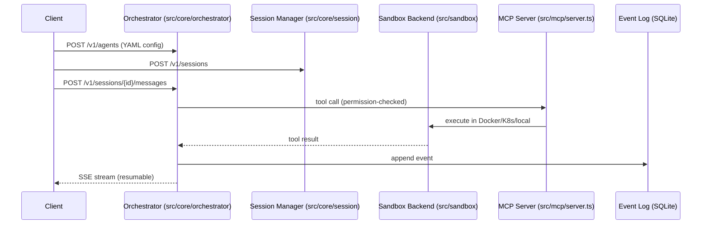
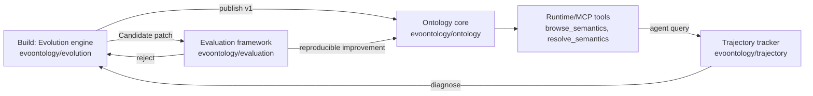
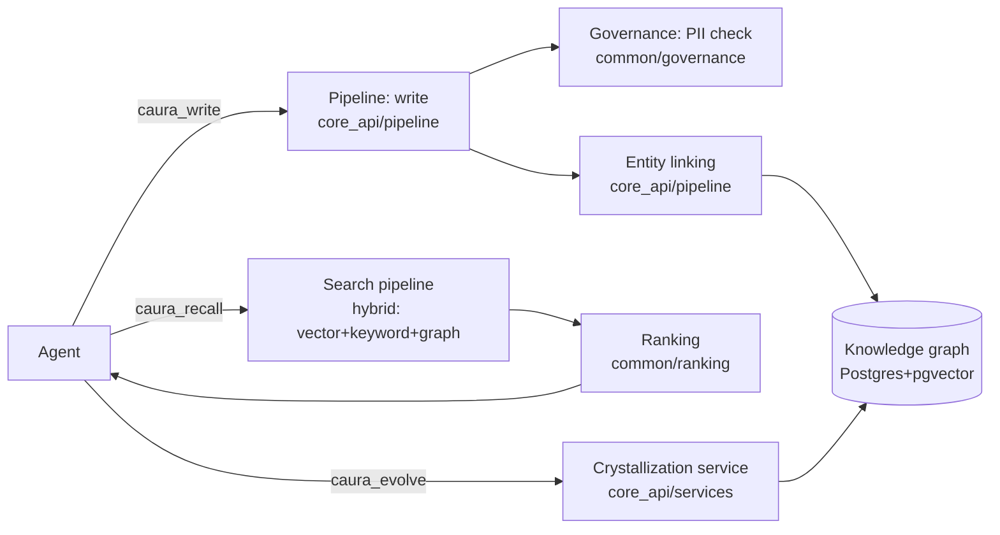
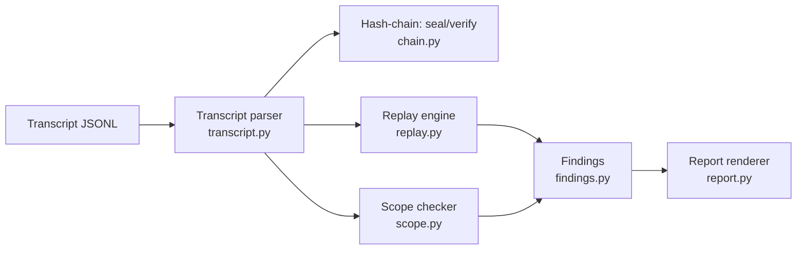

# Weekly Agentic AI Scan — 2026-09-20

**Executive summary:**
- Tuần này nổi bật là các hệ thống **memory/knowledge layer cho agent fleet** thay vì framework orchestration mới: `caura` (governed shared memory) và `EvoOntology` (self-evolving semantic layer) đều giải quyết bài toán "agent quên/không hiểu ngữ cảnh domain" bằng kiến trúc versioned, có evaluation loop rõ ràng.
- `sandbase-harness` đại diện cho xu hướng "agent runtime hạ tầng" (session, sandbox, credential, audit) tách biệt khỏi model loop — cạnh tranh trực tiếp với các managed-agent platform nhưng chạy local-first.
- `ToolReplay` là ví dụ nhỏ nhưng sạch về **production-grade observability**: audit transcript bằng hash-chain + deterministic replay, không phụ thuộc thư viện ngoài.

## Table of Contents
1. [sandbase-harness — local-first agent runtime](#1-sandbase-harness)
2. [EvoOntology — self-evolving ontology layer cho data agent](#2-evoontology)
3. [caura — governed shared memory cho agent fleet](#3-caura)
4. [ToolReplay — audit & deterministic replay cho tool-call transcript](#4-toolreplay)

---

## 1. sandbase-harness

**Repo:** [sandbaseai/sandbase-harness](https://github.com/sandbaseai/sandbase-harness)

### §1 — Quick Context
Local-first runtime chạy agent với session, sandbox, credential và audit trail riêng, không cần control plane hosted. Tech stack: TypeScript/Node.js 22+, SQLite (metadata), Docker/Kubernetes (sandbox backend), MCP stdio bridge, React (console UI), build bằng Vitest. Repo health: 647 stars, tạo 2026-07-11, push gần nhất 2026-09-20 (hoạt động hàng ngày), có `tests/` (30+ file integration/unit) và `.github` CI — repo hoạt động tích cực dù không nằm trong nhóm "mới tạo tuần này".

### §2 — Architecture Deep-dive

**A. Component inventory**
- `Orchestrator` (`src/core/orchestrator/`) — điều phối vòng đời agent/session qua các sandbox backend.
- `Agent config` (`src/core/agent/`) — định nghĩa agent bằng YAML (model, system prompt, tools, skills).
- `Session manager` (`src/core/session/`) — context hội thoại persistent, hỗ trợ resumable SSE stream.
- `Sandbox providers` (`src/sandbox/`) — local process, Docker per-session, Kubernetes (kubectl exec/cp), self-hosted worker queue.
- `MCP server` (`src/mcp/server.ts`) — expose 6 tool core qua stdio, đóng gói thành OCI image `ghcr.io/sandbaseai/sandbase-harness-mcp`.
- `Credentials vault` (`src/core/credentials/`) — lưu secret theo từng environment, cách ly key material.
- `Memory` (`src/core/memory/`) — session-scoped hoặc cross-session tùy config, không rõ cơ chế retrieval cụ thể.
- `Observability` (`src/core/observability/`) — event log đầy đủ, replay từ event stream.
- `REST API` (`src/api/server.ts`, `src/api/routes/`) — tương thích resource shape của Claude Managed Agents.
- `Console UI` (`apps/console/src/`) — dashboard React độc lập.

**B. Control flow — Event-driven session/orchestrator pattern** (không phải ReAct loop cổ điển, mà là hạ tầng bọc quanh model loop):
1. Client tạo agent qua `POST /v1/agents` với cấu hình YAML (model, tools, skills, permission policy).
2. Client mở session qua `POST /v1/sessions`, orchestrator gán sandbox backend tương ứng.
3. Client gửi message qua `POST /v1/sessions/{id}/messages`; orchestrator gọi model, tool-call được lọc qua permission policy 3 mức (`always_allow`/`always_ask`/`always_deny`).
4. Tool được thực thi trong sandbox backend đã chọn (Docker/K8s/local).
5. Toàn bộ event (quyết định, tool call, kết quả) ghi vào SQLite event log.
6. Client stream kết quả qua `GET /v1/sessions/{id}/events/stream` (SSE, resumable bằng `Last-Event-ID`).

**C. State & data flow**
- Message format: không xác định rõ schema cụ thể từ README (có vẻ JSON theo event record), nhưng metadata (agent, session, credential, memory, skill) lưu quan hệ trong SQLite.
- State storage: SQLite cho metadata, filesystem local (`.managed-agents/`) cho artifact/snapshot.
- Context window management: không xác định từ code — README chỉ nêu "Memory Strategy: session-scoped hoặc cross-session", không mô tả cơ chế summarization/sliding.

**D. Tool/capability integration**
- Đăng ký qua `agent_toolset` (built-in system tool) hoặc `mcp_toolset` (external qua MCP server name) khai báo trực tiếp trong YAML agent config.
- Gọi tool qua MCP protocol (native), không phải JSON-parsing tự chế.
- Validation: permission policy 3 mức + cách ly bằng sandbox backend (Docker/K8s) — đây là sandbox thật, không chỉ validate input.

**E. Memory architecture** — không đủ chi tiết: chỉ biết có "Memory Strategy" cấu hình được (session-scoped/cross-session), không rõ retrieval (vector/keyword/hybrid) → không xác định từ code.

**F. Model orchestration** — một vendor active/workspace (OpenAI, Anthropic, MiniMax, OpenAI-compatible) qua Settings V2; có "Loop Engine" hỗ trợ chế độ reasoning mở rộng cho DeepSeek V4. Không có bằng chứng về multi-model routing/fallback/parallelism trong cùng workspace.

**G. Observability & eval** — audit trail đầy đủ (mọi quyết định, tool call, outcome), replay bằng cách dựng lại execution từ event stream, structured log tại `.managed-agents/logs/runtime.log`, Console UI để inspect. Không thấy OpenTelemetry/Langfuse — có vẻ dùng logging tự chế.

**H. Extension points** — MCP server tùy ý (Sentry, v.v.), Skill package YAML cài từ GitHub hoặc upload trực tiếp, TypeScript SDK (`managed-agents/sdk`) để tạo session bằng code.

### §3 — Architecture Diagram

### §4 — Verdict
Điểm đáng học: tách rõ "agent runtime hạ tầng" (session/sandbox/credential/audit) khỏi model loop, và REST API cố tình tương thích resource shape của Claude Managed Agents — cho thấy chiến lược "drop-in local alternative" rõ ràng. Red flag: nhiều phần cốt lõi (memory retrieval, model fallback, tracing) không có chi tiết kỹ thuật công khai trong README, chỉ liệt kê tính năng ở mức cấu hình. Cần đào sâu: đọc trực tiếp `src/core/memory/` và `src/core/orchestrator/` để xác nhận cơ chế thật thay vì suy đoán từ docs.

---

## 2. EvoOntology

**Repo:** [ruc-datalab/EvoOntology](https://github.com/ruc-datalab/EvoOntology)

### §1 — Quick Context
Plugin cho Claude Code/Codex xây dựng "ontology layer" tự tiến hóa giúp data agent hiểu semantics thay vì suy luận lại mỗi lần. Tech stack: Python, MCP tool server, plugin marketplace cho Claude Code/Codex. Repo health: 192 stars, tạo và push đều trong ngày 2026-09-15 (rất mới), có `tests/` (15+ file) và `benchmarks/` với 3 bộ eval — nhưng chưa đủ lịch sử để đánh giá số contributor lâu dài.

### §2 — Architecture Deep-dive

**A. Component inventory**
- `Ontology core` (`evoontology/ontology/`) — semantic graph có kiểu, 4 loại node: Terms, Mappings, Constraints, Evidence.
- `Evolution engine` (`evoontology/evolution/`) — quản lý phiên tiến hóa (diagnose → patch → evaluate).
- `Runtime/MCP server` (`evoontology/runtime/`) — expose tool `browse_semantics`, `resolve_semantics`.
- `Trajectory tracker` (`evoontology/trajectory/`) — ghi lịch sử tương tác của agent với ontology.
- `Trigger` (`evoontology/trigger/`) — cơ chế kích hoạt chu trình evolve.
- `Evaluation framework` (`evoontology/evaluation/`) — so sánh cặp Candidate vs Parent.
- `Visualization` (`evoontology/visualization/`) — render sơ đồ semantic cho `/evo-visualize`.
- `Plugins` (`plugins/claude-code/`, `plugins/evoontology-codex/`) — tích hợp slash-command.
- `Benchmarks` (`benchmarks/bird/`, `benchmarks/ddr_10k/`, `benchmarks/insightbench/`) — mỗi bộ có `agent/`, `evaluate/`, `tool_server/` riêng.

**B. Control flow — State machine / versioned lifecycle** (không phải ReAct loop, mà là pipeline quản lý phiên bản ontology chạy song song với agent chính):
1. `/evo-build` (Evolution engine) trích xuất concept từ workload thực tế, verify với raw data, publish ontology v1.
2. Data agent chạy task bình thường, gọi MCP tool `browse_semantics`/`resolve_semantics` (Runtime) để lấy semantics on-demand qua session manifest gọn nhẹ.
3. Mọi tương tác được ghi lại vào Trajectory.
4. `/evo-evolve` kích hoạt Evolution engine: chẩn đoán pattern lỗi từ trajectory, đề xuất patch cục bộ (Candidate).
5. Evaluation framework chạy A/B Candidate vs Parent trên cùng điều kiện, dùng benchmark (BIRD/DDR-10K/InsightBench).
6. Nếu cải thiện tái lập được → publish Candidate thành version mới; nếu không → reject, giữ Parent.

**C. State & data flow**
- Message/tool format: MCP tool call chuẩn (function-calling native qua MCP), trả về manifest gọn + record chi tiết theo yêu cầu (`resolve_semantics`) — thiết kế "active access" để tiết kiệm context thay vì injection toàn bộ ontology.
- State storage: ontology lưu như typed semantic graph (không rõ backend cụ thể — SQL/file — README không nêu, không xác định từ code).
- Context window management: chiến lược retrieval theo nhu cầu (targeted, giống RAG cho semantic graph) thay vì sliding/summarize.

**D. Tool/capability integration**
- Đăng ký qua MCP runtime (`evoontology/runtime/`) với 2 tool chính `browse_semantics` (list manifest), `resolve_semantics` (fetch record đầy đủ).
- Mỗi benchmark có `tool_server/` MCP riêng để mô phỏng môi trường thực thi cho agent benchmark.
- Validation: không có sandbox thực thi code — đây là knowledge layer, không chạy code hộ agent.

**E. Memory architecture** — ontology chính là bộ nhớ dài hạn có version (Candidate/Parent) đóng vai trò "compaction": mỗi lần evolve chỉ patch cục bộ thay vì rebuild toàn bộ. Retrieval là graph-based structural lookup theo node/relation id, không thấy bằng chứng dùng vector embedding — không xác định từ code liệu có kết hợp semantic similarity.

**F. Model orchestration** — không tự chạy LLM riêng; dựa vào host agent (Claude Code/Codex) để thực thi. Trong `benchmarks/*/agent/` có LLM agent riêng nhưng chỉ phục vụ mục đích evaluation, không phải production path.

**G. Observability & eval** — đây là điểm mạnh nhất: `evoontology/evaluation/` triển khai paired evaluation Candidate-vs-Parent có số liệu cụ thể (DDR-Bench 69.5%→89.5%, BIRD 63.6%→72.4%, InsightBench 53.2%→54.2%). Đây là eval hook có sẵn, không phải khái niệm suông.

**H. Extension points** — cài plugin qua marketplace (không cần clone repo), thêm benchmark mới qua `benchmarks/registry.py`, mở rộng schema layer với node/relation type mới.

### §3 — Architecture Diagram

### §4 — Verdict
Điểm novel cụ thể: cơ chế "gated versioning" — Candidate chỉ được publish khi paired evaluation chứng minh cải thiện tái lập được trên benchmark thật (không phải LLM tự chấm điểm), đây là kỷ luật eval hiếm thấy ở agent tooling nhỏ. Red flag: repo mới 5 ngày tuổi, chưa rõ độ ổn định của cơ chế "diagnose behavior pattern" (thuật toán cụ thể không có trong README). Cần đào sâu: đọc `evoontology/evolution/` để xem patch được sinh ra bằng heuristic hay LLM, và cơ chế lưu trữ ontology backend thật sự (file/DB) chưa xác định.

---

## 3. caura

**Repo:** [caura-ai/caura](https://github.com/caura-ai/caura)

### §1 — Quick Context
Memory infrastructure dùng chung, có governance, cho fleet nhiều agent/nhiều tenant (đổi tên từ MemClaw). Tech stack: Python 3.12+/FastAPI, PostgreSQL 16+ + pgvector, Redis optional, multi-provider LLM (OpenAI/Gemini/Anthropic/OpenRouter), MCP server, SDK Python + TypeScript. Repo health: 527 stars, tạo 2026-04-27, push 2026-09-20 (rất active), CI/CD workflow đầy đủ, đang chạy production tại eToro (300+ agent) — dấu hiệu production-grade rõ ràng.

### §2 — Architecture Deep-dive

**A. Component inventory**
- `Core API` (`core-api/src/core_api/app.py`) — FastAPI app chính.
- `MCP server` (`core-api/src/core_api/mcp_server.py`) — expose 12 MCP tool (`caura_write`, `caura_recall`, `caura_evolve`,...).
- `Pipeline` (`core-api/src/core_api/pipeline/`) — các bước search, write, entity linking.
- `Services` (`core-api/src/core_api/services/`) — crystallization, contradiction detection.
- `Middleware` (`core-api/src/core_api/middleware/`) — rate limit, idempotency, timeout.
- `Governance` (`common/governance/`) — PII detection & compliance.
- `Ranking` (`common/ranking/`) — composite score (similarity + importance + freshness + graph boost).
- `Embedding providers` (`common/embedding/providers/`) — OpenAI/Local/Fake.
- `LLM providers` (`common/llm/providers/`) — Gemini/OpenAI/Vertex AI.
- `Events/pubsub` (`common/events/pubsub.py`) — event-driven lifecycle.
- `Clients` (`clients/python/`, `clients/typescript/`) — SDK đa ngôn ngữ.

**B. Control flow — Pipeline / event-driven service** (không phải agent orchestration — đây là backend memory phục vụ agent bên ngoài qua MCP):
1. Agent gọi `caura_write` (batch tới 100 item) → pipeline write: LLM suy ra type/title/summary/tag, governance flag PII, gán scope (`scope_agent`/`scope_team`/`scope_org`).
2. Pipeline entity-linking trích entity/relation, resolve bằng exact match → canonical name match → semantic similarity (>0.85 cosine) làm fallback, cập nhật knowledge graph.
3. Agent gọi `caura_recall` → search pipeline chạy hybrid: pgvector similarity + full-text + graph expansion (≤2 hop), rank bằng composite score (`common/ranking/`).
4. Contradiction detection service so sánh RDF triple + LLM analysis, memory bị supersede luôn xếp hạng dưới bản thay thế.
5. Agent gọi `caura_evolve` báo outcome (thành công/thất bại) — "Karpathy Loop" củng cố memory hiệu quả, tự sinh rule-memory phòng ngừa khi thất bại.
6. Service crystallization định kỳ gộp memory gần trùng thành fact chuẩn hóa (lifecycle 8 trạng thái), loại bỏ dữ liệu cũ.

**C. State & data flow**
- Message format: JSON theo tool contract MCP (batch write items có schema, memory object có type/scope/status).
- State storage: PostgreSQL + pgvector (chính), Redis (cache optional, fallback in-memory), cách ly tenant bằng row-level isolation.
- Context window management: không áp dụng kiểu sliding/summarize hội thoại — thay vào đó "crystallization" đóng vai trò nén long-term memory định kỳ.

**D. Tool/capability integration**
- 12 MCP tool native (không qua JSON-parsing giả lập): `caura_write`, `caura_recall`, `caura_manage`, `caura_list`, `caura_doc`, `caura_entity_get`, `caura_tune`, `caura_evolve`, `caura_insights`, `caura_stats`, `caura_keystones`, `caura_keystones_set`.
- Validation: governance middleware chặn PII tại thời điểm write; `caura_keystones` là rule bắt buộc "override conflicting user instructions" — cơ chế policy-as-data khá độc đáo.

**E. Memory architecture** (điểm mạnh nhất của repo):
- Không phân biệt short-term buffer — toàn bộ là long-term shared memory với scope 3 cấp (agent/team/org).
- Compaction: crystallization (LLM merge near-duplicate → canonical fact, lifecycle 8 trạng thái).
- Retrieval: hybrid rõ ràng — vector (pgvector) + keyword (full-text) + graph traversal (≤2 hop) + re-ranking theo composite score.

**F. Model orchestration** — multi-provider LLM có primary + fallback chain theo từng tenant (OpenAI/Gemini/Anthropic/OpenRouter); multi-provider embedding có local dummy embedding cho chế độ standalone không cần API key — đây là fallback chain có bằng chứng rõ trong README.

**G. Observability & eval** — audit log đầy đủ (mọi write/delete/transition kèm tenant+scope context) — provenance chain rõ ràng. Có benchmark công khai: LoCoMo 77.6%, LongMemEval 92.2%, độ trễ p50 23ms/p95 27ms, số liệu production thực (eToro: 300+ agent, 26.500+ memory). Không thấy OpenTelemetry/Langfuse cụ thể — audit log có vẻ tự xây.

**H. Extension points** — "Skill Factory" tự sinh skill tái sử dụng từ hành vi fleet (lifecycle candidate→staged→active, có approval gate); "Caura Broker" — daemon local enforce policy/redaction trước khi data rời máy; SDK Python/TypeScript cho tích hợp tùy biến.

### §3 — Architecture Diagram

### §4 — Verdict
Điểm novel cụ thể: "Karpathy Loop" (outcome-based reinforcement cho memory retrieval) kết hợp với crystallization tự động là cơ chế self-improving retrieval có căn cứ benchmark thật (LoCoMo/LongMemEval), không phải marketing suông — và đang chạy production ở quy mô 300+ agent. Red flag: README không mô tả cụ thể thuật toán crystallization (ngưỡng similarity để coi là "near-duplicate" không nêu rõ), và cơ chế `caura_keystones` "override user instructions" cần xem kỹ về ranh giới an toàn (ai có quyền set keystone). Cần đào sâu: đọc `core_api/services/` để xác nhận chi tiết crystallization và contradiction detection.

---

## 4. ToolReplay

**Repo:** [Matthew0822/ToolReplay](https://github.com/Matthew0822/ToolReplay)

### §1 — Quick Context
CLI Python không phụ thuộc thư viện ngoài, audit transcript tool-call của agent: phát hiện non-determinism, redundancy, và vi phạm scope quyền. Tech stack: Python thuần (argparse, hashlib), không dependency ngoài. Repo health: 180 stars, tạo 2026-09-14, push 2026-09-14 (rất mới, hoạt động 1 ngày), có CI (`.github/workflows/ci.yml`), test suite đầy đủ (5 file test khớp 5 module chính) — nhỏ nhưng cấu trúc chặt chẽ.

### §2 — Architecture Deep-dive

**A. Component inventory**
- `Transcript parser` (`src/toolreplay/transcript.py`) — parse JSONL nghiêm ngặt.
- `Hash-chain module` (`src/toolreplay/chain.py`) — sealing/verify bằng SHA-256 chaining.
- `Replay engine` (`src/toolreplay/replay.py`) — replay xác định, phát hiện non-determinism/redundancy.
- `Scope checker` (`src/toolreplay/scope.py`) — parse scope declaration, phát hiện overreach.
- `Findings` (`src/toolreplay/findings.py`) — định nghĩa loại finding, thứ tự xác định.
- `Report renderer` (`src/toolreplay/report.py`) — render report dạng line-oriented.
- `CLI` (`src/toolreplay/cli.py`) — argparse với 5 subcommand.

**B. Control flow — Batch/pipeline audit tool** (không phải agent runtime — đây là công cụ hậu kiểm chạy trên transcript tĩnh, không phải vòng lặp sống):
1. Agent framework khác (bên ngoài ToolReplay) sinh transcript JSONL gồm record `{index, tool, args, response}`.
2. `toolreplay seal` (chain.py) tính hash-chain SHA-256 qua từng record, genesis link bắt đầu bằng 64 ký tự hex 0.
3. `toolreplay verify` tính lại chain, xác nhận file chưa bị sửa từ lúc seal.
4. `toolreplay replay` (replay.py) duyệt transcript theo thứ tự: canonical hóa call (JSON sorted-key), gắn cờ non-determinism (cùng call, response khác ở lần lặp) và redundancy (lặp call read-only không có mutator can thiệp — 5 mutator mặc định: write_file/delete_file/create_file/move_file/run_command).
5. `toolreplay scope` (scope.py) đối chiếu mọi tool xuất hiện với danh sách `allowed_tools` khai báo (so khớp chính xác, phân biệt hoa-thường).
6. `report.py` render finding (từ `findings.py`) thành output xác định, không timestamp — cho phép diff bằng git giữa các lần chạy.

**C. State & data flow**
- Message format: JSON phẳng `{index, tool, args, response}` trong JSONL — schema chặt, không chấp nhận field lạ hay JSON lỗi.
- State storage: không có — công cụ stateless, đọc file vào, ghi report ra.
- Context window management: không áp dụng — không có LLM/hội thoại trong ToolReplay, chỉ xử lý transcript tĩnh.

**D. Tool/capability integration** — không áp dụng theo nghĩa agent gọi tool: ToolReplay không tự gọi tool nào, nó audit lại tool call đã ghi sẵn của agent khác. "Validation" = scope allow-list (case-sensitive exact match) + tính toàn vẹn hash-chain.

**E. Memory architecture** — không có, bỏ qua theo yêu cầu (đây là CLI stateless).

**F. Model orchestration** — không áp dụng: không có LLM nào chạy bên trong ToolReplay.

**G. Observability & eval** — đây chính là công cụ observability/eval cho hệ thống khác: replay xác định đóng vai trò eval hook post-hoc, độc lập framework agent nào sinh ra transcript. Tự nhận hạn chế rõ ràng trong docs: "chain chỉ chứng minh file chưa bị sửa sau khi seal, không chứng minh người seal trung thực" — một sự minh bạch hiếm thấy.

**H. Extension points** — kiến trúc module hóa theo trách nhiệm đơn lẻ (transcript/chain/replay/scope/findings/report) cho phép thêm loại finding mới hoặc mutator tùy biến, nhưng README không mô tả cơ chế plugin chính thức.

### §3 — Architecture Diagram

### §4 — Verdict
Điểm novel cụ thể: dùng hash-chain kiểu blockchain-lite (SHA-256, genesis link) để đảm bảo transcript audit không bị sửa sau khi seal — một pattern security engineering áp cho agent observability thay vì chỉ log thường. Redundancy detection dựa trên danh sách "mutator" tường minh (5 loại) thay vì đoán side-effect là thiết kế bảo thủ, đúng đắn nhưng có giới hạn: mutator ngoài danh sách mặc định (ví dụ gọi API ghi dữ liệu qua HTTP tool) sẽ không được nhận diện — README không đề cập cơ chế khai báo mutator tùy chỉnh. Cần đào sâu: xem `scope.py` có hỗ trợ wildcard/pattern nào ngoài exact match không, và liệu có roadmap tích hợp trực tiếp vào CI của các agent framework phổ biến.
