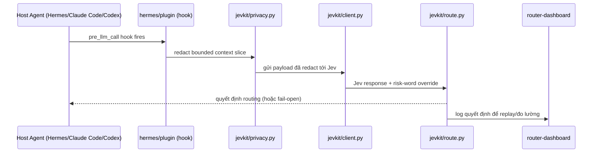
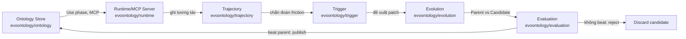
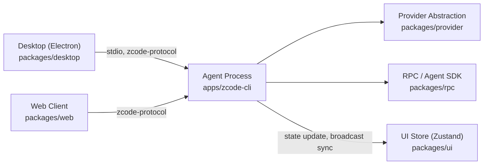

# Weekly Agentic AI Scan — 2026-09-21

**Cửa sổ quét**: repos được tạo hoặc push đáng kể trong 2026-09-14 → 2026-09-21.
**Data source**: `api.github.com/search/repositories` (query `created:>2026-09-14 stars:>200`), cross-check trực tiếp qua trang GitHub của từng repo. Query fallback `pushed:>2026-09-14 stars:>500` bị loại bỏ vì star-count trả về không đáng tin (nhiễu do pipeline fetch qua model tóm tắt), không dùng cho selection.

## Executive Summary

- Tuần này pool ứng viên hẹp (chỉ 9 repo mới đạt `stars>200` trong 7 ngày) nhưng 4 repo lọt qua filter đều có evidence architecture rõ ràng từ code thật, không phải wrapper mỏng hay awesome-list.
- Điểm chung đáng chú ý: 2/4 repo (`hermes-jev-skills`, `minecraft-agent`) dùng cùng một pattern — model lớn (planner) + model nhỏ/rẻ "Jev" (TypeSafe) làm bộ định tuyến quyết định real-time, cho thấy pattern "second-brain classifier" đang lan rộng ngoài phạm vi coding agent.
- `ruc-datalab/EvoOntology` là repo có eval methodology chặt nhất tuần này (ablation ReAct vs Ontology vs EvoOntology trên 3 benchmark thật), còn `zai-org/ZCode` là repo có kỹ thuật process/protocol engineering nghiêm túc nhất nhưng lại thiếu evidence về core agent loop.

## Mục lục

- [kerpopule/hermes-jev-skills](#kerpopulehermes-jev-skills)
- [ruc-datalab/EvoOntology](#ruc-datalabevoontology)
- [rmalde/minecraft-agent](#rmaldeminecraft-agent)
- [zai-org/ZCode](#zai-orgzcode)

---

## kerpopule/hermes-jev-skills

**Link**: https://github.com/kerpopule/hermes-jev-skills (HTTP 200, đã verify)

### §1 — Quick Context

Plugin bơm một "decision model" (Jev, của công ty TypeSafe) rẻ/nhanh vào agent host (Hermes, Claude Code, Codex) để xử lý các quyết định nhỏ — routing model, lọc memory, chọn skill — thay vì tốn frontier model.
Tech stack: Python 3.9+, không có runtime dependency ngoài stdlib; tích hợp qua public plugin seams của host (không patch internals). License MIT.
Repo health: 297 stars, 24 forks, tạo 2026-09-18, push gần nhất 2026-09-20. Có `.github/workflows`, có `tests/` (offline, fake mọi response từ Jev) và `evals/` riêng cho đo lường. Lưu ý: nội dung gần như giống hệt bị mirror dưới ít nhất 3 owner khác — có thể là template được re-upload, cần cẩn trọng về provenance.

### §2 — Architecture Deep-dive

**A. Component inventory**
- `jevkit/client.py` — HTTP client gọi Jev cloud API.
- `jevkit/route.py` — logic routing model, có "risk words" (production/delete/migration/security/payment) veto việc route sang tier rẻ.
- `jevkit/compact.py` — nén transcript bằng cách chọn nguyên văn các turn quan trọng (Turn Selection), không rewrite/summarize để tránh hallucination trong memory.
- `jevkit/skillpick.py` — chọn skill trong số các capability đã cài (đo được ~2.8s trên 377 skills).
- `jevkit/privacy.py` — lớp redaction: decode nhiều encoding (quoted-printable/base64/percent/HTML entity) trước khi lọc, strip email/phone/token/hex, cap đoạn memory ở 900 ký tự, từ chối gửi đoạn trông giống credential.
- `jevkit/replay.py` — replay lại quyết định routing trên traffic thật, phục vụ đo lường trong `evals/`.
- `hermes/plugin/` — lớp tích hợp dùng seam công khai của host (`pre_llm_call`, middleware, tools, slash commands).
- `router-dashboard/` — web UI quan sát quyết định routing.

**B. Control flow — Event-driven middleware/sidecar classifier**
Không có ReAct loop riêng — plugin "cưỡi" trên loop có sẵn của host agent và chặn tại các lifecycle point cụ thể:
1. Host agent tới điểm quyết định (trước LLM call, chọn skill…) → hook (`pre_llm_call`) fire.
2. Plugin trích một đoạn context bị giới hạn và đã redact (turn hiện tại cap 2500 ký tự, memory passage cap 900 ký tự) — không bao giờ gửi full history/tool result/file thô.
3. Payload được gửi tới Jev cloud, trả về câu trả lời có confidence trong ~0.4–2.8s tùy tác vụ.
4. Policy layer local áp override cứng (risk-words veto) trước khi chấp nhận câu trả lời của Jev.
5. Nếu lỗi (thiếu key, timeout, rate limit, reply hỏng) → "fail open": giữ nguyên model hiện tại / trả lại danh sách memory gốc / không gợi ý skill — turn của agent không bao giờ bị block.
6. Quyết định + score + fallback path được log để replay/đo lường sau qua `evals/`.

**C. State & data flow**: Không có state store chung — Jev decision là stateless theo từng call; transcript vẫn do host agent sở hữu. Context window management = compaction bằng verbatim Turn Selection (thắng recency-baseline 11/15 câu hỏi trong eval nội bộ), chủ đích tránh LLM tự bịa lại memory.

**D. Tool/capability integration**: 5 tool lộ ra cho host — `jev_memory_filter`, `jev_compact_select`, `jev_choose_action`, `jev_supervise`, `jev_escalate`. Tích hợp qua plugin/middleware seam sẵn có của host, không phải MCP, không phải JSON-parsing từ output của frontier LLM — đây là sidecar classifier được gọi bằng code.

**E. Memory**: Chỉ short-term (transcript/turn selection trong ngân sách kích thước cố định). Không có long-term/vector retrieval store.

**F. Model orchestration**: Hai tầng — LLM đắt (bất kỳ model nào host đang dùng) cho reasoning/viết, và Jev (TypeSafe "System One") cho quyết định vi mô nhanh/rẻ. Model pool cấu hình qua catalog `models.dev`, truy cập qua OpenRouter hoặc key trực tiếp.

**G. Observability & eval**: `router-dashboard/` theo dõi real-time; `evals/compaction` đo chất lượng handoff trên session thật của user. Số liệu công bố: handoff recall 75% (1 lần search) so với 37.5% (quét transcript thường); cost/quyết định (mailbox $0.00002/msg, triage $0.00006/msg). Có "shadow mode" (`/jev routing shadow`) log quyết định mà không thực thi — cơ chế rollout an toàn kiểu A/B khá trưởng thành so với quy mô repo.

**H. Extension points**: Skill mới = file `SKILL.md` mới + đăng ký hook; host agent mới tích hợp qua cùng plugin seam công khai; đổi provider chủ yếu qua OpenRouter.

### §3 — Architecture Diagram



### §4 — Verdict

Điểm đáng học: nguyên tắc "không để model rẻ tự bịa vào memory" (compaction verbatim thay vì summarize) và kỷ luật rollout đo lường (recall %, cost/decision, replay trước khi deploy) chặt hơn phần lớn agent repo cùng quy mô. Lớp redaction (decode nhiều encoding trước khi screen credential, fail-open) là guardrail pattern đáng tham khảo. Red flag: toàn bộ hệ thống phụ thuộc vào API trả phí đóng (Jev/TypeSafe) — về bản chất là vehicle tích hợp cho sản phẩm đó, không thể đánh giá độc lập chất lượng classifier; repo còn bị mirror gần như y hệt dưới ≥3 owner khác, cần cẩn trọng provenance. Câu hỏi mở: Jev thực chất là model gì / có phải chỉ là wrapper quanh một model nhỏ có sẵn — README không tiết lộ.

---

## ruc-datalab/EvoOntology

**Link**: https://github.com/ruc-datalab/EvoOntology (HTTP 200, đã verify). Lưu ý: `pyproject.toml` ghi homepage gốc là `github.com/MeiduoChong/EvoOntology` — bản ruc-datalab nhiều khả năng là mirror/fork chính thức của RUC DataLab (Renmin University of China).

### §1 — Quick Context

Một "ontology layer" tự tiến hóa, có versioning, nằm giữa LLM data agent và dữ liệu bảng/file/DB không đồng nhất — grounding quyết định của agent bằng evidence từ workload thực, rồi tự evolve từ trajectory thực thi.
Tech stack: Python ≥3.10, MCP-native, tích hợp plugin cho Claude Code marketplace và Codex; core package gần như không có runtime dependency bắt buộc. License MIT, version 1.1.0.
Repo health: 215 stars, 20 forks, tạo 2026-09-15, push gần nhất 2026-09-20. Không xác định được `.github/workflows` (404 ở path mặc định, không kết luận là hoàn toàn thiếu CI), nhưng có `tests/` với 17 file test — khá dày dặn cho một repo mới 1 tuần tuổi.

### §2 — Architecture Deep-dive

**A. Component inventory**
- `evoontology/ontology/` — semantic graph điển hình với 4 họ node (Terms, Mappings, Constraints, Evidence) nối bằng Semantic Relations/Structural References (Content Layer trong mô hình 3 lớp Content/Schema/Tool).
- `evoontology/runtime/` — MCP server, expose tool `browse_semantics`, `resolve_semantics`, dùng "compact session manifest" để lazy-load record chi tiết theo nhu cầu.
- `evoontology/trajectory/` — ghi lại tương tác agent–ontology trong phase "Use".
- `evoontology/trigger/` — chẩn đoán hành vi lặp lại từ trajectory để quyết định khi nào cần evolve.
- `evoontology/evolution/` — sinh "candidate patch" cục bộ cho ontology (không rebuild toàn bộ).
- `evoontology/evaluation/` — so sánh Parent version vs Candidate version trước khi publish.
- `evoontology/workflow.py`, `workspace.py` — điều phối lifecycle 5 phase và state của workspace/session.

**B. Control flow — State machine/versioned self-evolving artifact (không phải ReAct đơn thuần)**
Đây không phải một agent tự hành động, mà một knowledge layer được data agent query, theo lifecycle 5 phase:
1. **Build** — suy ra khái niệm ontology candidate từ workload thực, verify từng cái với dữ liệu nguồn thô (grounding, không hand-author).
2. **Use** — agent gọi `browse_semantics`/`resolve_semantics` qua MCP trong lúc chạy task thật; mọi tương tác được ghi vào trajectory log.
3. **Evolve** — `trigger` chẩn đoán friction/lỗi lặp lại trong trajectory, `evolution` đề xuất patch cục bộ nhỏ.
4. **Evaluate** — `evaluation` chạy head-to-head Parent version vs Candidate version trên benchmark adapter hoặc trajectory replay.
5. **Publish or reject** — candidate chỉ được version hóa và publish nếu vượt parent; nếu không thì bị bỏ, giữ thay đổi "inspectable, comparable, reversible".

**C. State & data flow**: Backing store thật của ontology (file JSON, SQLite…) — không xác định từ code đã đọc được (pyproject không có runtime dependency bắt buộc, gợi ý store nhẹ dạng file, nhưng chưa verify trực tiếp). Context management strategy rõ ràng nhất: "compact session manifest" — load index trước, load record chi tiết theo query, tránh front-load toàn bộ ontology vào context.

**D. Tool/capability integration**: MCP-native — `browse_semantics`/`resolve_semantics` là MCP tool (xác nhận qua README + `test_mcp_server.py`/`test_mcp_ops.py`). Ngoài ra có plugin riêng cho Claude Code (`/evo-build`, `/evo-evolve`, `/evo-visualize`) và Codex (`$build-ontology`, `$evolve-ontology`, `$explore-ontology`) — dual integration surface.

**E. Memory**: Không phải memory hội thoại truyền thống, nhưng về cấu trúc tương đương: trajectory log = episodic record, ontology store = long-term structured memory được chủ động curate (evolve + evaluate) thay vì chỉ append — đây là điểm thiết kế khác biệt nhất trong 4 repo tuần này.

**F. Model orchestration**: Dùng LLM sẵn có của host agent (Claude Code/Codex); benchmark harness optional "bird" extra phụ thuộc SDK `openai`, gợi ý eval scoring gọi endpoint kiểu OpenAI-compatible — model cụ thể không pin trong pyproject.

**G. Observability & eval**: Eval methodology chặt nhất trong 4 repo — 3 benchmark thật (BIRD, DDR-10K, InsightBench) với ablation ReAct → +Ontology → +EvoOntology:
- DDR-Bench(10-K) trajectory-wise accuracy: 69.5% → 81.8% → 89.5% (+20.0pp so với ReAct thuần).
- BIRD execution accuracy: 63.6% → 68.7% → 72.4% (+8.8pp).
- InsightBench insight score: 53.2 → 54.0 → 54.2 (+1.0pp, lift nhỏ hơn nhiều).
Ablation này cô lập được giá trị riêng của việc "evolve" so với chỉ "có ontology tĩnh".

**H. Extension points**: Benchmark mới qua interface adapter trong `benchmarks/`; host agent mới qua plugin pattern (marketplace install cho Claude Code, package install cho Codex); schema ontology tự nó có thể mở rộng (Schema Layer định nghĩa loại node/relation được phép).

### §3 — Architecture Diagram



### §4 — Verdict

Đây là kiến trúc novel nhất tuần này: một knowledge layer tự tiến hóa có versioning và gate đánh giá — khác hẳn phần lớn "agent memory" hiện nay (vector-RAG hoặc transcript summarization); gần giống "model registry" áp dụng cho semantic knowledge, với ablation ReAct/Ontology/EvoOntology là bằng chứng đo lường thuyết phục. Red flag: dự án academic một tác giả vừa được mirror sang tài khoản org đúng lúc publicize; số liệu DDR-10K/InsightBench là self-reported, chưa thấy replication độc lập; không xác định được storage backend thật hay chi phí/latency của bước "Evaluate" có thực tế cho production hay không (không có số liệu cost/latency như ở hermes-jev-skills). Câu hỏi mở: backend versioning là gì (diff kiểu git hay DB thật?); "Candidate beats Parent" được quyết định bằng ngưỡng/thống kê nào; có paper đi kèm (arXiv) hay không — không thấy link trong phần đã fetch.

---

## rmalde/minecraft-agent

**Link**: https://github.com/rmalde/minecraft-agent (HTTP 200, đã verify)

### §1 — Quick Context

Agent 2 tầng (planner lớn "Astra"/GPT-6-class + decision model nhỏ nhanh "JEV" của TypeSafe) tự chủ speedrun Minecraft Java 1.16.5 để giết Ender Dragon trong ~8m43s, chỉ dùng structured game-state, không screenshot/keystroke thô.
Tech stack: JavaScript/Node.js (ES modules), `mineflayer` + `mineflayer-pathfinder` + `prismarine-viewer`; key lấy từ Google Secret Manager runtime.
Repo health: 328 stars, 25 forks, tạo và push cùng ngày 2026-09-20 (rất mới). Không tìm thấy LICENSE, không xác nhận được `.github/workflows` hay thư mục `tests/` chuẩn (README tự nhận "29 local tests passed" nhưng đây là log tự công bố, chưa verify được là CI thật).

### §2 — Architecture Deep-dive

**A. Component inventory**
- `agent.mjs` — main orchestration loop.
- `nether-agent.mjs` — biến thể cho route qua Nether.
- `combat-lab/` — server test riêng để validate code combat (vd. bed-detonation) tách khỏi run thật.
- `native-client/` — headless Minecraft client chỉ để render/quay video, tách khỏi kết nối của bot.
- `observer/` — sensor phía Java, chỉ đọc vị trí Ender Dragon (không hành động).
- `optimization/` — logic route/pathfinding planning (thuật toán cụ thể không xác định từ code đã đọc).
- Trong `agent.mjs`: hàm `candidates()`, `planTrigger()`, `plan()`, `selectUsefulOptions()`, `decide()`, wrapper `bounded(fn, 25000)`.

**B. Control flow — Hierarchical planner-executor (2 tầng), không phải ReAct đơn**
1. Mỗi tick, `candidates()` sinh tập action khả dụng dựa trên game state hiện tại.
2. `planTrigger()` — gate rule-based (không gọi LLM) kiểm tra có cần replan không: đổi dimension, tích lũy lỗi, tới waypoint, hoặc "hết option hữu ích" từ plan hiện tại.
3. Nếu trigger (và dragon chưa chết), `plan()` gọi planner LLM (Astra/GPT-6 hoặc Sol/GPT-5.6) với state snapshot + feedback + lý do review + mô tả action khả dụng, trả về `currentPlan` (waypoint, chỉ dẫn chiến lược, item mục tiêu).
4. Dù có replan hay không, `selectUsefulOptions()` lọc candidate xuống theo plan/giai đoạn hiện tại.
5. `decide(observation, options)` gọi JEV (TypeSafe) với snapshot quan sát + option đã lọc, trả về 1 action cụ thể theo thời gian thực (đo được: 131 lần gọi JEV / 35 lần gọi Astra trong 1 run — model rẻ được gọi nhiều gấp ~4 lần).
6. Action được thực thi qua `bounded(r.selected.fn(), 25000)` — wrapper timeout 25s quanh lệnh Mineflayer thật.
7. Kết quả log vào `events.jsonl`; action lỗi vào Map `failed` có cooldown; 3 lỗi liên tiếp force-clear plan hiện tại (kích hoạt replan ở tick sau) — cơ chế self-correction/backoff cụ thể.

**C. State & data flow**: Một hàm `snapshot()` duy nhất là nguồn state chuẩn (inventory, vị trí, máu, dimension, quan sát chiến đấu/địa hình, tiến độ waypoint, lịch sử action gần đây) — dùng chung cho cả planner (thêm feedback/review-reason) và controller (như "observation"). Không có memory bền vững; `events.jsonl` chỉ là log hậu kiểm, không dùng cho quyết định runtime.

**D. Tool/capability integration**: Action là closure JS thuần (mỗi option có `.description` và `.fn()`) — dispatch ở mức code, không phải native function-calling hay MCP; JEV chỉ chọn trong bảng option đã được duyệt trước, không tự do gọi tool — lựa chọn an toàn/deterministic có chủ đích, cùng pattern với hermes-jev-skills (cùng sản phẩm JEV, áp cho game thay vì UI máy tính).

**E. Memory**: Không có, ngoài state trong-run; thư mục `research/` gợi ý lặp thủ công giữa các run chứ không phải memory tự động.

**F. Model orchestration**: Tách rõ vai trò — Astra/Sol-class = planner chiến lược (ít gọi, ~35 lần/run), JEV = bộ chọn action chiến thuật (gọi nhiều, ~131 lần/run). Truy cập qua OpenRouter; credential lấy từ Google Secret Manager, chỉ giữ in-process memory.

**G. Observability & eval**: Harness verify-run chặt nhất trong 4 repo dù thiếu test suite hình thức: `events.jsonl` ghi mọi quyết định planner/controller + kết quả; điều kiện thắng đòi hỏi bằng chứng cụ thể (event dragon chết + event exit-portal với reason code 4) thay vì tin self-report của model; checklist cố định trước khi tính là "verified" (17 run checks, 8 route/camera/screen checks, 29 local tests). Video/world-state thô được giữ làm bằng chứng (không commit vào git).

**H. Extension points**: Route mới qua biến thể kiểu `nether-agent.mjs`; action mới thêm vào `candidates()`; logic combat được thử nghiệm an toàn trong `combat-lab/` trước khi dùng ở run thật — pattern staging/sandbox thật sự.

### §3 — Architecture Diagram

```mermaid
sequenceDiagram
    participant Loop as agent.mjs (main loop)
    participant Cand as candidates()
    participant Trig as planTrigger()
    participant Plan as plan() [Astra/Sol]
    participant Sel as selectUsefulOptions()
    participant Dec as decide() [JEV]
    participant Exec as bounded(fn) executor

    Loop->>Cand: sinh action candidates
    Loop->>Trig: kiểm tra điều kiện replan
    Trig-->>Plan: nếu trigger, gọi planner LLM
    Plan-->>Loop: currentPlan (waypoint, guidance)
    Loop->>Sel: lọc candidates theo plan
    Sel->>Dec: truyền option đã lọc
    Dec-->>Exec: action được chọn
    Exec-->>Loop: kết quả log vào events.jsonl
```

### §4 — Verdict

Kiến trúc novel rõ nhất tuần này: hierarchical planner (đắt)/controller (rẻ) với gate rule-based (`planTrigger`) quyết định khi nào mới gọi model đắt — pattern này tái sử dụng được cho bất kỳ agent dài hơi nào muốn kiểm soát chi phí gọi planner LLM. Kỷ luật verification (chứng minh hoàn thành qua game event thay vì tin self-report) cũng là pattern eval đáng học cho agent nói chung. Red flag: đây là demo/dự án vui (speedrun Minecraft), không phải production software — không có LICENSE, không xác nhận CI/test suite hình thức, chỉ dùng được cho game này; 3/6 dependency dùng version "latest" — code smell về reproducibility trong khi mục tiêu chính của repo là "run đã verify". Câu hỏi mở: thuật toán route trong `optimization/` là gì (A*, hand-tuned, hay LLM-assisted) — chưa xác định; tính "verified" có ý nghĩa gì khi bản thân LLM call vốn non-deterministic — README không đề cập.

---

## zai-org/ZCode

**Link**: https://github.com/zai-org/ZCode (HTTP 200, đã verify)

### §1 — Quick Context

Coding-agent harness/IDE của Z.ai (hãng làm model GLM) — multi-surface (Desktop/Electron, Web, CLI/TUI), cạnh tranh trực tiếp Claude Code/Codex/opencode, tổ chức dạng pnpm monorepo.
Tech stack: TypeScript, Electron cho desktop, React + Zustand cho UI, kiến trúc process/RPC riêng cho agent. License Apache-2.0.
Repo health: ~3,300 stars, 848 forks, 17 watchers, tạo 2026-09-20, push 2026-09-21 (mới nhất trong 4 repo). CI/test coverage là điểm yếu nhất về evidence: không xác nhận được `.github/workflows` ở path mặc định, có `.husky/` (git hook lint/format) nhưng không tìm thấy thư mục `tests/` rõ ràng ở top level — không kết luận là thiếu hoàn toàn, chỉ là chưa verify được.

### §2 — Architecture Deep-dive

**A. Component inventory**
- `apps/zcode-cli/` — app CLI/TUI + agent runtime, có `packages/`, `scripts/`, `tools/`, `.husky/` riêng.
- `packages/desktop` — Electron Main/Host/Renderer + đóng gói desktop.
- `packages/web` — client trình duyệt.
- `packages/rpc` — framework RPC dùng chung + Agent client SDK.
- `packages/provider` — lớp trừu tượng provider (pluggable model backend).
- `packages/ui` — component React + Zustand store (`packages/ui/src/store/`), truy cập service qua abstraction `IPlatformService`.
- `packages/shared/src/zcode-protocol/index.ts` — protocol stdio strictly-typed, ranh giới giữa process Desktop và process Agent.
- `AGENTS.md` — tài liệu convention kỹ thuật ở root, mô tả hệ hook (SessionStart, UserPromptSubmit, PreToolUse, PermissionRequest, PostToolUse, PostToolUseFailure, Stop), tích hợp MCP server, plugin cho custom command/skill; config tại `~/.zcode/cli/config.json`.
- `skills-lock.json` (root) — lockfile cho skill/plugin đã cài, tương tự package-lock.

**B. Control flow — Event-driven, hook-based (cùng họ vocabulary với Claude Code: SessionStart/PreToolUse/PostToolUse/Stop)**
Mô tả sau ở mức convention (AGENTS.md), không phải đọc trực tiếp source loop (chưa fetch được file loop thật):
1. User submit prompt (từ Desktop/Web/CLI) → hook `UserPromptSubmit` fire, tất cả đổ về cùng một process Agent.
2. Hook `SessionStart` khởi tạo session state; process Agent giao tiếp với host Desktop/Web qua protocol stdio strictly-typed (`zcode-protocol`) — process Main/host chỉ xử lý window/native-ops/forward message, không chứa business logic.
3. Trước mỗi tool call, hook `PreToolUse` fire (điểm permission/validate); `PermissionRequest` có thể chặn action rủi ro.
4. Tool thực thi qua MCP server đã đăng ký hoặc qua hệ plugin/skill (theo dõi bởi `skills-lock.json`); hook `PostToolUse`/`PostToolUseFailure` fire sau đó để log/xử lý lỗi.
5. State đổ vào Zustand store tập trung trong `packages/ui/src/store/`, có "explicit broadcast synchronization" (theo tài liệu) để tránh update loop giữa nhiều UI surface cùng theo dõi 1 session.
6. Hook `Stop` fire khi kết thúc session; "CommandInbox" nhận input tuần tự (tránh race command đồng thời); model workspace identity 2 khóa (`workspaceIdentity` + `workspacePath`, cộng `remoteSessionId`) tránh lỗi path-matching khi mở nhiều workspace/remote session.

**C. State & data flow**: Protocol message strictly-typed (`zcode-protocol/index.ts`) giữa Desktop và Agent qua stdio; state UI tập trung ở Zustand với rule chống loop; có rule kiến trúc rõ ràng cấm import trực tiếp Repo→UI, Service→Runtime, cross-domain. Chiến lược quản lý context window: không xác định từ code đã đọc (AGENTS.md nói về ranh giới process/module, không nói về token/context budget).

**D. Tool/capability integration**: Tích hợp MCP server để đăng ký tool; hệ plugin cho custom command/skill, version pin qua `skills-lock.json`. Cách model thực sự gọi tool (native function-calling hay JSON-parsing) — không xác định từ code (chưa fetch được file agent-loop thật, chỉ có directory listing + tài liệu convention).

**E. Memory**: Không xác định từ code đã đọc.

**F. Model orchestration**: Có package `packages/provider` cho model backend pluggable (Provider System với cấu hình local) — khớp với việc Z.ai vừa muốn hỗ trợ GLM riêng vừa hỗ trợ model thứ ba, nhưng model mặc định cụ thể không xác định được.

**G. Observability & eval**: Không xác định từ code đã đọc — không thấy dashboard, tracing, hay eval harness (khác biệt so với 3 repo còn lại, đều có ít nhất 1 artifact đo lường/verify cụ thể).

**H. Extension points**: MCP server (đăng ký tool ngoài), hệ plugin/skill pin version qua lockfile, provider abstraction để đổi model backend, config tại `~/.zcode/cli/config.json`.

### §3 — Architecture Diagram



### §4 — Verdict

Điểm đáng học: đây là repo có process/protocol engineering nghiêm túc nhất tuần — ranh giới protocol stdio strictly-typed giữa UI và Agent process, rule kiến trúc cấm cross-domain import, model workspace-identity 2 khóa tránh lỗi path-collision khi có nhiều remote session, và CommandInbox tuần tự hóa input — đều là vấn đề distributed-systems thật mà phần lớn "agent framework" một-process không cần nghĩ tới, vì ZCode chủ đích hỗ trợ nhiều surface (desktop/web/CLI) truy cập đồng thời cùng một agent session. Red flag / giới hạn: **không xác định được** cơ chế reasoning loop thật, cách gọi tool ở mức wire-protocol, hay bất kỳ observability/eval nào — mọi thứ tìm được chỉ ở mức "tổ chức monorepo và process" (AGENTS.md là style guide nội bộ), không phải "LLM plan/act thế nào"; đây là giới hạn của quá trình research (chưa fetch được file agent-loop lõi, khả năng nằm trong `packages/provider`/`packages/rpc` chưa được đọc), không phải bằng chứng repo thiếu nó. Không xác nhận được CI/test suite; repo mới 1 ngày tuổi nên sự non nớt là dự kiến được. Câu hỏi mở: model mặc định là gì (khả năng cao thuộc họ GLM, chưa xác nhận); tool-calling hoạt động thế nào ở mức wire-protocol — cần fetch tiếp `packages/provider`/`packages/rpc`.

---

*Ghi chú phương pháp: do phiên làm việc này bị giới hạn GitHub API access chỉ trong phạm vi repo `undertheseanlp/underthesea`, việc khảo sát các repo bên ngoài được thực hiện qua WebSearch/WebFetch tới trang công khai GitHub thay vì `gh`/GitHub MCP tools. Toàn bộ 4 link đã được verify trả về nội dung sống (không 404).*
